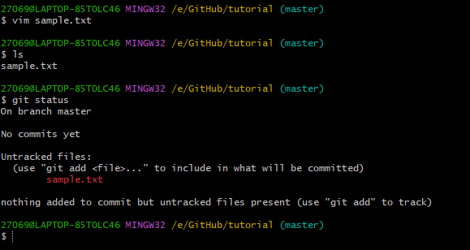
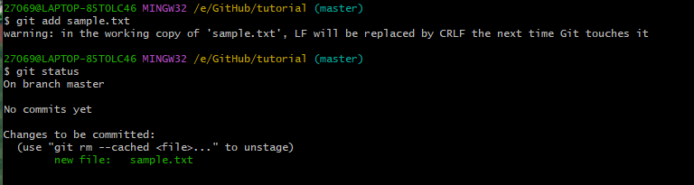
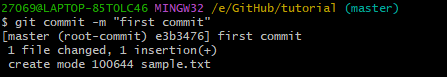
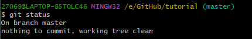
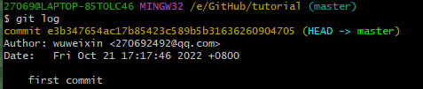

# 配置

Git的设定被存放在用户本地目录的.gitconfig档案里，也可以直接编辑配置文件

```bash
//查看某个配置
git config --global user.xxx
//修改某个配置
git config --global user.xxx " 内容"
//让Git以彩色显示
git config --global color.ui auto
//为Git命令设定别名,如把 checkout 设置为 co
git config --global alias.co checkout
```


# 新建数据库

```bash
//首先在任意一个地方创建tutorial目录。然后使用init命令把该tutorial目录移动到本地Git数据库。按照以下步骤把新创建的tutorial目录设置到Git数据库
mkdir tutorial
cd tutorial
git init
Initialized empty Git repository in E:/GitHub/tutorial/.git/
```


# 提交文件

```bash
//先创建一个文件sample.txt

//确认工作树和索引的状态
git status
```



```bash
//将文件加入到索引，指定参数.可以把所有的文件加入索引
git add <file>..
```



```bash
//提交文件
git commit -m ""
```





```bash
//使用log命令，我们可以在数据库的提交记录看到新的提交
git log
```




# 推送

```bash
//给远程数据库取一个别名.使用remote指令添加远程数据库。在<name>处输入远程数据库名称，在<url>处指定远程数据库的URL。
git remote add <name> <url>


```

