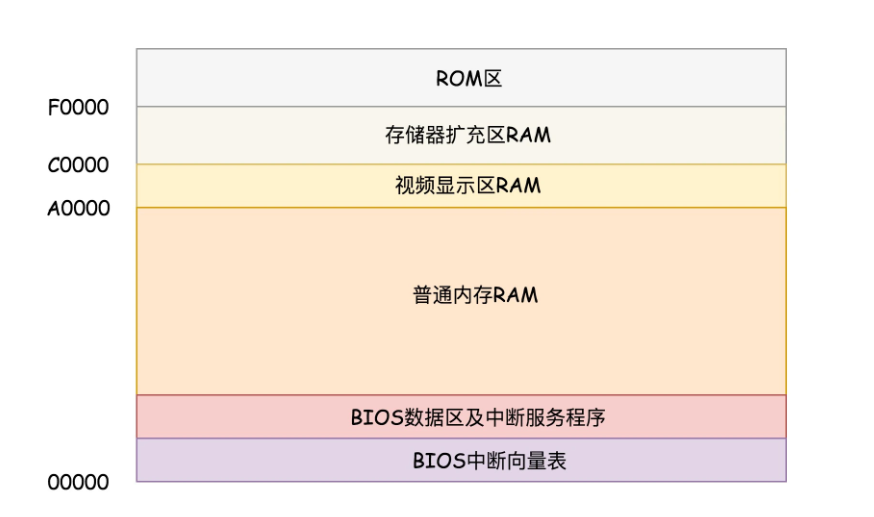
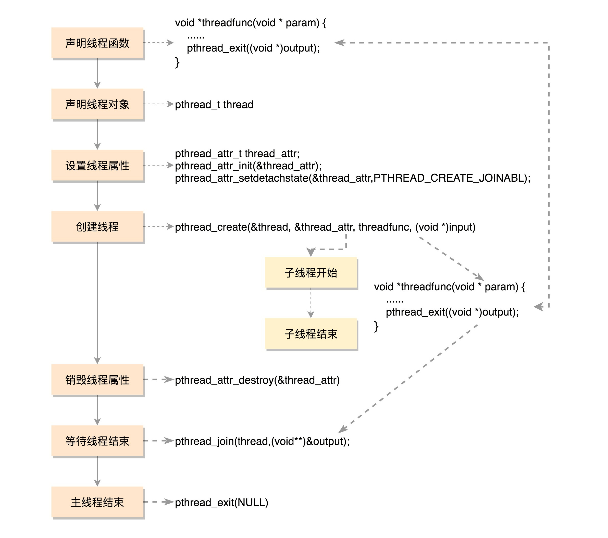
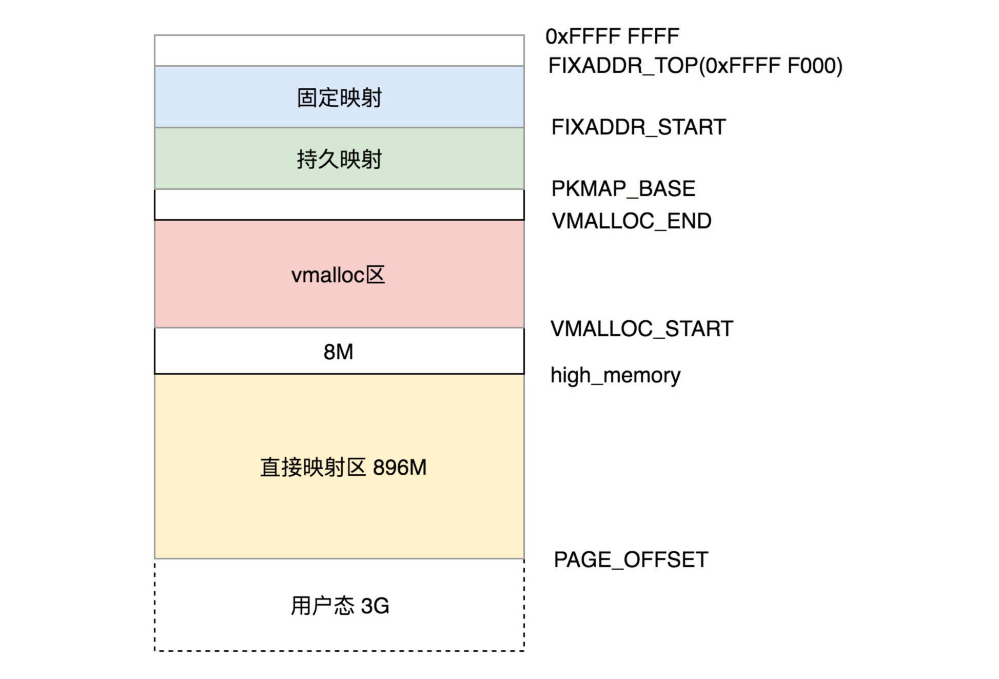
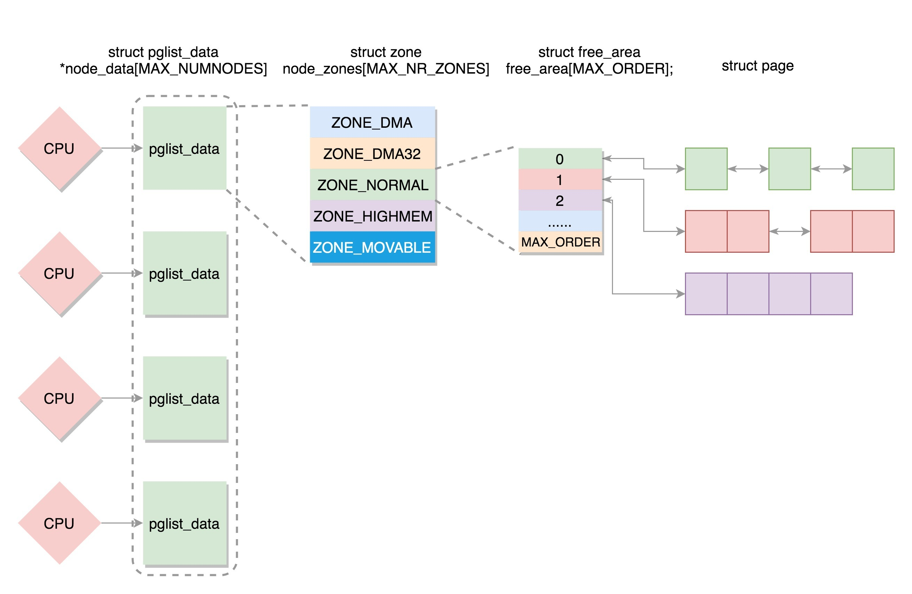
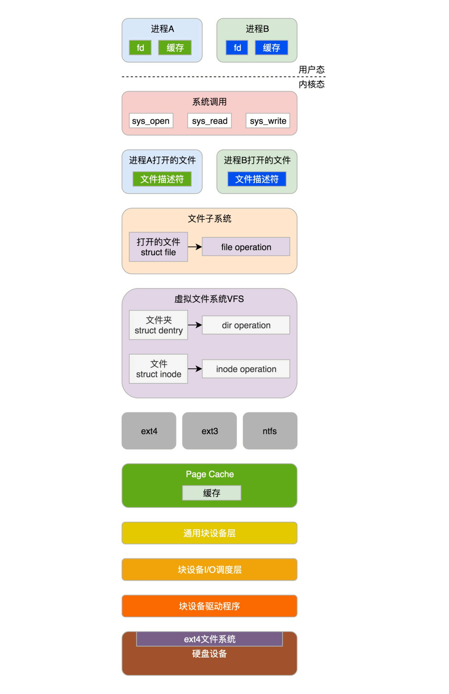
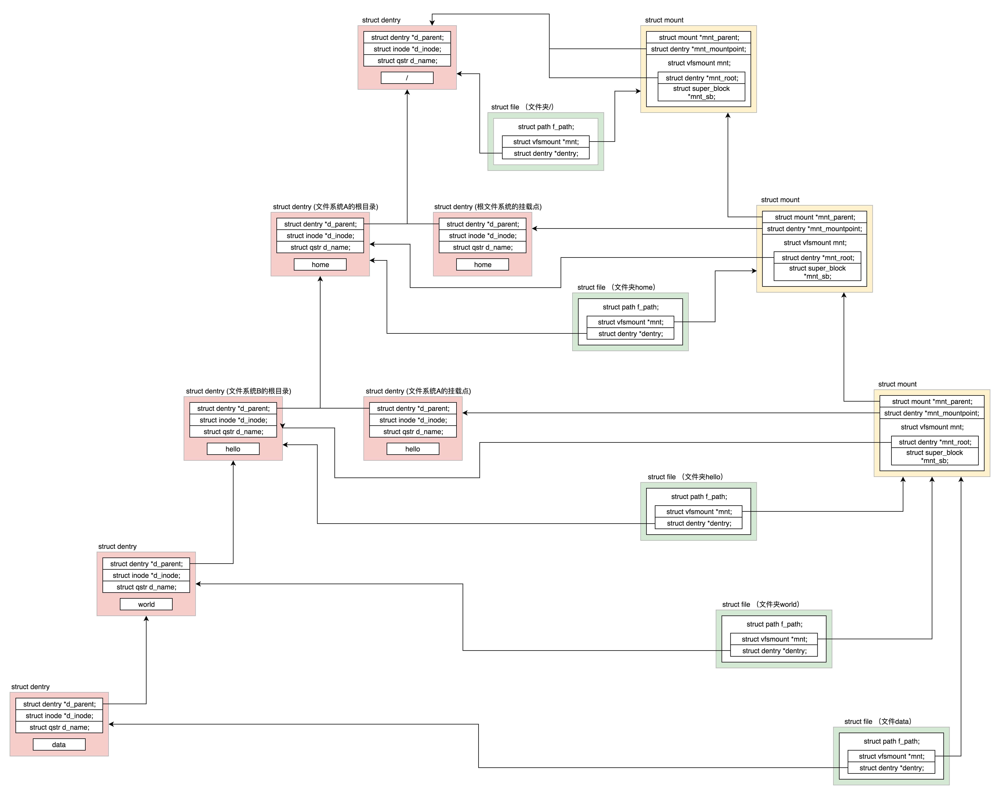
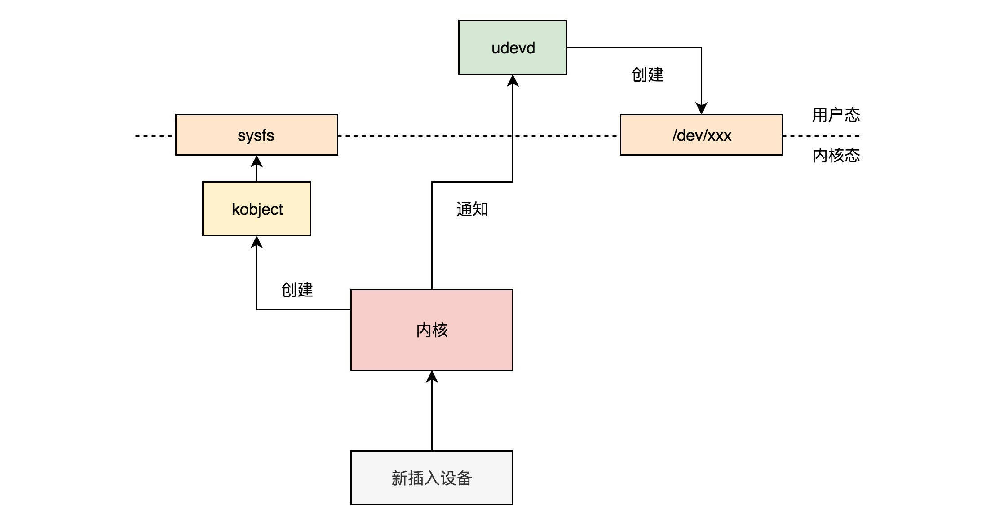

# 一 为什么要学习Linux系统

- 学习数据结构与设计模式
  - Linux内核
  - 文件操作的流程：分层设计
- 了解Linux生态
  - 数据库：MySQL、Redis
  - 消息队列：RabbitMQ、Kafka
  - 大数据
  - 虚拟化
  - 容器


学习要点

- 熟练使用命令行
- 使用Linux进行程序设计
- 了解内核机制
- 阅读内核代码
- 实验定制组件
- 生产实践


# 二 Linux操作系统综述

## 1 将内核抽象程一家外包公司


## 2 Linux命令行

### 浏览文件

```bash

# ls -l
drwxr-xr-x 6 root root    4096 Oct 20  2017 apt
-rw-r--r-- 1 root root     211 Oct 20  2017 hosts
```

其中第一个字段的第一个字符是文件类型。如果是“-”，表示普通文件；如果是 d，就表示目录。当然还有很多种文件类型。

第一个字段剩下的 9 个字符是模式，其实就是权限位（access permission bits）。3 个一组，每一组 rwx 表示“读（read）”、“写（write）”、“执行（execute）”。如果是字母，就说明有这个权限；如果是横线，就是没有这个权限。这三组分别表示文件所属的用户权限、文件所属的组权限以及其他用户的权限。例如，上面的例子中，-rw-r–r-- 就可以翻译为，这是一个普通文件，对于所属用户，可读可写不能执行；对于所属的组，仅仅可读；对于其他用户，也是仅仅可读。

第二个字段是硬链接（hard link）数目。

第三个字段是所属用户，第四个字段是所属组。第五个字段是文件的大小，第六个字段是文件被修改的日期，最后是文件名。


### 安装软件

下载 rpm 或者 deb。为什么有两种呢？因为 Linux 现在常用的有两大体系，一个是 CentOS 体系，一个是 Ubuntu 体系，前者使用 rpm，后者使用 deb。

CentOS 下面使用rpm -i jdk-XXX_linux-x64_bin.rpm进行安装，Ubuntu 下面使用dpkg -i jdk-XXX_linux-x64_bin.deb。其中 -i 就是 install 的意思

在 Linux 下面，凭借rpm -qa和dpkg -l就可以查看安装的软件列表

rpm -qa | grep jdk，这个命令是将列出来的所有软件形成一个输出。| 是管道，用于连接两个程序，前面 rpm -qa 的输出就放进管道里面，然后作为 grep 的输入，grep 将在里面进行搜索带关键词 jdk 的行，并且输出出来。grep 支持正则表达式，因此搜索的时候很灵活，再加上管道，这是一个很常用的模式。同理dpkg -l | grep jdk也是能够找到的。

如果不知道关键词，可以使用rpm -qa | more和rpm -qa | less这两个命令，它们可以将很长的结果分页展示出来。这样你就可以一个个来找了。more 是分页后只能往后翻页，翻到最后一页自动结束返回命令行，less 是往前往后都能翻页，需要输入 q 返回命令行，q 就是 quit。

如果要删除，可以用rpm -e和dpkg -r。-e 就是 erase，-r 就是 remove。

Linux 也有自己的软件管家，CentOS 下面是 yum，Ubuntu 下面是 apt-get。

关键词搜索，例如搜索jdk、yum search jdk和apt-cache search jdk，可以搜索出很多很多可以安装的 jdk 版本。如果数目太多，可以通过管道 grep、more、less 来进行过滤。选中一个之后，就可以进行安装了。可以用yum install java-11-openjdk.x86_64和apt-get install openjdk-9-jdk来进行安装。

安装以后，如何卸载呢？我们可以使用yum erase java-11-openjdk.x86_64和apt-get purge openjdk-9-jdk。

Windows 上的软件管家会有一个统一的服务端，来保存这些软件，但是我们不知道服务端在哪里。而 Linux 允许我们配置从哪里下载这些软件的，地点就在配置文件里面。

```bash
对于 CentOS 来讲，配置文件在/etc/yum.repos.d/CentOS-Base.repo里。
[base]
name=CentOS-$releasever - Base - 163.com
baseurl=http://mirrors.163.com/centos/$releasever/os/$basearch/
gpgcheck=1
gpgkey=http://mirrors.163.com/centos/RPM-GPG-KEY-CentOS-7

对于 Ubuntu 来讲，配置文件在/etc/apt/sources.list里。
deb http://mirrors.163.com/ubuntu/ xenial main restricted universe multiverse
deb http://mirrors.163.com/ubuntu/ xenial-security main restricted universe multiverse
deb http://mirrors.163.com/ubuntu/ xenial-updates main restricted universe multiverse
deb http://mirrors.163.com/ubuntu/ xenial-proposed main restricted universe multiverse
deb http://mirrors.163.com/ubuntu/ xenial-backports main restricted universe multiverse

```


vim 就像 Windows 里面的 notepad 一样，是我们第一个要学会的工具。要不然编辑、查看配置文件，这些操作你都没办法完成。vim 是一个很复杂的工具，刚上手的时候，你只需要记住几个命令就行了。

vim hello，就是打开一个文件，名字叫 hello。如果没有这个文件，就先创建一个。

我们其实就相当于打开了一个 notepad。如果文件有内容，就会显示出来。移动光标的位置，通过上下左右键就行。如果想要编辑，就把光标移动到相应的位置，输入i，意思是 insert。进入编辑模式，可以插入、删除字符，这些都和 notepad 很像。要想保存编辑的文本，我们使用esc键退出编辑模式，然后输入“:”，然后在“:”后面输入命令w，意思是 write，这样就可以保存文本，冒号后面输入q，意思是 quit，这样就会退出 vim。如果编辑了，还没保存，不想要了，可以输入q!。


### 运行程序

#### shell启动

Linux 不是根据后缀名来执行的。它的执行条件是这样的：只要文件有 x 执行权限，都能到文件所在的目录下，通过./filename运行这个程序。当然，如果放在 PATH 里设置的路径下面，就不用./ 了，直接输入文件名就可以运行了，Linux 会帮你找。

这是 Linux 执行程序最常用的一种方式，通过 shell 在交互命令行里面运行。

#### 后台运行

Linux 运行程序的第二种方式，后台运行。这个时候，我们往往使用nohup命令。这个命令的意思是 no hang up（不挂起），也就是说，当前交互命令行退出的时候，程序还要在。当然这个时候，程序不能霸占交互命令行，而是应该在后台运行。最后加一个 &，就表示后台运行。

另外一个要处理的就是输出，原来什么都打印在交互命令行里，现在在后台运行了，输出到哪里呢？输出到文件是最好的。最终命令的一般形式为nohup command >out.file 2>&1 &。这里面，“1”表示文件描述符 1，表示标准输出，“2”表示文件描述符 2，意思是标准错误输出，“2>&1”表示标准输出和错误输出合并了。合并到哪里去呢？到 out.file 里。

进程如何关闭呢？我们假设启动的程序包含某个关键字，那就可以使用下面的命令。

```bash
ps -ef |grep 关键字  |awk '{print $2}'|xargs kill -9

awk 工具可以很灵活地对文本进行处理，这里的 awk '{print $2}'是指第二列的内容，是运行的程序 ID。我们可以通过 xargs 传递给 kill -9，也就是发给这个运行的程序一个信号，让它关闭。如果你已经知道运行的程序 ID，可以直接使用 kill 关闭运行的程序。
```

#### 以服务方式启动

程序运行的第三种方式，以服务的方式运行。例如常用的数据库 MySQL，就可以使用这种方式运行。

在 Ubuntu 中，我们可以通过 apt-get install mysql-server 的方式安装 MySQL，然后通过命令systemctl start mysql启动 MySQL，通过systemctl enable mysql设置开机启动。之所以成为服务并且能够开机启动，是因为在 /lib/systemd/system 目录下会创建一个 XXX.service 的配置文件，里面定义了如何启动、如何关闭。


### 总结


自己知道想干什么，但不知道哪个命令可以干怎么办？我们可以通过man -k key1|grep key2| grep  key...进行搜索，man -k 或apropos是我认为学习linux命令优先掌握的命令，这样你就可以自己搜索了，相当于google,baidu


## 3 学会几个系统调用：公司能接哪些类型的项目

客户要想办理业务（或项目）应该去办事大厅，也就是说客户写的程序应该使用**系统调用**

### 立项服务与进程管理

首先，我们得有个项目，那就要有立项服务。对应到 Linux 操作系统中就是创建进程。在 Linux 里，要创建一个新的进程，需要一个老的进程调用 fork 来实现，其中老的进程叫作父进程（Parent Process），新的进程叫作子进程。

当父进程调用 fork 创建进程的时候，子进程将各个子系统为父进程创建的数据结构也全部拷贝了一份，甚至连程序代码也是拷贝过来的。按理说，如果不进行特殊的处理，父进程和子进程都按相同的程序代码进行下去，这样就没有意义了。

对于 fork 系统调用的返回值，如果当前进程是子进程，就返回 0；如果当前进程是父进程，就返回子进程的进程号。这样首先在返回值这里就有了一个区分，然后通过 if-else 语句判断，如果是父进程，还接着做原来应该做的事情；如果是子进程，需要请求另一个系统调用execve来执行另一个程序，这个时候，子进程和父进程就彻底分道扬镳了，也就产生了一个分支（fork）了。


### 会议室管理与内存管理

在操作系统中，每个进程都有自己的内存，互相之间不干扰，有独立的进程内存空间。

对于进程的内存空间来讲，放程序代码的这部分，我们称为代码段（Code Segment）。

放进程运行中产生数据的这部分，我们称为数据段（Data Segment）。其中局部变量的部分，在当前函数执行的时候起作用，当进入另一个函数时，这个变量就释放了；也有动态分配的，会较长时间保存，指明才销毁的，这部分称为堆（Heap）。

介绍两个在堆里面分配内存的系统调用，brk和mmap。

当分配的内存数量比较小的时候，使用 brk，会和原来的堆的数据连在一起，这就像多分配两三个工位，在原来的区域旁边搬两把椅子就行了。当分配的内存数量比较大的时候，使用 mmap，会重新划分一块区域，也就是说，当办公空间需要太多的时候，索性来个一整块。


### 档案库管理与文件管理

对于文件的操作，下面这六个系统调用是最重要的：

- 对于已经有的文件，可以使用open打开这个文件，close关闭这个文件；
- 对于没有的文件，可以使用creat创建文件；
- 打开文件以后，可以使用lseek跳到文件的某个位置；
- 可以对文件的内容进行读写，读的系统调用是read，写是write。

Linux 里有一个特点，那就是一切皆文件。

- 启动一个进程，需要一个程序文件，这是一个**二进制文件**。
- 启动的时候，要加载一些配置文件，例如 yml、properties 等，这是**文本文件**；
- 启动之后会打印一些日志，如果写到硬盘上，也是文本文件。
- 但是如果我想把日志打印到交互控制台上，在命令行上唰唰地打印出来，这其实也是一个文件，是标准输出 **stdout 文件**。
- 这个进程的输出可以作为另一个进程的输入，这种方式称为管道，**管道**也是一个文件。
- 进程可以通过网络和其他进程进行通信，建立的 **Socket**，也是一个文件。
- 进程需要访问外部设备，**设备**也是一个文件。
- 文件都被存储在文件夹里面，其实**文件夹**也是一个文件。
- 进程运行起来，要想看到进程运行的情况，会在 /proc 下面有对应的进程号，还是一系列文件。

每个文件，Linux 都会分配一个文件描述符（File Descriptor），这是一个整数。有了这个文件描述符，我们就可以使用系统调用，查看或者干预进程运行的方方面面。所以说，文件操作是贯穿始终的，这也是“一切皆文件”的优势，就是统一了操作的入口，提供了极大的便利。


### 项目异常处理与信号处理

经常遇到的信号有以下几种：

- 在执行一个程序的时候，在键盘输入“CTRL+C”，这就是中断的信号，正在执行的命令就会中止退出；
- 非法访问内存；
- 硬件故障，设备出了问题；
- 用户进程通过kill函数，将一个用户信号发送给另一个进程。

对于一些不严重的信号，可以忽略，该干啥干啥，但是像 SIGKILL（用于终止一个进程的信号）和 SIGSTOP（用于中止一个进程的信号）是不能忽略的，可以执行对于该信号的默认动作。每种信号都定义了默认的动作，例如硬件故障，默认终止；也可以提供信号处理函数，可以通过sigaction系统调用，注册一个信号处理函数。提供了信号处理服务，项目执行过程中一旦有变动，就可以及时处理了。


### 项目组间沟通与进程间通信

- 消息队列。msgget、msgsnd、msgrcv
- 共享内存。shmget、shmat
- 信号量。保证共享内存的安全访问


### 公司间沟通与网络通信

Socket通信


### 查看源代码中的系统调用

https://www.kernel.org下载一份 Linux 内核源代码


### 总结


一、 

创建进程的总结：

1、Linux中父进程调用fork创建子进程。 

2、父进程调用fork时，子进程拷贝所有父进程的数据接口和代码过来。 

3、当前进程是子进程，fork返回0；当前进程是父进程，fork返回子进程进程号 

4、如果返回0，说明当前进程是子进程，子进程请求execve系统调用，执行另一个程序。 

5、如果返回子进程号，说明当前进程是父进程，按照原父进程原计划执行。 

6、父进程要对子进程负责，调用waitpid将子进程进程号作为参数，父进程就能知道子进程运行完了没有，成功与否。 

7、操作系统启动的时候先创建了一个所有用户进程的“祖宗进程” 

二、 内存管理总结 

1、每个进程都有独立的进程内存空间，互相之间不干扰。（隔离性） 

2、进程内存空间，存放程序代码的部分，称为代码段（Code Segment）。 

3、存放进程运行中产生数据的部分，称为数据段（Data Segment）。 

4、进程写入数据的时候，现用现分物理内存给进程使用。 

5、分配内存数量比较小时，使用brk调用，会和原来的堆数据连在一起。 

6、需要分配的内存数据量比较大的时候，使用mmap，重新划分一块内存区域。

三、 文件管理 

 文件的操作六个最重要系统调用： 

打开文件：open 

关闭文件：close 

创建文件：creat 

打开文件后跳到文件某个位置：lseek 

读文件：read 

写文件：write 

Linux一切皆文件 ：一切皆文件的优势即使统一了操作的入口，提供了极大的便利。 

四、 信号处理（异常处理） 

进程执行过程中一旦有变动，就可以通过信号处理服务及时处理。 

五、 进程间通信 

有两种方式实现进程间通信

消息队列方式：

创建一个新的队列：msgget ；发送消息到消息队列：msgsnd ；取出队列中的消息：msgrcv 

共享内存方式 ：

创建共享内存块：shmget ； 将共享内存映射到自己的内存空间：shmat ；

利用信号量实现隔离性 ： 占用信号量：sem_wait ；释放信号量：sem_post 

七、 网络通信 

网络插口：socket ： 网络通信遵循TCP/IP网络协议栈 

八、 glibc 

glibc是Linux下开源标准C库 

glibc把系统调用进一步封

sys_open对应glibc的open函数

一个单独的glibcAPI可能调用多个系统调用

printf函数调用sys_open、sys_mmap、sys_write、sys_close等等系统调用


# 三 系统初始化


## 1 架构的演变

### 计算器组成


### x86架构

数据单元

为了暂存数据，8086 处理器内部有 8 个 16 位的通用寄存器，分别是 AX、BX、CX、DX、SP、BP、SI、DI。这些寄存器主要用于在计算过程中暂存数据。

控制单元

IP 寄存器就是指令指针寄存器（Instruction Pointer Register)，指向代码段中下一条指令的位置。CPU 会根据它来不断地将指令从内存的代码段中，加载到 CPU 的指令队列中，然后交给运算单元去执行。

每个进程都分代码段和数据段，为了指向不同进程的地址空间，有四个 16 位的段寄存器，分别是 CS、DS、SS、ES。


### 32位处理器

首先，通用寄存器有扩展，可以将 8 个 16 位的扩展到 8 个 32 位的，但是依然可以保留 16 位的和 8 位的使用方式。

其中，指向下一条指令的指令指针寄存器 IP，就会扩展成 32 位的，同样也兼容 16 位的。


CS、SS、DS、ES 仍然是 16 位的，但是不再是段的起始地址。段的起始地址放在内存的某个表格，表格中的一项一项是段描述符（Segment Descriptor）。这里面才是真正的段的起始地址。而段寄存器里面保存的是在这个表格中的哪一项，称为选择子（Selector）。这样，将一个从段寄存器直接拿到的段起始地址，就变成了先间接地从段寄存器找到表格中的一项，再从表格中的一项中拿到段起始地址。

到了 32 位的系统架构下，我们将前一种模式称为实模式（Real Pattern），后一种模式称为保护模式（Protected Pattern）。当系统刚刚启动的时候，CPU 是处于实模式的，这个时候和原来的模式是兼容的。当需要更多内存的时候，可以遵循一定的规则，进行一系列的操作，然后切换到保护模式，就能够用到 32 位 CPU 更强大的能力。


### 总结


## 2 从BIOS到bootloader

x86 有两种模式，一种模式是实模式，只能寻址 1M，每个段最多 64K。这个太小了，相当于咱们创业的个体户模式。有了项目只能老板自己上，本小利微，万事开头难。另一种是保护模式，对于 32 位系统，能够寻址 4G。这就是大买卖了，老板要雇佣很多人接项目。


### BIOS

在主板上，有一个东西叫 ROM（Read Only Memory，只读存储器）。上面早就固化了一些初始化的程序，也就是 BIOS（Basic Input and Output System，基本输入输出系统）。

在 x86 系统中，将 1M 空间最上面的 0xF0000 到 0xFFFFF 这 64K 映射给 ROM，也就是说，到这部分地址访问的时候，会访问 ROM。



当电脑刚加电的时候，会做一些重置的工作，将 CS 设置为 0xFFFF，将 IP 设置为 0x0000，所以第一条指令就会指向 0xFFFF0，正是在 ROM 的范围内。在这里，有一个 JMP 命令会跳到 ROM 中做初始化工作的代码，于是，BIOS 开始进行初始化的工作。

BIOS程序：

- 检查系统硬件
- 提供系统调用
- 寻找操作系统


### bootloader

操作系统一般会安装在硬盘上，在 BIOS 的界面上。你会看到一个启动盘的选项。启动盘有什么特点呢？它一般在第一个扇区，占 512 字节，而且以 0xAA55 结束。这是一个约定，当满足这个条件的时候，就说明这是一个启动盘，在 512 字节以内会启动相关的代码。

在 Linux 里面有一个工具，叫 Grub2，全称 Grand Unified Bootloader Version 2。

可以通过 grub2-mkconfig -o /boot/grub2/grub.cfg 来配置系统启动的选项。你可以看到里面有类似这样的配置。

使用 grub2-install /dev/sda，可以将启动程序安装到相应的位置。

grub2 第一个要安装的就是 boot.img。它由 boot.S 编译而成，一共 512 字节，正式安装到启动盘的第一个扇区。这个扇区通常称为 MBR（Master Boot Record，主引导记录 / 扇区）。

BIOS 完成任务后，会将 boot.img 从硬盘加载到内存中的 0x7c00 来运行。

由于 512 个字节实在有限，boot.img 做不了太多的事情。它能做的最重要的一个事情就是加载 grub2 的另一个镜像 core.img。

core.img 由 lzma_decompress.img、diskboot.img、kernel.img 和一系列的模块组成，功能比较丰富，能做很多事情。


boot.img 先加载的是 core.img 的第一个扇区。如果从硬盘启动的话，这个扇区里面是 diskboot.img，对应的代码是 diskboot.S。

boot.img 将控制权交给 diskboot.img 后，diskboot.img 的任务就是将 core.img 的其他部分加载进来，先是解压缩程序 lzma_decompress.img，再往下是 kernel.img，最后是各个模块 module 对应的映像。这里需要注意，它不是 Linux 的内核，而是 grub 的内核。

lzma_decompress.img 对应的代码是 startup_raw.S，本来 kernel.img 是压缩过的，现在执行的时候，需要解压缩。

在这之前，我们所有遇到过的程序都非常非常小，完全可以在实模式下运行，但是随着我们加载的东西越来越大，实模式这 1M 的地址空间实在放不下了，所以在真正的解压缩之前，lzma_decompress.img 做了一个重要的决定，就是调用 real_to_prot，切换到保护模式，这样就能在更大的寻址空间里面，加载更多的东西。


### 从实模式切换到保护模式

切换到保护模式要干很多工作，大部分工作都与内存的访问方式有关。

- 第一项是启用分段，就是在内存里面建立段描述符表，将寄存器里面的段寄存器变成段选择子，指向某个段描述符，这样就能实现不同进程的切换了。
- 第二项是启动分页。能够管理的内存变大了，就需要将内存分成相等大小的块
- 打开 Gate A20，也就是第 21 根地址线的控制线

接下来对压缩过的 kernel.img 进行解压缩，然后跳转到 kernel.img 开始运行。

- kernel.img 对应的代码是 startup.S 以及一堆 c 文件，在 startup.S 中会调用 grub_main，这是 grub kernel 的主函数。
- 开始解析grub_load_config() 
- 如果是正常启动，grub_main 最后会调用 grub_command_execute (“normal”, 0, 0)，最终会调用 grub_normal_execute() 函数。在这个函数里面，grub_show_menu() 会显示出让你选择的那个操作系统的列表。


### 总结


## 3 内核初始化

内核的启动从入口函数 start_kernel() 开始。在 init/main.c 文件中，start_kernel 相当于内核的 main 函数。里面是各种各样初始化函数 XXXX_init


### 初始化职能部门


#### 进程管理（项目管理部门）

系统创建的第一个进程，称为0号进程。这是唯一一个没有通过fork或者kernel_thread产生的进程。

```c
//这个init_task就是0号进程
set_task_stack_end_magic(&init_task)
    
struct task_struct init_task = INIT_TASK(init_task)
```


#### 系统调用（办事大厅）

trap_init()，里面设置了很多中断门（Interrupt Gate），用于处理各种中断。

其中有一个 set_system_intr_gate(IA32_SYSCALL_VECTOR, entry_INT80_32)，这是系统调用的中断门。


#### 内存管理（会议室管理系统）

mm_init() 就是用来初始化内存管理模块。


#### 调度管理

项目需要项目管理进行调度，需要执行一定的调度策略。sched_init() 就是用于初始化调度模块。


#### 文件系统

vfs_caches_init() 会用来初始化基于内存的文件系统 rootfs。


### 初始化1号进程

rest_init 的第一大工作是，用 kernel_thread(kernel_init, NULL, CLONE_FS) 创建第二个进程，这个是 1 号进程。

1号进程将会运行第一个用户进程，有了用户线程操作系统就要区分内核态和用户态。

x86提供了分层的权限机制，把区域分成了四个ring


操作系统很好地利用了这个机制，将能够访问关键资源的代码放在 Ring0，我们称为内核态（Kernel Mode）；将普通的程序代码放在 Ring3，我们称为用户态（User Mode）

保护模式除了可访问的空间变大，还起到了保护的作用，保护核心代码不会被用户随意接触


### 创建2号进程

rest_init 第二大事情就是第三个进程，就是 2 号进程。kernel_thread(kthreadd, NULL, CLONE_FS | CLONE_FILES)


### 小结

内核的初始化过程，主要做了三件事

- 各个职能的创建（进程列表、内存管理、调度管理、VFS）
- 创建1号进程（用户态祖先进程）
- 创建2号进程（内核太祖先进程）


## 4 系统调用

系统调用的过程

- 用户态调用函数，保存参数到寄存器，将系统调用名称转化为系统调用号
- 进入内核
- 保存寄存器到内核数据结构struct pt_regs
- 在系统调用表里面找到相应的函数
- 系统调用实现函数
- 返回值返回


# 四 进程管理


## 1 进程

有了系统调用，就可以创建进程了


### 写代码：用系统调用创建进程

在 Linux 上写程序和编译程序，也需要一系列的开发套件。运行下面的命令，就可以在 centOS 7 操作系统上安装开发套件

```c
//yum是centos的软件管家
yum -y groupinstall "Development Tools"
```

再Linux上，用Vim来创建并编辑一个文件，里面用函数封装通用的创建进程的逻辑

```c
	//process.c
    #include <stdio.h>
    #include <stdlib.h>
    #include <sys/types.h>
    #include <unistd.h>
    
    
    extern int create_process (char* program, char** arg_list);
    
    //创建一个子进程去执行文件program的程序，arg_list是参数列表
    int create_process (char* program, char** arg_list)
    {
        pid_t child_pid;
        //fork函数，返回值小于0说明异常；等于0说明是子进程；大于0是父进程
        child_pid = fork ();
        if (child_pid != 0)
            return child_pid;
        else {
            //通过 execvp 运行一个新的程序
            //int execvp(const char *file ,char * const argv []);
            //execvp()会从PATH 环境变量所指的目录中查找符合参数file 的文件名，找到后便执行该文件，然后将第二个参数argv传给该欲执行的文件。
            execvp (program, arg_list);
            abort ();
        }
   }
```

创建第二个文件，调用上面这个函数，执行一个ls命令

```c

#include <stdio.h>
#include <stdlib.h>
#include <sys/types.h>
#include <unistd.h>

extern int create_process (char* program, char** arg_list);

int main ()
{
    char* arg_list[] = {
        "ls",
        "-l",
        "/etc/yum.repos.d/",
        NULL
    };
    create_process ("ls", arg_list);
    return 0;
}
```


### 进行编译：程序的二进制格式

上面两个都是文本文件，CPU无法执行。只有将其编译成二进制文件，CPU才能执行。在Linux下，二进制的程序的格式为ELF。这个格式可以根据编译的结果不同，分为不同的格式。


编译程序

```shell
gcc -c -fPIC process.c
gcc -c -fPIC createprocess.c
```

在编译的时候，先做预处理工作，例如将头文件嵌入到正文中，将定义的宏展开，然后就是真正的编译过程，最终编译成为.o 文件，这就是 ELF 的第一种类型，可重定位文件（Relocatable File）。


ELF 文件的头是用于描述整个文件的。这个文件格式在内核中有定义，分别为 struct elf32_hdr 和 struct elf64_hdr。

接下来我们来看一个一个的 section，我们也叫节。

- .text：放编译好的二进制可执行代码
- .data：已经初始化好的全局变量
- .rodata：只读数据，例如字符串常量、const 的变量
- .bss：未初始化全局变量，运行时会置 0
- .symtab：符号表，记录的则是函数和变量
- .strtab：字符串表、字符串常量和变量名


ELF的第二种格式，经过静态链接的.a文件

```c
ar cr libstaticprocess.a process.o
    
//虽然这里 libstaticprocess.a 里面只有一个.o，但是实际情况可以有多个.o。当有程序要使用这个静态连接库的时候，会将.o 文件提取出来，链接到程序中。
gcc -o staticcreateprocess createprocess.o -L. -lstaticprocess
```

形成的可执行文件如图所示


这个格式和.o 文件大致相似，还是分成一个个的 section，并且被节头表描述。只不过这些 section 是多个.o 文件合并过的。但是这个时候，这个文件已经是马上就可以加载到内存里面执行的文件了，因而这些 section 被分成了需要加载到内存里面的代码段、数据段和不需要加载到内存里面的部分，将小的 section 合成了大的段 segment，并且在最前面加一个段头表（Segment Header Table）。

静态链接库一旦链接进去，代码和变量的 section 都合并了，因而程序运行的时候，就不依赖于这个库是否存在。但是这样有一个缺点，就是相同的代码段，如果被多个程序使用的话，在内存里面就有多份，而且一旦静态链接库更新了，如果二进制执行文件不重新编译，也不随着更新。


动态链接库，就是 ELF 的第三种类型，共享对象文件（Shared Object）。

```c

gcc -shared -fPIC -o libdynamicprocess.so process.o
    

gcc -o dynamiccreateprocess createprocess.o -L. -ldynamicprocess
```

当一个动态链接库被链接到一个程序文件中的时候，最后的程序文件并不包括动态链接库中的代码，而仅仅包括对动态链接库的引用，并且不保存动态链接库的全路径，仅仅保存动态链接库的名称。

当运行这个程序的时候，首先寻找动态链接库，然后加载它。默认情况下，系统在 /lib 和 /usr/lib 文件夹下寻找动态链接库。

基于动态链接库创建出来的二进制文件格式还是 ELF，但是稍有不同。

首先，多了一个.interp 的 Segment，这里面是 ld-linux.so，这是动态链接器，也就是说，运行时的链接动作都是它做的。

另外，ELF 文件中还多了两个 section，一个是.plt，过程链接表（Procedure Linkage Table，PLT），一个是.got.plt，全局偏移量表（Global Offset Table，GOT）。

将so文件动态链接到进程空间的工作流程：

dynamiccreateprocess 这个程序要调用 libdynamicprocess.so 里的 create_process 函数。由于是运行时才去找，编译的时候，压根不知道这个函数在哪里，所以就在 PLT 里面建立一项 PLT[x]。这一项也是一些代码，有点像一个本地的代理，在二进制程序里面，不直接调用 create_process 函数，而是调用 PLT[x]里面的代理代码，这个代理代码会在运行的时候找真正的 create_process 函数。去哪里找代理代码呢？这就用到了 GOT，这里面也会为 create_process 函数创建一项 GOT[y]。这一项是运行时 create_process 函数在内存中真正的地址。如果这个地址在 dynamiccreateprocess 调用 PLT[x]里面的代理代码，代理代码调用 GOT 表中对应项 GOT[y]，调用的就是加载到内存中的 libdynamicprocess.so 里面的 create_process 函数了。但是 GOT 怎么知道的呢？对于 create_process 函数，GOT 一开始就会创建一项 GOT[y]，但是这里面没有真正的地址，因为它也不知道，但是它有办法，它又回调 PLT，告诉它，你里面的代理代码来找我要 create_process 函数的真实地址，我不知道，你想想办法吧。PLT 这个时候会转而调用 PLT[0]，也即第一项，PLT[0]转而调用 GOT[2]，这里面是 ld-linux.so 的入口函数，这个函数会找到加载到内存中的 libdynamicprocess.so 里面的 create_process 函数的地址，然后把这个地址放在 GOT[y]里面。下次，PLT[x]的代理函数就能够直接调用了。


### 运行程序为进程

在内核中，有这样一个数据结构，用来定义加载二进制文件的方法。

```c

struct linux_binfmt {
        struct list_head lh;
        struct module *module;
        int (*load_binary)(struct linux_binprm *);
        int (*load_shlib)(struct file *);
        int (*core_dump)(struct coredump_params *cprm);
        unsigned long min_coredump;     /* minimal dump size */
} __randomize_layout;
```

ELF文件格式

```c

static struct linux_binfmt elf_format = {
        .module         = THIS_MODULE,
        .load_binary    = load_elf_binary,
        .load_shlib     = load_elf_library,
        .core_dump      = elf_core_dump,
        .min_coredump   = ELF_EXEC_PAGESIZE,
};
```

exec 比较特殊，它是一组函数：

- 包含 p 的函数（execvp, execlp）会在 PATH 路径下面寻找程序；
- 不包含 p 的函数需要输入程序的全路径；
- 包含 v 的函数（execv, execvp, execve）以数组的形式接收参数；
- 包含 l 的函数（execl, execlp, execle）以列表的形式接收参数；
- 包含 e 的函数（execve, execle）以数组的形式接收环境变量。


### 进程树

既然所有的进程都是从父进程 fork 过来的，那总归有一个祖宗进程，这就是系统启动的 init 进程。


在解析 Linux 的启动过程的时候，1 号进程是 /sbin/init。如果在 centOS 7 里面，我们 ls 一下，可以看到，这个进程是被软链接到 systemd 的。


系统启动之后，init 进程会启动很多的 daemon 进程，为系统运行提供服务，然后就是启动 getty，让用户登录，登录后运行 shell，用户启动的进程都是通过 shell 运行的，从而形成了一棵进程树。我们可以通过 ps -ef 命令查看当前系统启动的进程，我们会发现有三类进程。

```

[root@deployer ~]# ps -ef
UID        PID  PPID  C STIME TTY          TIME CMD
root         1     0  0  2018 ?        00:00:29 /usr/lib/systemd/systemd --system --deserialize 21
root         2     0  0  2018 ?        00:00:00 [kthreadd]
root         3     2  0  2018 ?        00:00:00 [ksoftirqd/0]
root         5     2  0  2018 ?        00:00:00 [kworker/0:0H]
root         9     2  0  2018 ?        00:00:40 [rcu_sched]
......
root       337     2  0  2018 ?        00:00:01 [kworker/3:1H]
root       380     1  0  2018 ?        00:00:00 /usr/lib/systemd/systemd-udevd
root       415     1  0  2018 ?        00:00:01 /sbin/auditd
root       498     1  0  2018 ?        00:00:03 /usr/lib/systemd/systemd-logind
......
root       852     1  0  2018 ?        00:06:25 /usr/sbin/rsyslogd -n
root      2580     1  0  2018 ?        00:00:00 /usr/sbin/sshd -D
root     29058     2  0 Jan03 ?        00:00:01 [kworker/1:2]
root     29672     2  0 Jan04 ?        00:00:09 [kworker/2:1]
root     30467     1  0 Jan06 ?        00:00:00 /usr/sbin/crond -n
root     31574     2  0 Jan08 ?        00:00:01 [kworker/u128:2]
......
root     32792  2580  0 Jan10 ?        00:00:00 sshd: root@pts/0
root     32794 32792  0 Jan10 pts/0    00:00:00 -bash
root     32901 32794  0 00:01 pts/0    00:00:00 ps -ef
```

PID 1 的进程就是我们的 init 进程 systemd，PID 2 的进程是内核线程 kthreadd，这两个我们在内核启动的时候都见过。其中用户态的不带中括号，内核态的带中括号。

接下来进程号依次增大，但是你会看所有带中括号的内核态的进程，祖先都是 2 号进程。而用户态的进程，祖先都是 1 号进程。tty 那一列，是问号的，说明不是前台启动的，一般都是后台的服务。

pts 的父进程是 sshd，bash 的父进程是 pts，ps -ef 这个命令的父进程是 bash。这样整个链条都比较清晰了。

### 总结


对于 ELF，有几个工具能帮你看这些文件的格式。readelf 工具用于分析 ELF 的信息，objdump 工具用来显示二进制文件的信息，hexdump 工具用来查看文件的十六进制编码，nm 工具用来显示关于指定文件中符号的信息。

## 2 线程

多进程的缺点：

- 占用的资源较多
- 进程之间的通信需要跨越不同的内存空间，无法共享

### 线程的创建

多线程下载文件实例代码

```c

#include <pthread.h>
#include <stdio.h>
#include <stdlib.h>

#define NUM_OF_TASKS 5

void *downloadfile(void *filename)
{
   printf("I am downloading the file %s!\n", (char *)filename);
   sleep(10);
   long downloadtime = rand()%100;
   printf("I finish downloading the file within %d minutes!\n", downloadtime);
   pthread_exit((void *)downloadtime);
}

int main(int argc, char *argv[])
{
   char files[NUM_OF_TASKS][20]={"file1.avi","file2.rmvb","file3.mp4","file4.wmv","file5.flv"};
   pthread_t threads[NUM_OF_TASKS];
   int rc;
   int t;
   int downloadtime;

   pthread_attr_t thread_attr;
   pthread_attr_init(&thread_attr);
   pthread_attr_setdetachstate(&thread_attr,PTHREAD_CREATE_JOINABLE);

   for(t=0;t<NUM_OF_TASKS;t++){
     printf("creating thread %d, please help me to download %s\n", t, files[t]);
     rc = pthread_create(&threads[t], &thread_attr, downloadfile, (void *)files[t]);
     if (rc){
       printf("ERROR; return code from pthread_create() is %d\n", rc);
       exit(-1);
     }
   }

   pthread_attr_destroy(&thread_attr);

   for(t=0;t<NUM_OF_TASKS;t++){
     pthread_join(threads[t],(void**)&downloadtime);
     printf("Thread %d downloads the file %s in %d minutes.\n",t,files[t],downloadtime);
   }

   pthread_exit(NULL);
}
```

编译

```c
gcc download.c -lpthread
```

结果

```c

# ./a.out
creating thread 0, please help me to download file1.avi
creating thread 1, please help me to download file2.rmvb
I am downloading the file file1.avi!
creating thread 2, please help me to download file3.mp4
I am downloading the file file2.rmvb!
creating thread 3, please help me to download file4.wmv
I am downloading the file file3.mp4!
creating thread 4, please help me to download file5.flv
I am downloading the file file4.wmv!
I am downloading the file file5.flv!
I finish downloading the file within 83 minutes!
I finish downloading the file within 77 minutes!
I finish downloading the file within 86 minutes!
I finish downloading the file within 15 minutes!
I finish downloading the file within 93 minutes!
Thread 0 downloads the file file1.avi in 83 minutes.
Thread 1 downloads the file file2.rmvb in 86 minutes.
Thread 2 downloads the file file3.mp4 in 77 minutes.
Thread 3 downloads the file file4.wmv in 93 minutes.
Thread 4 downloads the file file5.flv in 15 minutes.
```



### 线程的数据

线程访问的数据分为三类：

- 线程栈上的本地数据，比如函数执行过程中的局部变量。的大小可以通过命令 ulimit -a 查看，默认情况下线程栈大小为 8192（8MB）。主线程在内存中有一个栈空间，其他线程栈也拥有独立的栈空间。为了避免线程之间的栈空间踩踏，线程栈之间还会有小块区域，用来隔离保护各自的栈空间。一旦另一个线程踏入到这个隔离区，就会引发段错误。

- 在整个进程里共享的全局数据。例如全局变量，虽然在不同进程中是隔离的，但是在一个进程中是共享的。

- 线程私有数据，可以通过pthread_key_create创建。

  ```c
  int pthread_key_create(pthread_key_t *key, void (*destructor)(void*))
  ```

  key 一旦被创建，所有线程都可以访问它，但各线程可根据自己的需要往 key 中填入不同的值，这就相当于提供了一个同名而不同值的全局变量。相当于Java中的ThreadLocal。而等到线程退出的时候，就会调用析构函数释放 value。


### 数据保护

共享数据保护

Mutex。它的模式就是在共享数据访问的时候，去申请加把锁，谁先拿到锁，谁就拿到了访问权限

- 使用 Mutex，首先要使用 pthread_mutex_init 函数初始化这个 mutex，初始化后，就可以用它来保护共享变量了。
- pthread_mutex_lock() 就是去抢那把锁的函数，如果抢到了，就可以执行下一行程序，对共享变量进行访问；如果没抢到，就被阻塞在那里等待。
- 如果不想被阻塞，可以使用 pthread_mutex_trylock 去抢那把锁，如果抢到了，就可以执行下一行程序，对共享变量进行访问；如果没抢到，不会被阻塞，而是返回一个错误码。
- 当共享数据访问结束了，使用 pthread_mutex_unlock 释放锁，让给其他人使用，最终调用 pthread_mutex_destroy 销毁掉这把锁。
- 当线程获取临界资源未获得锁时，是循环持续尝试获取锁？还是一直等待？ 答案是等待通知模式，在java中实现方式是wait notify，在linux底层实现是pthread_cond_wait、pthread_cond_notify


线程复制执行二进制指令

多进程缺点: 创建进程占用资源多; 进程间通信需拷贝内存, 不能共享

线程相关操作

- pthread_exit(A), A 是线程退出的返回值
- pthread_attr_t 线程属性, 用辅助函数初始化并设置值; 用完需要销毁
- pthread_create 创建线程, 四个参数(线程对象, 属性, 运行函数, 运行参数)
- pthread_join 获取线程退出返回值, 多线程依赖 libpthread.so
- 一个线程退出, 会发送信号给 其他所有同进程的线程

线程中有三类数据

- 程栈本地数据, 栈大小默认 8MB; 线程栈之间有保护间隔, 若误入会引发段错误
- 进程共享的全局数据
- 线程级别的全局变量(线程私有数据, pthread_key_create(key, destructer)); key 所有线程都可以访问, 可填入各自的值(同名不同值的全局变量)

数据保护 

- Mutex(互斥), 初始化; lock(没抢到则阻塞)/trylock(没抢到则返回错误码); unlock; destroy
- 条件变量(通知), 收到通知, 还是要抢锁(由 wait 函数执行); 因此条件变量与互斥锁配合使用
- 互斥锁所谓条件变量的参数, wait 函数会自动解锁/加锁
- broadcast(通知); destroy

## 3 进程数据结构

在Linux中，进程和线程都统一叫任务，由统一的结构**task_struct**进行管理。

Linux通过链表的形式将任务组织起来

```c
struct list_head    tasks;
```

### 任务包含的字段

- 任务ID

  ```c
  //任何一个进程，如果只有主线程，那 pid 是自己，tgid 是自己，group_leader 指向的还是自己
  //如果一个进程创建了其他线程，那就会有所变化了。线程有自己的 pid，tgid 就是进程的主线程的 pid，group_leader 指向的就是进程的主线程
  pid_t pid;
  pid_t tgid;
  struct task_struct *group_leader; 
  ```

- 信号处理

  ```c
  //定义了哪些信号被阻塞暂不处理（blocked），哪些信号尚等待处理（pending），哪些信号正在通过信号处理函数进行处理（sighand）。处理的结果可以是忽略，可以是结束进程等等
  //信号处理函数默认使用用户态的函数栈，当然也可以开辟新的栈专门用于信号处理，这就是 sas_ss_xxx 这三个变量的作用。
  /* Signal handlers: */
  struct signal_struct    *signal;
  struct sighand_struct    *sighand;
  sigset_t      blocked;
  sigset_t      real_blocked;
  sigset_t      saved_sigmask;
  struct sigpending    pending;
  unsigned long      sas_ss_sp;
  size_t        sas_ss_size;
  unsigned int      sas_ss_flags;
  ```

- 任务状态

  - ```c
    //state（状态）可以取的值定义在 include/linux/sched.h 头文件中
     volatile long state;    /* -1 unrunnable, 0 runnable, >0 stopped */
     int exit_state;
     unsigned int flags;
    ```

  - 在 Linux 中，有两种睡眠状态

    - 一种是 TASK_INTERRUPTIBLE，可中断的睡眠状态。这是一种浅睡眠的状态，也就是说，虽然在睡眠，等待 I/O 完成，但是这个时候一个信号来的时候，进程还是要被唤醒。只不过唤醒后，不是继续刚才的操作，而是进行信号处理。
    - 另一种睡眠是 TASK_UNINTERRUPTIBLE，不可中断的睡眠状态。这是一种深度睡眠状态，不可被信号唤醒，只能死等 I/O 操作完成。一旦 I/O 操作因为特殊原因不能完成，这个时候，谁也叫不醒这个进程了。
    - 新的进程睡眠状态，TASK_KILLABLE，可以终止的新睡眠状态。进程处于这种状态中，它的运行原理类似 TASK_UNINTERRUPTIBLE，只不过可以响应致命信号。

  - TASK_STOPPED 是在进程接收到 SIGSTOP、SIGTTIN、SIGTSTP 或者 SIGTTOU 信号之后进入该状态。

  - TASK_TRACED 表示进程被 debugger 等进程监视，进程执行被调试程序所停止。当一个进程被另外的进程所监视，每一个信号都会让进程进入该状态。

  - 一旦一个进程要结束，先进入的是 EXIT_ZOMBIE 状态，但是这个时候它的父进程还没有使用 wait() 等系统调用来获知它的终止信息，没有回收他的进程描述符的信息，该进程会继续停留在系统的进程表中，占用内核资源此时进程就成了僵尸进程。

  - EXIT_DEAD 是进程的最终状态。

- 进程调度

  ```c
  
  //是否在运行队列上
  int        on_rq;
  //优先级
  int        prio;
  int        static_prio;
  int        normal_prio;
  unsigned int      rt_priority;
  //调度器类
  const struct sched_class  *sched_class;
  //调度实体
  struct sched_entity    se;
  struct sched_rt_entity    rt;
  struct sched_dl_entity    dl;
  //调度策略
  unsigned int      policy;
  //可以使用哪些CPU
  int        nr_cpus_allowed;
  cpumask_t      cpus_allowed;
  struct sched_info    sched_info;
  ```

- 运行统计信息

  ```c
  u64        utime;//用户态消耗的CPU时间
  u64        stime;//内核态消耗的CPU时间
  unsigned long      nvcsw;//自愿(voluntary)上下文切换计数
  unsigned long      nivcsw;//非自愿(involuntary)上下文切换计数
  u64        start_time;//进程启动时间，不包含睡眠时间
  u64        real_start_time;//进程启动时间，包含睡眠时间
  ```

- 进程亲缘关系：任何一个进程都有父进程。所以，整个进程其实就是一棵进程树。而拥有同一父进程的所有进程都具有兄弟关系。

  - ```c
    
    struct task_struct __rcu *real_parent; /* real parent process */
    struct task_struct __rcu *parent; /* recipient of SIGCHLD, wait4() reports */
    struct list_head children;      /* list of my children */
    struct list_head sibling;       /* linkage in my parent's children list */
    ```

  - parent 指向其父进程。当它终止时，必须向它的父进程发送信号。

  - children 表示链表的头部。链表中的所有元素都是它的子进程。

  - sibling 用于把当前进程插入到兄弟链表中。

  - 通常情况下，real_parent 和 parent 是一样的，但是也会有另外的情况存在。例如，bash 创建一个进程，那进程的 parent 和 real_parent 就都是 bash。如果在 bash 上使用 GDB 来 debug 一个进程，这个时候 GDB 是 parent，bash 是这个进程的 real_parent。

  - 进程亲缘关系维护的数据结构，是一种很有参考价值的实现方式，在内核中会多个地方出现类似的结构；**RCU**(Read-Copy Update)，是 Linux 中比较重要的一种同步机制。顾名思义就是“读，拷贝更新”，再直白点是“随意读，但更新数据的时候，需要先复制一份副本，在副本上完成修改，再一次性地替换旧数据”。这是 Linux 内核实现的一种针对“**读多写少**”的共享数据的同步机制。

- 进程权限

- 内存管理

  - 每个进程都有自己独立的虚拟内存空间，这需要有一个数据结构来表示，就是 mm_struct

  - ```c
    
    struct mm_struct                *mm;
    struct mm_struct                *active_mm;
    ```

- 文件与文件系统

  - 每个进程有一个文件系统的数据结构，还有一个打开文件的数据结构

  - ```c
    
    /* Filesystem information: */
    struct fs_struct                *fs;
    /* Open file information: */
    struct files_struct             *files;
    ```

  

### 如何将用户态的执行和内核态的执行串起来

需要用到以下两个成员变量

```c

struct thread_info    thread_info;
void  *stack;
```


#### 用户态函数栈

在进程的内存空间里面，栈是一个从高地址到低地址，往下增长的结构，也就是上面是栈底，下面是栈顶，入栈和出栈的操作都是从下面的栈顶开始的。


#### 内核函数栈

通过系统调用，从进程的内存空间到内核中了。内核中也有各种各样的函数调用来调用去的，也需要这样一个机制。Linux 给每个 task 都分配了内核栈。内核栈在 64 位系统上的大小是16K，并且要求起始地址必须是 8192 的整数倍。


在内核栈的最高地址端，存放的是另一个结构 pt_regs。当系统调用从用户态到内核态的时候，首先要做的第一件事情，就是将用户态运行过程中的 CPU 上下文保存起来，其实主要就是保存在这个结构的寄存器变量里。这样当从内核系统调用返回的时候，才能让进程在刚才的地方接着运行下去。


## 4 调度

### 调度的相关数据结构

#### 调度策略与调度类

在Linux里，进程可分为实时进程和普通进程

在task_struct中

```c
//调度策略
unsigned int policy;

#define SCHED_NORMAL    0
#define SCHED_FIFO    1
#define SCHED_RR    2
#define SCHED_BATCH    3
#define SCHED_IDLE    5
#define SCHED_DEADLINE    6

//优先级
//优先级其实就是一个数值，对于实时进程，优先级的范围是 0～99；对于普通进程，优先级的范围是 100～139。数值越小，优先级越高。从这里可以看出，所有的实时进程都比普通进程优先级要高。
int prio, static_prio, normal_prio;
unsigned int rt_priority;
```


#### 实时调度策略

先来先服务SCHED_FIFO

轮流调度SCHED_RR

按照任务的deadline调度SCHED_DEADLINE


#### 普通调度策略

SCHED_NORMAL 是普通的进程；SCHED_BATCH 是后台进程，几乎不需要和前端进行交互；SCHED_IDLE 是特别空闲的时候才跑的进程


在task_struct中，sched_class 封装了调度策略的执行逻辑

```c
const struct sched_class *sched_class;
```

sched_class 有几种实现：

- stop_sched_class 优先级最高的任务会使用这种策略，会中断所有其他线程，且不会被其他任务打断；
- dl_sched_class 就对应上面的 deadline 调度策略；
- rt_sched_class 就对应 RR 算法或者 FIFO 算法的调度策略，具体调度策略由进程的 task_struct->policy 指定；
- fair_sched_class 就是普通进程的调度策略；
- idle_sched_class 就是空闲进程的调度策略。


#### 完全公平调度算法

在 Linux 里面，实现了一个基于 CFS 的调度算法。

CPU提供时钟记录，CFS为每个进程记录一个虚拟运行时间。一个进程在运行，虚拟运行时间不断增加，没有得到执行的进程虚拟运行时间不变。那么虚拟运行时间少的进程，会被优先运行。


调度队列与调度实体

CFS数据结构要求：

- 能进行高效排序
- 能够高效查询最小的数据

因此CFS使用的是红黑树，红黑树的节点称为调度实体

在 task_struct 中有这样的成员变量：

struct sched_entity se;

struct sched_rt_entity rt;

struct sched_dl_entity dl;这里有实时调度实体 sched_rt_entity，Deadline 调度实体 sched_dl_entity，以及完全公平算法调度实体 sched_entity。

每个 CPU 都有自己的 struct rq 结构，其用于描述在此 CPU 上所运行的所有进程，其包括一个实时进程队列 rt_rq 和一个 CFS 运行队列 cfs_rq，在调度时，调度器首先会先去实时进程队列找是否有实时进程需要运行，如果没有才会去 CFS 运行队列找是否有进程需要运行。

```c
struct rq {
  /* runqueue lock: */
  raw_spinlock_t lock;
  unsigned int nr_running;
  unsigned long cpu_load[CPU_LOAD_IDX_MAX];
......
  struct load_weight load;
  unsigned long nr_load_updates;
  u64 nr_switches;


  struct cfs_rq cfs;
  struct rt_rq rt;
  struct dl_rq dl;
......
  struct task_struct *curr, *idle, *stop;
......
};


//普通进程公平队列 cfs_rq
/* CFS-related fields in a runqueue */
struct cfs_rq {
  struct load_weight load;
  unsigned int nr_running, h_nr_running;


  u64 exec_clock;
  u64 min_vruntime;
#ifndef CONFIG_64BIT
  u64 min_vruntime_copy;
#endif
  struct rb_root tasks_timeline;
  struct rb_node *rb_leftmost;


  struct sched_entity *curr, *next, *last, *skip;
......
};
```

以上数据结构关系图如下


#### 调度类是如何工作的

调度类的定义

```c

struct sched_class {
  const struct sched_class *next;


  void (*enqueue_task) (struct rq *rq, struct task_struct *p, int flags);
  void (*dequeue_task) (struct rq *rq, struct task_struct *p, int flags);
  void (*yield_task) (struct rq *rq);
  bool (*yield_to_task) (struct rq *rq, struct task_struct *p, bool preempt);


  void (*check_preempt_curr) (struct rq *rq, struct task_struct *p, int flags);


  struct task_struct * (*pick_next_task) (struct rq *rq,
            struct task_struct *prev,
            struct rq_flags *rf);
  void (*put_prev_task) (struct rq *rq, struct task_struct *p);


  void (*set_curr_task) (struct rq *rq);
  void (*task_tick) (struct rq *rq, struct task_struct *p, int queued);
  void (*task_fork) (struct task_struct *p);
  void (*task_dead) (struct task_struct *p);


  void (*switched_from) (struct rq *this_rq, struct task_struct *task);
  void (*switched_to) (struct rq *this_rq, struct task_struct *task);
  void (*prio_changed) (struct rq *this_rq, struct task_struct *task, int oldprio);
  unsigned int (*get_rr_interval) (struct rq *rq,
           struct task_struct *task);
  void (*update_curr) (struct rq *rq)
```

调度类的种类

```c

extern const struct sched_class stop_sched_class;
extern const struct sched_class dl_sched_class;
extern const struct sched_class rt_sched_class;
extern const struct sched_class fair_sched_class;
extern const struct sched_class idle_sched_class;
```

调度类们其实是放在一个链表上的。以调度最常见的操作，取下一个任务为例，来解析一下。这里面有一个 for_each_class 循环，沿着上面的顺序，依次调用每个调度类的方法。

```c

/*
 * Pick up the highest-prio task:
 */
static inline struct task_struct *
pick_next_task(struct rq *rq, struct task_struct *prev, struct rq_flags *rf)
{
  const struct sched_class *class;
  struct task_struct *p;
......
  for_each_class(class) {
    p = class->pick_next_task(rq, prev, rf);
    if (p) {
      if (unlikely(p == RETRY_TASK))
        goto again;
      return p;
    }
  }
}
```

对于同样的 pick_next_task 选取下一个要运行的任务这个动作，不同的调度类有自己的实现。fair_sched_class 的实现是 pick_next_task_fair，rt_sched_class 的实现是 pick_next_task_rt。

这两个函数是操作不同的队列，pick_next_task_rt 操作的是 rt_rq，pick_next_task_fair 操作的是 cfs_rq。

```c

static struct task_struct *
pick_next_task_rt(struct rq *rq, struct task_struct *prev, struct rq_flags *rf)
{
  struct task_struct *p;
  struct rt_rq *rt_rq = &rq->rt;
......
}


static struct task_struct *
pick_next_task_fair(struct rq *rq, struct task_struct *prev, struct rq_flags *rf)
{
  struct cfs_rq *cfs_rq = &rq->cfs;
  struct sched_entity *se;
  struct task_struct *p;
......
}
```

这样整个运行的场景就串起来了，在每个 CPU 上都有一个队列 rq，这个队列里面包含多个子队列，例如 rt_rq 和 cfs_rq，不同的队列有不同的实现方式，cfs_rq 就是用红黑树实现的。

CPU 需要找下一个任务执行的时候，会按照优先级依次调用调度类，不同的调度类操作不同的队列。当然 rt_sched_class 先被调用，它会在 rt_rq 上找下一个任务，只有找不到的时候，才轮到 fair_sched_class 被调用，它会在 cfs_rq 上找下一个任务。这样保证了实时任务的优先级永远大于普通任务。


sched_class 定义的与调度有关的函数。

- enqueue_task 向就绪队列中添加一个进程，当某个进程进入可运行状态时，调用这个函数；
- dequeue_task 将一个进程从就绪队列中删除；
- pick_next_task 选择接下来要运行的进程；
- put_prev_task 用另一个进程代替当前运行的进程；
- set_curr_task 用于修改调度策略；
- task_tick 每次周期性时钟到的时候，这个函数被调用，可能触发调度。


一个 CPU 上有一个队列，CFS 的队列是一棵红黑树，树的每一个节点都是一个 sched_entity，每个 sched_entity 都属于一个 task_struct，task_struct 里面有指针指向这个进程属于哪个调度类。在调度的时候，依次调用调度类的函数，从 CPU 的队列中取出下一个进程。


#### 小结

调度策略与调度类

- 进程包括两类: 实时进程(优先级高); 普通进程
-  两种进程调度策略不同: task_struct->policy 指明采用哪种调度策略(有6种策略)
- 优先级配合调度策略, 实时进程(0-99); 普通进程(100-139)
- 实时调度策略, 高优先级可抢占低优先级进程
  - FIFO: 相同优先级进程先来先得
  - RR: 轮流调度策略, 采用时间片轮流调度相同优先级进程
  - Deadline: 在调度时, 选择 deadline 最近的进程
- 普通调度策略
  - normal: 普通进程
  - batch: 后台进程, 可以降低优先级
  - idle: 空闲时才运行
- 调度类: task_struct 中 * sched_class 指向封装了调度策略执行逻辑的类(有5种) 
  - stop: 优先级最高. 将中断其他所有进程, 且不能被打断
  - dl: 实现 deadline 调度策略
  - rt: RR 或 FIFO, 具体策略由 task_struct->policy 指定
  - fair: 普通进程调度 
  - idle: 空闲进程调度
- 普通进程的 fair 完全公平调度算法 CFS(Linux 实现)
  - 记录进程运行时间( vruntime 虚拟运行时间)
  - 优先调度 vruntime 小的进程
  - 按照比例累计 vruntime, 使之考虑进优先级关系
- 调度队列和调度实体
  - CFS 中需要对 vruntime 排序找最小, 不断查询更新, 因此利用红黑树实现调度队列
  - task_struct 中有实时, deadline 和 cfs 三个调度实体, cfs 调度实体即红黑树节点
  - 每个 CPU 都有 rq 结构体, 里面有 dl_rq, rt_rq 和 cfs_rq 三个调度队列以及其他信息; 队列描述该 CPU 所运行的所有进程
  - 先在 rt_rq 中找进程运行, 若没有再到 cfs_rq 中找; cfs_rq 中 rb_root 指向红黑树根节点, rb_leftmost指向最左节点
- 调度类如何工作
  - 调度类中有一个成员next指向下一个调度类(按优先级顺序串起来)
  - 找下一个运行任务时, 按 stop-dl-rt-fair-idle 依次调用调度类, 不同调度类操作不同调度队列


### 主动调度如何发生

- 调度, 切换运行进程, 有两种方式
  - 进程调用 sleep 或等待 I/O, 主动让出 CPU
  - 进程运行一段时间, 被动让出 CPU
- 主动让出 CPU 的方式, 调用 schedule(), schedule() 调用 __schedule()
  - __schedule() 取出 rq; 取出当前运行进程的 task_struct
  - 调用 pick_next_task 取下一个进程
    - 依次调用调度类(优化: 大部分都是普通进程), 因此大多数情况调用 fair_sched_class.pick_next_task[_fair]
    - pick_next_task_fair 先取出 cfs_rq 队列, 取出当前运行进程调度实体, 更新 vruntime
    - pick_next_entity 取最左节点, 并得到 task_struct, 若与当前进程不一样, 则更新红黑树 cfs_rq
  - 进程上下文切换: 切换进程内存空间, 切换寄存器和 CPU 上下文(运行 context_switch)
    - context_switch() -> switch_to() -> __switch_to_asm(切换[内核]栈顶指针) -> __switch_to()
    - __switch_to() 取出 Per CPU 的 tss(任务状态段) 结构体
    - x86 提供以硬件方式切换进程的模式, 为每个进程在内存中维护一个 tss, tss 有所有寄存器, 同时 TR(任务寄存器)指向某个 tss, 更改 TR 会触发换出 tss(旧进程)和换入 tss(新进程), 但切换进程没必要换所有寄存器
    - 因此 Linux 中每个 CPU 关联一个 tss, 同时 TR 不变, Linux 中参与进程切换主要是栈顶寄存器
    - task_struct 的 thread 结构体保留切换时需要修改的寄存器, 切换时将新进程 thread 写入 CPU tss 中
    - 具体各类指针保存位置和时刻
      - 用户栈, 切换进程内存空间时切换
      - 用户栈顶指针, 内核栈 pt_regs 中弹出
      - 用户指令指针, 从内核栈 pt_regs 中弹出
      - 内核栈, 由切换的 task_struct 中的 stack 指针指向
      - 内核栈顶指针, __switch_to_asm 函数切换(保存在 thread 中)
      - 内核指令指针寄存器: 进程调度最终都会调用 __schedule, 因此在让出(从当前进程)和取得(从其他进程) CPU 时, 该指针都指向同一个代码位置.


### 抢占式调度

- 抢占式调度
- 两种情况: 执行太久, 需切换到另一进程; 另一个高优先级进程被唤醒
  - 执行太久: 由时钟中断触发检测, 中断处理调用 scheduler_tick
    - 取当前进程  task_struct->task_tick_fair()->取 sched_entity cfs_rq 调用 entity_tick()
    - entity_tick() 调用 update_curr 更新当前进程 vruntime, 调用 check_preempt_tick 检测是否需要被抢占
    - check_preempt_tick 中计算 ideal_runtime(一个调度周期中应该运行的实际时间), 若进程本次调度运行时间 > ideal_runtime, 则应该被抢占
    - 要被抢占, 则调用 resched_curr, 设置 TIF_NEED_RESCHED, 将其标记为应被抢占进程(因为要等待当前进程运行 `__schedule`) 
  - 另一个高优先级进程被唤醒: 当 I/O 完成, 进程被唤醒, 若优先级高于当前进程则触发抢占
    - try_to_wake_up()->ttwu_queue() 将唤醒任务加入队列，调用 ttwu_do_activate 激活任务
    - 调用 tt_do_wakeup()->check_preempt_curr() 检查是否应该抢占, 若需抢占则标记
- 抢占时机: 让进程调用 `__schedule`, 分为用户态和内核态
  - 用户态进程
    - 时机-1: 从系统调用中返回, 返回过程中会调用 exit_to_usermode_loop, 检查 `_TIF_NEED_RESCHED`, 若打了标记, 则调用 schedule()
    - 时机-2: 从中断中返回, 中断返回分为返回用户态和内核态(汇编代码: arch/x86/entry/entry_64.S), 返回用户态过程中会调用 exit_to_usermode_loop()->shcedule()
  - 内核态进程
    -  时机-1: 发生在 preempt_enable() 中, 内核态进程有的操作不能被中断, 会调用 preempt_disable(), 在开启时(调用 preempt_enable) 时是一个抢占时机, 会调用 preempt_count_dec_and_test(), 检测 preempt_count 和标记, 若可抢占则最终调用 `__schedule`
    - 时机-2: 发生在中断返回, 也会调用 `__schedule`


## 5 进程的创建

fork->sys_fork->_do_fork

```c
long _do_fork(unsigned long clone_flags,
        unsigned long stack_start,
        unsigned long stack_size,
        int __user *parent_tidptr,
        int __user *child_tidptr,
        unsigned long tls)
{
  struct task_struct *p;
  int trace = 0;
  long nr;


......
  p = copy_process(clone_flags, stack_start, stack_size,
       child_tidptr, NULL, trace, tls, NUMA_NO_NODE);
......
  if (!IS_ERR(p)) {
    struct pid *pid;
    pid = get_task_pid(p, PIDTYPE_PID);
    nr = pid_vnr(pid);


    if (clone_flags & CLONE_PARENT_SETTID)
      put_user(nr, parent_tidptr);


......
    wake_up_new_task(p);
......
    put_pid(pid);
  } 
......
```


### fork:复制结构 copy_process

```c
static __latent_entropy struct task_struct *copy_process(
          unsigned long clone_flags,
          unsigned long stack_start,
          unsigned long stack_size,
          int __user *child_tidptr,
          struct pid *pid,
          int trace,
          unsigned long tls,
          int node)
{
  int retval;
  struct task_struct *p;
......
  p = dup_task_struct(current, node);
```

dup_task_struct 主要做了下面几件事情：

- 调用 alloc_task_struct_node 分配一个 task_struct 结构；
- 调用 alloc_thread_stack_node 来创建内核栈，这里面调用 __vmalloc_node_range 分配一个连续的 THREAD_SIZE 的内存空间，赋值给 task_struct 的 void *stack 成员变量；
- 调用 arch_dup_task_struct(struct task_struct *dst, struct task_struct *src)，将 task_struct 进行复制，其实就是调用 memcpy；
- 调用 setup_thread_stack 设置 thread_info。


继续看copy_process，权限相关

```c
retval = copy_creds(p, clone_flags);
```

copy_creds 主要做了下面几件事情：

- 调用 prepare_creds，准备一个新的 struct cred *new。如何准备呢？其实还是从内存中分配一个新的 struct cred 结构，然后调用 memcpy 复制一份父进程的 cred；
- 接着 p->cred = p->real_cred = get_cred(new)，将新进程的“我能操作谁”和“谁能操作我”两个权限都指向新的 cred。


接下来，copy_process 重新设置进程运行的统计量

```c

p->utime = p->stime = p->gtime = 0;
p->start_time = ktime_get_ns();
p->real_start_time = ktime_get_boot_ns();
```

接下来，copy_process 开始设置调度相关的变量。

```c

retval = sched_fork(clone_flags, p);
```

sched_fork 主要做了下面几件事情：

- 调用 __sched_fork，在这里面将 on_rq 设为 0，初始化 sched_entity，将里面的 exec_start、sum_exec_runtime、prev_sum_exec_runtime、vruntime 都设为 0；
- 设置进程的状态 p->state = TASK_NEW；
- 初始化优先级 prio、normal_prio、static_prio；设置调度类，如果是普通进程，就设置为 p->sched_class = &fair_sched_class；
- 调用调度类的 task_fork 函数，对于 CFS 来讲，就是调用 task_fork_fair。在这个函数里，先调用 update_curr，对于当前的进程进行统计量更新，然后把子进程和父进程的 vruntime 设成一样，最后调用 place_entity，初始化 sched_entity。这里有一个变量 sysctl_sched_child_runs_first，可以设置父进程和子进程谁先运行。如果设置了子进程先运行，即便两个进程的 vruntime 一样，也要把子进程的 sched_entity 放在前面，然后调用 resched_curr，标记当前运行的进程 TIF_NEED_RESCHED，也就是说，把父进程设置为应该被调度，这样下次调度的时候，父进程会被子进程抢占。


接下来，copy_process 开始初始化与文件和文件系统相关的变量。

```c

retval = copy_files(clone_flags, p);
retval = copy_fs(clone_flags, p);
```

copy_files 主要用于复制一个进程打开的文件信息。这些信息用一个结构 files_struct 来维护，每个打开的文件都有一个文件描述符。在 copy_files 函数里面调用 dup_fd，在这里面会创建一个新的 files_struct，然后将所有的文件描述符数组 fdtable 拷贝一份。

copy_fs 主要用于复制一个进程的目录信息。这些信息用一个结构 fs_struct 来维护。一个进程有自己的根目录和根文件系统 root，也有当前目录 pwd 和当前目录的文件系统，都在 fs_struct 里面维护。copy_fs 函数里面调用 copy_fs_struct，创建一个新的 fs_struct，并复制原来进程的 fs_struct。


接下来，copy_process 开始初始化与信号相关的变量。

```c

init_sigpending(&p->pending);
retval = copy_sighand(clone_flags, p);
retval = copy_signal(clone_flags, p);
```

copy_sighand 会分配一个新的 sighand_struct。这里最主要的是维护信号处理函数，在 copy_sighand 里面会调用 memcpy，将信号处理函数 sighand->action 从父进程复制到子进程。

init_sigpending 和 copy_signal 用于初始化，并且复制用于维护发给这个进程的信号的数据结构。copy_signal 函数会分配一个新的 signal_struct，并进行初始化。

接下来，copy_process 开始复制进程内存空间。

```c
retval = copy_mm(clone_flags, p);
```

进程都有自己的内存空间，用 mm_struct 结构来表示。copy_mm 函数中调用 dup_mm，分配一个新的 mm_struct 结构，调用 memcpy 复制这个结构。dup_mmap 用于复制内存空间中内存映射的部分。


接下来，copy_process 开始分配 pid，设置 tid，group_leader，并且建立进程之间的亲缘关系。

```c

  INIT_LIST_HEAD(&p->children);
  INIT_LIST_HEAD(&p->sibling);
......
    p->pid = pid_nr(pid);
  if (clone_flags & CLONE_THREAD) {
    p->exit_signal = -1;
    p->group_leader = current->group_leader;
    p->tgid = current->tgid;
  } else {
    if (clone_flags & CLONE_PARENT)
      p->exit_signal = current->group_leader->exit_signal;
    else
      p->exit_signal = (clone_flags & CSIGNAL);
    p->group_leader = p;
    p->tgid = p->pid;
  }
......
  if (clone_flags & (CLONE_PARENT|CLONE_THREAD)) {
    p->real_parent = current->real_parent;
    p->parent_exec_id = current->parent_exec_id;
  } else {
    p->real_parent = current;
    p->parent_exec_id = current->self_exec_id;
  }
```


### fork：唤醒新进程

_do_fork 做的第二件大事是 wake_up_new_task。

```c

void wake_up_new_task(struct task_struct *p)
{
  struct rq_flags rf;
  struct rq *rq;
......
  p->state = TASK_RUNNING;
......
  activate_task(rq, p, ENQUEUE_NOCLOCK);
  p->on_rq = TASK_ON_RQ_QUEUED;
  trace_sched_wakeup_new(p);
  check_preempt_curr(rq, p, WF_FORK);
......
}
```

首先，我们需要将进程的状态设置为 TASK_RUNNING。

activate_task 函数中会调用 enqueue_task。

```c

static inline void enqueue_task(struct rq *rq, struct task_struct *p, int flags)
{
.....
  p->sched_class->enqueue_task(rq, p, flags);
}
```

如果是 CFS 的调度类，则执行相应的 enqueue_task_fair。

```c

static void
enqueue_task_fair(struct rq *rq, struct task_struct *p, int flags)
{
  struct cfs_rq *cfs_rq;
  struct sched_entity *se = &p->se;
......
  cfs_rq = cfs_rq_of(se);
  enqueue_entity(cfs_rq, se, flags);
......
  cfs_rq->h_nr_running++;
......
}
```

在 enqueue_task_fair 中取出的队列就是 cfs_rq，然后调用 enqueue_entity。

在 enqueue_entity 函数里面，会调用 update_curr，更新运行的统计量，然后调用 __enqueue_entity，将 sched_entity 加入到红黑树里面，然后将 se->on_rq = 1 设置在队列上。

回到 enqueue_task_fair 后，将这个队列上运行的进程数目加一。然后，wake_up_new_task 会调用 check_preempt_curr，看是否能够抢占当前进程。

在 check_preempt_curr 中，会调用相应的调度类的 rq->curr->sched_class->check_preempt_curr(rq, p, flags)。对于 CFS 调度类来讲，调用的是 check_preempt_wakeup。

```c

static void check_preempt_wakeup(struct rq *rq, struct task_struct *p, int wake_flags)
{
  struct task_struct *curr = rq->curr;
  struct sched_entity *se = &curr->se, *pse = &p->se;
  struct cfs_rq *cfs_rq = task_cfs_rq(curr);
......
  if (test_tsk_need_resched(curr))
    return;
......
  find_matching_se(&se, &pse);
  update_curr(cfs_rq_of(se));
  if (wakeup_preempt_entity(se, pse) == 1) {
    goto preempt;
  }
  return;
preempt:
  resched_curr(rq);
......
}
```

在 check_preempt_wakeup 函数中，前面调用 task_fork_fair 的时候，设置 sysctl_sched_child_runs_first 了，已经将当前父进程的 TIF_NEED_RESCHED 设置了，则直接返回。

否则，check_preempt_wakeup 还是会调用 update_curr 更新一次统计量，然后 wakeup_preempt_entity 将父进程和子进程 PK 一次，看是不是要抢占，如果要则调用 resched_curr 标记父进程为 TIF_NEED_RESCHED。

如果新创建的进程应该抢占父进程，在什么时间抢占呢？别忘了 fork 是一个系统调用，从系统调用返回的时候，是抢占的一个好时机，如果父进程判断自己已经被设置为 TIF_NEED_RESCHED，就让子进程先跑，抢占自己。


### 小结

fork -> sys_call_table 转换为 sys_fork()->`_do_fork`

创建进程做两件事: 复制初始化 task_struct; 唤醒新进程 

复制并初始化 task_struct, copy_process()

- dup_task_struct: 分配 task_struct 结构体; 创建内核栈, 赋给`* stack`; 复制 task_struct, 设置 thread_info;    
- copy_creds: 分配 cred 结构体并复制, p->cred = p->real_cred = get_cred(new) 
-  初始化运行时统计量 
- ched_fork 调度相关结构体: 分配并初始化 sched_entity; state = TASK_NEW; 设置优先级和调度类; task_fork_fair()->update_curr 更新当前进程运行统计量, 将当前进程 vruntime 赋给子进程, 通过 sysctl_sched_child_runs_first 设置是否让子进程抢占, 若是则将其 sched_entity 放前头, 并调用 resched_curr 做被抢占标记. 
- 初始化文件和文件系统变量
  - copy_files: 复制进程打开的文件信息, 用 files_struct 维护;
  -  copy_fs: 复制进程目录信息, 包括根目录/根文件系统; pwd 等, 用 fs_struct 维护
- 初始化信号相关内容: 复制信号和处理函数
- 复制内存空间: 分配并复制 mm_struct; 复制内存映射信息
- 分配 pid

唤醒新进程 wake_up_new_task()

- state = TASK_RUNNING; activate 用调度类将当前子进程入队列
- 其中 enqueue_entiry 中会调用 update_curr 更新运行统计量, 再加入队列
- 调用 check_preempt_curr 看是否能抢占, 若 task_fork_fair 中已设置 sysctl_sched_child_runs_first, 直接返回, 否则进一步比较并调用 resched_curr 做抢占标记
- 若父进程被标记会被抢占, 则系统调用 fork 返回过程会调度子进程


## 6 线程的创建

创建一个线程调用的是 pthread_create。其背后的机制包括：

- 用户态创建进程
- 内核态创建任务
- 用户态执行线程


### 用户态创建线程

线程是由内核态和用户态合作完成的。pthread_create 不是一个系统调用，是 Glibc 库的一个函数。

pthread_create做了啥：

- 处理线程的属性参数；用户态有一个用于维护线程的结构——pthread结构
- 创建线程栈 **allocate_stack**
  - 设置线程栈的大小，栈的末尾会有一块空间guardsize，防止栈越界
  - 线程的栈是在进程的堆创建出来了，为了避免不断申请、清除线程栈所带来的开销，linux将内存空间缓存起来，每次先调用**get_cached_stack**查看有没有满足条件的缓存，没有则调用**__mmap**创建新的空间
  - 填充pthread结构：stackblock、stackblock_size、guardsize、specific。这里的 specific 是用于存放 Thread Specific Data 的，也即属于线程的全局变量
  - 将线程栈放到stack_used链表中。管理线程栈总共有两个链表，一个是 stack_used，也就是这个栈正被使用；另一个是 stack_cache，就是上面说的，一旦线程结束，先缓存起来，不释放，等有其他的线程创建的时候，给其他的线程用。


### 内核态创建任务

接着 pthread_create 看

```c
//给线程的函数
pd->start_routine = start_routine;
//函数参数
pd->arg = arg;
//调度策略
pd->schedpolicy = self->schedpolicy;
pd->schedparam = self->schedparam;
/* Pass the descriptor to the caller.  */
*newthread = (pthread_t) pd;
//线程数加一
atomic_increment (&__nptl_nthreads);
//真正创建线程的函数create_thread
retval = create_thread (pd, iattr, &stopped_start, STACK_VARIABLES_ARGS, &thread_ran);


static int create_thread (struct pthread *pd, const struct pthread_attr *attr,
bool *stopped_start, STACK_VARIABLES_PARMS, bool *thread_ran)
{
    //关注clone_flags
  	const int clone_flags = (CLONE_VM | CLONE_FS | CLONE_FILES | CLONE_SYSVSEM | CLONE_SIGHAND | CLONE_THREAD | CLONE_SETTLS | CLONE_PARENT_SETTID | CLONE_CHILD_CLEARTID | 0);
    //其实是调用__clone
  	ARCH_CLONE (&start_thread, STACK_VARIABLES_ARGS, clone_flags, pd, &pd->tid, tp, &pd->tid)；
  /* It's started now, so if we fail below, we'll have to cancel it
and let it clean itself up.  */
  	*thread_ran = true;
}
```

ARCH_CLONE，其实调用的是 __clone

```c

# define ARCH_CLONE __clone


/* The userland implementation is:
   int clone (int (*fn)(void *arg), void *child_stack, int flags, void *arg),
   the kernel entry is:
   int clone (long flags, void *child_stack).


   The parameters are passed in register and on the stack from userland:
   rdi: fn
   rsi: child_stack
   rdx: flags
   rcx: arg
   r8d: TID field in parent
   r9d: thread pointer
%esp+8: TID field in child


   The kernel expects:
   rax: system call number
   rdi: flags
   rsi: child_stack
   rdx: TID field in parent
   r10: TID field in child
   r8:  thread pointer  */
 
        .text
ENTRY (__clone)
        movq    $-EINVAL,%rax
......
        /* Insert the argument onto the new stack.  */
        subq    $16,%rsi
        movq    %rcx,8(%rsi)


        /* Save the function pointer.  It will be popped off in the
           child in the ebx frobbing below.  */
        movq    %rdi,0(%rsi)


        /* Do the system call.  */
        movq    %rdx, %rdi
        movq    %r8, %rdx
        movq    %r9, %r8
        mov     8(%rsp), %R10_LP
        movl    $SYS_ify(clone),%eax
......
        syscall
......
PSEUDO_END (__clone)
```

clone 和我们原来熟悉的其他系统调用几乎是一致的。但是，也有少许不一样的地方。

如果在进程的主线程里面调用其他系统调用，当前用户态的栈是指向整个进程的栈，栈顶指针也是指向进程的栈，指令指针也是指向进程的主线程的代码。此时此刻执行到这里，调用 clone 的时候，用户态的栈、栈顶指针、指令指针和其他系统调用一样，都是指向主线程的。

但是对于线程来说，这些都要变。因为我们希望当 clone 这个系统调用成功的时候，除了内核里面有这个线程对应的 task_struct，当系统调用返回到用户态的时候，用户态的栈应该是线程的栈，栈顶指针应该指向线程的栈，指令指针应该指向线程将要执行的那个函数。

所以这些都需要我们自己做，将线程要执行的函数的参数和指令的位置都压到栈里面，当从内核返回，从栈里弹出来的时候，就从这个函数开始，带着这些参数执行下去。


接下来我们就要进入内核了。内核里面对于 clone 系统调用的定义是这样的：

```c

SYSCALL_DEFINE5(clone, unsigned long, clone_flags, unsigned long, newsp,
     int __user *, parent_tidptr,
     int __user *, child_tidptr,
     unsigned long, tls)
{
    //上一节的函数
  	return _do_fork(clone_flags, newsp, 0, parent_tidptr, child_tidptr, tls);
}
```

重点关注几个区别：

**一上面的标志位设定的影响**

```c
//对于 copy_files，原来是调用 dup_fd 复制一个 files_struct 的，现在因为 CLONE_FILES 标识位变成将原来的 files_struct 引用计数加一。
static int copy_files(unsigned long clone_flags, struct task_struct *tsk)
{
  struct files_struct *oldf, *newf;
  oldf = current->files;
  if (clone_flags & CLONE_FILES) {
    atomic_inc(&oldf->count);
    goto out;
  }
  newf = dup_fd(oldf, &error);
  tsk->files = newf;
out:
  return error;
}

//对于 copy_fs，原来是调用 copy_fs_struct 复制一个 fs_struct，现在因为 CLONE_FS 标识位变成将原来的 fs_struct 的用户数加一。
static int copy_fs(unsigned long clone_flags, struct task_struct *tsk)
{
  struct fs_struct *fs = current->fs;
  if (clone_flags & CLONE_FS) {
    fs->users++;
    return 0;
  }
  tsk->fs = copy_fs_struct(fs);
  return 0;
}

//对于 copy_sighand，原来是创建一个新的 sighand_struct，现在因为 CLONE_SIGHAND 标识位变成将原来的 sighand_struct 引用计数加一。
static int copy_sighand(unsigned long clone_flags, struct task_struct *tsk)
{
  struct sighand_struct *sig;


  if (clone_flags & CLONE_SIGHAND) {
    atomic_inc(&current->sighand->count);
    return 0;
  }
  sig = kmem_cache_alloc(sighand_cachep, GFP_KERNEL);
  atomic_set(&sig->count, 1);
  memcpy(sig->action, current->sighand->action, sizeof(sig->action));
  return 0;
}

//对于 copy_signal，原来是创建一个新的 signal_struct，现在因为 CLONE_THREAD 直接返回了。
static int copy_signal(unsigned long clone_flags, struct task_struct *tsk)
{
  struct signal_struct *sig;
  if (clone_flags & CLONE_THREAD)
    return 0;
  sig = kmem_cache_zalloc(signal_cachep, GFP_KERNEL);
  tsk->signal = sig;
    init_sigpending(&sig->shared_pending);
......
}

//对于 copy_mm，原来是调用 dup_mm 复制一个 mm_struct，现在因为 CLONE_VM 标识位而直接指向了原来的 mm_struct。
static int copy_mm(unsigned long clone_flags, struct task_struct *tsk)
{
  struct mm_struct *mm, *oldmm;
  oldmm = current->mm;
  if (clone_flags & CLONE_VM) {
    mmget(oldmm);
    mm = oldmm;
    goto good_mm;
  }
  mm = dup_mm(tsk);
good_mm:
  tsk->mm = mm;
  tsk->active_mm = mm;
  return 0;
}


```

**第二个，就是亲缘关系的影响**

```c

p->pid = pid_nr(pid);
if (clone_flags & CLONE_THREAD) {
  p->exit_signal = -1;
  p->group_leader = current->group_leader;
  p->tgid = current->tgid;
} else {
  if (clone_flags & CLONE_PARENT)
    p->exit_signal = current->group_leader->exit_signal;
  else
    p->exit_signal = (clone_flags & CSIGNAL);
  p->group_leader = p;
  p->tgid = p->pid;
}
  /* CLONE_PARENT re-uses the old parent */
if (clone_flags & (CLONE_PARENT|CLONE_THREAD)) {
  p->real_parent = current->real_parent;
  p->parent_exec_id = current->parent_exec_id;
} else {
  p->real_parent = current;
  p->parent_exec_id = current->self_exec_id;
}
```

从上面的代码可以看出，使用了 CLONE_THREAD 标识位之后，使得亲缘关系有了一定的变化。

- 如果是新进程，那这个进程的 group_leader 就是它自己，tgid 是它自己的 pid，这就完全重打锣鼓另开张了，自己是线程组的头。
- 如果是新线程，group_leader 是当前进程的，group_leader，tgid 是当前进程的 tgid，也就是当前进程的 pid，这个时候还是拜原来进程为老大。如果是新进程，新进程的 real_parent 是当前的进程，在进程树里面又见一辈人；如果是新线程，线程的 real_parent 是当前的进程的 real_parent，其实是平辈的。


**第三，信号的处理**。如何保证发给进程的信号虽然可以被一个线程处理，但是影响范围应该是整个进程的。例如，kill 一个进程，则所有线程都要被干掉。如果一个信号是发给一个线程的 pthread_kill，则应该只有线程能够收到。

在 copy_process 的主流程里面，无论是创建进程还是线程，都会初始化 **struct sigpending pending**，也就是每个 task_struct，都会有这样一个成员变量。这就是一个信号列表。如果这个 task_struct 是一个线程，这里面的信号就是发给这个线程的；如果这个 task_struct 是一个进程，这里面的信号是发给主线程的。

```c

init_sigpending(&p->pending);
```

copy_signal 的时候，我们可以看到，在创建进程的过程中，会初始化 signal_struct 里面的 struct sigpending shared_pending。但是，在创建线程的过程中，连 signal_struct 都共享了。也就是说，整个进程里的所有线程共享一个 shared_pending，这也是一个信号列表，是发给整个进程的，哪个线程处理都一样。

```c

init_sigpending(&sig->shared_pending);
```

总结，只有创建线程才有这个标志位，这个标志位导致执行同一个方法，它们的执行流程不一样。对于创建子进程，会真正的复制，而创建线程，因为有标识位，只是将相关的计数加1即可。

### 用户态执行线程

根据 __clone 的第一个参数，回到用户态也不是直接运行我们指定的那个函数，而是一个通用的 start_thread，这是所有线程在用户态的统一入口。

```c

#define START_THREAD_DEFN \
  static int __attribute__ ((noreturn)) start_thread (void *arg)


START_THREAD_DEFN
{
    struct pthread *pd = START_THREAD_SELF;
    /* Run the code the user provided.  */
    THREAD_SETMEM (pd, result, pd->start_routine (pd->arg));
    /* Call destructors for the thread_local TLS variables.  */
    /* Run the destructor for the thread-local data.  */
    __nptl_deallocate_tsd ();
    if (__glibc_unlikely (atomic_decrement_and_test (&__nptl_nthreads)))
        /* This was the last thread.  */
        exit (0);
    __free_tcb (pd);
    __exit_thread ();
}
```

在 start_thread 入口函数中，才真正的调用用户提供的函数，在用户的函数执行完毕之后，会释放这个线程相关的数据。例如，线程本地数据 thread_local variables，线程数目也减一。如果这是最后一个线程了，就直接退出进程，另外 __free_tcb 用于释放 pthread。

```c

void
internal_function
__free_tcb (struct pthread *pd)
{
  ......
  __deallocate_stack (pd);
}


void
internal_function
__deallocate_stack (struct pthread *pd)
{
  /* Remove the thread from the list of threads with user defined
     stacks.  */
  stack_list_del (&pd->list);
  /* Not much to do.  Just free the mmap()ed memory.  Note that we do
     not reset the 'used' flag in the 'tid' field.  This is done by
     the kernel.  If no thread has been created yet this field is
     still zero.  */
  if (__glibc_likely (! pd->user_stack))
    (void) queue_stack (pd);
}
```

__free_tcb 会调用 __deallocate_stack 来释放整个线程栈，这个线程栈要从当前使用线程栈的列表 stack_used 中拿下来，放到缓存的线程栈列表 stack_cache 中。好了，整个线程的生命周期到这里就结束了。


### 小结

创建进程的话，调用的系统调用是 fork，在 copy_process 函数里面，会将五大结构 files_struct、fs_struct、sighand_struct、signal_struct、mm_struct 都复制一遍，从此父进程和子进程各用各的数据结构。而创建线程的话，调用的是系统调用 clone，在 copy_process 函数里面， 五大结构仅仅是引用计数加一，也即线程共享进程的数据结构。


# 五 内存管理


## 1 内存管理（上）

内存空间都是独立的、相互隔离的

- 每个程序的物理地址对于进程是不可见的，操作系统会给进程分配一个虚拟地址，当程序要访问虚拟地址时，由内核的数据结构进行转换，转换成不同的物理地址，这样不同的进程运行时，写入的是不同的物理地址；
- 其次，IP指令寄存器每执行完一个CPU指令会自动加1，必须要求指令的地址是连续的。但是系统无法保证进程被分配的物理地址是连续的，所以也需要使用到虚拟地址。

操作系统的内存管理有三个方面：

- 物理内存的管理
- 虚拟内存的管理
- 虚拟地址和物理地址如何映射


### 规划虚拟地址控制

- 虚拟空间分为内核空间和用户空间，内核空间用来放内核的东西，用户空间用来放进程的东西。
- 用户空间在低地址，内核空间在高地址
- 每个进程都有自己的用户空间，用户空间依次是：二进制代码段、数据段（静态常量）、BSS（未初始化的静态变量）、堆、内存映射段、栈地址，再往上就是内核空间了
- 到了内核空间，每个进程看到的都是同一个内核空间，虽然内核栈是各用各的，但是还是能够知道每个进程的内核栈在哪里。所以要访问一些公共数据结构，需要进行加锁保护
- 在内核里面也会有内核代码，内核代码也仅能访问内核空间，同样有代码段、数据段和BSS，位于内核空间低地址


## 2 内存管理（下）

内存分段机制、分页机制以及从虚拟地址到物理地址的映射方式。


32位系统的二级页表


64位系统的四级页表


## 3 进程空间管理

### 用户态和内核态的划分

task_struct中的成员变量 **struct mm_struct** 来管理内存，在struct mm_struct里面有一个成员变量

```c
unsigned long task_size;    /* size of task vm space */
```

用来划分用户态和内核态

对于 32 位系统，最大能够寻址 2^32=4G，其中用户态虚拟地址空间是 3G，内核态是 1G。对于 64 位系统，虚拟地址只使用了 48 位。就像代码里面写的一样，1 左移了 47 位，就相当于 48 位地址空间一半的位置，0x0000800000000000，然后减去一个页，就是 0x00007FFFFFFFF000，共 128T。同样，内核空间也是 128T。内核空间和用户空间之间隔着很大的空隙，以此来进行隔离。


### 用户态布局

用户态虚拟空间里面有几类数据，例如代码、全局变量、堆、栈、内存映射区等。在 struct mm_struct 里面，有下面这些变量定义了这些区域的统计信息和位置。

```c

unsigned long mmap_base;  /* base of mmap area */
unsigned long total_vm;    /* Total pages mapped */
unsigned long locked_vm;  /* Pages that have PG_mlocked set */
unsigned long pinned_vm;  /* Refcount permanently increased */
unsigned long data_vm;    /* VM_WRITE & ~VM_SHARED & ~VM_STACK */
unsigned long exec_vm;    /* VM_EXEC & ~VM_WRITE & ~VM_STACK */
unsigned long stack_vm;    /* VM_STACK */
unsigned long start_code, end_code, start_data, end_data;
unsigned long start_brk, brk, start_stack;
unsigned long arg_start, arg_end, env_start, env_end;
```

其中，total_vm 是总共映射的页的数目。我们知道，这么大的虚拟地址空间，不可能都有真实内存对应，所以这里是映射的数目。当内存吃紧的时候，有些页可以换出到硬盘上，有的页因为比较重要，不能换出。locked_vm 就是被锁定不能换出，pinned_vm 是不能换出，也不能移动。

data_vm 是存放数据的页的数目，exec_vm 是存放可执行文件的页的数目，stack_vm 是栈所占的页的数目。start_code 和 end_code 表示可执行代码的开始和结束位置，start_data 和 end_data 表示已初始化数据的开始位置和结束位置。

start_brk 是堆的起始位置，brk 是堆当前的结束位置。前面咱们讲过 malloc 申请一小块内存的话，就是通过改变 brk 位置实现的。

start_stack 是栈的起始位置，栈的结束位置在寄存器的栈顶指针中。

arg_start 和 arg_end 是参数列表的位置， env_start 和 env_end 是环境变量的位置。它们都位于栈中最高地址的地方。

mmap_base 表示虚拟地址空间中用于内存映射的起始地址。一般情况下，这个空间是从高地址到低地址增长的。前面咱们讲 malloc 申请一大块内存的时候，就是通过 mmap 在这里映射一块区域到物理内存。咱们加载动态链接库 so 文件，也是在这个区域里面，映射一块区域到 so 文件。


除了位置信息之外，struct mm_struct 里面还专门有一个结构 vm_area_struct，来描述这些区域的属性。

```c

struct vm_area_struct *mmap;    /* list of VMAs */
struct rb_root mm_rb;
```

这里面一个是单链表，用于将这些区域串起来。另外还有一个红黑树。这里用红黑树，就是为了快速查找一个内存区域，并在需要改变的时候，能够快速修改。

```c

struct vm_area_struct {
  /* The first cache line has the info for VMA tree walking. */
  unsigned long vm_start;    /* Our start address within vm_mm. */
  unsigned long vm_end;    /* The first byte after our end address within vm_mm. */
  /* linked list of VM areas per task, sorted by address */
  struct vm_area_struct *vm_next, *vm_prev;
  struct rb_node vm_rb;
  struct mm_struct *vm_mm;  /* The address space we belong to. */
  struct list_head anon_vma_chain; /* Serialized by mmap_sem &
            * page_table_lock */
  struct anon_vma *anon_vma;  /* Serialized by page_table_lock */
  /* Function pointers to deal with this struct. */
  const struct vm_operations_struct *vm_ops;
  struct file * vm_file;    /* File we map to (can be NULL). */
  void * vm_private_data;    /* was vm_pte (shared mem) */
} __randomize_layout;
```

vm_start 和 vm_end 指定了该区域在用户空间中的起始和结束地址。vm_next 和 vm_prev 将这个区域串在链表上。vm_rb 将这个区域放在红黑树上。vm_ops 里面是对这个内存区域可以做的操作的定义。

虚拟内存区域可以映射到物理内存，也可以映射到文件，映射到物理内存的时候称为匿名映射，anon_vma 中，anoy 就是 anonymous，匿名的意思，映射到文件就需要有 vm_file 指定被映射的文件。

那这些 vm_area_struct 是如何和上面的内存区域关联的呢？这个事情是在 load_elf_binary 里面实现的。没错，就是它。加载内核的是它，启动第一个用户态进程 init 的是它，fork 完了以后，调用 exec 运行一个二进制程序的也是它。

当 exec 运行一个二进制程序的时候，除了解析 ELF 的格式之外，另外一个重要的事情就是建立内存映射。

```c

static int load_elf_binary(struct linux_binprm *bprm)
{
......
    //设置内存映射区 mmap_base；
  setup_new_exec(bprm);
......
    //设置栈的 vm_area_struct，这里面设置了 mm->arg_start 是指向栈底的，current->mm->start_stack 就是栈底
  retval = setup_arg_pages(bprm, randomize_stack_top(STACK_TOP),
         executable_stack);
......
    //将 ELF 文件中的代码部分映射到内存中来
  error = elf_map(bprm->file, load_bias + vaddr, elf_ppnt,
        elf_prot, elf_flags, total_size);
......
    //设置了堆的 vm_area_struct，这里面设置了 current->mm->start_brk = current->mm->brk，也即堆里面还是空的
  retval = set_brk(elf_bss, elf_brk, bss_prot);
......
    //将依赖的 so 映射到内存中的内存映射区域
  elf_entry = load_elf_interp(&loc->interp_elf_ex,
              interpreter,
              &interp_map_addr,
              load_bias, interp_elf_phdata);
......
  current->mm->end_code = end_code;
  current->mm->start_code = start_code;
  current->mm->start_data = start_data;
  current->mm->end_data = end_data;
  current->mm->start_stack = bprm->p;
......
}
```


映射完毕后什么情况会修改

- 函数调用，涉及函数栈的改变，主要是改变栈顶指针
- 通过malloc申请一个堆内空间，调用brk小内存分配、mmap大内存分配，brk改变heap的低地址，mmap改变内存映射区的地址

brk 系统调用实现的入口是 sys_brk 函数

```c

SYSCALL_DEFINE1(brk, unsigned long, brk)
{
  unsigned long retval;
  unsigned long newbrk, oldbrk;
  struct mm_struct *mm = current->mm;
  struct vm_area_struct *next;
......
  newbrk = PAGE_ALIGN(brk);
  oldbrk = PAGE_ALIGN(mm->brk);
  if (oldbrk == newbrk)
    goto set_brk;


  /* Always allow shrinking brk. */
  if (brk <= mm->brk) {
    if (!do_munmap(mm, newbrk, oldbrk-newbrk, &uf))
      goto set_brk;
    goto out;
  }


  /* Check against existing mmap mappings. */
  next = find_vma(mm, oldbrk);
  if (next && newbrk + PAGE_SIZE > vm_start_gap(next))
    goto out;


  /* Ok, looks good - let it rip. */
  if (do_brk(oldbrk, newbrk-oldbrk, &uf) < 0)
    goto out;


set_brk:
  mm->brk = brk;
......
  return brk;
out:
  retval = mm->brk;
  return retval
```

堆是从低地址向高地址增长的，sys_brk 函数的参数 brk 是新的堆顶位置，而当前的 mm->brk 是原来堆顶的位置.

- 首先要做的第一个事情，将原来的堆顶和现在的堆顶，都按照页对齐地址，然后比较大小。如果两者相同，说明这次增加的堆的量很小，还在一个页里面，不需要另行分配页，直接跳到 set_brk 那里，设置 mm->brk 为新的 brk 就可以了
- 如果发现新旧堆顶不在一个页里面，麻烦了，这下要跨页了。如果发现新堆顶小于旧堆顶，这说明不是新分配内存了，而是释放内存了，释放的还不小，至少释放了一页，于是调用 do_munmap 将这一页的内存映射去掉。
- 如果堆将要扩大，就要调用 find_vma。如果打开这个函数，看到的是对红黑树的查找，找到的是原堆顶所在的 vm_area_struct 的下一个 vm_area_struct，看当前的堆顶和下一个 vm_area_struct 之间还能不能分配一个完整的页。如果不能，没办法只好直接退出返回，内存空间都被占满了。
- 如果还有空间，就调用 do_brk 进一步分配堆空间，从旧堆顶开始，分配计算出的新旧堆顶之间的页数。

```c

static int do_brk(unsigned long addr, unsigned long len, struct list_head *uf)
{
  return do_brk_flags(addr, len, 0, uf);
}


static int do_brk_flags(unsigned long addr, unsigned long request, unsigned long flags, struct list_head *uf)
{
  struct mm_struct *mm = current->mm;
  struct vm_area_struct *vma, *prev;
  unsigned long len;
  struct rb_node **rb_link, *rb_parent;
  pgoff_t pgoff = addr >> PAGE_SHIFT;
  int error;


  len = PAGE_ALIGN(request);
......
  find_vma_links(mm, addr, addr + len, &prev, &rb_link,
            &rb_parent);
......
  vma = vma_merge(mm, prev, addr, addr + len, flags,
      NULL, NULL, pgoff, NULL, NULL_VM_UFFD_CTX);
  if (vma)
    goto out;
......
  vma = kmem_cache_zalloc(vm_area_cachep, GFP_KERNEL);
  INIT_LIST_HEAD(&vma->anon_vma_chain);
  vma->vm_mm = mm;
  vma->vm_start = addr;
  vma->vm_end = addr + len;
  vma->vm_pgoff = pgoff;
  vma->vm_flags = flags;
  vma->vm_page_prot = vm_get_page_prot(flags);
  vma_link(mm, vma, prev, rb_link, rb_parent);
out:
  perf_event_mmap(vma);
  mm->total_vm += len >> PAGE_SHIFT;
  mm->data_vm += len >> PAGE_SHIFT;
  if (flags & VM_LOCKED)
    mm->locked_vm += (len >> PAGE_SHIFT);
  vma->vm_flags |= VM_SOFTDIRTY;
  return 0;
```

在 do_brk 中，调用 find_vma_links 找到将来的 vm_area_struct 节点在红黑树的位置，找到它的父节点、前序节点。接下来调用 vma_merge，看这个新节点是否能够和现有树中的节点合并。如果地址是连着的，能够合并，则不用创建新的 vm_area_struct 了，直接跳到 out，更新统计值即可；如果不能合并，则创建新的 vm_area_struct，既加到 anon_vma_chain 链表中，也加到红黑树中。


### 内核态的布局

内核态的虚拟空间和某一个进程没有关系，所有进程通过系统调用进入到内核之后，看到的虚拟地址空间都是一样的。

在内核态，32 位和 64 位的布局差别比较大，主要是因为 32 位内核态空间太小了。

来看 32 位的内核态的布局。



2 位的内核态虚拟地址空间一共就 1G，占绝大部分的前 896M，我们称为直接映射区。

所谓的直接映射区，就是这一块空间是连续的，和物理内存是非常简单的映射关系，其实就是虚拟内存地址减去 3G，就得到物理内存的位置。


64 位的内存布局


总结一下进程运行状态在 32 位下对应关系。


对于 64 位的对应关系


### 小结

内存管理信息在 task_struct 的 mm_struct 中

- task_size 指定用户态虚拟地址大小
  - 32 位系统：3G 用户态, 1G 内核态
  - 64 位系统(只利用 48 bit 地址): 128T 用户态; 128T 内核态

用户态地址空间布局和管理

- mm_struct 中有映射页的统计信息(总页数, 锁定页数, 数据/代码/栈映射页数等)以及各区域地址
- 有 vm_area_struct 描述各个区域(代码/数据/栈等)的属性(包含起始/终止地址, 可做的操作等), 通过链表和红黑树管理
- 在 load_elf_bianry 时做 vm_area_struct 与各区域的映射, 并将 elf 映射到内存, 将依赖 so 添加到内存映射
- 在函数调用时会修改栈顶指针; malloc 分配内存时会修改对应的区域信息(调用 brk 堆; 或调用 mmap 内存映射)
- brk 判断是否需要分配新页, 并做对应操作; 需要分配新页时需要判断能否与其他 vm_area_struct 合并

内核地址空间布局和管理

- 所有进程看到的内核虚拟地址空间是同一个
- 32 位系统, 前 896MB 为直接映射区(虚拟地址 - 3G = 物理地址)
  - 直接映射区也需要建立页表, 通过虚拟地址访问(除了内存管理模块)
  - 直接映射区组成: 1MB 启动时占用; 然后是内核代码/全局变量/BSS等,即 内核 ELF文件内容; 进程 task_struct 即内核栈也在其中
  - 896MB 也称为高端内存(指物理内存)
  - 剩余虚拟空间组成: 8MB 空余; 内核动态映射空间(动态分配内存, 映射放在内核页表中); 持久内存映射(储存物理页信息); 固定内存映射; 临时内存映射(例如为进程映射文件时使用)
- 64 位系统: 8T 空余; 64T 直接映射区域; 32T(动态映射); 1T(物理页描述结构 struct page); 512MB(内核代码, 也采用直接映射)


## 4 物理内存管理（上）




## 5 物理内存管理（下）

小内存分配, 例如分配 task_struct 对象

- 会调用 kmem_cache_alloc_node 函数, 从 task_struct 缓存区域 task_struct_cachep(在系统初始化时, 由 kmem_cache_create 创建) 分配一块内存 
- 使用 task_struct 完毕后, 调用 kmem_cache_free 回收到缓存池中
- struct kmem_cache 用于表示缓存区信息, 缓存区即分配连续几个页的大块内存, 再切成小内存
- 小内存即缓存区的每一项, 都由对象和指向下一项空闲小内存的指针组成(随机插入/删除+快速查找空闲) 
- struct kmem_cache 中三个 kmem_cache_order_objects 表示不同的需要分配的内存块大小的阶数和对象数
- 分配缓存的小内存块由两个路径 fast path 和 slow path , 分别对应 struct kmem_cache 中的 kmem_cache_cpu 和 kmem_cache_node
- 分配时先从 kmem_cache_cpu 分配, 若其无空闲, 再从 kmem_cache_node 分配, 还没有就从伙伴系统申请新内存块
- struct kmem_cache_cpu 中
  - page 指向大内存块的第一个页
  - freelist 指向大内存块中第一个空闲项
  - partial 指向另一个大内存块的第一个页, 但该内存块有部分已分配出去, 当 page 满后, 在 partial 中找
- struct kmem_cache_node
  - 也有 partial, 是一个链表, 存放部分空闲的多个大内存块, 若 kmem_cacche_cpu 中的 partial 也无空闲, 则在这找
- 分配过程
  - kmem_cache_alloc_node->slab_alloc_node
  - 快速通道, 取出 kmem_cache_cpu 的 freelist , 若有空闲直接返回
  - 普通通道, 若 freelist 无空闲, 调用 `__slab_alloc`
  - `__slab_alloc` 会重新查看 freelist, 若还不满足, 查看 kmem_cache_cpu 的 partial
  - 若 partial 不为空, 用其替换 page, 并重新检查是否有空闲
  - 若还是无空闲, 调用 new_slab_objects
  - new_slab_objects 根据节点 id 找到对应 kmem_cache_node , 调用 get_partial_node
  - 首先从 kmem_cache_node 的 partial 链表拿下一大块内存, 替换 kmem_cache_cpu 的 page, 再取一块替换 kmem_cache_cpu 的 partial
  - 若 kmem_cache_node 也没有空闲, 则在 new_slab_objects 中调用 new_slab->allocate_slab->alloc_slab_page 根据某个 kmem_cache_order_objects 设置申请大块内存

页面换出

- 触发换出: 
  - 1) 分配内存时发现没有空闲; 调用 `get_page_from_freelist->node_reclaim->__node_reclaim->shrink_node`
  - 2) 内存管理主动换出, 由内核线程 **kswapd** 实现
  - kswapd 在内存不紧张时休眠, 在内存紧张时检测内存 调用 balance_pgdat->kswapd_shrink_node->shrink_node
  - 页面都挂在 lru 链表中, 页面有两种类型: 匿名页; 文件内存映射页
  - 每一类有两个列表: active 和 inactive 列表
  - 要换出时, 从 inactive 列表中找到最不活跃的页换出
  - 更新列表, shrink_list 先缩减 active 列表, 再缩减不活跃列表
  - 缩减不活跃列表时对页面进行回收:
    - 匿名页回收: 分配 swap, 将内存也写入文件系统
    - 文件内存映射页: 将内存中的文件修改写入文件中


## 6 用户态内存映射

前面几节，我们既看了虚拟内存空间如何组织的，也看了物理页面如何管理的。现在我们需要一些数据结构，将二者关联起来。

### mmap原理

内存映射不仅仅是物理内存和虚拟内存之间的映射，还包括将文件中的内容映射到虚拟内存空间。这个时候，访问内存空间就能够访问到文件里面的数据。


如果我们要申请小块内存，就用 brk。如果申请一大块内存，就要用 mmap。

对于堆的申请来讲，mmap 是映射内存空间到物理内存。

如果一个进程想映射一个文件到自己的虚拟内存空间，也要通过 mmap 系统调用。

mmap即可以映射虚拟内存到物理内存又可以映射虚拟内存到物理内存到文件。

mmap系统调用调用链vm_mmap_pgoff->do_mmap_pgoff->do_mmap：

- 调用get_unmapped_area找到一个没有映射的区域
- 调用mmap_region映射这个区域
- 不论是匿名映射，还是映射文件，都会调用到get_unmapped_aree函数

mmap_region如何映射虚拟内存区域

- 先判断是否能与前一个vm_area_struct合并（这与brk函数一样，不能合并就新建一个struct）
- 如果不能就调用kmem_cache_zalloc，在 Slub 里面创建一个新的 vm_area_struct 对象。如果是映射到文件，则设置vm_file为文件，调用call_mmap，其实就是调用文件系统的mmap函数，这一刻文件和内存开始发生关系
- 回到 mmap_region 函数。最终，vma_link 函数将新创建的 vm_area_struct 挂在了 mm_struct 里面的红黑树上
- 这个时候，从内存到文件的映射关系，至少要在逻辑层面建立起来。那从文件到内存的映射关系呢？vma_link 还做了另外一件事情，就是 __vma_link_file。这个东西要用于建立这层映射关系。

此时，虚拟内存映射到文件的工作已经结束，但是还没和物理内存发生关系，因为只有使用到物理内存，才会开始分配


### 用户态缺页异常

当访问某个虚拟内存地址时，如果没有对应的物理页，就会触发中断异常，调用do_page_fault

- 在__do_page_fault里面，首先判断是否发生在内核。如果发生在内核则调用vmalloc_fault
- 如果是发生在用户空间，则找到地址所在区域的vm_area_struct，然后调用handle_mm_fault来映射这个区域

回顾之前64位系统的四级页表PGD  P4G  PUD  PMD  PTE，pgd_t 用于全局页目录项，pud_t 用于上层页目录项，pmd_t 用于中间页目录项，pte_t 用于直接页表项。


- 每个进程都有独立的地址空间，为了这个进程独立完成映射，每个进程都有独立的进程页表，这个页表的最顶级的 pgd 存放在 task_struct 中的 mm_struct 的 pgd 变量里面
- 创建新进程时，fork函数中对于内存的部分会调用copy_mm  --->dup_mm，除了创建新的mm_struct，并通过memcpy填充内容，还会分配全局页目录项，赋值给mm_struct的pgd成员变量
- 分配PGD之外，还会拷贝一个swapper_pg_dir 的引用，swapper_pg_dir 是内核页表的最顶级的全局页目录
- 一个进程的虚拟地址空间包含用户态和内核态两部分。为了从虚拟地址空间映射到物理页面，页表也分为用户地址空间的页表和内核页表
- 至此，一个进程 fork 完毕之后，有了内核页表，有了自己顶级的 pgd，但是对于用户地址空间来讲，还完全没有映射过。这需要等到这个进程在某个 CPU 上运行，并且对内存访问的那一刻了。
- 当这个进程被调度到某个 CPU 上运行的时候，要进行上下文切换。对于内存方面的切换会使用到CPU的寄存器cr3，这里保存了当前进程的顶级pgd
  - cr3是CPU的一个寄存器，指向当前进程的顶级pgd，并且是物理地址。CPU要访问进程的虚拟地址，会先从cr3中得到pgd的物理地址，然后根据页表解析虚拟内存地址
  - 用户进程在运行的过程中，访问虚拟内存中的数据，会被 cr3 里面指向的页表转换为物理地址后，才在物理内存中访问数据，这个过程都是在用户态运行的，地址转换的过程无需进入内核态
- 有访问虚拟内存的时候，发现没有映射到物理内存，页表也没有创建过，才触发缺页异常。进入内核调用 do_page_fault，一直调用到 __handle_mm_fault，__handle_mm_fault 调用 pud_alloc 和 pmd_alloc，来创建相应的页目录项，最后调用 handle_pte_fault 来创建页表项。
- 分析 handle_pte_fault
  - 若不存在 pte
    - 匿名页: 调用 do_anonymous_page 分配物理页 ①
    - 文件映射: 调用 do_fault ②
  - 若存在 pte（原来内存中有，被换出去了）, 调用 do_swap_page 换入内存 ③
  - ① 为匿名页分配内存
    - 调用 pte_alloc 分配 pte 页表项
    - 调用 ...->__alloc_pages_nodemask 分配物理页
    - mk_pte 页表项指向物理页; set_pte_at 插入页表项
  - ② 为文件映射分配内存 __do_fault
    - 以 ext4 为例, 调用 ext4_file_fault->filemap_fault
    - 文件映射一般有物理页作为缓存 find_get_page 找缓存页
    - 若有缓存页, 调用函数预读数据到内存
    - 若无缓存页, 调用 page_cache_read 分配一个, 加入 lru 队列, 调用 readpage 读数据: 调用 kmap_atomic 将物理内存映射到内核临时映射空间, 由内核读取文件, 再调用 kunmap_atomic 解映射
  - ③ do_swap_page
    - 先检查对应 swap 有没有缓存页
    - 没有, 读入 swap 文件(也是调用 readpage) 
    - 调用 mk_pte; set_pet_at; swap_free(清理 swap)
- 避免每次都需要经过页表(存再内存中)访问内存：TLB 缓存部分页表项的副本


用户态的内存映射机制包含以下几个部分。

- 用户态内存映射函数 mmap，包括用它来做匿名映射和文件映射。
- 用户态的页表结构，存储位置在 mm_struct 中。
- 在用户态访问没有映射的内存会引发缺页异常，分配物理页表、补齐页表。如果是匿名映射则分配物理内存；如果是 swap，则将 swap 文件读入；如果是文件映射，则将文件读入。


## 7 内核态内存映射

内核态的内存映射机制，主要包含以下几个部分：

- 内核态内存映射函数 vmalloc、kmap_atomic 是如何工作的；
- 内核态页表是放在哪里的，如何工作的？swapper_pg_dir 是怎么回事；
- 出现了内核态缺页异常应该怎么办？


### 内核页表

每个进程都有自己一张独立的页表，而内核页表则是在系统初始化的时候创建，并且在进程创建时，会克隆一份内核页表的引用到每个进程的 task_struct 当中

- swapper_pg_dir 指向内核顶级页目录 pgd
  - xxx_ident/kernel/fixmap_pgt 分别是直接映射/内核代码/固定映射的 xxx 级页表目录
- 创建内核态页表
  - swapper_pg_dir 指向 init_top_pgt, 是 ELF 文件的全局变量, 因此在内存管理初始化之前就存在
  - init_top_pgt 先初始化了三项
    - 第一项指向 level3_ident_pgt (内核代码段的某个虚拟地址) 减去 __START_KERNEL_MAP (内核代码起始虚拟地址) 得到实际物理地址
    - 第二项也是指向 level3_ident_pgt
    - 第三项指向 level3_kernel_pgt 内核代码区
- 初始化各页表项, 指向下一级目录
  - 
  - 页表覆盖范围较小, 内核代码 512MB, 直接映射区 1GB
  - 内核态也定义 mm_struct 指向 swapper_pg_dir
  - 初始化内核态页表,  start_kernel→ setup_arch
    - load_cr3(swapper_pg_dir) 并刷新 TLB
    - 调用 init_mem_mapping→kernel_physical_mapping_init, 用 __va 将物理地址映射到虚拟地址, 再创建映射页表项
    - CPU 在保护模式下访问虚拟地址都必须通过 cr3, 系统只能照做
    - 在 load_cr3 之前, 通过 early_top_pgt 完成映射

vmalloc 和 kmap_atomic

- 内核的虚拟地址空间 vmalloc 区域用于映射
- kmap_atomic 临时映射
  - 32 位, 调用 set_pte 通过内核页表临时映射
  - 64 位, 调用 page_address→lowmem_page_address 进行映射

内核态缺页异常

- kmap_atomic 直接创建页表进行映射
- vmalloc 只分配内核虚拟地址, 访问时触发缺页中断, 调用 do_page_fault→vmalloc_fault 用于关联内核页表项

kmem_cache 和 kmalloc 用于保存内核数据结构, 不会被换出; 而内核 vmalloc 会被换出


至此，内核态的内存映射也讲完了。这下，我们可以将整个内存管理的体系串起来了。

物理内存根据 NUMA 架构分节点。每个节点里面再分区域。每个区域里面再分页。

物理页面通过伙伴系统进行分配。分配的物理页面要变成虚拟地址让上层可以访问，kswapd 可以根据物理页面的使用情况对页面进行换入换出。

对于内存的分配需求，可能来自内核态，也可能来自用户态。

对于内核态，kmalloc 在分配大内存的时候，以及 vmalloc 分配不连续物理页的时候，直接使用伙伴系统，分配后转换为虚拟地址，访问的时候需要通过内核页表进行映射。

对于 kmem_cache 以及 kmalloc 分配小内存，则使用 slub 分配器，将伙伴系统分配出来的大块内存切成一小块一小块进行分配。

kmem_cache 和 kmalloc 的部分不会被换出，因为用这两个函数分配的内存多用于保持内核关键的数据结构。内核态中 vmalloc 分配的部分会被换出，因而当访问的时候，发现不在，就会调用 do_page_fault。

对于用户态的内存分配，或者直接调用 mmap 系统调用分配，或者调用 malloc。调用 malloc 的时候，如果分配小的内存，就用 sys_brk 系统调用；如果分配大的内存，还是用 sys_mmap 系统调用。正常情况下，用户态的内存都是可以换出的，因而一旦发现内存中不存在，就会调用 do_page_fault。


# 六 文件系统


## 1 文件系统

将文件系统比作图书馆：

- 在文件系统上，需要维护文件的严格的格式，要通过 mkfs.ext4 命令来格式化为严格的格式；相当于图书馆存放书的一个个书架，书架上有一个个格子
- 每一个硬盘上保存的文件都要有一个索引，来维护这个文件上的数据块都保存在哪里；相当于为每一本书都编了号xxx书架xxx列xxx层
- 文件通过文件夹组织起来，可以方便用户使用。相当于为书分类，文学、计算机、美术等
- 为了能够更快读取文件，内存里会分配一块空间作为缓存，让一些数据块放在缓存里面。如图书馆会将本月的热门读物放在畅读区，方便读者阅读
- 在内核中，要有一整套的数据结构来表示打开的文件。相当于图书馆图书管理系统，记录每一本书的位置信息，借阅信息等
- 在用户态，每个打开的文件都有一个文件描述符，可以通过各种文件相关的系统调用，操作这个文件描述符。


文件系统的系统调用：

- 格式化：
  - fdisk -l，查看格式化和未格式化的分区
  - mkfs.ext3/ext4 /dev/vdc，将/dev/vdc这块硬盘格式化成ext3/ext4的格式
  - 交互式程度： fdisk /dev/vdc
  - 格式化后的硬盘需要挂在到某个目录才能作为普通的文件系统访问：mount /dev/vdc1 /根目录/用户A目录/目录1
  - 卸载：umount /根目录/用户A目录/目录1
- open，参数：fd（file description）；O_CREATE，文件不存在，创建一个新文件；O_RDWR表示以读写方式打开；O_TRUNC表示将文件长度截断为0
- write，参数：fd；写入数据存放的位置；写入的字节数
- lseek用于重新定位读写位置，参数：fd；重新定位的位置；SEEK_SET，表示起始位置为文件头
- read，参数：fd；读取来的数据存到指定的空间；希望读取的字节数
- close
- 查看文件类型 ls -l： 第一个标识符: - 普通文件; d 文件夹; c 字符设备文件; b 块设备文件; s socket 文件; l 符号链接(软连接)
- stat、lstat、fstat：函数 stat 和 lstat 返回的是通过文件名查到的状态信息。这两个方法区别在于，stat 没有处理符号链接（软链接）的能力。如果一个文件是符号链接，stat 会直接返回它所指向的文件的属性，而 lstat 返回的就是这个符号链接的内容，fstat 则是通过文件描述符获取文件对应的属性。
- 目录：
  - opendir 函数打开一个目录名所对应的 DIR 目录流。并返回指向 DIR 目录流的指针。流定位在 DIR 目录流的第一个条目。
  - readdir 函数从 DIR 目录流中读取一个项目，返回的是一个指针，指向 dirent 结构体，且流的自动指向下一个目录条目。如果已经到流的最后一个条目，则返回 NULL。
  - closedir() 关闭参数 dir 所指的目录流。


## 2 磁盘文件系统


### 磁盘系统——图书馆里的书柜

构成：磁盘---》盘片---》磁道---》扇区（基本数据结构，每个512字节）


### ext文件系统格式——图书管理系统

#### inode与块的存储——书的位置信息

类比图书馆书架上被分成大小相同的格子，磁盘被分成大小相同的单元——块，一个块是扇区大小的整数倍，默认是4K

inode是保存一个文件（普通文件，文件夹，目录，链接）的元数据的结构，类似索引，其数据结构如下

```c

struct ext4_inode {
  __le16  i_mode;    /* File mode 读写权限*/
  __le16  i_uid;    /* Low 16 bits of Owner Uid 用户*/
  __le32  i_size_lo;  /* Size in bytes 大小*/
  __le32  i_atime;  /* Access time 最近的访问时间*/
  __le32  i_ctime;  /* Inode Change time Indoe修改时间*/
  __le32  i_mtime;  /* Modification time 文件修改时间*/
  __le32  i_dtime;  /* Deletion Time */
  __le16  i_gid;    /* Low 16 bits of Group Id 组*/
  __le16  i_links_count;  /* Links count */
  __le32  i_blocks_lo;  /* Blocks count 占用几个块*/
  __le32  i_flags;  /* File flags */
......
  __le32  i_block[EXT4_N_BLOCKS];/* Pointers to blocks 保存文件块的位置信息，一共有15项*/
  __le32  i_generation;  /* File version (for NFS) */
  __le32  i_file_acl_lo;  /* File ACL */
  __le32  i_size_high;
......
};
```

在ext2和ext3中，可以直接通过i_block[0-11]得到保存文件内容的快，如果文件比较大，之后的几个位置会保存多级间接块（间接块保存的是数据块的位置）。这样的会带来的问题：对于大文件的访问，需要多次读取磁盘，IO效率低下


ext4的改变：ext4对于大文件的存储是以树的形式组织起来。叶子节点为数据节点，分支节点为索引节点。


#### inode位图和块图——书架的状态

为了能够高效查找一个inode或块，文件系统里面使用位图进行存储。文件系统使用一个块来保存 inode 的位图。在这 4k 里面，每一位对应一个 inode。如果是 1，表示这个 inode 已经被用了；如果是 0，则表示没被用。同样，同时使用一个块保存 block 的位图。

位图的工作流程可以看open函数，open的调用链sys_open->do_sys_open-> do_filp_open->path_openat->do_last->lookup_open。

这个调用链的逻辑是，要打开一个文件，先要根据路径找到文件夹。如果发现文件夹下面没有这个文件，同时又设置了 O_CREAT，就说明我们要在这个文件夹下面创建一个文件，那我们就需要一个新的 inode。

想要创建新的 inode，我们就要调用 dir_inode，也就是文件夹的 inode 的 create 函数。

接下来的调用链是这样的：ext4_create->ext4_new_inode_start_handle->_ext4_new_inode。在 __ext4_new_inode 函数中，会创建新的 inode。

_ext4_new_inode的重要的逻辑就是，从文件系统里面读取 inode 位图，然后找到下一个为 0 的 inode，就是空闲的 inode。

对于块位图，写入文件的过程也是一样的


#### 文件系统的格式

数据块的位图是放在一个块里面的，共 4k。每位表示一个数据块，共可以表示 4∗1024∗8=215 个数据块。如果每个数据块也是按默认的 4K，最大可以表示空间为 2^15∗4∗1024=2^27 个 byte，也就是 128M。

如果采用“一个块的位图 + 一系列的块”，外加“一个块的 inode 的位图 + 一系列的 inode 的结构”，最多能够表示 128M。是不是太小了？现在很多文件都比这个大。我们先把这个结构称为一个**块组**。有 N 多的块组，就能够表示 N 大的文件。

块组的数据结构ext4_group_desc

- 一个块组里的 inode 位图 bg_inode_bitmap_lo
- 块位图 bg_block_bitmap_lo
- inode 列表 bg_inode_table_lo

因为块组有多个，块组描述符也同样组成一个列表，我们把这些称为块组描述符表。

对整个文件系统的情况进行描述，这个就是超级块ext4_super_block。这里面有整个文件系统一共有多少 inode，s_inodes_count；一共有多少块，s_blocks_count_lo，每个块组有多少 inode，s_inodes_per_group，每个块组有多少块，s_blocks_per_group 等。这些都是这类的**全局信息**。

对于整个文件系统，别忘了咱们讲系统启动的时候说的。如果是一个启动盘，我们需要预留一块区域作为引导区，所以第一个块组的前面要留 1K，用于启动引导区。

最终，整个文件系统格式就是下面这个样子。


超级块和块组描述符表都是全局信息，而且这些数据很重要。所以，这两部分我们都需要备份，但是采取不同的策略。默认情况下，超级块和块组描述符表都有副本保存在每一个块组里面。如果开启了 sparse_super 特性，超级块和块组描述符表的副本只会保存在块组索引为 0、3、5、7 的整数幂里。

保存策略的缺点：

- 每个块组都保存一份块组描述符表，浪费空间
- 由于一个块组最大 128M，而块组描述符表里面有多少项，这就限制了有多少个块组，128M * 块组的总数目是整个文件系统的大小，就被限制住了。

改进思路：Meta Block Groups 特性：

块组描述符表不会保存所有块组的描述符了，而是将块组分成多个组，我们称为元块组（Meta Block Group）。每个元块组里面的块组描述符表仅仅包括自己的，一个元块组包含 64 个块组，这样一个元块组中的块组描述符表最多 64 项。

假设一共有 256 个块组，原来是一个整的块组描述符表，里面有 256 项，要备份就全备份，现在分成 4 个元块组，每个元块组里面的块组描述符表就只有 64 项了，这就小多了，而且四个元块组自己备份自己的。


#### 目录存储格式

目录本身也是个文件，也有 inode。inode 里面也是指向一些块。和普通文件不同的是，普通文件的块里面保存的是文件数据，而目录文件的块里面保存的是目录里面一项一项的文件信息。这些信息我们称为 ext4_dir_entry。

```c

struct ext4_dir_entry {
  __le32  inode;      /* Inode number */
  __le16  rec_len;    /* Directory entry length */
  __le16  name_len;    /* Name length */
  char  name[EXT4_NAME_LEN];  /* File name */
};
struct ext4_dir_entry_2 {
  __le32  inode;      /* Inode number */
  __le16  rec_len;    /* Directory entry length */
  __u8  name_len;    /* Name length */
  __u8  file_type;
  char  name[EXT4_NAME_LEN];  /* File name */
};
```


在目录文件的块中，最简单的保存格式是列表，每一项都会保存这个目录的下一级的文件的文件名和对应的 inode，通过这个 inode，就能找到真正的文件。第一项是“.”，表示当前目录，第二项是“…”，表示上一级目录，接下来就是一项一项的文件名和 inode。

第二种保存格式是加上哈希表，如果我们要查找一个目录下面的文件名，可以通过名称取哈希。如果哈希能够匹配上，就说明这个文件的信息在相应的块里面。然后打开这个块，如果里面不再是索引，而是索引树的叶子节点的话，那里面还是 ext4_dir_entry_2 的列表，我们只要一项一项找文件名就行。通过索引树，我们可以将一个目录下面的 N 多的文件分散到很多的块里面，可以很快地进行查找。


#### 软链接和硬链接的存储格式

所谓的链接（Link），我们可以认为是文件的别名，而链接又可分为两种，硬链接与软链接。通过下面的命令可以创建。ln -s 创建的是软链接，不带 -s 创建的是硬链接。

```c

ln [参数][源文件或目录][目标文件或目录]
```

硬链接与软连接


如图所示，硬链接与原始文件共用一个 inode 的，但是 inode 是不跨文件系统的，每个文件系统都有自己的 inode 列表，因而硬链接是没有办法跨文件系统的。

而软链接不同，软链接相当于重新创建了一个文件。这个文件也有独立的 inode，只不过打开这个文件看里面内容的时候，内容指向另外的一个文件。这就很灵活了。我们可以跨文件系统，甚至目标文件被删除了，链接文件还是在的，只不过指向的文件找不到了而已。


查看文件inode:stat filename 

查看目录inode:stat dirname 

查看磁盘inode:df -i


## 3 虚拟文件系统

虚拟文件系统，相当于图书馆管理与借阅系统，也就是文件管理模块

进程往文件系统读写数据的具体过程：

- 在应用层，进程在进行文件读写操作时，可通过系统调用如 sys_open、sys_read、sys_write 等。
- 在内核，每个进程都需要为打开的文件，维护一定的数据结构。
- 在内核，整个系统打开的文件，也需要维护一定的数据结构。
- Linux 可以支持多达数十种不同的文件系统。它们的实现各不相同，因此 Linux 内核向用户空间提供了虚拟文件系统这个统一的接口，来对文件系统进行操作。它提供了常见的文件系统对象模型，例如 inode、directory entry、mount 等，以及操作这些对象的方法，例如 inode operations、directory operations、file operations 等。
- 然后就是对接的是真正的文件系统，例如ext4 文件系统。
- 为了读写 ext4 文件系统，要通过块设备 I/O 层，也即 BIO 层。这是文件系统层和块设备驱动的接口。
- 为了加快块设备的读写效率，我们还有一个缓存层。
- 最下层是块设备驱动程序。



重点关注几个系统调用：

- mount 系统调用用于挂载文件系统；
- open 系统调用用于打开或者创建文件，创建要在 flags 中设置 O_CREAT，对于读写要设置 flags 为 O_RDWR；
- read 系统调用用于读取文件内容；
- write 系统调用用于写入文件内容。


### 挂载文件系统

文件系统首先需要像内核注册，才能挂在到某个路径下。需要通过register_filesystem进行注册，传入的参数是 ext4_fs_type，表示注册的是 ext4 类型的文件系统。

```c

register_filesystem(&ext4_fs_type);


static struct file_system_type ext4_fs_type = {
  .owner    = THIS_MODULE,
  .name    = "ext4",
  .mount    = ext4_mount,  //重要变量
  .kill_sb  = kill_block_super,
  .fs_flags  = FS_REQUIRES_DEV,
};
```

mount系统调用定义如下：

```c

SYSCALL_DEFINE5(mount, char __user *, dev_name, char __user *, dir_name, char __user *, type, unsigned long, flags, void __user *, data)
{
......
  ret = do_mount(kernel_dev, dir_name, kernel_type, flags, options);
......
}
```

调用链为：do_mount->do_new_mount->vfs_kern_mount。

```c

struct vfsmount *
vfs_kern_mount(struct file_system_type *type, int flags, const char *name, void *data)
{
......
  mnt = alloc_vfsmnt(name);
......
  root = mount_fs(type, flags, name, data);
......
  mnt->mnt.mnt_root = root;
  mnt->mnt.mnt_sb = root->d_sb;
  mnt->mnt_mountpoint = mnt->mnt.mnt_root;
  mnt->mnt_parent = mnt;
  list_add_tail(&mnt->mnt_instance, &root->d_sb->s_mounts);
  return &mnt->mnt;
}
```

vfs_kern_mount 先是创建 struct mount 结构，每个挂载的文件系统都对应于这样一个结构。

```c

struct mount {
  struct hlist_node mnt_hash;
  struct mount *mnt_parent;
  struct dentry *mnt_mountpoint;
  struct vfsmount mnt;
  union {
    struct rcu_head mnt_rcu;
    struct llist_node mnt_llist;
  };
  struct list_head mnt_mounts;  /* list of children, anchored here */
  struct list_head mnt_child;  /* and going through their mnt_child */
  struct list_head mnt_instance;  /* mount instance on sb->s_mounts */
  const char *mnt_devname;  /* Name of device e.g. /dev/dsk/hda1 */
  struct list_head mnt_list;
......
} __randomize_layout;


struct vfsmount {
  struct dentry *mnt_root;  /* root of the mounted tree */
  struct super_block *mnt_sb;  /* pointer to superblock */
  int mnt_flags;
} __randomize_layout;
```

其中，mnt_parent 是装载点所在的父文件系统，mnt_mountpoint 是装载点在父文件系统中的 dentry；struct dentry 表示目录，并和目录的 inode 关联；mnt_root 是当前文件系统根目录的 dentry，mnt_sb 是指向超级块的指针。

接下来，我们来看调用 mount_fs 挂载文件系统。

```c

struct dentry *
mount_fs(struct file_system_type *type, int flags, const char *name, void *data)
{
  struct dentry *root;
  struct super_block *sb;
......
  root = type->mount(type, flags, name, data);
......
  sb = root->d_sb;
......
}
```

以下是操作系统为了维护文件系统挂载的关系，创建的一系列数据结构。举一个例子：根文件系统下面有一个目录 home，有另外一个文件系统 A 挂载在这个目录 home 下面。在文件系统 A 的根目录下面有另外一个文件夹 hello。由于文件系统 A 已经挂载到了目录 home 下面，所以我们就有了目录 /home/hello，然后有另外一个文件系统 B 挂载在 /home/hello 下面。在文件系统 B 的根目录下面有另外一个文件夹 world，在 world 下面有个文件夹 data。由于文件系统 B 已经挂载到了 /home/hello 下面，所以我们就有了目录 /home/hello/world/data。



第一条线是最左边的向左斜的 dentry 斜线。每一个文件和文件夹都有 dentry，用于和 inode 关联。第二条线是最右面的向右斜的 mount 斜线，因为这个例子涉及两次文件系统的挂载，再加上启动的时候挂载的根文件系统，一共三个 mount。第三条线是中间的向右斜的 file 斜线，每个打开的文件都有一个 file 结构，它里面有两个变量，一个指向相应的 mount，一个指向相应的 dentry。

我们从最上面往下看。根目录 / 对应一个 dentry，根目录是在根文件系统上的，根文件系统是系统启动的时候挂载的，因而有一个 mount 结构。这个 mount 结构的 mount point 指针和 mount root 指针都是指向根目录的 dentry。根目录对应的 file 的两个指针，一个指向根目录的 dentry，一个指向根目录的挂载结构 mount。

我们再来看第二层。下一层目录 home 对应了两个 dentry，而且它们的 parent 都指向第一层的 dentry。这是为什么呢？这是因为文件系统 A 挂载到了这个目录下。这使得这个目录有两个用处。一方面，home 是根文件系统的一个挂载点；另一方面，home 是文件系统 A 的根目录。因为还有一次挂载，因而又有了一个 mount 结构。这个 mount 结构的 mount point 指针指向作为挂载点的那个 dentry。mount root 指针指向作为根目录的那个 dentry，同时 parent 指针指向第一层的 mount 结构。home 对应的 file 的两个指针，一个指向文件系统 A 根目录的 dentry，一个指向文件系统 A 的挂载结构 mount。

我们再来看第三层。目录 hello 又挂载了一个文件系统 B，所以第三层的结构和第二层几乎一样。

接下来是第四层。目录 world 就是一个普通的目录。只要它的 dentry 的 parent 指针指向上一层就可以了。我们来看 world 对应的 file 结构。由于挂载点不变，还是指向第三层的 mount 结构。

接下来是第五层。对于文件 data，是一个普通的文件，它的 dentry 的 parent 指向第四层的 dentry。对于 data 对应的 file 结构，由于挂载点不变，还是指向第三层的 mount 结构。


### 打开文件

分析 Open 系统调用

在进程里面通过 open 系统调用打开文件，最终对调用到内核的系统调用实现 sys_open。

```c

SYSCALL_DEFINE3(open, const char __user *, filename, int, flags, umode_t, mode)
{
......
  return do_sys_open(AT_FDCWD, filename, flags, mode);
}


long do_sys_open(int dfd, const char __user *filename, int flags, umode_t mode)
{
......
  fd = get_unused_fd_flags(flags);
  if (fd >= 0) {
    struct file *f = do_filp_open(dfd, tmp, &op);
    if (IS_ERR(f)) {
      put_unused_fd(fd);
      fd = PTR_ERR(f);
    } else {
      fsnotify_open(f);
      fd_install(fd, f);
    }
  }
  putname(tmp);
  return fd;
}
```

要打开一个文件，首先要通过 get_unused_fd_flags 得到一个没有用的文件描述符。

在每一个进程的 task_struct 中，有一个指针 files，类型是 files_struct。

```c
struct files_struct    *files;
```

files_struct 里面最重要的是一个文件描述符列表，每打开一个文件，就会在这个列表中分配一项，下标就是文件描述符。

```c

struct files_struct {
......
  struct file __rcu * fd_array[NR_OPEN_DEFAULT];
};
```

对于任何一个进程，默认情况下，文件描述符 0 表示 stdin 标准输入，文件描述符 1 表示 stdout 标准输出，文件描述符 2 表示 stderr 标准错误输出。另外，再打开的文件，都会从这个列表中找一个空闲位置分配给它。

文件描述符列表的每一项都是一个指向 struct file 的指针，也就是说，每打开一个文件，都会有一个 struct file 对应。

do_sys_open 中调用 do_filp_open，就是创建这个 struct file 结构，然后 fd_install(fd, f) 是将文件描述符和这个结构关联起来。

```c

struct file *do_filp_open(int dfd, struct filename *pathname,
    const struct open_flags *op)
{
......
  set_nameidata(&nd, dfd, pathname);
  filp = path_openat(&nd, op, flags | LOOKUP_RCU);
......
  restore_nameidata();
  return filp;
}
```

do_filp_open 里面首先初始化了 struct nameidata 这个结构。文件都是一串的路径名称，需要逐个解析。这个结构在解析和查找路径的时候提供辅助作用。

在 struct nameidata 里面有一个关键的成员变量 struct path

```c

struct path {
  struct vfsmount *mnt;
  struct dentry *dentry;
} __randomize_layout;
```

其中，struct vfsmount 和文件系统的挂载有关。另一个 struct dentry，除了上面说的用于标识目录之外，还可以表示文件名，还会建立文件名及其 inode 之间的关联。

接下来就调用 path_openat，主要做了以下几件事情：

- get_empty_filp 生成一个 struct file 结构；
- path_init 初始化 nameidata，准备开始节点路径查找；
- link_path_walk 对于路径名逐层进行节点路径查找，这里面有一个大的循环，用“/”分隔逐层处理；
- do_last 获取文件对应的 inode 对象，并且初始化 file 对象。

```c

static struct file *path_openat(struct nameidata *nd,
      const struct open_flags *op, unsigned flags)
{
......
  file = get_empty_filp();
......
  s = path_init(nd, flags);
......
  while (!(error = link_path_walk(s, nd)) &&
    (error = do_last(nd, file, op, &opened)) > 0) {
......
  }
  terminate_walk(nd);
......
  return file;
}
```


例如，文件“/root/hello/world/data”，link_path_walk 会解析前面的路径部分“/root/hello/world”，解析完毕的时候 nameidata 的 dentry 为路径名的最后一部分的父目录“/root/hello/world”，而 nameidata 的 filename 为路径名的最后一部分“data”。

最后一部分的解析和处理，我们交给 do_last。

```c

static int do_last(struct nameidata *nd,
       struct file *file, const struct open_flags *op,
       int *opened)
{
......
  error = lookup_fast(nd, &path, &inode, &seq);
......
    error = lookup_open(nd, &path, file, op, got_write, opened);
......
  error = vfs_open(&nd->path, file, current_cred());
......
}
```

在这里面，我们需要先查找文件路径最后一部分对应的 dentry。如何查找呢？Linux 为了提高目录项对象的处理效率，设计与实现了目录项高速缓存 dentry cache，简称 dcache。它主要由两个数据结构组成：

- 哈希表 dentry_hashtable：dcache 中的所有 dentry 对象都通过 d_hash 指针链到相应的 dentry 哈希链表中；
- 未使用的 dentry 对象链表 s_dentry_lru：dentry 对象通过其 d_lru 指针链入 LRU 链表中。LRU 的意思是最近最少使用，我们已经好几次看到它了。只要有它，就说明长时间不使用，就应该释放了。


所以，do_last() 在查找 dentry 的时候，当然先从缓存中查找，调用的是 lookup_fast。

如果缓存中没有找到，就需要真的到文件系统里面去找了，lookup_open 会创建一个新的 dentry，并且调用上一级目录的 Inode 的 inode_operations 的 lookup 函数，对于 ext4 来讲，调用的是 ext4_lookup，会到咱们上一节讲的文件系统里面去找 inode。最终找到后将新生成的 dentry 赋给 path 变量。

do_last() 的最后一步是调用 vfs_open 真正打开文件。

```c

int vfs_open(const struct path *path, struct file *file,
       const struct cred *cred)
{
  struct dentry *dentry = d_real(path->dentry, NULL, file->f_flags, 0);
......
  file->f_path = *path;
  return do_dentry_open(file, d_backing_inode(dentry), NULL, cred);
}


static int do_dentry_open(struct file *f,
        struct inode *inode,
        int (*open)(struct inode *, struct file *),
        const struct cred *cred)
{
......
  f->f_mode = OPEN_FMODE(f->f_flags) | FMODE_LSEEK |
        FMODE_PREAD | FMODE_PWRITE;
  path_get(&f->f_path);
  f->f_inode = inode;
  f->f_mapping = inode->i_mapping;
......
  f->f_op = fops_get(inode->i_fop);
......
  open = f->f_op->open;
......
  error = open(inode, f);
......
  f->f_flags &= ~(O_CREAT | O_EXCL | O_NOCTTY | O_TRUNC);
  file_ra_state_init(&f->f_ra, f->f_mapping->host->i_mapping);
  return 0;
......
}


const struct file_operations ext4_file_operations = {
......
  .open    = ext4_file_open,
......
};

```


vfs_open 里面最终要做的一件事情是，调用 f_op->open，也就是调用 ext4_file_open。另外一件重要的事情是将打开文件的所有信息，填写到 struct file 这个结构里面。

```c

struct file {
  union {
    struct llist_node  fu_llist;
    struct rcu_head   fu_rcuhead;
  } f_u;
  struct path    f_path;
  struct inode    *f_inode;  /* cached value */
  const struct file_operations  *f_op;
  spinlock_t    f_lock;
  enum rw_hint    f_write_hint;
  atomic_long_t    f_count;
  unsigned int     f_flags;
  fmode_t      f_mode;
  struct mutex    f_pos_lock;
  loff_t      f_pos;
  struct fown_struct  f_owner;
  const struct cred  *f_cred;
......
  struct address_space  *f_mapping;
  errseq_t    f_wb_err;
}
```


### 小结


对于每一个进程，打开的文件都有一个文件描述符，在 files_struct 里面会有文件描述符数组。每个一个文件描述符是这个数组的下标，里面的内容指向一个 file 结构，表示打开的文件。这个结构里面有这个文件对应的 inode，最重要的是这个文件对应的操作 file_operation。如果操作这个文件，就看这个 file_operation 里面的定义了。

对于每一个打开的文件，都有一个 dentry 对应，虽然叫作 directory entry，但是不仅仅表示文件夹，也表示文件。它最重要的作用就是指向这个文件对应的 inode。

如果说 file 结构是一个文件打开以后才创建的，dentry 是放在一个 dentry cache 里面的，文件关闭了，他依然存在，因而他可以更长期地维护内存中的文件的表示和硬盘上文件的表示之间的关系。

inode 结构就表示硬盘上的 inode，包括块设备号等。

几乎每一种结构都有自己对应的 operation 结构，里面都是一些方法，因而当后面遇到对于某种结构进行处理的时候，如果不容易找到相应的处理函数，就先找这个 operation 结构，就清楚了。


## 4 文件缓存

### 系统调用层和虚拟文件系统层

文件系统的读写，其实就是调用系统函数 read 和 write。

```c

SYSCALL_DEFINE3(read, unsigned int, fd, char __user *, buf, size_t, count)
{
  struct fd f = fdget_pos(fd);
......
  loff_t pos = file_pos_read(f.file);
  ret = vfs_read(f.file, buf, count, &pos);
......
}


SYSCALL_DEFINE3(write, unsigned int, fd, const char __user *, buf,
    size_t, count)
{
  struct fd f = fdget_pos(fd);
......
  loff_t pos = file_pos_read(f.file);
    ret = vfs_write(f.file, buf, count, &pos);
......
}
```

对于 read 来讲，里面调用 vfs_read->__vfs_read。对于 write 来讲，里面调用 vfs_write->__vfs_write。

```c

ssize_t __vfs_read(struct file *file, char __user *buf, size_t count,
       loff_t *pos)
{
  if (file->f_op->read)
    return file->f_op->read(file, buf, count, pos);
  else if (file->f_op->read_iter)
    return new_sync_read(file, buf, count, pos);
  else
    return -EINVAL;
}


ssize_t __vfs_write(struct file *file, const char __user *p, size_t count,
        loff_t *pos)
{
  if (file->f_op->write)
    return file->f_op->write(file, p, count, pos);
  else if (file->f_op->write_iter)
    return new_sync_write(file, p, count, pos);
  else
    return -EINVAL;
}
```


### ext4文件系统层

调用到 generic_file_read/write_iter,  其中判断是否需要使用缓存

缓存, 即内存中一块空间, 可分为两类 I/O

- 缓存 I/O: 默认模式, 读操作先检测缓存区中是否有, 若无则从文件系统读取并缓存; 写操作直接从用户空间赋值到内核缓存中, 再由 OS 决定或用户调用 sync 写回磁盘
- 直接 I/O: 程序直接访问磁盘, 不经过缓存    - 直接 I/O 过程:
  - 读: 若设置了 IOCB_DIRECT, 调用 address_space 的 direct_io 直接读取硬盘( 文件与内存页映射) ; 若使用缓存也要调用 address_sapce 进行文件与内存页的映射
  - 写: 若设置了 IOCB_DIRECT, 调用块设备驱动直接写入磁盘


### 带缓存写过程

在 while 循环中, 找出写入影响的页, 并依次写入, 完成以下四步

- 每一页调用 write_begin 做准备
- 将写入内容从用户态拷贝到内核态
- 调用 write_end 完成写入
- 查看脏页 (未写入磁盘的缓存) 是否过多, 是否需要写回磁盘

write_begin 做准备

- ext4 是日志文件系统, 通过日志避免断电数据丢失
- 文件分为元数据和数据, 其操作日志页分开维护
  - Journal 模式下: 写入数据前, 元数据及数据日志必须落盘, 安全但性能差
  - Order 模式下: 只记录元数据日志, 写日志前, 数据必须落盘, 折中
  - Writeback 模式下: 仅记录元数据日志, 数据不用先落盘
- write_begin 准备日志, 并得到应该写入的缓存页
- 内核中缓存以页为单位, 打开文件的 file 结构中用 radix tree 维护文件的缓存页

iov_iter_copy_from_user_atomic 拷贝内容, kmap_atomic 将缓存页映射到内核虚拟地址; 将拥护他数据拷贝到内核态; kunmap_aotmic 解映射

write_end, 先完成日志写入 并将缓存设置为脏页

调用 balance_dirty_pages_ratelimited 若发先脏页超额, 启动一个线程执行回写.

- 回写任务 delayed_work 挂在 bdi_wq  队列, 若delay 设为 0, 马上执行回写
- bdi = backing device info 描述块设备信息, 初始化块设备时回初始化 timer, 到时会执行写回函数

另外其他情况也会回写

- 用户调用 sync 或内存紧张时, 回调用 wakeup_flusher_threads 刷回脏页
- 脏页时间超过 timer, 及时回写


### 带缓存读

generic_file_buffered_read 从 page cache 中判断是否由缓存页

- 若没则从文件系统读取并预读并缓存, 再次查找缓存页
- 若有, 还需判断是否需要预读, 若需要调用 page_cache_async_readahead
- 最后调用 copy_page_to_user 从内核拷贝到用户空间


# 七 IO系统

## 1 IO

用设备控制器屏蔽设备差异

- I/O 设备多种多样, 通过设备控制器范文设备( 类似代理商 )
- 控制器像小电脑, 有芯片和寄存器, CPU 可通过读写寄存器访问设备
- I/O 设备可分为两类: 块设备, 信息存于块中, 有自己的地址, 例如硬盘; 字符设备, 信息为字节流, 无法寻址, 例如鼠标.
- 块设备控制器有缓冲区, 数据缓冲区即内存映射 I/O; 控制器寄存器有 I/O 端口, 可通过汇编指令操作.
- 如何通知设备操作已完成:
  -  轮询检测控制器寄存器的状态标志位
  - 中断通知, 通过硬件中断控制器通知 CPU; ( 而软中断是在代码中调用 INT, 可触发系统调用 )
- DMA 功能, 设备在 CPU 不参与下, 自行完成内存读写; 由 DMA 协调控制磁盘控制器, 并发送中断通知 CPU 操作完成

驱动程序屏蔽设备控制器差异


- 设备控制器不属于操作系统的一部分; 而驱动程序属于, 可以被内核代码调用.
- 驱动程序应有统一的接口, 中断处理也在驱动里完成
- 驱动初始化时, 注册中断处理函数; 中断统一触发 do_IRQ, 其找到注册的中断处理函数并执行
- 对于块设备, 驱动与文件系统之间需要通用设备层; 通用设备层实现与块设备相关的通用逻辑, 位于与设备无关的操作

用文件系统接口屏蔽驱动程序的差异

- 统一设备名称, 设备在 /dev/ 下有特殊设备文件, 其有 inode 但不关联存储介质数据, 只建立与驱动的连接; /dev/ 是在 devtmpfs 文件系统下, c→字符设备文件, b→块设备文件; 设备号: 主设备号(驱动程序), 次设备号(相应的单元); 可对设备文件使用文件的操作命令
- 添加新设备, 需要安装驱动( Linux 中即加载一个内核模块 ), 用 lsmod 查看加载的内核模块, 可通过 insmod 安装; 有了驱动, 可用 mkmod 在 /dev/ 下创建设备文件.
-  /sys/sysfs 中是实际设备数的反映
  - /sys/devices 所有设备层次结构
  - /sys/dev char block 中用设备号链接到 /sys/devices 中
  - /sys/block 所有块设备
- 守护进程 udev
  - 内核检测到新设备插入, 或创建 kobject 对象, 通过 sysfs 展现给用户, 并发送热插拔消息, udev 监听到消息并在 /dev/ 中创建设备文件
  - ioctl 可用于配置和修改设备信息.


# 十 容器化

## 1 容器


## 2 Namespace技术

namespace 相关的技术，有六种类型，分别是 UTS、User、Mount、Pid、Network 和 IPC。


常用的命令：

- nsenter
- unshare


常用的函数：

- clone
- setns
- unshare


内核数据结构：任何一个进程 task_struct 来讲，里面都会有一个成员 struct nsproxy，用于保存 namespace 相关信息，里面有 

- struct uts_namespace
- struct ipc_namespace
- struct mnt_namespace
- struct pid_namespace、struct net *net_ns 
- struct cgroup_namespace *cgroup_ns。


创建 namespace 的时候，在内核中会调用 copy_namespaces，调用顺序依次是 copy_mnt_ns、copy_utsname、copy_ipcs、copy_pid_ns、copy_cgroup_ns 和 copy_net_ns，来复制 namespace。


## 3 cgroup技术

### 概述

cgroup全称是control group，用来控制资源的使用，cgroup定义了一系列子系统，每个子系统用于控制一类资源。

- CPU 子系统，主要限制进程的 CPU 使用率。
- cpuacct 子系统，可以统计 cgroup 中的进程的 CPU 使用报告。
- cpuset 子系统，可以为 cgroup 中的进程分配单独的 CPU 节点或者内存节点。
- memory 子系统，可以限制进程的 Memory 使用量。
- blkio 子系统，可以限制进程的块设备 IO。
- devices 子系统，可以控制进程能够访问某些设备。
- net_cls 子系统，可以标记 cgroups 中进程的网络数据包，然后可以使用 tc 模块（traffic control）对数据包进行控制。
- freezer 子系统，可以挂起或者恢复 cgroup 中的进程。

这里面常用的是对于CPU和内存的控制。


### cgroup文件系统

在 Linux 上，为了操作 cgroup，有一个专门的 cgroup 文件系统，运行 mount 命令可以查看

```c

# mount -t cgroup
cgroup on /sys/fs/cgroup/systemd type cgroup (rw,nosuid,nodev,noexec,relatime,xattr,release_agent=/usr/lib/systemd/systemd-cgroups-agent,name=systemd)
cgroup on /sys/fs/cgroup/net_cls,net_prio type cgroup (rw,nosuid,nodev,noexec,relatime,net_prio,net_cls)
cgroup on /sys/fs/cgroup/perf_event type cgroup (rw,nosuid,nodev,noexec,relatime,perf_event)
cgroup on /sys/fs/cgroup/devices type cgroup (rw,nosuid,nodev,noexec,relatime,devices)
cgroup on /sys/fs/cgroup/blkio type cgroup (rw,nosuid,nodev,noexec,relatime,blkio)
cgroup on /sys/fs/cgroup/cpu,cpuacct type cgroup (rw,nosuid,nodev,noexec,relatime,cpuacct,cpu)
cgroup on /sys/fs/cgroup/memory type cgroup (rw,nosuid,nodev,noexec,relatime,memory)
cgroup on /sys/fs/cgroup/cpuset type cgroup (rw,nosuid,nodev,noexec,relatime,cpuset)
cgroup on /sys/fs/cgroup/hugetlb type cgroup (rw,nosuid,nodev,noexec,relatime,hugetlb)
cgroup on /sys/fs/cgroup/freezer type cgroup (rw,nosuid,nodev,noexec,relatime,freezer)
cgroup on /sys/fs/cgroup/pids type cgroup (rw,nosuid,nodev,noexec,relatime,pids)
```


### cgroup对于Docker资源的控制


### cgroup在内核的实现

cgroup的工作机制：

第一步，系统初始化的时候，初始化 cgroup 的各个子系统的操作函数，分配各个子系统的数据结构。

第二步，mount cgroup 文件系统，创建文件系统的树形结构，以及操作函数。

第三步，写入 cgroup 文件，设置 cpu 或者 memory 的相关参数，这个时候文件系统的操作函数会调用到 cgroup 子系统的操作函数，从而将参数设置到 cgroup 子系统的数据结构中。

第四步，写入 tasks 文件，将进程交给某个 cgroup 进行管理，因为 tasks 文件也是一个 cgroup 文件，统一会调用文件系统的操作函数进而调用 cgroup 子系统的操作函数，将 cgroup 子系统的数据结构和进程关联起来。

第五步，对于 CPU 来讲，会修改 scheduled entity，放入相应的队列里面去，从而下次调度的时候就起作用了。对于内存的 cgroup 设定，只有在申请内存的时候才起作用。

