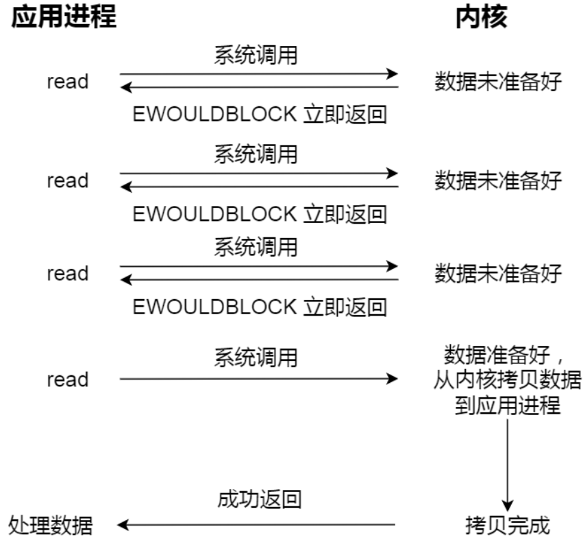
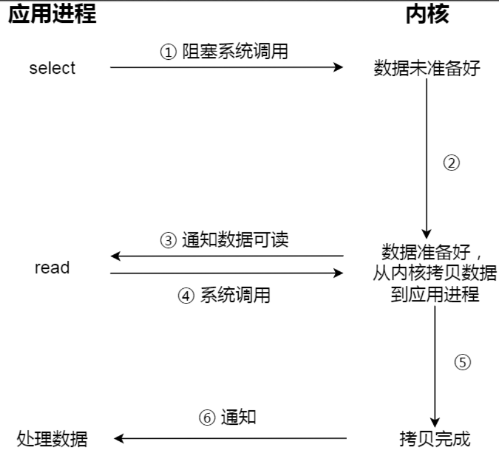
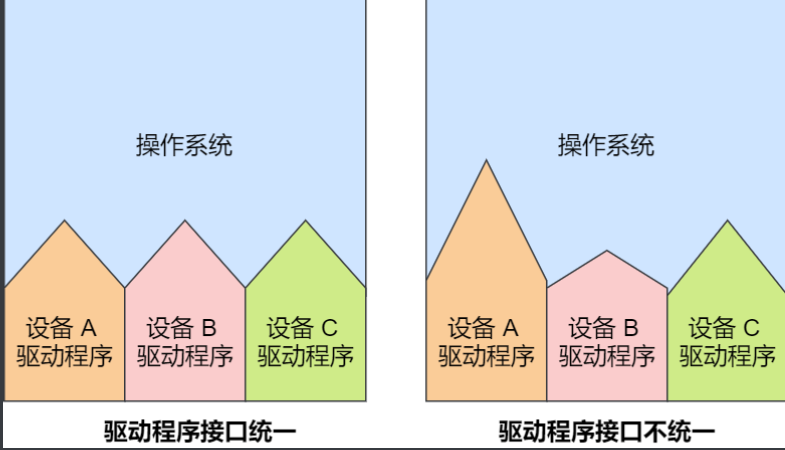

## 四、进程与线程

### 进程与线程基础知识


#### 进程

##### 进程的状态

### 

##### 进程控制块

- PCB包含：进程描述信息、进程控制和管理信息、资源分配清单、CPU相关信息
- PCB通常通过链表的方式组织，把具有相同状态的进程链在一起，组成各种队列
- 还有索引方式：将同一状态的进程组织在一个索引表中；但一般会选择链表，因为可能面临进程创建、销毁等调度，链表能灵活的插入和删除

##### 进程的控制

- 创建线程
  - 为新进程分配一个唯一的进程标识号，并申请一个空白的PCB，如果申请失败则创建失败
  - 为进程分配资源，如果资源不足，进程会进入等待状态
  - 初始化PCB
  - 插入到就绪队列
- 终止进程：正常结束、异常结束、外界干预
  - 查找要终止的进程PCB
  - 如果进程正在执行，则立即终止该进程，将CPU资源分配给其他进程，如果有子进程，则应将所有子进程终止
  - 更新PCB队列
- 阻塞进程：当进程需要等待某一事件完成时，它可以将自己阻塞。一旦被阻塞只能由其他进程唤醒
- 唤醒进程

##### 进程上下文切换

- 各个进程之间是共享 CPU 资源的，在不同的时候进程之间需要切换，让不同的进程可以在 CPU 执⾏，那么这个⼀个进程切换到另⼀个进程运行，称为进程的上下文切换
- CPU 寄存器和程序计数是 CPU 在运⾏任何任务前，所必须依赖的环境，这些环境就叫做CPU上下文
- 进程是由内核管理和调度的，所以进程的切换只能发生在**内核态**。进程的上下文切换不仅包含了虚拟内存、栈、全局变量等用户空间的资源，还包括了内核堆栈、寄存器等内核空间的资源
- 场景
  - 时间片轮转
  - 进程在系统资源不足时，被挂起
  - sleep函数
  - 高优先级进程
  - 硬件中断


#### 线程

##### 为什么使用线程

- 维护进程的系统开销较大，如创建进程时，分配资源、建立 PCB；终止进程时，回收资源、撤销 PCB；进程切换时，保存当前进程的状态信息


##### 什么是线程

- 线程就是进程中的一条执行流程。同一个进程内多个线程可以共享代码段、数据段、打开的文件等资源，但每个线程各自都有一套独立的寄存器和栈，这样可以确保线程的控制流是相对独立的
- 线程的优点
  - 一个进程中可以同时存在多个线程
  - 各个线程之间可以并发执行
  - 各个线程之间可以共享地址空间和文件等资源
- 线程的缺点：
  - 当进程中的一个线程崩溃时，会导致其所属进程的其他线程崩溃


##### 线程与进程的比较

线程与进程的比较如下：

- 进程是资源（包括内存、打开的文件等）分配的单位，线程是 CPU 调度的单位
- 进程拥有一个完整的资源平台，而线程只独享必不可少的资源，如寄存器和栈
- 线程同样具有就绪、阻塞、执行三种基本状态，同样具有状态之间的转换关系
- 线程能减少并发执行的时间和空间开销


线程相比进程能减少开销，体现在：

- 线程的创建时间比进程快，因为进程在创建的过程中，还需要资源管理信息，比如内存管理信息、文件管理信息，而线程在创建的过程中，不会涉及这些资源管理信息，而是共享它们
- 线程的终止时间比进程快，因为线程释放的资源相比进程少很多
- 同一个进程内的线程切换比进程切换快，因为线程具有相同的地址空间（虚拟内存共享）
- 由于同一进程的各线程间共享内存和文件资源，那么在线程之间数据传递的时候，就不需要经过内核了


##### 线程的上下文切换

这还得看线程是不是属于同一个进程：

- 当两个线程不是属于同一个进程，则切换的过程就跟进程上下文切换一样
- 当两个线程是属于同一个进程，因为虚拟内存是共享的，所以在切换时，虚拟内存这些资源就保持不动，只需要切换线程的私有数据、寄存器等不共享的数据


##### 线程的实现

三种实现方式：

- 用户线程：在用户空间实现的线程，不是由内核管理的线程，是由用户态的线程库来完成线程的管理
- 内核线程：在内核中实现的线程，是由内核管理的线程
- 轻量级进程：在内核中来支持用户线程


用户线程：

- 用户线程的整个线程管理和调度，操作系统是不直接参与的，而是由用户级线程库函数来完成线程的管理，包括线程的创建、终止、同步和调度等
- 优点：用户线程的切换也是由线程库函数来完成的，无需用户态与内核态的切换，所以速度特别快
- 缺点：
  - 由于操作系统不参与线程的调度，如果一个线程发起了系统调用而阻塞，那进程所包含的用户线程都不能执行了
  - 当一个线程开始运行后，除非它主动地交出 CPU 的使用权，否则它所在的进程当中的其他线程无法运行，因为用户态的线程没法打断当前运行中的线程，它没有这个特权，只有操作系统才有，但是用户线程不是由操作系统管理的
  - 由于时间片分配给进程，故与其他进程比，在多线程执行时，每个线程得到的时间片较少，执行会比较慢


内核线程：

- 内核线程是由操作系统管理的，线程对应的 TCB 自然是放在操作系统里的，这样线程的创建、终止和管理都是由操作系统负责
- 优点：
  - 在一个进程当中，如果某个内核线程发起系统调用而被阻塞，并不会影响其他内核线程的运行
  - 分配给线程，多线程的进程获得更多的 CPU 运行时间
- 缺点：
  - 在支持内核线程的操作系统中，由内核来维护进程和线程的上下文信息
  - 线程的创建、终止和切换都是通过系统调用的方式来进行，因此对于系统来说，系统开销比较大


轻量级进程：

内核支持的用户线程，一个进程可有一个或多个 LWP，每个 LWP 是跟内核线程一对一映射的，也就是 LWP 都是由一个内核线程支持


三种模式：

- 一对一模式，如图进程4
  - 优点：实现并行，一个LWP阻塞不会影响其他LWP
  - 缺点：每一个用户线程产生一个内核线程，创建线程的开销较大
- N：1模式，如图进程2
  - 优点：用户线程要开几个都没问题，上下文切换发生在用户空间，切换效率高
  - 缺点：一个用户线程阻塞了，整个进程都会阻塞；无法利用多核CPU的优势
- M：N模式，如图进程3
  - 优点：综合前两种优点，大部分的线程上下文发生在用户空间，且多线程可以充分利用多核CPU资源
- 组合模式，如图线程5


##### 调度

选择一个进程运行这一功能是在操作系统中完成的，通常称为调度程序（scheduler）


##### 调度时机

在进程的生命周期中，当进程从一个运行状态到另外一状态变化的时候，其实会触发一次调度

根据如何处理时钟中断分成两种调度算法

- **非抢占式调度**算法挑选一个进程，然后让该进程运行直到被阻塞，或者直到该进程退出，才会调用另外一个进程，也就是说不会理时钟中断这个事情
- **抢占式调度算法**挑选一个进程，然后让该进程只运行某段时间，如果在该时段结束时，该进程仍然在运行时，则会把它挂起，接着调度程序从就绪队列挑选另外一个进程。这种抢占式调度处理，需要在时间间隔的末端发生时钟中断，以便把 CPU 控制返回给调度程序进行调度，也就是常说的**时间片机制**


##### 调度原则

原则一：如果运行的程序，发生了 I/O 事件的请求，那 CPU 使用率必然会很低，因为此时进程在阻塞等待硬盘的数据返回。这样的过程，势必会造成 CPU 突然的空闲。**所以，为了提高CPU 利用率，在这种发送 I/O 事件致使 CPU 空闲的情况下，调度程序需要从就绪队列中选择一个进程来运行**。

原则二：有的程序执行某个任务花费的时间会比较⻓，如果这个程序一直占用着 CPU，会造成系统吞吐量（CPU 在单位时间内完成的进程数量）的降低。**所以，要提高系统的吞吐率，调度程序要权衡⻓任务和短任务进程的运行完成数量**。

原则三：从进程开始到结束的过程中，实际上是包含两个时间，分别是进程运行时间和进程等待时间，这两个时间总和就称为周转时间。进程的周转时间越小越好，**如果进程的等待时间很⻓而运行时间很短，那周转时间就很⻓，这不是我们所期望的，调度程序应该避免这种情况发生**。

原则四：处于就绪队列的进程，也不能等太久，当然希望这个等待的时间越短越好，这样可以使得进程更快的在 CPU 中执行。所以，**就绪队列中进程的等待时间也是调度程序所需要考虑的原则**。

原则五：对于鼠标、键盘这种交互式比较强的应用，我们当然希望它的响应时间越快越好，否则就会影响用户体验了。所以，**对于交互式比较强的应用，响应时间也是调度程序需要考虑的原则**。


针对上面的五种调度原则，总结成如下：

- CPU 利用率：调度程序应确保 CPU 是始终匆忙的状态，这可提高 CPU 的利用率；
- 系统吞吐量：吞吐量表示的是单位时间内 CPU 完成进程的数量，⻓作业的进程会占用较⻓的 CPU 资源，因此会降低吞吐量，相反，短作业的进程会提升系统吞吐量；
- 周转时间：周转时间是进程运行和阻塞时间总和，一个进程的周转时间越小越好；
- 等待时间：这个等待时间不是阻塞状态的时间，而是进程处于就绪队列的时间，等待的时间越⻓，用户越不满意；
- 响应时间：用户提交请求到系统第一次产生响应所花费的时间，在交互式系统中，响应时间是衡量调度算法好坏的主要标准。


##### 调度算法

- 先来先服务算法，对长作业有利，适用于CPU繁忙型作业系统，不适用于I/O繁忙型作业的系统

- 最短作业优先算法，不利于长作业

- 高响应比优先算法

- 时间片轮转调度算法，时间片的长度是关键

- 最高优先级算法

- 多级反馈队列算法

  


### 4.2 进程间通信


每个进程的**⽤户地址空间**都是独⽴的，⼀般⽽⾔是不能互相访问的，但**内核空间**是每个进程都共享的，所以进程之间要通信必须通过内核


#### 管道

效率低，不适合进程间频繁地交换数据；通信的数据是⽆格式的流并且⼤⼩受限， 通信的⽅式是单向的

##### Linux系统使用管道

```shell
//「 | 」竖线就是⼀个管道，它的功能是将前⼀个命令（ ps auxf ）的输出，作为后⼀个命令（ grep mysql ）的输⼊，从这功能描述，可以看出管道传输数据是单向的，如果想相互通信，我们需要创建两个管道才⾏
$ ps auxf | grep mysql

//在使⽤命名管道前，先需要通过 mkfifo 命令来创建，并且指定管道名字
$ mkfifo myPipe
$ echo "hello" > myPipe // 将数据写进管道
 // 停住了 ...
 $ cat < myPipe // 读取管道⾥的数据
hello
//可以看出，管道这种通信⽅式效率低，不适合进程间频繁地交换数据。当然，它的好
处，⾃然就是简单，同时也我们很容易得知管道⾥的数据已经被另⼀个进程读取了
```


##### 背后的原理

```shell
//表示创建⼀个匿名管道，并返回了两个描述符，⼀个是管道的读取端描述符 fd[0] ，另⼀个是管道的写⼊端描述符 fd[1] 。注意，这个匿名管道是特殊的⽂件，只存在于内存，不存于⽂件系统中。
int pipe(int fd[2])
```


所谓的管道，就是**内核⾥⾯的⼀串缓存**

我们可以使⽤ **fork** 创建⼦进程，创建的⼦进程会复制⽗进程的⽂件描述符，这样就做到了 两个进程各有两个「 fd[0] 与 fd[1] 」，两个进程就可以通过各⾃的 fd 写⼊和读取同⼀个 管道⽂件实现跨进程通信了


在 shell ⾥⾯执⾏ A | B 命令的时候，A 进程和 B 进程都是 shell 创建出来的⼦进程，A 和 B 之间不存在⽗⼦关系，它俩的⽗进程都是 shell


所以说，在 shell ⾥通过「 | 」匿名管道将多个命令连接在⼀起，实际上也就是创建了多个⼦ 进程，那么在我们编写 shell 脚本时，能使⽤⼀个管道搞定的事情，就不要多⽤⼀个管道，这 样可以减少创建⼦进程的系统开销。 


我们可以得知，对于匿名管道，它的通信范围是**存在⽗⼦关系的进程**。因为管道没有实体， 也就是没有管道⽂件，只能通过 fork 来复制⽗进程 fd ⽂件描述符，来达到通信的⽬的。 


另外，对于命名管道，它可以在**不相关的进程间也能相互通信**。因为命名管道，提前创建了 ⼀个类型为管道的设备⽂件，在进程⾥只要使⽤这个设备⽂件，就可以相互通信。


不管是匿名管道还是命名管道，进程写⼊的数据都是**缓存在内核中**，另⼀个进程读取数据时 候⾃然也是从内核中获取，同时通信数据都遵循先进先出原则，不⽀持 lseek 之类的⽂件定位 操作。


#### 消息队列

- 通信模式，A 进程要给 B 进程发送消息，A 进 程把数据放在对应的消息队列后就可以正常返回了，B 进程需要的时候再去读取数据就可以 了。同理，B 进程要给 A 进程发送消息也是如此类似于收发邮件
- 消息队列是保存在**内核**中的消息链表，在发送数据时，会分成⼀个⼀个独⽴的数据单 元，也就是**消息体（数据块）**
- 生命周期：期随内核，如果没有释放消息队列或者没有关闭操作系统，消息队列会⼀直存在；而管道则是随进程的结束而销毁
- 不足：
  - ⼀是通信不及时
  - ⼆是附件也有⼤⼩限制，不适合⽐较⼤数据的传输
- 消息队列通信过程中，存在⽤户态与内核态之间的数据**拷⻉开销**


#### 共享内存

那共享内存的⽅式，很好的解决了消息队列通信过程中，用户态内核态的数据拷贝开销问题

共享内存的机制，就是拿出⼀块虚拟地址空间来，映射到相同的物理内存中。这样这个进程写⼊的东⻄，另外⼀个进程⻢上就能看到了，都不需要拷⻉来拷⻉去，传来传去，⼤⼤提⾼ 了进程间通信的速度


#### 信号量

- ⽤了共享内存通信⽅式，带来新的问题，那就是如果多个进程同时修改同⼀个共享内存，很有可能发生冲突。为了防⽌多进程竞争共享资源，⽽造成的数据错乱，所以需要保护机制，使得共享的资源， 在任意时刻只能被⼀个进程访问。正好，信号量就实现了这⼀保护机制。

- **信号量其实是⼀个整型的计数器，主要⽤于实现进程间的互斥与同步，⽽不是⽤于缓存进程 间通信的数据**

- 信号量表示资源的数量，控制信号量的⽅式有两种原⼦操作： 

  - ⼀个是 P 操作，这个操作会把信号量减去 1，相减后如果信号量 < 0，则表明资源已被占 ⽤，进程需阻塞等待；相减后如果信号量 >= 0，则表明还有资源可使⽤，进程可正常继 续执⾏。 
  - 另⼀个是 V 操作，这个操作会把信号量加上 1，相加后如果信号量 <= 0，则表明当前有 阻塞中的进程，于是会将该进程唤醒运⾏；相加后如果信号量 > 0，则表明当前没有阻塞 中的进程； 
  - P 操作是⽤在进⼊共享资源之前，V 操作是⽤在离开共享资源之后，这两个操作是必须成对出 现的。

- 信号初始化为 1 ，代表互斥信号量
  

- 信号初始化为 0 ，就代表着是同步信号量

  


#### 信号

- 对于异常情况下的⼯作模式，需要⽤ 「信号」的⽅式来通知进程
- 信号事件的来源主要有硬件来源（如键盘 Cltr+C ）和软件来源（如 kill 命令）
- 信号是进程间通信机制中唯⼀的异步通信机制


#### Socket

前⾯提到的管道、消息队列、共享内存、信号量和信号都是在同⼀台主机上进⾏进程间通 信，那要想**跨⽹络**与不同主机上的进程之间通信，就需要 Socket 通信。实际上，Socket 通信不仅可以跨⽹络与不同主机的进程间通信，还可以在同主机上进程间通 信。


#### 总结

由于每个进程的⽤户空间都是独⽴的，不能相互访问，这时就需要借助内核空间来实现进程 间通信，原因很简单，每个进程都是共享⼀个内核空间。 

Linux 内核提供了不少进程间通信的⽅式，其中最简单的⽅式就是管道，管道分为「匿名管 道」和「命名管道」。 

匿名管道顾名思义，它没有名字标识，匿名管道是特殊⽂件只存在于内存，没有存在于⽂件 系统中，shell 命令中的「 | 」竖线就是匿名管道，通信的数据是⽆格式的流并且⼤⼩受限， 通信的⽅式是单向的，数据只能在⼀个⽅向上流动，如果要双向通信，需要创建两个管道， 再来匿名管道是只能⽤于存在⽗⼦关系的进程间通信，匿名管道的⽣命周期随着进程创建⽽ 建⽴，随着进程终⽌⽽消失。 

命名管道突破了匿名管道只能在亲缘关系进程间的通信限制，因为使⽤命名管道的前提，需 要在⽂件系统创建⼀个类型为 p 的设备⽂件，那么毫⽆关系的进程就可以通过这个设备⽂件 进⾏通信。另外，不管是匿名管道还是命名管道，进程写⼊的数据都是缓存在内核中，另⼀ 个进程读取数据时候⾃然也是从内核中获取，同时通信数据都遵循先进先出原则，不⽀持 lseek 之类的⽂件定位操作。 

消息队列克服了管道通信的数据是⽆格式的字节流的问题，消息队列实际上是保存在内核的 「消息链表」，消息队列的消息体是可以⽤户⾃定义的数据类型，发送数据时，会被分成⼀ 个⼀个独⽴的消息体，当然接收数据时，也要与发送⽅发送的消息体的数据类型保持⼀致， 这样才能保证读取的数据是正确的。消息队列通信的速度不是最及时的，毕竟每次数据的写 ⼊和读取都需要经过⽤户态与内核态之间的拷⻉过程。 

共享内存可以解决消息队列通信中⽤户态与内核态之间数据拷⻉过程带来的开销，它直接分配⼀个共享空间，每个进程都可以直接访问，就像访问进程⾃⼰的空间⼀样快捷⽅便，不需 要陷⼊内核态或者系统调⽤，⼤⼤提⾼了通信的速度，享有最快的进程间通信⽅式之名。但是便捷⾼效的共享内存通信，带来新的问题，多进程竞争同个共享资源会造成数据的错乱。 

那么，就需要信号量来保护共享资源，以确保任何时刻只能有⼀个进程访问共享资源，这种⽅式就是互斥访问。信号量不仅可以实现访问的互斥性，还可以实现进程间的同步，信号量 其实是⼀个计数器，表示的是资源个数，其值可以通过两个原⼦操作来控制，分别是 P 操作 和 V 操作。 

与信号量名字很相似的叫信号，它俩名字虽然相似，但功能⼀点⼉都不⼀样。信号是进程间 通信机制中唯⼀的异步通信机制，信号可以在应⽤进程和内核之间直接交互，内核也可以利 ⽤信号来通知⽤户空间的进程发⽣了哪些系统事件，信号事件的来源主要有硬件来源（如键 盘 Cltr+C ）和软件来源（如 kill 命令），⼀旦有信号发⽣，进程有三种⽅式响应信号 1. 执⾏ 默认操作、2. 捕捉信号、3. 忽略信号。有两个信号是应⽤进程⽆法捕捉和忽略的，即 SIGKILL 和 SEGSTOP ，这是为了⽅便我们能在任何时候结束或停⽌某个进程。 

前⾯说到的通信机制，都是⼯作于同⼀台主机，如果要与不同主机的进程间通信，那么就需 要 Socket 通信了。Socket 实际上不仅⽤于不同的主机进程间通信，还可以⽤于本地主机进 程间通信，可根据创建 Socket 的类型不同，分为三种常⻅的通信⽅式，⼀个是基于 TCP 协 议的通信⽅式，⼀个是基于 UDP 协议的通信⽅式，⼀个是本地进程间通信⽅式。


那线程通信间的⽅式呢？ 同个进程下的线程之间都是共享进程的资源，只要是共享变量都可以做到线程间通信，⽐如 全局变量，所以对于线程间关注的不是通信⽅式，⽽是**关注多线程竞争共享资源的问题**，信 号量也同样可以在线程间实现互斥与同步： 互斥的⽅式，可保证任意时刻只有⼀个线程访问共享资源； 同步的⽅式，可保证线程 A 应在线程 B 之前执⾏；


### 4.3 多线程同步


#### 竞争与协作

所谓同步，就是并发进程/线程在⼀些关键点上可能需要互相等待与互通消息，这种相互制约 的等待与互通信息称为进程/线程同步。

注意，同步与互斥是两种不同的概念： 同步就好⽐：「操作 A 应在操作 B 之前执⾏」，「操作 C 必须在操作 A 和操作 B 都完 成之后才能执⾏」等； 互斥就好⽐：「操作 A 和操作 B 不能在同⼀时刻执⾏」；


#### 互斥与同步的实现和使⽤

锁：加锁、解锁操作； 

信号量：P、V 操作；


#### 经典同步问题

- 哲学家就餐问题

- 读者-写者问题
  - 读优先
  - 写优先
  - 读写公平


#### 死锁

当两个线程为了保护两个不同的共享资源⽽使⽤了两个互斥锁，那么这两个互斥锁应用不当的时候，可能会造成两个线程都在等待对⽅释放锁，在没有外⼒的作⽤下，这些线程 会⼀直相互等待，就没办法继续运⾏，这种情况就是发⽣了死锁


死锁只有同时满⾜以下四个条件才会发⽣： 

- 互斥条件； 
- 持有并等待条件； 
- 不可剥夺条件； 
- 环路等待条件；


### 4.4 悲观锁与乐观锁


#### 互斥锁与⾃旋锁

最底层的两种就是会「互斥锁和⾃旋锁」，有很多⾼级的锁都是基于它们实现的

互斥锁和⾃旋锁对于加锁失败后的处 理⽅式是不⼀样的： 互斥锁加锁失败后，线程会**释放 CPU** ，给其他线程； ⾃旋锁加锁失败后，线程会**忙等待**，直到它拿到锁；

##### 互斥锁


- 互斥锁加锁失败时，会从⽤户态陷⼊到内核态，让内核帮我们切换线程，虽然简化了 使⽤锁的难度，但是存在⼀定的性能开销成本——**两次线程上下⽂切换的成本**
  - 当线程加锁失败时，内核会把线程的状态从「运⾏」状态设置为「睡眠」状态，然后把 CPU 切换给其他线程运⾏； 
  - 接着，当锁被释放时，之前「睡眠」状态的线程会变为「就绪」状态，然后内核会在合适 的时间，把 CPU 切换给该线程运行
- 上下切换的耗时有⼤佬统计过，⼤概在⼏⼗纳秒到⼏微秒之间，如果你锁住的代码执⾏时间 ⽐较短，那可能上下⽂切换的时间都⽐你锁住的代码执⾏时间还要⻓。 **所以，如果你能确定被锁住的代码执⾏时间很短，就不应该⽤互斥锁，⽽应该选⽤⾃旋锁， 否则使⽤互斥锁**


##### 自旋锁

- ⾃旋锁是通过 CPU 提供的 CAS 函数（Compare And Swap），**在「⽤户态」完成加锁和解 锁操作**，不会主动产⽣线程上下⽂切换，所以相⽐互斥锁来说，会快⼀些，开销也⼩⼀些
- ⼀般加锁的过程，包含两个步骤： 
  - 第⼀步，查看锁的状态，如果锁是空闲的，则执⾏第⼆步；
  - 第⼆步，将锁设置为当前线程持有；
- ⾃旋锁是最⽐较简单的⼀种锁，⼀直⾃旋，利⽤ CPU 周期，直到锁可⽤。需要注意，在单核 CPU 上，需要抢占式的调度器（即不断通过时钟中断⼀个线程，运⾏其他线程）。否则，⾃ 旋锁在单 CPU 上⽆法使⽤，因为⼀个⾃旋的线程永远不会放弃 CPU
- ⾃旋锁开销少，在多核系统下⼀般不会主动产⽣线程切换，适合**异步、协程**等在⽤户态切换 请求的编程⽅式，但如果被锁住的代码执⾏时间过⻓，⾃旋的线程会⻓时间占⽤ CPU 资源， 所以**⾃旋的时间和被锁住的代码执⾏的时间是成「正⽐」**的关系，我们需要清楚的知道这⼀ 点

⾃旋锁与互斥锁使⽤层⾯⽐较相似，但实现层⾯上完全不同：当加锁失败时，互斥锁⽤「线 程切换」来应对，⾃旋锁则⽤「忙等待」来应对。


##### 读写锁

- 工作原理：当「写锁」没有被线程持有时，多个线程能够并发地持有**读锁**，这⼤⼤提⾼了共享资源的 访问效率，因为「读锁」是⽤于读取共享资源的场景，所以多个线程同时持有读锁也不会 破坏共享资源的数据。 但是，⼀旦「写锁」被线程持有后，读线程的获取读锁的操作会被阻塞，⽽且其他写线程 的获取写锁的操作也会被阻塞。

- 写锁是独占锁，读锁是共享锁

- 根据实现不同，读写锁可以分为**读优先锁**和**写优先锁**

  读优先锁期望的是，读锁能被更多的线程持有，以便提⾼读线程的并发性，它的⼯作⽅式 是：当读线程 A 先持有了读锁，写线程 B 在获取写锁的时候，会被阻塞，并且在阻塞过程 中，后续来的读线程 C 仍然可以成功获取读锁，最后直到读线程 A 和 C 释放读锁后，写线程 B 才可以成功获取写锁。如下图：

  

  ⽽写优先锁是优先服务写线程，其⼯作⽅式是：当读线程 A 先持有了读锁，写线程 B 在获取 写锁的时候，会被阻塞，并且在阻塞过程中，后续来的读线程 C 获取读锁时会失败，于是读 线程 C 将被阻塞在获取读锁的操作，这样只要读线程 A 释放读锁后，写线程 B 就可以成功获 取读锁。如下图

  

公平读写锁⽐较简单的⼀种⽅式是：⽤队列把获取锁的线程排队，不管是写线程还是读线程 都按照先进先出的原则加锁即可，这样读线程仍然可以并发，也不会出现「饥饿」的现象


##### 乐观锁与悲观锁

- 悲观锁做事⽐较悲观，它认为多线程同时修改共享资源的概率⽐较⾼，于是很容易出现冲 突，所以访问共享资源前，先要上锁。如互斥锁、自旋锁、读写锁
- 乐观锁做事⽐较乐观，它假定冲突的概率很低，它的⼯作⽅式是：先修改完共享资源，再验 证这段时间内有没有发⽣冲突，如果没有其他线程在修改资源，那么操作完成，如果发现有 其他线程已经修改过这个资源，就放弃本次操作。**乐观锁解决冲突的重试成本很高**。场景：共享文档、git。


## 五、调度算法

### 进程调度、页面置换、磁盘调度算法


#### 进程调度算法

- 调度时机

  - 进程从运行状态到等待状态
  - 进程从运行状态到就绪状态，时间片到了
  - 进程从等待状态到就绪状态，假设有⼀个进程是处于等待状态的， 但是它的**优先级**⽐较⾼，如果该进程等待的事件发⽣了，它就会转到就绪状态，⼀旦它转到 就绪状态，如果我们的调度算法是以优先级来进⾏调度的，那么它就会⽴⻢抢占正在运⾏的 进程
  - 进程从运行状态到终止状态
  - 其中发⽣在 1 和 4 两种情况下的调度称为「⾮抢占式调度」，2 和 3 两种情况下发⽣的调度 称为「抢占式调度」

- 常见调度算法

  - 先来先服务:对长作业有利，适⽤于 CPU 繁忙型作业的系统，⽽不适⽤于 I/O 繁忙型作业的系统

  - 最短作业优先：有利于短作业，不利于长作业，长作业会出现“饥饿”现象

  - 高响应比优先：主要是权衡了短作业和⻓作业，每次进⾏进程调度时，先计算「响应⽐优先级」，然后把「响应⽐优先级」最⾼的进程投⼊ 运⾏

  - 时间片轮转

  - 最高优先级：希望调度 程序能从就绪队列中选择最⾼优先级的进程进⾏运⾏

  - 多级反馈队列：

    


#### 内存页面置换算法

- 缺页中断：当 CPU 访问的⻚⾯不在物理内存时，便会产⽣⼀个缺⻚中断，请求操作系统将所缺⻚调⼊到 物理内存。那它与⼀般中断的主要区别在于： 
  - 缺⻚中断在指令执⾏「期间」产⽣和处理中断信号，⽽⼀般中断在⼀条指令执⾏「完成」 后检查和处理中断信号。 
  - 缺⻚中断返回到该指令的开始重新执⾏「该指令」，⽽⼀般中断返回回到该指令的「下⼀ 个指令」执⾏。
    
- ⻚⾯置换算法的功能是，当出现缺⻚异常，需调⼊新⻚⾯⽽内存已满时，选择被置换 的物理⻚⾯，也就是说选择⼀个物理⻚⾯换出到磁盘，然后把需要访问的⻚⾯换⼊到物理 ⻚
- 那其算法⽬标则是，尽可能减少⻚⾯的换⼊换出的次数，常⻅的⻚⾯置换算法有如下⼏种：
  - 最佳页面置换算法 OPT
  - 先进先出置换算法 FIFO
  - 最近最久未使用的置换算法 LRU
  - 时钟页面置换算法
  - 最不常用置换算法 LFU


#### 磁盘调度算法

调度算法的目的：为了提高磁盘的访问性能，一般通过优化磁盘的访问请求顺序来做到的，如果请求顺序优化得当，可以节省一些不必要的寻道时间


调度算法

- 先来先服务算法：简单粗暴，但是如果⼤量进程竞争使⽤磁盘，请求访问的磁道可能会很分散，那先来先服务算法在性能上就会 显得很差，因为寻道时间过⻓
- 最短寻道时间优先算法：优先选择从当前磁头位 置所需寻道时间最短的请求，算法可能存在某些请求的饥饿，产⽣饥饿的原因 是磁头在⼀⼩块区域来回移动
- 扫描算法算法：磁头在⼀个⽅向上移动，访问所有未完成的请求，直到磁头 到达该⽅向上的最后的磁道，才调换⽅向，这就是扫描（Scan）算法，这种算法也叫电梯算法。扫描调度算法性能较好，不会产⽣饥饿现象，但是存在这样的问题，中间部分的磁道会⽐较 占便宜，中间部分相⽐其他部分响应的频率会⽐较多，也就是说每个磁道的响应频率存在差异
- 循环扫描算法：优化扫描算法每个磁道响应的频率存在差异的问题。规定：只有磁头朝某个特定⽅向移动时，才处理磁道访 问请求，⽽返回时直接快速移动⾄最靠边缘的磁道，也就是复位磁头，这个过程是很快的， 并且返回中途不处理任何请求，该算法的特点，**就是磁道只响应⼀个⽅向上的请求**。
- LOOK与C-LOOK算法：针对扫描算法和循环扫描算法磁头移动到末端才调换方向的做法进行优化，优化思路是磁头移动到最远的请求立即反向移动；


## 六、文件系统


#### 文件系统的基本组成

- 文件系统是操作系统负责管理持久数据的子系统，即负责把用户的文件存到磁盘硬件中
- Linux文件系统会为每个文件分配两个数据结构：索引节点和目录项
  - 索引节点：记录文件元信息，如inode编号、文件大小、访问权限、**数据在磁盘中的位置**等。是文件的唯一标识，它们之间一一对应。索引节点也同样会存储在硬盘中
  - 目录项：记录文件名、**索引节点指针**以及与其他目录项的层级关联关系。**目录项是由内核维护的数据结构，不存放于硬盘，而存放于内存**。目录项和索引节点可以是**多对一**的关系
  - 
    - 超级块，用来存储文件系统的详细信息。当文件系统挂载时，进入内存
    - 索引节点区，用来存储索引节点，当文件被访问时进入内存
    - 数据块区，用来存储文件或目录数据


#### 虚拟文件系统

操作系统在用户层与文件系统层中间引入的中间层——虚拟文件系统VFS，用于给用户提供一个统一的接口，VFS定义了一组所有文件系统都支持的数据结构和标准接口。在 Linux 文件系统中，用户空间、系统调用、虚拟机文件系统、缓存、文件系统以及存储之间的关系如下图：


#### 文件的使用


文件描述符

- 我们打开了一个文件后，操作系统会跟踪进程打开的所有文件，所谓的跟踪呢，就是操作系统为**每个进程**维护一个**打开文件表**，文件表里的每一项代表「文件描述符」，所以说文件描述符是打开文件的标识。
- 打开文件表维护着打开文件的状态和信息：
  - 文件指针
  - 文件打开计数器
  - 文件磁盘位置
  - 访问权限


#### 文件存储

文件的数据是要存储在硬盘上面的，数据在磁盘上的存放方式，就像程序在内存中存放的方式那样，有以下两种：

- 连续空间存放方式：读写效率高；磁盘空间碎片；文件长度不易扩展

- 非连续空间存放方式：离散的，不连续；消除磁盘碎片；文件易扩展

  - 链表方式

    - 隐式链接：文件要以「隐式链表」的方式存放的话，实现的方式是文件头要包含「第一块」和「最后一块」的位置，并且每个数据块里面留出一个指针空间，用来存放下一个数据块的位置（有头尾节点的单链表）；

      缺点：无法直接访问数据块，只能通过指针顺序访问，数据块指针消耗一定的存储空间；稳定性差，链表中的指针丢失或损坏会导致文件数据的丢失

      

    - 显示链接：把用于链接文件各数据块的指针，显式地存放在内存的一张链接表中，该表在整个磁盘仅设置一张，每个表项中存放链接指针，指向下一个数据块号。内存中的这样一个表格称为**文件分配表**

      由于查找记录的过程是在内存中进行的，因而不仅**显著地提高了检索速度**，而且大大减少了访问磁盘的次数。但也正是整个表都存放在**内存**中的关系，它的主要的缺点是**不适用于大磁盘**

      

  - 索引方式：为每个文件创建一个「索引数据块」，里面存放的是指向文件数据块的指针列表。类似于书的目录

    优点：文件的创建、增大、缩小很方便；不会存在空间碎片；支持顺序读写和随机读写

    缺点：存储索引带来开销。由于索引数据也是存放在磁盘块的，如果文件很小，明明只需一块就可以存放的下，但还是需要额外分配一块来存放索引数

    

  - 链表+索引：是在索引数据块留出一个存放下一个索引数据块的指针

    

  - 多级索引

    


#### 空闲空间管理

- 空闲表法：适用于仅有少量空闲区

  

  - 空闲链表法：简单；不能随机访问，效率低

  

- 位图法：利用二进制的一位来表示磁盘中一个盘块的使用情况，磁盘上所有的盘块都有一个二进制位与之对应


#### 目录的存储

和普通文件不同的是，普通文件的块里面保存的是文件数据，而目录文件的块里面保存的是**目录里面一项一项的文件信息**。


如果一个目录有超级多的文件，我们要想在这个目录下找文件，按照列表一项一项的找，效率就不高了。于是，保存目录的格式改成**哈希表**，对文件名进行哈希计算，把哈希值保存起来，如果我们要查找一个目录下面的文件名，可以通过名称取哈希。如果哈希能够匹配上，就说明这个文件的信息在相应的块里面。**非常迅速，插入和删除也较简单，不过需要一些预备措施来避免哈希冲突。**


#### 软连接和硬链接

给某个文件取别名

硬链接是**多个目录项中的「索引节点」指向一个文件**，也就是指向同一个 inode，但是 inode是不可能跨越文件系统的，每个文件系统都有各自的 inode 数据结构和列表，所以**硬链接是不可用于跨文件系统的**。由于多个目录项都是指向一个 inode，那么**只有删除文件的所有硬链接以及源文件时，系统才会彻底删除该文件**。


软链接相当于重新创建一个文件，这个文件**有独立的 inode**，但是这个文件的**内容是另外一个文件的路径**，所以访问软链接的时候，实际上相当于访问到了另外一个文件，所以**软链接是可以跨文件系统的**，甚至目标文件被删除了，链接文件还是在的，只不过指向的文件找不到了而已


#### 文件IO

- 缓冲IO与非缓冲IO
- 直接IO与非直接IO
- 阻塞IO与非阻塞IO VS 同步与异步IO


缓冲与非缓冲 ：

- I/O文件操作的**标准库**是可以实现数据的缓存，那么根据「是否利用标准库缓冲」，可以把文件I/O 分为缓冲 I/O 和非缓冲 I/O：
  - 缓冲 I/O，利用的是**标准库的缓存**实现文件的加速访问，而标准库**再通过系统调用**访问文件。
  - 非缓冲 I/O，**直接通过系统调用**访问文件，不经过标准库缓存。这里所说的「缓冲」特指标准库内部实现的缓冲。


直接IO与非直接IO:

- 根据是**「否利用操作系统的缓存」**，可以把文件 I/O 分为直接 I/O 与非直接 I/O:

  - 直接 I/O，不会发生内核缓存和用户程序之间数据复制，而是直接经过文件系统访问磁盘**(无中间商)**

  - 非直接 I/O，读操作时，数据从内核缓存中拷⻉给用户程序，写操作时，数据从用户程序拷⻉给内核缓存，再由内核决定什么时候写入数据到磁盘。**（有中间商：内核）**

    以下几种场景会触发内核缓存的数据写入磁盘：

    - 在调用write的最后，当发现内核缓存的数据太多的时候，内核会把数据写到磁盘上；
    - 用户主动调用sync，内核缓存会刷到磁盘上；
    - 当内存十分紧张，无法再分配⻚面时，也会把内核缓存的数据刷到磁盘上；
    - 内核缓存的数据的缓存时间超过某个时间时，也会把数据刷到磁盘上；


阻塞IO与非阻塞IO VS 同步与异步IO：

阻塞 I/O：当用户程序执行read，线程会被阻塞，一直等到内核数据准备好，并把数据从内核缓冲区拷⻉到应用程序的缓冲区中，当拷⻉过程完成，read才会返回。注意，阻塞等待的是**「内核数据准备好」**和**「数据从内核态拷⻉到用户态」**这两个过程。过程如下图：


非阻塞：非阻塞的 read 请求在数据未准备好的情况下立即返回，可以继续往下执行，此时应用程序不断轮询内核，直到数据准备好，内核将数据拷⻉到应用程序缓冲区，read调用才可以获取到结果。过程如下图：

最后一次 read 调用，获取数据的过程，是一个同步的过程，是需要等待的过程。这里的同步指的是内核态的数据拷⻉到用户程序的缓存区这个过程。

使用 select I/O 多路复用过程。注意，read获取数据的过程（数据从内核态拷⻉到用户态的过程），也是一个同步的过程，需要等待：

实际上，无论是阻塞 I/O、非阻塞 I/O，还是基于非阻塞 I/O 的多路复用都是同步调用。因为它们在 read 调用时，内核将数据从内核空间拷⻉到应用程序空间，过程都是需要等待的，也就是说这个过程是同步的，如果内核实现的拷⻉效率不高，read 调用就会在这个同步过程中等待比较⻓的时间。


异步 I/O：是「内核数据准备好」和「数据从内核态拷⻉到用户态」这两个过程都不用等待。当我们发起aio_read之后，就立即返回，内核自动将数据从内核空间拷⻉到应用程序空间，这个拷⻉过程同样是异步的，内核自动完成的，和前面的同步操作不一样，应用程序并不需要主动发起拷⻉动作。过程如下图：


## 七、设备管理


### 设备控制器

为了屏蔽设备之间的差异，每个设备都有一个叫**设备控制器（Device Control）**的组件，比如硬盘有硬盘控制器、显示器有视频控制器等


设备控制器中的寄存器用来与CPU进行通信：通过写入这些寄存器，操作系统可以命令设备发送数据、接收数据、开启或关闭，或者执行某些其他操作。通过读取这些寄存器，操作系统可以了解设备的状态，是否准备好接收一个新的命令等


制器是有三类寄存器，它们分别是状态寄存器（Status Register）、命令寄存器（Command Register）以及数据寄存器（Data Register），如下图：


这三个寄存器的作用：

- 数据寄存器，CPU 向 I/O 设备写入需要传输的数据，比如要打印的内容是「Hello」，CPU 就要先发送一个 H 字符给到对应的 I/O 设备
- 命令寄存器，CPU 发送一个命令，告诉 I/O 设备，要进行输入/输出操作，于是就会交给I/O 设备去工作，任务完成后，会把状态寄存器里面的状态标记为完成
- 状态寄存器，目的是告诉 CPU ，现在已经在工作或工作已经完成，如果已经在工作状态，CPU 再发送数据或者命令过来，都是没有用的，直到前面的工作已经完成，状态寄存标记成已完成，CPU 才能发送下一个字符和命令。

CPU 通过读写设备控制器中的寄存器控制设备，这可比 CPU 直接控制输入输出设备，要方便和标准很多


另外，输入输出设备可分为两大类：块设备（Block Device）和字符设备（CharacterDevice）：

- 块设备，把数据存储在固定大小的块中，每个块有自己的地址，硬盘、USB 是常⻅的块设备。
- 字符设备，以字符为单位发送或接收一个字符流，字符设备是不可寻址的，也没有任何寻道操作，鼠标是常⻅的字符设备。

块设备通常传输的数据量会非常大，于是控制器设立了一个**可读写的数据缓冲区**。CPU 写入数据到控制器的缓冲区时，当缓冲区的数据囤够了一部分，才会发给设备。CPU 从控制器的缓冲区读取数据时，也需要缓冲区囤够了一部分，才拷⻉到内存。这样做是为了，**减少对设备的频繁操作**。那 CPU 是如何与设备的控制寄存器和数据缓冲区进行通信的？存在两个方法：

- 端口 I/O，每个控制寄存器被分配一个 I/O 端口，可以通过特殊的汇编指令操作这些寄存器，比如in/out类似的指令。
- 内存映射 I/O，将所有控制寄存器映射到内存空间中，这样就可以像读写内存一样读写数据缓冲区。


### IO控制方式

- 轮询等待
- 中断；中断控制器；软中断；硬中断
- DMA：仅在传送开始和结束时需要 CPU 干预
  - CPU 需对 DMA 控制器下发指令，告诉它想读取多少数据，读完的数据放在内存的某个地方就可以了；
  - 接下来，DMA 控制器会向磁盘控制器发出指令，通知它从磁盘读数据到其内部的缓冲区中，接着磁盘控制器将缓冲区的数据传输到内存；
  - 当磁盘控制器把数据传输到内存的操作完成后，磁盘控制器在总线上发出一个确认成功的信号到 DMA 控制器；
  - DMA 控制器收到信号后，DMA 控制器发中断通知 CPU 指令完成，CPU 就可以直接用内存里面现成的数据了


### 设备驱动程序

虽然设备控制器屏蔽了设备的众多细节，但每种设备的控制器的寄存器、缓冲区等使用模式都是不同的，所以为了屏蔽「设备控制器」的差异，引入了设备驱动程序


设备控制器不属于操作系统范畴，它是属于硬件，而设备驱动程序属于操作系统的一部分，操作系统的内核代码可以像本地调用代码一样使用设备驱动程序的接口，而设备驱动程序是面向设备控制器的代码，它发出操控设备控制器的指令后，才可以操作设备控制器。**不同的设备控制器虽然功能不同，但是设备驱动程序会提供统一的接口给操作系统，这样不同的设备驱动程序，就可以以相同的方式接入操作系统**。如下图：



中断处理程序的处理流程：


1. 在 I/O 时，设备控制器如果已经准备好数据，则会通过中断控制器向 CPU 发送中断请求；
2.  保护被中断进程的 CPU 上下文；
3.  转入相应的设备中断处理函数；
4.  进行中断处理；
5.  恢复被中断进程的上下文；通用块层对于块设备，为了减少不同块设备的差异带来的影响，Linux 通过一个统一的通用块层，来管理不同的块设备。


### 通用块层

通用块层是处于文件系统和磁盘驱动中间的一个块设备抽象层，它主要有两个功能：

- 第一个功能，向上为文件系统和应用程序，提供访问块设备的标准接口，向下把各种不同的磁盘设备抽象为统一的块设备，并在内核层面，提供一个框架来管理这些设备的驱动程序；
- 第二功能，通用层还会给文件系统和应用程序发来的 I/O 请求排队，接着会对队列**重新排序、请求合并**等方式，也就是 **I/O 调度**，主要目的是**为了提高磁盘读写的效率**。

Linux 内存支持 5 种 I/O 调度算法，分别是：

- 没有调度算法
- 先入先出调度算法
- 完全公平调度算法
- 优先级调度
- 最终期限调度算法第一种

没有调度算法，是的，你没听错，它不对文件系统和应用程序的 I/O 做任何处理，这种算法常用在虚拟机 I/O 中，此时磁盘 I/O 调度算法交由物理机系统负责。第二种，先入先出调度算法，这是最简单的 I/O 调度算法，先进入 I/O 调度队列的 I/O 请求先发生。第三种，完全公平调度算法，大部分系统都把这个算法作为默认的 I/O 调度器，它为每个进程维护了一个 **I/O 调度队列**，并按照**时间片**来均匀分布每个进程的 I/O 请求。第四种，优先级调度算法，顾名思义，优先级高的 I/O 请求先发生，它适用于运行**大量进程**的系统，像是桌面环境、多媒体应用等。第五种，最终期限调度算法，分别为读、写请求创建了不同的 I/O 队列，这样可以提高机械磁盘的吞吐量，并确保达到最终期限的请求被优先处理，适用于在 I/O 压力比较大的场景，比如数据库等。


### 存储系统 I/O 软件分层

可以把 Linux 存储系统的 I/O 由上到下可以分为三个层次，分别是文件系统层、通用块层、设备层。他们整个的层次关系如下图：


文件系统层，包括虚拟文件系统和其他文件系统的具体实现，它向上为应用程序统一提供了标准的文件访问接口，向下会通过通用块层来存储和管理磁盘数据。

通用块层，包括块设备的 I/O 队列和 I/O 调度器，它会对文件系统的 I/O 请求进行排队，再通过 I/O 调度器，选择一个 I/O 发给下一层的设备层。

设备层，包括硬件设备、设备控制器和驱动程序，负责最终物理设备的 I/O 操作。

存储系统的 I/O 是整个系统最慢的一个环节，所以 Linux 提供了不少缓存机制来提高I/O 的效率。为了提高文件访问的效率，会使用⻚缓存、索引节点缓存、目录项缓存等多种**缓存机制**，目的是为了减少对块设备的直接调用。为了提高块设备的访问效率，会使用**缓冲区**，来缓存块设备的数据


## 八、网络系统

### Linux系统是如何收发网络包的

#### 网络模型


#### 网络协议栈


Linux网络协议栈


应用程序需要通过系统调用，来跟 Socket 层进行数据交互；Socket 层的下面就是传输层、网络层和网络接口层；最下面的一层，则是网卡驱动程序和硬件网卡设


#### Linux接受网络包流程

网卡如何告诉操作系统网络包已经到达？中断，但是在高性能网络场景下，会频繁的触发中断，影响系统的整体效率。为了解决频繁中断带来的性能开销，Linux 内核在 2.6 版本中引入了NAPI 机制，它是混合**「中断和轮询」**的方式来接收网络包，它的核心概念就是不采用中断的方式读取数据，而是**首先采用中断唤醒数据接收的服务程序，然后poll的方法来轮询数据**。比如，当有网络包到达时，网卡发起硬件中断，于是会执行网卡硬件中断处理函数，中断处理函数处理完需要「暂时屏蔽中断」，然后唤醒「软中断」来轮询处理数据，直到没有新数据时才恢复中断，这样一次中断处理多个网络包，于是就可以降低网卡中断带来的性能开销

软中断处理网络包的流程：


### 零拷贝

磁盘可以说是计算机系统最慢的硬件之一，读写速度相差内存 10 倍以上，所以针对优化磁盘的技术非常的多，比如**零拷⻉、直接 I/O、异步 I/O** 等等，这些优化的目的就是为了提高系统的吞吐量，另外操作系统内核中的磁盘高速缓存区，可以有效的减少磁盘的访问次数


#### 为什么要有DMA技术

没有DMA技术前的IO


整个数据的传输过程，都要需要 CPU 亲自参与搬运数据的过程，而且这个过程，CPU 是不能做其他事情的

什么是 DMA 技术？简单理解就是，**在进行 I/O 设备和内存的数据传输的时候，数据搬运的工作全部交给 DMA 控制器，而 CPU 不再参与任何与数据搬运相关的事情，这样 CPU 就可以去处理别的事务**


整个数据传输的过程，CPU 不再参与数据搬运的工作，只是在开始和结束时干预，全程由 DMA 完成


#### 传统的文件输出有多糟糕


首先，期间共发生了 4 次用户态与内核态的上下文切换，因为发生了两次系统调用，一次是read()，一次是write()，每次系统调用都得先从用户态切换到内核态，等内核完成任务后，再从内核态切换回用户态。

上下文切换到成本并不小，一次切换需要耗时几十纳秒到几微秒，虽然时间看上去很短，但是在高并发的场景下，这类时间容易被累积和放大，从而影响系统的性能。其次，还发生了 4 次数据拷⻉，其中两次是 DMA 的拷⻉，另外两次则是通过 CPU 拷⻉的。所以，要想提高文件传输的性能，就需要减少**「用户态与内核态的上下文切换」**和**「内存拷⻉」**的次数


#### 如何优化文件传输性能

要想减少上下文切换到次数，就要减少系统调用的次数

统的文件传输方式会历经 4 次数据拷⻉，而且这里面，「从内核的读缓冲区拷⻉到用户的缓冲区里，再从用户的缓冲区里拷⻉到 socket 的缓冲区里」，这个过程是没有必要的。因为文件传输的应用场景中，在用户空间我们并不会对数据「再加工」，所以数据实际上可以不用搬运到用户空间，因此**用户的缓冲区是没有必要存在的**


#### 如何实现零拷贝

mmap + write

sendfile

网卡支持SG-DMA的sendfile


mmap + write：mmap()系统调用函数会直接把内核缓冲区里的数据「映射」到用户空间


但这还不是最理想的零拷⻉，因为仍然需要通过 CPU 把内核缓冲区的数据拷⻉到 socket 缓冲区里，而且仍然需要 4 次上下文切换，因为系统调用还是 2 次


sendfile

首先，它可以替代前面的read()和write()这两个系统调用，这样就可以减少一次系统调用，也就减少了 2 次上下文切换的开销。其次，该系统调用，可以直接把内核缓冲区里的数据拷⻉到 socket 缓冲区里，不再拷⻉到用户态，这样就只有 2 次上下文切换，和 3 次数据拷⻉


网卡支持SG-DMA的sendfile


这就是所谓的零拷⻉（Zero-copy）技术，因为我们没有在内存层面去拷⻉数据，也就是说全程没有通过 CPU 来搬运数据，所有的数据都是通过 DMA 来进行传输的


#### 使用零拷贝技术的项目

Kafka

Nginx


### PageCache 磁盘高速缓存

优点：缓存最近被访问的数据；磁盘预读   （依据时局部性原理：刚被访问的数据在短时间内再次被访问的概率很高）

但是，在传输大文件（GB 级别的文件）的时候，PageCache 会不起作用，那就白白浪费DMA 多做的一次数据拷⻉，造成性能的降低，即使使用了 PageCache 的零拷⻉也会损失性能


所以，针对大文件的传输，不应该使用 PageCache，也就是说不应该使用零拷⻉技术，因为可能由于 PageCache 被大文件占据，而导致「热点」小文件无法利用到 PageCache，这样在高并发的环境下，会带来严重的性能问题。


### 大文件如何传输

在高并发的场景下，针对大文件的传输的方式，应该使用「异步 I/O + 直接 I/O」来替代零拷⻉技术

绕开 PageCache 的 I/O 叫直接 I/O，使用 PageCache 的 I/O 则叫缓存 I/O

直接IO的场景：

- 应用程序已经实现了磁盘数据的缓存，那么可以不需要 PageCache 再次缓存，减少额外的性能损耗。在 MySQL 数据库中，可以通过参数设置开启直接 I/O，默认是不开启；
- 传输大文件的时候，由于大文件难以命中 PageCache 缓存，而且会占满 PageCache 导致「热点」文件无法充分利用缓存，从而增大了性能开销，因此，这时应该使用直接I/O


另外，直接IO绕开了PageCache则无法享受内核的优化：内核的IO调度算法优化、内核预读


所以，传输文件的时候，我们要根据文件的大小来使用不同的方式：

- 传输大文件的时候，使用「异步 I/O + 直接 I/O」；
- 传输小文件的时候，则使用「零拷⻉技术」；


### I/O 多路复用：select/poll/epoll


#### 最基本的Socket模型

服务端：两个Socket，一个是监听Socket，一个是已连接Socket，在  TCP 连接的过程中，服务器的内核实际上为每个 Socket 维护了**两个队列**：一个是还没完全建立连接的队列，称为**TCP 半连接队列**，这个队列都是没有完成三次握手的连接，此时服务端处于syn_rcvd的状态；一个是已经建立连接的队列，称为**TCP 全连接队列**，这个队列都是完成了三次握手的连接，此时服务端处于established状态

客户端：一个Socket


#### 多进程模型

原理：服务器的主进程负责监听客户的连接，一旦与客户端连接完成，accept() 函数就会返回一个「已连接 Socket」，这时就通过fork()函数创建一个子进程，实际上就把父进程所有相关的东⻄都复制一份，包括文件描述符、内存地址空间、程序计数器、执行的代码等。

缺点:

- 当「子进程」退出时，实际上内核里还会保留该进程的一些信息，也是会占用内存的，如果不做好“回收”工作，就会变成僵尸进程，随着僵尸进程越多，会慢慢耗尽我们的系统资源
- 高并发场景，性能太低


#### 多线程模型

原理：当服务器与客户端 TCP 完成连接后，通过pthread_create()函数创建线程，然后将「已连接 Socket」的文件描述符传递给线程函数，接着在线程里和客户端进行通信，从而达到并发处理的目的

优化：可以使用**线程池**的方式来避免线程的频繁创建和销毁，所谓的线程池，就是提前创建若干个线程，这样当由新连接建立时，将这个已连接的 Socket 放入到一个队列里，然后线程池里的线程负责从队列中取出已连接 Socket 进程处理


需要注意的是，这个队列是全局的，每个线程都会操作，为了避免多线程竞争，线程在操作这个队列前要加锁。


#### I/O多路复用

用一个进程来维护多个Socket ，似一个 CPU 并发多个进程，所以也叫时分多路复用

我们熟悉的 select/poll/epoll 内核提供给用户态的多路复用系统调用，进程可以通过一个系统调用函数从内核中获取多个事件

select/poll/epoll 是如何获取网络事件的呢？在获取事件时，先把所有连接（文件描述符）传给内核，再由内核返回产生了事件的连接，然后在用户态中再处理这些连接对应的请求即可


##### select / poll

select 实现多路复用的方式是

- 将已连接的 Socket 都放到一个文件描述符集合，然后调用select 函数将文件描述符集合拷⻉到内核里
- 让内核来检查是否有网络事件产生，检查的方式很粗暴，就是通过遍历文件描述符集合的方式，当检查到有事件产生后，将此 Socket 标记为可读或可写
- 接着再把整个文件描述符集合拷⻉回用户态里
- 然后用户态还需要再通过遍历的方法找到可读或可写的 Socket，然后再对其处理

所以，对于 select 这种方式，需要**进行2 次「遍历」**文件描述符集合，一次是在内核态里，一个次是在用户态里，而且还会**发生2 次「拷⻉」**文件描述符集合，先从用户空间传入内核空间，由内核修改后，再传出到用户空间中。

select 使用**固定⻓度的 BitsMap**，表示文件描述符集合，而且所支持的文件描述符的个数是有限制的，在 Linux 系统中，由内核中的 FD_SETSIZE 限制，默认最大值为1024，只能监听 0~1023 的文件描述符。

poll 不再用 BitsMap 来存储所关注的文件描述符，取而代之用**动态数组，以链表形式来组织**，突破了 select 的文件描述符个数限制，当然还会受到系统文件描述符限制。但是 poll 和 select 并没有太大的本质区别，**都是使用「线性结构」存储进程关注的 Socket集合，因此都需要遍历文件描述符集合来找到可读或可写的 Socket，时间复杂度为 O(n)，而且也需要在用户态与内核态之间拷⻉文件描述符集合，这种方式随着并发数上来，性能的损耗会呈指数级增⻓**。


##### epoll

epoll 通过两个方面，很好解决了 select/poll 的问题。

第一点，epoll 在内核里使用**红黑树**来跟踪进程所有待检测的文件描述字，把需要监控的socket 通过epoll_ctl()函数加入内核中的红黑树里，红黑树是个高效的数据结构，增删查一般时间复杂度是O(logn)，通过对这棵黑红树进行操作，这样就不需要像 select/poll 每次操作时都传入整个 socket 集合，只需要传入一个待检测的 socket，**减少了内核和用户空间大量的数据拷⻉和内存分配**。

第二点， epoll 使用**事件驱动的机制**，内核里维护了一个链表来记录就绪事件，当某个socket 有事件发生时，通过回调函数内核会将其加入到这个就绪事件列表中，当用户调用epoll_wait()函数时，只会返回有事件发生的文件描述符的个数，不需要像 select/poll 那样轮询扫描整个 socket 集合，大大提高了检测的效率。


epoll支持两种事件触发模式，**边缘触发**（ET）和**水平触发**（LT）

- 使用边缘触发模式时，当被监控的 Socket 描述符上有可读事件发生时，服务器端只会从epoll_wait 中**苏醒一次**，即使进程没有调用 read 函数从内核读取数据，也依然只苏醒一次，因此我们程序要保证一次性将内核缓冲区的数据读取完；**边缘触发模式一般和非阻塞 I/O 搭配使用**
- 使用水平触发模式时，当被监控的 Socket 上有可读事件发生时，服务器端**不断**地从epoll_wait 中苏醒，直到内核缓冲区数据被 read 函数读完才结束，目的是告诉我们有数据需要读取


### 高性能模式Reactor和Proactor


#### 高并发网络演进

服务器为每一个客户端连接创建一个线程。性能开销大，资源浪费

资源复用，创建一个线程池，将连接分配给线程，一个先线程可以处理多个连接业务。但是在调用read函数读取数据，如果没有数据，当前线程会阻塞，那么线程就没法继续处理其他的连接业务

将Socket改为非阻塞式IO，然后线程不断轮询调用read来判断是否有数据。轮询会消耗CPU，随着连接增多，轮询效率低下。主要问题是**线程不知道当前连接是否有数据可读**

I/O 多路复用技术会用一个系统调用函数（select、poll、epoll）来监听我们所有关心的连接，也就说可以在一个监控线程里面监控很多的连接

select/poll/epoll 是如何获取网络事件的呢？在获取事件时，先把我们要关心的连接传给内核，再由内核检测：如果没有事件发生，线程只需阻塞在这个系统调用，而无需像前面的线程池方案那样轮训调用 read 操作来判断是否有数据。如果有事件发生，内核会返回产生了事件的连接，线程就会从阻塞状态返回，然后在用户态中再处理这些连接对应的业务即可


基于面向对象的思想，对 I/O 多路复用作了一层封装，让使用者不用考虑底层网络 API 的细节，只需要关注应用代码的编写。大佬们还为这种模式取了个让人第一时间难以理解的名字：Reactor 模式。

这里的反应指的是「对事件反应」，也就是来了一个事件，Reactor 就有相对应的反应/响应。事实上，Reactor 模式也叫**Dispatcher模式**，即I/O 多路复用监听事件，收到事件后，根据事件类型分配（Dispatch）给某个进程 / 线程。

Reactor 模式主要由 **Reactor** 和**处理资源池**这两个核心部分组成，它俩负责的事情如下：

- Reactor 负责监听和分发事件，事件类型包含连接事件、读写事件；
- 处理资源池负责处理事件，如 read -> 业务逻辑 -> send；
- Reactor 模式是灵活多变的，可以应对不同的业务场景，灵活在于：Reactor 的数量可以只有一个，也可以有多个；处理资源池可以是单个进程 / 线程，也可以是多个进程 /线程；将上面的两个因素排列组设一下，理论上就可以有 4 种方案选择：
  - 单 Reactor 单进程 / 线程；
  - 单 Reactor 多进程 / 线程；
  - 多 Reactor 单进程 / 线程；
  - 多 Reactor 多进程 / 线程；其中，「多 Reactor 单进程 / 线程」实现方案相比「单 Reactor 单进程 / 线程」方案，不仅复杂而且也没有性能优势，因此实际中并没有应用。剩下的 3 个方案都是比较经典的

方案具体使用进程还是线程，要看使用的编程语言以及平台有关：Java 语言一般使用线程，比如 **Netty**;C 语言使用进程和线程都可以，例如 **Nginx** 使用的是进程，**Memcache** 使用的是线程。接下来，分别介绍这三个经典的 Reactor 方案


#### Reactor

单 Reactor 单进程 / 线程一般来说，C 语言实现的是「单 Reactor 单进程」的方案，因为 C 语编写完的程序，运行后就是一个独立的进程，不需要在进程中再创建线程。

而 Java 语言实现的是「单 Reactor 单线程」的方案，因为 Java 程序是跑在 Java 虚拟机这个进程上面的，虚拟机中有很多线程，我们写的 Java 程序只是其中的一个线程而已。

##### 单 Reactor 单进程 / 线程


Reactor 对象的作用是监听和分发事件；Acceptor 对象的作用是获取连接；Handler 对象的作用是处理业务；

方案：

- Reactor 对象通过 select （IO 多路复用接口）监听事件，收到事件后通过 dispatch 进行分发，具体分发给 Acceptor 对象还是 Handler 对象，还要看收到的事件类型；
- 如果是连接建立的事件，则交由 Acceptor 对象进行处理，Acceptor 对象会通过 accept方法获取连接，并创建一个 Handler 对象来处理后续的响应事件；
- 如果不是连接建立事件，则交由当前连接对应的 Handler 对象来进行响应；
- Handler 对象通过 read -> 业务处理 -> send 的流程来完成完整的业务流程。单 Reactor 单进程的方案因为全部工作都在同一个进程内完成，所以实现起来比较简单，不需要考虑进程间通信，也不用担心多进程竞争。

缺点：

- 第一个缺点，因为只有一个进程，无法充分利用多核 CPU 的性能；
- 第二个缺点，Handler 对象在业务处理时，整个进程是无法处理其他连接的事件的，如果业务处理耗时比较⻓，那么就造成响应的延迟；

所以，单 Reactor 单进程的方案**不适用计算机密集型的场景**，只适用于**业务处理非常快速的场景**

Redis 是由 C 语言实现的，它采用的正是「单 Reactor 单进程」的方案，因为 Redis 业务处理主要是在内存中完成，操作的速度是很快的，性能瓶颈不在 CPU 上，所以 Redis 对于命令的处理是单进程的方案


##### 单 Reactor 多线程 / 多进程


方案：

- Reactor 对象通过 select （IO 多路复用接口）监听事件，收到事件后通过 dispatch 进行分发，具体分发给 Acceptor 对象还是 Handler 对象，还要看收到的事件类型；
- 如果是连接建立的事件，则交由 Acceptor 对象进行处理，Acceptor 对象会通过 accept方法获取连接，并创建一个 Handler 对象来处理后续的响应事件；
- 如果不是连接建立事件，则交由当前连接对应的 Handler 对象来进行响应；
- Handler 对象不再负责业务处理，只负责数据的接收和发送，Handler 对象通过 read 读取到数据后，会将数据发给子线程里的 Processor 对象进行业务处理；
- 子线程里的 Processor 对象就进行业务处理，处理完后，将结果发给主线程中的 Handler对象，接着由 Handler 通过 send 方法将响应结果发送给 client；

单 Reator 多线程的方案优势在于能够**充分利用多核 CPU 的能**，那既然引入多线程，那么自然就带来了**多线程竞争资源**的问题 


Reactor 多进程相比单 Reactor 多线程实现起来很麻烦，主要因为要考虑子进程<-> 父进程的双向通信，并且父进程还得知道子进程要将数据发送给哪个客户端。而多线程间可以共享数据，虽然要额外考虑并发问题，但是这远比进程间通信的复杂度低得多，因此实际应用中也看不到单 Reactor 多进程的模式。


单 Reactor」的模式还有个问题，**因为一个 Reactor 对象承担所有事件的监听和响应，而且只在主线程中运行，在面对瞬间高并发的场景时，容易成为性能的瓶颈的地方**


##### 多 Reactor 多进程 / 线程


方案：

- 主线程中的 MainReactor 对象通过 select 监控连接建立事件，收到事件后通过 Acceptor对象中的 accept  获取连接，将新的连接分配给某个子线程；
- 子线程中的 SubReactor 对象将 MainReactor 对象分配的连接加入 select 继续进行监听，并创建一个 Handler 用于处理连接的响应事件。
- 如果有新的事件发生时，SubReactor 对象会调用当前连接对应的 Handler 对象来进行响应。
- Handler 对象通过 read -> 业务处理 -> send 的流程来完成完整的业务流程


Netty 和 Memcache 都采用了「多 Reactor 多线程」的方案

采用了「多 Reactor 多进程」方案的开源软件是 Nginx，不过方案与标准的多 Reactor 多进程有些差异


#### Proactor

前面提到的 Reactor 是非阻塞同步网络模式，而Proactor 是异步网络模式

- **Reactor 是非阻塞同步网络模式，感知的是就绪可读写事件**。在每次感知到有事件发生（比如可读就绪事件）后，就需要应用进程主动调用 read 方法来完成数据的读取，也就是要应用进程主动将 socket 接收缓存中的数据读到应用进程内存中，这个过程是**同步**的，读取完数据后应用进程才能处理数据。
- **Proactor 是异步网络模式，感知的是已完成的读写事件**。在发起异步读写请求时，需要传入数据缓冲区的地址（用来存放结果数据）等信息，这样系统内核才可以自动帮我们把数据的读写工作完成，这里的**读写工作全程由操作系统来做**，并不需要像 Reactor 那样还需要应用进程主动发起 read/write 来读写数据，**操作系统完成读写工作后，就会通知应用进程直接处理数据**。

Reactor 可以理解为**「来了事件操作系统通知应用进程，让应用进程来处理」**，而Proactor 可以理解为**「来了事件操作系统来处理，处理完再通知应用进程」**。这里的「事件」就是有新连接、有数据可读、有数据可写的这些 I/O 事件这里的「处理」包含从驱动读取到内核以及从内核读取到用户空间


工作流程：

- Proactor Initiator 负责创建 Proactor 和 Handler 对象，并将 Proactor 和 Handler 都通过Asynchronous Operation Processor 注册到内核；
- Asynchronous Operation Processor 负责处理注册请求，并处理 I/O 操作；
- Asynchronous Operation Processor 完成 I/O 操作后通知 Proactor；
- Proactor 根据不同的事件类型回调不同的 Handler 进行业务处理；
- Handler 完成业务处理；


可惜的是，在 Linux 下的异步 I/O 是不完善的，aio系列函数是由 POSIX 定义的异步操作接口，不是真正的操作系统级别支持的，而是在用户空间模拟出来的异步，并且仅仅支持基于本地文件的 aio 异步操作，网络编程中的socket 是不支持的，这也使得基于 Linux 的高性能网络程序都是使用 Reactor 方案。

而 Windows 里实现了一套完整的支持 socket 的异步编程接口，这套接口就是IOCP，是由操作系统级别实现的异步 I/O，真正意义上异步 I/O，因此在 Windows 里实现高性能网络程序可以使用效率更高的 Proactor 方案
