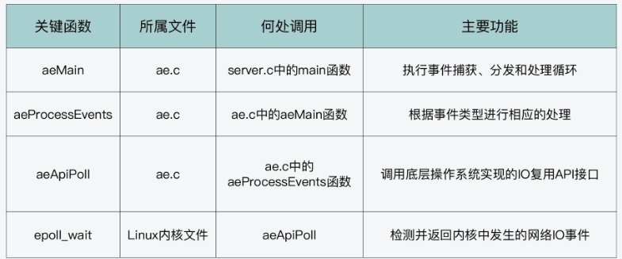
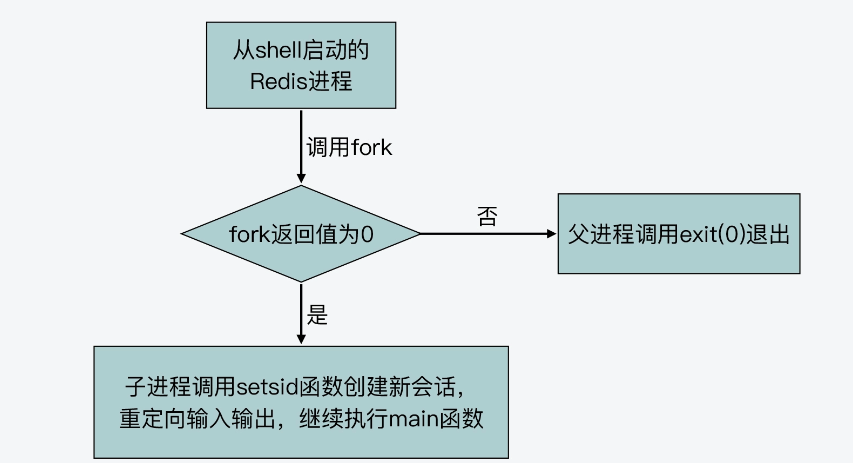
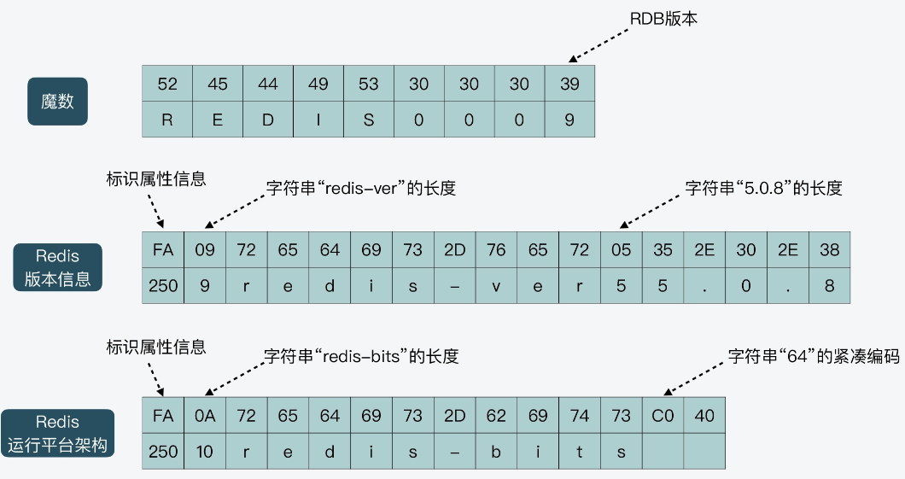

# 一 前言

## 1 为什么要学习Redis源码

- 了解redis底层实现，能够在实际开发中快速排查出问题故障点
- 学习源码阅读方法，培养源码习惯
- 学习良好的编程规范和技巧，写出高质量代码
- 学习计算机系统设计思想


## 2 如何正确学习Redis源码

- 获得代码全景图
- 在阅读代码前确定具体学习目标，并做好原理准备
- 在阅读代码时，先梳理出代码的主线逻辑，再详细学习分支细节


## 3 学习目标

- 数据结构：学习 Redis 主要数据结构的设计思想和实现，包括字符串的实现方法、内存紧凑型结构的设计、哈希表性能优化设计，以及 ziplist、quicklist、listpack、跳表的设计与实现等。
- 网络通信与执行模型：掌握 Redis server 的启动流程、高性能网络通信设计与实现、事件驱动框架的设计与实现、Redis 线程类型的设计和优化等。
- 缓存：了解常见缓存替换算法如何从原理转变为代码。
- 可靠性保证：掌握 RDB、AOF 的具体实现，分布式系统中 Raft 一致性协议的设计实现，故障切换的关键代码实现等。
- 切片集群：学习到 Redis 切片集群中关键机制的设计与实现，包括 Gossip 通信协议、请求重定向、数据迁移等。


# 二 Redis整体架构

## 1 Redis源码目录结构

Redis的源码总目录下一共包含了

- deps
- src
- tests
- utils

四个子目录


### deps目录

主要包含了Redis依赖的第三方代码库，包括 

- Redis 的 C 语言版本客户端代码 hiredis、jemalloc 内存分配器代码、readline 功能的替代代码 linenoise，
-  lua 脚本代码


### src目录

这个目录包含了Redis所有功能模块的代码文件


### tests目录

功能模块测试和单元测试的代码。Redis 实现的测试代码可以分成四部分，分别是

- 单元测试（对应 unit 子目录）
- Redis Cluster 功能测试（对应 cluster 子目录）
- 哨兵功能测试（对应 sentinel 子目录）
- 主从复制功能测试（对应 integration 子目录）

不过在 tests 目录中，除了有针对特定功能模块的测试代码外，还有一些代码是用来支撑测试功能的，这些代码在 assets、helpers、modules、support 四个目录中。


### utils目录

在 Redis 开发过程中，还有一些功能属于辅助性功能，包括用于创建 Redis Cluster 的脚本、用于测试 LRU 算法效果的程序，以及可视化 rehash 过程的程序。在 Redis 代码结构中，这些功能代码都被归类到了 utils 目录中统一管理。


### 配置文件

除了 deps、src、tests、utils 四个子目录以外，Redis 源码总目录下其实还包含了两个重要的配置文件，一个是 **Redis 实例的配置文件 redis.conf**，另一个是**哨兵的配置文件 sentinel.conf**


### Redis代码全景图


## 2 Redis功能模块与源码对应

分别按照 Redis 的服务器实例、数据库操作、可靠性和可扩展性保证、辅助功能四个维度，把 Redis 功能源码梳理成了四条代码路径


### 服务器实例

Redis在运行时是一个网络服务器实例，因此相应的实现**服务器实例的初始化**和**主体控制流程**，就在**server.h/server.c**中。Redis整个代码的main入口函数也是在**server.c**中。


对于一个网络服务器来说，还需要提供网络通信功能。Redis使用了**基于事件驱动机制的网络通信框架**，涉及的代码文件包括**ae.h/ae.c，ae_epoll.c，ae_evport.c，ae_kqueue.c，ae_select.c**。


Redis 对 TCP 网络通信的 Socket 连接、设置等操作进行了封装，这些封装后的函数实现在 **anet.h/anet.c** 中。


### 数据库数据类型与操作

Redis 数据库提供了丰富的键值对类型，其中包括了 **String、List、Hash、Set 和 Sorted Set** 这五种基本键值类型。此外，Redis 还支持**位图、HyperLogLog、Geo** 等扩展数据类型。


为了支持这些数据类型，Redis 就使用了多种数据结构来作为这些类型的底层结构。比如，String 类型的底层数据结构是 SDS，而 Hash 类型的底层数据结构包括哈希表和压缩列表。


Redis 作为数据库，还实现了对键值对的新增、查询、修改和删除等操作接口，这部分功能是在 db.c 文件实现的。

Redis作为内存数据库，其保存的数据量受到内存大小的限制。因此Redis从三个方面来优化内存使用：

- 内存分配：Redis 支持使用不同的内存分配器，包括 glibc 库提供的默认分配器 tcmalloc、第三方库提供的 jemalloc。Redis 把对内存分配器的封装实现在了 zmalloc.h/zmalloc.c
- 内存回收：Redis 支持**设置过期 key**，并针对过期 key 可以使用不同删除策略，这部分代码实现在 expire.c 文件中。同时，为了避免大量 key 删除回收内存，会对系统性能产生影响，Redis 在 lazyfree.c 中实现了**异步删除**的功能，所以这样，我们就可以使用后台 IO 线程来完成删除，以避免对 Redis 主线程的影响。
- 数据替换：Redis 实现的数据替换策略有很多种，包括 LRU、LFU 等经典算法。这部分的代码实现在了 evict.c 中。


### 高可靠性和高可扩展性

Redis的可靠性主要体现在对数据做持久化保存，并且还实现了主从复制机制，从而可以提供故障恢复的功能。

Redis 的数据持久化实现有两种方式：内存快照 **RDB** 和 **AOF** 日志，分别实现在了 rdb.h/rdb.c 和 aof.c 中。

Redis 把主从复制功能实现在了 replication.c 文件中。Redis 的主从集群在进行恢复时，主要是依赖于哨兵机制，而这部分功能则直接实现在了 sentinel.c 文件中。

Redis 高可扩展性保证的功能，是通过 Redis Cluster 来实现的，这部分代码也非常集中，就是在 cluster.h/cluster.c 代码文件中。


### 辅助功能

Redis 还实现了一些用于支持系统运维的辅助功能

- Redis 在 latency.h/latency.c 中实现了**操作延迟监控**的功能；
- Redis 在 slowlog.h/slowlog.c 中实现了**慢命令**的记录功能，等等。
- Redis 实现了对系统进行性能评测的功能，这部分代码在 redis-benchmark.c 中。


## 小结

整理了一下代码分类：


数据类型

- String：t_string.c、sds.c、bitops.c
- List：t_list.c、ziplist.c
- Hash：t_hash.c、ziplist.c、dict.c
- Set：t_set.c、intset.c
- Sorted Set：t_zset.c、ziplist.c、dict.c
- HyperLoglog：hyperloglog.c
- Geo：geo.c、geohash.c、geohash_helper.c
- Stream：t_stream.c、rax.c、listpack.c


全局（被各个类所引用的对象）

- Server：server.c、anet.c
- Object：object.c
- 键值对：db.c
- 事件驱动：ae.c、ae_epoll.c、ae_kqueue.c、ae_evport.c、ae_select.c、networking.c
- 内存回收：expire.c、lazyfree.c
- 数据替换：evict.c
- 后台线程：bio.c
- 事务：multi.c
- 内存分配：zmalloc.c
- 双向链表：adlist.c


高可用和集群

- 持久化：RDB：rdb.c、redis-check-rdb.c、AOF：aof.c、redis-check-aof.c 
- 主从复制：replication.c
- 哨兵：sentinel.c
- 集群：cluster.c


辅助功能：

- 延迟统计：latency.c
-  慢日志：slowlog.c
- 通知：notify.c
- 基准性能：redis-benchmark.c


# 三 数据结构模块


## 1 键值对中字符串的实现

Redis设计了**简单动态字符串**（Simple Dynamic String，SDS）的结构，用来表示字符串。相比于 C 语言中的字符串实现，SDS 这种字符串的实现方式，会**提升字符串的操作效率，并且可以用来保存二进制数据**


### char*的不足

- 操作效率低：获取长度需遍历，O(N)复杂度
  
- 二进制不安全：无法存储包含 \0 的数据
  

### SDS的设计


#### 紧凑型字符串结构的编程技巧

SDS 结构中有一个元数据 flags，表示的是 SDS 类型。SDS 一共设计了 5 种类型，分别是 sdshdr5、sdshdr8、sdshdr16、sdshdr32 和 sdshdr64。这 5 种类型的主要区别就在于，它们数据结构中的字符数组现有长度 len 和分配空间长度 alloc，这两个元数据的数据类型不同。

```c
//Redis 在编程上还使用了专门的编译优化来节省内存空间__attribute__ ((__packed__))
//告诉编译器，在编译 sdshdr8 结构时，不要使用字节对齐的方式，而是采用紧凑的方式分配内存
struct __attribute__ ((__packed__)) sdshdr8 {
    uint8_t len; /* 字符数组现有长度*/
    uint8_t alloc; /* 字符数组的已分配空间，不包括结构体和\0结束字符*/
    unsigned char flags; /* SDS类型*/
    char buf[]; /*字符数组*/
};
```

SDS 之所以设计不同的结构头（即不同类型），是为了能灵活保存不同大小的字符串，从而有效节省内存空间。


### 小结

SDS的优势

- 操作效率高：获取长度无需遍历，O(1)复杂度 

- 二进制安全：因单独记录长度字段，所以可存储包含 \0 的数据 -

- 兼容 C 字符串函数，可直接使用字符串 API 

另外 Redis 在操作 SDS 时，为了避免频繁操作字符串时，每次「申请、释放」内存的开销，还做了这些优化：

- 内存预分配：SDS 扩容，会多申请一些内存（小于 1MB 翻倍扩容，大于 1MB 按 1MB 扩容）
- 多余内存不释放：SDS 缩容，不释放多余的内存，下次使用可直接复用这些内存
- 这种策略，是以多占一些内存的方式，换取「追加」操作的速度。 这个内存预分配策略，详细逻辑可以看 sds.c 的 sdsMakeRoomFor 函数。

char*的不足

- 使用“\0”表示字符串结束，操作时需遍历字符串，效率不高，并且无法完整表示包含“\0”的数据，因而这就无法满足 Redis 的需求。


Redis 中字符串的设计思想与实现方法。Redis 专门设计了 SDS 数据结构，在字符数组的基础上，增加了字符数组长度和分配空间大小等元数据。这样一来，需要基于字符串长度进行的追加、复制、比较等操作，就可以直接读取元数据，效率也就提升了。而且，SDS 不通过字符串中的“\0”字符判断字符串结束，而是直接将其作为二进制数据处理，可以用来保存图片等二进制数据。


### 习题

SDS 字符串在 Redis 内部模块实现中也被广泛使用，你能在 Redis server 和客户端的实现中，找到使用 SDS 字符串的地方么？ 

1、Redis 中所有 key 的类型就是 SDS（详见 db.c 的 dbAdd 函数） 

2、Redis Server 在读取 Client 发来的请求时，会先读到一个缓冲区中，这个缓冲区也是 SDS（详见 server.h 中 struct client 的 querybuf 字段） 

3、写操作追加到 AOF 时，也会先写到 AOF 缓冲区，这个缓冲区也是 SDS （详见 server.h 中 struct client 的 aof_buf 字段）


## 2 如何实现一个性能优异的Hash表

Hash表的特点：

- 理论能以O(1)的复杂度查询数据
- 通过Hash函数的计算定位数据在表中的位置


实际应用Hash表碰到的问题：

- 哈希冲突
- rehash开销


Redis实现Hash的方案：

- 针对哈希冲突，采用了链式哈希，将具有相同哈希值的数据链起来
- 针对rehash开销，Redis实现了渐进式rehash设计


### 什么是哈希冲突

在用 Hash 函数把键映射到 Hash 表空间时，不可避免地会出现**不同的键被映射到数组的同一个位置上**。而如果同一个位置只能保存一个键值对，就会导致 Hash 表保存的数据非常有限，这就是我们常说的哈希冲突


### 链式哈希如何设计与实现

所谓的链式哈希，就是**用一个链表把映射到 Hash 表同一桶中的键给连接起来**。

Redis中和Hash表实现相关的文件主要是 dict.c 和 dict.h。

```c
//Redis中Hash表的定义
typedef struct dictht {
    dictEntry **table; //二维数组
    unsigned long size; //Hash表大小
    unsigned long sizemask;
    unsigned long used;
} dictht;

//dictEntry
typedef struct dictEntry {
    void *key;
    //一种节省内存的开发小技巧，当值为整数或双精度浮点数时，由于本身就是64位，就可以不用指针指向，而是可以直接存在键值对结构体中，避免再使用一个指针
    union {
        void *val;
        uint64_t u64;
        int64_t s64;
        double d;
    } v;
    struct dictEntry *next;
} dictEntry;
```


### Redis如何实现rehash

rehash 操作，其实就是指扩大 Hash 表空间。而 Redis 实现 rehash 的基本思路是这样的：

- 首先，Redis 准备了两个哈希表，用于 rehash 时交替保存数据
- 其次，在正常服务请求阶段，所有的键值对写入哈希表 ht[0]。
- 接着，当进行 rehash 时，键值对被迁移到哈希表 ht[1]中。
- 最后，当迁移完成后，ht[0]的空间会被释放，并把 ht[1]的地址赋值给 ht[0]，ht[1]的表大小设置为 0。这样一来，又回到了正常服务请求的阶段，ht[0]接收和服务请求，ht[1]作为下一次 rehash 时的迁移表


#### 什么时候触发rehash

Redis 中触发 rehash 操作的关键，就是 _dictExpandIfNeeded 函数和 updateDictResizePolicy 函数。_

- dictExpandIfNeeded 函数会根据 Hash 表的负载因子以及能否进行 rehash 的标识，判断是否进行 rehash
- 而 updateDictResizePolicy 函数会根据 RDB 和 AOF 的执行情况，启用或禁用 rehash


#### rehash扩容多大

如果当前表的已用空间大小为 size，那么就将表扩容到 size*2 的大小

```c
dictExpand(d, d->ht[0].used*2);

//在 dictExpand 函数中，具体执行是由 _dictNextPower 函数完成的
static unsigned long _dictNextPower(unsigned long size)
{
    //哈希表的初始大小
    unsigned long i = DICT_HT_INITIAL_SIZE;
    //如果要扩容的大小已经超过最大值，则返回最大值加1
    if (size >= LONG_MAX) return LONG_MAX + 1LU;
    //扩容大小没有超过最大值
    while(1) {
        //如果扩容大小大于等于最大值，就返回截至当前扩到的大小
        if (i >= size)
            return i;
        //每一步扩容都在现有大小基础上乘以2
        i *= 2;
    }
}
```


#### 渐进式rehash如何实现

为什么要实现rehash：

- Hash表在执行rehash时，很多键需要从原来的位置拷贝到新位置。在键拷贝的过程中会**阻塞主线程**，产生rehash开销
- 渐进式rehash就是redis不会一次性拷贝所有的键，而是进行分批拷贝，减小对主线程的影响


渐进式 rehash 在代码层面的实现，这里有两个关键函数：dictRehash 和 _dictRehashStep

dictRehash 函数本身是按照 bucket 粒度执行哈希项迁移的，它内部执行的 bucket 迁移个数，主要由传入的循环次数变量 n 来决定。

```c
int dictRehash(dict *d, int n) {
    //表示已经检查过的空 bucket，当检查了一定数量的空 bucket 后，这一轮的 rehash 就停止执行
    int empty_visits = n*10;
    ...
    //主循环，根据要拷贝的bucket数量n，循环n次后停止或ht[0]中的数据迁移完停止
    while(n-- && d->ht[0].used != 0) {
       //如果当前要迁移的bucket中没有元素 
        while(d->ht[0].table[d->rehashidx] == NULL) {
            d->rehashidx++; 
            if (--empty_visits == 0) return 1; 
        }
        //获得哈希表中哈希项 
        de = d->ht[0].table[d->rehashidx]; 
        //如果rehashidx指向的bucket不为空 
        while(de) { 
            uint64_t h; 
            //获得同一个bucket中下一个哈希项 
            nextde = de->next; 
            //根据扩容后的哈希表ht[1]大小，计算当前哈希项在扩容后哈希表中的bucket位置 
            h = dictHashKey(d, de->key) & d->ht[1].sizemask; 
            //将当前哈希项添加到扩容后的哈希表ht[1]中 
            de->next = d->ht[1].table[h]; 
            d->ht[1].table[h] = de; 
            //减少当前哈希表的哈希项个数 
            d->ht[0].used--; 
            //增加扩容后哈希表的哈希项个数 
            d->ht[1].used++; 
            //指向下一个哈希项 
            de = nextde; 
        } 
        //如果当前bucket中已经没有哈希项了，将该bucket置为NULL 
        d->ht[0].table[d->rehashidx] = NULL; 
        //将rehash加1，下一次将迁移下一个bucket中的元素 
        d->rehashidx++;
    }
    //判断ht[0]的数据是否迁移完成
    if (d->ht[0].used == 0) {
        //ht[0]迁移完后，释放ht[0]内存空间
        zfree(d->ht[0].table);
        //让ht[0]指向ht[1]，以便接受正常的请求
        d->ht[0] = d->ht[1];
        //重置ht[1]的大小为0
        _dictReset(&d->ht[1]);
        //设置全局哈希表的rehashidx标识为-1，表示rehash结束
        d->rehashidx = -1;
        //返回0，表示ht[0]中所有元素都迁移完
        return 0;
    }
    //返回1，表示ht[0]中仍然有元素没有迁移完
    return 1;
}
```


渐进式 rehash 相关的第二个关键函数 _dictRehashStep，这个函数实现了每次只对一个 bucket 执行 rehash。

从 Redis 的源码中我们可以看到，一共会有 5 个函数通过调用 _dictRehashStep 函数，进而调用 dictRehash 函数，来执行 rehash，它们分别是：dictAddRaw，dictGenericDelete，dictFind，dictGetRandomKey，dictGetSomeKeys。

```c
static void _dictRehashStep(dict *d) {
//给dictRehash传入的循环次数参数为1，表明每迁移完一个bucket ，就执行正常操作
    if (d->iterators == 0) dictRehash(d,1);
}
```


### 小结

1、Redis 中的 dict 数据结构，采用「链式哈希」的方式存储，当哈希冲突严重时，会开辟一个新的哈希表，翻倍扩容，并采用「渐进式 rehash」的方式迁移数据 

2、所谓「渐进式 rehash」是指，把很大块迁移数据的开销，平摊到多次小的操作中，目的是降低主线程的性能影响 

3、Redis 中凡是需要 O(1) 时间获取 k-v 数据的场景，都使用了 dict 这个数据结构，也就是说 dict 是 Redis 中重中之重的「底层数据结构」 

4、dict 封装好了友好的「增删改查」API，并在适当时机「自动扩容、缩容」，这给上层数据类型（Hash/Set/Sorted Set）、全局哈希表的实现提供了非常大的便利 

5、例如，Redis 中每个 DB 存放数据的「全局哈希表、过期key」都用到了 dict： 

```c
// server.h 
typedef struct redisDb {   
    // 全局哈希表，数据键值对存在这
    dict *dict;     
    // 过期 key + 过期时间 存在这    ...  
    dict *expires;  
    
}
```


 6、「全局哈希表」在触发渐进式 rehash 的情况有 2 个： 

- 增删改查哈希表时：每次迁移 1 个哈希桶（文章提到的 dict.c 中的 _dictRehashStep 函数） 
- 定时 rehash：如果 dict 一直没有操作，无法渐进式迁移数据，那主线程会默认每间隔 100ms 执行一次迁移操作。这里一次会以 100 个桶为基本单位迁移数据，并限制如果一次操作耗时超时 1ms 就结束本次任务，待下次再次触发迁移（文章没提到这个，详见 dict.c 的 dictRehashMilliseconds 函数） （注意：定时 rehash 只会迁移全局哈希表中的数据，不会定时迁移 Hash/Set/Sorted Set 下的哈希表的数据，这些哈希表只会在操作数据时做实时的渐进式 rehash） 

7、dict 在负载因子超过 1 时（used: bucket size >= 1），会触发 rehash。但如果 Redis 正在 RDB 或 AOF rewrite，为避免父进程大量写时复制，会暂时关闭触发 rehash。但这里有个例外，如果负载因子超过了 5（哈希冲突已非常严重），依旧会强制做 rehash（重点） 

8、dict 在 rehash 期间，查询旧哈希表找不到结果，还需要在新哈希表查询一次


## 3 内存友好的数据结构的细化设计

Redis 用于优化内存使用效率的两种方法：内存优化的数据结构设计和节省内存的共享数据访问。

对于实现数据结构来说，如果想要节省内存，Redis 就给我们提供了两个优秀的设计思想：一个是使用连续的内存空间，避免内存碎片开销；二个是针对不同长度的数据，采用不同大小的元数据，以避免使用统一大小的元数据，造成内存空间的浪费。

另外在数据访问方面，使用共享对象其实可以避免重复创建冗余的数据，从而也可以有效地节省内存空间。不过，共享对象主要适用于只读场景，如果一个字符串被反复地修改，就无法被多个请求共享访问了。


### redisObject结构体

redisObject 结构体是在 server.h 文件中定义的，主要功能是用来保存键值对中的值。

```c
// server.h
typedef struct redisObject {
    //变量后使用冒号和数值的定义方法是语言中的位域定义法，可以用来有效地节省内存开销
    unsigned type:4; //redisObject的数据类型，4个bits
    unsigned encoding:4; //redisObject的编码类型，4个bits
    unsigned lru:LRU_BITS;  //redisObject的LRU时间，LRU_BITS为24个bits
    int refcount; //redisObject的引用计数，4个字节
    void *ptr; //指向值的指针，8个字节
} robj;
```


### SDS内存友好设计

#### 嵌入式字符串

SDS 在保存比较小的字符串时，会使用嵌入式字符串的设计方法，将字符串直接保存在 redisObject 结构体中。


再object.c有创建字符串的方法 createStringObject

```c
#define OBJ_ENCODING_EMBSTR_SIZE_LIMIT 44
robj *createStringObject(const char *ptr, size_t len) {
    if (len <= OBJ_ENCODING_EMBSTR_SIZE_LIMIT)
        return createEmbeddedStringObject(ptr,len);
    else
        return createRawStringObject(ptr,len);
}

//创建 String 类型的值的时候，会调用 createObject 函数
//createObject 函数主要是用来创建 Redis 的数据对象的。其参数为：要创建的数据对象类型，指向数据对象的指针
robj *createRawStringObject(const char *ptr, size_t len) {
    return createObject(OBJ_STRING, sdsnewlen(ptr,len));
}

robj *createObject(int type, void *ptr) {
    robj *o = zmalloc(sizeof(*o));
    o->type = type;
    o->encoding = OBJ_ENCODING_RAW;
    o->ptr = ptr;
    o->refcount = 1;

    /* Set the LRU to the current lruclock (minutes resolution), or
     * alternatively the LFU counter. */
    if (server.maxmemory_policy & MAXMEMORY_FLAG_LFU) {
        o->lru = (LFUGetTimeInMinutes()<<8) | LFU_INIT_VAL;
    } else {
        o->lru = LRU_CLOCK();
    }
    return o;
}
```

普通字符串创建流程图。


在创建普通字符串时，Redis 需要分别给 redisObject 和 SDS （sdsnewlen）分别分配一次内存，这样就既带来了内存分配开销，同时也会导致内存碎片。因此，当字符串小于等于 44 字节时，Redis 就使用了嵌入式字符串的创建方法，该函数会使用一块连续的内存空间，来同时保存 redisObject 和 SDS 结构，以此减少内存分配和内存碎片。

```c
robj *createEmbeddedStringObject(const char *ptr, size_t len) {
    //分配一块连续的内存空间，这块内存空间的大小等于 redisObject 结构体的大小、SDS 结构头 sdshdr8 的大小和字符串大小的总和，并且再加上 1 字节（结束字符“\0”）。
    robj *o = zmalloc(sizeof(robj)+sizeof(struct sdshdr8)+len+1);
    //创建 SDS 结构的指针 sh，并把 sh 指向这块连续空间中 SDS 结构头所在的位置
    struct sdshdr8 *sh = (void*)(o+1);

    o->type = OBJ_STRING;
    o->encoding = OBJ_ENCODING_EMBSTR;
    o->ptr = sh+1;
    o->refcount = 1;
    if (server.maxmemory_policy & MAXMEMORY_FLAG_LFU) {
        o->lru = (LFUGetTimeInMinutes()<<8) | LFU_INIT_VAL;
    } else {
        o->lru = LRU_CLOCK();
    }

    sh->len = len;
    sh->alloc = len;
    sh->flags = SDS_TYPE_8;
    if (ptr == SDS_NOINIT)
        sh->buf[len] = '\0';
    else if (ptr) {
        memcpy(sh->buf,ptr,len);
        sh->buf[len] = '\0';
    } else {
        memset(sh->buf,0,len+1);
    }
    return o;
}
```


### 压缩列表和整数集合的设计

List、Hash 和 Sorted Set 这三种数据类型，都可以使用压缩列表（ziplist）来保存数据。压缩列表的函数定义和实现代码分别在 ziplist.h 和 ziplist.c 中。

压缩列表就是一块连续的内存空间，它通过使用不同的编码来保存数据。

```c
/* Each entry in the ziplist is either a string or an integer. */
typedef struct {
    /* When string is used, it is provided with the length (slen). */
    unsigned char *sval;
    unsigned int slen;
    /* When integer is used, 'sval' is NULL, and lval holds the value. */
    long long lval;
} ziplistEntry;
```

压缩列表的创建

```c
//ziplist的列表头大小，包括2个32 bits整数和1个16bits整数，分别表示压缩列表的总字节数，列表最后一个元素的离列表头的偏移，以及列表中的元素个数
#define ZIPLIST_HEADER_SIZE     (sizeof(uint32_t)*2+sizeof(uint16_t))
//ziplist的列表尾大小，包括1个8 bits整数，表示列表结束。
#define ZIPLIST_END_SIZE        (sizeof(uint8_t))
//ziplist的列表尾字节内容
#define ZIP_END 255 


/* Create a new empty ziplist. */
unsigned char *ziplistNew(void) {
    unsigned int bytes = ZIPLIST_HEADER_SIZE+ZIPLIST_END_SIZE;
    //创建一块连续的内存空间,大小为 ZIPLIST_HEADER_SIZE 和 ZIPLIST_END_SIZE
    unsigned char *zl = zmalloc(bytes);
    ZIPLIST_BYTES(zl) = intrev32ifbe(bytes);
    ZIPLIST_TAIL_OFFSET(zl) = intrev32ifbe(ZIPLIST_HEADER_SIZE);
    //初始数据长度为0
    ZIPLIST_LENGTH(zl) = 0;
    //把该连续空间的最后一个字节赋值为 ZIP_END
    zl[bytes-1] = ZIP_END;
    return zl;
}
```

初始列表如图


往 ziplist 中插入数据时，**ziplist 就会根据数据是字符串还是整数，以及它们的大小进行不同的编码**。这种根据数据大小进行相应编码的设计思想，正是 Redis 为了节省内存而采用的。

```c
/* We use this function to receive information about a ziplist entry.
 * Note that this is not how the data is actually encoded, is just what we
 * get filled by a function in order to operate more easily. */
typedef struct zlentry {
    unsigned int prevrawlensize; /* Bytes used to encode the previous entry len*/
    unsigned int prevrawlen;     /* Previous entry len. */
    unsigned int lensize;        /* Bytes used to encode this entry type/len.
                                    For example strings have a 1, 2 or 5 bytes
                                    header. Integers always use a single byte.*/
    unsigned int len;            /* Bytes used to represent the actual entry.
                                    For strings this is just the string length
                                    while for integers it is 1, 2, 3, 4, 8 or
                                    0 (for 4 bit immediate) depending on the
                                    number range. */
    unsigned int headersize;     /* prevrawlensize + lensize. */
    unsigned char encoding;      /* Set to ZIP_STR_* or ZIP_INT_* depending on
                                    the entry encoding. However for 4 bits
                                    immediate integers this can assume a range
                                    of values and must be range-checked. */
    unsigned char *p;            /* Pointer to the very start of the entry, that
                                    is, this points to prev-entry-len field. */
} zlentry;
```

ziplist 列表项包括三部分内容，分别是前一项的长度（prevlen）、当前项长度信息的编码结果（encoding），以及当前项的实际数据（data）。


ziplist 中会包含多个列表项，每个列表项都是紧挨着彼此存放的，而为了方便查找，每个列表项中都会记录前一项的长度。因为每个列表项的长度不一样，所以如果使用相同的字节大小来记录 prevlen，就会造成内存空间浪费。

假设统一使用 4 字节记录 prevlen，如果前一个列表项只是一个字符串“redis”，长度为 5 个字节，那么我们用 1 个字节（8 bits）就能表示 256 字节长度（2 的 8 次方等于 256）的字符串了。此时，prevlen 用 4 字节记录，其中就有 3 字节是浪费掉了。


ziplist 在对 prevlen 编码时，会先调用 zipStorePrevEntryLength 函数，编码这块以后有兴趣可以研究。

简而言之，针对不同长度的数据，使用不同大小的元数据信息（prevlen 和 encoding），这种方法可以有效地节省内存开销。当然，除了 ziplist 之外，Redis 还设计了一个内存友好的数据结构，这就是整数集合（intset），它是作为底层结构来实现 Set 数据类型的。

和 SDS 嵌入式字符串、ziplist 类似，整数集合也是一块连续的内存空间

```c
typedef struct intset {
    uint32_t encoding;
    uint32_t length;
    int8_t contents[];
} intset;
```


### 节省内存的数据访问

为了避免在内存中反复创建经常被访问的数据，Redis 就采用了共享对象的设计思想。就是把这些常用数据创建为共享对象，当上层应用需要访问它们时，直接读取就行。

主要方法是server.c中的 createSharedObjects 

```c

void createSharedObjects(void) {
   …
   //常见回复信息
   shared.ok = createObject(OBJ_STRING,sdsnew("+OK\r\n"));
   shared.err = createObject(OBJ_STRING,sdsnew("-ERR\r\n"));
   …
   //常见报错信息
 shared.nokeyerr = createObject(OBJ_STRING,sdsnew("-ERR no such key\r\n"));
 shared.syntaxerr = createObject(OBJ_STRING,sdsnew("-ERR syntax error\r\n"));
   //0到9999的整数
   for (j = 0; j < OBJ_SHARED_INTEGERS; j++) {
        shared.integers[j] =
          makeObjectShared(createObject(OBJ_STRING,(void*)(long)j));
        …
    }
   …
}
```


### 小结

1、要想理解 Redis 数据类型的设计，必须要先了解 redisObject。

Redis 的 key 是 String 类型，但 value 可以是很多类型（String/List/Hash/Set/ZSet等），所以 Redis 要想存储多种数据类型，就要设计一个通用的对象进行封装，这个对象就是 redisObject。

```c
// server.h
typedef struct redisObject {
    //变量后使用冒号和数值的定义方法是语言中的位域定义法，可以用来有效地节省内存开销
    unsigned type:4; //redisObject的数据类型，4个bits
    unsigned encoding:4; //redisObject的编码类型，4个bits
    unsigned lru:LRU_BITS;  //redisObject的LRU时间，LRU_BITS为24个bits
    int refcount; //redisObject的引用计数，4个字节
    void *ptr; //指向值的指针，8个字节
} robj;
```

其中，最重要的 2 个字段：

- type：面向用户的数据类型（String/List/Hash/Set/ZSet等）
- encoding：每一种数据类型，可以对应不同的底层数据结构来实现（SDS/ziplist/intset/hashtable/skiplist等）

例如 String，可以用 embstr（嵌入式字符串，redisObject 和 SDS 一起分配内存），也可以用 rawstr（redisObject 和 SDS 分开存储）实现。

又或者，当用户写入的是一个「数字」时，底层会转成 long 来存储，节省内存。 同理，Hash/Set/ZSet 在数据量少时，采用 ziplist 存储，否则就转为 hashtable 来存。

所以，redisObject 的作用在于：

- 为多种数据类型提供统一的表示方式 
- 同一种数据类型，底层可以对应不同实现，节省内存 
- 支持对象共享和引用计数，共享对象存储一份，可多次使用，节省内存 

redisObject 更像是连接「上层数据类型」和「底层数据结构」之间的桥梁。


2、关于 String 类型的实现，底层对应 3 种数据结构：

- embstr：小于 44 字节，嵌入式存储，redisObject 和 SDS 一起分配内存，只分配 1 次内存
  
- rawstr：大于 44 字节，redisObject 和 SDS 分开存储，需分配 2 次内存
- long：整数存储（小于 10000，使用共享对象池存储，但有个前提：Redis 没有设置淘汰策略，详见 object.c 的 tryObjectEncoding 函数）

3、ziplist 的特点：

空ziplist


列表项


- 连续内存存储：每个元素紧凑排列，内存利用率高
- 变长编码：存储数据时，采用变长编码（满足数据长度的前提下，尽可能少分配内存）
- 寻找元素需遍历：存放太多元素，性能会下降（适合少量数据存储）
- 级联更新：更新、删除元素，会引发级联更新（因为内存连续，前面数据膨胀/删除了，后面要跟着一起动） 
- List、Hash、Set、ZSet 底层都用到了 ziplist。

4、intset 的特点：

- Set 存储如果都是数字，采用 intset 存储
- 变长编码：数字范围不同，intset 会选择 int16/int32/int64 编码（intset.c 的 _intsetValueEncoding 函数）
- 有序：intset 在存储时是有序的，这意味着查找一个元素，可使用「二分查找」（intset.c 的 intsetSearch 函数）
- 编码升级/降级：添加、更新、删除元素，数据范围发生变化，会引发编码长度升级或降级


## 4 有序集合为何能同时支持点查询和范围查询

实际上，这个问题背后的本质是：**为什么 Sorted Set 既能支持高效的范围查询（ZRANGEBYSCORE），同时还能以 O(1) 复杂度获取元素权重值（ZSCORE）**？

- 能支持范围查询，是因为它的核心数据结构设计采用了跳表
- 能以常数复杂度获取元素权重，因为采用了哈希表进行索引


### Sorted Set基本结构

```c
/* ZSETs use a specialized version of Skiplists */
//跳表节点
typedef struct zskiplistNode {
    sds ele;
    double score;
    struct zskiplistNode *backward;
    struct zskiplistLevel {
        struct zskiplistNode *forward;
        unsigned long span;
    } level[];
} zskiplistNode;

//跳表
typedef struct zskiplist {
    struct zskiplistNode *header, *tail;
    unsigned long length;
    int level;
} zskiplist;

//Sort Set
typedef struct zset {
    dict *dict;
    zskiplist *zsl;
} zset;
```

问题：

- 跳表或哈希表中，各自保存了什么样的数据
- 跳表或哈希表保存的数据如何保持一致


### 跳表的设计与实现

跳表其实是一种**多层的有序链表**


```c
typedef struct zskiplistNode {
    //Sorted Set中的元素
    sds ele;
    //元素权重值
    double score;
    //后向指针,指向该结点的前一个结点
    struct zskiplistNode *backward;
    //节点的level数组，保存每层上的前向指针和跨度
    struct zskiplistLevel {
        struct zskiplistNode *forward;
        unsigned long span;
    } level[];
} zskiplistNode;
```


```c
typedef struct zskiplist {
    struct zskiplistNode *header, *tail;
    unsigned long length;
    int level;
} zskiplist;
```


### 跳表节点查询

当查询一个结点时，跳表会先从头结点的最高层开始，查找下一个结点。而由于跳表结点同时保存了元素和权重，所以跳表在比较结点时，相应地有两个判断条件：

- 当查找到的结点保存的元素权重，比要查找的权重小时，跳表就会继续访问该层上的下一个结点。
- 当查找到的结点保存的元素权重，等于要查找的权重时，跳表会再检查该结点保存的 SDS 类型数据，是否比要查找的 SDS 数据小。如果结点数据小于要查找的数据时，跳表仍然会继续访问该层上的下一个结点。

但是，当上述两个条件都不满足时，跳表就会用到当前查找到的结点的 level 数组了。跳表会使用当前结点 level 数组里的下一层指针，然后沿着下一层指针继续查找，这就相当于跳到了下一层接着查找

```c
//获取跳表的表头
x = zsl->header;
//从最大层数开始逐一遍历
for (i = zsl->level-1; i >= 0; i--) {
   ...
   while (x->level[i].forward && (x->level[i].forward->score < score || (x->level[i].forward->score == score 
    && sdscmp(x->level[i].forward->ele,ele) < 0))) {
      ...
      x = x->level[i].forward;
    }
    ...
}
```


### 哈希表和跳表的组合使用

```c
//Sort Set
typedef struct zset {
    dict *dict;
    zskiplist *zsl;
} zset;

//zset初始化，创建哈希表和跳表
 zs = zmalloc(sizeof(*zs));
 zs->dict = dictCreate(&zsetDictType,NULL);
 zs->zsl = zslCreate();
```

如何保持这两个索引结构中的数据一致？简单来说，就是在往跳表中插入数据时，同时也向哈希表中插入数据。具体代码在zsetAdd这个函数，接下来分析一下zsetAdd的执行过程

- 首先，zsetAdd 函数会判定 Sorted Set 采用的是 ziplist 还是 skiplist 的编码方式。
  - zsetAdd 函数会先使用哈希表的 dictFind 函数，查找要插入的元素是否存在。如果不存在，就直接调用跳表元素插入函数 zslInsert 和哈希表元素插入函数 dictAdd，将新元素分别插入到跳表和哈希表中
  - Redis 并没有把哈希表的操作嵌入到跳表本身的操作函数中，而是在 zsetAdd 函数中依次执行以上两个函数。这样设计的好处是保持了跳表和哈希表两者操作的独立性
- 然后，如果 zsetAdd 函数通过 dictFind 函数发现要插入的元素已经存在，那么 zsetAdd 函数会判断是否要增加元素的权重值。
  - 如果权重值发生了变化，zsetAdd 函数就会调用 zslUpdateScore 函数，更新跳表中的元素权重值。紧接着，zsetAdd 函数会把哈希表中该元素（对应哈希表中的 key）的 value 指向跳表结点中的权重值，这样一来，哈希表中元素的权重值就可以保持最新值了

```c

 //如果采用ziplist编码方式时，zsetAdd函数的处理逻辑
 if (zobj->encoding == OBJ_ENCODING_ZIPLIST) {
   ...
}
//如果采用skiplist编码方式时，zsetAdd函数的处理逻辑
else if (zobj->encoding == OBJ_ENCODING_SKIPLIST) {
        zset *zs = zobj->ptr;
        zskiplistNode *znode;
        dictEntry *de;
        //从哈希表中查询新增元素
        de = dictFind(zs->dict,ele);
        //如果能查询到该元素
        if (de != NULL) {
            /* NX? Return, same element already exists. */
            if (nx) {
                *flags |= ZADD_NOP;
                return 1;
            }
            //从哈希表中查询元素的权重
            curscore = *(double*)dictGetVal(de);


            //如果要更新元素权重值
            if (incr) {
                //更新权重值
               ...
            }


            //如果权重发生变化了
            if (score != curscore) {
                //更新跳表结点
                znode = zslUpdateScore(zs->zsl,curscore,ele,score);
                //让哈希表元素的值指向跳表结点的权重
                dictGetVal(de) = &znode->score; 
                ...
            }
            return 1;
        }
       //如果新元素不存在
        else if (!xx) {
            ele = sdsdup(ele);
            //新插入跳表结点
            znode = zslInsert(zs->zsl,score,ele);
            //新插入哈希表元素
            serverAssert(dictAdd(zs->dict,ele,&znode->score) == DICT_OK);
            ...
            return 1;
        } 
        ..
```


### 小结

1. ZSet 当数据比较少时，采用 ziplist 存储，每个 member/score 元素紧凑排列，节省内存
2. 当数据超过阈值（zset-max-ziplist-entries、zset-max-ziplist-value）后，转为 hashtable + skiplist 存储，降低查询的时间复杂度
3. hashtable 存储 member->score 的关系，所以 ZSCORE 的时间复杂度为 O(1)
4. skiplist 是一个「有序链表 + 多层索引」的结构，把查询元素的复杂度降到了 O(logN)，服务于 ZRANGE/ZREVRANGE 这类命令
5. skiplist 的多层索引，采用「随机」的方式来构建，也就是说每次添加一个元素进来，要不要对这个元素建立「多层索引」？建立「几层索引」？都要通过「随机数」的方式来决定
6. 每次随机一个 0-1 之间的数，如果这个数小于 0.25（25% 概率），那就给这个元素加一层指针，持续随机直到大于 0.25 结束，最终确定这个元素的层数（层数越高，概率越低，且限制最多 64 层，详见 t_zset.c 的 zslRandomLevel 函数）
7. 这个预设「概率」决定了一个跳表的内存占用和查询复杂度：概率设置越低，层数越少，元素指针越少，内存占用也就越少，但查询复杂会变高，反之亦然。这也是 skiplist 的一大特点，可通过控制概率，进而控制内存和查询效率
8. skiplist 新插入一个节点，只需修改这一层前后节点的指针，不影响其它节点的层数，降低了操作复杂度（相比平衡二叉树的再平衡，skiplist 插入性能更优）
   1. skiplist 更省内存：25% 概率的随机层数，可通过公式计算出 skiplist 平均每个节点的指针数是 1.33 个，平衡二叉树每个节点指针是 2 个（左右子树）
   2. skiplist 遍历更友好：skiplist 找到大于目标元素后，向后遍历链表即可，平衡树需要通过中序遍历方式来完成，实现也略复杂
   3. skiplist 更易实现和维护：扩展 skiplist 只需要改少量代码即可完成，平衡树维护起来较复杂
9. 课后题：在使用跳表和哈希表相结合的双索引机制时，在获得高效范围查询和单点查询的同时，你能想到有哪些不足之处
   1. 这种发挥「多个数据结构」的优势，来完成某个功能的场景，最大的特点就是「空间换时间」，所以内存占用多是它的不足
   2. 不过 skiplist 在实现时，Redis 作者应该也考虑到这个问题了，就是上面提到的这个「随机概率」，Redis 后期维护可以通过调整这个概率，进而达到「控制」查询效率和内存平衡的结果。当然，这个预设值是固定写死的，不可配置，应该是 Redis 作者经过测试和权衡后的设定，我们这里只需要知晓原理就好


## 5 从ziplist到quicklist，再到listpack的启发

1、ziplist 设计的初衷就是「节省内存」，在存储数据时，把内存利用率发挥到了极致： 

- 数字按「整型」编码存储，比直接当字符串存内存占用少

- 数据「长度」字段，会根据内容的大小选择最小的长度编码

- 甚至对于极小的数据，干脆把内容直接放到了「长度」字段中（前几个位表示长度，后几个位存数据） 

2、但 ziplist 的劣势也很明显：

- 寻找元素只能挨个遍历，存储过长数据，查询性能很低

- 每个元素中保存了「上一个」元素的长度（为了方便反向遍历），这会导致上一个元素内容发生修改，长度超过了原来的编码长度，下一个元素的内容也要跟着变，重新分配内存，进而就有可能再次引起下一级的变化，一级级更新下去，频繁申请内存 

3、想要缓解 ziplist 的问题，比较简单直接的方案就是，多个数据项，不再用一个 ziplist 来存，而是分拆到多个 ziplist 中，每个 ziplist 用指针串起来，这样修改其中一个数据项，即便发生级联更新，也只会影响这一个 ziplist，其它 ziplist 不受影响，这种方案就是 quicklist： qucklist: ziplist1(也叫quicklistNode) <-> ziplist2 <-> ziplist3 <-> ... 

4、List 数据类型底层实现，就是用的 quicklist，因为它是一个链表，所以 LPUSH/LPOP/RPUSH/RPOP 的复杂度是 O(1) 

5、List 中每个 ziplist 节点可以存的元素个数/总大小，可以通过 list-max-ziplist-size 配置：

- 正数：ziplist 最多包含几个数据项

- 负数：取值 -1 ~ -5，表示每个 ziplist 存储最大的字节数，默认 -2，每个ziplist 8KB ziplist 超过上述任一配置，添加新元素就会新建 ziplist 插入到链表中。 

6、List 因为更多是两头操作，为了节省内存，还可以把中间的 ziplist「压缩」，具体可看 list-compress-depth 配置项，默认配置不压缩 7、要想彻底解决 ziplist 级联更新问题，本质上要修改 ziplist 的存储结构，也就是不要让每个元素保存「上一个」元素的长度即可，所以才有了 listpack 

8、listpack 每个元素项不再保存上一个元素的长度，而是优化元素内字段的顺序，来保证既可以从前也可以向后遍历 

9、listpack 是为了替代 ziplist 为设计的，但因为 List/Hash/Set/ZSet 都严重依赖 ziplist，所以这个替换之路很漫长，目前只有 Stream 数据类型用到了 listpack


## 6 Redis种Stream使用的底层数据结构——Radix tree + listpack

作为有序索引，Radix Tree 也能提供范围查询，和我们日常使用的 B+ 树，以及第5讲中介绍的跳表相比，你觉得 Radix Tree 有什么优势和不足么？ 

1、Radix Tree 优势 

本质上是前缀树，所以存储有「公共前缀」的数据时，比 B+ 树、跳表节省内存

没有公共前缀的数据项，压缩存储，value 用 listpack 存储，也可以节省内存

查询复杂度是 O(K)，只与「目标长度」有关，与总数据量无关

这种数据结构也经常用在搜索引擎提示、文字自动补全等场景 Stream 在存消息时，推荐使用默认自动生成的「时间戳+序号」作为消息 ID，不建议自己指定消息 ID，这样才能发挥 Radix Tree 公共前缀的优势。 

2、Radix Tree 不足

如果数据集公共前缀较少，会导致内存占用多

增删节点需要处理其它节点的「分裂、合并」，跳表只需调整前后指针即可 - B+ 树、跳表范围查询友好，直接遍历链表即可，Radix Tree 需遍历树结构

实现难度高比 B+ 树、跳表复杂 每种数据结构都是在面对不同问题场景下，才被设计出来的，结合各自场景中的数据特点，使用优势最大的数据结构才是正解。


3、B+树和跳表的关联

B+树和跳跃表这两种数据结构在本身设计上是有亲缘关系的，其实如果把B+树拉直来看不难发现其结构和跳跃表很相似，甚至B+树的父亲结点其实类似跳跃表的level层级。

在当前计算机硬件存储设计上，B+树能比跳表存储更大量级的数据，因为跳表需要通过增加层高来提高索引效率，而B+树只需要增加树的深度。此外B+树同一叶子的连续性更加符合当代计算机的存储结构。然而跳表的层高具有随机性，当层高较大的时候磁盘插入会带来一定的开销，且不利于分块。


4、Redis为什么不适用B+树而选择跳表

因为数据有序性的实现B+树不如跳表，跳表的时间性能是优于B+树的（B+树不是二叉树，二分的效率是比较高的）。此外跳表最低层就是一条链表，对于需要实现范围查询的功能是比较有利的，而且Redis是基于内存设计的，无需考虑海量数据的场景。


# 四 事件驱动框架和执行模型模块

- Redis server的启动过程
- 基于事件驱动框架的网络通信机制
- Redis线程执行模型

## 1 Redis server启动后会做哪些操作

### main函数：Redis server的入口

对于 Redis 的 main 函数来说，它执行的工作分成了五个阶段

#### 阶段一：基本初始化

在这个阶段，main 函数主要是完成一些基本的初始化工作，包括设置 server 运行的时区、设置哈希函数的随机种子等。这部分工作的主要调用函数如下所示：

```c
//设置时区
setlocale(LC_COLLATE,"");
tzset();
...
//设置随机种子
char hashseed[16];
getRandomHexChars(hashseed,sizeof(hashseed));
dictSetHashFunctionSeed((uint8_t*)hashseed);
```

在 main 函数的开始部分，有一段宏定义覆盖的代码。这部分代码的作用是，如果定义了 REDIS_TEST 宏定义，并且 Redis server 启动时的参数符合测试参数，那么 main 函数就会执行相应的测试程序

```c
#ifdef REDIS_TEST
    if (argc == 3 && !strcasecmp(argv[1], "test")) {
        //如果启动参数有test和ziplist，那么就调用ziplistTest函数进行ziplist的测试
        if (!strcasecmp(argv[2], "ziplist")) {
            return ziplistTest(argc, argv);
        } else if (!strcasecmp(argv[2], "quicklist")) {
            quicklistTest(argc, argv);
        } else if (!strcasecmp(argv[2], "intset")) {
            return intsetTest(argc, argv);
        } else if (!strcasecmp(argv[2], "zipmap")) {
            return zipmapTest(argc, argv);
        } else if (!strcasecmp(argv[2], "sha1test")) {
            return sha1Test(argc, argv);
        } else if (!strcasecmp(argv[2], "util")) {
            return utilTest(argc, argv);
        } else if (!strcasecmp(argv[2], "endianconv")) {
            return endianconvTest(argc, argv);
        } else if (!strcasecmp(argv[2], "crc64")) {
            return crc64Test(argc, argv);
        } else if (!strcasecmp(argv[2], "zmalloc")) {
            return zmalloc_test(argc, argv);
        }

        return -1; /* test not found */
    }
#endif
```

#### 阶段二：检查哨兵模式，并检查是否要执行RDB检测或AOF检测

```c
server.sentinel_mode = checkForSentinelMode(argc,argv);


...
//判断server是否设置为哨兵模式
if (server.sentinel_mode) {
        initSentinelConfig();  //初始化哨兵的配置
        initSentinel();   //初始化哨兵模式
}
...
```


```c
if (strstr(argv[0],"redis-check-rdb") != NULL)
    redis_check_rdb_main(argc,argv,NULL);
else if (strstr(argv[0],"redis-check-aof") != NULL)
    redis_check_aof_main(argc,argv);
```

#### 阶段三：运行参数解析

在这一阶段，main 函数会对命令行传入的参数进行解析，并且调用 loadServerConfig 函数，对命令行参数和配置文件中的参数进行合并处理，然后为 Redis 各功能模块的关键参数设置合适的取值，以便 server 能高效地运行

#### 阶段四：初始化server

在完成对运行参数的解析和设置后，main 函数会调用 initServer 函数，对 server 运行时的各种资源进行初始化工作。这主要包括了 server 资源管理所需的数据结构初始化、键值对数据库初始化、server 网络框架初始化等。

而在调用完 initServer 后，main 函数还会再次判断当前 server 是否为哨兵模式。如果是哨兵模式，main 函数会调用 sentinelIsRunning 函数，设置启动哨兵模式。否则的话，main 函数会调用 loadDataFromDisk 函数，从磁盘上加载 AOF 或者是 RDB 文件，以便恢复之前的数据

#### 阶段五：执行事件驱动框架

为了能高效处理高并发的客户端连接请求，Redis 采用了事件驱动框架，来并发处理不同客户端的连接和读写请求。所以，main 函数执行到最后时，会调用 aeMain 函数进入事件驱动框架，开始循环处理各种触发的事件


### Redis运行参数解析与设置

掌握这些关键参数的设置，可以帮助提升 Redis 实例的运行效率

#### Redis主要参数类型

通用参数、数据结构参数、网络参数、持久化参数、主从复制参数、切片集群参数、性能优化参数


#### Redis参数的设置方法

Redis 对运行参数的设置实际上会经过三轮赋值，分别是默认配置值、命令行启动参数，以及配置文件配置值


首先，Redis 在 main 函数中会先调用 initServerConfig 函数，为各种参数设置默认值。参数的默认值统一定义在 server.h 文件中，都是以 CONFIG_DEFAULT 开头的宏定义变量。

```c
#define CONFIG_DEFAULT_HZ        10   //server后台任务的默认运行频率         
#define CONFIG_MIN_HZ            1    // server后台任务的最小运行频率
#define CONFIG_MAX_HZ            500 // server后台任务的最大运行频率
#define CONFIG_DEFAULT_SERVER_PORT  6379  //server监听的默认TCP端口
#define CONFIG_DEFAULT_CLIENT_TIMEOUT  0  //客户端超时时间，默认为0，表示没有超时限制
```


在命令行上设置运行参数的值

```c
./redis-server --port 7379
```


Redis 在使用 initServerConfig 函数对参数设置默认配置值后，接下来，main 函数就会对 Redis 程序启动时的命令行参数进行逐一解析。main 函数会把解析后的参数及参数值保存成字符串，接着，main 函数会调用 loadServerConfig 函数进行第二和第三轮的赋值。以下代码显示了 main 函数对命令行参数的解析，以及调用 loadServerConfig 函数的过程

```c

int main(int argc, char **argv) {
…
//保存命令行参数
for (j = 0; j < argc; j++) server.exec_argv[j] = zstrdup(argv[j]);
…
if (argc >= 2) {
   …
   //对每个运行时参数进行解析
   while(j != argc) {
      …
   }
   …
   //
   loadServerConfig(configfile,options);
}
```


### initServer：初始化 Redis server

Redis server 的初始化操作，主要可以分成三个步骤

- 第一步，Redis server 运行时需要对多种资源进行管理。比如说，和 server 连接的客户端、从库等，Redis 用作缓存时的替换候选集，以及 server 运行时的状态信息，这些资源的管理信息都会在 initServer 函数中进行初始化

- 第二步，在完成资源管理信息的初始化后，initServer 函数会对 Redis 数据库进行初始化。

  ```c
  //一个 Redis 实例可以同时运行多个数据库，所以 initServer 函数会使用一个循环，依次为每个数据库创建相应的数据结构
  for (j = 0; j < server.dbnum; j++) {
          //创建全局哈希表
          server.db[j].dict = dictCreate(&dbDictType,NULL);
          //创建过期key的信息表
          server.db[j].expires = dictCreate(&keyptrDictType,NULL);
          //为被BLPOP阻塞的key创建信息表
          server.db[j].blocking_keys = dictCreate(&keylistDictType,NULL);
          //为将执行PUSH的阻塞key创建信息表
          server.db[j].ready_keys = dictCreate(&objectKeyPointerValueDictType,NULL);
          //为被MULTI/WATCH操作监听的key创建信息表
          server.db[j].watched_keys = dictCreate(&keylistDictType,NULL);
          …
      }
  ```

- initServer 函数会为运行的 Redis server 创建事件驱动框架，并开始启动端口监听，用于接收外部请求。

  ```c
  //创建事件循环框架
  server.el = aeCreateEventLoop(server.maxclients+CONFIG_FDSET_INCR);
  …
  //开始监听设置的网络端口
  if (server.port != 0 &&
          listenToPort(server.port,server.ipfd,&server.ipfd_count) == C_ERR)
          exit(1);
  …
  //为server后台任务创建定时事件
  if (aeCreateTimeEvent(server.el, 1, serverCron, NULL, NULL) == AE_ERR) {
          serverPanic("Can't create event loop timers.");
          exit(1);
  }
  …
  //为每一个监听的IP设置连接事件的处理函数acceptTcpHandler
  for (j = 0; j < server.ipfd_count; j++) {
          if (aeCreateFileEvent(server.el, server.ipfd[j], AE_READABLE,
              acceptTcpHandler,NULL) == AE_ERR)
         { … }
  }
  ```


### 执行事件驱动框架

事件驱动框架是 Redis server 运行的核心。该框架一旦启动后，就会一直循环执行，每次循环会处理一批触发的网络读写事件

在进入事件驱动循环前，main 函数会分别调用 aeSetBeforeSleepProc 和 aeSetAfterSleepProc 两个函数，来设置每次进入事件循环前 server 需要执行的操作，以及每次事件循环结束后 server 需要执行的操作

```c
int main(int argc, char **argv) {
    …
    aeSetBeforeSleepProc(server.el,beforeSleep);
    aeSetAfterSleepProc(server.el,afterSleep);
    aeMain(server.el);
  aeDeleteEventLoop(server.el);
  ...
}
```


### 小结

- 了解了 Redis server 启动后的五个主要阶段。在这五个阶段中，运行参数解析、server 初始化和执行事件驱动框架则是 Redis sever 启动过程中的三个关键阶段
  - 运行参数解析：默认端口、定时任务频率、数据库数量、AOF刷盘策略、淘汰策略
  - 初始化Server：共享对象池、客户端链表、从库链表、监听端口、全局哈希表
- main函数对运行参数进行了三轮的赋值：默认参数、命令行、配置文件
- 典型的网络服务器执行过程：基本初始化、参数解析、初始化server资源管理、执行事件驱动框架
- 初始化 Server 完成后，Redis 还会启动 3 类后台线程（server.c 的 InitServerLast 函数），协助主线程工作（异步释放 fd、AOF 每秒刷盘、lazyfree）


## 2 Redis事件驱动框架：何时使用select、poll、epoll（上）

- 实现网络通信的基本方法是使用Socket编程，但是基本的Socket编程模型一次只能处理一个客户端连接请求，所以要处理高并发请求，一种方案是使用多线程，让每个线程负责处理一个客户端请求
- Redis负责客户端请求解析和处理的线程只有一个，无法直接采用Socket模型。为了实现高并发的网络通信，Linux提供了select、poll、epoll三种编程模型，Linux上运行的Redis通常采用epoll模型

问题：

- 三种编程模型的区别
- 为什么Redis选择epoll模型

### 为什么 Redis 不使用基本的 Socket 编程模型？

Socket模型：

1. 调用 socket 函数，创建一个套接字。我们通常把这个套接字称为主动套接字（Active Socket）；
2. 调用 bind 函数，将主动套接字和当前服务器的 IP 和监听端口进行绑定；
3. 调用 listen 函数，将主动套接字转换为监听套接字，开始监听客户端的连接。

accept 函数是阻塞函数，也就是说，如果此时一直没有客户端连接请求，那么，服务器端的执行流程会一直阻塞在 accept 函数

```c
listenSocket = socket(); //调用socket系统调用创建一个主动套接字
bind(listenSocket);  //绑定地址和端口
listen(listenSocket); //将默认的主动套接字转换为服务器使用的被动套接字，也就是监听套接字
while (1) { //循环监听是否有客户端连接请求到来
   connSocket = accept(listenSocket); //接受客户端连接
   recv(connsocket); //从客户端读取数据，只能同时处理一个客户端
   send(connsocket); //给客户端返回数据，只能同时处理一个客户端
}
```

要处理多个并发客户端的请求，使用多线程的方法来处理accept函数建立的多个客户端连接请求

```c
listenSocket = socket(); //调用socket系统调用创建一个主动套接字
bind(listenSocket);  //绑定地址和端口
listen(listenSocket); //将默认的主动套接字转换为服务器使用的被动套接字，即监听套接字
while (1) { //循环监听是否有客户端连接到来
   connSocket = accept(listenSocket); //接受客户端连接，返回已连接套接字
   pthread_create(processData, connSocket); //创建新线程对已连接套接字进行处理
   
}

//处理已连接套接字上的读写请求
processData(connSocket){
   recv(connsocket); //从客户端读取数据，只能同时处理一个客户端
   send(connsocket); //给客户端返回数据，只能同时处理一个客户端
}
```

**Redis 的主执行流程是由一个线程在执行，无法使用多线程的方式来提升并发处理能力!**

IO多路复用：

- accept 函数只能在一个监听套接字上监听客户端的连接，recv 函数也只能在一个已连接套接字上，等待客户端发送的请求
- IO 多路复用机制，可以让程序通过调用多路复用函数，同时监听多个套接字上的请求（连接请求或已连接套接字上的读写请求）。这样当有一个或多个套接字上有请求时，多路复用函数就会返回。此时，程序就可以处理这些就绪套接字上的请求


### 使用select和poll机制实现IO多路复用

重点：

- 第一，多路复用机制会监听套接字上的哪些事件？
- 第二，多路复用机制可以监听多少个套接字？
- 第三，当有套接字就绪时，多路复用机制要如何找到就绪的套接字？


#### select机制与使用

select 机制中的一个重要函数就是 select 函数。对于 select 函数来说，它的参数包括监听的文件描述符数量__nfds、被监听描述符的三个集合__readfds、__writefds和__exceptfds，以及监听时阻塞等待的超时时长__timeout

```c
//读数据事件（对应__readfds集合）、写数据事件（对应__writefds集合）和异常事件（对应__exceptfds集合）
int select (int __nfds, fd_set *__readfds, fd_set *__writefds, fd_set *__exceptfds, struct timeval *__timeout)
    
//每一个描述符集合，都可以监听 1024 个描述符
typedef struct {
   …
   __fd_mask  __fds_bits[__FD_SETSIZE / __NFDBITS];
   …
} fd_set
```


select机制


首先，我们在调用 select 函数前，可以先创建好传递给 select 函数的描述符集合，然后再创建监听套接字。而为了让创建的监听套接字能被 select 函数监控，我们需要把这个套接字的描述符加入到创建好的描述符集合中。

然后，我们就可以调用 select 函数，并把创建好的描述符集合作为参数传递给 select 函数。程序在调用 select 函数后，会发生**阻塞**。而当 select 函数检测到有描述符就绪后，就会结束阻塞，并返回就绪的文件描述符个数。

那么此时，我们就可以在描述符集合中查找哪些描述符就绪了。然后，我们对已就绪描述符对应的套接字进行处理。比如，如果是 __readfds 集合中有描述符就绪，这就表明这些就绪描述符对应的套接字上，有读事件发生，此时，我们就在该套接字上读取数据。

而因为 select 函数一次可以监听 1024 个文件描述符的状态，所以 select 函数在返回时，也可能会一次返回多个就绪的文件描述符。这样一来，我们就可以使用一个循环流程，依次对就绪描述符对应的套接字进行读写或异常处理操作

```c
int sock_fd,conn_fd; //监听套接字和已连接套接字的变量
sock_fd = socket() //创建套接字
bind(sock_fd)   //绑定套接字
listen(sock_fd) //在套接字上进行监听，将套接字转为监听套接字

fd_set rset;  //被监听的描述符集合，关注描述符上的读事件
 
int max_fd = sock_fd

//初始化rset数组，使用FD_ZERO宏设置每个元素为0 
FD_ZERO(&rset);
//使用FD_SET宏设置rset数组中位置为sock_fd的文件描述符为1，表示需要监听该文件描述符
FD_SET(sock_fd,&rset);

//设置超时时间 
struct timeval timeout;
timeout.tv_sec = 3;
timeout.tv_usec = 0;
 
while(1) {
   //调用select函数，检测rset数组保存的文件描述符是否已有读事件就绪，返回就绪的文件描述符个数
   n = select(max_fd+1, &rset, NULL, NULL, &timeout);
 
   //调用FD_ISSET宏，在rset数组中检测sock_fd对应的文件描述符是否就绪
   if (FD_ISSET(sock_fd, &rset)) {
       //如果sock_fd已经就绪，表明已有客户端连接；调用accept函数建立连接
       conn_fd = accept();
       //设置rset数组中位置为conn_fd的文件描述符为1，表示需要监听该文件描述符
       FD_SET(conn_fd, &rset);
   }

   //依次检查已连接套接字的文件描述符
   for (i = 0; i < maxfd; i++) {
        //调用FD_ISSET宏，在rset数组中检测文件描述符是否就绪
       if (FD_ISSET(i, &rset)) {
         //有数据可读，进行读数据处理
       }
   }
}
```

select函数设计不足：

- 首先，select 函数对单个进程能监听的文件描述符数量是有限制的，它能监听的文件描述符个数由 __FD_SETSIZE 决定，默认值是 1024
- 其次，当 select 函数返回后，我们需要遍历描述符集合，才能找到具体是哪些描述符就绪了。这个遍历过程会产生一定开销，从而降低程序的性能

所以，为了解决 select 函数受限于 1024 个文件描述符的不足，poll 函数对此做了改进


#### poll机制与使用

poll 机制的主要函数是 poll 函数

```c
//参数 *__fds 是 pollfd 结构体数组，参数 __nfds 表示的是 *__fds 数组的元素个数，而 __timeout 表示 poll 函数阻塞的超时时间
int poll (struct pollfd *__fds, nfds_t __nfds, int __timeout);


struct pollfd {
    int fd;         //进行监听的文件描述符
    short int events;       //要监听的事件类型
    short int revents;      //实际发生的事件类型
};


#define POLLRDNORM  0x040       //可读事件
#define POLLWRNORM  0x100       //可写事件
#define POLLERR     0x008       //错误事件
```

poll函数的通信流程：

1. 创建 pollfd 数组和监听套接字，并进行绑定；
2. 将监听套接字加入 pollfd 数组，并设置其监听读事件，也就是客户端的连接请求；
3. 循环调用 poll 函数，检测 pollfd 数组中是否有就绪的文件描述符。
   1. 如果是连接套接字就绪，这表明是有客户端连接，我们可以调用 accept 接受连接，并创建已连接套接字，并将其加入 pollfd 数组，并监听读事件；
   2. 如果是已连接套接字就绪，这表明客户端有读写请求，我们可以调用 recv/send 函数处理读写请求。


```c
int sock_fd,conn_fd; //监听套接字和已连接套接字的变量
sock_fd = socket() //创建套接字
bind(sock_fd)   //绑定套接字
listen(sock_fd) //在套接字上进行监听，将套接字转为监听套接字

//poll函数可以监听的文件描述符数量，可以大于1024
#define MAX_OPEN = 2048

//pollfd结构体数组，对应文件描述符
struct pollfd client[MAX_OPEN];

//将创建的监听套接字加入pollfd数组，并监听其可读事件
client[0].fd = sock_fd;
client[0].events = POLLRDNORM; 
maxfd = 0;

//初始化client数组其他元素为-1
for (i = 1; i < MAX_OPEN; i++)
    client[i].fd = -1; 

while(1) {
   //调用poll函数，检测client数组里的文件描述符是否有就绪的，返回就绪的文件描述符个数
   n = poll(client, maxfd+1, &timeout);
   //如果监听套件字的文件描述符有可读事件，则进行处理
   if (client[0].revents & POLLRDNORM) {
       //有客户端连接；调用accept函数建立连接
       conn_fd = accept();

       //保存已建立连接套接字
       for (i = 1; i < MAX_OPEN; i++){
         if (client[i].fd < 0) {
           client[i].fd = conn_fd; //将已建立连接的文件描述符保存到client数组
           client[i].events = POLLRDNORM; //设置该文件描述符监听可读事件
           break;
          }
       }
       maxfd = i; 
   }
   
   //依次检查已连接套接字的文件描述符
   for (i = 1; i < MAX_OPEN; i++) {
       if (client[i].revents & (POLLRDNORM | POLLERR)) {
         //有数据可读或发生错误，进行读数据处理或错误处理
       }
   }
}
```

其实，和 select 函数相比，poll 函数的改进之处主要就在于，**它允许一次监听超过 1024 个文件描述符**。但是当调用了 poll 函数后，我们仍然需要遍历每个文件描述符，检测该描述符是否就绪，然后再进行处理。


#### epoll机制实现IO多路复用

epoll 机制是使用 epoll_event 结构体，来记录待监听的文件描述符及其监听的事件类型的，这和 poll 机制中使用 pollfd 结构体比较类似

```c
typedef union epoll_data
{
  ...
  int fd;  //记录文件描述符
  ...
} epoll_data_t;


struct epoll_event
{
  uint32_t events;  //epoll监听的事件类型
  epoll_data_t data; //应用程序数据
};
```

对于 epoll 机制来说，我们则需要先调用 epoll_create 函数，创建一个 epoll 实例。这个 epoll 实例内部维护了两个结构，分别是记录要监听的文件描述符和已经就绪的文件描述符，而对于已经就绪的文件描述符来说，它们会被返回给用户程序进行处理。

在创建了 epoll 实例后，我们需要再使用 epoll_ctl 函数，给被监听的文件描述符添加监听事件类型，以及使用 epoll_wait 函数获取就绪的文件描述符


```c
int sock_fd,conn_fd; //监听套接字和已连接套接字的变量
sock_fd = socket() //创建套接字
bind(sock_fd)   //绑定套接字
listen(sock_fd) //在套接字上进行监听，将套接字转为监听套接字
    
epfd = epoll_create(EPOLL_SIZE); //创建epoll实例，
//创建epoll_event结构体数组，保存套接字对应文件描述符和监听事件类型    
ep_events = (epoll_event*)malloc(sizeof(epoll_event) * EPOLL_SIZE);

//创建epoll_event变量
struct epoll_event ee
//监听读事件
ee.events = EPOLLIN;
//监听的文件描述符是刚创建的监听套接字
ee.data.fd = sock_fd;

//将监听套接字加入到监听列表中    
epoll_ctl(epfd, EPOLL_CTL_ADD, sock_fd, &ee); 
    
while (1) {
   //等待返回已经就绪的描述符 
   n = epoll_wait(epfd, ep_events, EPOLL_SIZE, -1); 
   //遍历所有就绪的描述符     
   for (int i = 0; i < n; i++) {
       //如果是监听套接字描述符就绪，表明有一个新客户端连接到来 
       if (ep_events[i].data.fd == sock_fd) { 
          conn_fd = accept(sock_fd); //调用accept()建立连接
          ee.events = EPOLLIN;  
          ee.data.fd = conn_fd;
          //添加对新创建的已连接套接字描述符的监听，监听后续在已连接套接字上的读事件      
          epoll_ctl(epfd, EPOLL_CTL_ADD, conn_fd, &ee); 
                
       } else { //如果是已连接套接字描述符就绪，则可以读数据
           ...//读取数据并处理
       }
   }
}
```

因为 epoll 能自定义监听的描述符数量，以及可以直接返回就绪的描述符，Redis 在设计和实现网络通信框架时，就基于 epoll 机制中的 epoll_create、epoll_ctl 和 epoll_wait 等函数和读写事件，进行了封装开发，实现了用于网络通信的事件驱动框架，从而使得 Redis 虽然是单线程运行，但是仍然能高效应对高并发的客户端访问


### 小结

1、单线程服务器模型，面临的最大的问题就是，一个线程如何处理多个客户端请求？解决这种问题的办法就是「IO 多路复用」。它本质上是应用层不用维护多个客户端的连接状态，而是把它们「托管」给了操作系统，操作系统维护这些连接的状态变化，之后应用层只管问操作系统，哪些 socket 有数据可读/可写就好了，大大简化了应用层的复杂度

2、IO 多路复用机制要想高效使用，一般还需要把 socket 设置成「非阻塞」模式，即 socket 没有数据可读/可写时，应用层去 read/write socket 也不会阻塞住（内核会返回指定错误，应用层可继续重试），这样应用层就可以去处理其它业务逻辑，不会阻塞影响性能

3、为什么 Redis 要使用「单线程」处理客户端请求？本质上是因为，Redis 操作的是内存，操作内存数据是极快的，所以 Redis 的瓶颈不在 CPU，优化的重点就在网络 IO 上，高效的 IO 多路复用机制，正好可以满足这种需求，模型简单，性能也极高

4、因为 Redis 处理请求是「单线程」，所以如果有任意请求在 Server 端发生耗时（例如操作 bigkey，或一次请求数据过多），就会导致后面的请求发生「排队」，业务端就会感知到延迟增大，性能下降

5、基于此，Redis 又做了很多优化：一些耗时的操作，不再放在主线程处理，而是丢到后台线程慢慢执行。例如，异步关闭 fd，异步释放内存、后台 AOF 刷盘这些操作。所以 Redis Server 其实是「多线程」的，只不过最核心的处理请求逻辑是单线程的，这点一定要区分开


## 3 Redis事件驱动框架（中）：Redis实现了Reactor模型吗？

考验高性能网络编程基础和对 Redis 代码的掌握程度，可以从两个方面回答：

- 一是介绍 Reactor 模型是什么
- 二是说明 Redis 代码实现是如何与 Reactor 模型相对应的


### Reacotr模型的工作机制

Reactor模型就是网络服务器端用来处理高并发网络IO的编程模型，模型特征用两个“三”来总结

- 三类处理事件，连接事件、写事件、读事件
- 三个关键角色，reactor、acceptor、handler


#### 事件类型与关键角色

不同类请求在服务器端引发的待处理事件：

- 当一个客户端要和服务器端进行交互时，客户端会向服务器端发送连接请求，以建立连接，这就对应了服务器端的一个**连接事件**。
- 一旦连接建立后，客户端会给服务器端发送读请求，以便读取数据。服务器端在处理读请求时，需要向客户端写回数据，这对应了服务器端的**写事件**。
- 无论客户端给服务器端发送读或写请求，服务器端都需要从客户端读取请求内容，所以在这里，读或写请求的读取就对应了服务器端的**读事件**。


三个角色的作用：

- 首先，连接事件由 acceptor 来处理，负责接收连接；acceptor 在接收连接后，会创建 handler，用于网络连接上对后续读写事件的处理；
- 其次，读写事件由 handler 处理；
- 最后，在高并发场景中，连接事件、读写事件会同时发生，所以，我们需要有一个角色专门**监听和分配事件**，这就是 reactor 角色。当有连接请求时，reactor 将产生的连接事件交由 acceptor 处理；当有读写请求时，reactor 将读写事件交由 handler 处理。


#### 事件驱动框架

三个角色是围绕**事件的监听、转发和处理**来进行交互的，那么在编程时，就需要通过**事件驱动框架**来进行交互

事件驱动框架包括了两部分：

- 一是事件初始化；
- 二是事件捕获、分发和处理主循环

事件初始化是在服务器程序启动时就执行的，它的作用主要是**创建需要监听的事件类型**，以及该类事件对应的 **handler**。而一旦服务器完成初始化后，事件初始化也就相应完成了，服务器程序就需要进入到事件捕获、分发和处理的主循环中。

在开发代码时，我们通常会用一个 **while 循环**来作为这个主循环。然后在这个主循环中，我们需要捕获发生的事件、判断事件类型，并根据事件类型，调用在初始化时创建好的事件 handler 来实际处理事件。

事件驱动框架的基本执行过程：


### Redis 对 Reactor 模型的实现

Redis 的网络框架实现了 Reactor 模型，并且自行开发实现了一个事件驱动框架。这个框架对应的 Redis 代码实现文件是ae.c，对应的头文件是ae.h


#### 事件的数据结构定义：以 aeFileEvent 为例

Redis 的事件驱动框架定义了两类事件：IO 事件和时间事件，分别对应了客户端发送的网络请求和 Redis 自身的周期性操作。先以IO事件aeFlieEvent为例。

```c
typedef struct aeFileEvent {
    //事件类型的掩码
    int mask; /* one of AE_(READABLE|WRITABLE|BARRIER) */
    //分别是指向 AE_READABLE 和 AE_WRITABLE 这两类事件的处理函数，也就是 Reactor 模型中的 handler
    aeFileProc *rfileProc;
    aeFileProc *wfileProc;
    //指向客户端私有数据的指针
    void *clientData;
} aeFileEvent;
```

Redis 在 ae.h 文件中，定义了支撑框架运行的主要函数，包括框架主循环的 aeMain 函数、负责事件捕获与分发的 aeProcessEvents 函数，以及负责事件和 handler 注册的 aeCreateFileEvent 函数

```c
void aeMain(aeEventLoop *eventLoop);
int aeCreateFileEvent(aeEventLoop *eventLoop, int fd, int mask, aeFileProc *proc, void *clientData);
int aeProcessEvents(aeEventLoop *eventLoop, int flags);
```

##### 主循环：aeMain函数

用一个循环不停地判断事件循环的停止标记。如果事件循环的停止标记被设置为 true，那么针对事件捕获、分发和处理的整个主循环就停止了；否则，主循环会一直执行

```c
void aeMain(aeEventLoop *eventLoop) {
    eventLoop->stop = 0;
    while (!eventLoop->stop) {
        if (eventLoop->beforesleep != NULL)
            eventLoop->beforesleep(eventLoop);
        aeProcessEvents(eventLoop, AE_ALL_EVENTS|AE_CALL_AFTER_SLEEP);
    }
}
```


##### 事件捕获与分发：aeProcessEvents 函数

aeProcessEvents 函数实现的主要功能，包括捕获事件、判断事件类型和调用具体的事件处理函数，从而实现事件的处理

```c

int aeProcessEvents(aeEventLoop *eventLoop, int flags)
{
    int processed = 0, numevents;
 
    /* 若没有事件处理，则立刻返回*/
    if (!(flags & AE_TIME_EVENTS) && !(flags & AE_FILE_EVENTS)) return 0;
    /*如果有IO事件发生，或者紧急的时间事件发生，则开始处理*/
    if (eventLoop->maxfd != -1 || ((flags & AE_TIME_EVENTS) && !(flags & AE_DONT_WAIT))) {
       …
    }
    /* 检查是否有时间事件，若有，则调用processTimeEvents函数处理 */
    if (flags & AE_TIME_EVENTS)
        processed += processTimeEvents(eventLoop);
    /* 返回已经处理的文件或时间*/
    return processed; 
}
```

这三个分支分别对应了以下三种情况：

- 情况一：既没有时间事件，也没有网络事件；
- 情况二：有 IO 事件或者有需要紧急处理的时间事件；
- 情况三：只有普通的时间事件。


对于第一种情况来说，因为没有任何事件需要处理，aeProcessEvents 函数就会直接返回到 aeMain 的主循环，开始下一轮的循环；而对于第三种情况来说，该情况发生时只有普通时间事件发生，所以 aeMain 函数会调用专门处理时间事件的函数 processTimeEvents，对时间事件进行处理

第二种情况

```c
int aeProcessEvents(aeEventLoop *eventLoop, int flags){
   ...
   if (eventLoop->maxfd != -1 || ((flags & AE_TIME_EVENTS) && !(flags & AE_DONT_WAIT))) {
       ...
       //调用aeApiPoll函数捕获事件
       numevents = aeApiPoll(eventLoop, tvp);
       ...
    }
    ...
」
```

Redis依赖于操作系统底层提供的 IO多路复用机制 ，来实现事件捕获。Redis对不同的操作系统实现的IO多路复用进行了统一封装：

- ae_epoll.c，对应 Linux 上的 IO 复用函数 epoll；
- ae_evport.c，对应 Solaris 上的 IO 复用函数 evport；
- ae_kqueue.c，对应 macOS 或 FreeBSD 上的 IO 复用函数 kqueue；
- ae_select.c，对应 Linux（或 Windows）的 IO 复用函数 select。 


以Linux提供的IO多路复用为例，Linux提供了epoll_wait API ，用于检测内核中发生的网络IO事件。在ae_epoll.c文件中，aeApiPoll 函数就是封装了对 epoll_wait 的调用

```c
static int aeApiPoll(aeEventLoop *eventLoop, struct timeval *tvp) {
    aeApiState *state = eventLoop->apidata;
    int retval, numevents = 0;
    //调用epoll_wait获取监听到的事件
    retval = epoll_wait(state->epfd,state->events,eventLoop->setsize,
            tvp ? (tvp->tv_sec*1000 + tvp->tv_usec/1000) : -1);
    if (retval > 0) {
        int j;
        //获得监听到的事件数量
        numevents = retval;
        //针对每一个事件，进行处理
        for (j = 0; j < numevents; j++) {
            int mask = 0;
            struct epoll_event *e = state->events+j;

            if (e->events & EPOLLIN) mask |= AE_READABLE;
            if (e->events & EPOLLOUT) mask |= AE_WRITABLE;
            if (e->events & EPOLLERR) mask |= AE_WRITABLE;
            if (e->events & EPOLLHUP) mask |= AE_WRITABLE;
            eventLoop->fired[j].fd = e->data.fd;
            eventLoop->fired[j].mask = mask;
        }
    }
    }
    return numevents;
}
```

事件驱动框架调用链


##### 事件注册：aeCreateFileEvent 函数

在Redis调用 initServer 函数进行初始化时，aeCreateFileEvent 就会被调用，用于注册要监听的事件，以及相应的事件处理函数

具体来说，initServer 函数会根据启用的 IP 端口个数，为每个 IP 端口上的网络事件，调用 aeCreateFileEvent，创建对 AE_READABLE 事件的监听，并且注册 AE_READABLE 事件的处理 handler，也就是 acceptTcpHandler 函数

```c

void initServer(void) {
    …
    for (j = 0; j < server.ipfd_count; j++) {
        if (aeCreateFileEvent(server.el, server.ipfd[j], AE_READABLE,
            acceptTcpHandler,NULL) == AE_ERR)
            {
                serverPanic("Unrecoverable error creating server.ipfd file event.");
            }
  }
  …
}
```


aeCreateFileEvent 如何实现事件和处理函数的注册:

Linux 提供了 epoll_ctl API，用于增加新的观察事件。而 Redis 在此基础上，封装了 aeApiAddEvent 函数，对 epoll_ctl 进行调用。所以这样一来，aeCreateFileEvent 就会调用 aeApiAddEvent，然后 aeApiAddEvent 再通过调用 epoll_ctl，来注册希望监听的事件和相应的处理函数。等到 aeProceeEvents 函数捕获到实际事件时，它就会调用注册的函数对事件进行处理了。


### 小结




### 扩展

1、Reactor 模型又分为 3 类：

- 单 Reactor 单线程：accept -> read -> 处理业务逻辑 -> write 都在一个线程

- 单 Reactor 多线程：accept/read/write 在一个线程，处理业务逻辑在另一个线程

- 多 Reactor 多线程 / 进程：accept 在一个线程/进程，read/处理业务逻辑/write 在另一个线程/进程


2、Redis 6.0 以下版本，属于单 Reactor 单线程模型，监听请求、读取数据、处理请求、写回数据都在一个线程中执行，这样会有 3 个问题：

- 单线程无法利用多核
- 处理请求发生耗时，会阻塞整个线程，影响整体性能 
- 并发请求过高，读取/写回数据存在瓶颈


2、使用了多路复用，不一定是使用了Reacto模型，Mysql使用了select（为什么不使用epoll，因为Mysql的瓶颈不是网络，是磁盘IO），但是并不是Reactor模型


3、Redis 6.0 进行了优化，引入了 IO 多线程，把读写请求数据的逻辑，用多线程处理，提升并发性能，但处理请求的逻辑依旧是单线程处理


4、哪些软件使用了Reactor模型

- nginx：nginx是多进程模型，master进程不处理网络IO，每个Wroker进程是一个独立的单Reacotr单线程模型。 

- netty：通信绝对的王者，默认是多Reactor，主Reacotr只负责建立连接，然后把建立好的连接给到从Reactor，从Reactor负责IO读写。当然可以专门调整为单Reactor。 

- kafka：kafka也是多Reactor，但是因为Kafka主要与磁盘IO交互，因此真正的读写数据不是从Reactor处理的，而是有一个worker线程池，专门处理磁盘IO，从Reactor负责网络IO，然后把任务交给worker线程池处理


## 4 Redis事件驱动框架（下）：Redis有哪些事件？

Redis 事件驱动框架中的两大类事件类型：IO 事件和时间事件，以及它们相应的处理机制

为了对这两类事件有个相对全面的了解，先从事件驱动框架循环流程的数据结构及其初始化开始学起，因为这里面就包含了针对这两类事件的数据结构定义和初始化操作


### aeEventLoop 结构体与初始化

```c
typedef struct aeEventLoop {
    …
    aeFileEvent *events; //IO事件数组
    aeFiredEvent *fired; //已触发事件数组
    aeTimeEvent *timeEventHead; //记录时间事件的链表头
    …
    void *apidata; //和API调用接口相关的数据
    aeBeforeSleepProc *beforesleep; //进入事件循环流程前执行的函数
    aeBeforeSleepProc *aftersleep;  //退出事件循环流程后执行的函数
} aeEventLoop;
```


#### aeCreateEventLoop 函数的初始化操作

```c
#define CONFIG_MIN_RESERVED_FDS 32
#define CONFIG_FDSET_INCR (CONFIG_MIN_RESERVED_FDS+96)

initServer() {
…
//调用aeCreateEventLoop函数创建aeEventLoop结构体，并赋值给server结构的el变量
server.el = aeCreateEventLoop(server.maxclients+CONFIG_FDSET_INCR);
…
}
```

aeCreateEventLoop 函数执行的操作，大致可以分成以下三个步骤:

- 第一步，aeCreateEventLoop 函数会创建一个 aeEventLoop 结构体类型的变量 eventLoop。然后，该函数会给 eventLoop 的成员变量分配内存空间

- 第二步，aeCreateEventLoop 函数会调用 aeApiCreate 函数。aeApiCreate 函数封装了操作系统提供的 IO 多路复用函数，假设 Redis 运行在 Linux 操作系统上，并且 IO 多路复用机制是 epoll，那么此时，aeApiCreate 函数就会调用 epoll_create 创建 epoll 实例，同时会创建 epoll_event 结构的数组，数组大小等于参数 setsize

  ```c
  //aeApiCreate 函数是把创建的 epoll 实例描述符和 epoll_event 数组，保存在了 aeApiState 结构体类型的变量 state
  typedef struct aeApiState {  //aeApiState结构体定义
      int epfd;   //epoll实例的描述符
      struct epoll_event *events;   //epoll_event结构体数组，记录监听事件
  } aeApiState;
  
  static int aeApiCreate(aeEventLoop *eventLoop) {
      aeApiState *state = zmalloc(sizeof(aeApiState));
      ...
      //将epoll_event数组保存在aeApiState结构体变量state中
      state->events = zmalloc(sizeof(struct epoll_event)*eventLoop->setsize);
      ...
      //将epoll实例描述符保存在aeApiState结构体变量state中
      state->epfd = epoll_create(1024); 
      
      
      
      //紧接着，aeApiCreate 函数把 state 变量赋值给 eventLoop 中的 apidata。这样一来，eventLoop 结构体中就有了 epoll 实例和 epoll_event 数组的信息，这样就可以用来基于 epoll 创建和处理事件了
      eventLoop->apidata = state;
  ```

- 第三步，aeCreateEventLoop 函数会把所有网络 IO 事件对应文件描述符的掩码，初始化为 AE_NONE，表示暂时不对任何事件进行监听


aeCreateEventLoop中的关键点：

- 事件驱动框架监听的IO事件数组大小为参数setsize（1000多），决定了server连接的客户端数量；当客户端连接报错"max number of clients reached"，就可以去配置文件中修改maxclients
- 框架循环流程初始化操作，会通过aeApiCreate创建epoll_event数组，并调用epoll_create创建epoll实例


### IO事件处理

Redis的三类IO事件：分别是可读事件、可写事件和屏障事件

屏障事件的主要作用是用来**反转事件的处理顺序**。比如在默认情况下，Redis 会先给客户端返回结果，但是如果面临需要把数据尽快写入磁盘的情况，Redis 就会用到屏障事件，把写数据和回复客户端的顺序做下调整，先把数据落盘，再给客户端回复

IO 事件的数据结构是 aeFileEvent 结构体，IO 事件的创建是通过 aeCreateFileEvent 函数来完成的

```c

typedef struct aeFileEvent {
    int mask; //掩码标记，包括可读事件、可写事件和屏障事件
    aeFileProc *rfileProc;   //处理可读事件的回调函数
    aeFileProc *wfileProc;   //处理可写事件的回调函数
    void *clientData;  //私有数据
} aeFileEvent;
```


#### IO事件创建

```c
int aeCreateFileEvent(aeEventLoop *eventLoop, int fd, int mask,
        aeFileProc *proc, void *clientData)
{
    if (fd >= eventLoop->setsize) {
        errno = ERANGE;
        return AE_ERR;
    }
    //根据传进来的fd，获取和fd关联的IO事件
    aeFileEvent *fe = &eventLoop->events[fd];

    //调用 aeApiAddEvent 函数，添加要监听的事件，aeApiAddEvent去调用epoll_ctl
    if (aeApiAddEvent(eventLoop, fd, mask) == -1)
        return AE_ERR;
    fe->mask |= mask;
    if (mask & AE_READABLE) fe->rfileProc = proc;
    if (mask & AE_WRITABLE) fe->wfileProc = proc;
    fe->clientData = clientData;
    if (fd > eventLoop->maxfd)
        eventLoop->maxfd = fd;
    return AE_OK;
}

static int aeApiAddEvent(aeEventLoop *eventLoop, int fd, int mask) {
    //之前说过，在Redis初始化时，state结构体里已经保存了epoll相关实例
    aeApiState *state = eventLoop->apidata;
    struct epoll_event ee = {0}; 
    //如果文件描述符fd对应的IO事件已存在，则操作类型为修改，否则为添加
    int op = eventLoop->events[fd].mask == AE_NONE ?
            EPOLL_CTL_ADD : EPOLL_CTL_MOD;

    ee.events = 0;
    mask |= eventLoop->events[fd].mask; /* Merge old events */
    //根据掩码值是可读（AE_READABLE）或可写（AE_WRITABLE）事件，来设置 ee 监听的事件类型是 EPOLLIN 还是 EPOLLOUT
    if (mask & AE_READABLE) ee.events |= EPOLLIN;
    if (mask & AE_WRITABLE) ee.events |= EPOLLOUT;
    ee.data.fd = fd;
    //epoll 实例
    //要执行的操作类型（是添加还是修改）；
    //要监听的文件描述符；
    //epoll_event 类型变量
    if (epoll_ctl(state->epfd,op,fd,&ee) == -1) return -1;
    return 0;
}
```


#### 读事件处理

当 Redis server 接收到客户端的连接请求时，就会使用注册好的 acceptTcpHandler 函数（acceptTcpHandler 函数是在networking.c文件）进行处理

```c
void acceptTcpHandler(aeEventLoop *el, int fd, void *privdata, int mask) {
    int cport, cfd, max = MAX_ACCEPTS_PER_CALL;
    char cip[NET_IP_STR_LEN];
    UNUSED(el);
    UNUSED(mask);
    UNUSED(privdata);

    while(max--) {
        cfd = anetTcpAccept(server.neterr, fd, cip, sizeof(cip), &cport);
        if (cfd == ANET_ERR) {
            if (errno != EWOULDBLOCK)
                serverLog(LL_WARNING,
                    "Accepting client connection: %s", server.neterr);
            return;
        }
        serverLog(LL_VERBOSE,"Accepted %s:%d", cip, cport);
        acceptCommonHandler(cfd,0,cip);
    }
}


static void acceptCommonHandler(int fd, int flags, char *ip) {
    //创建客户端
    client *c;
    if ((c = createClient(fd)) == NULL) {
        serverLog(LL_WARNING,
            "Error registering fd event for the new client: %s (fd=%d)",
            strerror(errno),fd);
        close(fd); /* May be already closed, just ignore errors */
        return;
    }
	...
}


client *createClient(int fd) {
    client *c = zmalloc(sizeof(client));

    /* passing -1 as fd it is possible to create a non connected client.
     * This is useful since all the commands needs to be executed
     * in the context of a client. When commands are executed in other
     * contexts (for instance a Lua script) we need a non connected client. */
    if (fd != -1) {
        anetNonBlock(NULL,fd);
        anetEnableTcpNoDelay(NULL,fd);
        if (server.tcpkeepalive)
            anetKeepAlive(NULL,fd,server.tcpkeepalive);
        //再次调用aeCreateFileEvent，针对已连接上的套接字，创建监听事件，类型为AE_READABLE，
        //回调函数是readQueryFromClient
        if (aeCreateFileEvent(server.el,fd,AE_READABLE,
            readQueryFromClient, c) == AE_ERR)
        {
            close(fd);
            zfree(c);
            return NULL;
        }
    }
	...
}
```

从监听客户端连接请求到监听客户端常规读写请求的事件创建过程


#### 写事件处理

Redis 实例在收到客户端请求后，会在处理客户端命令后，将要返回的数据写入客户端输出缓冲区。下图就展示了这个过程的函数调用逻辑：


Redis 事件驱动框架每次循环进入事件处理函数前，都会调用 server.c 文件中的 beforeSleep 函数，进行一些任务处理，这其中就包括了调用 handleClientsWithPendingWrites 函数，它会将 Redis sever 客户端缓冲区中的数据写回客户端

beforeSleep 函数调用的 handleClientsWithPendingWrites 函数，会遍历每一个待写回数据的客户端，然后调用 writeToClient 函数，将客户端输出缓冲区中的数据写回


如果输出缓冲区的数据还没有写完，此时，handleClientsWithPendingWrites 函数就会调用 aeCreateFileEvent 函数，创建可写事件，并设置回调函数 sendReplyToClient。sendReplyToClient 函数里面会调用 writeToClient 函数写回数据

```c

int handleClientsWithPendingWrites(void) {
    listIter li;
  listNode *ln;
  …
    //获取待写回的客户端列表
  listRewind(server.clients_pending_write,&li);
  //遍历每一个待写回的客户端
  while((ln = listNext(&li))) {
     client *c = listNodeValue(ln);
     …
     //调用writeToClient将当前客户端的输出缓冲区数据写回
     if (writeToClient(c->fd,c,0) == C_ERR) continue;
     //如果还有待写回数据
     if (clientHasPendingReplies(c)) {
              int ae_flags = AE_WRITABLE;
              //创建可写事件的监听，以及设置回调函数
               if (aeCreateFileEvent(server.el, c->fd, ae_flags,
                  sendReplyToClient, c) == AE_ERR)
              {
                     …
              }
    } }
}
```

实际上，为了能及时处理这些事件，Redis 事件驱动框架的 aeMain 函数还会循环调用 aeProcessEvents 函数，来检测已触发的事件，并调用相应的回调函数进行处理

```c

int aeProcessEvents(aeEventLoop *eventLoop, int flags){
…
//调用aeApiPoll获取就绪的描述符
numevents = aeApiPoll(eventLoop, tvp);
…
for (j = 0; j < numevents; j++) {
  aeFileEvent *fe = &eventLoop->events[eventLoop->fired[j].fd];
  …
    //如果触发的是可读事件，调用事件注册时设置的读事件回调处理函数
  if (!invert && fe->mask & mask & AE_READABLE) {
        fe->rfileProc(eventLoop,fd,fe->clientData,mask);
                  fired++;
  }
    //如果触发的是可写事件，调用事件注册时设置的写事件回调处理函数
  if (fe->mask & mask & AE_WRITABLE) {
                  if (!fired || fe->wfileProc != fe->rfileProc) {
                      fe->wfileProc(eventLoop,fd,fe->clientData,mask);
                      fired++;
                  }
              }
  …
  } }
  …
}
```


### 时间事件处理

#### 时间事件定义

```c
typedef struct aeTimeEvent {
    long long id; //时间事件ID
    long when_sec; //事件到达的秒级时间戳
    long when_ms; //事件到达的毫秒级时间戳
    aeTimeProc *timeProc; //时间事件触发后的处理函数
    aeEventFinalizerProc *finalizerProc;  //事件结束后的处理函数
    void *clientData; //事件相关的私有数据
    struct aeTimeEvent *prev;  //时间事件链表的前向指针
    struct aeTimeEvent *next;  //时间事件链表的后向指针
} aeTimeEvent;
```

#### 时间事件创建

与 IO 事件创建使用 aeCreateFileEvent 函数类似，时间事件的创建函数是 aeCreateTimeEvent 函数

```c
long long aeCreateTimeEvent(aeEventLoop *eventLoop, long long milliseconds,
        aeTimeProc *proc, void *clientData,
        aeEventFinalizerProc *finalizerProc)
{
    long long id = eventLoop->timeEventNextId++;
    aeTimeEvent *te;

    te = zmalloc(sizeof(*te));
    if (te == NULL) return AE_ERR;
    te->id = id;
    aeAddMillisecondsToNow(milliseconds,&te->when_sec,&te->when_ms);
    te->timeProc = proc;
    te->finalizerProc = finalizerProc;
    te->clientData = clientData;
    te->prev = NULL;
    te->next = eventLoop->timeEventHead;
    if (te->next)
        te->next->prev = te;
    eventLoop->timeEventHead = te;
    return id;
}
```

Redis server 在初始化时，除了创建监听的 IO 事件外，也会调用 aeCreateTimeEvent 函数创建时间事件

```c

initServer() {
…
//创建时间事件,时间事件触发后的回调函数是 serverCron
if (aeCreateTimeEvent(server.el, 1, serverCron, NULL, NULL) == AE_ERR){
… //报错信息
}
}
```


#### 时间回调函数

erverCron 函数是在 server.c 文件中实现的。

一方面，它会顺序调用一些函数，来实现时间事件被触发后，执行一些后台任务

```c

...
//如果收到进程结束信号，则执行server关闭操作
 if (server.shutdown_asap) {
        if (prepareForShutdown(SHUTDOWN_NOFLAGS) == C_OK) exit(0);
        ...
 }
...
clientCron();  //执行客户端的异步操作
databaseCron(); //执行数据库的后台操作,处理过期 key 或进行 rehash等
...
```

另一方面，serverCron 函数还会以不同的频率周期性执行一些任务，这是通过执行宏 run_with_period 来实现的

比如，serverCron 函数中会以 1 秒 1 次的频率，检查 AOF 文件是否有写错误。如果有的话，serverCron 就会调用 flushAppendOnlyFile 函数，再次刷回 AOF 文件的缓存数据

```c

serverCron() {
   …
   //每1秒执行1次，检查AOF是否有写错误
   run_with_period(1000) {
        if (server.aof_last_write_status == C_ERR)
            flushAppendOnlyFile(0);
    }
   …
}
```


#### 时间事件的触发处理

时间事件的检测触发比较简单，事件驱动框架的 aeMain 函数会循环调用 aeProcessEvents 函数，来处理各种事件。而 aeProcessEvents 函数在执行流程的最后，会调用 processTimeEvents 函数处理相应到时的任务

```c

aeProcessEvents(){
…
//检测时间事件是否触发
if (flags & AE_TIME_EVENTS)
        processed += processTimeEvents(eventLoop);
…
}
```

proecessTimeEvent 函数它的基本流程就是从时间事件链表上逐一取出每一个事件，然后根据当前时间判断该事件的触发时间戳是否已满足。如果已满足，那么就调用该事件对应的回调函数进行处理。这样一来，周期性任务就能在不断循环执行的 aeProcessEvents 函数中，得到执行了

```c

static int processTimeEvents(aeEventLoop *eventLoop) {
...
te = eventLoop->timeEventHead;  //从时间事件链表中取出事件
while(te) {
   ...
  aeGetTime(&now_sec, &now_ms);  //获取当前时间
  if (now_sec > te->when_sec || (now_sec == te->when_sec && now_ms >= te->when_ms))   //如果当前时间已经满足当前事件的触发时间戳
  {
     ...
    retval = te->timeProc(eventLoop, id, te->clientData); //调用注册的回调函数处理
    ...
  }
  te = te->next;   //获取下一个时间事件
  ...
}
```


### 小结

1、Redis的IO事件以及对应的回调函数


Redis 事件循环主要处理两类事件：IO事件、时间事件

- client 发起新连接、client 向 server 写数据、server 向 client 响应数据
- Redis 的各种定时任务（主线程中执行）

2、Redis 在启动时，会创建 aeEventLoop，初始化 epoll 对象，监听端口，之后会注册IO事件(aeCreateFileEvent)、时间事件（aeCreateTimeEvent）

- 文件事件：把 listen socket fd 注册到 epoll 中，回调函数是 acceptTcpHandler（新连接事件）
- 时间事件：把 serverCron 函数注册到 aeEventLoop 中，并指定执行频率

3、Redis Server 启动后，会启动一个死循环，也就是事件驱动框架循环（aeMain），持续处理事件（ae.c 的 aeProcessEvents 函数）


## 5 Redis真的是单线程的吗

Redis的执行模型，是指Redis运行时使用的进程、子进程和线程的个数，以及它们各自负责的工作任务

知识点：

- Redis源码中子进程和线程的创建方式
- Redis server运行时涉及到的进程、子进程和线程的情况


### 从shell命令执行到Redis进程创建

shell启动Redis实例

```shell
./redis-server  /etc/redis/redis.conf
```

shell 运行这个命令后，它实际会调用 fork 系统调用函数，来新建一个进程

紧接着，shell 进程会调用 execve 系统调用函数，将子进程执行的主体替换成 Redis 的可执行文件。而 Redis 可执行文件的入口函数就是 main 函数，这样一来，子进程就会开始执行 Redis server 的 main 函数了


Redis 进程创建开始运行后，它就会从 main 函数开始执行。main 函数调用不同的函数来执行相关功能。比如，main 函数调用 initServerConfig 函数初始化 Redis server 的运行参数，调用 loadServerConfig 函数解析配置文件参数。当 main 函数调用这些函数时，这些函数仍然是由原来的进程执行的。所以，在这种情况下，Redis 仍然是单个进程在运行。

在 main 函数完成参数解析后，会根据两个配置参数 daemonize 和 supervised，来设置变量 background 的值。

main 函数根据变量 background 值，来判断是否执行 daemonize 函数的逻辑。

```c

//如果配置参数daemonize为1，supervised值为0，那么设置background值为1，否则，设置其为0。
int main(int argc, char **argv) {
…
int background = server.daemonize && !server.supervised;
//如果background值为1，调用daemonize函数。
if (background) daemonize();
…
}
```


#### 从 daemonize 函数的执行学习守护进程的创建

daemonize 函数调用了 fork 函数，并根据 fork 函数返回值有不同的分支代码

```c
void daemonize(void) {
…
if (fork() != 0) exit(0); //fork成功执行或失败，则父进程退出
setsid(); //创建新的session
…
}
//fork函数的返回值
//当返回值小于 0 时，此时表明 fork 函数执行有误；
//当返回值等于 0 时，此时，返回值对应的代码分支就会在子进程中运行；
//当返回值大于 0 时，此时，返回值对应的代码分支仍然会在父进程中运行。
```

##### 分支一

对应 fork 函数返回值不为 0，表示 fork 函数成功执行后的父进程执行逻辑或是 fork 函数执行失败的执行逻辑

```c
//如果 fork 函数成功执行，父进程就退出了。当然，如果 fork 函数执行失败了，那么子进程也没有能成功创建，父进程也就退出执行了
void daemonize(void) {
…
if (fork() != 0) exit(0); //fork成功执行或失败，则父进程退出
…
}
```

##### 分支二

这个分支对应 fork 函数返回值为 0，为子进程的执行逻辑。

- 子进程首先会调用 setsid 函数，创建一个新的会话；
- 然后，子进程会用 open 函数打开 /dev/null 设备，并把它的标准输入、标准输出和标准错误输出，重新定向到 /dev/null 设备；

```c
void daemonize(void) {
    …
    setsid(); //为子进程创建新的session
   
    //将子进程的标准输入、标准输出、标准错误输出重定向到/dev/null中
    if ((fd = open("/dev/null", O_RDWR, 0)) != -1) {
        dup2(fd, STDIN_FILENO);
        dup2(fd, STDOUT_FILENO);
        dup2(fd, STDERR_FILENO);
        if (fd > STDERR_FILENO) close(fd);
    }
}
```




#### 从 bio.c 文件学习 Redis 的后台线程

对于 Redis 来说，它的主要工作，包括接收客户端请求、解析请求和进行数据读写等操作，都没有创建新线程来执行，所以，Redis 主要工作的确是由单线程来执行的，这也是我们常说 Redis 是单线程程序的原因。

但其实，Redis 在 3.0 版本后，除了主 IO 线程外，的确还会启动一些后台线程来处理部分任务，从而避免这些任务对主 IO 线程的影响。

main 函数在初始化过程最后调用的 InitServerLast 函数。InitServerLast 函数的作用是进一步调用 bioInit 函数，来创建后台线程，让 Redis 把部分任务交给后台线程处理。

```c
void InitServerLast() {
    bioInit();
    …
}
```

bioInit 函数的主要作用调用 pthread_create 函数创建多个后台线程,针对要创建的线程，定义了 pthread_t 类型的数组 bio_threads。

```c
//保存线程描述符的数组
static pthread_t bio_threads[BIO_NUM_OPS]; 
//保存互斥锁的数组
static pthread_mutex_t bio_mutex[BIO_NUM_OPS];
//保存条件变量的两个数组
static pthread_cond_t bio_newjob_cond[BIO_NUM_OPS];
static pthread_cond_t bio_step_cond[BIO_NUM_OPS];

//数组的大小都是宏定义 BIO_NUM_OPS，这个宏定义是在bio.h文件中定义的，默认值为 3
//同时在 bio.h 文件中，你还可以看到另外三个宏定义

#define BIO_CLOSE_FILE    0 /* Deferred close(2) syscall. */
#define BIO_AOF_FSYNC    1 /* Deferred AOF fsync. */
#define BIO_LAZY_FREE     2 /* Deferred objects freeing. */
#define BIO_NUM_OPS       3
```

Redis 后台任务的类型有三种

- BIO_CLOSE_FILE：文件关闭后台任务
- BIO_AOF_FSYNC：AOF 日志同步写回后台任务
- BIO_LAZY_FREE：惰性删除后台任务


##### bioInit 函数：初始化数组

- bioInit 函数首先会初始化互斥锁数组和条件变量数组

- 然后，该函数会调用 listCreate 函数，给 bio_jobs 这个数组的每个元素创建一个列表，同时给 bio_pending 数组的每个元素赋值为 0

  ```c
    for (j = 0; j < BIO_NUM_OPS; j++) {
          pthread_mutex_init(&bio_mutex[j],NULL);
          pthread_cond_init(&bio_newjob_cond[j],NULL);
          pthread_cond_init(&bio_step_cond[j],NULL);
          bio_jobs[j] = listCreate();
          bio_pending[j] = 0;
      }
  
  //bio_jobs 数组的元素是 bio_jobs 结构体类型，用来表示后台任务。该结构体的成员变量包括了后台任务的创建时间 time，以及任务的参数。为该数组的每个元素创建一个列表，其实就是为每个后台线程创建一个要处理的任务列表。
  //bio_pending 数组的元素类型是 unsigned long long，用来表示每种任务中，处于等待状态的任务个数。
  
  struct bio_job {
      time_t time; //任务创建时间
      void *arg1, *arg2, *arg3;  //任务参数
  };
  //以后台线程方式运行的任务列表
  static list *bio_jobs[BIO_NUM_OPS];
  //被阻塞的后台任务数组
  static unsigned long long bio_pending[BIO_NUM_OPS];
  ```

  

##### bioInit 函数：设置线程属性并创建线程

bioInit 函数会先通过 pthread_attr_t 类型的变量，给线程设置属性。然后，bioInit 函数会调用pthread_create 函数来创建线程

```c
//*tidp，指向线程数据结构 pthread_t 的指针;
//*attr，指向线程属性结构 pthread_attr_t 的指针；
//*start_routine，线程所要运行的函数的起始地址，也是指向函数的指针；
//*arg，传给运行函数的参数。
int  pthread_create(pthread_t *tidp, const  pthread_attr_t *attr,
( void *)(*start_routine)( void *), void  *arg);
```

bioInit 函数的具体操作：

- bioInit 函数会调用 pthread_attr_init 函数，初始化线程属性变量 attr
  - 然后调用 pthread_attr_getstacksize 函数，获取线程的栈大小这一属性的当前值
  - 紧接着，bioInit 函数会调用 pthread_attr_setstacksize 函数，来设置栈大小这一属性值
- 在完成线程属性的设置后，接下来，bioInit 函数会通过一个 for 循环，来依次为每种后台任务创建一个线程。bioInit 函数就会调用 3 次 pthread_create 函数，并创建 3 个线程。bioInit 函数让这 3 个线程执行的函数都是 bioProcessBackgroundJobs


##### bioProcessBackgroundJobs 函数：处理后台任务

- 首先，bioProcessBackgroundJobs 函数会把接收到的参数 arg，转成 unsigned long 类型，并赋值给 type 变量，type 变量表示的就是后台任务的操作码

- bioProcessBackgroundJobs 函数的主要执行逻辑是一个 while(1) 的循环。在这个循环中，bioProcessBackgroundJobs 函数会从 bio_jobs 这个数组中取出相应任务，并根据任务类型，调用具体的函数来执行

- bioProcessBackgroundJobs 函数会根据传入的任务操作类型调用相应函数

  - 任务类型是 BIO_CLOSE_FILE，则调用 close 函数
  - 任务类型是 BIO_AOF_FSYNC，则调用 redis_fsync 函数
  - 任务类型是 BIO_LAZY_FREE，则再根据参数个数等情况，分别调用 lazyfreeFreeObjectFromBioThread、lazyfreeFreeDatabaseFromBioThread 和 lazyfreeFreeSlotsMapFromBioThread 这三个函数

- 最后，当某个任务执行完成后，bioProcessBackgroundJobs 函数会从任务队列中，把这个任务对应的数据结构删除

- 具体代码

  ```c
  
  while(1) {
          listNode *ln;
   
          …
          //从类型为type的任务队列中获取第一个任务
          ln = listFirst(bio_jobs[type]);
          job = ln->value;
          
          …
          //判断当前处理的后台任务类型是哪一种
          if (type == BIO_CLOSE_FILE) {
              close((long)job->arg1);  //如果是关闭文件任务，那就调用close函数
          } else if (type == BIO_AOF_FSYNC) {
              redis_fsync((long)job->arg1); //如果是AOF同步写任务，那就调用redis_fsync函数
          } else if (type == BIO_LAZY_FREE) {
              //如果是惰性删除任务，那根据任务的参数分别调用不同的惰性删除函数执行
              if (job->arg1)
                  lazyfreeFreeObjectFromBioThread(job->arg1);
              else if (job->arg2 && job->arg3)
                  lazyfreeFreeDatabaseFromBioThread(job->arg2,job->arg3);
              else if (job->arg3)
                  lazyfreeFreeSlotsMapFromBioThread(job->arg3);
          } else {
              serverPanic("Wrong job type in bioProcessBackgroundJobs().");
          }
          …
          //任务执行完成后，调用listDelNode在任务队列中删除该任务
          listDelNode(bio_jobs[type],ln);
          //将对应的等待任务个数减一。
          bio_pending[type]--;
          …
      }
  ```

所以说，bioInit 函数其实就是创建了 3 个线程，每个线程不停地去查看任务队列中是否有任务，如果有任务，就调用具体函数执行。


##### bioCreateBackgroundJob 函数：创建后台任务

```c
void bioCreateBackgroundJob(int type, void *arg1, void *arg2, void *arg3)
```

- bioCreateBackgroundJob 函数在执行时，会先创建 bio_job，这是后台任务对应的数据结构。

- 然后，后台任务数据结构中的参数，会被设置为 bioCreateBackgroundJob 函数传入的参数 arg1、arg2 和 arg3

- 最后，bioCreateBackgroundJob 函数调用 listAddNodeTail 函数，将刚才创建的任务加入到对应的 bio_jobs 队列中，同时，将 bio_pending 数组的对应值加 1，表示有个任务在等待执行。

- ```c
  
  {
      //创建新的任务
      struct bio_job *job = zmalloc(sizeof(*job));
      //设置任务数据结构中的参数
      job->time = time(NULL);
      job->arg1 = arg1;
      job->arg2 = arg2;
      job->arg3 = arg3;
      pthread_mutex_lock(&bio_mutex[type]);
      listAddNodeTail(bio_jobs[type],job);  //将任务加到bio_jobs数组的对应任务列表中
      bio_pending[type]++; //将对应任务列表上等待处理的任务个数加1
      pthread_cond_signal(&bio_newjob_cond[type]);
      pthread_mutex_unlock(&bio_mutex[type]);
  }
  ```


其实，这种设计方式是典型的生产者 - 消费者模型。bioCreateBackgroundJob 函数是生产者，负责往每种任务队列中加入要执行的后台任务，而 bioProcessBackgroundJobs 函数是消费者，负责从每种任务队列中取出任务来执行。然后 Redis 创建的后台线程，会调用 bioProcessBackgroundJobs 函数，从而实现一直循环检查任务队列。


### 小结

1、很多人认为 Redis 是单线程，这个描述是不准确的。准确来说 Redis 只有在处理「客户端请求」时，是单线程的。但整个 Redis Server 并不是单线程的，还有后台线程在辅助处理一些工作 

2、Redis 选择单线程处理请求，是因为 Redis 操作的是「内存」，加上设计了「高效」的数据结构，所以操作速度极快，利用 IO 多路复用机制，单线程依旧可以有非常高的性能

3、但如果一个请求发生耗时，单线程的缺点就暴露出来了，后面的请求都要「排队」等待，所以 Redis 在启动时会启动一些「后台线程」来辅助工作，目的是把耗时的操作，放到后台处理，避免主线程操作耗时影响整体性能 4、例如关闭 fd、AOF 刷盘、释放 key 的内存，这些耗时操作，都可以放到后台线程中处理，对主逻辑没有任何影响 

5、后台线程处理这些任务，就相当于一个消费者，生产者（主线程）把耗时任务丢到队列中（链表），消费者不停轮询这个队列，拿出任务就去执行对应的方法即可： 

BIO_CLOSE_FILE：close(fd)

 BIO_AOF_FSYNC：fsync(fd)

BIO_LAZY_FREE：free(obj) / free(dict) / free(skiplist)


## 6 Redis 6.0多IO线程的效率提高了吗？

- Redis Server启动后会以单线程的方式，执行客户端请求和处理工作。但是Redis Server也会通过bioInit启动三个后台线程，来处理后台任务（文件关闭、AOF写回、惰性删除），从而避免对主线程的阻塞
- Redis 6.0版本中，Redis在执行模型上进一步使用多线程来处理IO任务，这样设计的目的，是为了充分发挥多核CPU的优势，让多线程加速数据读取、命令解析以及命令写回的速度


### 多 IO 线程的初始化

Redis 5.0中的三个后台线程，是server在初始化过程的最后调用InitServerLast函数，而InitServerLast再调用bioInit函数来完成的。在Redis 6.0中，该函数在最后还调用了initThreadIO函数。此函数就是用来初始化多IO线程的

```c
void InitServerLast() {
    bioInit();
    initThreadedIO();  //调用initThreadedIO函数初始化IO线程
    set_jemalloc_bg_thread(server.jemalloc_bg_thread);
    server.initial_memory_usage = zmalloc_used_memory();
}
```

initThreadedIO 函数的主要执行流程，这个函数是在networking.c文件中实现的。

- 首先，initThreadedIO 函数会设置 IO 线程的激活标志

  ```c
  void initThreadedIO(void) {
      //表示 IO 线程还没有被激活
    server.io_threads_active = 0;
    …
  }
  ```

- initThreadedIO 函数会对设置的 IO 线程数量进行判断

  - 如果 IO 线程数量为 1，就表示只有 1 个主 IO 线程，initThreadedIO 函数就直接返回了

  - 如果 IO 线程数量大于宏定义 IO_THREADS_MAX_NUM（默认值为 128），那么 initThreadedIO 函数会报错，并退出整个程序

  - 如果 IO 线程数量大于 1，并且小于宏定义 IO_THREADS_MAX_NUM，那么，initThreadedIO 函数会执行一个循环流程，该流程的循环次数就是设置的 IO 线程数量

    - 在该循环流程中，initThreadedIO 函数就会给以下四个数组进行初始化操作

      ```c
      pthread_t io_threads[IO_THREADS_MAX_NUM];   //记录线程描述符的数组
      pthread_mutex_t io_threads_mutex[IO_THREADS_MAX_NUM];  //记录线程互斥锁的数组
      _Atomic unsigned long io_threads_pending[IO_THREADS_MAX_NUM];  //记录线程待处理的客户端个数
      list *io_threads_list[IO_THREADS_MAX_NUM];  //记录线程对应处理的客户端
      ```

    - 在对这些数组进行初始化的同时，initThreadedIO 函数还会根据 IO 线程数量，调用 pthread_create 函数创建相应数量的线程

    - ```c
      
      for (int i = 0; i < server.io_threads_num; i++) {
       
              io_threads_list[i] = listCreate();
              if (i == 0) continue; //编号为0的线程是主IO线程
       
              pthread_t tid;
              pthread_mutex_init(&io_threads_mutex[i],NULL);  //初始化io_threads_mutex数组
              io_threads_pending[i] = 0;   //初始化io_threads_pending数组
              pthread_mutex_lock(&io_threads_mutex[i]);
              //调用pthread_create函数创建IO线程，线程运行函数为IOThreadMain
          	//参数是当前创建线程的编号,这个编号是从 1 开始的，编号为 0 的线程其实是运行 Redis 		server 主流程的主 IO 线程
              if (pthread_create(&tid,NULL,IOThreadMain,(void*)(long)i) != 0) {
                  … //出错处理
              }
              io_threads[i] = tid;  //初始化io_threads数组，设置值为线程标识
          }
      ```


### IO 线程的运行函数 IOThreadMain

它的主要执行逻辑是一个 while(1) 循环。在这个循环中，IOThreadMain 函数会把 io_threads_list 数组中，每个 IO 线程对应的列表读取出来，进一步取出要处理的客户端，然后判断线程要执行的操作标记（写操作or读操作）

```c

void *IOThreadMain(void *myid) {
…
while(1) {
   listIter li;
   listNode *ln;
   //获取IO线程要处理的客户端列表
   listRewind(io_threads_list[id],&li);
   while((ln = listNext(&li))) {
      client *c = listNodeValue(ln); //从客户端列表中获取一个客户端
      if (io_threads_op == IO_THREADS_OP_WRITE) {
         writeToClient(c,0);  //如果线程操作是写操作，则调用writeToClient将数据写回客户端
       } else if (io_threads_op == IO_THREADS_OP_READ) {
          readQueryFromClient(c->conn); //如果线程操作是读操作，则调用readQueryFromClient从客户端读取数据
       } else {
          serverPanic("io_threads_op value is unknown");
       }
   }
   listEmpty(io_threads_list[id]); //处理完所有客户端后，清空该线程的客户端列表
   io_threads_pending[id] = 0; //将该线程的待处理任务数量设置为0
 
   }
}
```


每一个 IO 线程运行时，都会不断检查是否有等待它处理的客户端。如果有，就根据操作类型，从客户端读取数据或是将数据写回客户端。

IO 线程要处理的客户端是如何添加到 io_threads_list 数组中的？

- Redis server 在接收到客户端请求和给客户端返回数据的过程中，会根据一定条件，推迟客户端的读写操作，并分别把待读写的客户端保存到全局变量server的两个List中：clients_pending_write 和 clients_pending_read
- 然后，Redis server 在每次进入事件循环前，会再把列表中的客户端添加到 io_threads_list 数组中，交给 IO 线程进行处理


### 如何推迟客户端读操作？

Redis处理可读事件的回调函数是 readQueryFromClient ，Redis 6.0 的readQueryFromClient 函数会判断是否要推迟从客户端读数据

```c
void readQueryFromClient(connection *conn) {
    client *c = connGetPrivateData(conn);  //从连接数据结构中获取客户
    ...
    if (postponeClientRead(c)) return;  //判断是否推迟从客户端读取数据
    ...
}


int postponeClientRead(client *c) {
    //判断IO线程是否激活
    //io_threads_do_read为1，这个变量值是在 Redis 配置文件 redis.conf 中，通过配置项 io-threads-	do-reads 设置的，默认值为 no。多 IO 线程机制默认并不会用于客户端读操作
    //这表示 processEventsWhileBlokced 函数没有在执行。ProcessingEventsWhileBlocked 是一个全局变量，它会在 processEventsWhileBlokced 函数执行时被设置为 1；当 Redis 在读取 RDB 文件或是 AOF 文件时，这个函数会被调用，用来处理事件驱动框架捕获到的事件。这样就避免了因读取 RDB 或 AOF 文件造成 Redis 阻塞。所以，当 processEventsWhileBlokced 函数执行处理客户端可读事件时，这些客户端读操作是不会被推迟执行的
    //CLIENT_MASTER 和 CLIENT_SLAVE 标识分别表示客户端是用于主从复制的客户端，也就是说，这些客户端不会推迟读操作
    if (server.io_threads_active && server.io_threads_do_reads &&          
         !ProcessingEventsWhileBlocked &&
        !(c->flags & (CLIENT_MASTER|CLIENT_SLAVE|CLIENT_PENDING_READ)))
    {
        c->flags |= CLIENT_PENDING_READ; //给客户端的flag添加CLIENT_PENDING_READ标记，表示推迟该客户端的读操作
        listAddNodeHead(server.clients_pending_read,c); //将客户端添加到clients_pending_read列表中
        return 1;
    } else {
        return 0;
    }
}
```


### 如何推迟客户端写操作？

Redis 在执行了客户端命令，要给客户端返回结果时，会调用 addReply 函数将待返回结果写入客户端输出缓冲区。该函数会调用 prepareClientToWrite 函数，来判断是否推迟执行客户端写操作。

```c
int prepareClientToWrite(client *c) {
   ...
   //如果当前客户端没有待写回数据，调用clientInstallWriteHandler函数
   if (!clientHasPendingReplies(c)) clientInstallWriteHandler(c);
   return C_OK;
}


void clientInstallWriteHandler(client *c) {
    //如果客户端没有设置过CLIENT_PENDING_WRITE标识，并且客户端没有在进行主从复制，或者客户端是主从复制中的从节点，已经能接收请求
    if (!(c->flags & CLIENT_PENDING_WRITE) &&
        (c->replstate == REPL_STATE_NONE ||
         (c->replstate == SLAVE_STATE_ONLINE && !c->repl_put_online_on_ack)))
    {
        //将客户端的标识设置为待写回，即CLIENT_PENDING_WRITE
        c->flags |= CLIENT_PENDING_WRITE;
        listAddNodeHead(server.clients_pending_write,c);  //将可获得加入clients_pending_write列表
    }
}
```

### 如何把待读客户端分配给 IO 线程执行？

handleClientsWithPendingReadsUsingThreads 函数。这个函数是在 beforeSleep 函数中调用的。


handleClientsWithPendingReadsUsingThreads 函数的主要执行逻辑可以分成四步

- 第一步，该函数会先根据全局变量 server 的 io_threads_active 成员变量，判定 IO 线程是否激活，并且根据 server 的 io_threads_do_reads 成员变量，判定用户是否设置了 Redis 可以用 IO 线程处理待读客户端
- 第二步，handleClientsWithPendingReadsUsingThreads 函数会获取 clients_pending_read 列表的长度，这代表了要处理的待读客户端个数。然后，该函数会从 clients_pending_read 列表中逐一取出待处理的客户端，并用客户端在列表中的序号，对 IO 线程数量进行取模运算。紧接着，调用 listAddNodeTail 函数，把分配好的客户端添加到 io_threads_list 列表的相应元素中。
- 第三步，handleClientsWithPendingReadsUsingThreads 函数会将 io_threads_list 数组 0 号列表（也就是 io_threads_list[0]元素）中的待读客户端逐一取出来，并调用 readQueryFromClient 函数进行处理。
- 第四步，handleClientsWithPendingReadsUsingThreads 函数会再次遍历一遍 clients_pending_read 列表，依次取出其中的客户端。紧接着，它会判断客户端的标识中是否有 CLIENT_PENDING_COMMAND。如果有 CLIENT_PENDING_COMMAND 标识，表明该客户端中的命令已经被某一个 IO 线程解析过，已经可以被执行了。


### 如何把待写客户端分配给 IO 线程执行？

待写客户端分配处理是由 handleClientsWithPendingWritesUsingThreads 函数来完成的。该函数也是在 beforeSleep 函数中被调用的。

handleClientsWithPendingWritesUsingThreads 函数的主要流程同样也可以分成 4 步，其中，第 2、3 和 4 步的执行逻辑，和 handleClientsWithPendingReadsUsingThreads 函数类似。


多 IO 线程本身并不会执行命令，它们只是利用多核并行地读取数据和解析命令，或是将 server 数据写回，所以，Redis 执行命令的线程还是主 IO 线程。


### 小结

1、Redis 6.0 之前，处理客户端请求是单线程，这种模型的缺点是，只能用到「单核」CPU。如果并发量很高，那么在读写客户端数据时，容易引发性能瓶颈，所以 Redis 6.0 引入了多 IO 线程解决这个问题 

2、配置文件开启 io-threads N 后，Redis Server 启动时，会启动 N - 1 个 IO 线程（主线程也算一个 IO 线程），这些 IO 线程执行的逻辑是 networking.c 的 IOThreadMain 函数。但默认只开启多线程「写」client socket，如果要开启多线程「读」，还需配置 io-threads-do-reads = yes 

3、Redis 在读取客户端请求时，判断如果开启了 IO 多线程，则把这个 client 放到 clients_pending_read 链表中（postponeClientRead 函数），之后主线程在处理每次事件循环之前，把链表数据轮询放到 IO 线程的链表（io_threads_list）中 

4、同样地，在写回响应时，是把 client 放到 clients_pending_write 中（prepareClientToWrite 函数），执行事件循环之前把数据轮询放到 IO 线程的链表（io_threads_list）中 

5、主线程把 client 分发到 IO 线程时，自己也会读写客户端 socket（主线程也要分担一部分读写操作），之后「等待」所有 IO 线程完成读写，再由主线程「串行」执行后续逻辑 

6、每个 IO 线程，不停地从 io_threads_list 链表中取出 client，并根据指定类型读、写 client socket 

7、IO 线程在处理读、写 client 时有些许差异，如果 write_client_pedding < io_threads * 2，则直接由「主线程」负责写，不再交给 IO 线程处理，从而节省 CPU 消耗 

8、Redis 官方建议，服务器最少 4 核 CPU 才建议开启 IO 多线程，4 核 CPU 建议开 2-3 个 IO 线程，8 核 CPU 开 6 个 IO 线程，超过 8 个线程性能提升不大 

9、Redis 官方表示，开启多 IO 线程后，性能可提升 1 倍。当然，如果 Redis 性能足够用，没必要开 IO 线程


## 7 从代码实现看分布式锁的原子性保证

- 多IO线程下，分布式锁的原子性还能得到保证吗
- 客户端的一条命令如何完成执行，如何保证原子性
- 分布式锁的实现方法


### 分布式锁的实现方法

分布式加锁操作——SET 命令

- NX，表示当操作的 key 不存在时，Redis 会直接创建；当操作的 key 已经存在了，则返回 NULL 值，Redis 对 key 不做任何修改
- EX，表示设置 key 的过期时间

```
SET stockLock 1033 EX 30 NX
```

解锁操作，Lua脚本。Lua 脚本会以 EVAL 命令的形式在 Redis server 中执行

```lua
if redis.call("get",lockKey) == uid then
   return redis.call("del",lockKey)
else
   return 0
end
```


### 一条命令的执行过程

- 命令读取，对应 readQueryFromClient 函数；
- 命令解析，对应 processInputBufferAndReplicate 函数；
- 命令执行，对应 processCommand 函数；
- 结果返回，对应 addReply 函数；

#### 命令读取阶段：readQueryFromClient 函数


#### 命令解析阶段：processInputBufferAndReplicate 函数

processInputBufferAndReplicate 函数（在networking.c文件中）会根据当前客户端是否有 CLIENT_MASTER 标记，来执行两个分支

```c
void processInputBufferAndReplicate(client *c) {
    //当前客户端不属于主从复制中的主节点,直接调用 processInputBuffer函数，对客户端输入缓冲区中的命令和参数进行解析
    if (!(c->flags & CLIENT_MASTER)) {
        processInputBuffer(c);
    } else {//当前客户端属于主从复制中的主节点,除了调用 processInputBuffer 函数，解析客户端命令以外，它还会调用 replicationFeedSlavesFromMasterStream 函数，将主节点接收到的命令同步给从节点
        size_t prev_offset = c->reploff;
        processInputBuffer(c);
        size_t applied = c->reploff - prev_offset;
        if (applied) {
            replicationFeedSlavesFromMasterStream(server.slaves,
                    c->pending_querybuf, applied);
            sdsrange(c->pending_querybuf,applied,-1);
        }
    }
}


void processInputBuffer(client *c) {
   while(c->qb_pos < sdslen(c->querybuf)) {
      ...
       if (!c->reqtype) {
            //根据客户端输入缓冲区的命令开头字符判断命令类型
            if (c->querybuf[c->qb_pos] == '*') {
                c->reqtype = PROTO_REQ_MULTIBULK; //符合RESP协议的命令
            } else {
                c->reqtype = PROTO_REQ_INLINE; //管道类型命令
            }
        }
        if (c->reqtype == PROTO_REQ_INLINE) {
            if (processInlineBuffer(c) != C_OK) break;  //对于管道类型命令，调用processInlineBuffer函数解析
        } else if (c->reqtype == PROTO_REQ_MULTIBULK) {
            if (processMultibulkBuffer(c) != C_OK) break; //对于RESP协议命令，调用processMultibulkBuffer函数解析
        }
        ... 
       if (c->argc == 0) {
            resetClient(c);
        } else {
            //调用processCommand函数，开始执行命令
            if (processCommand(c) == C_OK) {
               ...   } 
            ... }
        }
        ...
}
```


#### 命令执行阶段：processCommand 函数

processCommand 实际执行命令前的主要逻辑：

- 第一步，processCommand 函数会调用 moduleCallCommandFilters 函数（在module.c文件），将 Redis 命令替换成 module 中想要替换的命令
- 第二步，processCommand 函数会判断当前命令是否为 quit 命令，并进行相应处理
- 第三步，processCommand 函数会调用 lookupCommand 函数，在全局变量 server 的 commands 成员变量中查找相关的命令

一旦查到对应命令后，processCommand 函数就会进行多种检查。processCommand 函数对命令做完各种检查后，它就开始执行命令了。它会判断当前客户端是否有 CLIENT_MULTI 标记，如果有的话，就表明要处理的是 Redis 事务的相关命令，所以它会按照事务的要求，调用 queueMultiCommand 函数将命令入队保存，等待后续一起处理。而如果没有，processCommand 函数就会调用 call 函数来实际执行命令了

```c
//如果客户端有CLIENT_MULTI标记，并且当前不是exec、discard、multi和watch命令
if (c->flags & CLIENT_MULTI &&
        c->cmd->proc != execCommand && c->cmd->proc != discardCommand &&
        c->cmd->proc != multiCommand && c->cmd->proc != watchCommand)
    {
        queueMultiCommand(c);  //将命令入队保存，等待后续一起处理
        addReply(c,shared.queued);
    } else {
        call(c,CMD_CALL_FULL);  //调用call函数执行命令
        ...
    }
```


##### SET命令的执行过程

SET 命令对应的实现函数是 setCommand，这是在t_string.c文件中定义的。

- setCommand 函数首先会对命令参数进行判断，比如参数是否带有 NX、EX、XX、PX 等这类命令选项，如果有的话，setCommand 函数就会记录下这些标记

- 然后，setCommand 函数会调用 setGenericCommand 函数。setGenericCommand 函数会根据刚才 setCommand 函数记录的命令参数的标记，来进行相应处理。

  - 如果这个 key 已经存在了，那么 setGenericCommand 函数就会调用 addReply 函数，返回 NULL 空值；
  - 如果 SET 命令可以正常执行的话，也就是说命令带有 NX 选项但是 key 并不存在，或者带有 XX 选项但是 key 已经存在，这样 setGenericCommand 函数就会调用 setKey 函数（在 db.c 文件中）来完成键值对的实际插入
  - 如果命令设置了过期时间，setGenericCommand 函数还会调用 setExpire 函数设置过期时间。最后，setGenericCommand 函数会调用 addReply 函数，将结果返回给客户端

  

  

#### 结果返回阶段：addReply 函数

addReply 函数是在 networking.c 文件中定义的。它的执行逻辑比较简单，主要是调用 prepareClientToWrite 函数，并在 prepareClientToWrite 函数中调用 clientInstallWriteHandler 函数，将待写回客户端加入到全局变量 server 的 clients_pending_write 列表中。然后，addReply 函数会调用 _addReplyToBuffer 等函数（在 networking.c 中），将要返回的结果添加到客户端的输出缓冲区中


### IO 多路复用对命令原子性保证的影响

首先，IO 多路复用机制是在 readQueryFromClient 函数执行前发挥作用的。它实际是在事件驱动框架中调用 aeApiPoll 函数，获取一批已经就绪的 socket 描述符。然后执行一个循环，针对每个就绪描述符上的读事件，触发执行 readQueryFromClient 函数。

这样一来，即使 IO 多路复用机制同时获取了多个就绪 socket 描述符，在实际处理时，Redis 的主线程仍然是针对每个事件逐一调用回调函数进行处理的。而且对于写事件来说，IO 多路复用机制也是针对每个事件逐一处理的.

所以这也就是说，**即使使用了 IO 多路复用机制，命令的整个处理过程仍然可以由 IO 主线程来完成，也仍然可以保证命令执行的原子性**。


### 多 IO 线程对命令原子性保证的影响

- 多 IO 线程可以执行读操作或是写操作。那么，对于读操作来说，readQueryFromClient 函数会在执行过程中，调用 postponeClient 将待读客户端加入 clients_pending_read 等待列表

- 然后，待读客户端会被分配给多 IO 线程执行，每个 IO 线程执行的函数就是 readQueryFromClient 函数，readQueryFromClient 函数会读取命令，并进一步调用 processInputBuffer 函数解析命令，这个基本过程和 Redis 6.0 前的代码是一样的

- 不过，相比于 Redis 6.0 前的代码，在 Redis 6.0 版本中，processInputBuffer 函数中新增加了一个判断条件，也就是当客户端标识中有 CLIENT_PENDING_READ 的话，那么在解析完命令后，processInputBuffer 函数只会把客户端标识改为 CLIENT_PENDING_COMMAND，就退出命令解析的循环流程了

- 此时，processInputBuffer 函数只是解析了第一个命令，也并不会实际调用 processCommand 函数来执行命令

  ```c
  
  void processInputBuffer(client *c) {
      /* Keep processing while there is something in the input buffer */
      while(c->qb_pos < sdslen(c->querybuf)) {
      ...
     if (c->argc == 0) {
              resetClient(c);
          } else {
              //如果客户端有CLIENT_PENDING_READ标识，将其改为CLIENT_PENDING_COMMAND，就退出循环，并不调用processCommandAndResetClient函数执行命令
              if (c->flags & CLIENT_PENDING_READ) {
                  c->flags |= CLIENT_PENDING_COMMAND;
                  break;
              }
              if (processCommandAndResetClient(c) == C_ERR) {
                  return;
              }
          }
     }
  }
  ```

- 所有的 IO 线程都解析完了第一个命令后，IO 主线程中执行的 handleClientsWithPendingReadsUsingThreads 函数，会再调用 processCommandAndResetClient 函数执行命令，以及调用 processInputBuffer 函数解析剩余命令

- 即使使用了多 IO 线程，其实命令执行这一阶段也是由主 IO 线程来完成的，所有命令执行的原子性仍然可以得到保证，也就是说分布式锁的原子性也仍然可以得到保证

- 写回数据阶段，addReply 函数是将客户端写回操作推迟执行的，而此时 Redis 命令已经完成执行了，所以，即使有多个 IO 线程在同时将客户端数据写回，也只是把结果返回给客户端，并不影响命令在 Redis server 中的执行结果。也就是说，**即使使用了多 IO 线程写回，Redis 同样可以保证命令执行的原子性**。


### 小结

1、无论是 IO 多路复用，还是 Redis 6.0 的多 IO 线程，Redis 执行具体命令的主逻辑依旧是「单线程」的

2、执行命令是单线程，本质上就保证了每个命令必定是「串行」执行的，前面请求处理完成，后面请求才能开始处理

3、所以 Redis 在实现分布式锁时，内部不需要考虑加锁问题，直接在主线程中判断 key 是否存在即可，实现起来非常简单


课后题：如果将命令处理过程中的命令执行也交给多 IO 线程执行，除了对原子性会有影响，还会有什么好处和坏处？ 

好处： 

- 每个请求分配给不同的线程处理，一个请求处理慢，并不影响其它请求 
- 请求操作的 key 越分散，性能会变高（并行处理比串行处理性能高）
- 可充分利用多核 CPU 资源 

坏处：

- 操作同一个 key 需加锁，加锁会影响性能，如果是热点 key，性能下降明显
- 多线程上下文切换存在性能损耗
- 多线程开发和调试不友好


# 五 缓存模块

- LRU、LFU算法在Redis中的实现
- Redis惰性删除对缓存的影响

## 1 为什么LRU算法原理和代码实现不一样？

### LRU 算法的基本原理

- LRU指的是最近最少使用算法
- LRU算法会使用一个链表来维护缓存中的数据访问情况，并根据数据的实时访问，调整数据在链表中的位置，然后通过数据在链表中的位置，来确认数据是最近刚访问的，还是有一段时间没有访问


LRU的执行过程：

- 有新数据插入，LRU算法会把该数据插入到链表头部，同时把原来链表的数据向后移位
- 已有数据刚被访问，LRU算法会把该数据从当前位置移动到头部。其他数据向后移位
- 当链表长度无法容纳新数据时，若再有新数据插入，优先淘汰链表尾部的数据


### Redis 中近似 LRU 算法的实现

由于LRU在空间和时间（数据移动和链表操作）上的开销影响，会导致Redis的性能下降。为了保持高性能，Redis提供了一个近似LRU算法的实现


Redis的内存淘汰机制与配置文件中的两个参数有关：

- maxmemory，设定了Redis server可以使用的最大内存容量
- maxmemory-policy，设定Redis server的内存淘汰策略，主要包括LRU、LFU、按TTL值和随机淘汰


Redis对近似LRU的实现：

- 全局LRU时钟值的计算：用来判断数据访问的时效性
- 键值对LRU时钟值的初始化与更新
- 近似LRU算法的实际执行


#### 全局 LRU 时钟值的计算

Redis 需要知道数据的最近一次访问时间。因此，Redis 就设计了 LRU 时钟来记录数据每次访问的时间戳。

回顾：Redis使用redisObject结构体来保存键值对中的值，在这个结构体中保存了LRU时钟信息

```C
typedef struct redisObject {
    unsigned type:4;
    unsigned encoding:4;
    unsigned lru:LRU_BITS;  //记录LRU信息，宏定义LRU_BITS是24 bits
    int refcount;
    void *ptr;
} robj;
```

Redis server 使用了一个实例级别的全局 LRU 时钟，每个键值对的 LRU 时钟值会根据全局 LRU 时钟进行设置。这个全局 LRU 时钟保存在了 Redis 全局变量 server 的成员变量 lruclock 中。

```c
//server初始化
void initServerConfig(void) {
...
unsigned int lruclock = getLRUClock(); //调用getLRUClock函数计算全局LRU时钟值
atomicSet(server.lruclock,lruclock);//设置lruclock为刚计算的LRU时钟值
...
}


//LRU 时钟精度就是 1000 毫秒，也就是 1 秒。如果一个数据前后两次访问的时间间隔小于 1 秒，那么这两次访问的时间戳就是一样的
#define LRU_BITS 24  
#define LRU_CLOCK_MAX ((1<<LRU_BITS)-1)  //LRU时钟的最大值
#define LRU_CLOCK_RESOLUTION 1000 //以毫秒为单位的LRU时钟精度

unsigned int getLRUClock(void) {
    return (mstime()/LRU_CLOCK_RESOLUTION) & LRU_CLOCK_MAX;
}
```


在 Redis server 的运行过程中，全局 LRU 时钟值是如何更新的呢？这就和 Redis server 在事件驱动框架中，定期运行的时间事件所对应的 **serverCron** 函数有关了。

serverCron 函数作为时间事件的回调函数，本身会按照一定的频率周期性执行，其频率值是由 Redis 配置文件 redis.conf 中的 hz 配置项决定的。hz 配置项的默认值是 10，这表示 serverCron 函数会每 100 毫秒（1 秒 /10 = 100 毫秒）运行一次。

```c

int serverCron(struct aeEventLoop *eventLoop, long long id, void *clientData) {
...
unsigned long lruclock = getLRUClock(); //默认情况下，每100毫秒调用getLRUClock函数更新一次全局LRU时钟值
atomicSet(server.lruclock,lruclock); //设置lruclock变量
...
}
```


#### 键值对 LRU 时钟值的初始化与更新

对于一个键值对来说，它的 LRU 时钟值最初是在这个键值对被创建的时候，进行初始化设置的，这个初始化操作是在 createObject 函数中调用的。

```c

robj *createObject(int type, void *ptr) {
    robj *o = zmalloc(sizeof(*o));
    ...
    //如果缓存替换策略是LFU，那么将lru变量设置为LFU的计数值
    if (server.maxmemory_policy & MAXMEMORY_FLAG_LFU) {
        o->lru = (LFUGetTimeInMinutes()<<8) | LFU_INIT_VAL;
    } else {
        o->lru = LRU_CLOCK();   //否则，调用LRU_CLOCK函数获取LRU时钟值
    }
    return o;
}
```

一个键值对的 LRU 时钟值又是在什么时候被再次更新的呢？只要一个键值对被访问了，它的 LRU 时钟值就会被更新。而当一个键值对被访问时，访问操作最终都会调用 **lookupKey** 函数。

```c

robj *lookupKey(redisDb *db, robj *key, int flags) {
    dictEntry *de = dictFind(db->dict,key->ptr); //查找键值对
    if (de) {
        robj *val = dictGetVal(de); 获取键值对对应的redisObject结构体
        ...
        if (server.maxmemory_policy & MAXMEMORY_FLAG_LFU) {
                updateLFU(val);  //如果使用了LFU策略，更新LFU计数值
        } else {
                val->lru = LRU_CLOCK();  //否则，调用LRU_CLOCK函数获取全局LRU时钟值
        }
       ...
}}
```


#### 近似 LRU 算法的实际执行


##### 何时触发算法执行？

首先，近似 LRU 算法的主要逻辑是在 freeMemoryIfNeeded 函数中实现的，而这个函数本身是在 evict.c 文件中实现。

freeMemoryIfNeeded 函数是被 freeMemoryIfNeededAndSafe 函数（在 evict.c 文件中）调用，而 freeMemoryIfNeededAndSafe 函数又是被 processCommand 函数所调用的。processCommand 函数是 Redis 处理每个命令时都会被调用的。


```c
//processCommand部分代码
//条件一：设置了 maxmemory 配置项为非 0 值。
//Lua 脚本没有在超时运行。
...
if (server.maxmemory && !server.lua_timedout) {
        int out_of_memory = freeMemoryIfNeededAndSafe() == C_ERR;
...
    
    
//freeMemoryIfNeeded部分代码
//条件一：Lua 脚本在超时运行。
//条件二：Redis server 正在加载数据。
int freeMemoryIfNeededAndSafe(void) {
    if (server.lua_timedout || server.loading) return C_OK;
    return freeMemoryIfNeeded();
}
```

一旦 freeMemoryIfNeeded 函数被调用了，并且 maxmemory-policy 被设置为了 allkeys-lru 或 volatile-lru，那么近似 LRU 算法就开始被触发执行了。


##### 近似 LRU 算法具体如何执行？

近似 LRU 算法的执行可以分成三大步骤，分别是判断当前内存使用情况、更新待淘汰的候选键值对集合、选择被淘汰的键值对并删除。即freeMemoryIfNeeded 函数的主要执行流程。


###### 判断当前内存使用情况

首先，freeMemoryIfNeeded 函数会调用 getMaxmemoryState 函数，评估当前的内存使用情况。

如果当前内存使用量没有超过 maxmemory，那么，getMaxmemoryState 函数会返回 C_OK，紧接着，freeMemoryIfNeeded 函数也会直接返回了

```c

int freeMemoryIfNeeded(void) {
...
    //
if (getMaxmemoryState(&mem_reported,NULL,&mem_tofree,NULL) == C_OK)
        return C_OK;
...
}
```

如果发现已用内存超出了 maxmemory，它就会计算需要释放的内存量。这个释放的内存大小等于已使用的内存量减去 maxmemory。不过，已使用的内存量并不包括用于主从复制的复制缓冲区大小，这是 getMaxmemoryState 函数，通过调用 freeMemoryGetNotCountedMemory 函数来计算的。

```c

int getMaxmemoryState(size_t *total, size_t *logical, size_t *tofree, float *level) {
...
mem_reported = zmalloc_used_memory(); //计算已使用的内存量
...
//将用于主从复制的复制缓冲区大小从已使用内存量中扣除
mem_used = mem_reported;
size_t overhead = freeMemoryGetNotCountedMemory();
mem_used = (mem_used > overhead) ? mem_used-overhead : 0;
...
//计算需要释放的内存量
mem_tofree = mem_used - server.maxmemory;
...
}
```

而如果当前 server 使用的内存量，的确已经超出 maxmemory 的上限了，那么 freeMemoryIfNeeded 函数就会执行一个 while 循环，来淘汰数据释放内存。


为了淘汰数据，Redis 定义了一个数组 EvictionPoolLRU，用来保存待淘汰的候选键值对。这个数组的元素类型是 evictionPoolEntry 结构体，该结构体保存了待淘汰键值对的空闲时间 idle、对应的 key 等信息。

```c
//Redis server 在执行 initSever 函数进行初始化时，会调用 evictionPoolAlloc 函数（在 evict.c 文件中）为 EvictionPoolLRU 数组分配内存空间，该数组的大小由宏定义 EVPOOL_SIZE（在 evict.c 文件中）决定，默认是 16 个元素，也就是可以保存 16 个待淘汰的候选键值对。
static struct evictionPoolEntry *EvictionPoolLRU;

struct evictionPoolEntry {
    unsigned long long idle;    //待淘汰的键值对的空闲时间
    sds key;                    //待淘汰的键值对的key
    sds cached;                 //缓存的SDS对象
    int dbid;                   //待淘汰键值对的key所在的数据库ID
};
```


###### 更新待淘汰的候选键值对集合

首先，freeMemoryIfNeeded 函数会调用 evictionPoolPopulate 函数（在 evict.c 文件中），而 evictionPoolPopulate 函数会先调用 dictGetSomeKeys 函数（在 dict.c 文件中），从待采样的哈希表中随机获取一定数量的 key。

```c
//freeMemoryIfNeeded 函数中对 evictionPoolPopulate 函数的调用过程
for (i = 0; i < server.dbnum; i++) {
       db = server.db+i;   //对Redis server上的每一个数据库都执行
       //根据淘汰策略，决定使用全局哈希表还是设置了过期时间的key的哈希表
       dict = (server.maxmemory_policy & MAXMEMORY_FLAG_ALLKEYS) ? db->dict : db->expires;
       if ((keys = dictSize(dict)) != 0) {
           //将选择的哈希表dict传入evictionPoolPopulate函数，同时将全局哈希表也传给evictionPoolPopulate函数
           evictionPoolPopulate(i, dict, db->dict, pool);
           total_keys += keys;
        }
 }
```

dictGetSomeKeys 函数采样的 key 的数量，是由 redis.conf 中的配置项 maxmemory-samples 决定的，该配置项的默认值是 5。

```c

void evictionPoolPopulate(int dbid, dict *sampledict, dict *keydict, struct evictionPoolEntry *pool) {
    ...
    dictEntry *samples[server.maxmemory_samples];  //采样后的集合，大小为maxmemory_samples
    //将待采样的哈希表sampledict、采样后的集合samples、以及采样数量maxmemory_samples，作为参数传给dictGetSomeKeys
    count = dictGetSomeKeys(sampledict,samples,server.maxmemory_samples);
    ...
}
```

如此一来，dictGetSomeKeys 函数就能返回采样的键值对集合了。然后，evictionPoolPopulate 函数会根据实际采样到的键值对数量 count，执行一个循环。

```c

for (j = 0; j < count; j++) {
...
if (server.maxmemory_policy & MAXMEMORY_FLAG_LRU) {
            idle = estimateObjectIdleTime(o);//计算在采样集合中的每一个键值对的空闲时间
}
...
```

紧接着，evictionPoolPopulate 函数会遍历待淘汰的候选键值对集合，也就是 EvictionPoolLRU 数组。在遍历过程中，它会尝试把采样的每一个键值对插入 EvictionPoolLRU 数组，这主要取决于以下两个条件之一：

- 一是，它能在数组中找到一个尚未插入键值对的空位；

- 二是，它能在数组中找到一个空闲时间小于采样键值对空闲时间的键值对。

这两个条件有一个成立的话，evictionPoolPopulate 函数就可以把采样键值对插入 EvictionPoolLRU 数组。等所有采样键值对都处理完后，evictionPoolPopulate 函数就完成对待淘汰候选键值对集合的更新了。


###### 选择被淘汰的键值对并删除

因为 evictionPoolPopulate 函数已经更新了 EvictionPoolLRU 数组，而且这个数组里面的 key，是按照空闲时间从小到大排好序了。所以，freeMemoryIfNeeded 函数会遍历一次 EvictionPoolLRU 数组，从数组的最后一个 key 开始选择，如果选到的 key 不是空值，那么就把它作为最终淘汰的 key。

```c

for (k = EVPOOL_SIZE-1; k >= 0; k--) { //从数组最后一个key开始查找
   if (pool[k].key == NULL) continue; //当前key为空值，则查找下一个key
   
   ... //从全局哈希表或是expire哈希表中，获取当前key对应的键值对；并将当前key从EvictionPoolLRU数组删除

    //如果当前key对应的键值对不为空，选择当前key为被淘汰的key
    if (de) {
      bestkey = dictGetKey(de);
      break;
     } else {} //否则，继续查找下个key
}
```

一旦选到了被淘汰的 key，freeMemoryIfNeeded 函数就会根据 Redis server 的惰性删除配置，来执行同步删除或异步删除

```c

if (bestkey) {
            db = server.db+bestdbid;
            robj *keyobj = createStringObject(bestkey,sdslen(bestkey));//将删除key的信息传递给从库和AOF文件
            propagateExpire(db,keyobj,server.lazyfree_lazy_eviction);
            //如果配置了惰性删除，则进行异步删除
            if (server.lazyfree_lazy_eviction)
                dbAsyncDelete(db,keyobj);
            else  //否则进行同步删除
                dbSyncDelete(db,keyobj);
}
```


freeMemoryIfNeeded 函数涉及的基本流程


#### 小结

1、实现一个严格的 LRU 算法，需要额外的内存构建 LRU 链表，同时维护链表也存在性能开销，Redis 对于内存资源和性能要求极高，所以没有采用严格 LRU 算法，而是采用「近似」LRU 算法实现数据淘汰策略 

2、触发数据淘汰的时机，是每次处理「请求」时判断的。也就是说，执行一个命令之前，首先要判断实例内存是否达到 maxmemory，是的话则先执行数据淘汰，再执行具体的命令 

3、淘汰数据时，会「持续」判断 Redis 内存是否下降到了 maxmemory 以下，不满足的话会继续淘汰数据，直到内存下降到 maxmemory 之下才会停止 

4、可见，如果发生大量淘汰的情况，那么处理客户端请求就会发生「延迟」，影响性能 

5、Redis 计算实例内存时，不会把「主从复制」的缓冲区计算在内，也就是说不管一个实例后面挂了多少个从库，主库不会把主从复制所需的「缓冲区」内存，计算到实例内存中，即这部分内存增加，不会对数据淘汰产生影响 

6、但如果 Redis 内存已达到 maxmemory，要谨慎执行 MONITOR 命令，因为 Redis Server 会向执行 MONITOR 的 client 缓冲区填充数据，这会导致缓冲区内存增长，进而引发数据淘汰 


课后题：为什么键值对的 LRU 时钟值，不是直接通过调用 getLRUClock 函数来获取？ 

本质上是为了性能。 Redis 这种对性能要求极高的数据库，在系统调用上的优化也做到了极致。 获取机器时钟本质上也是一个「系统调用」，对于 Redis 这种动不动每秒上万的 QPS，如果每次都触发一次系统调用，这么频繁的操作也是一笔不小的开销。 所以，Redis 用一个定时任务（serverCron 函数），以固定频率触发系统调用获取机器时钟，然后把机器时钟挂到 server 的全局变量下，这相当于维护了一个「本地缓存」，当需要获取时钟时，直接从全局变量获取即可，节省了大量的系统调用开销。


## 2 LFU算法和其他算法相比有优势吗？

Redis 在 4.0 版本后，还引入了 LFU 算法，也就是最不频繁使用（Least Frequently Used，LFU）算法。


### LFU 算法的基本原理

LFU 算法是根据**数据访问的频率**来选择被淘汰数据的，所以 LFU 算法会记录每个数据的访问次数。当一个数据被再次访问时，就会增加该数据的访问次数。

不过，访问次数和访问频率还不能完全等同。访问频率是指在一定时间内的访问次数，也就是说，在计算访问频率时，我们不仅需要记录访问次数，还要记录这些访问是在多长时间内执行的。

所以说，当要实现 LFU 算法时，我们需要能统计到数据的访问频率，而不是简单地记录数据访问次数就行。


### LFU 算法的实现

LFU 算法的实现可以分成三部分内容，分别是

- 键值对访问频率记录
- 键值对访问频率初始化和更新
-  LFU 算法淘汰数据


#### 键值对访问频率记录

LRU 算法和 LFU 算法并不会同时使用。而为了节省内存开销，Redis 源码就复用了 lru 变量来记录 LFU 算法所需的访问频率信息。

当 lru 变量用来记录 LFU 算法的所需信息时，它会用 24 bits 中的低 8 bits 作为计数器，来记录键值对的访问次数，同时它会用 24 bits 中的高 16 bits，记录访问的时间戳。


#### 键值对访问频率的初始化与更新

LFU 算法和 LRU 算法的基本步骤，实际上是在相同的入口函数中执行的。


对于键值对访问频率的初始化来说，当一个键值对被创建后，createObject 函数就会被调用，用来分配 redisObject 结构体的空间和设置初始化值。

键值对 redisObject 结构体中的 lru 变量初始化值，会由两部分组成：

- 第一部分是 lru 变量的高 16 位，是以 1 分钟为精度的 UNIX 时间戳。这是通过调用 LFUGetTimeInMinutes 函数（在 evict.c 文件中）计算得到的。
- 第二部分是 lru 变量的低 8 位，被设置为宏定义 LFU_INIT_VAL（在server.h文件中），默认值为 5。

```c
robj *createObject(int type, void *ptr) {
    robj *o = zmalloc(sizeof(*o));
    ...
    //使用LFU算法时，lru变量包括以分钟为精度的UNIX时间戳和访问次数5
    if (server.maxmemory_policy & MAXMEMORY_FLAG_LFU) {
        o->lru = (LFUGetTimeInMinutes()<<8) | LFU_INIT_VAL;
    } else {
        o->lru = LRU_CLOCK();  //使用LRU算法时的设置
    }
    return o;
}
```

键值对访问频率的更新

```c

robj *lookupKey(redisDb *db, robj *key, int flags) {
...
if (server.maxmemory_policy & MAXMEMORY_FLAG_LFU) {
                updateLFU(val); //使用LFU算法时，调用updateLFU函数更新访问频率
} else {
                val->lru = LRU_CLOCK(); //使用LRU算法时，调用LRU_CLOCK
}
...
```

updateLFU 函数是在db.c文件中实现的，它的执行逻辑比较明确，一共分成三步。

```c
//第一步，根据距离上次访问的时长，衰减访问次数。
void updateLFU(robj *val) 
{ 
    unsigned long counter = LFUDecrAndReturn(val); 
 	...
}


unsigned long LFUDecrAndReturn(robj *o) {
    unsigned long ldt = o->lru >> 8; //获取当前键值对的上一次访问时间
    unsigned long counter = o->lru & 255; //获取当前的访问次数
    unsigned long num_periods = server.lfu_decay_time ? LFUTimeElapsed(ldt) / server.lfu_decay_time : 0;  //计算衰减大小
    if (num_periods)   //如果衰减大小不为0
        //如果衰减大小小于当前访问次数，那么，衰减后的访问次数是当前访问次数减去衰减大小；否则，衰减后的访问次数等于0
        counter = (num_periods > counter) ? 0 : counter - num_periods;
    return counter;   //如果衰减大小为0，则返回原来的访问次数
}


//第二步，根据当前访问更新访问次数。

void updateLFU(robj *val) {
    ...
    counter = LFULogIncr(counter);
    ...
}


uint8_t LFULogIncr(uint8_t counter) {
    if (counter == 255) return 255; //访问次数已经等于255，直接返回255
    double r = (double)rand()/RAND_MAX;  //计算一个随机数
    double baseval = counter - LFU_INIT_VAL;  //计算当前访问次数和初始值的差值
    if (baseval < 0) baseval = 0; //差值小于0，则将其设为0
    double p = 1.0/(baseval*server.lfu_log_factor+1); //根据baseval和lfu_log_factor计算阈值p
    if (r < p) counter++; //概率值小于阈值时,
    return counter;
}


//第三步，更新 lru 变量值。
//调用 LFUGetTimeInMinutes 函数，来获取当前的时间戳，并和更新后的访问次数组合，形成最新的访问频率信息，赋值给键值对的 lru 变量
void updateLFU(robj *val) {
    ...
    val->lru = (LFUGetTimeInMinutes()<<8) | counter;
}
```

Redis 源码在更新键值对访问频率时，对于访问次数，它是先按照上次访问距离当前的时长，来对访问次数进行衰减。然后，再按照一定概率增加访问次数。这样的设计方法，**就既包含了访问的时间段对访问频率的影响，也避免了 8 bits 计数器对访问次数的影响**。


#### LFU 算法淘汰数据

在实现使用 LFU 算法淘汰数据时，Redis 是采用了和实现近似 LRU 算法相同的方法。Redis 会使用一个全局数组 EvictionPoolLRU，来保存待淘汰候选键值对集合。

然后，在 processCommand 函数处理每个命令时，它会调用 freeMemoryIfNeededAndSafe 函数和 freeMemoryIfNeeded 函数，来执行具体的数据淘汰流程。

分为三个步骤：

- 第一步，调用 getMaxmemoryState 函数计算待释放的内存空间；
- 第二步，调用 evictionPoolPopulate 函数随机采样键值对，并插入到待淘汰集合 EvictionPoolLRU 中；
- 第三步，遍历待淘汰集合 EvictionPoolLRU，选择实际被淘汰数据，并删除。

注意，LFU 算法在淘汰数据时，在第二步的 evictionPoolPopulate 函数中，使用了不同的方法来计算每个待淘汰键值对的空闲时间。待淘汰候选键值对集合 EvictionPoolLRU 中的每个元素，都使用成员变量 idle 来记录它距离上次访问的空闲时间。

```c

 if (server.maxmemory_policy & MAXMEMORY_FLAG_LRU) {
            idle = estimateObjectIdleTime(o);
 } else if (server.maxmemory_policy & MAXMEMORY_FLAG_LFU) {
     //在计算 idle 变量值前，LFU 算法还会调用 LFUDecrAndReturn 函数，衰减一次键值对的访问次数，以便能更加准确地反映实际选择待淘汰数据时，数据的访问频率。
            idle = 255-LFUDecrAndReturn(o);
}
```

当 LFU 算法按照访问频率，计算了待淘汰键值对集合中每个元素的 idle 值后，键值对访问次数越大，它的 idle 值就越小，反之 idle 值越大。而 EvictionPoolLRU 数组中的元素，是按 idle 值从小到大来排序的。最后当 freeMemoryIfNeeded 函数按照 idle 值从大到小，遍历 EvictionPoolLRU 数组，选择实际被淘汰的键值对时，它就能选出访问次数小的键值对了，也就是把访问频率低的键值对淘汰出去。


### 小结

1、LFU 是在 Redis 4.0 新增的淘汰策略，它涉及的巧妙之处在于，其复用了 redisObject 结构的 lru 字段，把这个字段「一分为二」，保存最后访问时间和访问次数 

2、key 的访问次数不能只增不减，它需要根据时间间隔来做衰减，才能达到 LFU 的目的 

3、每次在访问一个 key 时，会「懒惰」更新这个 key 的访问次数：先衰减访问次数，再更新访问次数 

3、衰减访问次数，会根据时间间隔计算，间隔时间越久，衰减越厉害 

4、因为 redisObject lru 字段宽度限制，这个访问次数是有上限的（8 bit 最大值 255），所以递增访问次数时，会根据「当前」访问次数和「概率」的方式做递增，访问次数越大，递增因子越大，递增概率越低 

5、Redis 实现的 LFU 算法也是「近似」LFU，是在性能和内存方面平衡的结果 


课后题：LFU 算法在初始化键值对的访问次数时，会将访问次数设置为 LFU_INIT_VAL，默认值是 5 次。如果 LFU_INIT_VAL 设置为 1，会发生什么情况？ 

如果开启了 LFU，那在写入一个新 key 时，需要初始化访问时间、访问次数（createObject 函数），如果访问次数初始值太小，那这些新 key 的访问次数，很有可能在短时间内就被「衰减」为 0，那就会面临马上被淘汰的风险。 新 key 初始访问次数 LFU_INIT_VAL = 5，就是为了避免一个 key 在创建后，不会面临被立即淘汰的情况发生。


## 3 Lazy Free会影响缓存替换吗？

无论是 LRU 算法还是 LFU 算法，它们在删除淘汰数据时，实际上都会根据 Redis server 的 **lazyfree-lazy-eviction** 配置项，来决定是否使用 Lazy Free，也就是惰性删除。

- 惰性删除在缓存淘汰时的应用
- 惰性删除对Redis缓存淘汰和内存释放带来的可能影响


### 惰性删除的设置

Redis server 希望启动惰性删除时，需要在 redis.conf 文件中设置和惰性删除相关的配置项。其中包括了四个配置项，分别对应了如下的四种场景。

- lazyfree-lazy-eviction：对应缓存淘汰时的数据删除场景。

- lazyfree-lazy-expire：对应过期 key 的删除场景。

- lazyfree-lazy-server-del：对应会隐式进行删除操作的 server 命令执行场景。

- replica-lazy-flush：对应从节点完成全量同步后，删除原有旧数据的场景。

这四个配置项的默认值都是 no。

如果要在缓存淘汰时启用，就需要将lazyfree-lazy-eviction 设置为 yes。同时，Redis server 在启动过程中进行配置参数初始化时，会根据 redis.conf 的配置信息，设置全局变量 server 的 **lazyfree_lazy_eviction** 成员变量。


### 被淘汰数据的删除过程

Redis 源码中的 freeMemoryIfNeeded 函数（在evict.c文件中）会负责执行数据淘汰的流程。而该函数在筛选出被淘汰的键值对后，就要开始删除被淘汰的数据，这个删除过程主要分成两步。

**第一步**，freeMemoryIfNeeded 函数会为被淘汰的 key 创建一个 SDS 对象，然后调用 propagateExpire 函数

```c
int freeMemoryIfNeeded(void) {
   …
   if (bestkey) {
      db = server.db+bestdbid;
      robj *keyobj = createStringObject(bestkey,sdslen(bestkey));
  propagateExpire(db,keyobj,server.lazyfree_lazy_eviction);
   …
}
```

propagateExpire 函数是在db.c文件中实现的。它会先创建一个 redisObject 结构体数组，该数组的**第一个元素是删除操作对应的命令对象**，而第二个元素是被删除的 key 对象。因为 Redis server 可能针对缓存淘汰场景启用了惰性删除，所以，propagateExpire 函数会根据全局变量 server 的 lazyfree_lazy_eviction 成员变量的值，**来决定删除操作具体对应的是哪个命令**。

- 如果 lazyfree_lazy_eviction 被设置为 1，也就是启用了缓存淘汰时的惰性删除，那么，删除操作对应的命令就是 UNLINK；否则的话，命令就是 DEL。

- 因为这些命令会被经常使用，所以 Redis 源码中会为这些命令创建共享对象。这些共享对象的数据结构是 sharedObjectsStruct 结构体，并用一个全局变量 shared 来表示。在该结构体中包含了指向共享对象的指针，这其中就包括了 unlink 和 del 命令对象。

  ```c
  
  struct sharedObjectsStruct shared;
  
  struct sharedObjectsStruct {
      ...
      robj *del, *unlink,
      ...
  }
  ```

然后，propagateExpire 函数在为删除操作创建命令对象时，就使用了 shared 变量中的 unlink 或 del 对象

```c

void propagateExpire(redisDb *db, robj *key, int lazy) {
    robj *argv[2];
 
    argv[0] = lazy ? shared.unlink : shared.del;  //如果server启用了lazyfree-lazy-evict，那么argv[0]的值为unlink对象，否则为del对象
    argv[1] = key; //被淘汰的key对象
    ...
 
    …
    //如果启用了AOF日志，则将删除操作写入AOF文件
    if (server.aof_state != AOF_OFF)
        feedAppendOnlyFile(server.delCommand,db->id,argv,2);
    //将删除操作同步给从节点
    replicationFeedSlaves(server.slaves,db->id,argv,2);
    …
}
```

**第二步**，freeMemoryIfNeeded 函数会根据 server 是否启用了惰性删除，分别执行两个分支。

```c
delta = (long long) zmalloc_used_memory(); //获取当前内存使用量
if (server.lazyfree_lazy_eviction)
      dbAsyncDelete(db,keyobj);  //如果启用了惰性删除，则进行异步删除
else
     dbSyncDelete(db,keyobj); //否则，进行同步删除
delta -= (long long) zmalloc_used_memory(); //根据当前内存使用量计算数据删除前后释放的内存量
mem_freed += delta; //更新已释放的内存量
```

freeMemoryIfNeeded 函数在选定被删除的键值对后，可以通过异步或同步操作来完成数据的实际删除。那么，数据异步删除和同步删除具体又是如何执行的呢？


### 数据删除操作

在学习数据异步或同步删除之前，你首先需要知道，删除操作实际上是包括了两步子操作。

- 子操作一：将被淘汰的键值对从哈希表中去除，这里的哈希表既可能是设置了过期 key 的哈希表，也可能是全局哈希表。

- 子操作二：释放被淘汰键值对所占用的内存空间。

如果这两个子操作一起做，那么就是**同步删除**；如果只做了子操作一，而子操作二由后台线程来执行，那么就是**异步删除**。

对于 Redis 源码来说，它是使用了 dictGenericDelete 函数，来实现前面介绍的这两个子操作。dictGenericDelete 函数是在 dict.c 文件中实现的，下面我们就来了解下它的具体执行过程。

```c

h = dictHashKey(d, key); //计算key的哈希值
for (table = 0; table <= 1; table++) {
   idx = h & d->ht[table].sizemask;  //根据key的哈希值获取它所在的哈希桶编号
   he = d->ht[table].table[idx];   //获取key所在哈希桶的第一个哈希项
   prevHe = NULL;
   while(he) {   //在哈希桶中逐一查找被删除的key是否存在
      if (key==he->key || dictCompareKeys(d, key, he->key)) {
         //如果找见被删除key了，那么将它从哈希桶的链表中去除
         if (prevHe)
            prevHe->next = he->next;
         else
            d->ht[table].table[idx] = he->next;
          if (!nofree) {  //如果要同步删除，那么就释放key和value的内存空间
             dictFreeKey(d, he); //调用dictFreeKey释放
             dictFreeVal(d, he);
             zfree(he);
           }
           d->ht[table].used--;
           return he;
      }
      prevHe = he;
       he = he->next;   //当前key不是要查找的key，再找下一个
   }
   ...
}
```

从 dictGenericDelete 函数的实现中，dictGenericDelete 函数实际上会根据 nofree 参数，来决定执行的是同步删除还是异步删除。而 Redis 源码在 dictGenericDelete 函数的基础上，还封装了两个函数 dictDelete 和 dictUnlink

这两个函数的区别就在于，它们给 dictGenericDelete 函数传递的 nofree 参数值是 0，还是 1。如果其中 nofree 的值为 0，表示的就是同步删除，而 nofree 值为 1，表示的则是异步删除

```c

//dictGenericDelete函数原型，参数是待查找的哈希表，待查找的key，以及同步/异步删除标记
static dictEntry *dictGenericDelete(dict *d, const void *key, int nofree) 

//同步删除函数，传给dictGenericDelete函数的nofree值为0
int dictDelete(dict *ht, const void *key) {
    return dictGenericDelete(ht,key,0) ? DICT_OK : DICT_ERR;
}

//异步删除函数，传给dictGenericDelete函数的nofree值为1
dictEntry *dictUnlink(dict *ht, const void *key) {
    return dictGenericDelete(ht,key,1);
}
```

到这里就了解了同步删除和异步删除的基本代码实现。下面再来看下，在刚才介绍的 freeMemoryIfNeeded 函数中，它在删除键值对时，所调用的 **dbAsyncDelete** 和 **dbSyncDelete** 这两个函数，是如何使用 dictDelete 和 dictUnlink 来实际删除被淘汰数据的。


#### 基于异步删除的数据淘汰

这个过程是由 dbAsyncDelete 函数执行的，它是在lazyfree.c文件中实现的。而这个函数的执行逻辑其实并不复杂，主要可以分成三步。

```c
//第一步，dbAsyncDelete 函数会调用 dictDelete 函数，在过期 key 的哈希表中同步删除被淘汰的键值对
 if (dictSize(db->expires) > 0) dictDelete(db->expires,key->ptr);
//第二步，dbAsyncDelete 函数会调用 dictUnlink 函数，在全局哈希表中异步删除被淘汰的键值对
dictEntry *de = dictUnlink(db->dict,key->ptr);
```

而到这里，被淘汰的键值对只是在全局哈希表中被移除了，它占用的内存空间还没有实际释放。所以此时，dbAsyncDelete 函数会调用 lazyfreeGetFreeEffort 函数，来计算释放被淘汰键值对内存空间的开销。如果开销较小，dbAsyncDelete 函数就直接在主 IO 线程中进行同步删除了。否则的话，dbAsyncDelete 函数会创建惰性删除任务，并交给后台线程来完成。

虽然 dbAsyncDelete 函数说是执行惰性删除，但其实，它在实际执行的过程中，会使用前面提到的这个 lazyfreeGetFreeEffort 函数来评估删除开销。

lazyfreeGetFreeEffort 函数是在 lazyfree.c 文件中实现的，它对删除开销的评估逻辑很简单，就是根据要删除的键值对的类型，来计算删除开销。

当键值对类型属于 List、Hash、Set 和 Sorted Set 这四种集合类型中的一种，并且没有使用紧凑型内存结构来保存的话，那么，这个键值对的删除开销就等于集合中的元素个数。否则的话，删除开销就等于 1。

```c

size_t lazyfreeGetFreeEffort(robj *obj) {
    if (obj->type == OBJ_LIST) {  //如果是List类型键值对，就返回List的长度，也就其中元素个数
        quicklist *ql = obj->ptr;
        return ql->len;
    } else if (obj->type == OBJ_SET && obj->encoding == OBJ_ENCODING_HT) {
        dict *ht = obj->ptr;
        return dictSize(ht);   //如果是Set类型键值对，就返回Set中的元素个数
    }
    ...
}
```

这样，当 dbAsyncDelete 函数通过 lazyfreeGetFreeEffort 函数，计算得到被淘汰键值对的删除开销之后，接下来的第三步，它就会把删除开销和宏定义 LAZYFREE_THRESHOLD（在 lazyfree.c 文件中）进行比较，这个宏定义的默认值是 64。

所以，当被淘汰键值对是包含超过 64 个元素的集合类型时，dbAsyncDelete 函数才会调用 bioCreateBackgroundJob 函数，来实际创建后台任务执行惰性删除。

不过，如果被淘汰键值对不是集合类型，或者是集合类型但包含的元素个数小于等于 64 个，那么 dbAsyncDelete 函数就直接调用 dictFreeUnlinkedEntry 函数（在 dict.c 文件中），来释放键值对所占的内存空间了。

```c

//如果要淘汰的键值对包含超过64个元素
if (free_effort > LAZYFREE_THRESHOLD && val->refcount == 1) {
   atomicIncr(lazyfree_objects,1);
   bioCreateBackgroundJob(BIO_LAZY_FREE,val,NULL,NULL); //创建惰性删除的后台任务，交给后台线程执行
   dictSetVal(db->dict,de,NULL);  //将被淘汰键值对的value设置为NULL
}

if (de) {
   dictFreeUnlinkedEntry(db->dict,de);
   ...
   return 1;
}
```


主线程如何知道后台线程释放的内存空间，已经满足待释放空间的大小呢？

freeMemoryIfNeeded 函数本身在调用 dbAsyncDelete 或 dbSyncDelete 函数的前后，都会统计已经使用的内存量，并计算调用删除函数前后的差值，这样其实就可以获得已经释放的内存空间大小。而除此之外，freeMemoryIfNeeded 函数还会在调用 dbAsyncDelete 函数后，再次主动检测当前的内存使用量，是否已经满足最大内存容量要求。一旦满足了，freeMemoryIfNeeded 函数就会停止淘汰数据的执行流程了。

```c

int freeMemoryIfNeeded(void) {
...
//执行循环流程，删除淘汰数据
while (mem_freed < mem_tofree) {
...
//如果使用了惰性删除，并且每删除16个key后，统计下当前内存使用量
if (server.lazyfree_lazy_eviction && !(keys_freed % 16)) {
   //计算当前内存使用量是否不超过最大内存容量
   if (getMaxmemoryState(NULL,NULL,NULL,NULL) == C_OK) {
      mem_freed = mem_tofree;  //如果满足最大容量要求，让已释放内存量等于待释放量，以便结束循环
   }
}
...
}}
```


#### 基于同步删除的数据淘汰

这个过程是由 dbSyncDelete 函数（在 db.c 文件中）实现的。

dbSyncDelete 函数主要是实现了两步操作。首先，它会调用 dictDelete 函数，在过期 key 的哈希表中删除被淘汰的键值对。紧接着，它会再次调用 dictDelete 函数，在全局哈希表中删除被淘汰的键值对。这样一来，同步删除的基本操作就完成了。


需要注意的是，dictDelete 函数通过调用 dictGenericDelete 函数，来同步释放键值对的内存空间时，最终是通过分别调用 dictFreeKey、dictFreeVal 和 zfree 三个函数来释放 key、value 和键值对对应哈希项这三者占用的内存空间的。


无论是同步删除还是异步的惰性删除，它们都会先把被淘汰的键值对从哈希表中移除。然后，同步删除就会紧接着调用 dictFreeKey、dictFreeVal 和 zfree 三个函数来分别释放 key、value 和键值对哈希项的内存空间。而异步的惰性删除，则是把空间释放任务交给了后台线程来完成。

虽然惰性删除是由后台线程异步完成的，但是后台线程启动后会监听惰性删除的任务队列，一旦有了惰性删除任务，后台线程就会执行并释放内存空间。所以，从淘汰数据释放内存空间的角度来说，惰性删除并不会影响缓存淘汰时的空间释放要求。

后台线程需要通过同步机制获取任务，这个过程会引入一些额外的时间开销，会导致内存释放不像同步删除那样非常及时。实际上，这也是 Redis 在被淘汰数据是小集合（元素不超过 64 个）时，仍然使用主线程进行内存释放的设计考虑因素。


### 小结

1、lazy-free 是 4.0 新增的功能，默认是关闭的，需要手动开启 

2、开启 lazy-free 时，有多个「子选项」可以控制，分别对应不同场景下，是否开启异步释放内存：

- lazyfree-lazy-expire：key 在过期删除时尝试异步释放内存
- lazyfree-lazy-eviction：内存达到 maxmemory 并设置了淘汰策略时尝试异步释放内存
- lazyfree-lazy-server-del：执行 RENAME/MOVE 等命令或需要覆盖一个 key 时，Redis 内部删除旧 key 尝试异步释放内存
- replica-lazy-flush：主从全量同步，从库清空数据库时异步释放内存 

3、即使开启了 lazy-free，但如果执行的是 DEL 命令，则还是会同步释放 key 内存，只有使用 UNLINK 命令才「可能」异步释放内存 

4、Redis 6.0 版本新增了一个新的选项 lazyfree-lazy-user-del，打开后执行 DEL 就与 UNLINK 效果一样了 

5、最关键的一点，开启 lazy-free 后，除 replica-lazy-flush 之外，其它选项都只是「可能」异步释放 key 的内存，并不是说每次释放 key 内存都是丢到后台线程的 

6、开启 lazy-free 后，Redis 在释放一个 key 内存时，首先会评估「代价」，如果代价很小，那么就直接在「主线程」操作了，「没必要」放到后台线程中执行（不同线程传递数据也会有性能消耗） 

7、什么情况才会真正异步释放内存？这和 key 的类型、编码方式、元素数量都有关系（详见 lazyfreeGetFreeEffort 函数）：

- 当 Hash/Set 底层采用哈希表存储（非 ziplist/int 编码存储）时，并且元素数量超过 64 个
-  当 ZSet 底层采用跳表存储（非 ziplist 编码存储）时，并且元素数量超过 64 个
- 当 List 链表节点数量超过 64 个（注意，不是元素数量，而是链表节点的数量，List 底层实现是一个链表，链表每个节点是一个 ziplist，一个 ziplist 可能有多个元素数据） 
- 只有满足以上条件，在释放 key 内存时，才会真正放到「后台线程」中执行，其它情况一律还是在主线程操作。 也就是说 String（不管内存占用多大）、List（少量元素）、Set（int 编码存储）、Hash/ZSet（ziplist 编码存储）这些情况下的 key，在释放内存时，依旧在「主线程」中操作。

 8、可见，即使打开了 lazy-free，String 类型的 bigkey，在删除时依旧有「阻塞」主线程的风险。所以，即便 Redis 提供了 lazy-free，还是不建议在 Redis 存储 bigkey 

9、Redis 在释放内存「评估」代价时，不是看 key 的内存大小，而是关注释放内存时的「工作量」有多大。从上面分析可以看出，如果 key 内存是连续的，释放内存的代价就比较低，则依旧放在「主线程」处理。如果 key 内存不连续（包含大量指针），这个代价就比较高，这才会放在「后台线程」中执行 


课后题：freeMemoryIfNeeded 函数在使用后台线程，删除被淘汰数据的过程中，主线程是否仍然可以处理外部请求？ 

肯定是可以继续处理请求的。 主线程决定淘汰这个 key 之后，会先把这个 key 从「全局哈希表」中剔除，然后评估释放内存的代价，如果符合条件，则丢到「后台线程」中执行「释放内存」操作。 之后就可以继续处理客户端请求，尽管后台线程还未完成释放内存，但因为 key 已被全局哈希表剔除，所以主线程已查询不到这个 key 了，对客户端来说无影响。


# 六 可靠性保证模块

- Redis 数据持久化的实现，其中包括 Redis 内存快照 RDB 文件的生成方法，以及 AOF 日志的记录与重写
- Redis 主从集群的复制过程、哨兵工作机制和故障切换三个方面的代码实现。


## 1 如何生成和解读RDB文件


### RDB 创建的入口函数和触发时机

Redis 源码中用来创建 RDB 文件的函数有三个，它们都是在rdb.c文件中实现的

- rdbSave 函数：这是 Redis server 在本地磁盘创建 RDB 文件的入口函数。它对应了 Redis 的 save 命令，会在 save 命令的实现函数 saveCommand（在 rdb.c 文件中）中被调用。而 rdbSave 函数最终会调用 rdbSaveRio 函数（在 rdb.c 文件中）来实际创建 RDB 文件

- rdbSaveBackground 函数：这是 Redis server 使用后台子进程方式，在本地磁盘创建 RDB 文件的入口函数。它对应了 Redis 的 bgsave 命令，会在 bgsave 命令的实现函数 bgsaveCommand（在 rdb.c 文件中）中被调用。这个函数会调用 fork 创建一个子进程，让子进程调用 rdbSave 函数来继续创建 RDB 文件，而父进程，也就是主线程本身可以继续处理客户端请求。

  ```c
  int rdbSaveBackground(char *filename, rdbSaveInfo *rsi) {
  ...
  if ((childpid = fork()) == 0) {  //子进程的代码执行分支
     ...
     retval = rdbSave(filename,rsi);  //调用rdbSave函数创建RDB文件
     ...
     exitFromChild((retval == C_OK) ? 0 : 1);  //子进程退出
  } else {
     ...  //父进程代码执行分支
  }
  }
  ```

- rdbSaveToSlavesSockets 函数

  - 这是 Redis server 在采用不落盘方式传输 RDB 文件进行主从复制时，创建 RDB 文件的入口函数。它会被 startBgsaveForReplication 函数调用（在replication.c文件中）。而 startBgsaveForReplication 函数会被 replication.c 文件中的 syncCommand 函数和 replicationCron 函数调用，这对应了 Redis server 执行主从复制命令，以及周期性检测主从复制状态时触发 RDB 生成。
  - rdbSaveToSlavesSockets 函数也是通过 fork 创建子进程，让子进程生成 RDB。rdbSaveToSlavesSockets 函数是通过网络以字节流的形式，直接发送 RDB 文件的二进制数据给从节点。
  - 为了让从节点能够识别用来同步数据的 RDB 内容，rdbSaveToSlavesSockets 函数调用 rdbSaveRioWithEOFMark 函数（在 rdb.c 文件中），在 RDB 二进制数据的前后加上了标识字符串
    


以上，RDB 文件创建的三个时机，分别是 **save 命令执行、bgsave 命令执行以及主从复制**。

触发RDB文件创建的地方：

- rdbSave 还会在 flushallCommand 函数（在db.c文件中）、prepareForShutdown 函数（在server.c文件中）中被调用。这也就是说，Redis 在执行 flushall 命令以及正常关闭时，会创建 RDB 文件。
- 对于 rdbSaveBackground 函数来说，它除了在执行 bgsave 命令时被调用，当主从复制采用落盘文件方式传输 RDB 时，它也会被 startBgsaveForReplication 函数调用。
- Redis server 运行时的周期性执行函数 serverCron（在server.c文件中），也会调用 rdbSaveBackground 函数来创建 RDB 文件。


实际最终生成 RDB 文件的函数是 rdbSaveRio！


### RDB 文件是如何生成的？

一个 RDB 文件主要是由三个部分组成的：

- 文件头：这部分内容保存了 Redis 的魔数、RDB 版本、Redis 版本、RDB 文件创建时间、键值对占用的内存大小等信息
- 文件数据部分：这部分保存了 Redis 数据库实际的所有键值对
- 文件尾：这部分保存了 RDB 文件的结束标识符，以及整个文件的校验值。这个校验值用来在 Redis server 加载 RDB 文件后，检查文件是否被篡改过


接下来，我们就来看看 rdbSaveRio 函数是如何生成 RDB 文件中的每一部分的

#### 生成文件头

RDB 文件头的内容首先是魔数，这对应记录了 RDB 文件的版本。在 rdbSaveRio 函数中，魔数是通过 snprintf 函数生成的，它的具体内容是字符串“REDIS”，再加上 RDB 版本的宏定义 RDB_VERSION（在rdb.h文件中，值为 9）。然后，rdbSaveRio 函数会调用 rdbWriteRaw 函数（在 rdb.c 文件中），将魔数写入 RDB 文件

```c

snprintf(magic,sizeof(magic),"REDIS%04d",RDB_VERSION);  //生成魔数magic
if (rdbWriteRaw(rdb,magic,9) == -1) goto werr;  //将magic写入RDB文件
```

用来写入魔数的 rdbWriteRaw 函数，它实际会调用 rioWrite 函数（在 rdb.h 文件中）来完成写入。而 rioWrite 函数是 RDB 文件内容的最终写入函数，它负责根据要写入数据的长度，把待写入缓冲区中的内容写入 RDB。这里，需要注意的是，RDB 文件生成过程中，会有不同的函数负责写入不同部分的内容，不过这些函数最终都还是调用 rioWrite 函数，来完成数据的实际写入的

当在 RDB 文件头中写入魔数后，rdbSaveRio 函数紧接着会调用 rdbSaveInfoAuxFields 函数，将和 Redis server 相关的一些属性信息写入 RDB 文件头

```c

if (rdbSaveInfoAuxFields(rdb,flags,rsi) == -1) goto werr; //写入属性信息
```

rdbSaveInfoAuxFields 函数是在 rdb.c 文件中实现的，它会使用键值对的形式，在 RDB 文件头中记录 Redis server 的属性信息。


当属性值为字符串时，rdbSaveInfoAuxFields 函数会调用 rdbSaveAuxFieldStrStr 函数写入属性信息；而当属性值为整数时，rdbSaveInfoAuxFields 函数会调用 rdbSaveAuxFieldStrInt 函数写入属性信息

```c

if (rdbSaveAuxFieldStrStr(rdb,"redis-ver",REDIS_VERSION) == -1) return -1;
if (rdbSaveAuxFieldStrInt(rdb,"redis-bits",redis_bits) == -1) return -1;
if (rdbSaveAuxFieldStrInt(rdb,"ctime",time(NULL)) == -1) return -1;
if (rdbSaveAuxFieldStrInt(rdb,"used-mem",zmalloc_used_memory()) == -1) return -1;
```

无论是 rdbSaveAuxFieldStrStr 函数还是 rdbSaveAuxFieldStrInt 函数，它们都会调用 rdbSaveAuxField 函数来写入属性值。rdbSaveAuxField 函数是在 rdb.c 文件中实现的，它会分三步来完成一个属性信息的写入。

- 第一步，它调用 rdbSaveType 函数写入一个操作码。这个操作码的目的，是用来在 RDB 文件中标识接下来的内容是什么。

  ```c
  #define RDB_OPCODE_IDLE       248   //标识LRU空闲时间
  #define RDB_OPCODE_FREQ       249   //标识LFU访问频率信息
  #define RDB_OPCODE_AUX        250   //标识RDB文件头的属性信息
  #define RDB_OPCODE_EXPIRETIME_MS 252    //标识以毫秒记录的过期时间
  #define RDB_OPCODE_SELECTDB   254   //标识文件中后续键值对所属的数据库编号
  #define RDB_OPCODE_EOF        255   //标识RDB文件结束，用在文件尾
  ```

- 第二步，rdbSaveAuxField 函数调用 rdbSaveRawString 函数（在 rdb.c 文件中）写入属性信息的键，而键通常是一个字符串。它会先记录字符串长度，然后再记录实际字符串。

- 第三步，rdbSaveAuxField 函数就需要写入属性信息的值了。

rdbSaveAuxField 函数的执行整体过程

```c

ssize_t rdbSaveAuxField(rio *rdb, void *key, size_t keylen, void *val, size_t vallen) {
    ssize_t ret, len = 0;
    //写入操作码
    if ((ret = rdbSaveType(rdb,RDB_OPCODE_AUX)) == -1) return -1;
    len += ret;
    //写入属性信息中的键
    if ((ret = rdbSaveRawString(rdb,key,keylen)) == -1) return -1;
    len += ret;
    //写入属性信息中的值
    if ((ret = rdbSaveRawString(rdb,val,vallen)) == -1) return -1;
    len += ret;
    return len;
}
```




#### 生成文件数据部分

因为 Redis server 上的键值对可能被保存在不同的数据库中，所以，rdbSaveRio 函数会执行一个循环，遍历每个数据库，将其中的键值对写入 RDB 文件。

在这个循环流程中，rdbSaveRio 函数会先将 SELECTDB 操作码和对应的数据库编号写入 RDB 文件

```c
...
for (j = 0; j < server.dbnum; j++) { //循环遍历每一个数据库
...
//写入SELECTDB操作码
if (rdbSaveType(rdb,RDB_OPCODE_SELECTDB) == -1) goto werr;
if (rdbSaveLen(rdb,j) == -1) goto werr;  //写入当前数据库编号j
...
```


紧接着，rdbSaveRio 函数会写入 RESIZEDB 操作码，用来标识全局哈希表和过期 key 哈希表中键值对数量的记录

```c
...
db_size = dictSize(db->dict);   //获取全局哈希表大小
expires_size = dictSize(db->expires);  //获取过期key哈希表的大小
if (rdbSaveType(rdb,RDB_OPCODE_RESIZEDB) == -1) goto werr;  //写入RESIZEDB操作码
if (rdbSaveLen(rdb,db_size) == -1) goto werr;  //写入全局哈希表大小
if (rdbSaveLen(rdb,expires_size) == -1) goto werr; //写入过期key哈希表大小
...
```


在记录完这些信息后，rdbSaveRio 函数会接着执行一个循环流程，在该流程中，rdbSaveRio 函数会取出当前数据库中的每一个键值对，并调用 rdbSaveKeyValuePair 函数（在 rdb.c 文件中），将它写入 RDB 文件。

```c

 while((de = dictNext(di)) != NULL) {  //读取数据库中的每一个键值对
    sds keystr = dictGetKey(de);  //获取键值对的key
    robj key, *o = dictGetVal(de);  //获取键值对的value
    initStaticStringObject(key,keystr);  //为key生成String对象
    expire = getExpire(db,&key);  //获取键值对的过期时间
    //把key和value写入RDB文件
    if (rdbSaveKeyValuePair(rdb,&key,o,expire) == -1) goto werr;
    ...
}
```

rdbSaveKeyValuePair 函数主要是负责将键值对实际写入 RDB 文件。它会先将键值对的过期时间、LRU 空闲时间或是 LFU 访问频率写入 RDB 文件。在写入这些信息时，rdbSaveKeyValuePair 函数都会先调用 rdbSaveType 函数，写入标识这些信息的操作码

```c
if (expiretime != -1) {
    //写入过期时间操作码标识
   if (rdbSaveType(rdb,RDB_OPCODE_EXPIRETIME_MS) == -1) return -1;
   if (rdbSaveMillisecondTime(rdb,expiretime) == -1) return -1;
}
if (savelru) {
   ...
   //写入LRU空闲时间操作码标识
   if (rdbSaveType(rdb,RDB_OPCODE_IDLE) == -1) return -1;
   if (rdbSaveLen(rdb,idletime) == -1) return -1;
}
if (savelfu) {
   ...
   //写入LFU访问频率操作码标识
   if (rdbSaveType(rdb,RDB_OPCODE_FREQ) == -1) return -1;
   if (rdbWriteRaw(rdb,buf,1) == -1) return -1;
}
```

到这里，rdbSaveKeyValuePair 函数就要开始实际写入键值对了。为了便于解析 RDB 文件时恢复键值对，rdbSaveKeyValuePair 函数会先调用 rdbSaveObjectType 函数，写入键值对的类型标识；然后调用 rdbSaveStringObject 写入键值对的 key；最后，它会调用 rdbSaveObject 函数写入键值对的 value。这几个函数都是在 rdb.c 文件中实现的：

```c
if (rdbSaveObjectType(rdb,val) == -1) return -1;  //写入键值对的类型标识
if (rdbSaveStringObject(rdb,key) == -1) return -1; //写入键值对的key
if (rdbSaveObject(rdb,val,key) == -1) return -1; //写入键值对的value
```

rdbSaveObjectType 函数会根据键值对的 value 类型，来决定写入到 RDB 中的键值对类型标识，这些类型标识在 rdb.h 文件中有对应的宏定义。

```c

#define RDB_TYPE_STRING   0
#define RDB_TYPE_HASH_ZIPLIST  13
```


rdbSaveKeyValuePair 函数将键值对写入 RDB 文件中的过程中，除了键值对类型、键值对的 key 和 value 会被记录以外，键值对的过期时间、LRU 空闲时间或是 LFU 访问频率也都会记录到 RDB 文件中。这就生成 RDB 文件的数据部分。


#### 生成文件尾

文件尾的内容比较简单，主要包括两个部分，一个是 RDB 文件结束的操作码标识，另一个是 RDB 文件的校验值。

```c

...
//写入结束操作码
if (rdbSaveType(rdb,RDB_OPCODE_EOF) == -1) goto werr;

//写入校验值
cksum = rdb->cksum;
memrev64ifbe(&cksum);
if (rioWrite(rdb,&cksum,8) == 0) goto werr;
...
```


### 小结

1、Redis 内存快照文件 RDB 的生成。创建 RDB 文件的三个入口函数分别是 rdbSave、rdbSaveBackground、rdbSaveToSlavesSockets，它们在 Redis 源码中被调用的地方，也就是触发 RDB 文件生成的时机。

2、RDB 文件的基本组成结合 rdbSaveRio 函数的执行流程，掌握 RDB 文件头、文件数据部分和文件尾这三个部分的生成。

- RDB 文件使用多种操作码来标识 Redis 不同的属性信息，以及使用类型码来标识不同 value 类型；
- RDB 文件内容是自包含的，也就是说，无论是属性信息还是键值对，RDB 文件都会按照类型、长度、实际数据的格式来记录，这样方便程序对 RDB 文件的解析。

3、应用：根据需求，开发解析 RDB 文件的程序或是加载 RDB 文件的程序；

- 在 RDB 文件中查找内存空间消耗大的键值对，优化 Redis 性能时通常需要查找的 bigkey
- 分析不同类型键值对的数量、空间占用等分布情况，来了解业务数据的特点
- 自行加载 RDB 文件，用于测试或故障排查

4、实际开发 RDB 文件分析工具之前，可以看下redis-rdb-tools这个工具，它能够分析 RDB 文件中的内容。

5、RDB 在执行 SAVE / BGSAVE 命令、定时 BGSAVE、主从复制、FLUSHALL、Redis正常关闭时产生

6、RDB 存储的数据，为了压缩体积，还做了很多优化：

- 变长编码存储键值对数据
- 用操作码标识不同的内容
- 可整数编码的内容使用整数类型紧凑编码


课后题：在 serverCron 函数中，rdbSaveBackground 函数一共会被调用执行几次？这又分别对应了什么场景？ 在 serverCron 函数中 rdbSaveBackground 会被调用 2 次。

 一次是满足配置的定时 RDB 条件后（save <seconds> <changes），触发子进程生成 RDB。 

另一次是客户端执行了 BGSAVE 命令，Redis 会先设置 server.rdb_bgsave_scheduled = 1，之后 serverCron 函数判断这个变量为 1，也会触发子进程生成 RDB


## 2 AOF重写（上）：触发时机与重写的影响

### 触发时机

实现AOF重写的函数是在aof.c中的 **rewriteAppendOnlyFileBackground** 函数，查看此函数在哪些地方被调用。

- **bgrewriteaofCommand**函数，对应了我们在 Redis server 上执行 bgrewriteaof 命令，也就是说，我们手动触发了 AOF rewrite 的执行。
- **startAppendOnly**函数
- **serverCron**函数，在 Redis server 运行时，serverCron 函数是会被周期性执行的。然后它在执行的过程中，会做两次判断来决定是否执行 AOF 重写。


AOF重写的四个触发时机：

- bgrewriteaof 命令被执行
- 主从复制完成 RDB 文件解析和加载（无论是否成功）
- AOF 重写被设置为待调度执行
- AOF 被启用，同时 AOF 文件的大小比例超出阈值，以及 AOF 文件的大小绝对值超出阈值


### AOF重写的基本执行过程

**rewriteAppendOnlyFileBackground**函数会调用fork函数创建一个子进程，然后在子进程中调用**rewriteAppendOnlyFile**函数进行AOF文件重写

```c
int rewriteAppendOnlyFileBackground(void) {
  	...
    if ((childpid = redisFork(CHILD_TYPE_AOF)) == 0) {
        char tmpfile[256];

        /* Child */
        redisSetProcTitle("redis-aof-rewrite");
        redisSetCpuAffinity(server.aof_rewrite_cpulist);
        snprintf(tmpfile,256,"temp-rewriteaof-bg-%d.aof", (int) getpid());
        //子进程调用rewriteAppendOnlyFile进行AOF重写
        if (rewriteAppendOnlyFile(tmpfile) == C_OK) {
            serverLog(LL_NOTICE,
                "Successfully created the temporary AOF base file %s", tmpfile);
            sendChildCowInfo(CHILD_INFO_TYPE_AOF_COW_SIZE, "AOF rewrite");
            exitFromChild(0);
        } else {
            exitFromChild(1);
        }
    } else {
        /* Parent */
        if (childpid == -1) {
            server.aof_lastbgrewrite_status = C_ERR;
            serverLog(LL_WARNING,
                "Can't rewrite append only file in background: fork: %s",
                strerror(errno));
            return C_ERR;
        }
        //记录重写子进程的进程号
        serverLog(LL_NOTICE,
            "Background append only file rewriting started by pid %ld",(long) childpid);
        server.aof_rewrite_scheduled = 0;
        server.aof_rewrite_time_start = time(NULL);
        return C_OK;
    }
    return C_OK; /* unreached */
}
```

rewriteAppendOnlyFile 函数是在 aof.c 文件中实现的。它主要会调用 rewriteAppendOnlyFileRio 函数（在 aof.c 文件中）来完成 AOF 日志文件的重写。具体来说，就是 rewriteAppendOnlyFileRio 函数会遍历 Redis server 的每一个数据库，把其中的每个键值对读取出来，然后记录该键值对类型对应的插入命令，以及键值对本身的内容。

```c
//rewriteAppendOnlyFileRio.c
for (j = 0; j < server.dbnum; j++) {
        char selectcmd[] = "*2\r\n$6\r\nSELECT\r\n";
        redisDb *db = server.db+j;
        dict *d = db->dict;
        if (dictSize(d) == 0) continue;
        di = dictGetSafeIterator(d);

        /* SELECT the new DB */
        if (rioWrite(aof,selectcmd,sizeof(selectcmd)-1) == 0) goto werr;
        if (rioWriteBulkLongLong(aof,j) == 0) goto werr;

        /* Iterate this DB writing every entry */
        while((de = dictNext(di)) != NULL) {
            sds keystr;
            robj key, *o;
            long long expiretime;
            size_t aof_bytes_before_key = aof->processed_bytes;

            keystr = dictGetKey(de);
            o = dictGetVal(de);
            initStaticStringObject(key,keystr);

            expiretime = getExpire(db,&key);

            /* Save the key and associated value */
            if (o->type == OBJ_STRING) {
                /* Emit a SET command */
                char cmd[]="*3\r\n$3\r\nSET\r\n";
                if (rioWrite(aof,cmd,sizeof(cmd)-1) == 0) goto werr;
                /* Key and value */
                if (rioWriteBulkObject(aof,&key) == 0) goto werr;
                if (rioWriteBulkObject(aof,o) == 0) goto werr;
            } else if (o->type == OBJ_LIST) {
                if (rewriteListObject(aof,&key,o) == 0) goto werr;
            } else if (o->type == OBJ_SET) {
                if (rewriteSetObject(aof,&key,o) == 0) goto werr;
            } else if (o->type == OBJ_ZSET) {
                if (rewriteSortedSetObject(aof,&key,o) == 0) goto werr;
            } else if (o->type == OBJ_HASH) {
                if (rewriteHashObject(aof,&key,o) == 0) goto werr;
            } else if (o->type == OBJ_STREAM) {
                if (rewriteStreamObject(aof,&key,o) == 0) goto werr;
            } else if (o->type == OBJ_MODULE) {
                if (rewriteModuleObject(aof,&key,o,j) == 0) goto werr;
            } else {
                serverPanic("Unknown object type");
            }

            /* In fork child process, we can try to release memory back to the
             * OS and possibly avoid or decrease COW. We give the dismiss
             * mechanism a hint about an estimated size of the object we stored. */
            size_t dump_size = aof->processed_bytes - aof_bytes_before_key;
            if (server.in_fork_child) dismissObject(o, dump_size);

            /* Save the expire time */
            if (expiretime != -1) {
                char cmd[]="*3\r\n$9\r\nPEXPIREAT\r\n";
                if (rioWrite(aof,cmd,sizeof(cmd)-1) == 0) goto werr;
                if (rioWriteBulkObject(aof,&key) == 0) goto werr;
                if (rioWriteBulkLongLong(aof,expiretime) == 0) goto werr;
            }

            /* Update info every 1 second (approximately).
             * in order to avoid calling mstime() on each iteration, we will
             * check the diff every 1024 keys */
            if ((key_count++ & 1023) == 0) {
                long long now = mstime();
                if (now - updated_time >= 1000) {
                    sendChildInfo(CHILD_INFO_TYPE_CURRENT_INFO, key_count, "AOF rewrite");
                    updated_time = now;
                }
            }

            /* Delay before next key if required (for testing) */
            if (server.rdb_key_save_delay)
                debugDelay(server.rdb_key_save_delay);
        }
        dictReleaseIterator(di);
        di = NULL;
    }  
```


### 小结

1、AOF 记录的是每个命令的「操作历史」，随着时间增长，AOF 文件会越来越大，所以需要 AOF 重写来「瘦身」，减小文件体积 

2、AOF 重写时，会扫描整个实例中的数据，把数据以「命令 + 键值对」的格式，写到 AOF 文件中 

3、触发 AOF 重写的时机有 4 个：

- 执行 bgrewriteaof 命令
- 手动打开 AOF 开关（config set appendonly yes）
- 从库加载完主库 RDB 后（AOF 被启动的前提下）
- 定时触发：AOF 文件大小比例超出阈值、AOF 文件大小绝对值超出阈值（AOF 被启动的前提下） 
- 这 4 个时机，都不能有 RDB 子进程，否则 AOF 重写会延迟执行。

4、AOF 重写期间会禁用 rehash，不让父进程调整哈希表大小，目的是父进程「写时复制」拷贝大量内存页面 

课后题：为什么 Redis 源码中在有 RDB 子进程运行时，不会启动 AOF 重写子进程？ 

无论是生成 RDB 还是 AOF 重写，都需要创建子进程，然后把实例中的所有数据写到磁盘上，这个过程中涉及到两块： 

CPU：写盘之前需要先迭代实例中的所有数据，在这期间会耗费比较多的 CPU 资源，两者同时进行，CPU 资源消耗大

磁盘：同样地，RDB 和 AOF 重写，都是把内存数据落盘，在这期间 Redis 会持续写磁盘，如果同时进行，磁盘 IO 压力也会较大 整体来说都是为了资源考虑，所以不会让它们同时进行。


## 3 AOF重写（下）：重写时的新写操作记录在哪里

问题：

- AOF重写时，主进程仍然在接收客户端的写操作，那么这些新写操作会记录导AOF重写日志吗？
- 如果记录，子进程如何与主进程通信获取写操作


### 管道机制

管道是操作系统提供的一种用于父子进程间通信的常用机制。

管道机制在操作系统内核中创建了一块缓冲区，父进程 A 可以打开管道，并往这块缓冲区中写入数据。同时，子进程 B 也可以打开管道，从这块缓冲区中读取数据。进程每次往管道中写入数据时，只能追加写到缓冲区中当前数据所在的尾部，而进程每次从管道中读取数据时，只能从缓冲区的头部读取数据。


**管道中的数据在一个时刻只能向一个方向流动**，这也就是说，如果父进程 A 往管道中写入了数据，那么此时子进程 B 只能从管道中读取数据。类似的，如果子进程 B 往管道中写入了数据，那么此时父进程 A 只能从管道中读取数据。而如果父子进程间需要同时进行数据传输通信，我们就需要创建两个管道了。

以下是操作系统提供的管道的系统调用pipe原型。pipe的参数是一个长度为2的数组，表示的是管道的文件描述符。进程在往管道写入或读取数据时，其实是使用write或read函数，而write和read需要通过文件描述符才能进行读写操作。

pipefd有两个元素，pipefd[0]对应读描述符，pipefd[1]对应写描述符。

```c
int pipe(int pipefd[2]); 
```


### AOF 重写子进程如何使用管道和父进程交互？

AOF重写函数**rewriteAppendOnlyFileBackground**在执行过程中，调用aofCreatePipes函数来完成

```c

int rewriteAppendOnlyFileBackground(void) {
…
if (aofCreatePipes() != C_OK) return C_ERR;
…
}
```

这个 **aofCreatePipes** 函数是在aof.c文件中实现的，它的逻辑比较简单，可以分成三步。

```c

int aofCreatePipes(void) {
    //1、创建了包含 6 个文件描述符元素的数组 fds，对应了要用到的三个管道
    int fds[6] = {-1, -1, -1, -1, -1, -1};
    int j;
    if (pipe(fds) == -1) goto error; /* parent -> children data. */
    if (pipe(fds+2) == -1) goto error; /* children -> parent ack. */
  	if (pipe(fds+4) == -1) goto error;
    
    …
    //2、调用anetNonBlock，将dfs数组的第一个和第二个描述符对应管道设置为非阻塞
       //然后在数组fds第三个描述符上注册读事件的监听
    if (anetNonBlock(NULL,fds[0]) != ANET_OK) goto error;
    if (anetNonBlock(NULL,fds[1]) 	!= ANET_OK) goto error;
    if (aeCreateFileEvent(server.el, fds[2], AE_READABLE, aofChildPipeReadable, NULL) == 		AE_ERR) goto error;
    …
        
    …
    //3、将六个描述符赋值给server的成员变量
    server.aof_pipe_write_data_to_child = fds[1];
    server.aof_pipe_read_data_from_parent = fds[0];
    server.aof_pipe_write_ack_to_parent = fds[3];
    server.aof_pipe_read_ack_from_child = fds[2];
    server.aof_pipe_write_ack_to_child = fds[5];
    server.aof_pipe_read_ack_from_parent = fds[4];
    …
  }
}
```

从 server 变量的成员变量名中，看到 aofCreatePipes 函数创建的三个管道，以及它们各自的用途。

- fds[0]和 fds[1]：对应了主进程和重写子进程间用于传递操作命令的管道，它们分别对应读描述符和写描述符。
- fds[2]和 fds[3]：对应了重写子进程向父进程发送 ACK 信息的管道，它们分别对应读描述符和写描述符。
- fds[4]和 fds[5]：对应了父进程向重写子进程发送 ACK 信息的管道，它们分别对应读描述符和写描述符。


### 操作命令传输管道的使用

当 AOF 重写子进程在执行时，主进程还会继续接收和处理客户端写请求。这些写操作会被主进程正常写入 AOF 日志文件，这个过程是由 **feedAppendOnlyFile** 函数（在 aof.c 文件中）来完成。

feedAppendOnlyFile 函数在执行的最后一步，会判断当前是否有 AOF 重写子进程在运行。如果有的话，它就会调用 aofRewriteBufferAppend 函数（在 aof.c 文件中）

```c
if (server.aof_child_pid != -1)
        aofRewriteBufferAppend((unsigned char*)buf,sdslen(buf));
```

**aofRewriteBufferAppend** 函数的作用是将参数 buf，追加写到全局变量 server 的 **aof_rewrite_buf_blocks** 这个列表中。

参数 buf 是一个字节数组，feedAppendOnlyFile 函数会将主进程收到的命令操作写入到 buf 中。而 aof_rewrite_buf_blocks 列表中的每个元素是 aofrwblock 结构体类型，这个结构体中包括了一个字节数组，大小是 AOF_RW_BUF_BLOCK_SIZE，默认值是 10MB。此外，aofrwblock 结构体还记录了字节数组已经使用的空间和剩余可用的空间。

```c
typedef struct aofrwblock {
    unsigned long used, free; //buf数组已用空间和剩余可用空间
    char buf[AOF_RW_BUF_BLOCK_SIZE]; //宏定义AOF_RW_BUF_BLOCK_SIZE默认为10MB
} aofrwblock;
```

aofrwblock 结构体就相当于是一个 10MB 的数据块，记录了 AOF 重写期间主进程收到的命令，而 aof_rewrite_buf_blocks 列表负责将这些数据块连接起来。当 aofRewriteBufferAppend 函数执行时，它会从 aof_rewrite_buf_blocks 列表中取出一个 aofrwblock 类型的数据块，用来记录命令操作。

当 aofRewriteBufferAppend 函数将命令操作记录到 aof_rewrite_buf_blocks 列表中之后，它还会检查 aof_pipe_write_data_to_child 管道描述符上是否注册了写事件，这个管道描述符就对应了我刚才给你介绍的 fds[1]。

如果没有注册写事件，那么 aofRewriteBufferAppend 函数就会调用 aeCreateFileEvent 函数，注册一个写事件，这个写事件会监听 aof_pipe_write_data_to_child 这个管道描述符，也就是主进程和重写子进程间的操作命令传输管道。

当这个管道可以写入数据时，写事件对应的回调函数 aofChildWriteDiffData（在 aof.c 文件中）就会被调用执行。

```c
void aofRewriteBufferAppend(unsigned char *s, unsigned long len) {
...
//检查aof_pipe_write_data_to_child描述符上是否有事件
if (aeGetFileEvents(server.el,server.aof_pipe_write_data_to_child) == 0) {
     //如果没有注册事件，那么注册一个写事件，回调函数是aofChildWriteDiffData
     aeCreateFileEvent(server.el, server.aof_pipe_write_data_to_child,
            AE_WRITABLE, aofChildWriteDiffData, NULL);
}
...}
```


**aofReadDiffFromParent** 函数（在 aof.c 文件中）来完成重写子进程从管道中读取父进程发送的命令操作的。

```c

ssize_t aofReadDiffFromParent(void) {
    char buf[65536]; //管道默认的缓冲区大小
    ssize_t nread, total = 0;
    //调用read函数从aof_pipe_read_data_from_parent中读取数据
    while ((nread =
      read(server.aof_pipe_read_data_from_parent,buf,sizeof(buf))) > 0) {
        //将读取的操作命令追加到全局变量 server 的 aof_child_diff 字符串中
        server.aof_child_diff = sdscatlen(server.aof_child_diff,buf,nread);
        total += nread;
    }
    return total;
}
```

而在 AOF 重写函数 rewriteAppendOnlyFile 的执行过程最后，aof_child_diff 字符串会被写入 AOF 重写日志文件，以便我们在使用 AOF 重写日志时，能尽可能地恢复重写期间收到的操作。

```c

int rewriteAppendOnlyFile(char *filename) {
...
//将aof_child_diff中累积的操作命令写入AOF重写日志文件
if (rioWrite(&aof,server.aof_child_diff,sdslen(server.aof_child_diff)) == 0)
        goto werr;
...
}
```

aofReadDiffFromParent 函数会在哪里被调用，也就是重写子进程会在什么时候从管道中读取主进程收到的操作。

- rewriteAppendOnlyFileRio 函数：这个函数是由重写子进程执行的，它负责遍历 Redis 每个数据库，生成 AOF 重写日志，在这个过程中，它会不时地调用 aofReadDiffFromParent 函数。
- rewriteAppendOnlyFile 函数：这个函数是重写日志的主体函数，也是由重写子进程执行的，它本身会调用 rewriteAppendOnlyFileRio 函数。此外，它在调用完 rewriteAppendOnlyFileRio 函数后，还会多次调用 aofReadDiffFromParent 函数，以尽可能多地读取主进程在重写日志期间收到的操作命令。
- rdbSaveRio 函数：这个函数是创建 RDB 文件的主体函数。当我们使用 AOF 和 RDB 混合持久化机制时，这个函数也会调用 aofReadDiffFromParent 函数。

Redis 源码在实现 AOF 重写过程中，其实会多次让重写子进程向主进程读取新收到的操作命令，这也是为了让重写日志尽可能多地记录最新的操作，提供更加完整的操作记录。


### ACK 管道的使用

主进程会在 aof_pipe_read_ack_from_child 管道描述符上注册读事件。这个描述符对应了重写子进程向主进程发送 ACK 信息的管道。同时，这个描述符是一个读描述符，表示主进程从管道中读取 ACK 信息。

重写子进程在执行 rewriteAppendOnlyFile 函数时，这个函数在完成日志重写，以及多次向父进程读取操作命令后，就会调用 write 函数，向 aof_pipe_write_ack_to_parent 描述符对应的管道中写入“！”，这就是重写子进程向主进程发送 ACK 信号，让主进程停止发送收到的新写操作。这个过程如下所示：

```c

int rewriteAppendOnlyFile(char *filename) {
...
if (write(server.aof_pipe_write_ack_to_parent,"!",1) != 1) goto werr;
...}
```

一旦重写子进程向主进程发送 ACK 信息的管道中有了数据，aof_pipe_read_ack_from_child 管道描述符上注册的读事件就会被触发，也就是说，这个管道中有数据可以读取了。那么，aof_pipe_read_ack_from_child 管道描述符上，注册的回调函数 aofChildPipeReadable（在 aof.c 文件中）就会执行。


这个函数会判断从 aof_pipe_read_ack_from_child 管道描述符读取的数据是否是“！”，如果是的话，那它就会调用 write 函数，往 aof_pipe_write_ack_to_child 管道描述符上写入“！”，表示主进程已经收到重写子进程发送的 ACK 信息，同时它会给重写子进程回复一个 ACK 信息。这个过程如下所示：

```c

void aofChildPipeReadable(aeEventLoop *el, int fd, void *privdata, int mask) {
...
if (read(fd,&byte,1) == 1 && byte == '!') {
   ...
   if (write(server.aof_pipe_write_ack_to_child,"!",1) != 1) { ...}
}
...
}
```

重写子进程在完成日志重写后，是先给主进程发送 ACK 信息。然后主进程在 aof_pipe_read_ack_from_child 描述符上监听读事件发生，并调用 aofChildPipeReadable 函数向子进程发送 ACK 信息。

最后，重写子进程执行的 rewriteAppendOnlyFile 函数，会调用 syncRead 函数，从 aof_pipe_read_ack_from_parent 管道描述符上，读取主进程发送给它的 ACK 信息，如下所示：

```c

int rewriteAppendOnlyFile(char *filename) {
...
if (syncRead(server.aof_pipe_read_ack_from_parent,&byte,1,5000) != 1  || byte != '!') goto werr
...
}
```


### 小结

1、AOF 重写是在子进程中执行，但在此期间父进程还会接收写操作，为了保证新的 AOF 文件数据更完整，所以父进程需要把在这期间的写操作缓存下来，然后发给子进程，让子进程追加到 AOF 文件中 

2、因为需要父子进程传输数据，所以需要用到操作系统提供的进程间通信机制，这里 Redis 用的是「管道」，管道只能是一个进程写，另一个进程读，特点是单向传输 

3、AOF 重写时，父子进程用了 3 个管道，分别传输不同类别的数据：

- 父进程传输数据给子进程的管道：发送 AOF 重写期间新的写操作
- 子进程完成重写后通知父进程的管道：让父进程停止发送新的写操作
- 父进程确认收到子进程通知的管道：父进程通知子进程已收到通知 

4、AOF 重写的完整流程是：父进程 fork 出子进程，子进程迭代实例所有数据，写到一个临时 AOF 文件，在写文件期间，父进程收到新的写操作，会先缓存到 buf 中，之后父进程把 buf 中的数据，通过管道发给子进程，子进程写完 AOF 文件后，会从管道中读取这些命令，再追加到 AOF 文件中，最后 rename 这个临时 AOF 文件为新文件，替换旧的 AOF 文件，重写结束


## 4 主从复制：基于状态机的设计与实现

Redis 的主从复制主要包括了全量复制、增量复制和长连接同步三种情况。

- 全量复制传输 RDB 文件
- 增量复制传输主从断连期间的命令
- 而长连接同步则是把主节点正常收到的请求传输给从节点

在实现的时候，我们通常都需要考虑主从连接建立、主从握手和验证、复制情况判断和数据传输等多种不同状态下的逻辑处理。Redis 是采用了基于状态机的设计思想，来清晰地实现不同状态及状态间的跳转。


### 主从复制的四大阶段


### 基于状态机的主从复制实现

redisServer中，与主从复制中的状态机有关的数据结构是**repl_state**Redis 在进行主从复制时，从库就是根据这个变量值的变化，来实现不同阶段的执行和跳转。

```c

struct redisServer {
   ...
   /* 复制相关(slave) */
    char *masterauth;               /* 用于和主库进行验证的密码*/
    char *masterhost;               /* 主库主机名 */
    int masterport;                 /* 主库端口号r */
    …
    client *master;        /* 从库上用来和主库连接的客户端 */
    client *cached_master; /* 从库上缓存的主库信息 */
    int repl_state;          /* 从库的复制状态机 */
   ...
}
```


#### 初始化阶段

首先，当一个实例启动后，就会调用 server.c 中的 initServerConfig 函数，初始化 redisServer 结构体。此时，实例会把状态机的初始状态设置为 REPL_STATE_NONE

```c

void initServerConfig(void) {
   …
   server.repl_state = REPL_STATE_NONE;
   …
}
```

然后，一旦实例执行了 replicaof masterip masterport 命令，就会调用 replication.c 中的 replicaofCommand 函数进行处理。

紧接着，replicaofCommand 函数会调用 replicationSetMaster 函数设置主库的信息。

```c

/* 检查是否已记录主库信息，如果已经记录了，那么直接返回连接已建立的消息 */
 if (server.masterhost && !strcasecmp(server.masterhost,c->argv[1]->ptr)&& server.masterport == port) {
    serverLog(LL_NOTICE,"REPLICAOF would result into synchronization with the master we are already connected with. No operation performed.");
  addReplySds(c,sdsnew("+OK Already connected to specified master\r\n"));
      return;
  }
  /* 如果没有记录主库的IP和端口号，设置主库的信息 */
  replicationSetMaster(c->argv[1]->ptr, port);
```

而 replicationSetMaster 函数除了会记录主库的 IP、端口号之外，还会把从库实例的状态机设置为 REPL_STATE_CONNECT。此时，主从复制的初始化阶段就完成了，状态机会从 REPL_STATE_NONE 变迁为 REPL_STATE_CONNECT。


#### 建立连接阶段

从库与主库建立建立网络连接，与redis的周期性任务执行相关。Redis 的周期性任务很多，其中之一就是 replicationCron() 任务。这个任务的执行频率是每 1000ms 执行一次

```c

int serverCron(struct aeEventLoop *eventLoop, long long id, void *clientData) {
   …
   run_with_period(1000) replicationCron();
   …
}
```

replicationCron() 任务的函数实现逻辑是在 server.c 中，在该任务中，一个重要的判断就是，检查从库的复制状态机状态。如果状态机状态是 REPL_STATE_CONNECT，那么从库就开始和主库建立连接。连接的建立是通过调用 connectWithMaster() 函数来完成的。

```c

replicationCron() {
   …
   /* 如果从库实例的状态是REPL_STATE_CONNECT，那么从库通过connectWithMaster和主库建立连接 */
    if (server.repl_state == REPL_STATE_CONNECT) {
        serverLog(LL_NOTICE,"Connecting to MASTER %s:%d",
            server.masterhost, server.masterport);
        if (connectWithMaster() == C_OK) {
            serverLog(LL_NOTICE,"MASTER <-> REPLICA sync started");
        }
    }
    …
}
```

调用connectWithMaster后，会先通过 anetTcpNonBlockBestEffortBindConnect 函数和主库建立连接。一旦连接建立成功后，从库实例就会在连接上创建读写事件，并且注册对读写事件进行处理的函数 syncWithMaster。最后，connectWithMaster 函数会将从库实例的状态机置为 REPL_STATE_CONNECTING。

```c

int connectWithMaster(void) {
    int fd;
    //从库和主库建立连接
 fd = anetTcpNonBlockBestEffortBindConnect(NULL, server.masterhost,server.masterport,NET_FIRST_BIND_ADDR);
    …
 
//在建立的连接上注册读写事件，对应的回调函数是syncWithMaster
 if(aeCreateFileEvent(server.el,fd,AE_READABLE|AE_WRITABLE,syncWithMaster, NULL) ==AE_ERR)
    {
        close(fd);
        serverLog(LL_WARNING,"Can't create readable event for SYNC");
        return C_ERR;
    }
 
    //完成连接后，将状态机设置为REPL_STATE_CONNECTING
    …
    server.repl_state = REPL_STATE_CONNECTING;
    return C_OK;
}
```

所以，当从库实例的状态变为 REPL_STATE_CONNECTING 时，建立连接的阶段就完成了。


#### 主从握手阶段

握手通信的目的，主要包括从库和主库进行验证，以及从库将自身的 IP 和端口号发给主库。

一旦主库和从库的连接建立后，从库实例的 syncWithMaster 函数就会被回调。在这个函数中，如果从库实例的状态是 REPL_STATE_CONNECTING，那么实例会发送 PING 消息给主库，并将状态机置为 REPL_STATE_RECEIVE_PONG。

```c
   //syncWithMaster 部分逻辑
	... 
	/* Send a PING to check the master is able to reply without errors. */
    if (server.repl_state == REPL_STATE_CONNECTING) {
        serverLog(LL_NOTICE,"Non blocking connect for SYNC fired the event.");
        /* Delete the writable event so that the readable event remains
         * registered and we can wait for the PONG reply. */
        connSetReadHandler(conn, syncWithMaster);
        connSetWriteHandler(conn, NULL);
        server.repl_state = REPL_STATE_RECEIVE_PING_REPLY;
        /* Send the PING, don't check for errors at all, we have the timeout
         * that will take care about this. */
        err = sendCommand(conn,"PING",NULL);
        if (err) goto write_error;
        return;
    }
	...
```

当从库收到主库返回的 PONG 消息后，接下来，从库会依次给主库发送验证信息、端口号、IP、对 RDB 文件和无盘复制的支持情况。每一次的握手通信发送消息时，都会对应从库的一组状态变迁。这样一来，当从库对端口号、IP，以及对 RDB 文件和无盘复制的支持情况进行握手时，也就是在 SEND 和 RECEIVE 两种状态间变迁。


#### 复制类型判断与执行阶段

当从库和主库完成握手后，从库会读取主库返回的 CAPA 消息响应，此时，状态机为 REPL_STATE_RECEIVE_CAPA。紧接着，从库的状态变迁为 REPL_STATE_SEND_PSYNC，表明要开始向主库发送 PSYNC 命令，开始实际的数据同步。

此时，从库会调用 slaveTryPartialResynchronization 函数，向主库发送 PSYNC 命令，并且状态机的状态会置为 REPL_STATE_RECEIVE_PSYNC。

```c

    /* 从库状态机进入REPL_STATE_RECEIVE_CAPA. */
    if (server.repl_state == REPL_STATE_RECEIVE_CAPA) {
  …
  //读取主库返回的CAPA消息响应
       server.repl_state = REPL_STATE_SEND_PSYNC;
  }
  //从库状态机变迁为REPL_STATE_SEND_PSYNC后，开始调用slaveTryPartialResynchronization函数向主库发送PSYNC命令，进行数据同步
  if (server.repl_state == REPL_STATE_SEND_PSYNC) {
       if (slaveTryPartialResynchronization(fd,0) == PSYNC_WRITE_ERROR)      
       {
             …
       }
       server.repl_state = REPL_STATE_RECEIVE_PSYNC;
          return;
  }
```

然后，从库调用的 slaveTryPartialResynchronization 函数，负责向主库发送数据同步的命令。主库收到命令后，会根据从库发送的主库 ID、复制进度值 offset，来判断是进行全量复制还是增量复制，或者是返回错误。

以下代码就展示了 slaveTryPartialResynchronization 函数的基本分支，你可以看到从库会根据主库的回复消息，将 slaveTryPartialResynchronization 函数的返回值置为不同结果，分别对应了全量复制、增量复制，或是不支持 PSYNC。

```c

int slaveTryPartialResynchronization(int fd, int read_reply) {
   …
   //发送PSYNC命令
   if (!read_reply) {
      //从库第一次和主库同步时，设置offset为-1
  server.master_initial_offset = -1;
  …
  //调用sendSynchronousCommand发送PSYNC命令
  reply =
  sendSynchronousCommand(SYNC_CMD_WRITE,fd,"PSYNC",psync_replid,psync_offset,NULL);
   …
   //发送命令后，等待主库响应
   return PSYNC_WAIT_REPLY;
   }
 
  //读取主库的响应
  reply = sendSynchronousCommand(SYNC_CMD_READ,fd,NULL);
 
 //主库返回FULLRESYNC，全量复制
  if (!strncmp(reply,"+FULLRESYNC",11)) {
   …
   return PSYNC_FULLRESYNC;
   }
 
  //主库返回CONTINUE，执行增量复制
  if (!strncmp(reply,"+ CONTINUE",11)) {
  …
  return PSYNC_CONTINUE;
   }
 
  //主库返回错误信息
  if (strncmp(reply,"-ERR",4)) {
     …
  }
  return PSYNC_NOT_SUPPORTED;
}
```

因为 slaveTryPartialResynchronization 是在 syncWithMaster 函数中调用的，当该函数返回 PSYNC 命令不同的结果时，syncWithMaster 函数就会根据结果值执行不同处理。

其中，值得关注的是全量复制，当主库对从库的 PSYNC 命令返回 FULLRESYNC 时，从库会在和主库的网络连接上注册 readSyncBulkPayload 回调函数，并将状态机置为 REPL_STATE_TRANSFER，表示开始进行实际的数据同步，比如主库把 RDB 文件传输给从库。


### 小结

1、Redis 主从复制分为 4 个阶段： 

- 初始化 
- 建立连接
- 主从握手
- 数据传输（全量/增量复制）

2、主从复制流程由于是是「从库」发起的，所以重点要看从库的执行流程 

3、从库发起复制的方式有 3 个：

- 执行 slaveof / replicaof 命令
- 配置文件配置了主库的 ip port
- 启动实例时指定了主库的 ip port 

4、建议从 slaveof / replicaof 命令跟源码进去，来看整个主从复制的流程（入口在 replication.c 的 replicaofCommand 函数） 

5、从库执行这个命令后，会先在 server 结构体上，记录主库的 ip port，然后把 server.repl_state 从 REPL_STATE_NONE 改为 REPL_STATE_CONNECT，「复制状态机」启动 

6、随后从库会在定时任务（server.c 的 serverCron 函数）中会检测 server.repl_state 的状态，然后向主库发起复制请求（replication.c 的 replicationCron 函数），进入复制流程（replication.c 的 connectWithMaster 函数） 

7、从库会与主库建立连接（REPL_STATE_CONNECTING），注册读事件（syncWithMaster 函数），之后主从进入握手认证阶段，从库会告知主库自己的 ip port 等信息，在这期间会流转多个状态（server.h 中定义的复制状态）

8、完成握手后，从库向主库发送 PSYNC 命令和自己的 offset，首先尝试「增量同步」，如果 offset = -1，主库返回 FULLRESYNC 表示「全量同步」数据，否则返回 CONTINUE 增量同步 

9、如果是全量同步，主库会先生成 RDB，从库等待，主库完成 RDB 后发给从库，从库接收 RDB，然后清空实例数据，加载 RDB，之后读取主库发来的「增量」数据 

10、如果是增量同步，从库只需接收主库传来的增量数据即可 

课后题：当一个实例是主库时，为什么不需要使用状态机来实现主库在主从复制时的流程流转？ 

因为复制数据的发起方是从库，从库要求复制数据会经历多个阶段（发起连接、握手认证、请求数据），而主库只需要「被动」接收从库的请求，根据需要「响应数据」即可完成整个流程，所以主库不需要状态机流转。


## 5 哨兵

掌握：

- 哨兵机制
- 哨兵故障切换的关键技术和实现，Leader选举、新主节点选举等
- Raft协议实现


### 哨兵实例的初始化

哨兵实例是属于运行在一种特殊模式下的Redis server，在Redis server启动后的入口函数main中，就包含了哨兵实例的初始化操作。main 函数在调用 initServerConfig 函数初始化各种配置项之前，会调用 checkForSentinelMode 函数，来判断当前运行的是否为哨兵实例。

```c
char *exec_name = strrchr(argv[0], '/');
if (exec_name == NULL) exec_name = argv[0];
server.sentinel_mode = checkForSentinelMode(argc,argv, exec_name);

//argv:启动命令字符串
//argc启动命令中的参数个数
int checkForSentinelMode(int argc, char **argv, char *exec_name) {
    //第一个判断条件，判断执行命令本身是否为redis-sentinel
    if (strstr(exec_name,"redis-sentinel") != NULL) return 1;
	//第二个判断条件，判断命令参数是否有--sentinel
    for (int j = 1; j < argc; j++)
        if (!strcmp(argv[j],"--sentinel")) return 1;
    return 0;
}
```

这两个判断条件也就对应了我们在命令行启动哨兵实例的两种方式，一种是直接运行 redis-sentinel 命令，另一种是运行 redis-server 命令，但是带有“–sentinel”参数，

```bash

redis-sentinel sentinel.conf文件路径
或者
redis-server sentinel.conf文件路径—sentinel
```

所以，如果这两个条件中有一个成立，那么全局变量 server 的成员变量 sentinel_mode，就会被设置为 1，表明当前运行的是哨兵实例。这样一来，server.sentinel_mode 这一配置项就会在源码的其他地方，被用来判断当前是否运行的是哨兵实例。


#### 初始化配置项

接下来，main会专门调用两个函数来完成哨兵实例的配置初始化

```c
    if (server.sentinel_mode) {
        initSentinelConfig();
        initSentinel();
    }
	
    void initSentinelConfig(void) {
        server.port = REDIS_SENTINEL_PORT;
        //允许外部连接哨兵实例
        server.protected_mode = 0; /* Sentinel must be exposed. */
    }


    void initSentinel(void) {
        /* Initialize various data structures. */
        sentinel.current_epoch = 0;
        sentinel.masters = dictCreate(&instancesDictType);
        sentinel.tilt = 0;
        sentinel.tilt_start_time = 0;
        sentinel.previous_time = mstime();
        sentinel.running_scripts = 0;
        sentinel.scripts_queue = listCreate();
        sentinel.announce_ip = NULL;
        sentinel.announce_port = 0;
        sentinel.simfailure_flags = SENTINEL_SIMFAILURE_NONE;
        sentinel.deny_scripts_reconfig = SENTINEL_DEFAULT_DENY_SCRIPTS_RECONFIG;
        sentinel.sentinel_auth_pass = NULL;
        sentinel.sentinel_auth_user = NULL;
        sentinel.resolve_hostnames = SENTINEL_DEFAULT_RESOLVE_HOSTNAMES;
        sentinel.announce_hostnames = SENTINEL_DEFAULT_ANNOUNCE_HOSTNAMES;
        memset(sentinel.myid,0,sizeof(sentinel.myid));
        server.sentinel_config = NULL;
    }
```

initSentinel 函数则是在 initSentinelConfig 函数的基础上，进一步完成哨兵实例的初始化，这其中主要包括两部分工作。

- 首先，initSentinel 函数会替换 server 能执行的命令表。
- 其次，initSentinel 函数在替换了命令表后，紧接着它会开始初始化哨兵实例用到的各种属性信息。


#### 启动哨兵实例

接下来，main 函数还会调用 initServer 函数完成 server 本身的初始化操作，这部分哨兵实例也是会执行的。然后，main 函数就会调用 sentinelIsRunning 函数（在 sentinel.c 文件中）启动哨兵实例。

sentinelIsRunning 函数的执行逻辑比较简单

- 它首先会确认哨兵实例的配置文件存在并且可以正常写入。
- 然后，它会检查哨兵实例是否设置了 ID。如果没有设置 ID 的话，sentinelIsRunning 函数就会为哨兵实例随机生成一个 ID。
- 最后，sentinelIsRunning 函数会调用 sentinelGenerateInitialMonitorEvents 函数（在 sentinel.c 文件中），给每个被监听的主节点发送事件信息


sentinelIsRunning 函数是如何获取到主节点的地址信息？

initSentinel 函数中，会初始化哨兵实例的数据结构sentinel.masters，这个结构是使用哈希表记录监听的主节点，每个主节点会使用sentinelRedisInstance结构来保存，而sentinelRedisInstance中使用sentienlAddr来保存被监听主节点的地址信息

```c
typedef struct sentinelAddr {
    char *hostname;         /* Hostname OR address, as specified */
    char *ip;               /* Always a resolved address */
    int port;
} sentinelAddr;
```

```c

typedef struct sentinelRedisInstance {
    int flags;      //实例类型、状态的标记
    char *name;     //实例名称
    char *runid;    //实例ID
    uint64_t config_epoch;  //配置的纪元
    sentinelAddr *addr; //实例地址信息
    ...
    mstime_t s_down_since_time; //主观下线的时长
    mstime_t o_down_since_time; //客观下线的时长
    ...
    dict *sentinels;    //监听同一个主节点的其他哨兵实例
   dict *slaves;   //主节点的从节点
   ...
}
```

sentinelRedisInstance 是一个通用的结构体，它不仅可以表示主节点，也可以表示从节点或者其他的哨兵实例。这个结构体的成员变量有一个 flags，它可以设置为不同的值，从而表示不同类型的实例。比如，当 flags 设置为 SRI_MASTER、SRI_SLAVE 或 SRI_SENTINEL 这三种宏定义（在 sentinel.c 文件中）时，就分别表示当前实例是主节点、从节点或其他哨兵。

```c

void sentinelGenerateInitialMonitorEvents(void) {
    dictIterator *di;
    dictEntry *de;

    di = dictGetIterator(sentinel.masters);//获取masters的迭代器
    while((de = dictNext(di)) != NULL) { //获取被监听的主节点
        sentinelRedisInstance *ri = dictGetVal(de);
        //将事件信息发到"+monitor"频道上
        sentinelEvent(LL_WARNING,"+monitor",ri,"%@ quorum %d",ri->quorum);   //发送+monitor事件
    }
    dictReleaseIterator(di);
}
```

```c
//level 表示当前的日志级别，type 表示发送事件信息所用的订阅频道，ri 表示对应交互的主节点，fmt 则表示发送的消息内容
void sentinelEvent(int level, char *type, sentinelRedisInstance *ri,const char *fmt, ...)
    
void sentinelEvent(int level, char *type, sentinelRedisInstance *ri,
                   const char *fmt, ...) {
    va_list ap;
    char msg[LOG_MAX_LEN];
    robj *channel, *payload;

    /* Handle %@ */
    //如果传递消息以"%"和"@"开头，就判断实例是否为主节点
    if (fmt[0] == '%' && fmt[1] == '@') {
        sentinelRedisInstance *master = (ri->flags & SRI_MASTER) ?
                                         NULL : ri->master;
		//如果当前实例是主节点，根据实例的名称、IP地址、端口号等信息调用snprintf生成传递的消息msg
        if (master) {
            snprintf(msg, sizeof(msg), "%s %s %s %d @ %s %s %d",
                sentinelRedisInstanceTypeStr(ri),
                ri->name, announceSentinelAddr(ri->addr), ri->addr->port,
                master->name, announceSentinelAddr(master->addr), master->addr->port);
        } else {
            snprintf(msg, sizeof(msg), "%s %s %s %d",
                sentinelRedisInstanceTypeStr(ri),
                ri->name, announceSentinelAddr(ri->addr), ri->addr->port);
        }
        fmt += 2;
    } else {
        msg[0] = '\0';
    }

    /* Use vsprintf for the rest of the formatting if any. */
    if (fmt[0] != '\0') {
        va_start(ap, fmt);
        vsnprintf(msg+strlen(msg), sizeof(msg)-strlen(msg), fmt, ap);
        va_end(ap);
    }

    /* Log the message if the log level allows it to be logged. */
    if (level >= server.verbosity)
        serverLog(level,"%s %s",type,msg);

    /* Publish the message via Pub/Sub if it's not a debugging one. */
    调用 pubsubPublishMessage 函数，将消息发送到对应的频道中
    if (level != LL_DEBUG) {
        channel = createStringObject(type,strlen(type));
        payload = createStringObject(msg,strlen(msg));
        pubsubPublishMessage(channel,payload,0);
        decrRefCount(channel);
        decrRefCount(payload);
    }

    /* Call the notification script if applicable. */
    if (level == LL_WARNING && ri != NULL) {
        sentinelRedisInstance *master = (ri->flags & SRI_MASTER) ?
                                         ri : ri->master;
        if (master && master->notification_script) {
            sentinelScheduleScriptExecution(master->notification_script,
                type,msg,NULL);
        }
    }
}
```


### 小结

1、哨兵和 Redis 实例是一套代码，只不过哨兵会根据启动参数（redis-sentinel 或 redis-server --sentinel），设置当前实例为哨兵模式（server.sentinel_mode = 1），然后初始化哨兵相关数据 

2、哨兵模式的实例，只能执行一部分命令（ping、sentinel、subscribe、unsubscribe、psubscribe、punsubscribe、publish、info、role、client、shutdown、auth），其中 sentinel、publish、info、role 都是针对哨兵专门实现的 

3、之后哨兵会初始化各种属性，例如哨兵实例 ID、用于故障切换的当前纪元、监听的主节点、正在执行的脚本数量、与其他哨兵实例发送的 IP 和端口号等信息 

4、启动哨兵后，会检查配置文件是否可写（不可写直接退出，哨兵需把监控的实例信息写入配置文件）、是否配置了哨兵 ID（没配置随机生成一个） 

5、最后哨兵会在监控的 master 实例的 PubSub（+monitor 频道）发布一条消息，表示哨兵开始监控 Redis 实例 6、哨兵后续会通过 PubSub 的方式，与主从库、其它哨兵实例进行通信 

课后题：哨兵实例本身是有配置文件 sentinel.conf 的，那么在哨兵实例的初始化过程中，解析这个配置文件的函数在哪？ 

Redis 启动时，会在 main 函数中调用 loadServerConfig 加载配置文件，loadServerConfig 函数会读取配置文件中的内容，然后调用 loadServerConfigFromString 函数解析具体的配置项。 loadServerConfigFromString 函数中，其中有一个分支，对哨兵模式进行了判断，如果是哨兵模式，则调用 sentinelHandleConfiguration 函数解析哨兵配置项。 所以，函数调用链为 main -> loadServerConfig（读出配置文件内容） -> loadServerConfigFromString（解析配置项） -> sentinelHandleConfiguration（解析哨兵配置项）。