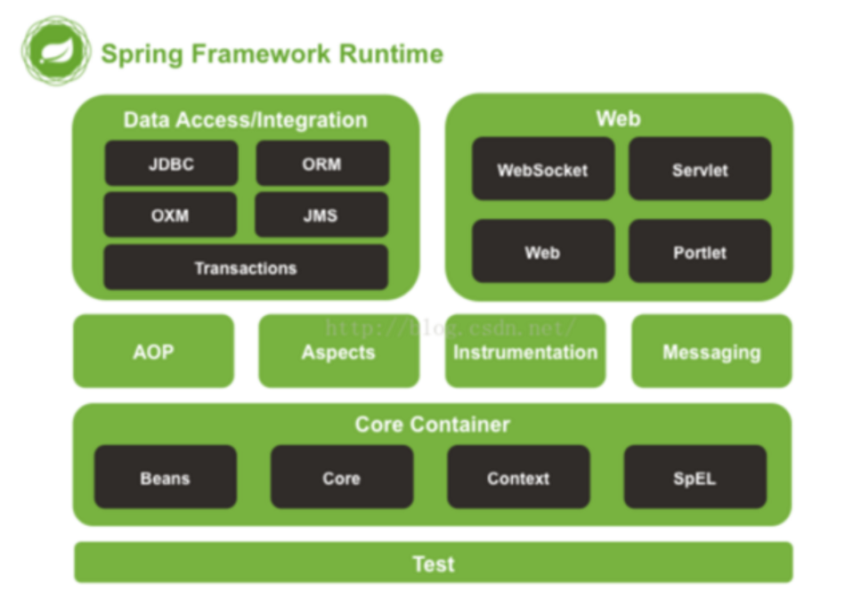

### 1 Spring源码模块

如图，Spring主要分为DA/DI、Web、Core、Test几个模块

- Core Container是框架的基础部分，提供IOC和依赖注入。主要组件是BeanFactory，它是工厂模式的实现
  - Context是一个配置文件，向Spring提供上下文信息
- DA/DI主要对数据访问进行的封装
- Test支持JUnit对Spring组件进行测试
- Spring Web提供了基础的web集成

### 2 什么是IOC

控制反转是一种设计思想，依赖注入是实现IOC的一种方法。我们使用面向对象编程时，对象的创建与对象间的依赖关系完全硬编码在程序中，对象的创建由程序自己控制。而经过控制反转，将对象的创建交给第三方，即获得依赖对象的方式反转了

