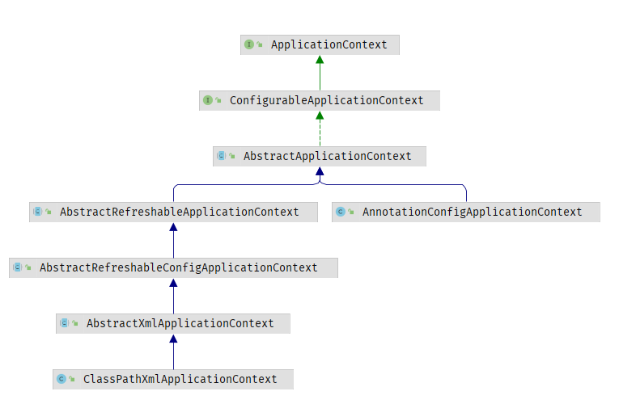
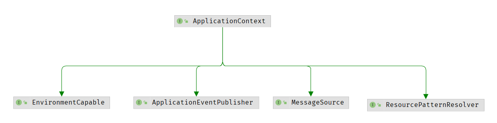
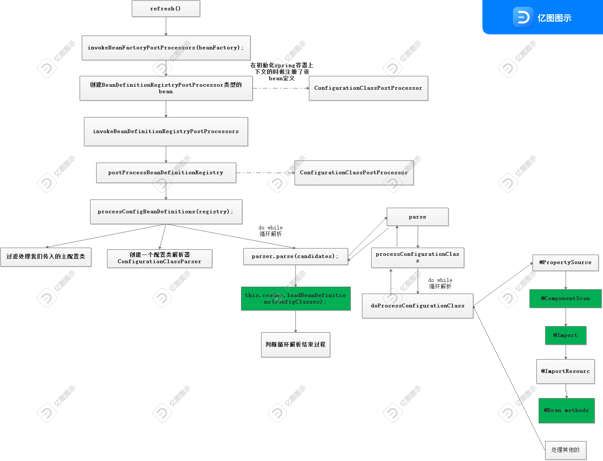
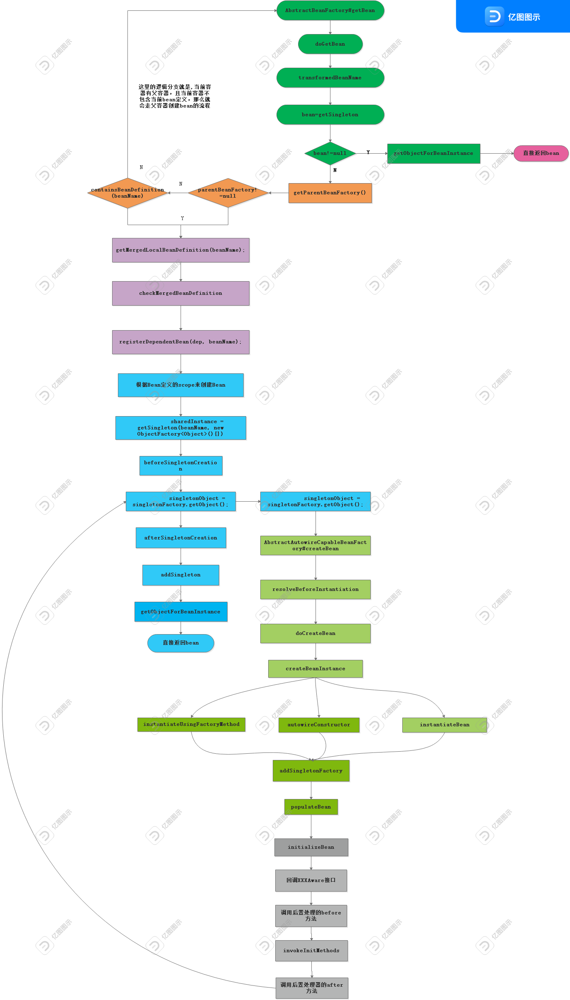

### 1 前言

我们在运行Spring程序时，通常会使用到以下代码：

```java
    public static void main(String[] args) {
        //通过xml方式获取Bean
        ClassPathXmlApplicationContext context =
                new ClassPathXmlApplicationContext("spring.xml");
        context.getBean(HelloSpring.class);
        
        
        //通过去容器中读取Bean的信息
        AnnotationConfigApplicationContext ctx = new AnnotationConfigApplicationContext(MainCofig.class);
        
        System.out.	println(ctx.getBean("xxx"));
    }
```

可以看到，运行以上两句代码，我们就可以从Spring容器中获取到相应的Bean，那么可以分别从这两句代码入手，看看Spring是如何运行的


### 2 认识ApplicationContext

代码中都用到了xxxApplicationContext，以下是ApplicationContext的继承图，发现ClassPathXmlApplicationContext和AnnotationConfigApplicationContext都实现自ApplicationContext顶层接口。



- ApplicationContext中文意思是“应用上下文”，继承自BeanFactory接口
- 在ApplicationContext接口的实现类中，比较常用的是ClassPathXmlApplicationContext和AnnotationConfigApplicationContext。
- 实现类的主要区别就是装载Spring配置文件实例化ApplicationContext容器的方式不同，在ApplicationContext实例化后，同样通过getBean方法从ApplicationContext容器中获取装配好的Bean实例以供使用


再来看看ApplicationContext的父类接口



- EnvironmentCapable：ApplicationContext继承了这个接口，表示拥有了获取环境变量的功能，可以通过ApplicationContext获取操作系统环境变量和JVM环境变量。
- ListableBeanFactory：ApplicationContext继承了这个接口，就拥有了获取所有beanNames、判断某个beanName是否存在beanDefinition对象、统计BeanDefinition个数、获取某个类型对应的所有beanNames等功能。
- HierarchicalBeanFactory：ApplicationContext继承了这个接口，就拥有了获取父BeanFactory、判断某个name是否存在bean对象的功能。
- MessageSource：ApplicationContext继承了这个接口，就拥有了国际化功能，比如可以直接利用MessageSource对象获取某个国际化资源（比如不同国家语言所对应的字符）
- ApplicationEventPublisher：ApplicationContext继承了这个接口，就拥有了事件发布功能，可以发布事件，这是ApplicationContext相对于BeanFactory比较突出、常用的功能。
- ResourcePatternResolver：ApplicationContext继承了这个接口，就拥有了加载并获取资源的功能，这里的资源可以是文件，图片等某个URL资源都可以


总结：Application可以获取环境变量、获取容器中Bean的信息、发布事件、加载静态化资源


### 3 Spring的运行流程

从ApplicationContext查看源码

从main函数点进去查看new ApplicationContext后Spring做了什么事请

```java
public ClassPathXmlApplicationContext(String[] configLocations, boolean refresh, ApplicationContext parent) throws BeansException {
        super(parent);
        this.setConfigLocations(configLocations);
        if (refresh) {
            this.refresh();
        }

}


public AnnotationConfigApplicationContext(Class<?>... annotatedClasses) {
    this();
    this.register(annotatedClasses);
    this.refresh();
}

```

发现两个实现类的初始化中，都调用了refresh()方法，refresh()方法放在后面分析。

#### 3.1 ClassPathXmlApplicationContext

先看ClassPathXmlApplicationContext的构造函数中调用的this.setConfigLocations(configLocations);

```java
public void setConfigLocations(String... locations) {
    if (locations != null) {
        Assert.noNullElements(locations, "Config locations must not be null");
        this.configLocations = new String[locations.length];

        for(int i = 0; i < locations.length; ++i) {
            this.configLocations[i] = this.resolvePath(locations[i]).trim();
        }
    } else {
        this.configLocations = null;
    }

}
```

从源码可以看出，这个函数的作用是去解析给定的路径“spring.xml”，然后赋值到this.configLocations中。


#### 3.2 AnnotationConfigApplicationContex

再看AnnotationConfigApplicationContext的初始化过程

```java
public AnnotationConfigApplicationContext(Class<?>... componentClasses) {
    this();
    register(componentClasses);
    refresh();
}


public AnnotationConfigApplicationContext(DefaultListableBeanFactory beanFactory) {
    super(beanFactory);
    this.reader = new AnnotatedBeanDefinitionReader(this);
    this.scanner = new ClassPathBeanDefinitionScanner(this);
}
```

调用this()，发现new 了一个AnnotatedBeanDefinitionReader以及ClassPathBeanDefinitionScanner，分别进入源码查看它们的作用


AnnotatedBeanDefinitionReader.java

```java
//构造函数
public AnnotatedBeanDefinitionReader(BeanDefinitionRegistry registry, Environment environment) {
    Assert.notNull(registry, "BeanDefinitionRegistry must not be null");
    Assert.notNull(environment, "Environment must not be null");
    this.registry = registry;
    this.conditionEvaluator = new ConditionEvaluator(registry, environment, null);
    //关键代码:向容器中注册相关的注解配置处理器
    AnnotationConfigUtils.registerAnnotationConfigProcessors(this.registry);
}
```

AnnotatedBeanDefinitionReader#registerAnnotationConfigProcessors()

此函数的作用就是向容器中注册一些必要的组件

```java
public static Set<BeanDefinitionHolder> registerAnnotationConfigProcessors(
    BeanDefinitionRegistry registry, @Nullable Object source) {

    DefaultListableBeanFactory beanFactory = unwrapDefaultListableBeanFactory(registry);
    if (beanFactory != null) {
        if (!(beanFactory.getDependencyComparator() instanceof AnnotationAwareOrderComparator)) {
            beanFactory.setDependencyComparator(AnnotationAwareOrderComparator.INSTANCE);
        }
        if (!(beanFactory.getAutowireCandidateResolver() instanceof ContextAnnotationAutowireCandidateResolver)) {
            beanFactory.setAutowireCandidateResolver(new ContextAnnotationAutowireCandidateResolver());
        }
    }

    Set<BeanDefinitionHolder> beanDefs = new LinkedHashSet<>(8);

    if (!registry.containsBeanDefinition(CONFIGURATION_ANNOTATION_PROCESSOR_BEAN_NAME)) {
        RootBeanDefinition def = new RootBeanDefinition(ConfigurationClassPostProcessor.class);
        def.setSource(source);
        beanDefs.add(registerPostProcessor(registry, def, CONFIGURATION_ANNOTATION_PROCESSOR_BEAN_NAME));
    }

    if (!registry.containsBeanDefinition(AUTOWIRED_ANNOTATION_PROCESSOR_BEAN_NAME)) {
        RootBeanDefinition def = new RootBeanDefinition(AutowiredAnnotationBeanPostProcessor.class);
        def.setSource(source);
        beanDefs.add(registerPostProcessor(registry, def, AUTOWIRED_ANNOTATION_PROCESSOR_BEAN_NAME));
    }

    // Check for JSR-250 support, and if present add the CommonAnnotationBeanPostProcessor.
    if (jsr250Present && !registry.containsBeanDefinition(COMMON_ANNOTATION_PROCESSOR_BEAN_NAME)) {
        RootBeanDefinition def = new RootBeanDefinition(CommonAnnotationBeanPostProcessor.class);
        def.setSource(source);
        beanDefs.add(registerPostProcessor(registry, def, COMMON_ANNOTATION_PROCESSOR_BEAN_NAME));
    }

    // Check for JPA support, and if present add the PersistenceAnnotationBeanPostProcessor.
    if (jpaPresent && !registry.containsBeanDefinition(PERSISTENCE_ANNOTATION_PROCESSOR_BEAN_NAME)) {
        RootBeanDefinition def = new RootBeanDefinition();
        try {
            def.setBeanClass(ClassUtils.forName(PERSISTENCE_ANNOTATION_PROCESSOR_CLASS_NAME,
                                                AnnotationConfigUtils.class.getClassLoader()));
        }
        catch (ClassNotFoundException ex) {
            throw new IllegalStateException(
                "Cannot load optional framework class: " + PERSISTENCE_ANNOTATION_PROCESSOR_CLASS_NAME, ex);
        }
        def.setSource(source);
        beanDefs.add(registerPostProcessor(registry, def, PERSISTENCE_ANNOTATION_PROCESSOR_BEAN_NAME));
    }

    if (!registry.containsBeanDefinition(EVENT_LISTENER_PROCESSOR_BEAN_NAME)) {
        RootBeanDefinition def = new RootBeanDefinition(EventListenerMethodProcessor.class);
        def.setSource(source);
        beanDefs.add(registerPostProcessor(registry, def, EVENT_LISTENER_PROCESSOR_BEAN_NAME));
    }

    if (!registry.containsBeanDefinition(EVENT_LISTENER_FACTORY_BEAN_NAME)) {
        RootBeanDefinition def = new RootBeanDefinition(DefaultEventListenerFactory.class);
        def.setSource(source);
        beanDefs.add(registerPostProcessor(registry, def, EVENT_LISTENER_FACTORY_BEAN_NAME));
    }

    return beanDefs;
}
```

可以看到代码中有很多静态常量，这些静态常量就是被注册组件的类名。

如：

```java
public static final String CONFIGURATION_ANNOTATION_PROCESSOR_BEAN_NAME =
      "org.springframework.context.annotation.internalConfigurationAnnotationProcessor";

public static final String CONFIGURATION_BEAN_NAME_GENERATOR =
			"org.springframework.context.annotation.internalConfigurationBeanNameGenerator";

public static final String AUTOWIRED_ANNOTATION_PROCESSOR_BEAN_NAME =
			"org.springframework.context.annotation.internalAutowiredAnnotationProcessor";

...
```

再看看ClassPathBeanDefinitionScanner这个类。其作用就是：在类路径上扫描bean，然后注册到相应的BeanFactory中。

```java
public ClassPathBeanDefinitionScanner(BeanDefinitionRegistry registry, boolean useDefaultFilters,
      Environment environment, @Nullable ResourceLoader resourceLoader) {

   Assert.notNull(registry, "BeanDefinitionRegistry must not be null");
   this.registry = registry;

   if (useDefaultFilters) {
      registerDefaultFilters();
   }
    //设置初始环境
   setEnvironment(environment);
    //初始化资源加载器
   setResourceLoader(resourceLoader);
}
```


### 4 refresh()方法

#### 4.1 refresh整体流程

查看refresh方法

```java
	public void refresh() throws BeansException, IllegalStateException {
		synchronized (this.startupShutdownMonitor) {
			// Prepare this context for refreshing.
			prepareRefresh();

			// Tell the subclass to refresh the internal bean factory.
			ConfigurableListableBeanFactory beanFactory = obtainFreshBeanFactory();

			// Prepare the bean factory for use in this context.
			prepareBeanFactory(beanFactory);

			try {
				// Allows post-processing of the bean factory in context subclasses.
				postProcessBeanFactory(beanFactory);

				// Invoke factory processors registered as beans in the context.
				invokeBeanFactoryPostProcessors(beanFactory);

				// Register bean processors that intercept bean creation.
				registerBeanPostProcessors(beanFactory);

				// Initialize message source for this context.
				initMessageSource();

				// Initialize event multicaster for this context.
				initApplicationEventMulticaster();

				// Initialize other special beans in specific context subclasses.
				onRefresh();

				// Check for listener beans and register them.
				registerListeners();

				// Instantiate all remaining (non-lazy-init) singletons.
				finishBeanFactoryInitialization(beanFactory);

				// Last step: publish corresponding event.
				finishRefresh();
			}

			catch (BeansException ex) {
				if (logger.isWarnEnabled()) {
					logger.warn("Exception encountered during context initialization - " +
							"cancelling refresh attempt: " + ex);
				}

				// Destroy already created singletons to avoid dangling resources.
				destroyBeans();

				// Reset 'active' flag.
				cancelRefresh(ex);

				// Propagate exception to caller.
				throw ex;
			}

			finally {
				// Reset common introspection caches in Spring's core, since we
				// might not ever need metadata for singleton beans anymore...
				resetCommonCaches();
			}
		}
	}
```

OK，refresh()方法上的注释解释得很清楚，这应该是Spring的整个生命周期（跟着断点调试，refresh()方法执行完后回到了main函数中）。接下来深入分析refresh()方法


#### 4.2 prepareRefresh()

刷新容器前的准备工作

```java
protected void prepareRefresh() {
   // Switch to active.
   //设置启动时间
   this.startupDate = System.currentTimeMillis();
   //设置容器的状态变量
   this.closed.set(false);
   this.active.set(true);

   if (logger.isDebugEnabled()) {
      if (logger.isTraceEnabled()) {
         logger.trace("Refreshing " + this);
      }
      else {
         logger.debug("Refreshing " + getDisplayName());
      }
   }

   // Initialize any placeholder property sources in the context environment.
   //此方法由子类实现
   initPropertySources();

   // Validate that all properties marked as required are resolvable:
   // see ConfigurablePropertyResolver#setRequiredProperties
   getEnvironment().validateRequiredProperties();

   // Store pre-refresh ApplicationListeners...
   //初始化Application的监听器
   if (this.earlyApplicationListeners == null) {
      this.earlyApplicationListeners = new LinkedHashSet<>(this.applicationListeners);
   }
   else {
      // Reset local application listeners to pre-refresh state.
      this.applicationListeners.clear();
      this.applicationListeners.addAll(this.earlyApplicationListeners);
   }

   // Allow for the collection of early ApplicationEvents,
   // to be published once the multicaster is available...
   this.earlyApplicationEvents = new LinkedHashSet<>();
}
```


#### 4.3 obtainFreshBeanFactory()

用于刷新内部BeanFactory，将配置文件（xxx.xml）解析成beanDefiniton注册到BeanFactory中

```java
protected ConfigurableListableBeanFactory obtainFreshBeanFactory() {
   refreshBeanFactory();
   return getBeanFactory();
}
```

```java
protected final void refreshBeanFactory() throws BeansException {
    //如果已经加载了BeanFacotry，则关闭旧的BeanFacotry
    if (hasBeanFactory()) {
        destroyBeans();
        closeBeanFactory();
    }
    try {
        //新建一个DefaultListableBeanFactory对象
        DefaultListableBeanFactory beanFactory = createBeanFactory();
        beanFactory.setSerializationId(getId());
        customizeBeanFactory(beanFactory);
        //重点关注，主要作用是解析配置文件，将配置文件中的Bean转换为对应的BeanDefinition对象
        loadBeanDefinitions(beanFactory);
        this.beanFactory = beanFactory;
    }
    catch (IOException ex) {
        throw new ApplicationContextException("I/O error parsing bean definition source for " + getDisplayName(), ex);
    }
}
```

loadBeanDefinitions(beanFactory);

注释写得很清楚：创建一个XML读取器——>对读取器进行初始化配置——>加载BeanDefinition

```java
protected void loadBeanDefinitions(DefaultListableBeanFactory beanFactory) throws BeansException, IOException {
   // Create a new XmlBeanDefinitionReader for the given BeanFactory.
   XmlBeanDefinitionReader beanDefinitionReader = new XmlBeanDefinitionReader(beanFactory);

   // Configure the bean definition reader with this context's
   // resource loading environment.
   beanDefinitionReader.setEnvironment(this.getEnvironment());
   beanDefinitionReader.setResourceLoader(this);
   beanDefinitionReader.setEntityResolver(new ResourceEntityResolver(this));

   // Allow a subclass to provide custom initialization of the reader,
   // then proceed with actually loading the bean definitions.
   initBeanDefinitionReader(beanDefinitionReader);
   loadBeanDefinitions(beanDefinitionReader);
}
```

再进入loadBeanDefinitions方法

```java
protected void loadBeanDefinitions(XmlBeanDefinitionReader reader) throws BeansException, IOException {
   Resource[] configResources = getConfigResources();
   if (configResources != null) {
      reader.loadBeanDefinitions(configResources);
   }
   String[] configLocations = getConfigLocations();
   if (configLocations != null) {
      reader.loadBeanDefinitions(configLocations);
   }
}
```

继续往下点，直到这里

```java
public int loadBeanDefinitions(EncodedResource encodedResource) throws BeanDefinitionStoreException {
    Assert.notNull(encodedResource, "EncodedResource must not be null");
    if (this.logger.isTraceEnabled()) {
        this.logger.trace("Loading XML bean definitions from " + encodedResource);
    }

    Set<EncodedResource> currentResources = (Set)this.resourcesCurrentlyBeingLoaded.get();
    if (!currentResources.add(encodedResource)) {
        throw new BeanDefinitionStoreException("Detected cyclic loading of " + encodedResource + " - check your import definitions!");
    } else {
        int var6;
        try {
            InputStream inputStream = encodedResource.getResource().getInputStream();
            Throwable var4 = null;

            try {
                InputSource inputSource = new InputSource(inputStream);
                if (encodedResource.getEncoding() != null) {
                    inputSource.setEncoding(encodedResource.getEncoding());
                }
				//重点关注！！！
                var6 = this.doLoadBeanDefinitions(inputSource, encodedResource.getResource());
            } catch (Throwable var24) {
                var4 = var24;
                throw var24;
            } finally {
                if (inputStream != null) {
                    if (var4 != null) {
                        try {
                            inputStream.close();
                        } catch (Throwable var23) {
                            var4.addSuppressed(var23);
                        }
                    } else {
                        inputStream.close();
                    }
                }

            }
        } catch (IOException var26) {
            throw new BeanDefinitionStoreException("IOException parsing XML document from " + encodedResource.getResource(), var26);
        } finally {
            currentResources.remove(encodedResource);
            if (currentResources.isEmpty()) {
                this.resourcesCurrentlyBeingLoaded.remove();
            }

        }

        return var6;
    }
}
```

doLoadBeanDefinitions方法（在Spring中，真正做事的函数一般都是以do开头）

```java
protected int doLoadBeanDefinitions(InputSource inputSource, Resource resource) throws BeanDefinitionStoreException {
    //省略了try..catch代码块
    Document doc = this.doLoadDocument(inputSource, resource);
    //从这一步开始注册BeanDefinition，继续往下看
    int count = this.registerBeanDefinitions(doc, resource);
    if (this.logger.isDebugEnabled()) {
        this.logger.debug("Loaded " + count + " bean definitions from " + resource);
    }

    return count;
}
```

中间省略了两步，不一一贴出来了

DefaultBeanDefinitionDocumentReader#doRegisterBeanDefinitions

```java
protected void doRegisterBeanDefinitions(Element root) {
    BeanDefinitionParserDelegate parent = this.delegate;
    this.delegate = this.createDelegate(this.getReaderContext(), root, parent);
    //默认的命令空间，如http://www.springframework.org/schema/beans
    if (this.delegate.isDefaultNamespace(root)) {
        String profileSpec = root.getAttribute("profile");
        if (StringUtils.hasText(profileSpec)) {
            String[] specifiedProfiles = StringUtils.tokenizeToStringArray(profileSpec, ",; ");
            if (!this.getReaderContext().getEnvironment().acceptsProfiles(specifiedProfiles)) {
                if (this.logger.isDebugEnabled()) {
                    this.logger.debug("Skipped XML bean definition file due to specified profiles [" + profileSpec + "] not matching: " + this.getReaderContext().getResource());
                }

                return;
            }
        }
    }

    this.preProcessXml(root);
    this.parseBeanDefinitions(root, this.delegate);
    this.postProcessXml(root);
    this.delegate = parent;
}
```

parseBeanDefinitions

```java
protected void parseBeanDefinitions(Element root, BeanDefinitionParserDelegate delegate) {
    if (delegate.isDefaultNamespace(root)) {
        NodeList nl = root.getChildNodes();

        for(int i = 0; i < nl.getLength(); ++i) {
            Node node = nl.item(i);
            if (node instanceof Element) {
                Element ele = (Element)node;
                if (delegate.isDefaultNamespace(ele)) {
                    this.parseDefaultElement(ele, delegate);
                } else {
                    delegate.parseCustomElement(ele);
                }
            }
        }
    } else {
        //其他的元素，如包扫描
        delegate.parseCustomElement(root);
    }

}
```

parseDefaultElement

```java
private void parseDefaultElement(Element ele, BeanDefinitionParserDelegate delegate) {
    if (delegate.nodeNameEquals(ele, "import")) {
        this.importBeanDefinitionResource(ele);
    } else if (delegate.nodeNameEquals(ele, "alias")) {
        this.processAliasRegistration(ele);
    } else if (delegate.nodeNameEquals(ele, "bean")) {
        this.processBeanDefinition(ele, delegate);
    } else if (delegate.nodeNameEquals(ele, "beans")) {
        this.doRegisterBeanDefinitions(ele);
    }

}
```

processBeanDefinition(ele, delegate)

```java
protected void processBeanDefinition(Element ele, BeanDefinitionParserDelegate delegate) {
    //解析Bean
    BeanDefinitionHolder bdHolder = delegate.parseBeanDefinitionElement(ele);
    if (bdHolder != null) {
        bdHolder = delegate.decorateBeanDefinitionIfRequired(ele, bdHolder);

        try {
            //注册Bean
            BeanDefinitionReaderUtils.registerBeanDefinition(bdHolder, this.getReaderContext().getRegistry());
        } catch (BeanDefinitionStoreException var5) {
            this.getReaderContext().error("Failed to register bean definition with name '" + bdHolder.getBeanName() + "'", ele, var5);
        }

        this.getReaderContext().fireComponentRegistered(new BeanComponentDefinition(bdHolder));
    }

}
```

parseBeanDefinitionElement

```java
public BeanDefinitionHolder parseBeanDefinitionElement(Element ele, @Nullable BeanDefinition containingBean) {
    
    //<bean id="Person" class="com.wu.pojo.Person" ></bean>
    //解析配置
    // 获取xml中id对应的值
    String id = ele.getAttribute("id");
    String nameAttr = ele.getAttribute("name");
    List<String> aliases = new ArrayList();
    if (StringUtils.hasLength(nameAttr)) {
        String[] nameArr = StringUtils.tokenizeToStringArray(nameAttr, ",; ");
        aliases.addAll(Arrays.asList(nameArr));
    }

    String beanName = id;
    if (!StringUtils.hasText(id) && !aliases.isEmpty()) {
        beanName = (String)aliases.remove(0);
        if (this.logger.isTraceEnabled()) {
            this.logger.trace("No XML 'id' specified - using '" + beanName + "' as bean name and " + aliases + " as aliases");
        }
    }

    if (containingBean == null) {
        this.checkNameUniqueness(beanName, aliases, ele);
    }
	//重点方法，对Bean对应的节点进行属性设置
    AbstractBeanDefinition beanDefinition = this.parseBeanDefinitionElement(ele, beanName, containingBean);
    if (beanDefinition != null) {
        if (!StringUtils.hasText(beanName)) {
            try {
                //如果配置中没有定义name，只定义了class name，则默认类名首字母小写作为bean id
                if (containingBean != null) {
                    beanName = BeanDefinitionReaderUtils.generateBeanName(beanDefinition, this.readerContext.getRegistry(), true);
                } else {
                    beanName = this.readerContext.generateBeanName(beanDefinition);
                    String beanClassName = beanDefinition.getBeanClassName();
                    if (beanClassName != null && beanName.startsWith(beanClassName) && beanName.length() > beanClassName.length() && !this.readerContext.getRegistry().isBeanNameInUse(beanClassName)) {
                        aliases.add(beanClassName);
                    }
                }

                if (this.logger.isTraceEnabled()) {
                    this.logger.trace("Neither XML 'id' nor 'name' specified - using generated bean name [" + beanName + "]");
                }
            } catch (Exception var9) {
                this.error(var9.getMessage(), ele);
                return null;
            }
        }

        String[] aliasesArray = StringUtils.toStringArray(aliases);
        return new BeanDefinitionHolder(beanDefinition, beanName, aliasesArray);
    } else {
        return null;
    }
}
```

这个方法完成了bean对应节点元素的解析，即Bean转化为BeanDefinitionHolder。

beanDefinition主要定义了bean创建时候的一些属性，比如是否懒加载，是否单例等。用于后期创建对象的判断条件。

回到上面DefaultBeanDefinitionDocumentReader#processBeanDefinition这个方法

进入BeanDefinitionReaderUtils.registerBeanDefinition(bdHolder, this.getReaderContext().getRegistry());

```java
public static void registerBeanDefinition(BeanDefinitionHolder definitionHolder, BeanDefinitionRegistry registry) throws BeanDefinitionStoreException {
    //获取beanName，就是上一步解析bean得到的bean id
    String beanName = definitionHolder.getBeanName();
    //注册
    registry.registerBeanDefinition(beanName, definitionHolder.getBeanDefinition());
    //如果有别名，继续为别名注册
    String[] aliases = definitionHolder.getAliases();
    if (aliases != null) {
        String[] var4 = aliases;
        int var5 = aliases.length;

        for(int var6 = 0; var6 < var5; ++var6) {
            String alias = var4[var6];
            registry.registerAlias(beanName, alias);
        }
    }

}
```

进入registry.registerBeanDefinition(beanName, definitionHolder.getBeanDefinition());

```java
public void registerBeanDefinition(String beanName, BeanDefinition beanDefinition) throws BeanDefinitionStoreException {
    Assert.hasText(beanName, "Bean name must not be empty");
    Assert.notNull(beanDefinition, "BeanDefinition must not be null");
    if (beanDefinition instanceof AbstractBeanDefinition) {
        try {
            ((AbstractBeanDefinition)beanDefinition).validate();
        } catch (BeanDefinitionValidationException var8) {
            throw new BeanDefinitionStoreException(beanDefinition.getResourceDescription(), beanName, "Validation of bean definition failed", var8);
        }
    }
	//从缓存中获取这个BeanDefinition，这里分为已经存在或不存在两种处理逻辑
    //如果存在，则进行一些列判断，如是否允许覆写、
    BeanDefinition existingDefinition = (BeanDefinition)this.beanDefinitionMap.get(beanName);
    if (existingDefinition != null) {
        if (!this.isAllowBeanDefinitionOverriding()) {
            throw new BeanDefinitionOverrideException(beanName, beanDefinition, existingDefinition);
        }

        if (existingDefinition.getRole() < beanDefinition.getRole()) {
            if (this.logger.isInfoEnabled()) {
                this.logger.info("Overriding user-defined bean definition for bean '" + beanName + "' with a framework-generated bean definition: replacing [" + existingDefinition + "] with [" + beanDefinition + "]");
            }
        } else if (!beanDefinition.equals(existingDefinition)) {
            if (this.logger.isDebugEnabled()) {
                this.logger.debug("Overriding bean definition for bean '" + beanName + "' with a different definition: replacing [" + existingDefinition + "] with [" + beanDefinition + "]");
            }
        } else if (this.logger.isTraceEnabled()) {
            this.logger.trace("Overriding bean definition for bean '" + beanName + "' with an equivalent definition: replacing [" + existingDefinition + "] with [" + beanDefinition + "]");
        }

        this.beanDefinitionMap.put(beanName, beanDefinition);
    } else {
        //这里有又分为两种处理逻辑，Bean是否已经开始初始化
        if (this.hasBeanCreationStarted()) {
            synchronized(this.beanDefinitionMap) {
                this.beanDefinitionMap.put(beanName, beanDefinition);
                List<String> updatedDefinitions = new ArrayList(this.beanDefinitionNames.size() + 1);
                updatedDefinitions.addAll(this.beanDefinitionNames);
                updatedDefinitions.add(beanName);
                this.beanDefinitionNames = updatedDefinitions;
                this.removeManualSingletonName(beanName);
            }
        } else {
            //放入缓存
            this.beanDefinitionMap.put(beanName, beanDefinition);
            this.beanDefinitionNames.add(beanName);
            this.removeManualSingletonName(beanName);
        }

        this.frozenBeanDefinitionNames = null;
    }

    if (existingDefinition == null && !this.containsSingleton(beanName)) {
        if (this.isConfigurationFrozen()) {
            this.clearByTypeCache();
        }
    } else {
        this.resetBeanDefinition(beanName);
    }

}
```

ok，关于obtainFreshBeanFactory()这个方法的作用已基本分析完毕，其主要作用就是刷新容器内部的BeanFactory——解析配置文件，将Bean转化成BeanDefinition，然后注册到（放到缓存map中）容器中。


这里要重点关注DefaultListableBeanFactory这个类，它是BeanFactory重要实现类，主要是用来管理beanDefinition，查看以下它的成员属性

```java
private static Class<?> javaxInjectProviderClass;
private static final Map<String, Reference<DefaultListableBeanFactory>> serializableFactories;
@Nullable
private String serializationId;
private boolean allowBeanDefinitionOverriding = true;
private boolean allowEagerClassLoading = true;
@Nullable
private Comparator<Object> dependencyComparator;
private AutowireCandidateResolver autowireCandidateResolver;
private final Map<Class<?>, Object> resolvableDependencies;
//注册的类就保存在这里
private final Map<String, BeanDefinition> beanDefinitionMap;
private final Map<String, BeanDefinitionHolder> mergedBeanDefinitionHolders;
private final Map<Class<?>, String[]> allBeanNamesByType;
private final Map<Class<?>, String[]> singletonBeanNamesByType;
//保存BeanDefinition的名字
private volatile List<String> beanDefinitionNames;
private volatile Set<String> manualSingletonNames;
@Nullable
private volatile String[] frozenBeanDefinitionNames;
private volatile boolean configurationFrozen;
```


#### 4.4 prepareBeanFactory(beanFactory);

为当前BeanFactory配置属性，如上下文加载器、后置处理器等

```java
protected void prepareBeanFactory(ConfigurableListableBeanFactory beanFactory) {
   // Tell the internal bean factory to use the context's class loader etc.
   beanFactory.setBeanClassLoader(getClassLoader());
   beanFactory.setBeanExpressionResolver(new StandardBeanExpressionResolver(beanFactory.getBeanClassLoader()));
   beanFactory.addPropertyEditorRegistrar(new ResourceEditorRegistrar(this, getEnvironment()));

   // Configure the bean factory with context callbacks.
   beanFactory.addBeanPostProcessor(new ApplicationContextAwareProcessor(this));
   beanFactory.ignoreDependencyInterface(EnvironmentAware.class);
   beanFactory.ignoreDependencyInterface(EmbeddedValueResolverAware.class);
   beanFactory.ignoreDependencyInterface(ResourceLoaderAware.class);
   beanFactory.ignoreDependencyInterface(ApplicationEventPublisherAware.class);
   beanFactory.ignoreDependencyInterface(MessageSourceAware.class);
   beanFactory.ignoreDependencyInterface(ApplicationContextAware.class);

   // BeanFactory interface not registered as resolvable type in a plain factory.
   // MessageSource registered (and found for autowiring) as a bean.
   beanFactory.registerResolvableDependency(BeanFactory.class, beanFactory);
   beanFactory.registerResolvableDependency(ResourceLoader.class, this);
   beanFactory.registerResolvableDependency(ApplicationEventPublisher.class, this);
   beanFactory.registerResolvableDependency(ApplicationContext.class, this);

   // Register early post-processor for detecting inner beans as ApplicationListeners.
   beanFactory.addBeanPostProcessor(new ApplicationListenerDetector(this));

   // Detect a LoadTimeWeaver and prepare for weaving, if found.
   if (beanFactory.containsBean(LOAD_TIME_WEAVER_BEAN_NAME)) {
      beanFactory.addBeanPostProcessor(new LoadTimeWeaverAwareProcessor(beanFactory));
      // Set a temporary ClassLoader for type matching.
      beanFactory.setTempClassLoader(new ContextTypeMatchClassLoader(beanFactory.getBeanClassLoader()));
   }

   // Register default environment beans.
   if (!beanFactory.containsLocalBean(ENVIRONMENT_BEAN_NAME)) {
      beanFactory.registerSingleton(ENVIRONMENT_BEAN_NAME, getEnvironment());
   }
   if (!beanFactory.containsLocalBean(SYSTEM_PROPERTIES_BEAN_NAME)) {
      beanFactory.registerSingleton(SYSTEM_PROPERTIES_BEAN_NAME, getEnvironment().getSystemProperties());
   }
   if (!beanFactory.containsLocalBean(SYSTEM_ENVIRONMENT_BEAN_NAME)) {
      beanFactory.registerSingleton(SYSTEM_ENVIRONMENT_BEAN_NAME, getEnvironment().getSystemEnvironment());
   }
}
```


#### 4.5 invokeBeanFactoryPostProcessors(beanFactory);

主要作用：

- 用于处理 BeanFactoryPostProcessor 接口，将它们作为Bean注册到容器中；BeanFactoryPostProcessor 是针对 BeanFactory 的扩展，主要用在 bean 实例化之前，读取 bean 的定义
- 本方法会实例化和调用所有 BeanFactoryPostProcessor（包括其子类BeanDefinitionRegistryPostProcessor）
- 解析了被@ComponentScan、@Import、@Bean等基本注解标注的类

整体流程如图所示




PostProcessorRegistrationDelegate#invokeBeanFactoryPostProcessors

此函数主要作用是：对实现了PriorityOrdered, Ordered, 以及剩余的BeanDefinitionRegistryPostProcessors进行排序、处理，调用这些后置处理器去解析、注册配置类

```java
public static void invokeBeanFactoryPostProcessors(
      ConfigurableListableBeanFactory beanFactory, List<BeanFactoryPostProcessor> beanFactoryPostProcessors) {

   // Invoke BeanDefinitionRegistryPostProcessors first, if any.
   Set<String> processedBeans = new HashSet<>();

   if (beanFactory instanceof BeanDefinitionRegistry) {
      BeanDefinitionRegistry registry = (BeanDefinitionRegistry) beanFactory;
      List<BeanFactoryPostProcessor> regularPostProcessors = new ArrayList<>();
      List<BeanDefinitionRegistryPostProcessor> registryProcessors = new ArrayList<>();

      for (BeanFactoryPostProcessor postProcessor : beanFactoryPostProcessors) {
         if (postProcessor instanceof BeanDefinitionRegistryPostProcessor) {
            BeanDefinitionRegistryPostProcessor registryProcessor =
                  (BeanDefinitionRegistryPostProcessor) postProcessor;
            registryProcessor.postProcessBeanDefinitionRegistry(registry);
            registryProcessors.add(registryProcessor);
         }
         else {
            regularPostProcessors.add(postProcessor);
         }
      }

      // Do not initialize FactoryBeans here: We need to leave all regular beans
      // uninitialized to let the bean factory post-processors apply to them!
      // Separate between BeanDefinitionRegistryPostProcessors that implement
      // PriorityOrdered, Ordered, and the rest.
      List<BeanDefinitionRegistryPostProcessor> currentRegistryProcessors = new ArrayList<>();

      // First, invoke the BeanDefinitionRegistryPostProcessors that implement PriorityOrdered.
      String[] postProcessorNames =
            beanFactory.getBeanNamesForType(BeanDefinitionRegistryPostProcessor.class, true, false);
      for (String ppName : postProcessorNames) {
         if (beanFactory.isTypeMatch(ppName, PriorityOrdered.class)) {
            currentRegistryProcessors.add(beanFactory.getBean(ppName, BeanDefinitionRegistryPostProcessor.class));
            processedBeans.add(ppName);
         }
      }
      sortPostProcessors(currentRegistryProcessors, beanFactory);
      registryProcessors.addAll(currentRegistryProcessors);
      invokeBeanDefinitionRegistryPostProcessors(currentRegistryProcessors, registry);
      currentRegistryProcessors.clear();

      // Next, invoke the BeanDefinitionRegistryPostProcessors that implement Ordered.
      postProcessorNames = beanFactory.getBeanNamesForType(BeanDefinitionRegistryPostProcessor.class, true, false);
      for (String ppName : postProcessorNames) {
         if (!processedBeans.contains(ppName) && beanFactory.isTypeMatch(ppName, Ordered.class)) {
            currentRegistryProcessors.add(beanFactory.getBean(ppName, BeanDefinitionRegistryPostProcessor.class));
            processedBeans.add(ppName);
         }
      }
      sortPostProcessors(currentRegistryProcessors, beanFactory);
      registryProcessors.addAll(currentRegistryProcessors);
      invokeBeanDefinitionRegistryPostProcessors(currentRegistryProcessors, registry);
      currentRegistryProcessors.clear();

      // Finally, invoke all other BeanDefinitionRegistryPostProcessors until no further ones appear.
      boolean reiterate = true;
      while (reiterate) {
         reiterate = false;
         postProcessorNames = beanFactory.getBeanNamesForType(BeanDefinitionRegistryPostProcessor.class, true, false);
         for (String ppName : postProcessorNames) {
            if (!processedBeans.contains(ppName)) {
               currentRegistryProcessors.add(beanFactory.getBean(ppName, BeanDefinitionRegistryPostProcessor.class));
               processedBeans.add(ppName);
               reiterate = true;
            }
         }
         sortPostProcessors(currentRegistryProcessors, beanFactory);
         registryProcessors.addAll(currentRegistryProcessors);
         invokeBeanDefinitionRegistryPostProcessors(currentRegistryProcessors, registry);
         currentRegistryProcessors.clear();
      }

      // Now, invoke the postProcessBeanFactory callback of all processors handled so far.
      invokeBeanFactoryPostProcessors(registryProcessors, beanFactory);
      invokeBeanFactoryPostProcessors(regularPostProcessors, beanFactory);
   }

   else {
      // Invoke factory processors registered with the context instance.
      invokeBeanFactoryPostProcessors(beanFactoryPostProcessors, beanFactory);
   }

   // Do not initialize FactoryBeans here: We need to leave all regular beans
   // uninitialized to let the bean factory post-processors apply to them!
   String[] postProcessorNames =
         beanFactory.getBeanNamesForType(BeanFactoryPostProcessor.class, true, false);

   // Separate between BeanFactoryPostProcessors that implement PriorityOrdered,
   // Ordered, and the rest.
   List<BeanFactoryPostProcessor> priorityOrderedPostProcessors = new ArrayList<>();
   List<String> orderedPostProcessorNames = new ArrayList<>();
   List<String> nonOrderedPostProcessorNames = new ArrayList<>();
   for (String ppName : postProcessorNames) {
      if (processedBeans.contains(ppName)) {
         // skip - already processed in first phase above
      }
      else if (beanFactory.isTypeMatch(ppName, PriorityOrdered.class)) {
         priorityOrderedPostProcessors.add(beanFactory.getBean(ppName, BeanFactoryPostProcessor.class));
      }
      else if (beanFactory.isTypeMatch(ppName, Ordered.class)) {
         orderedPostProcessorNames.add(ppName);
      }
      else {
         nonOrderedPostProcessorNames.add(ppName);
      }
   }

   // First, invoke the BeanFactoryPostProcessors that implement PriorityOrdered.
   sortPostProcessors(priorityOrderedPostProcessors, beanFactory);
   invokeBeanFactoryPostProcessors(priorityOrderedPostProcessors, beanFactory);

   // Next, invoke the BeanFactoryPostProcessors that implement Ordered.
   List<BeanFactoryPostProcessor> orderedPostProcessors = new ArrayList<>(orderedPostProcessorNames.size());
   for (String postProcessorName : orderedPostProcessorNames) {
      orderedPostProcessors.add(beanFactory.getBean(postProcessorName, BeanFactoryPostProcessor.class));
   }
   sortPostProcessors(orderedPostProcessors, beanFactory);
   invokeBeanFactoryPostProcessors(orderedPostProcessors, beanFactory);

   // Finally, invoke all other BeanFactoryPostProcessors.
   List<BeanFactoryPostProcessor> nonOrderedPostProcessors = new ArrayList<>(nonOrderedPostProcessorNames.size());
   for (String postProcessorName : nonOrderedPostProcessorNames) {
      nonOrderedPostProcessors.add(beanFactory.getBean(postProcessorName, BeanFactoryPostProcessor.class));
   }
   invokeBeanFactoryPostProcessors(nonOrderedPostProcessors, beanFactory);

   // Clear cached merged bean definitions since the post-processors might have
   // modified the original metadata, e.g. replacing placeholders in values...
   beanFactory.clearMetadataCache();
}
```

进入postProcessBeanDefinitionRegistry方法

```java
public void postProcessBeanDefinitionRegistry(BeanDefinitionRegistry registry) {
   int registryId = System.identityHashCode(registry);
   if (this.registriesPostProcessed.contains(registryId)) {
      throw new IllegalStateException(
            "postProcessBeanDefinitionRegistry already called on this post-processor against " + registry);
   }
   if (this.factoriesPostProcessed.contains(registryId)) {
      throw new IllegalStateException(
            "postProcessBeanFactory already called on this post-processor against " + registry);
   }
   this.registriesPostProcessed.add(registryId);

   processConfigBeanDefinitions(registry);
}
```

进入processConfigBeanDefinitions方法，

1. 从注册器中获取所有的BeanDefinition
2. 将BeanDefinition封装成BeanDefinitionHolder（Bean定义持有器）
3. 根据Configuration注解对每一个BeanDefinitionHolder进行解析

```java
public void processConfigBeanDefinitions(BeanDefinitionRegistry registry) {
   List<BeanDefinitionHolder> configCandidates = new ArrayList<>();
   String[] candidateNames = registry.getBeanDefinitionNames();

   for (String beanName : candidateNames) {
      BeanDefinition beanDef = registry.getBeanDefinition(beanName);
      if (beanDef.getAttribute(ConfigurationClassUtils.CONFIGURATION_CLASS_ATTRIBUTE) != null) {
         if (logger.isDebugEnabled()) {
            logger.debug("Bean definition has already been processed as a configuration class: " + beanDef);
         }
      }
      else if (ConfigurationClassUtils.checkConfigurationClassCandidate(beanDef, this.metadataReaderFactory)) {
         configCandidates.add(new BeanDefinitionHolder(beanDef, beanName));
      }
   }

   // Return immediately if no @Configuration classes were found
   if (configCandidates.isEmpty()) {
      return;
   }

   // Sort by previously determined @Order value, if applicable
   configCandidates.sort((bd1, bd2) -> {
      int i1 = ConfigurationClassUtils.getOrder(bd1.getBeanDefinition());
      int i2 = ConfigurationClassUtils.getOrder(bd2.getBeanDefinition());
      return Integer.compare(i1, i2);
   });

   // Detect any custom bean name generation strategy supplied through the enclosing application context
   SingletonBeanRegistry sbr = null;
   if (registry instanceof SingletonBeanRegistry) {
      sbr = (SingletonBeanRegistry) registry;
      if (!this.localBeanNameGeneratorSet) {
         BeanNameGenerator generator = (BeanNameGenerator) sbr.getSingleton(
               AnnotationConfigUtils.CONFIGURATION_BEAN_NAME_GENERATOR);
         if (generator != null) {
            this.componentScanBeanNameGenerator = generator;
            this.importBeanNameGenerator = generator;
         }
      }
   }

   if (this.environment == null) {
      this.environment = new StandardEnvironment();
   }

   // Parse each @Configuration class
   ConfigurationClassParser parser = new ConfigurationClassParser(
         this.metadataReaderFactory, this.problemReporter, this.environment,
         this.resourceLoader, this.componentScanBeanNameGenerator, registry);

   Set<BeanDefinitionHolder> candidates = new LinkedHashSet<>(configCandidates);
   Set<ConfigurationClass> alreadyParsed = new HashSet<>(configCandidates.size());
   do {
      parser.parse(candidates);
      parser.validate();

      Set<ConfigurationClass> configClasses = new LinkedHashSet<>(parser.getConfigurationClasses());
      configClasses.removeAll(alreadyParsed);

      // Read the model and create bean definitions based on its content
      if (this.reader == null) {
         this.reader = new ConfigurationClassBeanDefinitionReader(
               registry, this.sourceExtractor, this.resourceLoader, this.environment,
               this.importBeanNameGenerator, parser.getImportRegistry());
      }
      this.reader.loadBeanDefinitions(configClasses);
      alreadyParsed.addAll(configClasses);

      candidates.clear();
      if (registry.getBeanDefinitionCount() > candidateNames.length) {
         String[] newCandidateNames = registry.getBeanDefinitionNames();
         Set<String> oldCandidateNames = new HashSet<>(Arrays.asList(candidateNames));
         Set<String> alreadyParsedClasses = new HashSet<>();
         for (ConfigurationClass configurationClass : alreadyParsed) {
            alreadyParsedClasses.add(configurationClass.getMetadata().getClassName());
         }
         for (String candidateName : newCandidateNames) {
            if (!oldCandidateNames.contains(candidateName)) {
               BeanDefinition bd = registry.getBeanDefinition(candidateName);
               if (ConfigurationClassUtils.checkConfigurationClassCandidate(bd, this.metadataReaderFactory) &&
                     !alreadyParsedClasses.contains(bd.getBeanClassName())) {
                  candidates.add(new BeanDefinitionHolder(bd, candidateName));
               }
            }
         }
         candidateNames = newCandidateNames;
      }
   }
   while (!candidates.isEmpty());

   // Register the ImportRegistry as a bean in order to support ImportAware @Configuration classes
   if (sbr != null && !sbr.containsSingleton(IMPORT_REGISTRY_BEAN_NAME)) {
      sbr.registerSingleton(IMPORT_REGISTRY_BEAN_NAME, parser.getImportRegistry());
   }

   if (this.metadataReaderFactory instanceof CachingMetadataReaderFactory) {
      // Clear cache in externally provided MetadataReaderFactory; this is a no-op
      // for a shared cache since it'll be cleared by the ApplicationContext.
      ((CachingMetadataReaderFactory) this.metadataReaderFactory).clearCache();
   }
}
```

进入parser.parse(candidates);

```java
public void parse(Set<BeanDefinitionHolder> configCandidates) {
   for (BeanDefinitionHolder holder : configCandidates) {
      BeanDefinition bd = holder.getBeanDefinition();
      try {
         if (bd instanceof AnnotatedBeanDefinition) {
            parse(((AnnotatedBeanDefinition) bd).getMetadata(), holder.getBeanName());
         }
         else if (bd instanceof AbstractBeanDefinition && ((AbstractBeanDefinition) bd).hasBeanClass()) {
            parse(((AbstractBeanDefinition) bd).getBeanClass(), holder.getBeanName());
         }
         else {
            parse(bd.getBeanClassName(), holder.getBeanName());
         }
      }
      catch (BeanDefinitionStoreException ex) {
         throw ex;
      }
      catch (Throwable ex) {
         throw new BeanDefinitionStoreException(
               "Failed to parse configuration class [" + bd.getBeanClassName() + "]", ex);
      }
   }

   this.deferredImportSelectorHandler.process();
}
```

主要看解析的步骤：parse(((AnnotatedBeanDefinition) bd).getMetadata(), holder.getBeanName());

一直往下点，直到进入这个方法ConfigurationClassParser#doProcessConfigurationClass

可以看到，这个函数负责去处理标注了@PropertySource、@ComponentScan、@Import、@ImportResource、@Bean类或方法，以及默认接口方法。

```java
protected final SourceClass doProcessConfigurationClass(
      ConfigurationClass configClass, SourceClass sourceClass, Predicate<String> filter)
      throws IOException {

   if (configClass.getMetadata().isAnnotated(Component.class.getName())) {
      // Recursively process any member (nested) classes first
      processMemberClasses(configClass, sourceClass, filter);
   }

   // Process any @PropertySource annotations
   for (AnnotationAttributes propertySource : AnnotationConfigUtils.attributesForRepeatable(
         sourceClass.getMetadata(), PropertySources.class,
         org.springframework.context.annotation.PropertySource.class)) {
      if (this.environment instanceof ConfigurableEnvironment) {
         processPropertySource(propertySource);
      }
      else {
         logger.info("Ignoring @PropertySource annotation on [" + sourceClass.getMetadata().getClassName() +
               "]. Reason: Environment must implement ConfigurableEnvironment");
      }
   }

   // Process any @ComponentScan annotations
   Set<AnnotationAttributes> componentScans = AnnotationConfigUtils.attributesForRepeatable(
         sourceClass.getMetadata(), ComponentScans.class, ComponentScan.class);
   if (!componentScans.isEmpty() &&
         !this.conditionEvaluator.shouldSkip(sourceClass.getMetadata(), ConfigurationPhase.REGISTER_BEAN)) {
      for (AnnotationAttributes componentScan : componentScans) {
         // The config class is annotated with @ComponentScan -> perform the scan immediately
         Set<BeanDefinitionHolder> scannedBeanDefinitions =
               this.componentScanParser.parse(componentScan, sourceClass.getMetadata().getClassName());
         // Check the set of scanned definitions for any further config classes and parse recursively if needed
         for (BeanDefinitionHolder holder : scannedBeanDefinitions) {
            BeanDefinition bdCand = holder.getBeanDefinition().getOriginatingBeanDefinition();
            if (bdCand == null) {
               bdCand = holder.getBeanDefinition();
            }
            if (ConfigurationClassUtils.checkConfigurationClassCandidate(bdCand, this.metadataReaderFactory)) {
               parse(bdCand.getBeanClassName(), holder.getBeanName());
            }
         }
      }
   }

   // Process any @Import annotations
   processImports(configClass, sourceClass, getImports(sourceClass), filter, true);

   // Process any @ImportResource annotations
   AnnotationAttributes importResource =
         AnnotationConfigUtils.attributesFor(sourceClass.getMetadata(), ImportResource.class);
   if (importResource != null) {
      String[] resources = importResource.getStringArray("locations");
      Class<? extends BeanDefinitionReader> readerClass = importResource.getClass("reader");
      for (String resource : resources) {
         String resolvedResource = this.environment.resolveRequiredPlaceholders(resource);
         configClass.addImportedResource(resolvedResource, readerClass);
      }
   }

   // Process individual @Bean methods
   Set<MethodMetadata> beanMethods = retrieveBeanMethodMetadata(sourceClass);
   for (MethodMetadata methodMetadata : beanMethods) {
      configClass.addBeanMethod(new BeanMethod(methodMetadata, configClass));
   }

   // Process default methods on interfaces
   processInterfaces(configClass, sourceClass);

   // Process superclass, if any
   if (sourceClass.getMetadata().hasSuperClass()) {
      String superclass = sourceClass.getMetadata().getSuperClassName();
      if (superclass != null && !superclass.startsWith("java") &&
            !this.knownSuperclasses.containsKey(superclass)) {
         this.knownSuperclasses.put(superclass, configClass);
         // Superclass found, return its annotation metadata and recurse
         return sourceClass.getSuperClass();
      }
   }

   // No superclass -> processing is complete
   return null;
}
```


#### 4.6 registerBeanPostProcessors(beanFactory);

此方法主要用于处理BeanPostProcessor接口。BeanPostProcessors是针对bean的扩展，主要用在bean实例化之后，执行初始化方法前后，允许程序员自定义BeanPostProcessor实现类来进行业务处理。

查看BeanPostProcessor的源码， Spring 创建 bean 实例时，执行初始化方法前会调用自定义实现BeanPostProcessor 类的 postProcessBeforeInitialization 方法，在执行初始化方法后会调用 MyBeanPostProcessor 的 postProcessAfterInitialization 方法

```java
public interface BeanPostProcessor {
   @Nullable
   default Object postProcessBeforeInitialization(Object bean, String beanName) throws BeansException {
      return bean;
   }

   @Nullable
   default Object postProcessAfterInitialization(Object bean, String beanName) throws BeansException {
      return bean;
   }
```

 PostProcessorRegistrationDelegate#registerBeanPostProcessors


```java
public static void registerBeanPostProcessors(
      ConfigurableListableBeanFactory beanFactory, AbstractApplicationContext applicationContext) {
	//获取所有实现了BeanPostProcessor接口的类	
   String[] postProcessorNames = beanFactory.getBeanNamesForType(BeanPostProcessor.class, true, false);

   // Register BeanPostProcessorChecker that logs an info message when
   // a bean is created during BeanPostProcessor instantiation, i.e. when
   // a bean is not eligible for getting processed by all BeanPostProcessors.
   int beanProcessorTargetCount = beanFactory.getBeanPostProcessorCount() + 1 + postProcessorNames.length;
    //将BeanPostProcessorChecker（记录一些信息）放入beanFactory中
   beanFactory.addBeanPostProcessor(new BeanPostProcessorChecker(beanFactory, beanProcessorTargetCount));

   // Separate between BeanPostProcessors that implement PriorityOrdered,
   // Ordered, and the rest.
    //创建分别实现了PriorityOrdered、Ordered、普通以及内部后置处理器的链表
   List<BeanPostProcessor> priorityOrderedPostProcessors = new ArrayList<>();
   List<BeanPostProcessor> internalPostProcessors = new ArrayList<>();
   List<String> orderedPostProcessorNames = new ArrayList<>();
   List<String> nonOrderedPostProcessorNames = new ArrayList<>();
    //将不同类型的BeanPostProcessor放到对应的链表
   for (String ppName : postProcessorNames) {
      if (beanFactory.isTypeMatch(ppName, PriorityOrdered.class)) {
         BeanPostProcessor pp = beanFactory.getBean(ppName, BeanPostProcessor.class);
         priorityOrderedPostProcessors.add(pp);
         if (pp instanceof MergedBeanDefinitionPostProcessor) {
            internalPostProcessors.add(pp);
         }
      }
      else if (beanFactory.isTypeMatch(ppName, Ordered.class)) {
         orderedPostProcessorNames.add(ppName);
      }
      else {
         nonOrderedPostProcessorNames.add(ppName);
      }
   }

   // First, register the BeanPostProcessors that implement PriorityOrdered.
   sortPostProcessors(priorityOrderedPostProcessors, beanFactory);
   registerBeanPostProcessors(beanFactory, priorityOrderedPostProcessors);

   // Next, register the BeanPostProcessors that implement Ordered.
   List<BeanPostProcessor> orderedPostProcessors = new ArrayList<>(orderedPostProcessorNames.size());
   for (String ppName : orderedPostProcessorNames) {
      BeanPostProcessor pp = beanFactory.getBean(ppName, BeanPostProcessor.class);
      orderedPostProcessors.add(pp);
      if (pp instanceof MergedBeanDefinitionPostProcessor) {
         internalPostProcessors.add(pp);
      }
   }
   sortPostProcessors(orderedPostProcessors, beanFactory);
   registerBeanPostProcessors(beanFactory, orderedPostProcessors);

   // Now, register all regular BeanPostProcessors.
   List<BeanPostProcessor> nonOrderedPostProcessors = new ArrayList<>(nonOrderedPostProcessorNames.size());
   for (String ppName : nonOrderedPostProcessorNames) {
      BeanPostProcessor pp = beanFactory.getBean(ppName, BeanPostProcessor.class);
      nonOrderedPostProcessors.add(pp);
      if (pp instanceof MergedBeanDefinitionPostProcessor) {
         internalPostProcessors.add(pp);
      }
   }
   registerBeanPostProcessors(beanFactory, nonOrderedPostProcessors);

   // Finally, re-register all internal BeanPostProcessors.
   sortPostProcessors(internalPostProcessors, beanFactory);
   registerBeanPostProcessors(beanFactory, internalPostProcessors);

   // Re-register post-processor for detecting inner beans as ApplicationListeners,
   // moving it to the end of the processor chain (for picking up proxies etc).
   beanFactory.addBeanPostProcessor(new ApplicationListenerDetector(applicationContext));
}
```

进入registerBeanPostProcessors方法，

```java
private static void registerBeanPostProcessors(
      ConfigurableListableBeanFactory beanFactory, List<BeanPostProcessor> postProcessors) {

   for (BeanPostProcessor postProcessor : postProcessors) {
      beanFactory.addBeanPostProcessor(postProcessor);
   }
}
```

进入addBeanPostProcessor，该方法就是将 BeanPostProcessor 添加到 beanPostProcessors 缓存，先移除再添加，主要是起一个排序的作用。

```java
public void addBeanPostProcessor(BeanPostProcessor beanPostProcessor) {
   Assert.notNull(beanPostProcessor, "BeanPostProcessor must not be null");
   // Remove from old position, if any
   this.beanPostProcessors.remove(beanPostProcessor);
   // Track whether it is instantiation/destruction aware
   if (beanPostProcessor instanceof InstantiationAwareBeanPostProcessor) {
      this.hasInstantiationAwareBeanPostProcessors = true;
   }
   if (beanPostProcessor instanceof DestructionAwareBeanPostProcessor) {
      this.hasDestructionAwareBeanPostProcessors = true;
   }
   // Add to end of list
   this.beanPostProcessors.add(beanPostProcessor);
}
```

整个 registerBeanPostProcessors 方法围绕 BeanPostProcessor 接口展开，和 invokeBeanFactoryPostProcessors 不同的是，invokeBeanFactoryPostProcessors 方法会直接调用 BeanFactoryPostProcessor 实现类的方法，而 registerBeanPostProcessors 方法只是将 BeanPostProcessor 实现类注册到 BeanFactory 的 beanPostProcessors 缓存中。


#### 4.7 initMessageSource();

此方法主要是初始化消息源，用于国际化处理

```java
protected void initMessageSource() {
   ConfigurableListableBeanFactory beanFactory = getBeanFactory();
    //判断容器中是否有meessageSource对象，如果有则获取，并设置给MessageSource
   if (beanFactory.containsLocalBean(MESSAGE_SOURCE_BEAN_NAME)) {
      this.messageSource = beanFactory.getBean(MESSAGE_SOURCE_BEAN_NAME, MessageSource.class);
      // Make MessageSource aware of parent MessageSource.
      if (this.parent != null && this.messageSource instanceof HierarchicalMessageSource) {
         HierarchicalMessageSource hms = (HierarchicalMessageSource) this.messageSource;
         if (hms.getParentMessageSource() == null) {
            // Only set parent context as parent MessageSource if no parent MessageSource
            // registered already.
            hms.setParentMessageSource(getInternalParentMessageSource());
         }
      }
      if (logger.isTraceEnabled()) {
         logger.trace("Using MessageSource [" + this.messageSource + "]");
      }
   }
   else {
      // Use empty MessageSource to be able to accept getMessage calls.
      DelegatingMessageSource dms = new DelegatingMessageSource();
      dms.setParentMessageSource(getInternalParentMessageSource());
      this.messageSource = dms;
      beanFactory.registerSingleton(MESSAGE_SOURCE_BEAN_NAME, this.messageSource);
      if (logger.isTraceEnabled()) {
         logger.trace("No '" + MESSAGE_SOURCE_BEAN_NAME + "' bean, using [" + this.messageSource + "]");
      }
   }
}
```


#### 4.8 initApplicationEventMulticaster();

初始化事件广播器

ApplicationEventMulticaster是一个接口，主要用于管理ApplicationListener(监听器)，将事件发布到监听器上


```java
protected void initApplicationEventMulticaster() {
   ConfigurableListableBeanFactory beanFactory = getBeanFactory();
    //从容器获取多播器，如果存在，设置给this.applicationEventMulticaster
   if (beanFactory.containsLocalBean(APPLICATION_EVENT_MULTICASTER_BEAN_NAME)) {
      this.applicationEventMulticaster =
            beanFactory.getBean(APPLICATION_EVENT_MULTICASTER_BEAN_NAME, ApplicationEventMulticaster.class);
      if (logger.isTraceEnabled()) {
         logger.trace("Using ApplicationEventMulticaster [" + this.applicationEventMulticaster + "]");
      }
   }//不存在，new一个SimpleApplicationEventMulticaster，并注册到容器中
   else {
      this.applicationEventMulticaster = new SimpleApplicationEventMulticaster(beanFactory);
      beanFactory.registerSingleton(APPLICATION_EVENT_MULTICASTER_BEAN_NAME, this.applicationEventMulticaster);
      if (logger.isTraceEnabled()) {
         logger.trace("No '" + APPLICATION_EVENT_MULTICASTER_BEAN_NAME + "' bean, using " +
               "[" + this.applicationEventMulticaster.getClass().getSimpleName() + "]");
      }
   }
}
```


#### 4.9 onRefresh()

该方法是模板方法，可重写用于刷新特定的上下文


#### 4.10 registerListeners()

向容器中添加ApplicationListener接口的实现类（监听器）

```java
protected void registerListeners() {
   // Register statically specified listeners first.
   for (ApplicationListener<?> listener : getApplicationListeners()) {
      getApplicationEventMulticaster().addApplicationListener(listener);
   }

   // Do not initialize FactoryBeans here: We need to leave all regular beans
   // uninitialized to let post-processors apply to them!
   String[] listenerBeanNames = getBeanNamesForType(ApplicationListener.class, true, false);
    //向多播器中添加监听器
   for (String listenerBeanName : listenerBeanNames) {
      getApplicationEventMulticaster().addApplicationListenerBean(listenerBeanName);
   }

   // Publish early application events now that we finally have a multicaster...
    
   Set<ApplicationEvent> earlyEventsToProcess = this.earlyApplicationEvents;
   this.earlyApplicationEvents = null;
   if (!CollectionUtils.isEmpty(earlyEventsToProcess)) {
      for (ApplicationEvent earlyEvent : earlyEventsToProcess) {
          //调用监听器广播早期事件
         getApplicationEventMulticaster().multicastEvent(earlyEvent);
      }
   }
}
```

进入multicastEvent

```java
public void multicastEvent(final ApplicationEvent event, @Nullable ResolvableType eventType) {
   ResolvableType type = (eventType != null ? eventType : resolveDefaultEventType(event));
   Executor executor = getTaskExecutor();
   for (ApplicationListener<?> listener : getApplicationListeners(event, type)) {
      if (executor != null) {
         executor.execute(() -> invokeListener(listener, event));
      }
      else {
         invokeListener(listener, event);
      }
   }
}
```


#### 4.11 finishBeanFactoryInitialization(beanFactory);

该方法是Spring IOC的核心方法。主要作用：

1. 实例化所有剩余的非懒加载的单例bean
2. 重写的BeanPostProcessor 接口的两个方法也会在这里调用
3. 通过“三级缓存”解决循环依赖

finishBeanFactoryInitialization(beanFactory);

```java
protected void finishBeanFactoryInitialization(ConfigurableListableBeanFactory beanFactory) {
   // Initialize conversion service for this context.
   //初始化一些上下文信息
   if (beanFactory.containsBean(CONVERSION_SERVICE_BEAN_NAME) &&
         beanFactory.isTypeMatch(CONVERSION_SERVICE_BEAN_NAME, ConversionService.class)) {
      //重点方法getBean！！
      beanFactory.setConversionService(
            beanFactory.getBean(CONVERSION_SERVICE_BEAN_NAME, ConversionService.class));
   }

   // Register a default embedded value resolver if no bean post-processor
   // (such as a PropertyPlaceholderConfigurer bean) registered any before:
   // at this point, primarily for resolution in annotation attribute values.
   if (!beanFactory.hasEmbeddedValueResolver()) {
      beanFactory.addEmbeddedValueResolver(strVal -> getEnvironment().resolvePlaceholders(strVal));
   }

   // Initialize LoadTimeWeaverAware beans early to allow for registering their transformers early.
   String[] weaverAwareNames = beanFactory.getBeanNamesForType(LoadTimeWeaverAware.class, false, false);
   for (String weaverAwareName : weaverAwareNames) {
      getBean(weaverAwareName);
   }

   // Stop using the temporary ClassLoader for type matching.
   beanFactory.setTempClassLoader(null);

   // Allow for caching all bean definition metadata, not expecting further changes.
   //冻结所有bean定义，即不能修改或处理已注册的bean定义，因为下一步要创建Bean实例对象
   beanFactory.freezeConfiguration();

   // Instantiate all remaining (non-lazy-init) singletons.
   beanFactory.preInstantiateSingletons();
}
```

getBean方法是非常重要的方法，在SpringIOC中可以看到此方法被频繁调用。以下是getBean方法的完整流程图



##### 4.11.1 getBean

进入getBean方法，继续往下点可以看到AbstractBeanFactory#doGetBean

```java
protected <T> T doGetBean(
      String name, @Nullable Class<T> requiredType, @Nullable Object[] args, boolean typeCheckOnly)
      throws BeansException {
   //传入的name可能是别名，这里做别名解析
   String beanName = transformedBeanName(name);
   Object bean;

   // Eagerly check singleton cache for manually registered singletons.
   //首先去缓存中获取bean对象（三级缓存）
   Object sharedInstance = getSingleton(beanName);
   //如果bean不为空，直接返回bean
   if (sharedInstance != null && args == null) {
      if (logger.isTraceEnabled()) {
         if (isSingletonCurrentlyInCreation(beanName)) {
            logger.trace("Returning eagerly cached instance of singleton bean '" + beanName +
                  "' that is not fully initialized yet - a consequence of a circular reference");
         }
         else {
            logger.trace("Returning cached instance of singleton bean '" + beanName + "'");
         }
      }
      //创建的bean可能不是我们想要的，可能是FactoryBean，在这里处理工厂bean
      bean = getObjectForBeanInstance(sharedInstance, name, beanName, null);
   }

   else {
      // Fail if we're already creating this bean instance:
      // We're assumably within a circular reference.
      //缓存为空，假设出现了循环引用
      if (isPrototypeCurrentlyInCreation(beanName)) {
         throw new BeanCurrentlyInCreationException(beanName);
      }

      // Check if bean definition exists in this factory.
      //获取父容器，如果有父容器，且当前容器不包含当前创建的bean定义，那么就去到父容器走创建bean的流程
      BeanFactory parentBeanFactory = getParentBeanFactory();
      if (parentBeanFactory != null && !containsBeanDefinition(beanName)) {
         // Not found -> check parent.
         String nameToLookup = originalBeanName(name);
         if (parentBeanFactory instanceof AbstractBeanFactory) {
            return ((AbstractBeanFactory) parentBeanFactory).doGetBean(
                  nameToLookup, requiredType, args, typeCheckOnly);
         }
         else if (args != null) {
            // Delegation to parent with explicit args.
            return (T) parentBeanFactory.getBean(nameToLookup, args);
         }
         else if (requiredType != null) {
            // No args -> delegate to standard getBean method.
            return parentBeanFactory.getBean(nameToLookup, requiredType);
         }
         else {
            return (T) parentBeanFactory.getBean(nameToLookup);
         }
      }

      if (!typeCheckOnly) {
         markBeanAsCreated(beanName);
      }

      try {
         RootBeanDefinition mbd = getMergedLocalBeanDefinition(beanName);
         checkMergedBeanDefinition(mbd, beanName, args);

         // Guarantee initialization of beans that the current bean depends on.
         //解析依赖的bean，然后注册依赖bean，比如创建InstanceA对象，InstanceA对象依赖InstanceB对象，那么就会先去创建B对象
         String[] dependsOn = mbd.getDependsOn();
         if (dependsOn != null) {
            for (String dep : dependsOn) {
               if (isDependent(beanName, dep)) {
                  throw new BeanCreationException(mbd.getResourceDescription(), beanName,
                        "Circular depends-on relationship between '" + beanName + "' and '" + dep + "'");
               }
               registerDependentBean(dep, beanName);
               try {
                  getBean(dep);
               }
               catch (NoSuchBeanDefinitionException ex) {
                  throw new BeanCreationException(mbd.getResourceDescription(), beanName,
                        "'" + beanName + "' depends on missing bean '" + dep + "'", ex);
               }
            }
         }

         // Create bean instance.
         //根据bean的作用域来创建bean
         if (mbd.isSingleton()) {
            sharedInstance = getSingleton(beanName, () -> {
               try {
                  return createBean(beanName, mbd, args);
               }
               catch (BeansException ex) {
                  // Explicitly remove instance from singleton cache: It might have been put there
                  // eagerly by the creation process, to allow for circular reference resolution.
                  // Also remove any beans that received a temporary reference to the bean.
                  destroySingleton(beanName);
                  throw ex;
               }
            });
            bean = getObjectForBeanInstance(sharedInstance, name, beanName, mbd);
         }

         else if (mbd.isPrototype()) {
            // It's a prototype -> create a new instance.
            Object prototypeInstance = null;
            try {
               beforePrototypeCreation(beanName);
               prototypeInstance = createBean(beanName, mbd, args);
            }
            finally {
               afterPrototypeCreation(beanName);
            }
            bean = getObjectForBeanInstance(prototypeInstance, name, beanName, mbd);
         }

         else {
            String scopeName = mbd.getScope();
            if (!StringUtils.hasLength(scopeName)) {
               throw new IllegalStateException("No scope name defined for bean ´" + beanName + "'");
            }
            Scope scope = this.scopes.get(scopeName);
            if (scope == null) {
               throw new IllegalStateException("No Scope registered for scope name '" + scopeName + "'");
            }
            try {
               Object scopedInstance = scope.get(beanName, () -> {
                  beforePrototypeCreation(beanName);
                  try {
                     return createBean(beanName, mbd, args);
                  }
                  finally {
                     afterPrototypeCreation(beanName);
                  }
               });
               bean = getObjectForBeanInstance(scopedInstance, name, beanName, mbd);
            }
            catch (IllegalStateException ex) {
               throw new BeanCreationException(beanName,
                     "Scope '" + scopeName + "' is not active for the current thread; consider " +
                     "defining a scoped proxy for this bean if you intend to refer to it from a singleton",
                     ex);
            }
         }
      }
      catch (BeansException ex) {
         cleanupAfterBeanCreationFailure(beanName);
         throw ex;
      }
   }

   // Check if required type matches the type of the actual bean instance.
   if (requiredType != null && !requiredType.isInstance(bean)) {
      try {
         T convertedBean = getTypeConverter().convertIfNecessary(bean, requiredType);
         if (convertedBean == null) {
            throw new BeanNotOfRequiredTypeException(name, requiredType, bean.getClass());
         }
         return convertedBean;
      }
      catch (TypeMismatchException ex) {
         if (logger.isTraceEnabled()) {
            logger.trace("Failed to convert bean '" + name + "' to required type '" +
                  ClassUtils.getQualifiedName(requiredType) + "'", ex);
         }
         throw new BeanNotOfRequiredTypeException(name, requiredType, bean.getClass());
      }
   }
   return (T) bean;
}
```

进入sharedInstance = getSingleton(beanName, ()->{})

```java
public Object getSingleton(String beanName, ObjectFactory<?> singletonFactory) {
   Assert.notNull(beanName, "Bean name must not be null");
   synchronized (this.singletonObjects) {
      Object singletonObject = this.singletonObjects.get(beanName);
      if (singletonObject == null) {
         if (this.singletonsCurrentlyInDestruction) {
            throw new BeanCreationNotAllowedException(beanName,
                  "Singleton bean creation not allowed while singletons of this factory are in destruction " +
                  "(Do not request a bean from a BeanFactory in a destroy method implementation!)");
         }
         if (logger.isDebugEnabled()) {
            logger.debug("Creating shared instance of singleton bean '" + beanName + "'");
         }

         beforeSingletonCreation(beanName);
         boolean newSingleton = false;
         boolean recordSuppressedExceptions = (this.suppressedExceptions == null);
         if (recordSuppressedExceptions) {
            this.suppressedExceptions = new LinkedHashSet<>();
         }
         try {
            singletonObject = singletonFactory.getObject();
            newSingleton = true;
         }
         catch (IllegalStateException ex) {
            // Has the singleton object implicitly appeared in the meantime ->
            // if yes, proceed with it since the exception indicates that state.
            singletonObject = this.singletonObjects.get(beanName);
            if (singletonObject == null) {
               throw ex;
            }
         }
         catch (BeanCreationException ex) {
            if (recordSuppressedExceptions) {
               for (Exception suppressedException : this.suppressedExceptions) {
                  ex.addRelatedCause(suppressedException);
               }
            }
            throw ex;
         }
         finally {
            if (recordSuppressedExceptions) {
               this.suppressedExceptions = null;
            }
            afterSingletonCreation(beanName);
         }
         if (newSingleton) {
             //把创建好的对象放入缓存
            addSingleton(beanName, singletonObject);
         }
      }
      return singletonObject;
   }
}
```

断点打在这个地方singletonObject = singletonFactory.getObject();

按下F7会跳转到AbstractBeanFactory.java的return createBean(beanName, mbd, args);这句代码，进入这个方法

AbstractAutowireCapableBeanFactory#createBean

```java
protected Object createBean(String beanName, RootBeanDefinition mbd, @Nullable Object[] args)
      throws BeanCreationException {

   if (logger.isTraceEnabled()) {
      logger.trace("Creating instance of bean '" + beanName + "'");
   }
   RootBeanDefinition mbdToUse = mbd;

   // Make sure bean class is actually resolved at this point, and
   // clone the bean definition in case of a dynamically resolved Class
   // which cannot be stored in the shared merged bean definition.
   Class<?> resolvedClass = resolveBeanClass(mbd, beanName);
   if (resolvedClass != null && !mbd.hasBeanClass() && mbd.getBeanClassName() != null) {
      mbdToUse = new RootBeanDefinition(mbd);
      mbdToUse.setBeanClass(resolvedClass);
   }

   // Prepare method overrides.
   try {
      mbdToUse.prepareMethodOverrides();
   }
   catch (BeanDefinitionValidationException ex) {
      throw new BeanDefinitionStoreException(mbdToUse.getResourceDescription(),
            beanName, "Validation of method overrides failed", ex);
   }

   try {
      // Give BeanPostProcessors a chance to return a proxy instead of the target bean instance.
       //这个方法与AOP有关，会将去解析切面信息，然后缓存起来
      Object bean = resolveBeforeInstantiation(beanName, mbdToUse);
      if (bean != null) {
         return bean;
      }
   }
   catch (Throwable ex) {
      throw new BeanCreationException(mbdToUse.getResourceDescription(), beanName,
            "BeanPostProcessor before instantiation of bean failed", ex);
   }

   try {
       //这里真正的去创建Bean
      Object beanInstance = doCreateBean(beanName, mbdToUse, args);
      if (logger.isTraceEnabled()) {
         logger.trace("Finished creating instance of bean '" + beanName + "'");
      }
      return beanInstance;
   }
   catch (BeanCreationException | ImplicitlyAppearedSingletonException ex) {
      // A previously detected exception with proper bean creation context already,
      // or illegal singleton state to be communicated up to DefaultSingletonBeanRegistry.
      throw ex;
   }
   catch (Throwable ex) {
      throw new BeanCreationException(
            mbdToUse.getResourceDescription(), beanName, "Unexpected exception during bean creation", ex);
   }
}
```

doCreateBean

```java
protected Object doCreateBean(String beanName, RootBeanDefinition mbd, @Nullable Object[] args)
      throws BeanCreationException {

   // Instantiate the bean.
   BeanWrapper instanceWrapper = null;
   if (mbd.isSingleton()) {
      instanceWrapper = this.factoryBeanInstanceCache.remove(beanName);
   }
   if (instanceWrapper == null) {
       //从代码中可以看出创建bean的三种方式：
       //1. 通过工厂方法来创建Bean实例（@Bean的形式配置）
	   //2. 在构造函数上标识了@Autowired的注入方法，调用构造方法来创建
       //3. 调用无参构造器来创建
      instanceWrapper = createBeanInstance(beanName, mbd, args);
   }
   Object bean = instanceWrapper.getWrappedInstance();
   Class<?> beanType = instanceWrapper.getWrappedClass();
   if (beanType != NullBean.class) {
      mbd.resolvedTargetType = beanType;
   }

   // Allow post-processors to modify the merged bean definition.
   synchronized (mbd.postProcessingLock) {
      if (!mbd.postProcessed) {
         try {
            applyMergedBeanDefinitionPostProcessors(mbd, beanType, beanName);
         }
         catch (Throwable ex) {
            throw new BeanCreationException(mbd.getResourceDescription(), beanName,
                  "Post-processing of merged bean definition failed", ex);
         }
         mbd.postProcessed = true;
      }
   }

   // Eagerly cache singletons to be able to resolve circular references
   // even when triggered by lifecycle interfaces like BeanFactoryAware.
   boolean earlySingletonExposure = (mbd.isSingleton() && this.allowCircularReferences &&
         isSingletonCurrentlyInCreation(beanName));
   if (earlySingletonExposure) {
      if (logger.isTraceEnabled()) {
         logger.trace("Eagerly caching bean '" + beanName +
               "' to allow for resolving potential circular references");
      }
       //把刚创建好的bean实例（属性还没有赋值的对象）以ObjectFactory的形式放入缓存中，用来解决循环依赖
      addSingletonFactory(beanName, () -> getEarlyBeanReference(beanName, mbd, bean));
   }

   // Initialize the bean instance.
   Object exposedObject = bean;
   try {
       //给创建的对象赋值
       //解析注解@Autowire
      populateBean(beanName, mbd, instanceWrapper);
       
       //重要方法：
       //回调xxxAware接口方法获取信息
       //调用BeanPostProccessor的befor、after方法
       //调用自定义的方法（invokeInitMethods）
      exposedObject = initializeBean(beanName, exposedObject, mbd);
   }
   catch (Throwable ex) {
      if (ex instanceof BeanCreationException && beanName.equals(((BeanCreationException) ex).getBeanName())) {
         throw (BeanCreationException) ex;
      }
      else {
         throw new BeanCreationException(
               mbd.getResourceDescription(), beanName, "Initialization of bean failed", ex);
      }
   }

    //解决循环依赖
   if (earlySingletonExposure) {
      Object earlySingletonReference = getSingleton(beanName, false);
      if (earlySingletonReference != null) {
         if (exposedObject == bean) {
            exposedObject = earlySingletonReference;
         }
         else if (!this.allowRawInjectionDespiteWrapping && hasDependentBean(beanName)) {
            String[] dependentBeans = getDependentBeans(beanName);
            Set<String> actualDependentBeans = new LinkedHashSet<>(dependentBeans.length);
            for (String dependentBean : dependentBeans) {
               if (!removeSingletonIfCreatedForTypeCheckOnly(dependentBean)) {
                  actualDependentBeans.add(dependentBean);
               }
            }
            if (!actualDependentBeans.isEmpty()) {
               throw new BeanCurrentlyInCreationException(beanName,
                     "Bean with name '" + beanName + "' has been injected into other beans [" +
                     StringUtils.collectionToCommaDelimitedString(actualDependentBeans) +
                     "] in its raw version as part of a circular reference, but has eventually been " +
                     "wrapped. This means that said other beans do not use the final version of the " +
                     "bean. This is often the result of over-eager type matching - consider using " +
                     "'getBeanNamesForType' with the 'allowEagerInit' flag turned off, for example.");
            }
         }
      }
   }

   // Register bean as disposable.
   try {
      registerDisposableBeanIfNecessary(beanName, bean, mbd);
   }
   catch (BeanDefinitionValidationException ex) {
      throw new BeanCreationException(
            mbd.getResourceDescription(), beanName, "Invalid destruction signature", ex);
   }

   return exposedObject;
}
```


##### 4.11.2 缓存


beanDefinitionMap 缓存：beanName -> BeanDefinition。
singletonObjects 缓存：beanName -> 单例 bean 对象。
earlySingletonObjects 缓存：beanName -> 单例 bean 对象，该缓存存放的是早期单例 bean 对象，可以理解成还没有进行属性赋值
singletonFactories 缓存：beanName -> ObjectFactory。
singletonsCurrentlyInCreation 缓存：当前正在创建单例 bean 对象的 beanName 集合。
