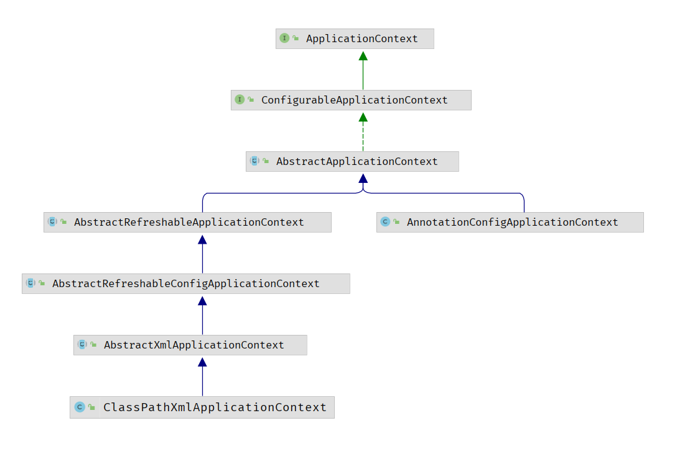
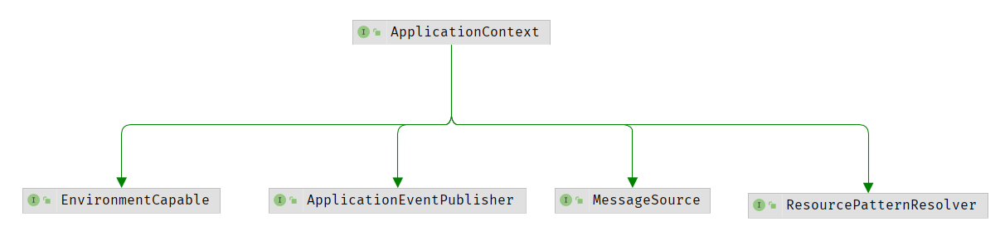

### 1 前言

我们在运行Spring程序时，通常会使用到以下代码：

```java
    public static void main(String[] args) {
        //通过xml方式获取Bean
        ClassPathXmlApplicationContext context =
                new ClassPathXmlApplicationContext("spring.xml");
        context.getBean(HelloSpring.class);
        
        
        //通过去容器中读取Bean的信息
        AnnotationConfigApplicationContext ctx = new AnnotationConfigApplicationContext(MainCofig.class);
        
        System.out.	println(ctx.getBean("xxx"));
    }
```

可以看到，运行以上两句代码，我们就可以从Spring容器中获取到相应的Bean，那么可以分别从这两句代码入手，看看Spring是如何运行的


### 2 认识ApplicationContext

代码中都用到了xxxApplicationContext，以下是ApplicationContext的继承图，发现ClassPathXmlApplicationContext和AnnotationConfigApplicationContext都实现自ApplicationContext顶层接口。



- ApplicationContext中文意思是“应用上下文”，继承自BeanFactory接口
- 在ApplicationContext接口的实现类中，比较常用的是ClassPathXmlApplicationContext和AnnotationConfigApplicationContext。
- 实现类的主要区别就是装载Spring配置文件实例化ApplicationContext容器的方式不同，在ApplicationContext实例化后，同样通过getBean方法从ApplicationContext容器中获取装配好的Bean实例以供使用


再来看看ApplicationContext的父类接口



- EnvironmentCapable：ApplicationContext继承了这个接口，表示拥有了获取环境变量的功能，可以通过ApplicationContext获取操作系统环境变量和JVM环境变量。
- ListableBeanFactory：ApplicationContext继承了这个接口，就拥有了获取所有beanNames、判断某个beanName是否存在beanDefinition对象、统计BeanDefinition个数、获取某个类型对应的所有beanNames等功能。
- HierarchicalBeanFactory：ApplicationContext继承了这个接口，就拥有了获取父BeanFactory、判断某个name是否存在bean对象的功能。
- MessageSource：ApplicationContext继承了这个接口，就拥有了国际化功能，比如可以直接利用MessageSource对象获取某个国际化资源（比如不同国家语言所对应的字符）
- ApplicationEventPublisher：ApplicationContext继承了这个接口，就拥有了事件发布功能，可以发布事件，这是ApplicationContext相对于BeanFactory比较突出、常用的功能。
- ResourcePatternResolver：ApplicationContext继承了这个接口，就拥有了加载并获取资源的功能，这里的资源可以是文件，图片等某个URL资源都可以


总结：Application可以获取环境变量、获取容器中Bean的信息、发布事件、加载静态化资源


### 3 Spring的运行流程

从ApplicationContext查看源码

从main函数点进去查看new ApplicationContext后Spring做了什么事请

```java
public ClassPathXmlApplicationContext(String[] configLocations, boolean refresh, ApplicationContext parent) throws BeansException {
        super(parent);
        this.setConfigLocations(configLocations);
        if (refresh) {
            this.refresh();
        }

}


public AnnotationConfigApplicationContext(Class<?>... annotatedClasses) {
    this();
    this.register(annotatedClasses);
    this.refresh();
}

```

发现两个实现类的初始化中，都调用了refresh()方法，refresh()方法放在后面分析。

#### 3.1 ClassPathXmlApplicationContext

先看ClassPathXmlApplicationContext的构造函数中调用的this.setConfigLocations(configLocations);

```java
public void setConfigLocations(String... locations) {
    if (locations != null) {
        Assert.noNullElements(locations, "Config locations must not be null");
        this.configLocations = new String[locations.length];

        for(int i = 0; i < locations.length; ++i) {
            this.configLocations[i] = this.resolvePath(locations[i]).trim();
        }
    } else {
        this.configLocations = null;
    }

}
```

从源码可以看出，这个函数的作用是去解析给定的路径“spring.xml”，然后赋值到this.configLocations中。

#### 3.2 AnnotationConfigApplicationContex

再看AnnotationConfigApplicationContext的初始化过程

```java
public AnnotationConfigApplicationContext(Class<?>... annotatedClasses) {
    this();
    this.register(annotatedClasses);
    this.refresh();
}


public AnnotationConfigApplicationContext(DefaultListableBeanFactory beanFactory) {
    super(beanFactory);
    this.reader = new AnnotatedBeanDefinitionReader(this);
    this.scanner = new ClassPathBeanDefinitionScanner(this);
}
```

调用this()，发现初始化了一个注解bean定义的读取器AnnotatedBeanDefinitionReader以及类路径下bean定义的扫描器ClassPathBeanDefinitionScanner，通过它们的初始化，将一些功能性的组件注册到容器中，然后再执行refresh()函数。


### 4 refresh()方法

查看refresh方法

```java
public void refresh() throws BeansException, IllegalStateException {
    synchronized(this.startupShutdownMonitor) {
        //刷新容器前的准备工作，验证一些必要的属性，创建事件容器等
        this.prepareRefresh();
        //获取beanFactory
        ConfigurableListableBeanFactory beanFactory = this.obtainFreshBeanFactory();
        //准备BeanFactory
        this.prepareBeanFactory(beanFactory);

        try {
            //对BeanFactory做一些后置处理，点进去发现是一个空方法，应该是模板方法交由子类去实现
            this.postProcessBeanFactory(beanFactory);
            //调用BeanFactory的后置处理器
            this.invokeBeanFactoryPostProcessors(beanFactory);
            //注册Bean的后置处理器
            this.registerBeanPostProcessors(beanFactory);
            //初始化消息源
            this.initMessageSource();
            //初始化多播器
            this.initApplicationEventMulticaster();
            //模板方法
            this.onRefresh();
            //注册监听器，广播事件
            this.registerListeners();
            //BeanFactory初始化完成，重要方法preInstantiateSingletons()
            this.finishBeanFactoryInitialization(beanFactory);
            this.finishRefresh();
        } catch (BeansException var9) {
            if (this.logger.isWarnEnabled()) {
                this.logger.warn("Exception encountered during context initialization - cancelling refresh attempt: " + var9);
            }

            this.destroyBeans();
            this.cancelRefresh(var9);
            throw var9;
        } finally {
            this.resetCommonCaches();
        }

    }
}
```

OK，对refresh()方法的大概流程进行了简单的分析，这应该是Spring的整个生命周期（跟着断点调试，refresh()方法执行完后回到了main函数中）。接下来就是深入分析，Spring是如何把Bean放入容器中的


### 5 ioc容器


