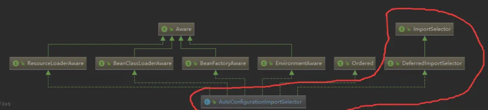
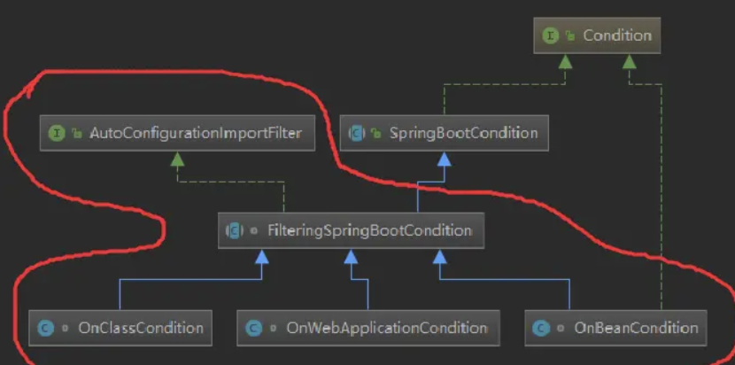

# SpringBoot的自动配置


# 1 @SpringBootApplication

标注有@SpringBootApplication注解的启动类通过执行 run 方法即可实现大量 Starter 的自动配置。因此先看这个注解的源码

```java
@Target(ElementType.TYPE)
@Retention(RetentionPolicy.RUNTIME)
@Documented
@Inherited
@SpringBootConfiguration
@EnableAutoConfiguration
@ComponentScan(excludeFilters = {
      @Filter(type = FilterType.CUSTOM, classes = TypeExcludeFilter.class),
      @Filter(type = FilterType.CUSTOM, classes = AutoConfigurationExcludeFilter.class) })
public @interface SpringBootApplication {
    ...
}
```

发现 @SpringBootApplication 上有一个 @EnableAutoConfiguration 注解，顾名思义， @EnableAutoConfiguration 肯定和自动配置有关，打开 @EnableAutoConfiguration 注解的源码

```java
@Target(ElementType.TYPE)
@Retention(RetentionPolicy.RUNTIME)
@Documented
@Inherited
@AutoConfigurationPackage
@Import(AutoConfigurationImportSelector.class)
public @interface EnableAutoConfiguration {
	...
}
```

看到 @AutoConfigurationPackage 和 @Import(AutoConfigurationImportSelector.class) 两个注解，顾名思义 @AutoConfigurationPackage 跟自动配置的包有关，而导入的 AutoConfigurationImportSelector 类是跟自动配置的选择导入有关。因此，先分析这个类。


# 2 AutoConfigurationImportSelector

首先看看 AutoConfigurationImportSelector 的类继承图



AutoConfigurationImportSelector 实现了众多 xxxAware 接口以及 DeferredImportSelector 接口，而 DeferredImportSelector 又实现了 ImportSelector 接口。 ImportSelector  接口只有一个 selectImports 方法。

```java
public interface ImportSelector {

   String[] selectImports(AnnotationMetadata importingClassMetadata);

}
```

但是SpringBoot自动配置实现逻辑的入口方法并不在这里！调试源码可知，入口方法在 DeferredImportSelectorGrouping 类的 getImports 方法处


# 3 分析自动配置原理

自动配置实现的逻辑入口方法在 DeferredImportSelectorGrouping 类的 getImports 方法处，看看这个方法的源码

```java
public Iterable<Group.Entry> getImports() {
    //遍历DeferredImportSelectorHolder对象集合，deferredImports集合装载了各种ImportSelector
   for (DeferredImportSelectorHolder deferredImport : this.deferredImports) {
       //利用AutoConfigurationGroup的process方法处理自动配置的相关逻辑，决定导入哪些配置类（分析重点）
      this.group.process(deferredImport.getConfigurationClass().getMetadata(),
            deferredImport.getImportSelector());
   }
    //经过以上步骤处理后，再及进行选择导入
   return this.group.selectImports();
}
```

AutoConfigurationGroup 是 AutoConfigurationImportSelector 的内部类，主要用来处理自动配置相关逻辑

进入 process 源码

```java
public void process(AnnotationMetadata annotationMetadata,
      DeferredImportSelector deferredImportSelector) {
   Assert.state(
         deferredImportSelector instanceof AutoConfigurationImportSelector,
         () -> String.format("Only %s implementations are supported, got %s",
               AutoConfigurationImportSelector.class.getSimpleName(),
               deferredImportSelector.getClass().getName()));
    //获取自动配置类，然后放入autoConfigurationEntries中
   AutoConfigurationEntry autoConfigurationEntry = ((AutoConfigurationImportSelector) deferredImportSelector)
         .getAutoConfigurationEntry(getAutoConfigurationMetadata(),
               annotationMetadata);
   this.autoConfigurationEntries.add(autoConfigurationEntry);
   for (String importClassName : autoConfigurationEntry.getConfigurations()) {
      this.entries.putIfAbsent(importClassName, annotationMetadata);
   }
}
```

进入 getAutoConfigurationEntry 方法

```java
protected AutoConfigurationEntry getAutoConfigurationEntry(
      AutoConfigurationMetadata autoConfigurationMetadata,
      AnnotationMetadata annotationMetadata) {
   if (!isEnabled(annotationMetadata)) {
      return EMPTY_ENTRY;
   }
    // 获得@Congiguration标注的Configuration类
	// 比如：@SpringBootApplication(exclude = FreeMarkerAutoConfiguration.class)
	// 将会获取到exclude = FreeMarkerAutoConfiguration.class和excludeName=""的注解数据
   AnnotationAttributes attributes = getAttributes(annotationMetadata);
    //获取spring.factories文件配置的所有自动配置类
   List<String> configurations = getCandidateConfigurations(annotationMetadata,
         attributes);
    //排除重复获取的类
   configurations = removeDuplicates(configurations);
    //将要排除的配置类保存在集合中
   Set<String> exclusions = getExclusions(annotationMetadata, attributes);
   checkExcludedClasses(configurations, exclusions);
   configurations.removeAll(exclusions);
    // 因为从spring.factories文件获取的自动配置类太多，如果有些不必要的自动配置类都加载进内存，会造成内存浪费，因此这里需要进行过滤
	// 注意这里会调用AutoConfigurationImportFilter的match方法来判断是否符合@ConditionalOnBean,@ConditionalOnClass或@ConditionalOnWebApplication
   configurations = filter(configurations, autoConfigurationMetadata);
   fireAutoConfigurationImportEvents(configurations, exclusions);
    //将符合条件和要排除的自动配置类封装并返回
   return new AutoConfigurationEntry(configurations, exclusions);
}
```


看看 filter 方法，主要做的事情就是调用 AutoConfigurationImportFilter 接口的 match 方法来判断每个自动配置类上的条件注解是否满足条件，满足则匹配

```java
private List<String> filter(List<String> configurations,
      AutoConfigurationMetadata autoConfigurationMetadata) {
   long startTime = System.nanoTime();
   String[] candidates = StringUtils.toStringArray(configurations);
   boolean[] skip = new boolean[candidates.length];
   boolean skipped = false;
    // getAutoConfigurationImportFilters方法：拿到OnBeanCondition，OnClassCondition和OnWebApplicationCondition
	// 然后遍历这三个条件类去过滤从spring.factories加载的大量配置类
   for (AutoConfigurationImportFilter filter : getAutoConfigurationImportFilters()) {
       // 调用各种aware方法，将beanClassLoader,beanFactory等注入到filter对象中
      invokeAwareMethods(filter);
       // 判断各种filter来判断每个candidate（这里实质要通过candidate(自动配置类)拿到其标注的
		// @ConditionalOnClass,@ConditionalOnBean和@ConditionalOnWebApplication里面的注解值）是否匹配
      boolean[] match = filter.match(candidates, autoConfigurationMetadata);
      for (int i = 0; i < match.length; i++) {
          // 不匹配的将记录在skip数组，标志skip[i]为true,同时将对应的配置类置为null
         if (!match[i]) {
            skip[i] = true;
            candidates[i] = null;
            skipped = true;
         }
      }
   }
    //经过上述过滤操作，如果所有自动配置类都没有被过滤，那么直接返回
   if (!skipped) {
      return configurations;
   }
   List<String> result = new ArrayList<>(candidates.length);
   for (int i = 0; i < candidates.length; i++) {
      if (!skip[i]) {
         result.add(candidates[i]);
      }
   }
   if (logger.isTraceEnabled()) {
      int numberFiltered = configurations.size() - result.size();
      logger.trace("Filtered " + numberFiltered + " auto configuration class in "
            + TimeUnit.NANOSECONDS.toMillis(System.nanoTime() - startTime)
            + " ms");
   }
   return new ArrayList<>(result);
}
```


# 4 AutoConfigurationImportFilter

AutoConfigurationImportFilter 类的 filter 方法中调用了 AutoConfigurationImportFilter 的match 接口，看看 AutoConfigurationImportFilter 的类图



FilteringSpringBootCondition ，实现了 match 接口，然后在 FilteringSpringBootCondition 类中的 match 方法中又调用了 getOutcomes方法。

```java
public boolean[] match(String[] autoConfigurationClasses,
      AutoConfigurationMetadata autoConfigurationMetadata) {
   ConditionEvaluationReport report = ConditionEvaluationReport
         .find(this.beanFactory);
   ConditionOutcome[] outcomes = getOutcomes(autoConfigurationClasses,
         autoConfigurationMetadata);
   boolean[] match = new boolean[outcomes.length];
   for (int i = 0; i < outcomes.length; i++) {
      match[i] = (outcomes[i] == null || outcomes[i].isMatch());
      if (!match[i] && outcomes[i] != null) {
         logOutcome(autoConfigurationClasses[i], outcomes[i]);
         if (report != null) {
            report.recordConditionEvaluation(autoConfigurationClasses[i], this,
                  outcomes[i]);
         }
      }
   }
   return match;
}
```

由之前的分析可知， getOutcomes 方法时一个抽象模板方法，其作用是返回自动配置类是否匹配的结果，此方法由三个子类去覆写各个的匹配判断逻辑


# 5 小结

最后，总结下 SpringBoot 自动配置的原理，主要做了以下事情：

1. 从  spring.factories  配置文件中加载自动配置类；
2. 加载的自动配置类中排除掉@EnableAutoConfiguration注解的exclude属性指定的自动配置类；
3. 然后再用AutoConfigurationImportFilter接口去过滤自动配置类是否符合其标注注解（若有标注的话）`@ConditionalOnClass`,`@ConditionalOnBean`和`@ConditionalOnWebApplication`的条件，若都符合的话则返回匹配结果；
4. 然后触发`AutoConfigurationImportEvent`事件，告诉`ConditionEvaluationReport`条件评估报告器对象来分别记录符合条件和`exclude`的自动配置类。
5. 最后 spring 再将最后筛选后的自动配置类导入 IOC 容器中