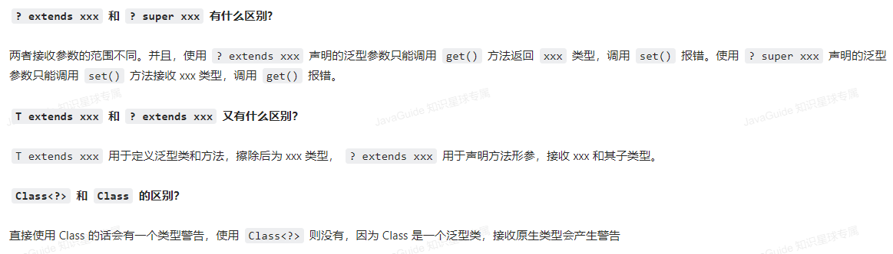

## 一 面向对象的特性

- 封装：将对象的实现细节隐藏起来，然后通过一些公用方法来暴露该对象的功能
- 继承：是面向对象实现软件复用的重要手段，当子类继承父类后，可获得父类的属性和方法
- 多态：子类对象可以直接赋值给父类变量，但运行时依然表现出子类的行为特征，同一个类型的对象在执行同一个方法时，可能表现出多种行为特征


## 二 继承

- 关键字extends

- 单继承

- 重写&重载

  重写：子类包含与父类同名的方法，子类方法遵循“两同两小一大”的原则

  重载：主要发生在同一个类的多个同名方法之间；方法的返回值和方法名相同，参数可以不同


## 三 多态

- 引用类型分为编译时类型和运行时类型，编译时类型由声明该变量时使用的类型决定，运行时类型由实际赋给该变量的对象决定

  BaseClass bc = new SubClass（）；

  编译时类型                   运行时类型

- 引用变量在编译阶段只能调用其**编译时类型**所具有的方法，但运行时则执行它**运行时类型**所具有的方法

- 通过引用变量来访问其包含的实例变量时，系统总是试图访问它编译时类型所定义的成员变量

- 编写java代码时，引用变量只能调用编译时类型的方法；如果需要让这个引用变量调用它运行时类型的方法，则必须把它强制类型转换成运行时类型。注意，基本类型之间的转换只能在数值类型之间进行；引用类型的转换只能在具有继承关系的两个类型之间进行。


## 四 初始化块与构造器

- 静态初始化块&非静态初始化块
- 实例初始化块负责对对象执行初始化，类初始化块则负责对类进行初始化
- 创建java对象时，系统总是先调用类定义的实例初始化块，如果有多个初始化块则按编码顺序执行，然后再执行构造器；类初始化则在类初始化阶段自动执行
- 类初始化块也属于类的静态成员，同样需要遵循静态成员不能访问非静态成员的规则。因此类初始化块不能访问实例变量和实例方法


## 五 包装类

- java是面向对象的语言，但是8种基本数据类型不支持面向对象的编程机制，也不具备“对象”的特性：没有成员变量、方法可以被调用；为了解决基本数据类型的变量不能当成Obejcet类型变量使用的问题，引入包装类

- 自动装箱&自动拆箱：

  - ```java
    //实际调用了valueOf方法，等价于Integer i = Integer.valueOf(10)
    Integer i = 10;  //装箱
    //实际调用了xxxValue方法，等价于int n = i.intValue()
    int n = i;   //拆箱
    
    
    Integer i1 = 40;//自动装箱，i1直接使用的是常量池对象（对象复用）
    Integer i2 = new Integer(40);//i2会在堆上创建新的对象
    System.out.println(i1==i2);  //返回false
    ```

- 所有整形包装类对象之间值的比较，全部使用equals方法比较

  - 

- 字符串转换为基本数据类型： 

  - valueOf(String s)
  - parseXxx(String s)

- 基本数据类型转为字符串：valueOf（）

- 包装类的常量池技术：Byte、Short、Integer、Long默认创建了[-128,127]的相应类型的缓存数据，Character创建了数值在[0,127]的缓存数据，Boolean直接返回true或者false

- 自动拆箱引发的NPE问题

  - ```java
    public class AutoBoxTest {
        @Test
        void  should_Throw_NullPointerException(){
            long id = getNum();
        }
        public Long getNum(){
            return null;
        }
    }
    //Long->long的过程会调用longValue方法
    //则long id = getNum(); 等价于 long id = getNum().longValue();
    //因为getNum()返回值为null，所有会有NPE问题
    
    
    ```

  - ```java
    public class Main {
        public static void main(String[] args) {
            Integer i = null;
            Boolean flag = false;
            System.out.println(flag ? 0 : i);
        }
    }
    //三目运算符使用不当导致的NPE异常
    //flag ? 0 : i，0是基本数据类型int，返回数据时i会强制拆箱称int类型，由于i是null，因此NPE
    //应该改为System.out.println(flag ? new Integer(0) : i);
    ```

  - 


## 六 final

- final修饰基本数据类型和引用变量的区别
  - 基本数据类型：不能对基本类型变量重新赋值
  - 引用类型：保证引用类型变量所引用的地址不会改变，即一直引用同一个对象
- final方法：不可以被重写
- final类：不可以有子类


## 七 抽象类与接口

- 相同点
  - 接口和抽象类都不能被实例化，都用于被其他类实现和继承
  - 接口和抽象类都可以包含抽象方法
- 差异
  - 设计目的
    - 接口体现的是一种规范。对于接口的实现者而言，接口规定了实现者必须向外提供哪些服务；对于调用者而言，接口规定了调用者可以调用哪些服务以及如何调用这些服务。当在程序使用接口，接口是多个模块间的耦合标准；在应用程序直接使用接口，接口是多个应用程序之间的通信标准
    - 抽象类作为系统中多个子类的共同父类，它所体现的是一种模板式设计。抽象类可以被当成系统实现过程中的中间产品，这个中间产品已经实现了部分功能，但这个产品依然不能当成最终产品，必须有更进一步的完善
  - 接口里只能包含抽象方法、静态方法、默认方法和私有方法，不能为普通方法提供实现；抽象类可以包含普通方法
  - 接口里只能定义静态常量，不能定义普通成员变量；抽象类都可以
  - 接口不包含构造器；抽象类可以，抽象类的构造器不是用于创建对象，而是让其子类调用这些构造器来完成属于抽象类的初始化操作
  - 接口里不能包含初始化块
  - 单继承与接口多实现


## 八 内部类


## 九 注解

- 基本注解
- 元注解


## 十 IO

- 输入流 & 输出流 ：从内存的角度考虑内存往外发数据就是输出流；InputStream&Reader，OutputStream&Writer
- 字节流 & 字符流：字节流操作的数据单元是8位字节，字符流操作的数据单元式16位字符；字节流由xxxStream作为基类，字符流由Read和Writer作为基类
- 节点流 & 处理流
- 转换流
- 重定向io流
- 序列化
  - Serializable & Extenalizable
  - 同一个对象多次序列化
  - 可变对象的序列化
  - transient关键字


## 十一 非阻塞式NIO（如何实现的NIO？）

- 传统的IO系统都是阻塞式的输入输出（InputStream的read方法读取数据，如果数据源中没有数据，它会阻塞该线程），且一次只能处理一个字节，效率不高
- 应用场景：非阻塞式Socket通信；传统IO为阻塞式的，不适合保持持久通信状态的交互式应用，只适用于一站式的通信协议，例如HTTP协议——客户端连接到服务器后，开始发送请求数据，发送完成无须再次发送数据，只需要读取服务器响应数据即可，当读取响应完成后，该Socket连接也被关闭了
- 新IO采用内存映射文件的方式来处理IO，新IO将文件或文件的一段区域映射到内存中（模拟OS的虚拟内存）
- 核心对象 Channel和Buffer
  - NIO系统中所有数据都要通过Channel传输，它与传统IO最大的区别在于提供了一个map方法，通过该方法可以直接将“一块数据”映射到内存
  - Buffer是一个容器，本质上是数组。通道只与Buffer交互；常用方法put、get、flip、clear
- Selector
  - 它是SelectableChannel对象的多路复用器，所有希望采用非阻塞式进行通信的Channel多应该注册到Selector对象。可以调用此类的静态方法open来创建Selector实例
  - Selector可以同时监控多个SelectableChannel的IO状况，是非阻塞IO的核心
  - 一个实例有3个集合：所有SelectionChannel集合、被选择的集合、被取消的集合
- NIO.2的改进
  - 提供了全面的文件IO和文件系统访问支持
  - 基于异步Channel的IO
- Path接口、Paths工具类、FIles工具类


## 十二 AIO

- NIO.2提供了异步Channel支持，这种异步Channel可以提供更高效的IO
- IO可以分为两类：同步IO和异步IO。对于IO操作可以分成两部分：1程序发出IO请求；2完成实际的IO操作。阻塞IO和非阻塞IO都是针对第一步来划分的，如果发出IO请求会阻塞线程，就是阻塞IO；反之是非阻塞IO；但同步IO与异步IO的区别在第二部——如果实际的IO操作由OS完成，再将结果返回给应用程序，这就是异步IO；如果实际的IO需要应用程序本身执行，会阻塞线程，那就是同步IO
- AsynchronousSocketChannel、AsynchronousServerSocketChannel、CompletionHandler
- 要充分挖掘Java AIO的优势，应考考虑使用线程池来管理异步Channel，并使用CompletionHandler来监听异步IO操作

## 十三 反射

- 程序中的许多对象在运行时都会出现两种类型：编译时类型和运行时类型，程序在运行时接收到外部传入的对象的编译时类型是Object，但程序又需要调用该对象运行时类型的方法。为了解决这些问题：

  - 假设在编译时和运行时都完全知道类型的真实信息，可以先使用instanceof进行判断，再利用强制类型转换转换成其运行时类型的变量
  - 编译时无法预知该对象和类属于哪些类，只能依靠运行时信息来发现该对象和类的真实信息，这就必须使用反射

- 获得Class对象

  - Class类的forName（String clazzName），参数为类的全限定名
  - 某个类的class属性，例如Person.class；优势：代码安全，程序在编译阶段就可以检查Class对象是否存在；程序性能更好，无须调用方法
  - 调用某个对象的getClass（）

- 从Class获取信息

  - 获取构造器getConstructors（）
  - 获取方法getMethod（）
  - 获取成员变量getField（）
  - 获取注解getAnnotation（）
  - 获取内部类getDeclaringClasses（）
  - 获取外部类getDeclaringClass（）
  - 获取实现的接口getInterfaces（）
  - 获取父类getSuperclass（）
  - 获取对应类的修饰符、所在包、类名等基本信息

- 方法参数反射

  - Executable 类，派生了Constructor、Method
    - int getParameterCount（）
    - Parameter[] getParameters（）

- 使用反射生成对象

  Class.forName（clazzName）.getConstructor（）.newInstacne（）

- 操作数组 反射包下的Array类

- 使用反射生成动态代理：Proxy和InvocationHandler

  - 实现解耦，代码复用

  - Proxy：getProxyClass（）；newProxyInstance（）

  - InvocationHandler的invoke（）方法：当执行动态代理对象里的方法时，实际上会替换成调用invoke方法

  - ```java
    //抽象角色
    public interface Rent {
        public void rent();
    }
    
    //真实角色
    public class Host implements Rent{
        public void rent(){
            System.out.println("房东要租房");
        }
    }
    
    public class ProxyInvocationHandler implements InvocationHandler {
    
        private Object object;
    
        public void setObject(Object object){
            this.object = object;
        }
    
        //生成代理类
        public Object getProxy(){
            return Proxy.newProxyInstance(this.getClass().getClassLoader(), object.getClass().getInterfaces(), this);
        }
    
    
        @Override
        public Object invoke(Object proxy, Method method, Object[] args) throws Throwable {
            seeHouse();
            Object res = method.invoke(object, args);
            fare();
            return res;
        }
    
        //看房
        public void seeHouse(){
            System.out.println("带房客看房");
        }
        //收中介费
        public void fare(){
            System.out.println("收中介费");
        }
    }
    
    
    
    ```

    

- 动态代理和AOP(AOP代理)

  ```java
  //抽象角色
  public interface Dog {
      public void info();
      public void run();
  }
  
  //实现类
  public class GunDog implements Dog{
      @Override
      public void info() {
          System.out.println("我是一只猎狗");
      }
  
      @Override
      public void run() {
          System.out.println("我奔跑迅速");
      }
  }
  
  //工具类
  public class DogUtil {
      //第一个拦截器方法
      public void method1(){
          System.out.println("========模拟第一个通用方法=========");
      }
  
      //第二个拦截器方法
      public void method2(){
          System.out.println("========模拟第二个通用方法=========");
      }
  }
  
  
  public class MyInvocationHandler implements InvocationHandler {
  
      private Object target;
  
      public void setTarget(Object target){
          this.target = target;
      }
  
      @Override
      public Object invoke(Object proxy, Method method, Object[] args) throws Throwable {
          DogUtil du = new DogUtil();
          du.method1();
          Object res = method.invoke(target, args);
          du.method2();
          return res;
      }
  }
  
  //工厂类，用于生成动态代理对象
  public class MyProxyFactory {
      public static Object getProxy(Object target){
          MyInvocationHandler handler = new MyInvocationHandler();
          handler.setTarget(target);
          return Proxy.newProxyInstance(target.getClass().getClassLoader(), target.getClass().getInterfaces(), handler);
      }
  }
  
  public class Test {
      public static void main(String[] args) {
          Host host = new Host();
          ProxyInvocationHandler handler = new ProxyInvocationHandler();
          handler.setObject(host);//隐式向上转型
          Rent proxy = (Rent) handler.getProxy();
          proxy.rent();
      }
  }
  ```

  AOP代理里的方法可以在执行目标方法之前、之后插入一些通用的处理

- 反射和泛型：JDK5后，java的Class类增加了泛型功能，允许使用泛型来限制Class类。例如String.class的类型实际上是Class<String>。如果Class对应的类暂时未知，则使用Class<?>。通过在反射中使用泛型，可以避免使用反射生成的对象需要强制类型转换

  ```java
  public class CrazyObjectFactory{
      public static Object getInstance(String clsName){
          try{
              Class cls = Class.forName(clsName);
              return cls.getConstructor().newInstance();
          }catch (Exception e){
              e.printStackTrace();
              return null;
          }
      }
  }
  
  //泛型
  public class CrazyObjectFactory1{
      public static <T> T getInstance(Class<T> cls){
          try{
              return cls.getConstructor().newInstance();
          }catch (Exception e){
              e.printStackTrace();
              return null;
          }
      }
  }
  ```


## 十四 网络编程

- java.net包

- InetAddress类代表IP地址，此类没有构造器，提供两个静态方法来获取实例

- URLDecoder&URLEncoder，用于完成普通字符串和application/x-www-from-urlencoded MINE字符串之间的转换

- URL，统一资源定位器，可以由协议名、主机、端口和资源组成
  protocal：//host:port/resourceName

  URL对象提供的openStream（）方法可以读取该URL资源的InputStream，通过该方法可以非常方便地读取远程资源，甚至实现多线程下载

  - 多线程下载：
    - 创建URL对象
    - 获取指定URL对象指向资源的大小，此处用到URLConnection类，该类代表Java应用程序和URL之间的通信连接
    - 在本地磁盘上创建一个与资源大小相同的空文件
    - 计算每个线程应该下载的部分（哪个字节开始哪个字节结束）
    - 依次创建、启动多线程来下载

- 基于TCP协议的网络编程：在通信两端各建立一个Socket，Java使用Socket对象来代表两端的通信端口，并通过Socket产生IO流来进行网络通信

  - 使用ServerSocket创建TCP服务其端，用于监听来自客户端的Socket连接，如果没有连接，将一直处于等待状态
  - 使用Socket进行通信，客户端使用Socket的构造器来连接到指定服务器
  - 获取流

- 多线程


## 十五 多线程

- 线程和进程

  - 进程：是系统进行资源分配和调度的一个独立单位
    - 独立性：可以拥有自己独立的资源，每个进程都有自己私有的地址空间
    - 动态性：和程序的区别在于，程序只是一个静态的指令集合，进程是一个正在系统中活动的指令集合，具有自己的生命周期和各种不同的状态
    - 并发性：多个进程可以在单个处理器上并发执行，多个进程之间不会互相影响
    - 并发和并行：并行是同一时刻，有多条指令在多个处理器上同时执行；并发指在同一个时刻只能有一条指令执行，但多个进程指令被快速轮换执行，使得在宏观上具有多个进程同时执行的效果
  - 线程：线程是进程的执行单元，是进程的组成部分
    - 一个进程可以拥有多个线程
    - 一个线程可以创建和撤销另一个线程
    - 线程可以拥有自己的堆栈、程序计数器等，但不拥有系统资源
    - 多线程共享其进程所拥有的全部资源
  - 多线程优势：
    - 进程之间不能共享内存，但线程之间共享内存非常容易
    - 系统创建进程需要为该进程重新分配系统资源，但创建线程的代价小很多。因此使用多线程来实现多任务并发比多进程效率高

- 线程的创建和启动

  - 通过继承Thread类来创建启动多线程
    - 定义Thread子类，重写run方法
    - 创建Thread子类实例，即创建了线程对象
    - 调用线程对象的start方法来启动线程
    - 使用继承Thread类的方法来创建线程类时，多个线程之间无法共享线程类的实例变量
  - 实现Runnable接口创建并启动多线程
    - 定义Runnable接口的实现类，重现run方法
    - 创建实现类的实例，并以此实例作为Thread的target来创建Thread对象，该Thread对象才是真正的线程对象
    - 调用线程对象的start来启动
  - 使用callable接口、Future接口、FutureTask实现类；callable接口的call方法可以作为线程执行体，且call有返回值和抛出异常；Future接口来代表call方法的返回值，并提供一个FutureTask实现类，该类也实现了Runnable接口，可以作为Thread类的target
    - 创建Callable接口实现类，实现call方法，该call方法将作为线程执行体，且该call方法有返回值。再创建callable实现类的实例
    - 使用FutureTask包装Callable对象，该FutureTask对象封装了该Callable对象的call方法的返回值
    - 使用FutureTask对象作为Thread的target创建并启动线程
    - 调用FutureTask的get方法来获得子线程执行结束后的返回值
  - 对比两种创建多线程的方法（Runnable和Callable归为一种）
    - Runnable&Callable
      - 线程类只是实现了接口，还可以继承其他类
      - 多线程可以共享同一个target对象，适合多个相同线程处理同一资源的场景
      - 编程稍微复杂，如果需要访问 当前线程，必须使用Thread.currentThread()
    - 继承Thread类
      - 不能再继承其他父类
      - 编写简单，直接使用this即可获取当前线程

- 线程的生命周期

  

- 控制线程

  - join（），在某个程序执行流程中调用其他线程的join方法，那么调用线程将被阻塞，直到被join的线程执行完成
  - 后台线程，为其他的线程提供服务，又称守护线程，如JVM的GC线程
    - 如果所有的前台线程死亡，后台线程会自动死亡
  - 睡眠线程sleep，让当前线程暂停一段时间
  - 改变线程优先级setPriority

- 线程同步

  - synchronized
  - 同步锁 Lock
  - 死锁

- 线程通信

  - 传统的线程通信，Object类的wait 、notify
  - 使用Condition，await、signal
  - 使用阻塞队列BlockingQueue

- 线程池

  - Executor工厂类产生线程池
  - 使用ForkJoinPool利用多CPU，支持将一个任务拆分成多个“小任务”并行计算，再把多个“小任务”的结果合并成总的计算结果。ForkJoinPool是ExecutorService的实现类

- 线程相关类

  - ThreadLocal类
    - 线程局部变量，为每一个使用该变量的线程都提供一个变量值的副本，使每个线程都可以独立地改变自己的副本，而不会和其他线程的副本冲突。从线程的角度看，就好像每个线程都完全拥有该变量一样
    - 常用方法：T get（）； void remove（）；void set（）
    - ThreadLocal并不能代替同步机制，两者面向的问题领域不同。同步机制是为了同步多个线程共享同一资源的并发访问，是多线程之间进行通信的有效方式；ThreadLocal是为了隔离多个线程的数据共享，从根本上避免多线程之间对共享资源的竞争
    - 如果多线程之间需要共享资源以达到线程之间的通信功能，就使用同步机制；如果仅仅需要隔离多个线程之间的共享冲突，可以使用ThreadLocal
  - 包装线程不安全的集合：如果程序中有多个线程并发访问集合，可以使用Collections提供的类方法把这些集合包装成线程安全的集合synchronizedXxx
  - 线程安全的集合，JUC包提供了大量支持高效并发访问的集合接口和实现类
    - 以Concurrent开头的集合类
    - 以CopyOnWrite开头的集合类。CopyOnWriteArrayList，采用复制底层数组的方式来实现写操作。执行读操作会直接读取集合本身，无需加锁与阻塞。执行写入操作（add、remove、set等）该集合会在底层复制一份新的数组，对新的数组执行写入操作。因此，该集合适合用在读取操作远远大于写入操作的场景中，如缓存。


## 十六 异常

- 良好的异常处理机制可以让程序具有极好的容错性，让程序更加健壮。实现将"业务功能实现代码"和"错误处理代码"分离

- 抛出异常：try块里出现异常，系统自动生成一个异常对象，该对象被提交给Java运行时环境，这个过程称为抛出异常（throw）

- 捕获异常：如果找到合适的catch块，则把该异常对象交给该catch块处理

- 如果java运行时环境找不到捕获异常的catch块，则java程序退出

- try块里声明的变量是局部变量，在catch块中不能访问

- 寻找catch块的流程：java接受到异常对象后，会依次判断异常对象是否是catch块后异常类或其子类的实例，如果是则调用该catch块进行异常处理；否则再次拿该异常对象和下一个catch块后的异常类进行比较。

- 异常类的继承体系
  

- throws ExceptionClass1,ExceptionClass2 ...    

  throws 声明抛出异常的思路，当前方法不知道如何处理这种类型的异常，该异常应该由上一级调用者处理；如果main方法也不直到如何处理这种类型的异常，也可以throws抛出，交给JVM处理；JVM的处理方法是：打印异常的跟踪栈信息，并中止程序运行

- 使用throw抛出异常。throw语句抛出的不是异常类，而是一个异常实例，而且每次只能抛出一个异常实例throw ExceptionInstance


## 十七 泛型

### 提出

java集合的缺点：把一个对象丢进”集合“后，集合会忘记这个对象的数据类型，当再次取出该对象时，该对象的编译时类型就变成了Object类型（其运行时类型没变），因此取出集合元素后通常还需要进行强制类型转换，这种转换既增加了编程的复杂度，也可能引发ClassCastException异常

### 什么是泛型

允许在定义类、接口、方法时使用类型形参，这个类型形参（或叫泛型）将在声明变量、创建对象、调用方法时动态地指定（即传入实际的类型参数，也可称为类型实参）

- ```java
  List<String> l1 = new ArrayList<>();
  List<Integer> l2 = new ArrayList<>();
  //不管泛型的实际类型参数是什么，它们在运行时总有同样的类
  System.out.println(l1.getClass() == l2.getClass);//返回true
  ```

  因此，在静态方法、静态初始化块或者静态变量（都是类相关的）的声明和初始化中不允许使用泛型形参；由于系统中不会生成泛型类，所以instanceof运算符后不能使用泛型类

### 通配符

类型通配符 ?

- 通配符的上限：List<? extends Shape>，表示泛型形参必须是Shape子类的List。没有指定通配符上限的泛型类，相当于通配符上限是Object。指定通配符上限的集合，只能取元素，不能添加元素
- 通配符的下限：List<? super Shape> 能向其中添加元素，从集合中取元素只能被当成Object类型处理





### ？和T之间的区别

- T可以用于声明变量或常量，？不行
- T一般用于声明泛型类或方法，？一般用于泛型方法的调用代码和形参
- T在编译器会被擦除为限定类型或Object，通配符用于铺货具体类型


### 无界通配符

可以接收任何泛型类型数据，用于实现不依赖于具体类型参数的简单方法，可以铺货参数类型并交由泛型方法进行处理


### List<?>与List的区别

前者表示，list是持有某种特点类型的List，但是不知道具体是哪种类型，因此，添加元素会报错

后前表示，list是持有元素类型是Object，因此可以添加任何类型对象

```java
List<?> list = new ArrayList<>();
list.add("sss");//报错
List list2 = new ArrayList<>();
list2.add("sss");//警告信息
```


### 项目中哪里用到了泛型

- 自定义接口通用返回结果CommonResult<T>，通过参数T可根据具体的返回类型动态指定结果的数据类型
- 定义Excel处理类ExcelUtil<T>，用于动态指定Excel导出的数据类型
- 构建集合工具类

### 泛型擦除

Java的泛型是伪泛型，这是因为Java在编译期间，所有泛型信息都会被擦掉，即泛型擦除

编译器会在编译期间动态地将泛型T擦除为Object或将T extends xxx 擦除为限定类型 xxx

因此，泛型本质上其实还是编译器的行为，为了保证引入泛型机制但不创建新的类型，减少虚拟机的运行开销，编译器通过擦除将泛型类转化为一般类

```java
List<Integer> list = new ArrayList<>();

list.add(12);
//1.编译期间直接添加会报错
list.add("a");
Class<? extends List> clazz = list.getClass();
Method add = clazz.getDeclaredMethod("add", Object.class);
//2.运行期间通过反射添加，是可以的
add.invoke(list, "kl");

System.out.println(list)
    
```

为什么要使用泛型（泛型的作用）

- 可以在编译期间进行类型检查
- 使用Object需要手动添加强制类型转换，降低代码可读性
- 泛型可以使用自限定类型 T extends Comparable


### 桥方法

用于继承泛型类时保证多态，桥方法为编译器自动生成


### 泛型的限制

泛型的限制一般是由泛型擦除机制导致的。擦除为Object后无法进行类型判断

- 只能声明不能实例化T类型变量
- 泛型参数不能是基本类型。因为基本类型不是Object子类
- 不能实例化泛型参数的数组
- 不能实例化泛型数组
- 无法使用Instance of 和getClass进行类型判断
- 不能实现两个不同泛型参数的统一接口，擦除后多个父类的桥方法冲突
- 不能使用static修饰泛型变量

```java
//以下代码能否编译
public final class Algorithm {
    public static <T> T max(T x, T y) {
        return x > y ? x : y;
    }
}

public class Singleton<T> {

    public static T getInstance() {
        if (instance == null)
            instance = new Singleton<T>();

        return instance;
    }

    private static T instance = null;
}
```


## 十八 基础类库

- 与用户交互
  - Java程序的参数
  - 使用Scanner，可以接收文件、输入流、字符串作为数据源，用于解析数据
    - hasNextXxx：是否还有下一个输入项，Xxx可以是Int、Long等代表基本数据类型的字符串。如果只是判断是否包含下一个字符串，直接使用hasNext
    - nextXxx：获取下一个输入项
    - 默认情况下，Scanner使用空白（空格、Tab空白、回车）作为多个输入项之间的分隔符
    - hasNextLine：返回输入源是否还有下一行
    - nextLine：返回输入源下一行的字符串
- 系统相关
  - System：代表当前Java程序的运行平台，提供了标准IO，并提供了一些静态方法用于访问静态变量、系统属性的方法，还提供了加载文件和动态链接库的方法
    - System.getenv()；获取所有环境变量
    - System.getProperties();
    - System.currentTimeMillis()、System.nanoTime()
  - Runtime：代表Java运行时环境，提供了GC方法，还可以访问JVM相关信息（处理器数量、内存信息）
- 常用类
  - Object
  - Objects：操作对象的工具类
  - String、StringBuffer、StringBuilder
  - Math
  - ThreadLocalRandom和Random
  - BigDecimal
  - 日期、时间类Calendar


## 十九 深拷贝、浅拷贝

浅拷贝：浅拷贝会在堆上创建新的对象，如果原对象内部的属性是引用类型，浅拷贝会直接复制内部对象的引用地址。也就是说拷贝对象和原对象共用同一个内部对象

深拷贝：深拷贝会完全复制整个对象，包括原对象所包含的全部对象


## 二十 Object类

Object类是所有类的父类，它有如下几个方法

```java
/**
 * native 方法，用于返回当前运行时对象的 Class 对象，使用了 final 关键字修饰，故不允许子类重写。
 */
public final native Class<?> getClass()
/**
 * native 方法，用于返回对象的哈希码，主要使用在哈希表中，比如 JDK 中的HashMap。
 */
public native int hashCode()
/**
 * 用于比较 2 个对象的内存地址是否相等，String 类对该方法进行了重写以用于比较字符串的值是否相等。
 */
public boolean equals(Object obj)
/**
 * naitive 方法，用于创建并返回当前对象的一份拷贝。
 */
protected native Object clone() throws CloneNotSupportedException
/**
 * 返回类的名字实例的哈希码的 16 进制的字符串。建议 Object 所有的子类都重写这个方法。
 */
public String toString()
/**
 * native 方法，并且不能重写。唤醒一个在此对象监视器上等待的线程(监视器相当于就是锁的概念)。如果有多个线程在等待只会任意唤醒一个。
 */
public final native void notify()
/**
 * native 方法，并且不能重写。跟 notify 一样，唯一的区别就是会唤醒在此对象监视器上等待的所有线程，而不是一个线程。
 */
public final native void notifyAll()
/**
 * native方法，并且不能重写。暂停线程的执行。注意：sleep 方法没有释放锁，而 wait 方法释放了锁 ，timeout 是等待时间。
 */
public final native void wait(long timeout) throws InterruptedException
/**
 * 多了 nanos 参数，这个参数表示额外时间（以毫微秒为单位，范围是 0-999999）。 所以超时的时间还需要加上 nanos 毫秒。。
 */
public final void wait(long timeout, int nanos) throws InterruptedException
/**
 * 跟之前的2个wait方法一样，只不过该方法一直等待，没有超时时间这个概念
 */
public final void wait() throws InterruptedException
/**
 * 实例被垃圾回收器回收的时候触发的操作
 */
protected void finalize() throws Throwable { }
```

### == 和 equals（）的区别

对于基本数据类型，==比较的是值

对于引用数据类型，==比较的是对象的内存地址

equals方法：

- 类没有重写：通过equals比较两个对象时，等价于通过 == 比较，使用的默认是Object类的equals方法
- 类重写了方法：一般重写方法来比较两个对象中的属性是否相等


### hashCode 与equals

`hashCode()` 的作用是获取哈希码（`int` 整数），也称为散列码。这个哈希码的作用是确定该对象在哈希表中的索引位置


#### 为什么要有 hashCode？

以“`HashSet` 如何检查重复”为例子来说明为什么要有 `hashCode`？

下面这段内容摘自《Head First Java》:

> 当你把对象加入 `HashSet` 时，`HashSet` 会先计算对象的 `hashCode` 值来判断对象加入的位置，同时也会与其他已经加入的对象的 `hashCode` 值作比较，如果没有相符的 `hashCode`，`HashSet` 会假设对象没有重复出现。但是如果发现有相同 `hashCode` 值的对象，这时会调用 `equals()` 方法来检查 `hashCode` 相等的对象是否真的相同。如果两者相同，`HashSet` 就不会让其加入操作成功。如果不同的话，就会重新散列到其他位置。这样我们就大大减少了 `equals` 的次数，相应就大大提高了执行速度。

其实， `hashCode()` 和 `equals()`都是用于比较两个对象是否相等。

**那为什么 JDK 还要同时提供这两个方法呢？**

这是因为在一些容器（比如 `HashMap`、`HashSet`）中，有了 `hashCode()` 之后，判断元素是否在对应容器中的效率会更高（参考添加元素进`HashSet`的过程）！

我们在前面也提到了添加元素进`HashSet`的过程，如果 `HashSet` 在对比的时候，同样的 `hashCode` 有多个对象，它会继续使用 `equals()` 来判断是否真的相同。也就是说 `hashCode` 帮助我们大大缩小了查找成本。

**那为什么不只提供 `hashCode()` 方法呢？**

这是因为两个对象的`hashCode` 值相等并不代表两个对象就相等。

**那为什么两个对象有相同的 `hashCode` 值，它们也不一定是相等的？**

因为 `hashCode()` 所使用的哈希算法也许刚好会让多个对象传回相同的哈希值。越糟糕的哈希算法越容易碰撞，但这也与数据值域分布的特性有关（所谓哈希碰撞也就是指的是不同的对象得到相同的 `hashCode` )。

总结下来就是 ：

- 如果两个对象的`hashCode` 值相等，那这两个对象不一定相等（哈希碰撞）。
- 如果两个对象的`hashCode` 值相等并且`equals()`方法也返回 `true`，我们才认为这两个对象相等。
- 如果两个对象的`hashCode` 值不相等，我们就可以直接认为这两个对象不相等。

相信大家看了我前面对 `hashCode()` 和 `equals()` 的介绍之后，下面这个问题已经难不倒你们了。

#### 为什么重写 equals() 时必须重写 hashCode() 方法？

因为两个相等的对象的 `hashCode` 值必须是相等。也就是说如果 `equals` 方法判断两个对象是相等的，那这两个对象的 `hashCode` 值也要相等。

如果重写 `equals()` 时没有重写 `hashCode()` 方法的话就可能会导致 `equals` 方法判断是相等的两个对象，`hashCode` 值却不相等。

**思考** ：重写 `equals()` 时没有重写 `hashCode()` 方法的话，使用 `HashMap` 可能会出现什么问题。可能会出现equals方法返回为true，而hashCode方法却返回false。这样的一个后果会导致在hashmap、hashSet等类中存储多个一模一样的对象（hashmap只能有唯一的key，hashSet只能有唯一的对象）

**总结** ：

- `equals` 方法判断两个对象是相等的，那这两个对象的 `hashCode` 值也要相等。
- 两个对象有相同的 `hashCode` 值，他们也不一定是相等的（哈希碰撞）。


