# RPC

## 什么是RPC通信

- 远程过程调用（Remote Procedure Call）
- [进程间通信](https://baike.baidu.com/item/进程间通信)（IPC）是在[多任务操作系统](https://baike.baidu.com/item/多任务操作系统)或联网的计算机之间运行的程序和进程所用的通信技术
- 有两种类型的进程间通信（IPC）。[本地过程调用](https://baike.baidu.com/item/本地过程调用)(LPC)用在多任务操作系统中，使得同时运行的任务能互相会话。这些任务[共享内存](https://baike.baidu.com/item/共享内存)空间使任务同步和互相发送信息。远程过程调用（RPC)RPC类似于LPC，只是在网上工作
- 通过IPC和RPC，程序能利用其它程序或计算机处理的进程。客户机/服务器模式计算把远程过程调用与其它技术（如消息传递）一道，作为系统间通信的一种机制。
- **客户机执行自己的任务，但靠服务器提供后端文件服务**。RPC为客户机提供向后端服务器申请服务的通信机制。如果你把客户机/服务器应用程序想作是一个分离的程序，服务器能运行数据访问部分，因为它离数据最近，客户机能运行[数据表示](https://baike.baidu.com/item/数据表示)和与用户交互的前端部分。这样，远程过程调用可看作是把分割的程序通过网络重组的部件。


## 为什么需要RPC

两个不同的服务器上的服务提供的方法不在一个内存空间，所以，需要通过网络编程才能传递方法调用所需要的参数。并且，方法调用的结果也需要通过网络编程来接收。但是，如果我们自己手动网络编程来实现这个调用过程的话工作量是非常大的，因为，我们需要考虑底层传输方式（TCP还是UDP）、序列化方式等等方面

概括来讲RPC 主要解决了：**让分布式或者微服务系统中不同服务之间的调用像本地调用一样简单**


## 原理

6个部分实现：

1. **客户端（服务消费端）** ：调用远程方法的一端。
2. **客户端 Stub（桩）** ： 这其实就是一代理类。代理类主要做的事情很简单，就是把你调用方法、类、方法参数等信息传递到服务端。
3. **网络传输** ： 网络传输就是你要把你调用的方法的信息比如说参数啊这些东西传输到服务端，然后服务端执行完之后再把返回结果通过网络传输给你传输回来。网络传输的实现方式有很多种比如最近基本的 Socket或者性能以及封装更加优秀的 Netty（推荐）。
4. **服务端 Stub（桩）** ：这个桩就不是代理类了。我觉得理解为桩实际不太好，大家注意一下就好。这里的服务端 Stub 实际指的就是接收到客户端执行方法的请求后，去指定对应的方法然后返回结果给客户端的类。
5. **服务端（服务提供端）** ：提供远程方法的一端。

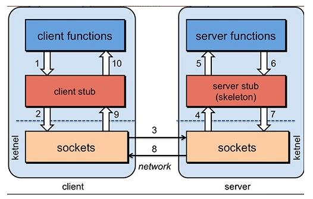

1. 服务消费端（client）以本地调用的方式调用远程服务；
2. 客户端 Stub（client stub） 接收到调用后负责将方法、参数等组装成能够进行网络传输的消息体（序列化）：`RpcRequest`；
3. 客户端 Stub（client stub） 找到远程服务的地址，并将消息发送到服务提供端；
4. 服务端 Stub（桩）收到消息将消息反序列化为Java对象: `RpcRequest`；
5. 服务端 Stub（桩）根据`RpcRequest`中的类、方法、方法参数等信息调用本地的方法；
6. 服务端 Stub（桩）得到方法执行结果并将组装成能够进行网络传输的消息体：`RpcResponse`（序列化）发送至消费方；
7. 客户端 Stub（client stub）接收到消息并将消息反序列化为Java对象:`RpcResponse` ，这样也就得到了最终结果。over!


## 常见的RPC框架总结

- **RMI（JDK自带）：** JDK自带的RPC，有很多局限性，不推荐使用。
- **Dubbo:** Dubbo是 阿里巴巴公司开源的一个高性能优秀的服务框架，使得应用可通过高性能的 RPC 实现服务的输出和输入功能，可以和 Spring框架无缝集成。目前 Dubbo 已经成为 Spring Cloud Alibaba 中的官方组件。
- **gRPC** ：gRPC是可以在任何环境中运行的现代开源高性能RPC框架。它可以通过可插拔的支持来有效地连接数据中心内和跨数据中心的服务，以实现负载平衡，跟踪，运行状况检查和身份验证。它也适用于分布式计算的最后一英里，以将设备，移动应用程序和浏览器连接到后端服务。
- **Hessian：** Hessian是一个轻量级的remoting on http工具，使用简单的方法提供了RMI的功能。 相比WebService，Hessian更简单、快捷。采用的是二进制RPC协议，因为采用的是二进制协议，所以它很适合于发送二进制数据。
- **Thrift：** Apache Thrift是Facebook开源的跨语言的RPC通信框架，目前已经捐献给Apache基金会管理，由于其跨语言特性和出色的性能，在很多互联网公司得到应用，有能力的公司甚至会基于thrift研发一套分布式服务框架，增加诸如服务注册、服务发现等功能


## 既有 HTTP ,为啥用 RPC 进行服务调用

### RPC只是一种设计

RPC 只是一种概念、一种设计，就是为了解决 **不同服务之间的调用问题**, 它一般会包含有 **传输协议** 和 **序列化协议** 这两个。

但是，HTTP 是一种协议，RPC框架可以使用 HTTP协议作为传输协议或者直接使用TCP作为传输协议，使用不同的协议一般也是为了适应不同的场景


### RPC框架功能更齐全

成熟的 RPC框架还提供“服务自动注册与发现”、"智能负载均衡"、“可视化的服务治理和运维”、“运行期流量调度”等等功能，这些也算是选择 RPC 进行服务注册和发现的一方面原因吧！


# 分布式系统

## 什么是分布式

分布式就是将整个系统拆分成不同的服务，然后放在不同的服务器上，减轻单体服务的压力，提高并发量和性能。比如电商系统拆分成订单系统、商品系统、登录系统等


## 为什么要分布式

提高开发效率，代码便于维护和扩展：从开发角度来看，单体应用的代码集中在一起，而分布式系统的代码根据业务被拆分。所以每个团队可以负责一个服务的开发。

提高整个系统的性能


## 架构演进

单体架构、垂直架构、分布式架构、微服务架构


单体架构

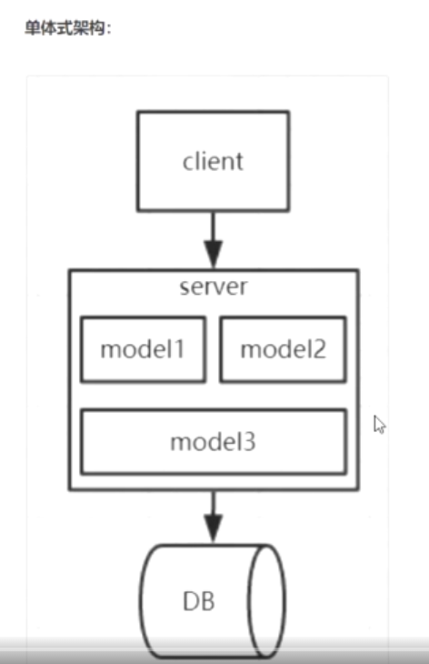

垂直架构

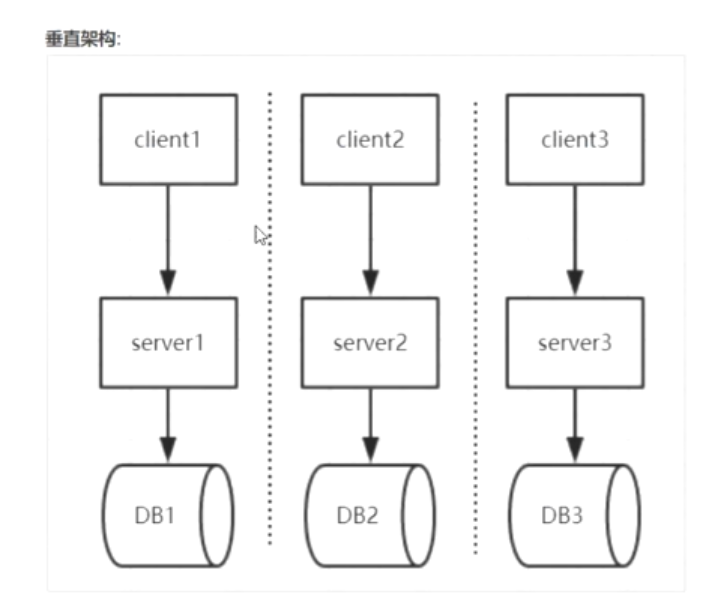

分布式架构

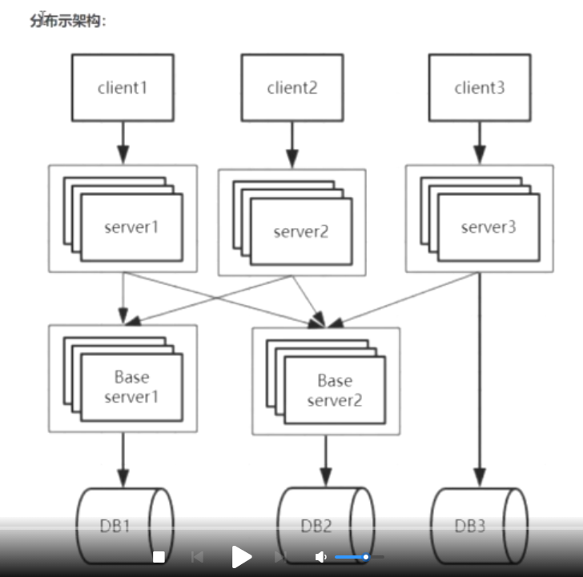

分布式架构带来的成本：

分布式事务：一个业务操作，会分成若干个子操作在多个服务器上执行

不允许服务有状态：处理一次请求所需的全部信息，要么包含在请求中，要么包含在数据库，服务器本身不存储任何信息

服务依赖关系复杂 

部署运维成本

如何保证系统的伸缩性

分布式会话

分布式任务 


## 分布式架构如何选型

核心功能：RPC远程调用技术

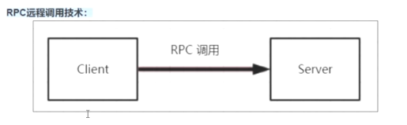

常用的远程调用的方式：RMI、Web Service、Http

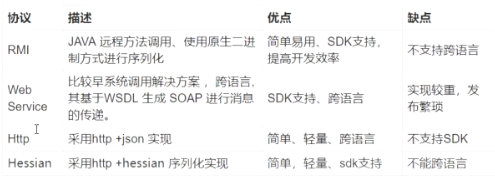


RMI架构：简单；但是没有负载均衡，不能跨语言；适用于简单的远程通信


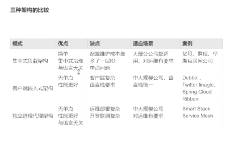

# Dubbo

## 简介

Dubbo 是一款微服务开发框架，它提供了 **RPC通信** 与 **微服务治理** 两大关键能力。使用 Dubbo 开发的微服务，将具备相互之间的**远程发现与通信能力**， 同时利用 Dubbo 提供的丰富服务治理能力，可以实现诸如**服务发现、负载均衡、流量调度**等服务治理诉求。同时 Dubbo 是**高度可扩展**的，用户几乎可以在任意功能点去定制自己的实现，以改变框架的默认行为来满足自己的业务需求。


## 为什么用Dubbo

单一应用架构、垂直应用架构无法满足当前需求；

分布式架构的诞生，系统被拆分成不同的服务，每个服务独立提供系统的某个核心服务；

简单的RMI框架无法满足需求，如负载均衡、服务监控等；

Dubbo解决的问题：负载均衡、服务调用链路生成、服务访问压力以及时长统计、资源调度和治理


## Dubbo整体设计

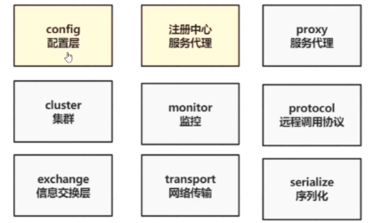


- **config 配置层**：Dubbo相关的配置。支持代码配置，同时也支持基于 Spring 来做配置，以 `ServiceConfig`, `ReferenceConfig` 为中心
- **proxy 服务代理层**：调用远程方法像调用本地的方法一样简单的一个关键，真实调用过程依赖代理类，以 `ServiceProxy` 为中心。
- **registry 注册中心层**：封装服务地址的注册与发现。
- **cluster 路由层**：封装多个提供者的路由及负载均衡，并桥接注册中心，以 `Invoker` 为中心。
- **monitor 监控层**：RPC 调用次数和调用时间监控，以 `Statistics` 为中心。
- **protocol 远程调用层**：封装 RPC 调用，以 `Invocation`, `Result` 为中心。
- **exchange 信息交换层**：封装请求响应模式，同步转异步，以 `Request`, `Response` 为中心。
- **transport 网络传输层**：抽象 mina 和 netty 为统一接口，以 `Message` 为中心。
- **serialize 数据序列化层** ：对需要在网络传输的数据进行序列化。


## 架构

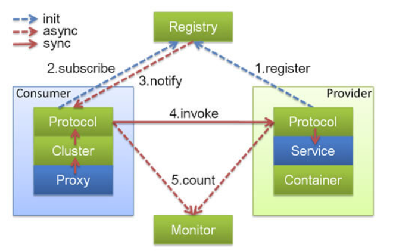

- **Container：** 服务运行容器，负责加载、运行服务提供者。必须。
- **Provider：** 暴露服务的服务提供方，会向注册中心注册自己提供的服务。必须。
- **Consumer：** 调用远程服务的服务消费方，会向注册中心订阅自己所需的服务。必须。
- **Registry：** 服务注册与发现的注册中心。注册中心会返回服务提供者地址列表给消费者。非必须。
- **Monitor：** 统计服务的调用次数和调用时间的监控中心。服务消费者和提供者会定时发送统计数据到监控中心。 非必须。


## Dubbo中的Invoker

Invoker就是Dubbo对远程调用的抽象，分为服务提供Invoker、服务消费Invoker；Invoker实现了远程调用的细节

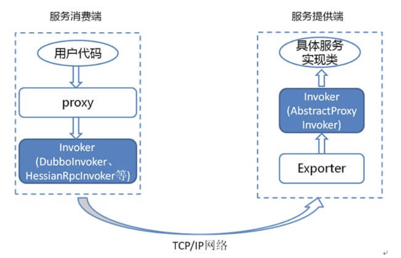


## Dubbo的SPI（Service Provider Interface）机制

SPI：以帮助我们动态寻找服务/功能（比如负载均衡策略）的实现；

其原理是：将接口的实现类放在配置文件中，我们在程序运行过程中读取配置文件，通过反射加载实现类。这样，我们可以在运行的时候，动态替换接口的实现类。和 IoC 的解耦思想是类似的。


java的spi机制：当服务的提供者提供了服务接口的一种实现后，在jar包的META-INF/services/目录中创建一个以服务接口命名的文件。该文件里存放的就是实现该接口服务的具体实现类。当外部程序装配这个模块时，就能通过该jar包META-INF/services/里的配置文件找到具体的实现类名，并装载实例化，完成模块注入。

jdk提供服务实现查找的工具类：java.util.ServiceLoader


dubbo的spi机制：在java自带的SPI基础上加入了扩展点功能，即每个实现类都会对应一个扩展点名称，目的是应用可基于此名称进行响应的装配


## Dubbo的微内核架构

Dubbo 采用 微内核（Microkernel） + 插件（Plugin） 模式，简单来说就是微内核架构。微内核只负责组装插件

微内核架构包含两类组件：**核心系统（core system）** 和 **插件模块（plug-in modules）**，核心系统提供系统所需核心能力，插件模块可以扩展系统的功能。因此， 基于微内核架构的系统，非常易于扩展功能。

Dubbo基于微内核架构，才使得我们可以随心所欲替换Dubbo的功能点


## 关于Dubbo架构的一些自测小问题

####  注册中心的作用了解么？

注册中心负责服务地址的注册与查找，相当于目录服务，服务提供者和消费者只在启动时与注册中心交互。

#### [#](https://javaguide.cn/distributed-system/rpc/dubbo.html#服务提供者宕机后-注册中心会做什么)服务提供者宕机后，注册中心会做什么？

注册中心会立即推送事件通知消费者。

#### [#](https://javaguide.cn/distributed-system/rpc/dubbo.html#监控中心的作用呢)监控中心的作用呢？

监控中心负责统计各服务调用次数，调用时间等。

#### [#](https://javaguide.cn/distributed-system/rpc/dubbo.html#注册中心和监控中心都宕机的话-服务都会挂掉吗)注册中心和监控中心都宕机的话，服务都会挂掉吗？

不会。两者都宕机也不影响已运行的提供者和消费者，消费者在本地缓存了提供者列表。注册中心和监控中心都是可选的，服务消费者可以直连服务提供者。


## Dubbo的负载均衡策略

负载均衡的目的在于改善多个计算资源的工作负载分布，优化资源使用，最大化吞吐量，最小化响应时间，并避免单个资源的过载

策略：随机选择、最小活跃数、一致性哈希、加权轮询。

在集群负载均衡时，Dubbo 提供了多种均衡策略，默认为 `random` 随机调用。我们还可以自行扩展负载均衡策略（参考Dubbo SPI机制）。

在 Dubbo 中，所有负载均衡实现类均继承自 `AbstractLoadBalance`，该类实现了 `LoadBalance` 接口，并封装了一些公共的逻辑。


官方文档对负载均衡这部分的介绍非常详细，地址：https://dubbo.apache.org/zh/docs/v2.7/dev/source/loadbalance/#m-zhdocsv27devsourceloadbalance


### RandomLoadBalance

根据权重随机选择（对加权随机算法的实现）。这是Dubbo默认采用的一种负载均衡策略

`RandomLoadBalance` 具体的实现原理非常简单，假如有两个提供相同服务的服务器 S1,S2，S1的权重为7，S2的权重为3。

我们把这些权重值分布在坐标区间会得到：S1->[0, 7) ，S2->[7, 10)。我们生成[0, 10) 之间的随机数，随机数落到对应的区间，我们就选择对应的服务器来处理请求

```java
public class RandomLoadBalance extends AbstractLoadBalance {

    public static final String NAME = "random";

    @Override
    protected <T> Invoker<T> doSelect(List<Invoker<T>> invokers, URL url, Invocation invocation) {

        int length = invokers.size();
        boolean sameWeight = true;
        int[] weights = new int[length]; 
        int totalWeight = 0;
        // 下面这个for循环的主要作用就是计算所有该服务的提供者的权重之和 totalWeight（），
        // 除此之外，还会检测每个服务提供者的权重是否相同
        for (int i = 0; i < length; i++) {
            int weight = getWeight(invokers.get(i), invocation);
            totalWeight += weight;
            weights[i] = totalWeight;
            if (sameWeight && totalWeight != weight * (i + 1)) {
                sameWeight = false;
            }
        }
        if (totalWeight > 0 && !sameWeight) {
            // 随机生成一个 [0, totalWeight) 区间内的数字
            int offset = ThreadLocalRandom.current().nextInt(totalWeight);
            // 判断会落在哪个服务提供者的区间
            for (int i = 0; i < length; i++) {
                if (offset < weights[i]) {
                    return invokers.get(i);
                }
            }
  
        return invokers.get(ThreadLocalRandom.current().nextInt(length));
    }

}
```


### LeastActiveLoadBalance

`LeastActiveLoadBalance` 直译过来就是**最小活跃数负载均衡**。

初始状态下所有服务提供者的活跃数均为 0（每个服务提供者的中特定方法都对应一个活跃数），每收到一个请求后，对应的服务提供者的活跃数 +1，当这个请求处理完之后，活跃数 -1。

因此，**Dubbo 就认为谁的活跃数越少，谁的处理速度就越快，性能也越好，这样的话，优先把请求给活跃数少的服务提供者处理。**

**如果有多个服务提供者的活跃数相等怎么办？**走一遍 `RandomLoadBalance` 。

```java
public class LeastActiveLoadBalance extends AbstractLoadBalance {

    public static final String NAME = "leastactive";

    @Override
    protected <T> Invoker<T> doSelect(List<Invoker<T>> invokers, URL url, Invocation invocation) {
        int length = invokers.size();
        int leastActive = -1;
        int leastCount = 0;
        int[] leastIndexes = new int[length];
        int[] weights = new int[length];
        int totalWeight = 0;
        int firstWeight = 0;
        boolean sameWeight = true;
        // 这个 for 循环的主要作用是遍历 invokers 列表，找出活跃数最小的 Invoker
        // 如果有多个 Invoker 具有相同的最小活跃数，还会记录下这些 Invoker 在 invokers 集合中的下标，并累加它们的权重，比较它们的权重值是否相等
        for (int i = 0; i < length; i++) {
            Invoker<T> invoker = invokers.get(i);
            // 获取 invoker 对应的活跃(active)数
            int active = RpcStatus.getStatus(invoker.getUrl(), invocation.getMethodName()).getActive();
            int afterWarmup = getWeight(invoker, invocation);
            weights[i] = afterWarmup;
            if (leastActive == -1 || active < leastActive) {
                leastActive = active;
                leastCount = 1;
                leastIndexes[0] = i;
                totalWeight = afterWarmup;
                firstWeight = afterWarmup;
                sameWeight = true;
            } else if (active == leastActive) {
                leastIndexes[leastCount++] = i;
                totalWeight += afterWarmup;
                if (sameWeight && afterWarmup != firstWeight) {
                    sameWeight = false;
                }
            }
        }
       // 如果只有一个 Invoker 具有最小的活跃数，此时直接返回该 Invoker 即可
        if (leastCount == 1) {
            return invokers.get(leastIndexes[0]);
        }
        // 如果有多个 Invoker 具有相同的最小活跃数，但它们之间的权重不同
        // 这里的处理方式就和  RandomLoadBalance 一致了
        if (!sameWeight && totalWeight > 0) {
            int offsetWeight = ThreadLocalRandom.current().nextInt(totalWeight);
            for (int i = 0; i < leastCount; i++) {
                int leastIndex = leastIndexes[i];
                offsetWeight -= weights[leastIndex];
                if (offsetWeight < 0) {
                    return invokers.get(leastIndex);
                }
            }
        }
        return invokers.get(leastIndexes[ThreadLocalRandom.current().nextInt(leastCount)]);
    }
}

//活跃数是通过 RpcStatus 中的一个 ConcurrentMap 保存的，根据 URL 以及服务提供者被调用的方法的名称，我们便可以获取到对应的活跃数。也就是说服务提供者中的每一个方法的活跃数都是互相独立的

public class RpcStatus {
    
    private static final ConcurrentMap<String, ConcurrentMap<String, RpcStatus>> METHOD_STATISTICS =
            new ConcurrentHashMap<String, ConcurrentMap<String, RpcStatus>>();

   public static RpcStatus getStatus(URL url, String methodName) {
        String uri = url.toIdentityString();
        ConcurrentMap<String, RpcStatus> map = METHOD_STATISTICS.computeIfAbsent(uri, k -> new ConcurrentHashMap<>());
        return map.computeIfAbsent(methodName, k -> new RpcStatus());
    }
    public int getActive() {
        return active.get();
    }

}


```


### ConsistentHashLoadBalance

`ConsistentHashLoadBalance` 即**一致性Hash负载均衡策略**。 `ConsistentHashLoadBalance` 中没有权重的概念，具体是哪个服务提供者处理请求是由你的请求的参数决定的，也就是说相同参数的请求总是发到同一个服务提供者。

具体实现：通过hash算法，把生产者节点的invoke和随机节点生成hash，并将这个 hash 投射到 [0, 2^32 - 1] 的圆环上，查询的时候根据key进行md5然后进行hash，得到第一个节点的值大于等于当前hash的invoker。	

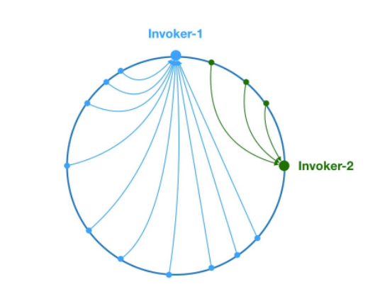

另外，Dubbo 为了避免数据倾斜问题（节点不够分散，大量请求落到同一节点），还引入了虚拟节点的概念。通过虚拟节点可以让节点更加分散，有效均衡各个节点的请求量

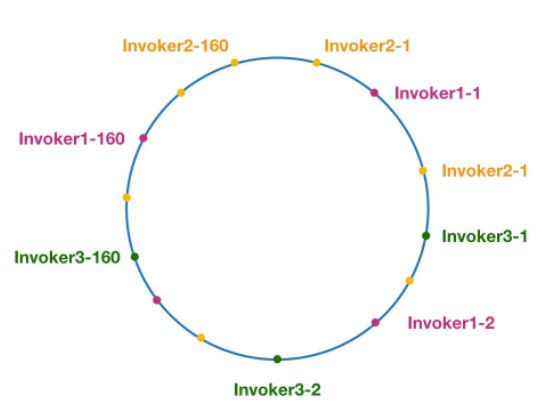

官方有详细的源码分析：[https://dubbo.apache.org/zh/docs/v2.7/dev/source/loadbalance/#23-consistenthashloadbalanceopen in new window](https://dubbo.apache.org/zh/docs/v2.7/dev/source/loadbalance/#23-consistenthashloadbalance) 


### RoundRobinLoadBalance

加权轮询负载均衡。

轮询就是把请求依次分配给每个服务提供者。加权轮询就是在轮询的基础上，让更多的请求落到权重更大的服务提供者上。比如假如有两个提供相同服务的服务器 S1,S2，S1的权重为7，S2的权重为3。

如果我们有 10 次请求，那么 7 次会被 S1处理，3次被 S2处理。

但是，如果是 `RandomLoadBalance` 的话，很可能存在10次请求有9次都被 S1 处理的情况（概率性问题）。

Dubbo 中的 `RoundRobinLoadBalance` 的代码实现被修改重建了好几次，Dubbo-2.6.5 版本的 `RoundRobinLoadBalance` 为平滑加权轮询算法


## Dubbo序列化协议

Dubbo 支持多种序列化方式：JDK自带的序列化、hessian2、JSON、Kryo、FST、Protostuff，ProtoBuf等等。

Dubbo 默认使用的序列化方式是 hession2


一般我们不会直接使用 JDK 自带的序列化方式。主要原因有两个：

1. **不支持跨语言调用** : 如果调用的是其他语言开发的服务的时候就不支持了。
2. **性能差** ：相比于其他序列化框架性能更低，主要原因是序列化之后的字节数组体积较大，导致传输成本加大。

JSON 序列化由于性能问题，我们一般也不会考虑使用。

像 Protostuff，ProtoBuf、hessian2这些都是跨语言的序列化方式，如果有跨语言需求的话可以考虑使用。

Kryo和FST这两种序列化方式是 Dubbo 后来才引入的，性能非常好。不过，这两者都是专门针对 Java 语言的。Dubbo 官网的一篇文章中提到说推荐使用 Kryo 作为生产环境的序列化方式。(文章地址：[https://dubbo.apache.org/zh/docs/v2.7/user/references/protocol/rest/open in new window](https://dubbo.apache.org/zh/docs/v2.7/user/references/protocol/rest/))


Dubbo 官方文档中还有一个关于这些[序列化协议的性能对比图](https://dubbo.apache.org/zh/docs/v2.7/user/serialization/#m-zhdocsv27userserialization)

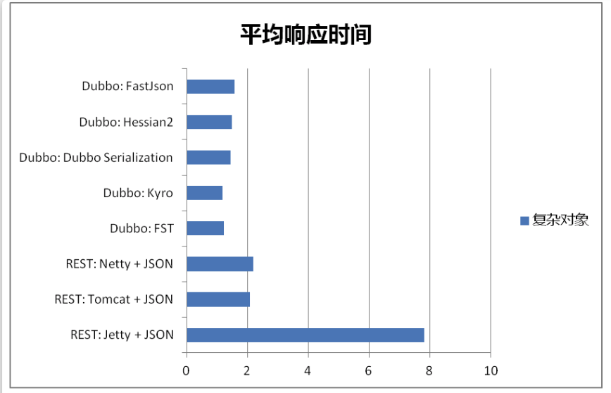

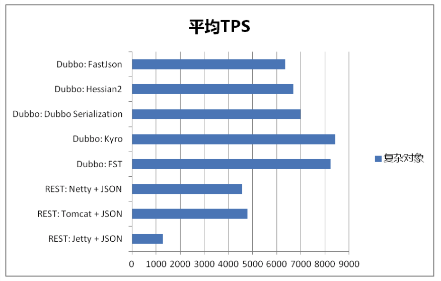

# 快速开始

服务是 Dubbo 中的核心概念，一个服务代表一组 RPC 方法的集合，服务是面向用户编程、服务发现机制等的基本单位。

Dubbo 开发的基本流程是：用户定义 RPC 服务，通过约定的配置 方式将 RPC 声明为 Dubbo 服务，然后就可以基于服务 API 进行编程了。

对服务提供者来说是提供 RPC 服务的具体实现，而对服务消费者来说则是使用特定数据发起服务调用。

## 定义服务


## 编译服务


## 配置并加载服务


# 概念&架构

## 服务发现

服务发现，即消费端自动发现服务地址列表的能力，是微服务框架需要具备的关键能力。

实现服务发现的方式有很多种，Dubbo 提供的是一种 Client-Based 的服务发现机制，通常还需要部署额外的第三方注册中心组件来协调服务发现过程，如常用的 Nacos、Consul、Zookeeper 等，Dubbo 自身也提供了对多种注册中心组件的对接，用户可以灵活选择。


Dubbo 基于消费端的自动服务发现能力，其基本工作原理如下图：

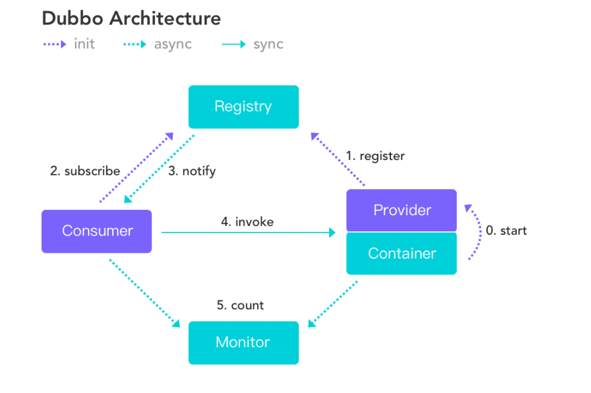

服务发现的一个核心组件是注册中心，Provider 注册地址到注册中心，Consumer 从注册中心读取和订阅 Provider 地址列表。 因此，要启用服务发现，需要为 Dubbo 增加注册中心配置：

以 dubbo-spring-boot-starter 使用方式为例，增加 registry 配置

````yaml
# application.properties
dubbo
 registry
  address: zookeeper://127.0.0.1:2181
````


就使用方式上而言，Dubbo3 与 Dubbo2 的服务发现配置是完全一致的，不需要改动什么内容。但就实现原理上而言，Dubbo3 引入了全新的服务发现模型 - 应用级服务发现， 在工作原理、数据格式上已完全不能兼容老版本服务发现。

- Dubbo3 应用级服务发现，以应用粒度组织地址数据
- Dubbo2 接口级服务发现，以接口粒度组织地址数据


Dubbo3服务发现模型更适合构建可伸缩的服务体系。地址发现容量与业务RPC定义解耦。例子：假设一个微服务应用定义了 100 个接口（Dubbo 中的服务）， 则需要往注册中心中注册 100 个服务，如果这个应用被部署在了 100 台机器上，那这 100 个服务总共会产生 100 * 100 = 10000 个虚拟节点；而同样的应用， 对于 Dubbo3 来说，新的注册发现模型只需要 1 个服务（只和应用有关和接口无关）， 只注册和机器实例数相等的 1 * 100 = 100 个虚拟节点到注册中心。 在这个简单的示例中，Dubbo 所注册的地址数量下降到了原来的 1 / 100，对于注册中心、订阅方的存储压力都是一个极大的释放。


## RPC通信协议

Dubbo3 提供了 Triple(Dubbo3)、Dubbo2 协议，这是 Dubbo 框架的原生协议。除此之外，Dubbo3 也对众多第三方协议进行了集成，并将它们纳入 Dubbo 的编程与服务治理体系， 包括 gRPC、Thrift、JsonRPC、Hessian2、REST 等。以下重点介绍 Triple 与 Dubbo2 协议。

### Triple 

#### RPC协议的选择

通用性、扩展性、性能、穿透性


##### HTTP/1.1

优点：满足通用性和扩展性

缺点：每次只响应一个请求，队头阻塞；头部传输格式未经压缩、明文传输，但性能差；无直接server push支持

##### gRPC

gRPC 的优势由HTTP2 和 Protobuf 继承而来

缺点：

- 对服务治理的支持比较基础，更偏向于基础的 RPC 功能，协议层缺少必要的统一定义，对于用户而言直接用起来并不容易。
- 强绑定 protobuf 的序列化方式，需要较高的学习成本和改造成本，对于现有的偏单语言的用户而言，迁移成本不可忽视


##### 最终选择Triple

兼容 gRPC ，以 HTTP2 作为传输层构建新的协议，也就是 Triple

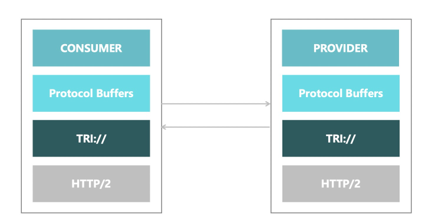

- 性能上: Triple 协议采取了 metadata 和 payload 分离的策略，这样就可以避免中间设备，如网关进行 payload 的解析和反序列化，从而降低响应时间。
- 路由支持上，由于 metadata 支持用户添加自定义 header ，用户可以根据 header 更方便的划分集群或者进行路由，这样发布的时候切流灰度或容灾都有了更高的灵活性。
- 安全性上，支持双向TLS认证（mTLS）等加密传输能力。
- 易用性上，Triple 除了支持原生 gRPC 所推荐的 Protobuf 序列化外，使用通用的方式支持了 Hessian / JSON 等其他序列化，能让用户更方便的升级到 Triple 协议。对原有的 Dubbo 服务而言，修改或增加 Triple 协议 只需要在声明服务的代码块添加一行协议配置即可，改造成本几乎为 0。


优势：

1、具备跨语言互通的能力，传统的多语言多 SDK 模式和 Mesh 化跨语言模式都需要一种更通用易扩展的数据传输格式。

2、提供更完善的请求模型，除了 Request/Response 模型，还应该支持 Streaming 和 Bidirectional。

3、易扩展、穿透性高，包括但不限于 Tracing / Monitoring 等支持，也应该能被各层设备识别，网关设施等可以识别数据报文，对 Service Mesh 部署友好，降低用户理解难度。

4、多种序列化方式支持、平滑升级

5、支持 Java 用户无感知升级，不需要定义繁琐的 IDL 文件，仅需要简单的修改协议名便可以轻松升级到 Triple 协议


## 服务流量管理

通过 Dubbo 定义的路由规则，实现对流量分布的控制；本质是将请求根据制定好的路由规则分发到应用服务上，如下图所示：

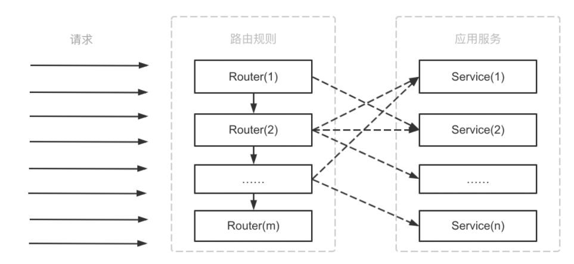


## 配置管理——描述 Dubbo 支持的配置，Dubbo 的动态配置能力

Dubbo配置主要分为几大类： 启动阶段配置项、服务治理规则、动态配置项

### 启动阶段配置项


#### 配置方式

按照编程方式可以分为四种方式：API配置、XML配置、Annotation配置、属性配置


#### 属性配置

根据Key-value属性生成配置组件，类似SpringBoot的ConfigurationProperties


### 服务治理规则

服务治理规则主要作用是改变运行时服务的行为和选址逻辑，达到限流，权重配置等目的，包括覆盖规则、标签路由、条件路由

Dubbo启动后监听服务治理相关的配置项，当配置发生变化时，会自动进行相应的处理


### 动态配置项

动态配置项一般用于控制动态开关

Dubbo启动后监听动态配置项，当配置发生变化时，会自动进行相应的处理


## 部署架构

注册中心 配置中心 元数据中心

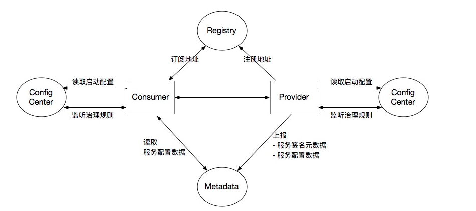

