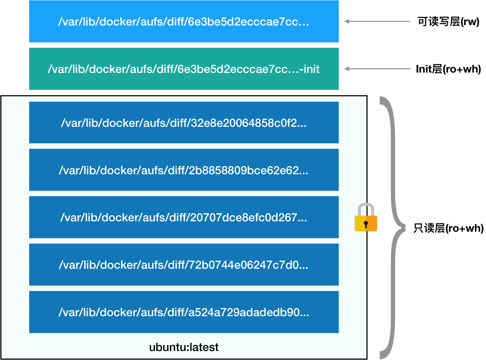
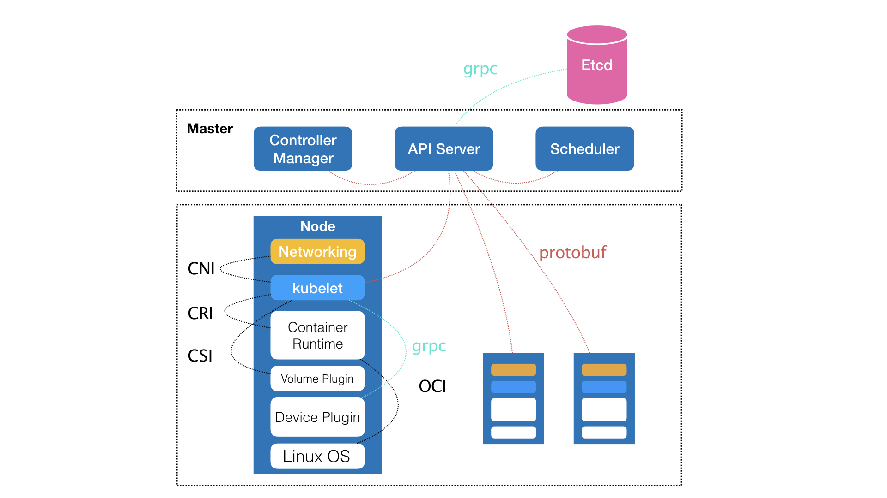

# Kubernetes


## 一 容器技术入门

## （一）从进程开始


容器

- 其实是一种沙盒技术，把应用“装”起来的技术
- 应用与应用之间因为有了边界互不干扰


进程

- 进程就是，一个程序运行起来后的计算机执行环境的综合
- 程序被执行的过程：从磁盘上的二进制文件，变成了内存中的数据、寄存器里的值、堆栈中的命令、被打开文件，以及各种设备的状态信息


容器的核心功能：通过约束和修改进程的动态表现，从而为其创造出一个“边界”


容器实现原理

- Cgroups 技术是用来制造约束的主要手段
- Namespace 技术则是用来修改进程视图


使用Docker创建一个容器,运行ps命令，发现/bin/sh的PID为1，说明容器已经被隔离了

```bash

$ docker run -it busybox /bin/sh
/ #


/ # ps
PID  USER   TIME COMMAND
  1 root   0:00 /bin/sh
  10 root   0:00 ps
```

这种技术就是Linux里面的Namespace机制；它其实只是 Linux 创建新进程的一个可选参数

```c

int pid = clone(main_function, stack_size, SIGCHLD, NULL); 

//新创建的这个进程将会“看到”一个全新的进程空间，在这个进程空间里，它的 PID 是 1
int pid = clone(main_function, stack_size, CLONE_NEWPID | SIGCHLD, NULL); 
```

除了我们刚刚用到的 PID Namespace，Linux 操作系统还提供了 Mount、UTS、IPC、Network 和 User 这些 Namespace，用来对各种不同的进程上下文进行“障眼法”操作


所以，容器就是一种特殊的进程，是操作系统在启动进程时通过设置一些参数实现了隔离不相关资源后的一个特殊进程


## （二）隔离与限制

隔离技术：

- 虚拟机通过虚拟硬盘资源来实现隔离
- Docker容器通过Linux的Namespace机制实现隔离


虚拟机隔离技术的优缺点：

- 优点：隔离彻底
  - 硬件虚拟化技术和独立 Guest OS 的虚拟机，多个容器之间使用的内核不一样，因此Microsoft 的云计算平台 Azure，实际上就是运行在 Windows 服务器集群上的，但这并不妨碍你在它上面创建各种 Linux 虚拟机出来
- 缺点：由Hypervisor创建虚拟机，且必须在宿主机上运行一个完整的客户机OS才能执行用户进程，这就不可避免的带来资源消耗和占用；其次，用户应用对宿主机OS的调用需要经过虚拟化软件的拦截和处理，这又是一层性能损耗，尤其对计算资源、网络和磁盘IO


Docker容器的优缺点：

- 优点：容器化后的用户应用依然是宿主机上的普通进程，不存在虚拟机隔离技术的性能损耗；也不需要单独的客户机OS
- 缺点：隔离不彻底
  - 隔离不彻底
    - 多个容器之间使用的就还是同一个宿主机的操作系统内核如果在Windows宿主机上运行Linux容器，或在低版本的Linux宿主机运行高版本的Linux容器，是行不通的
  - 在Linux内核中，很多资源和对象不能被Namespace化，如时间。如果容器中的程序调用系统调用修改时间，整个宿主机的时间会被修改


限制技术：Linux Cgroups 就是 Linux 内核中用来为进程设置资源限制的一个重要功能。（namespace解决**可见性**问题，cgroup解决**资源隔离**问题）

- Linux Cgroups 的全称是 Linux Control Group。它最主要的作用，就是限制一个进程组能够使用的资源上限，包括 CPU、内存、磁盘、网络带宽等等。

- 在 Linux 中，Cgroups 给用户暴露出来的操作接口是文件系统，即它以文件和目录的方式组织在操作系统的 /sys/fs/cgroup 路径下。在/sys/fs/cgroup下有很多子目录，也叫子系统，这些都是当前及其可以被限制的资源种类。子系统对应的资源种类下，可以看到该类资源可以被限制的方法

  ```bash
  [root@iZwz9ah0xf439lmj2tkjm6Z ~]# mount -t cgroup
  cgroup on /sys/fs/cgroup/systemd type cgroup (rw,nosuid,nodev,noexec,relatime,xattr,release_agent=/usr/lib/systemd/systemd-cgroups-agent,name=systemd)
  cgroup on /sys/fs/cgroup/blkio type cgroup (rw,nosuid,nodev,noexec,relatime,blkio)
  cgroup on /sys/fs/cgroup/cpu,cpuacct type cgroup (rw,nosuid,nodev,noexec,relatime,cpu,cpuacct)
  cgroup on /sys/fs/cgroup/hugetlb type cgroup (rw,nosuid,nodev,noexec,relatime,hugetlb)
  cgroup on /sys/fs/cgroup/cpuset type cgroup (rw,nosuid,nodev,noexec,relatime,cpuset)
  cgroup on /sys/fs/cgroup/memory type cgroup (rw,nosuid,nodev,noexec,relatime,memory)
  cgroup on /sys/fs/cgroup/pids type cgroup (rw,nosuid,nodev,noexec,relatime,pids)
  cgroup on /sys/fs/cgroup/perf_event type cgroup (rw,nosuid,nodev,noexec,relatime,perf_event)
  cgroup on /sys/fs/cgroup/rdma type cgroup (rw,nosuid,nodev,noexec,relatime,rdma)
  cgroup on /sys/fs/cgroup/freezer type cgroup (rw,nosuid,nodev,noexec,relatime,freezer)
  cgroup on /sys/fs/cgroup/net_cls,net_prio type cgroup (rw,nosuid,nodev,noexec,relatime,net_cls,net_prio)
  cgroup on /sys/fs/cgroup/devices type cgroup (rw,nosuid,nodev,noexec,relatime,devices)
  
  ---------------------------------------------------------
  [root@iZwz9ah0xf439lmj2tkjm6Z ~]# ls /sys/fs/cgroup/cpu
  aegis                  cgroup.procs          cpuacct.usage         cpuacct.usage_percpu_sys   cpuacct.usage_user  cpu.rt_period_us   cpu.stat           tasks
  assist                 cgroup.sane_behavior  cpuacct.usage_all     cpuacct.usage_percpu_user  cpu.cfs_period_us   cpu.rt_runtime_us  notify_on_release
  cgroup.clone_children  cpuacct.stat          cpuacct.usage_percpu  cpuacct.usage_sys          cpu.cfs_quota_us    cpu.shares         release_agent
  
  ```

- 配置文件的使用

  - 在对应子系统下创建一个目录，这个目录称为“控制组”，操作系统会在你新创建的 container 目录下，自动生成该子系统对应的资源限制文件。

  - 可以通过修改这些文件的内容来设置限制，比如，向 container 组里的 cfs_quota 文件写入 20 ms（20000 us），接下来，我们把被限制的进程的 PID 写入 container 组里的 tasks 文件，上面的设置就会对该进程生效

  - ```bash
    
    root@ubuntu:/sys/fs/cgroup/cpu$ mkdir container
    root@ubuntu:/sys/fs/cgroup/cpu$ ls container/
    cgroup.clone_children cpu.cfs_period_us cpu.rt_period_us  cpu.shares notify_on_release
    cgroup.procs      cpu.cfs_quota_us  cpu.rt_runtime_us cpu.stat  tasks
    
    --------------------------------------------
    
    $ echo 20000 > /sys/fs/cgroup/cpu/container/cpu.cfs_quota_us
    -------------------------------------------
    
    $ echo 226 > /sys/fs/cgroup/cpu/container/tasks 
    ```

- Linux Cgroups 的设计还是比较易用的，简单粗暴地理解呢，它就是**一个子系统目录加上一组资源限制文件的组合**,而对于 Docker 等 Linux 容器项目来说，它们只需要在每个子系统下面，为每个容器创建一个控制组（即创建一个新目录），然后在启动容器进程之后，把这个进程的 PID 填写到对应控制组的 tasks 文件中就可以了。

- Cgroups的不足在于/proc文件系统，Linux 下的 /proc 目录存储的是记录当前内核运行状态的一系列特殊文件，用户可以通过访问这些文件，查看系统以及当前正在运行的进程的信息，比如 CPU 使用情况、内存占用率等，这些文件也是 top 指令查看系统信息的主要数据来源。如果在容器里执行 top 指令，就会发现，它显示的信息居然是宿主机的 CPU 和内存数据，而不是当前容器的数据。


一个正在运行的 Docker 容器，其实就是一个启用了多个 Linux Namespace 的应用进程，而这个进程能够使用的资源量，则受 Cgroups 配置的限制。这也是容器技术中一个非常重要的概念，即：容器是一个“单进程”模型。

由于一个容器的本质就是一个进程，用户的应用进程实际上就是容器里 PID=1 的进程，也是其他后续创建的所有进程的父进程。这就意味着，在一个容器中，你没办法同时运行两个不同的应用，除非你能事先找到一个公共的 PID=1 的程序来充当两个不同应用的父进程，这也是为什么很多人都会用 systemd 或者 supervisord 这样的软件来代替应用本身作为容器的启动进程。


## （三）理解容器镜像

### 容器镜像

容器镜像就是一个挂载在容器根目录是上，用来为容器进程提供隔离后执行环境的文件系统，它还有一个更专业的名字，叫rootfs（根文件系统）

一个最常见的rootfs，或容器镜像会包括如下一些目录和文件

```bash

$ ls /
bin dev etc home lib lib64 mnt opt proc root run sbin sys tmp usr var
```

对 Docker 项目来说，它最核心的原理实际上就是为待创建的用户进程：

1. 启用 Linux Namespace 配置；
2. 设置指定的 Cgroups 参数；
3. 切换进程的根目录（Change Root）。

rootfs 只是一个操作系统所包含的文件、配置和目录，并不包括操作系统内核。同一台机器上的所有容器，都共享宿主机操作系统的内核。


### 层与联合文件系统

Docker 在镜像的设计中，引入了层（layer）的概念。也就是说，用户制作镜像的每一步操作，都会生成一个层，也就是一个增量 rootfs。

引入了层的概念用到了一种叫做联合文件系统的能力，其主要功能是将多个不同位置的目录联合挂载到同一个目录下。比如，现在有两个目录 A 和 B，它们分别有两个文件，然后，使用联合挂载的方式，将这两个目录挂载到一个公共的目录 C 上，这时，再查看目录 C 的内容，就能看到目录 A 和 B 下的文件被合并到了一起

```bash

$ tree
.
├── A
│  ├── a
│  └── x
└── B
  ├── b
  └── x
  
  
$ mkdir C
$ mount -t aufs -o dirs=./A:./B none ./C


$ tree ./C
./C
├── a
├── b
└── x
  
```


AuFS是对Linux原生UnionFS的重写和改进，它最关键的目录在

```bash

/var/lib/docker/aufs/diff/<layer_id>
```


容器的rootfs结构如图



第一部分，只读层。这些层，都以增量的方式分别包含了 Ubuntu 操作系统的一部分。

第二层，可读写层。它是这个容器的 rootfs 最上面的一层（6e3be5d2ecccae7cc），它的挂载方式为：rw，即 read write。在没有写入文件之前，这个目录是空的。而一旦在容器里做了写操作，你修改产生的内容就会以**增量**的方式出现在这个层中

第三层，init层。Init 层是 Docker 项目单独生成的一个内部层，专门用来存放 /etc/hosts、/etc/resolv.conf 等信息。由于对这些信息指对当前容器有效，不希望执行docker commit的时候，把这些信息提交掉，因此docker的做法是以一个单独的层挂载出来，用户执行commit时只会提交只读层。


## （四）docker容器

容器的本质是一个进程，只不过这个进程加上了视图上的隔离和资源上的限制。 就容器本质而言，它并没有在宿主机上启动一个“容器进程”，它启动的还是用户原来要启动的应用程序，只不过这个应用程序上加了视图隔离和资源限制。虚拟机也能实现视图隔离和资源限制，但它底层的技术实现与容器不同，在宿主机上你能看到这样一个“虚拟机进程”。因此，与容器相比，虚拟机会带来更多的性能损耗，主要在（1）虚拟机本身的进程需要占用一部分资源 （2）与底层硬件交互的时候（网络、磁盘I/O）都需要经过虚拟化软件拦截，会有损耗。但是它比容器有更好的隔离性和安全性。 

容器使用的底层技术：（1）视图隔离：Namespace （2）资源限制：cgropus 

对于Docker项目来说，它最核心的原理实际就是为待创建的用户进程： 

1、启用Linux Namespace配置：视图隔离 

2、设置指定的Cgroups参数：资源限制 

3、切换进程的根目录（Change Root）：容器镜像生效，以实现环境一致性。所谓容器镜像，本质就是容器的根文件系统(rootfs)。 

Docker容器的增量rootfs：即下层已经生成的永远不会改变，所有的修改都通过在上层叠加。比如，删除A文件，就是在上层添加一个“白障”，让系统无法读取到下层A文件。修改则是先copy一个备份到新的层（新老的文件可能都在可读写层），然后读取的时候直接读取新的层。 


Docker通过Volume来实现将宿主机的文件挂载到容器中


（五）K8s

容器其实可以分为两个部分：

- 容器运行时：namesapce+cgroup的隔离环境
- 容器镜像：挂载在linux上的一组rootfs


k8s解决的问题

- 给出了处理运行在大规模集群中的各种任务之间的关系的解决方案，即处理应用与应用直接按的关系
- 应用运行的形态


k8s的相关数据结构概念：

- Pod，K8s中最基础的对象
- Service，作为Pod的代理，代替Pod对外暴露一个固定的网络地址
- Secret，保存验证信息的一个对象，它起始时一个保存在Etcd里的键值对数据
- Job，DaemonSet，CronJob，定义应用运行的形态
- 声明式API


K8s的全局架构



由 Master 和 Node 两种节点组成，而这两种角色分别对应着控制节点和计算节点。

其中，控制节点，即 Master 节点，由三个紧密协作的独立组件组合而成，它们分别是负责 API 服务的 kube-apiserver、负责调度的 kube-scheduler，以及负责容器编排的 kube-controller-manager。整个集群的持久化数据，则由 kube-apiserver 处理后保存在 Etcd 中。

而计算节点上最核心的部分，则是一个叫作 kubelet 的组件。


Kubernetes 项目所擅长的，是按照用户的意愿和整个系统的规则，完全自动化地处理好容器之间的各种关系。这种功能，就是我们经常听到的一个概念：编排。

所以说，Kubernetes 项目的本质，是为用户提供一个具有普遍意义的容器编排工具。

更重要的是，Kubernetes 项目为用户提供的不仅限于一个工具。它真正的价值，乃在于提供了一套基于容器构建分布式系统的基础依赖。