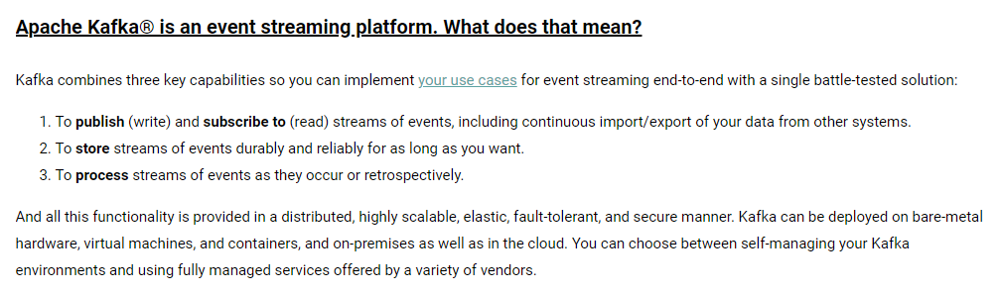

# 一 Kafka

摘自官网



**Kafka是一个分布式流式处理平台**，其具有三个关键功能：

- 消息队列：发布和订阅消息流，这个功能类似于消息队列
- 容错的持久方式存储记录消息流：Kafka会把消息持久化到磁盘，有效避免消息丢失的风险
- 流式处理平台：在消息发布的时候进行处理，Kafka 提供了一个完整的流式处理类库。

两大应用场景：

- 消息队列：建立实时流数据管道，在系统或应用程序之间可靠地获取数据
- 数据处理：构建实时的流数据处理程序来转换或处理数据流

 

Kafka 相比其他消息队列主要的优势如下：

极致的性能：基于 Scala 和 Java 语言开发，设计中大量使用了批量处理和异步的思想，最高可以每秒处理千万级别的消息

生态系统兼容性无可匹敌：Kafka 与周边生态系统的兼容性是最好的没有之一，尤其在大数据和流计算领域


# 二 Kafka消息模型

Kafka 的消息模型同时支持**队列模型**和**发布-订阅模型**


## 队列模型（点对点）


使用队列（Queue）作为消息通信载体，满足生产者与消费者模式，**一条消息只能被一个消费者使用**，未被消费的消息在队列中保留直到被消费或超时


## 发布-订阅模型


发布订阅模型（Pub-Sub） 使用**主题（Topic）** 作为消息通信载体，类似于**广播模式**；发布者发布一条消息，该消息通过主题传递给所有的订阅者，**在一条消息广播之后才订阅的用户则是收不到该条消息的**。


# 三 Kafka的重要概念


- Producer：生产消息
- Consumer：消费消息
- Consumer Group：多个消费者实例共同组成的一个 **Consumer Group（消费者组）** ，Kafka 以 Consumer Group 这一个整体来订阅 Topic （主题），Consumer Group 内的所有 Consumer 共同来消费订阅的 Topic 内的所有  Partition（分区）。使用多分区 + 多消费者方式可以极大提高数据下游的处理速度。
  - Topic 下的每个 Partition 只从属于 Consumer Group 中的一个 Consumer，**不可能出现 Consumer Group 中的两个 Consumer 负责同一个 Partition**
  - **重平衡机制**：当Topic内的Partition与Consumer Group内的Consumer数据不一致时，通过重平衡机制来协调。它本质上是一种协议，规定了一个 Consumer Group 下的所有 Consumer 如何达成一致来分配订阅 Topic 的每个分区
  - Kafka 就是通过消费组的方式来实现消息 P2P 模式和广播模式
- Broker：服务代理节点代理，是 Kafka 的服务节点，可以看作一个独立的Kafka实例，负责处理客户端请求以及对消息持久化
- Topic：Kafka 中的消息以 Topic 为单位进行划分，Producer 将消息发送到特定的主题，Consumer 通过订阅特定的 Topic 来消费消息
- Partition：属于Topic的一部分。一个Topic可以有多个Partition，并且同一 Topic 下的 Partition 可以分布在不同的 Broker 上，这也就表明一个 Topic 可以横跨多个 Broker 。Partition 实际上可以对应成为消息队列中的队列
- Offset ： offset 是消息在分区中的唯一标识，Kafka 通过它来保证消息在分区内的**顺序性**，不过 offset 并不跨越分区，也就是说，Kafka 保证的是**分区有序性**而不是**主题有序性**
- Replication ： 副本，是 Kafka 保证数据高可用的方式，Kafka 同一 Partition 的数据可以在多 Broker 上存在多个副本，通常**只有主副本对外提供读写服务**，当主副本所在 broker 崩溃或发生网络异常，Kafka 会在 **Controller** 的管理下会重新选择新的 Leader 副本对外提供读写服务。
- Record ： 实际写入 Kafka 中并可以被读取的消息记录。每个 record 包含了 key、value 和 timestamp


# 四 Kafka与Zookeeper

Zookeeper 是一个成熟的**分布式协调服务**，ZooKeeper 主要为 Kafka 提供**元数据管理**（Broker、Topic 和 Partition）的功能


Zookeeper 主要为 Kafka 做了下面这些事情：

- **Broker 注册** ：在 Zookeeper 上会有一个专门**用来进行 Broker 服务器列表记录**的节点。每个 Broker 在启动时，都会到 Zookeeper 上进行注册，即到/brokers/ids 下创建属于自己的节点。每个 Broker 就会将自己的 IP 地址和端口等信息记录到该节点中去
- **Topic 注册** ： 在 Kafka 中，同一个**Topic 的消息会被分成多个分区**并将其分布在多个 Broker 上，**这些分区信息及与 Broker 的对应关系**也都是由 Zookeeper 在维护。比如创建了一个名字为 my-topic 的主题并且它有两个分区，对应到 zookeeper 中会创建这些文件夹：`/brokers/topics/my-topic/Partitions/0`、`/brokers/topics/my-topic/Partitions/1`
- **负载均衡** ： Kafka 通过给特定 Topic 指定多个 Partition, 而各个 Partition 可以分布在不同的 Broker 上, 这样便能提供比较好的并发能力。 对于同一个 Topic 的不同 Partition，Kafka 会尽力将这些 Partition 分布到不同的 Broker 服务器上。当生产者产生消息后也会尽量投递到不同 Broker 的 Partition 里面。当 Consumer 消费的时候，Zookeeper 可以根据当前的 Partition 数量以及 Consumer 数量来实现动态负载均衡
- Kafka Controller 的 Leader 选举
- Kafka 集群成员管理
- Topic 配置管理
- 分区副本管理


`Kafka 2.8.0`，移除了对 `Zookeeper` 的依赖（使用内嵌的KRaft替代了 `ZooKeeper`）。这样其实对于 Kafka 来说一个比较好的改进，我们再也不需要额外维护一套 `ZooKpper` 集群了


# 五 如何保证消息的消费顺序

1、一个Topic只对应一个Partition

2、发送消息的时候指定key/Parition


Kafka能保证Partition中的消息有序，而不能保证Topic中的有序。消息在被追加到Partition时会分配一个特定的偏移量，通过偏移量来保证消息在分区内的顺序性。所以就有一种简单的保证消息消费顺序的方法：一个Topic只对应一个Partition；

Kafka发送消息的时候，可以指定topic，partition，key，data4个参数。在发送消息时指定parition，则所有消息都会发送到指定的partition。并且同一个key的消息可以保证只发送到同一个partition中。因此，可以采用表/对象的id来作为key。


# 六 如何保证Kafka不丢失消息

丢失消息有 3 种不同的情况

1. 生产者丢失消息的情况
2. 消费者丢失消息的情况
3. Kafka 弄丢了消息


## 生产者丢失消息的情况

`回调函数` `重试次数` `重试间隔`

生产者(`Producer`) 调用`send`方法发送消息之后，消息可能因为网络问题并没有发送过去。所以，我们不能默认在调用 `send()` 方法发送消息之后消息消息发送成功了。

为了确定消息是发送成功，我们要判断消息发送的结果。

但是，要注意的是 `Producer` 使用 `send()` 方法发送消息实际上是异步的操作，我们可以通过 `get()`方法获取调用结果，但是这样也让它变为了同步操作，示例代码如下：

```java
SendResult<String, Object> sendResult = kafkaTemplate.send(topic, o).get();
if (sendResult.getRecordMetadata() != null) {
  logger.info("生产者成功发送消息到" + sendResult.getProducerRecord().topic() + "-> " + sendRe
              sult.getProducerRecord().value().toString());
}
```

但是一般不推荐这么做！可以采用为其添加回调函数的形式，示例代码如下：

```java
        ListenableFuture<SendResult<String, Object>> future = kafkaTemplate.send(topic, o);
        future.addCallback(result -> logger.info("生产者成功发送消息到topic:{} partition:{}的消息", result.getRecordMetadata().topic(), result.getRecordMetadata().partition()),
                ex -> logger.error("生产者发送消失败，原因：{}", ex.getMessage()));
```

如果消息发送失败的话，我们检查失败的原因之后重新发送即可

另外，这里推荐为 `Producer` 的 `retries`（重试次数）设置一个比较合理的值，一般是 `3` ，但是为了保证消息不丢失的话一般会设置比较大一点。设置完成之后，当出现网络问题之后能够自动重试消息发送，避免消息丢失。另外，建议还要设置重试间隔，因为间隔太小的话重试的效果就不明显了，网络波动一次你 3 次一下子就重试完了


## 消费者丢失消息的情况

`offset`  `自动提交`  `手动应答``重复消费` 

消息在被追加到 `Partition`(分区)的时候都会分配一个特定的偏移量（`offset`）。`offset` 表示 `Consumer` 当前消费到的 `Partition`(分区)的所在的位置。Kafka 通过偏移量（`offset`）可以保证消息在分区内的顺序性


当消费者拉取到了分区的某个消息之后，消费者会自动提交了 `offset`。自动提交的话会有一个问题，试想一下，当消费者刚拿到这个消息准备进行真正消费的时候，突然挂掉了，消息实际上并没有被消费，但是 `offset` 却被自动提交了。

这种情况的解决办法也比较粗暴，我们手动关闭自动提交 `offset`，每次在真正消费完消息之后之后再自己手动提交 `offset` 。但是，细心的朋友一定会发现，这样会带来消息被重新消费的问题。比如你刚刚消费完消息之后，还没提交 `offset`，结果自己挂掉了，那么这个消息理论上就会被消费两次


## Kafka 弄丢了消息

`Kafka` 为 `Partition` 引入了多副本（`Replica`）机制。`Partition` 中的多个副本之间会有一个 `Leader` ，其他副本称为 `Follower`。我们发送的消息会被发送到 `Leader` 副本，然后 `Follower` 副本才能从 `Leader` 副本中拉取消息进行同步。**生产者和消费者只与 `Leader` 副本交互**。你可以理解为其他副本只是 `Leader` 副本的拷贝，它们的存在只是为了保证消息存储的安全性。

试想一种情况：假如  `Leader` 副本所在的 `Broker` 突然挂掉，那么就要从 `Follwer` 副本重新选出一个  `Leader` ，但是  `Leader` 的数据还有一些没有被 `Follower` 副本的同步的话，就会造成消息丢失


#### 设置 acks = all

解决办法就是我们设置 `acks = all`。acks 是 `Producer` 很重要的一个参数。

`acks` 的默认值即为 1，代表我们的消息被 `Leader` 副本接收之后就算被成功发送。当我们配置 `acks = all` 代表则所有副本都要接收到该消息之后该消息才算真正成功被发送。

#### 设置 replication.factor >= 3

为了保证 `Leader` 副本能与 `Follower` 副本能同步消息，我们一般会为 `Topic` 设置 `replication.factor >= 3`。这样就可以保证每个 `Partition` 至少有 3 个副本。虽然造成了数据冗余，但是带来了数据的安全性。

#### 设置 min.insync.replicas > 1

一般情况下我们还需要设置 `min.insync.replicas> 1` ，这样配置代表消息至少要被写入到 2 个副本才算是被成功发送。`min.insync.replicas` 的默认值为 1 ，在实际生产中应尽量避免默认值 1。

但是，为了保证整个 Kafka 服务的高可用性，需要确保 `replication.factor > min.insync.replicas` 。为什么呢？设想一下假如两者相等的话，只要是有一个副本挂掉，整个分区就无法正常工作了。这明显违反高可用性！一般推荐设置成 `replication.factor = min.insync.replicas + 1`。


# 七 Kafka如何保证高可用

高可用性，指系统无间断地执行其功能的能力，代表系统的可用性程度


## 备份机制

Kafka 允许同一个 Partition 存在多个消息副本，每个 Partition 的副本通常由 1 个 Leader 及 0 个以上的 Follower 组成，生产者将消息直接发往对应 Partition 的 Leader，Follower 会周期地向 Leader 发送同步请求

同一 Partition 的 Replica 不应存储在同一个 Broker 上，因为一旦该 Broker 宕机，对应 Partition 的所有 Replica 都无法工作，这就达不到高可用的效果

所以 Kafka 会尽量将所有的 Partition 以及各 Partition 的副本均匀地分配到整个集群的各个 Broker 上


## ISR(In-Sync Replica)机制

### ISR集合副本

ISR 中的副本都是与 Leader 同步的副本，相反，不在 ISR 中的Follower副本就被认为是与 Leader 不同步的

这里的保持同步不是指与 Leader 数据保持完全一致，只需在`replica.lag.time.max.ms`时间内与 Leader 保持有效连接

Follower 周期性地向 Leader 发送 FetchRequest 请求，发送时间间隔配置在`replica.fetch.wait.max.ms`中，默认值为 500

```java
public class FetchRequest {
    private final short versionId;
    private final int correlationId;
    private final String clientId;
    private final int replicaId;
    private final int maxWait;    // Follower容忍的最大等待时间: 到点Leader立即返回结果，默认值500
    private final int minBytes;   // Follower容忍的最小返回数据大小：当Leader有足够数据时立即返回，兜底等待maxWait返回，默认值1
    private final Map<TopicAndPartition, PartitionFetchInfo> requestInfo;  // Follower中各Partititon对应的LEO及获取数量
}
```

各 Partition 的 Leader 负责维护 ISR 列表并将 ISR 的变更同步至 ZooKeeper，被移出 ISR 的 Follower 会继续向 Leader 发 FetchRequest 请求，试图再次跟上 Leader 重新进入 ISR

ISR 中所有副本都跟上了 Leader，通常只有 ISR 里的成员才可能被选为 Leader

### Unclean 领导者选举

当 Kafka 中`unclean.leader.election.enable`配置为 true(默认值为 false)且 ISR 中所有副本均宕机的情况下，才允许 ISR 外的副本被选为 Leader，此时会丢失部分已应答的数据

开启 Unclean 领导者选举可能会造成数据丢失，但好处是，它使得分区 Leader 副本一直存在，不至于停止对外提供服务，因此提升了高可用性，反之，禁止 Unclean 领导者选举的好处在于维护了数据的一致性，避免了消息丢失，但牺牲了高可用性


## ACK机制

生产者发送消息中包含 acks 字段，该字段代表 Leader 应答生产者前 Leader 收到的应答数


- acks=0

生产者无需等待服务端的任何确认，消息被添加到生产者套接字缓冲区后就视为已发送，因此 acks=0 不能保证服务端已收到消息

- acks=1

只要 `Partition Leader` 接收到消息而且写入本地磁盘了，就认为成功了，不管它其他的 Follower 有没有同步过去这条消息了

- acks=all

Leader 将等待 ISR 中的所有副本确认后再做出应答，因此只要 ISR 中任何一个副本还存活着，这条应答过的消息就不会丢失

acks=all 是可用性最高的选择，但等待 Follower 应答引入了额外的响应时间。Leader 需要等待 ISR 中所有副本做出应答，此时响应时间取决于 ISR 中最慢的那台机器

如果说 Partition Leader 刚接收到了消息，但是结果 `Follower` 没有收到消息，此时 Leader 宕机了，那么客户端会感知到这个消息没发送成功，他会重试再次发送消息过去

Broker 有个配置项`min.insync.replicas`(默认值为 1)代表了正常写入生产者数据所需要的最少 ISR 个数

当 ISR 中的副本数量小于`min.insync.replicas`时，Leader 停止写入生产者生产的消息，并向生产者抛出 NotEnoughReplicas 异常，阻塞等待更多的 Follower 赶上并重新进入 ISR

被 Leader 应答的消息都至少有`min.insync.replicas`个副本，因此能够容忍`min.insync.replicas-1`个副本同时宕机


结论：发送的 acks=1 和 0 消息会出现丢失情况，为不丢失消息可配置生产者`acks=all & min.insync.replicas >= 2`


## 故障恢复机制

Kafka 从 0.8 版本开始引入了一套 Leader 选举及失败恢复机制

首先需要在集群所有 Broker 中选出一个 Controller，负责各 Partition 的 Leader 选举以及 Replica 的重新分配

- 当出现 Leader 故障后，Controller 会将 Leader/Follower 的变动通知到需为此作出响应的 Broker。

Kafka 使用 ZooKeeper 存储 Broker、Topic 等状态数据，Kafka 集群中的 Controller 和 Broker 会在 ZooKeeper 指定节点上注册 Watcher(事件监听器)，以便在特定事件触发时，由 ZooKeeper 将事件通知到对应 Broker

### **Broker**

当 Broker 发生故障后，由 Controller 负责选举受影响 Partition 的新 Leader 并通知到相关 Broker

- 当 Broker 出现故障与 ZooKeeper 断开连接后，该 Broker 在 ZooKeeper 对应的 znode 会自动被删除，ZooKeeper 会触发 Controller 注册在该节点的 Watcher；
- Controller 从 ZooKeeper 的`/brokers/ids`节点上获取宕机 Broker 上的所有 Partition；
- Controller 再从 ZooKeeper 的`/brokers/topics`获取所有 Partition 当前的 ISR；
- 对于宕机 Broker 是 Leader 的 Partition，Controller 从 ISR 中选择幸存的 Broker 作为新 Leader；
- 最后 Controller 通过 LeaderAndIsrRequest 请求向的 Broker 发送 LeaderAndISRRequest 请求。

### **Controller**

Controller 是从 Broker 中选举出来的，负责分区 Leader 和 Follower 的管理。当某个分区的 leader 副本发生故障时，由 Controller 负责为该分区选举新的 leader 副本。当检测到某个分区的 ISR(In-Sync Replica)集合发生变化时，由控制器负责通知所有 broker 更新其元数据信息。当使用`kafka-topics.sh`脚本为某个 topic 增加分区数量时，同样还是由控制器负责分区的重新分配。

Kafka 中 Contorller 的选举的工作依赖于 Zookeeper，成功竞选为控制器的 broker 会在 Zookeeper 中创建`/controller`这个临时（EPHEMERAL）节点。

集群中的 Controller 也会出现故障，因此 Kafka 让所有 Broker 都在 ZooKeeper 的 Controller 节点上注册一个 Watcher

Controller 发生故障时对应的 Controller 临时节点会自动删除，此时注册在其上的 Watcher 会被触发，所有活着的 Broker 都会去竞选成为新的 Controller(即创建新的 Controller 节点，由 ZooKeeper 保证只会有一个创建成功)，竞选成功者即为新的 Controller。


#### 选举过程

Broker 启动的时候尝试去读取`/controller`节点的`brokerid`的值，如果`brokerid`的值不等于-1，则表明已经有其他的 Broker 成功成为 Controller 节点，当前 Broker 主动放弃竞选；如果不存在`/controller`节点，或者 brokerid 数值异常，当前 Broker 尝试去创建`/controller`这个节点，此时也有可能其他 broker 同时去尝试创建这个节点，只有创建成功的那个 broker 才会成为控制器，而创建失败的 broker 则表示竞选失败。每个 broker 都会在内存中保存当前控制器的 brokerid 值，这个值可以标识为 activeControllerId

#### 实现

Controller 读取 Zookeeper 中的节点数据，初始化上下文(Controller Context)，并管理节点变化，变更上下文，同时也需要将这些变更信息同步到其他普通的 broker 节点中。Controller 通过定时任务，或者监听器模式获取 zookeeper 信息，事件监听会更新更新上下文信息，如图所示，Controller 内部也采用生产者-消费者实现模式，Controller 将 zookeeper 的变动通过事件的方式发送给事件队列，队列就是一个`LinkedBlockingQueue`，事件消费者线程组通过消费消费事件，将相应的事件同步到各 Broker 节点。这种队列 FIFO 的模式保证了消息的有序性。


#### 职责

Controller 被选举出来，作为整个 Broker 集群的管理者，管理所有的集群信息和元数据信息。它的职责包括下面几部分：

1. 处理 Broker 节点的上线和下线，包括自然下线、宕机和网络不可达导致的集群变动，Controller 需要及时更新集群元数据，并将集群变化通知到所有的 Broker 集群节点；
2. 创建 Topic 或者 Topic 扩容分区，Controller 需要负责分区副本的分配工作，并主导 Topic 分区副本的 Leader 选举。
3. 管理集群中所有的副本和分区的状态机，监听状态机变化事件，并作出相应的处理。Kafka 分区和副本数据采用状态机的方式管理，分区和副本的变化都在状态机内会引起状态机状态的变更，从而触发相应的变化事件。


##### 分区状态机

PartitionStateChange，管理 Topic 的分区，它有以下 4 种状态：

1. NonExistentPartition：该状态表示分区没有被创建过或创建后被删除了。
2. NewPartition：分区刚创建后，处于这个状态。此状态下分区已经分配了副本，但是还没有选举 leader，也没有 ISR 列表。
3. OnlinePartition：一旦这个分区的 leader 被选举出来，将处于这个状态。
4. OfflinePartition：当分区的 leader 宕机，转移到这个状态。


##### **副本状态机**

ReplicaStateChange，副本状态，管理分区副本信息，它也有 4 种状态：


1. NewReplica: 创建 topic 和分区分配后创建 replicas，此时，replica 只能获取到成为 follower 状态变化请求。
2. OnlineReplica: 当 replica 成为 parition 的 assingned replicas 时，其状态变为 OnlineReplica, 即一个有效的 OnlineReplica。
3. OfflineReplica: 当一个 replica 下线，进入此状态，这一般发生在 broker 宕机的情况下；
4. NonExistentReplica: Replica 成功删除后，replica 进入 NonExistentReplica 状态。


# 八 Kafka为什么那么快

## Kafka性能全景


从高度抽象的角度来看，性能问题逃不出下面三个方面：

- 网络
- 磁盘
- 复杂度

对于 Kafka 这种网络分布式队列来说，网络和磁盘更是优化的重中之重。针对于上面提出的抽象问题，解决方案高度抽象出来也很简单：

- 并发
- 压缩
- 批量
- 缓存
- 算法


## 顺序写

Kafka 采用`顺序写`文件的方式来提高磁盘写入性能。`顺序写`文件，基本减少了磁盘`寻道`和`旋转`的次数。

Kafka 中每个分区是一个有序的，不可变的消息序列，新的消息不断追加到 Partition 的末尾，在 Kafka 中 Partition 只是一个逻辑概念，Kafka 将 Partition 划分为多个 Segment，每个 Segment 对应一个物理文件，Kafka 对 segment 文件追加写，这就是顺序写文件。

**为什么Kafka可以使用追加写？**

这和 Kafka 的性质有关，我们来看看 Kafka 和 Redis，说白了，Kafka 就是一个`Queue`，而 Redis 就是一个`HashMap`。`Queue`和`Map`的区别是什么？

`Queue` 是 FIFO 的，数据是有序的；`HashMap`数据是无序的，是随机读写的。Kafka 的不可变性，有序性使得 Kafka 可以使用追加写的方式写文件。

其实很多符合以上特性的数据系统，都可以采用追加写的方式来优化磁盘性能。典型的有`Redis`的 AOF 文件，各种数据库的`WAL(Write ahead log)`机制等等。


## 零拷贝

在 OS 层面上的 `Zero-copy` 通常指避免在 `用户态(User-space)` 与 `内核态(Kernel-space)` 之间来回拷贝数据

传统IO模型需要进行4次数据拷贝和4次上下文切换：


`零拷贝`就是尽量去减少上面数据的拷贝次数，从而减少拷贝的 CPU 开销，减少用户态内核态的上下文切换次数，从而优化数据传输的性能。

常见的零拷贝思路主要有三种：

- 直接 I/O：数据直接跨过内核，在用户地址空间与 I/O 设备之间传递，内核只是进行必要的虚拟存储配置等辅助工作；
- 避免内核和用户空间之间的数据拷贝：当应用程序不需要对数据进行访问时，则可以避免将数据从内核空间拷贝到用户空间；
- 写时复制：数据不需要提前拷贝，而是当需要修改的时候再进行部分拷贝。

Kafka 使用到了 `mmap` 和 `sendfile` 的方式来实现`零拷贝`。分别对应 Java 的 `MappedByteBuffer` 和 `FileChannel.transferTo`。


在此模型下，上下文切换的数量减少到一个。具体而言，`transferTo()`方法指示块设备通过 DMA 引擎将数据读取到读取缓冲区中。然后，将该缓冲区复制到另一个内核缓冲区以暂存到套接字。最后，套接字缓冲区通过 DMA 复制到 NIC 缓冲区。

将副本数从四减少到三，并且这些副本中只有一个涉及 CPU。我们还将上下文切换的数量从四个减少到了两个。这是一个很大的改进，但是还没有查询零副本。当运行 Linux 内核 2.4 及更高版本以及支持收集操作的网络接口卡时，后者可以作为进一步的优化来实现。如下所示


根据前面的示例，调用`transferTo()`方法会使设备通过 DMA 引擎将数据读取到内核读取缓冲区中。但是，使用`gather`操作时，读取缓冲区和套接字缓冲区之间没有复制。取而代之的是，给 NIC 一个指向读取缓冲区的指针以及偏移量和长度，该偏移量和长度由 DMA 清除。CPU 绝对不参与复制缓冲区。


## PageCache


producer 生产消息到 Broker 时，Broker 会使用 pwrite() 系统调用【对应到 Java NIO 的 FileChannel.write() API】按偏移量写入数据，此时数据都会先写入`page cache`。consumer 消费消息时，Broker 使用 sendfile() 系统调用【对应 FileChannel.transferTo() API】，零拷贝地将数据从 page cache 传输到 broker 的 Socket buffer，再通过网络传输。


leader 与 follower 之间的同步，与上面 consumer 消费数据的过程是同理的。


`page cache`中的数据会随着内核中 flusher 线程的调度以及对 sync()/fsync() 的调用写回到磁盘，就算进程崩溃，也不用担心数据丢失。另外，如果 consumer 要消费的消息不在`page cache`里，才会去磁盘读取，并且会顺便预读出一些相邻的块放入 page cache，以方便下一次读取。


因此如果 Kafka producer 的生产速率与 consumer 的消费速率相差不大，那么就能几乎只靠对 broker page cache 的读写完成整个生产 - 消费过程，磁盘访问非常少。


## 网络模型

Netty 是 JVM 领域一个优秀的网络框架，提供了高性能的网络服务。大多数 Java 程序员提到网络框架，首先想到的就是 Netty。Dubbo、Avro-RPC 等等优秀的框架都使用 Netty 作为底层的网络通信框架

Kafka 自己实现了网络模型做 RPC。底层基于 Java NIO，采用和 Netty 一样的 Reactor 线程模型。


Kafka 即基于 Reactor 模型实现了多路复用和处理线程池。其设计如下：


其中包含了一个`Acceptor`线程，用于处理新的连接，`Acceptor` 有 N 个 `Processor` 线程 select 和 read socket 请求，N 个 `Handler` 线程处理请求并响应，即处理业务逻辑。


## 批量传输与压缩消息

`Producer` 向 `Broker` 发送消息不是一条消息一条消息的发送。`Producer` 有两个重要的参数：`batch.size`和`linger.ms`。这两个参数就和 `Producer` 的批量发送消息有关

Kafka 的主要场景就是高并发读和高吞吐写，也就说 Kafka 需要写入和读取大量的消息。批量主要是为了让传输消息的次数变得更少，压缩主要是为了降低网络传输的消耗，提高吞吐量。

在 Kafka 中，Kafka 会对消息进行分组，发送消息之前，会先将消息组合在一起形成消息快，然后 `Producer` 会将消息快一起发送到  `Broker` 。

另外，由于，网络带宽是有限的，我们在网络中传输数据之前往往需要先对其进行压缩（网上有很多现成的压缩算法，我们直接拿来就可以了，Kafka 就是这样做的）。因此， `Producer` 发送消息快我们还可以对其进行压缩。

`Broker` 接收到压缩后的消息块之后（建议  `Broker`  的压缩算法和 `Producer`  一样），会依次将压缩后的消息块写入文件中（注意：这个时候消息块还是压缩的状态），`Consumer` 同时会依次获取消息块，当消息块到达 `Consumer`  后，`Consumer` 才会对消息块进行解压缩（有压缩必然有解压缩）。

**Kafka Producer 的执行流程如下图所示** ：


发送消息依次经过以下处理器：


- `Serialize` ：键和值都根据传递的序列化器进行序列化。优秀的序列化方式可以提高网络传输的效率。
- `Partition`：决定将消息写入主题的哪个分区，默认情况下遵循 murmur2 算法。自定义分区程序也可以传递给生产者，以控制应将消息写入哪个分区。
- `Compress`：默认情况下，在 Kafka 生产者中不启用压缩。压缩 不仅可以更快地从生产者传输到代理，还可以在复制过程中进行更快的传输。压缩有助于提高吞吐量，降低延迟并提高磁盘利用率。
- `Accumulate`：`Accumulate`顾名思义，就是一个消息累计器。其内部为每个 Partition 维护一个`Deque`双端队列，队列保存将要发送的批次数据，`Accumulate`将数据累计到一定数量，或者在一定过期时间内，便将数据以批次的方式发送出去。记录被累积在主题每个分区的缓冲区中。根据生产者批次大小属性将记录分组。主题中的每个分区都有一个单独的累加器 / 缓冲区。
- `Group Send` ：记录累积器中分区的批次按将它们发送到的代理分组。批处理中的记录基于 `batch.size` 和 `linger.ms` 属性发送到代理。记录由生产者根据两个条件发送。当达到定义的批次大小或达到定义的延迟时间时。


Kafka 支持多种压缩算法：`LZ4` 、`Snappy` 、`GZIP` 。Kafka 2.1.0 正式支持 `ZStandard` 压缩算法。[ZStandard](https://github.com/facebook/zstd) 简称 Zstd ，Facebook 开源，是一个主要由 C 语言实现的旨在提供高压缩比的快速压缩算法。


## 分区并发

Kafka 的 Topic 可以分成多个 Partition，每个 Paritition 类似于一个队列，保证数据有序。同一个 Group 下的不同 Consumer 并发消费 Paritition，分区实际上是调优 Kafka 并行度的最小单元，因此，可以说，每增加一个 Paritition 就增加了一个消费并发。


Kafka 具有优秀的分区分配算法——StickyAssignor，可以保证分区的分配尽量地均衡，且每一次重分配的结果尽量与上一次分配结果保持一致。这样，整个集群的分区尽量地均衡，各个 Broker 和 Consumer 的处理不至于出现太大的倾斜。

**越多的分区需要打开更多的文件句柄**

在 kafka 的 broker 中，每个分区都会对照着文件系统的一个目录。在 kafka 的数据日志文件目录中，每个日志数据段都会分配两个文件，一个索引文件和一个数据文件。因此，随着 partition 的增多，需要的文件句柄数急剧增加，必要时需要调整操作系统允许打开的文件句柄数。

**客户端 / 服务器端需要使用的内存就越多**

客户端 producer 有个参数 batch.size，默认是 16KB。它会为每个分区缓存消息，一旦满了就打包将消息批量发出。看上去这是个能够提升性能的设计。不过很显然，因为这个参数是分区级别的，如果分区数越多，这部分缓存所需的内存占用也会更多。

**降低高可用性**

分区越多，每个 Broker 上分配的分区也就越多，当一个发生 Broker 宕机，那么恢复时间将很长。


## 文件结构

Kafka 消息是以 Topic 为单位进行归类，各个 Topic 之间是彼此独立的，互不影响。每个 Topic 又可以分为一个或多个分区。每个分区各自维护一个**记录消息数据的日志文件**。

Kafka 每个分区日志在物理上实际按大小被分成多个 Segment。


- segment file 组成：由 2 大部分组成，分别为 index file 和 data file，此 2 个文件一一对应，成对出现，后缀”.index”和“.log”分别表示为 segment 索引文件、数据文件。
- segment 文件命名规则：partion 全局的第一个 segment 从 0 开始，后续每个 segment 文件名为上一个 segment 文件最后一条消息的 offset 值。数值最大为 64 位 long 大小，19 位数字字符长度，没有数字用 0 填充。

index 采用稀疏索引，这样每个 index 文件大小有限，Kafka 采用`mmap`的方式，直接将 index 文件映射到内存，这样对 index 的操作就不需要操作磁盘 IO。`mmap`的 Java 实现对应 `MappedByteBuffer` 。

mmap 是一种**内存映射文件**的方法。即将一个文件或者其它对象映射到进程的地址空间，实现文件磁盘地址和进程虚拟地址空间中一段虚拟地址的一一对映关系。**实现这样的映射关系后，进程就可以采用指针的方式读写操作这一段内存，而系统会自动回写脏页面到对应的文件磁盘上，即完成了对文件的操作而不必再调用 read,write 等系统调用函数。**相反，内核空间对这段区域的修改也直接反映用户空间，从而可以实现不同进程间的文件共享