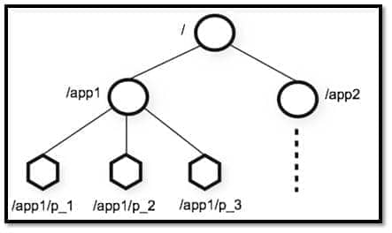
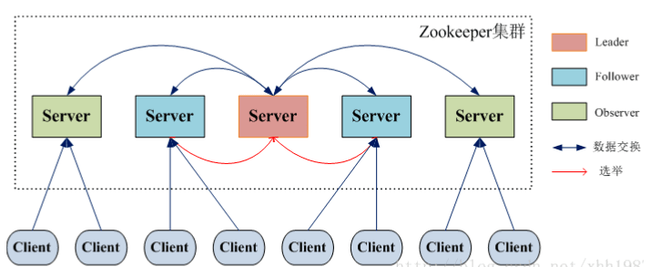
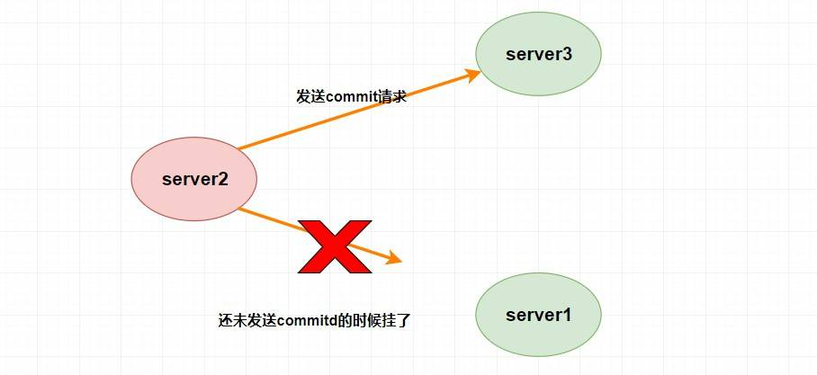

# 概览

ZooKeeper 是一个开源的**分布式协调服务**，它的设计目标是将那些复杂且容易出错的分布式一致性服务封装起来，构成一个高效可靠的原语集，并以一系列简单易用的接口提供给用户使用


**ZooKeeper 为我们提供了高可用、高性能、稳定的分布式数据一致性解决方案，通常被用于实现诸如数据发布/订阅、负载均衡、命名服务、分布式协调/通知、集群管理、Master 选举、分布式锁和分布式队列等功能**


另外，**ZooKeeper 将数据保存在内存中，性能是非常棒的。 在“读”多于“写”的应用程序中尤其地高性能，因为“写”会导致所有的服务器间同步状态。（“读”多于“写”是协调服务的典型场景）**


分布式与集群：加机器更加适用于构建集群，因为集群是只有加机器。而对于分布式来说，首先需要将业务进行拆分，然后再加机器，同时还要解决分布式带来的一系列问题。如各个分布式组件如何协调起来，如何减少各个系统之间的耦合度，分布式事务的处理，如何配置整个分布式系统等，ZooKeeper主要解决这些问题。


## 特点

- **顺序一致性：** 从同一客户端发起的事务请求，最终将会严格地按照顺序被应用到 ZooKeeper 中去。
- **原子性：** 所有事务请求的处理结果在整个集群中所有机器上的应用情况是一致的，也就是说，要么整个集群中所有的机器都成功应用了某一个事务，要么都没有应用。
- **单一系统映像 ：** 无论客户端连到哪一个 ZooKeeper 服务器上，其看到的服务端数据模型都是一致的。
- **可靠性：** 一旦一次更改请求被应用，更改的结果就会被持久化，直到被下一次更改覆盖


## 典型应用场景

1. **分布式锁** ： 通过创建唯一节点获得分布式锁，当获得锁的一方执行完相关代码或者是挂掉之后就释放锁。zk的模式是CP模型，也就是说，当zk锁提供给我们进行访问的时候，在zk集群中能确保这把锁在zk的每一个节点都存在。（这个实际上是zk的leader通过二阶段提交写请求来保证的，这个也是zk的集群规模大了的一个瓶颈点）

   zk锁实现的原理：利用“有序节点”的特性，有序节点能严格保证各个子节点按照排序命名生成，当一个线程获取到最小序的节点，说明获取到了锁。

2. **选主**

3. **命名服务** ：可以通过 ZooKeeper 的顺序节点生成全局唯一 ID

4. **数据发布/订阅** ：通过 **Watcher 机制** 可以很方便地实现数据发布/订阅。当你将数据发布到 ZooKeeper 被监听的节点上，其他机器可通过监听 ZooKeeper 上节点的变化来实现配置的动态更新。

实际上，这些功能的实现基本都得益于 ZooKeeper 可以保存数据的功能，但是 ZooKeeper 不适合保存大量数据


## 开源项目

1. **Kafka** : ZooKeeper 主要为 Kafka 提供 **Broker** 和 **Topic** 的注册以及多个 Partition 的负载均衡等功能。
2. **Hbase** : ZooKeeper 为 Hbase 提供确保整个集群只有一个 Master 以及保存和提供 regionserver 状态信息（是否在线）等功能。
3. **Hadoop** : ZooKeeper 为 Namenode 提供高可用支持


# ZooKeeper重要概念解读

## Data model

ZooKeeper 数据模型采用层次化的**多叉树形结构**，每个节点上都可以存储数据，这些数据可以是数字、字符串或者是二级制序列。并且。每个节点还可以拥有 N 个子节点，最上层是根节点以“/”来代表。每个数据节点在 ZooKeeper 中被称为 **znode**，它是 ZooKeeper 中数据的**最小单元**。并且，每个 znode 都一个唯一的路径标识



强调一句：**ZooKeeper 主要是用来协调服务的，而不是用来存储业务数据的，所以不要放比较大的数据在 znode 上，ZooKeeper 给出的上限是每个结点的数据大小最大是 1M**


## znode

### znode 4种类型

- **持久（PERSISTENT）节点** ：一旦创建就一直存在即使 ZooKeeper 集群宕机，直到将其删除。
- **临时（EPHEMERAL）节点** ：临时节点的生命周期是与 **客户端会话（session）** 绑定的，**会话消失则节点消失** 。并且，**临时节点只能做叶子节点** ，不能创建子节点。
- **持久顺序（PERSISTENT_SEQUENTIAL）节点** ：除了具有持久（PERSISTENT）节点的特性之外， 子节点的名称还具有顺序性。比如 `/node1/app0000000001` 、`/node1/app0000000002` 。
- **临时顺序（EPHEMERAL_SEQUENTIAL）节点** ：除了具备临时（EPHEMERAL）节点的特性之外，子节点的名称还具有顺序性


### znode数据结构

每个znode由两部分组成：stat 状态信息，data数据内容

```sh
[zk: 127.0.0.1:2181(CONNECTED) 6] get /dubbo
# 该数据节点关联的数据内容为空
null
# 下面是该数据节点的一些状态信息，其实就是 Stat 对象的格式化输出
cZxid = 0x2
ctime = Tue Nov 27 11:05:34 CST 2018
mZxid = 0x2
mtime = Tue Nov 27 11:05:34 CST 2018
pZxid = 0x3
cversion = 1
dataVersion = 0
aclVersion = 0
ephemeralOwner = 0x0
dataLength = 0
numChildren = 1

```

Stat 类中包含了一个数据节点的所有状态信息的字段，包括事务 ID-cZxid、节点创建时间-ctime 和子节点个数-numChildren 等等


## 版本

在前面我们已经提到，对应于每个 znode，ZooKeeper 都会为其维护一个叫作 **Stat** 的数据结构，Stat 中记录了这个 znode 的三个相关的版本：

- **dataVersion** ：当前 znode 节点的版本号
- **cversion** ： 当前 znode 子节点的版本
- **aclVersion** ： 当前 znode 的 ACL 的版本


## ACL（权限控制）

ZooKeeper 采用 ACL（AccessControlLists）策略来进行权限控制，类似于 UNIX 文件系统的权限控制。

对于 znode 操作的权限，ZooKeeper 提供了以下 5 种：

- **CREATE** : 能创建子节点
- **READ** ：能获取节点数据和列出其子节点
- **WRITE** : 能设置/更新节点数据
- **DELETE** : 能删除子节点
- **ADMIN** : 能设置节点 ACL 的权限

其中尤其需要注意的是，**CREATE** 和 **DELETE** 这两种权限都是针对 **子节点** 的权限控制。

对于身份认证，提供了以下几种方式：

- **world** ： 默认方式，所有用户都可无条件访问。
- **auth** :不使用任何 id，代表任何已认证的用户。
- **digest** :用户名:密码认证方式： *username:password* 。
- **ip** : 对指定 ip 进行限制


## Watcher（事件监听器）

Watcher（事件监听器），是 ZooKeeper 中的一个很重要的特性。ZooKeeper 允许用户**在指定节点上注册一些 Watcher**，并且在一些特定事件触发的时候，ZooKeeper 服务端会将事件通知到感兴趣的客户端上去，该机制是 ZooKeeper 实现分布式协调服务的重要特性


## 会话（Session）

Session 可以看作是 ZooKeeper 服务器与客户端的之间的一个 **TCP 长连接**，通过这个连接，客户端能够通过心跳检测与服务器保持有效的会话，也能够向 ZooKeeper 服务器发送请求并接受响应，同时还能够通过该连接接收来自服务器的 Watcher 事件通知


Session 有一个属性叫做：`sessionTimeout` ，`sessionTimeout` 代表会话的超时时间。当由于服务器压力太大、网络故障或是客户端主动断开连接等各种原因导致客户端连接断开时，只要在`sessionTimeout`规定的时间内能够重新连接上集群中任意一台服务器，那么之前创建的会话仍然有效


在为客户端创建会话之前，服务端首先会为每个客户端都分配一个 `sessionID`。由于 `sessionID`是 ZooKeeper 会话的一个重要标识，许多与会话相关的运行机制都是基于这个 `sessionID` 的，因此，无论是哪台服务器为客户端分配的 `sessionID`，都务必保证全局唯一


# ZooKeeper集群


上图中每一个 Server 代表一个安装 ZooKeeper 服务的服务器。组成 ZooKeeper 服务的服务器都会在内存中维护当前的服务器状态，并且每台服务器之间都互相保持着通信。集群间通过 ZAB 协议（ZooKeeper Atomic Broadcast）来保持数据的一致性


**最典型集群模式： Master/Slave 模式（主备模式）**。在这种模式中，通常 Master 服务器作为主服务器提供写服务，其他的 Slave 服务器从服务器通过异步复制的方式获取 Master 服务器最新的数据提供读服务


## 集群角色

ZooKeeper 中没有选择传统的 Master/Slave 概念，而是引入了 Leader、Follower 和 Observer 三种角色



ZooKeeper 集群中的所有机器通过一个 **Leader 选举过程** 来选定一台称为 “**Leader**” 的机器，Leader 既可以为客户端提供写服务又能提供读服务。除了 Leader 外，**Follower** 和 **Observer** 都只能提供读服务。Follower 和 Observer 唯一的区别在于 Observer 机器不参与 Leader 的选举过程，也不参与写操作的“过半写成功”策略，因此 Observer 机器可以在不影响写性能的情况下提升集群的读性能


当 Leader 服务器出现网络中断、崩溃退出与重启等异常情况时，就会进入 Leader 选举过程，这个过程会选举产生新的 Leader 服务器


这个过程大致是这样的：

1. **Leader election（选举阶段）**：节点在一开始都处于选举阶段，只要有一个节点得到超半数节点的票数，它就可以当选准 leader。
2. **Discovery（发现阶段）** ：在这个阶段，followers 跟准 leader 进行通信，同步 followers 最近接收的事务提议。
3. **Synchronization（同步阶段）** :同步阶段主要是利用 leader 前一阶段获得的最新提议历史，同步集群中所有的副本。同步完成之后 准 leader 才会成为真正的 leader。
4. **Broadcast（广播阶段）** :到了这个阶段，ZooKeeper 集群才能正式对外提供事务服务，并且 leader 可以进行消息广播。同时如果有新的节点加入，还需要对新节点进行同步


## 服务器状态

- **LOOKING** ：寻找 Leader。
- **LEADING** ：Leader 状态，对应的节点为 Leader。
- **FOLLOWING** ：Follower 状态，对应的节点为 Follower。
- **OBSERVING** ：Observer 状态，对应节点为 Observer，该节点不参与 Leader 选举


## ZooKeeper 集群为啥最好奇数台

ZooKeeper 集群在宕掉几个 ZooKeeper 服务器之后，如果剩下的 ZooKeeper 服务器个数大于宕掉的个数的话整个 ZooKeeper 才依然可用。假如我们的集群中有 n 台 ZooKeeper 服务器，那么也就是剩下的服务数必须大于 n/2。先说一下结论，**2n 和 2n-1 的容忍度是一样的，都是 n-1**，大家可以先自己仔细想一想，这应该是一个很简单的数学问题了。

比如假如我们有 3 台，那么最大允许宕掉 1 台 ZooKeeper 服务器，如果我们有 4 台的的时候也同样只允许宕掉 1 台。 假如我们有 5 台，那么最大允许宕掉 2 台 ZooKeeper 服务器，如果我们有 6 台的的时候也同样只允许宕掉 2 台。

综上，何必增加那一个不必要的 ZooKeeper 呢？


## ZooKeeper 选举的过半机制防止脑裂

### 集群脑裂

对于一个集群，通常多台机器会部署在不同机房，来提高这个集群的可用性。保证可用性的同时，会发生一种机房间网络线路故障，导致机房间网络不通，而集群被割裂成几个小集群。这时候子集群各自选主导致“脑裂”的情况

举例说明：比如现在有一个由 6 台服务器所组成的一个集群，部署在了 2 个机房，每个机房 3 台。正常情况下只有 1 个 leader，但是当两个机房中间网络断开的时候，每个机房的 3 台服务器都会认为另一个机房的 3 台服务器下线，而选出自己的 leader 并对外提供服务。若没有过半机制，当网络恢复的时候会发现有 2 个 leader。仿佛是 1 个大脑（leader）分散成了 2 个大脑，这就发生了脑裂现象。脑裂期间 2 个大脑都可能对外提供了服务，这将会带来数据一致性等问题


### **过半机制是如何防止脑裂现象产生的**

ZooKeeper 的过半机制导致不可能产生 2 个 leader，因为少于等于一半是不可能产生 leader 的，这就使得不论机房的机器如何分配都不可能发生脑裂


# 一致性问题CAP

设计一个分布式系统必定会遇到一个问题—— **因为分区容忍性（partition tolerance）的存在，就必定要求我们需要在系统可用性（availability）和数据一致性（consistency）中做出权衡** 。这就是著名的 `CAP` 定理


## 一致性协议和算法

2PC，3PC，Paxos算法

拜占庭将军问题，指 **在不可靠信道上试图通过消息传递的方式达到一致性是不可能的**， 所以所有的一致性算法的 **必要前提** 就是安全可靠的消息通道


### 2PC（两阶段提交）

两阶段提交是一种保证分布式系统数据一致性的协议，现在很多数据库都是采用的两阶段提交协议来完成 **分布式事务** 的处理


分布式事务出现的问题：在分布式系统中，整个调用链中，我们所有服务的数据处理要么都成功要么都失败，即所有服务的 **原子性问题**


在两阶段提交中，主要涉及到两个角色，分别是协调者和参与者。

第一阶段：当要执行一个分布式事务的时候，事务发起者首先向协调者发起事务请求，然后协调者会给所有参与者发送 `prepare` 请求（其中包括事务内容）告诉参与者你们需要执行事务了，如果能执行我发的事务内容那么就先执行但不提交，执行后请给我回复。然后参与者收到 `prepare` 消息后，他们会开始执行事务（但不提交），并将 `Undo` 和 `Redo` 信息记入事务日志中，之后参与者就向协调者反馈是否准备好了。

第二阶段：第二阶段主要是协调者根据参与者反馈的情况来决定接下来是否可以进行事务的提交操作，即提交事务或者回滚事务

比如这个时候 **所有的参与者** 都返回了准备好了的消息，这个时候就进行事务的提交，协调者此时会给所有的参与者发送 **`Commit` 请求** ，当参与者收到 `Commit` 请求的时候会执行前面执行的事务的 **提交操作** ，提交完毕之后将给协调者发送提交成功的响应。

而如果在第一阶段并不是所有参与者都返回了准备好了的消息，那么此时协调者将会给所有参与者发送 **回滚事务的 `rollback` 请求**，参与者收到之后将会 **回滚它在第一阶段所做的事务处理** ，然后再将处理情况返回给协调者，最终协调者收到响应后便给事务发起者返回处理失败的结果


2PC的问题：

- **单点故障问题**，如果协调者挂了那么整个系统都处于不可用的状态了。
- **阻塞问题**，即当协调者发送 `prepare` 请求，参与者收到之后如果能处理那么它将会进行事务的处理但并不提交，这个时候会一直占用着资源不释放，如果此时协调者挂了，那么这些资源都不会再释放了，这会极大影响性能。
- **数据不一致问题**，比如当第二阶段，协调者只发送了一部分的 `commit` 请求就挂了，那么也就意味着，收到消息的参与者会进行事务的提交，而后面没收到的则不会进行事务提交，那么这时候就会产生数据不一致性问题


### 3PC（三阶段提交）

1. **CanCommit阶段**：协调者向所有参与者发送 `CanCommit` 请求，参与者收到请求后会根据自身情况查看是否能执行事务，如果可以则返回 YES 响应并进入预备状态，否则返回 NO 。
2. **PreCommit阶段**：协调者根据参与者返回的响应来决定是否可以进行下面的 `PreCommit` 操作。如果上面参与者返回的都是 YES，那么协调者将向所有参与者发送 `PreCommit` 预提交请求，**参与者收到预提交请求后，会进行事务的执行操作，并将 `Undo` 和 `Redo` 信息写入事务日志中** ，最后如果参与者顺利执行了事务则给协调者返回成功的响应。如果在第一阶段协调者收到了 **任何一个 NO** 的信息，或者 **在一定时间内** 并没有收到全部的参与者的响应，那么就会中断事务，它会向所有参与者发送中断请求（abort），参与者收到中断请求之后会立即中断事务，或者在一定时间内没有收到协调者的请求，它也会中断事务。
3. **DoCommit阶段**：这个阶段其实和 `2PC` 的第二阶段差不多，如果协调者收到了所有参与者在 `PreCommit` 阶段的 YES 响应，那么协调者将会给所有参与者发送 `DoCommit` 请求，**参与者收到 `DoCommit` 请求后则会进行事务的提交工作**，完成后则会给协调者返回响应，协调者收到所有参与者返回的事务提交成功的响应之后则完成事务。若协调者在 `PreCommit` 阶段 **收到了任何一个 NO 或者在一定时间内没有收到所有参与者的响应** ，那么就会进行中断请求的发送，参与者收到中断请求后则会 **通过上面记录的回滚日志** 来进行事务的回滚操作，并向协调者反馈回滚状况，协调者收到参与者返回的消息后，中断事务


总之，`3PC` 通过一系列的超时机制很好的缓解了**阻塞问题**，但是最重要的**一致性**并没有得到根本的解决，比如在 `PreCommit` 阶段，当一个参与者收到了请求之后其他参与者和协调者挂了或者出现了网络分区，这个时候收到消息的参与者都会进行事务提交，这就会出现数据不一致性问题


### Paxos算法

`Paxos` 算法是基于**消息传递且具有高度容错特性的一致性算法**，是目前公认的解决分布式一致性问题最有效的算法之一，**其解决的问题就是在分布式系统中如何就某个值（决议）达成一致** 。

在 `Paxos` 中主要有三个角色，分别为 `Proposer提案者`、`Acceptor表决者`、`Learner学习者`。`Paxos` 算法和 `2PC` 一样，也有两个阶段，分别为 `Prepare` 和 `accept` 阶段


#### prepare阶段

- `Proposer提案者`：负责提出 `proposal`，每个提案者在提出提案时都会首先获取到一个 **具有全局唯一性的、递增的提案编号N**，即在整个集群中是唯一的编号 N，然后将该编号赋予其要提出的提案，在**第一阶段是只将提案编号发送给所有的表决者**。
- `Acceptor表决者`：每个表决者在 `accept` 某提案后，会将该提案编号N记录在本地，这样每个表决者中保存的已经被 accept 的提案中会存在一个**编号最大的提案**，其编号假设为 `maxN`。每个表决者仅会 `accept` 编号大于自己本地 `maxN` 的提案，在批准提案时表决者会将以前接受过的最大编号的提案作为响应反馈给 `Proposer`


#### accept阶段

当一个提案被 `Proposer` 提出后，如果 `Proposer` 收到了超过半数的 `Acceptor` 的批准（`Proposer` 本身同意），那么此时 `Proposer` 会给所有的 `Acceptor` 发送真正的提案（你可以理解为第一阶段为试探），这个时候 `Proposer` 就会发送提案的内容和提案编号。

表决者收到提案请求后会再次比较本身已经批准过的最大提案编号和该提案编号，如果该提案编号 **大于等于** 已经批准过的最大提案编号，那么就 `accept` 该提案（此时执行提案内容但不提交），随后将情况返回给 `Proposer` 。如果不满足则不回应或者返回 NO


当 `Proposer` 收到超过半数的 `accept` ，那么它这个时候会向所有的 `acceptor` 发送提案的提交请求。需要注意的是，因为上述仅仅是超过半数的 `acceptor` 批准执行了该提案内容，其他没有批准的并没有执行该提案内容，所以这个时候需要**向未批准的 `acceptor` 发送提案内容和提案编号并让它无条件执行和提交**，而对于前面已经批准过该提案的 `acceptor` 来说 **仅仅需要发送该提案的编号** ，让 `acceptor` 执行提交就行了


而如果 `Proposer` 如果没有收到超过半数的 `accept` 那么它将会将 **递增** 该 `Proposal` 的编号，然后 **重新进入 `Prepare` 阶段** 


### paxos算法的死循环问题

比如说，此时提案者 P1 提出一个方案 M1，完成了 `Prepare` 阶段的工作，这个时候 `acceptor` 则批准了 M1，但是此时提案者 P2 同时也提出了一个方案 M2，它也完成了 `Prepare` 阶段的工作。然后 P1 的方案已经不能在第二阶段被批准了（因为 `acceptor` 已经批准了比 M1 更大的 M2），所以 P1 自增方案变为 M3 重新进入 `Prepare` 阶段，然后 `acceptor` ，又批准了新的 M3 方案，它又不能批准 M2 了，这个时候 M2 又自增进入 `Prepare` 阶段。。。

就这样无休无止的永远提案下去，这就是 `paxos` 算法的死循环问题


# ZAB协议

## 介绍

ZAB（ZooKeeper Atomic Broadcast 原子广播） 协议是为分布式协调服务 ZooKeeper 专门设计的一种**支持崩溃恢复的原子广播协议**。 在 ZooKeeper 中，主要依赖 ZAB 协议来实现分布式数据一致性，基于该协议，ZooKeeper 实现了一种**主备模式**的系统架构来保持集群中各个副本之间的数据一致性


## ZAB 协议两种基本的模式：崩溃恢复和消息广播

ZAB 协议包括两种基本的模式，分别是

- **崩溃恢复** ：当整个服务框架在启动过程中，或是当 Leader 服务器出现网络中断、崩溃退出与重启等异常情况时，ZAB 协议就会进入恢复模式并选举产生新的 Leader 服务器。当选举产生了新的 Leader 服务器，同时集群中已经有过半的机器与该 Leader 服务器完成了状态同步之后，ZAB 协议就会退出恢复模式。其中，**所谓的状态同步是指数据同步，用来保证集群中存在过半的机器能够和 Leader 服务器的数据状态保持一致**。
- **消息广播** ：**当集群中已经有过半的 Follower 服务器完成了和 Leader 服务器的状态同步，那么整个服务框架就可以进入消息广播模式了。** 当一台同样遵守 ZAB 协议的服务器启动后加入到集群中时，如果此时集群中已经存在一个 Leader 服务器在负责进行消息广播，那么新加入的服务器就会自觉地进入数据恢复模式：找到 Leader 所在的服务器，并与其进行数据同步，然后一起参与到消息广播流程中去


### 消息广播模式

说白了就是 `ZAB` 协议是如何处理写请求的，为了保证集群的数据一致性，Leader处理写请求的同时，Follower和Observer也需要同步更新数据


第一步肯定需要 `Leader` 将写请求 **广播** 出去，让 `Leader` 询问 `Followers` 是否同意更新，如果超过半数以上的同意那么就进行 `Follower` 和 `Observer` 的更新（和 `Paxos` 一样）


Queues是 **`ZAB` 需要让 `Follower` 和 `Observer` 保证顺序性** 。何为顺序性，比如我现在有一个写请求A，此时 `Leader` 将请求A广播出去，因为只需要半数同意就行，所以可能这个时候有一个 `Follower` F1因为网络原因没有收到，而 `Leader` 又广播了一个请求B，因为网络原因，F1竟然先收到了请求B然后才收到了请求A，这个时候请求处理的顺序不同就会导致数据的不同，从而 **产生数据不一致问题** 。

所以在 `Leader` 这端，它为每个其他的 `zkServer` 准备了一个 **队列** ，采用先进先出的方式发送消息。由于协议是 **通过 `TCP` **来进行网络通信的，保证了消息的发送顺序性，接受顺序性也得到了保证。

除此之外，在 `ZAB` 中还定义了一个 **全局单调递增的事务ID `ZXID`** ，它是一个64位long型，其中高32位表示 `epoch` 年代，低32位表示事务id。`epoch` 是会根据 `Leader` 的变化而变化的，当一个 `Leader` 挂了，新的 `Leader` 上位的时候，年代（`epoch`）就变了。而低32位可以简单理解为递增的事务id。

定义这个的原因也是为了顺序性，每个 `proposal` 在 `Leader` 中生成后需要 **通过其 `ZXID` 来进行排序** ，才能得到处理


### 崩溃恢复模式

崩溃恢复我们首先要提到 `ZAB` 中的 `Leader` 选举算法。

`Leader` 选举可以分为两个不同的阶段，第一个是我们提到的 `Leader` 宕机需要重新选举，第二则是当 `Zookeeper` 启动时需要进行系统的 `Leader` 初始化选举。

初始化选举：假设我们集群中有3台机器，那也就意味着我们需要两台以上同意（超过半数）。比如这个时候我们启动了 `server1` ，它会首先 **投票给自己** ，投票内容为服务器的 `myid` 和 `ZXID` ，因为初始化所以 `ZXID` 都为0，此时 `server1` 发出的投票为 (1,0)。但此时 `server1` 的投票仅为1，所以不能作为 `Leader` ，此时还在选举阶段所以整个集群处于 **`Looking` 状态**。

接着 `server2` 启动了，它首先也会将投票选给自己(2,0)，并将投票信息广播出去（`server1`也会，只是它那时没有其他的服务器了），`server1` 在收到 `server2` 的投票信息后会将投票信息与自己的作比较。**首先它会比较 `ZXID` ，`ZXID` 大的优先为 `Leader`，如果相同则比较 `myid`，`myid` 大的优先作为 `Leader`**。所以此时`server1` 发现 `server2` 更适合做 `Leader`，它就会将自己的投票信息更改为(2,0)然后再广播出去，之后`server2` 收到之后发现和自己的一样无需做更改，并且自己的 **投票已经超过半数** ，则 **确定 `server2` 为 `Leader`**，`server1` 也会将自己服务器设置为 `Following` 变为 `Follower`。整个服务器就从 `Looking` 变为了正常状态。

当 `server3` 启动发现集群没有处于 `Looking` 状态时，它会直接以 `Follower` 的身份加入集群。

还是前面三个 `server` 的例子，如果在整个集群运行的过程中 `server2` 挂了，那么整个集群会如何重新选举 `Leader` 呢？其实和初始化选举差不多。

首先毫无疑问的是剩下的两个 `Follower` 会将自己的状态 **从 `Following` 变为 `Looking` 状态** ，然后每个 `server` 会向初始化投票一样首先给自己投票（这不过这里的 `zxid` 可能不是0了，这里为了方便随便取个数字）。

假设 `server1` 给自己投票为(1,99)，然后广播给其他 `server`，`server3` 首先也会给自己投票(3,95)，然后也广播给其他 `server`。`server1` 和 `server3` 此时会收到彼此的投票信息，和一开始选举一样，他们也会比较自己的投票和收到的投票（`zxid` 大的优先，如果相同那么就 `myid` 大的优先）。这个时候 `server1` 收到了 `server3` 的投票发现没自己的合适故不变，`server3` 收到 `server1` 的投票结果后发现比自己的合适于是更改投票为(1,99)然后广播出去，最后 `server1` 收到了发现自己的投票已经超过半数就把自己设为 `Leader`，`server3` 也随之变为 `Follower`


崩溃恢复：**当集群中有机器挂了，我们整个集群如何保证数据一致性**

如果只是 `Follower` 挂了，而且挂的没超过半数的时候，因为我们一开始讲了在 `Leader` 中会维护队列，所以不用担心后面的数据没接收到导致数据不一致性。

如果 `Leader` 挂了那就麻烦了，我们肯定需要先暂停服务变为 `Looking` 状态然后进行 `Leader` 的重新选举（上面我讲过了），但这个就要分为两种情况了，分别是 **确保已经被Leader提交的提案最终能够被所有的Follower提交** 和 **跳过那些已经被丢弃的提案**

假设 `Leader (server2)` 发送 `commit` 请求（忘了请看上面的消息广播模式），他发送给了 `server3`，然后要发给 `server1` 的时候突然挂了。这个时候重新选举的时候我们如果把 `server1` 作为 `Leader` 的话，那么肯定会产生数据不一致性，因为 `server3` 肯定会提交刚刚 `server2` 发送的 `commit` 请求的提案，而 `server1` 根本没收到所以会丢弃。



**这个时候 `server1` 已经不可能成为 `Leader` 了，因为 `server1` 和 `server3` 进行投票选举的时候会比较 `ZXID` ，而此时 `server3` 的 `ZXID` 肯定比 `server1` 的大了**。


假设 `Leader (server2)` 此时同意了提案N1，自身提交了这个事务并且要发送给所有 `Follower` 要 `commit` 的请求，却在这个时候挂了，此时肯定要重新进行 `Leader` 的选举，比如说此时选 `server1` 为 `Leader` （这无所谓）。但是过了一会，这个 **挂掉的 `Leader` 又重新恢复了** ，此时它肯定会作为 `Follower` 的身份进入集群中，需要注意的是刚刚 `server2` 已经同意提交了提案N1，但其他 `server` 并没有收到它的 `commit` 信息，所以其他 `server` 不可能再提交这个提案N1了，这样就会出现数据不一致性问题了，所以 **该提案N1最终需要被抛弃掉** 。


# 应用场景

## 选主

因为 `Zookeeper` 的强一致性，能够很好地在保证 **在高并发的情况下保证节点创建的全局唯一性** (即无法重复创建同样的节点)。临时节点的生命周期是Session。利用这个特性，我们可以 **让多个客户端创建一个指定的节点** ，创建成功的就是 `maste`

 **利用 临时节点、节点状态 和 `watcher` 来实现选主的功能**，临时节点主要用来选举，节点状态和`watcher` 可以用来判断 `master` 的活性和进行重新选举。


## 分布式锁

 **zk在高并发的情况下保证节点创建的全局唯一性**，即实现互斥锁，又因为能在分布式的情况下，所以能实现分布式锁。

跟选主基本一样，我们也可以利用临时节点的创建来实现。

如何获取锁，因为创建节点的唯一性，我们可以让多个客户端同时创建一个临时节点，**创建成功的就说明获取到了锁** 。然后没有获取到锁的客户端也像上面选主的非主节点创建一个 `watcher` 进行节点状态的监听，如果这个互斥锁被释放了（可能获取锁的客户端宕机了，或者那个客户端主动释放了锁）可以调用回调函数重新获得锁。`zk` 中不需要向 `redis` 那样考虑锁得不到释放的问题了，因为当客户端挂了，节点也挂了，锁也释放了。

`zookeeper` 有序节点同时实现 **共享锁和独占锁**。

规定所有创建节点必须有序，当你是读请求（要获取共享锁）的话，如果 **没有比自己更小的节点，或比自己小的节点都是读请求** ，则可以获取到读锁，然后就可以开始读了。**若比自己小的节点中有写请求** ，则当前客户端无法获取到读锁，只能等待前面的写请求完成。

如果你是写请求（获取独占锁），若 **没有比自己更小的节点** ，则表示当前客户端可以直接获取到写锁，对数据进行修改。若发现 **有比自己更小的节点，无论是读操作还是写操作，当前客户端都无法获取到写锁** ，等待所有前面的操作完成。

这就很好地同时实现了共享锁和独占锁，当然还有优化的地方，比如当一个锁得到释放它会通知所有等待的客户端从而造成 **羊群效应** 。此时你可以通过让等待的节点只监听他们前面的节点。

具体怎么做呢？可以让 **读请求监听比自己小的最后一个写请求节点，写请求只监听比自己小的最后一个节点** 。


## 命名服务

`zookeeper` 是通过 **树形结构** 来存储数据节点的，那也就是说，对于每个节点的 **全路径**，它必定是唯一的，我们可以使用节点的全路径作为命名方式了。而且更重要的是，路径是我们可以自己定义的，这对于我们对有些有语意的对象的ID设置可以更加便于理解。


## 集群管理和注册中心

我们需要了解整个集群中有多少机器在工作，我们想对集群中的每台机器的运行时状态进行数据采集，对集群中机器进行上下线操作等等。

而 `zookeeper` 天然支持的 `watcher` 和 临时节点能很好的实现这些需求。我们可以为每条机器创建临时节点，并监控其父节点，如果子节点列表有变动（我们可能创建删除了临时节点），那么我们可以使用在其父节点绑定的 `watcher` 进行状态监控和回调。


至于注册中心也很简单，我们同样也是让 **服务提供者** 在 `zookeeper` 中创建一个临时节点并且将自己的 `ip、port、调用方式` 写入节点，当 **服务消费者** 需要进行调用的时候会 **通过注册中心找到相应的服务的地址列表(IP端口什么的)** ，并缓存到本地(方便以后调用)，当消费者调用服务时，不会再去请求注册中心，而是直接通过负载均衡算法从地址列表中取一个服务提供者的服务器调用服务。

当服务提供者的某台服务器宕机或下线时，相应的地址会从服务提供者地址列表中移除。同时，注册中心会将新的服务地址列表发送给服务消费者的机器并缓存在消费者本机


# 总结

1. ZooKeeper 本身就是一个分布式程序（只要半数以上节点存活，ZooKeeper 就能正常服务）。
2. 为了保证高可用，最好是以集群形态来部署 ZooKeeper，这样只要集群中大部分机器是可用的（能够容忍一定的机器故障），那么 ZooKeeper 本身仍然是可用的。
3. ZooKeeper 将数据保存在内存中，这也就保证了 高吞吐量和低延迟（但是内存限制了能够存储的容量不太大，此限制也是保持 znode 中存储的数据量较小的进一步原因）。
4. ZooKeeper 是高性能的。 在“读”多于“写”的应用程序中尤其地明显，因为“写”会导致所有的服务器间同步状态。（“读”多于“写”是协调服务的典型场景。）
5. ZooKeeper 有临时节点的概念。 当创建临时节点的客户端会话一直保持活动，瞬时节点就一直存在。而当会话终结时，瞬时节点被删除。持久节点是指一旦这个 znode 被创建了，除非主动进行 znode 的移除操作，否则这个 znode 将一直保存在 ZooKeeper 上。
6. ZooKeeper 底层其实只提供了两个功能：① 管理（存储、读取）用户程序提交的数据；② 为用户程序提供数据节点监听服务

