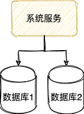
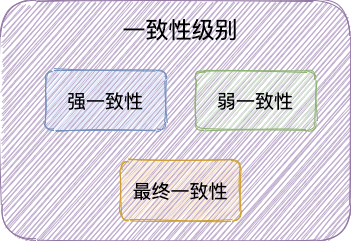
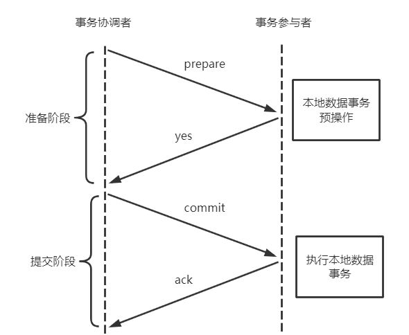
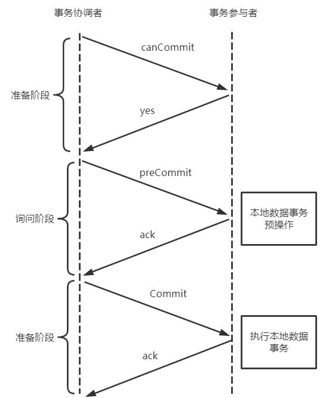
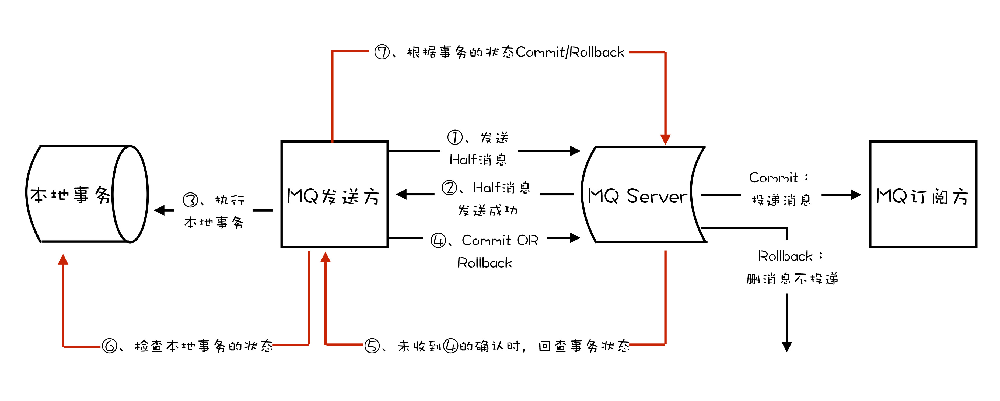
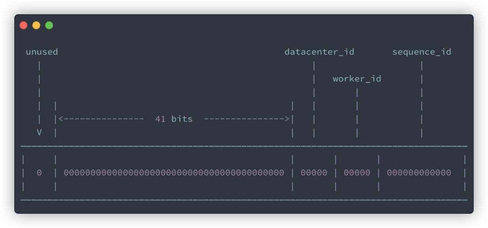

# 提出

微服务架构下，一个系统被拆分为多个小的微服务，每个微服务部署在不同的机器上，并且每个微服务可能都有一个单独的数据。这种情况下，一组事务操作可能会涉及到多个微服务以及多个数据库。比如电商系统，创建一个订单会涉及到订单服务和库存服务

 

# 分布式事务

当单个数据库的性能达到瓶颈或数据量太大，我们需要进行分库。分库之后，单个操作可能会涉及到多个数据库，那么数据库自带的事务无法满足要求。

分布式事务的目标就是：保证系统中多个相关联的数据库中的数据一致性

 

# 基础理论

分布式事务也属于事务，那么就要遵守ACID。但是考虑性能、可用性方面因素，无法完全满足ACID，因此只能选择折中的方案

 

## CAP和BASE理论

分布式领域的重要理论

### CAP理论

CAP就是指——Consistency一致性、Availability可用性、Partition Tolerance分区容错性

在理论计算机科学中，CAP 定理指出对于一个分布式系统来说，当设计读写操作时，只能同时满足以下三点中的两个：

- **一致性（Consistency）** : 所有节点访问同一份最新的数据副本
- **可用性（Availability）**: 非故障的节点在合理的时间内返回合理的响应（不是错误或者超时的响应）。
- **分区容错性（Partition tolerance）** : 分布式系统出现网络分区的时候，仍然能够对外提供服务

网络分区：分布式系统中，多个节点之前的网络本来是连通的，但是因为某些故障（比如部分节点网络出了问题）某些节点之间不连通了，整个网络就分成了几块区域，这就叫网络分区


**CAP 理论中分区容错性 P 是一定要满足的，在此基础上，只能满足可用性 A 或者一致性 C**

**分布式系统理论上不可能选择 CA 架构，只能选择 CP 或者 AP 架构。** 比如 ZooKeeper、HBase 就是 CP 架构，Cassandra、Eureka 就是 AP 架构，Nacos 不仅支持 CP 架构也支持 AP 架构


**为啥不可能选择 CA 架构呢？** 举个例子：若系统出现“分区”，系统中的某个节点在进行写操作。为了保证 C， 必须要禁止其他节点的读写操作，这就和 A 发生冲突了。如果为了保证 A，其他节点的读写操作正常的话，那就和 C 发生冲突了。

**选择 CP 还是 AP 的关键在于当前的业务场景，没有定论，比如对于需要确保强一致性的场景如银行一般会选择保证 CP 。**


#### CAP实际应用案例

参考：https://juejin.cn/post/6844903936718012430#heading-14

##### 注册中心

注册中心负责服务地址的注册与查找

常见的可以作为注册中心的组件有：ZooKeeper、Eureka、Nacos...。

1. **ZooKeeper 保证的是 CP。** 任何时刻对 ZooKeeper 的读请求都能得到一致性的结果，但是， ZooKeeper 不保证每次请求的可用性比如在 Leader 选举过程中或者半数以上的机器不可用的时候服务就是不可用的。
2. **Eureka 保证的则是 AP。** Eureka 在设计的时候就是优先保证 A （可用性）。在 Eureka 中不存在什么 Leader 节点，每个节点都是一样的、平等的。因此 Eureka 不会像 ZooKeeper 那样出现选举过程中或者半数以上的机器不可用的时候服务就是不可用的情况。 Eureka 保证即使大部分节点挂掉也不会影响正常提供服务，只要有一个节点是可用的就行了。只不过这个节点上的数据可能并不是最新的。
3. **Nacos 不仅支持 CP 也支持 AP。**


对于服务注册来说，针对同一个服务，即使注册中心的不同节点保存的服务注册信息不相同，也并不会造成灾难性的后果，对于服务消费者来说，能消费才是最重要的，就算拿到的数据不是最新的数据，消费者本身也可以进行尝试失败重试。总比为了追求数据的一致性而获取不到实例信息整个服务不可用要好。

所以，对于服务注册来说，可用性比数据一致性更加的重要，选择AP。


##### 分布式锁

这里实现分布式锁的方式选取了三种：

- 基于数据库实现分布式锁
- 基于redis实现分布式锁
- 基于zookeeper实现分布式锁


###### 基于redis实现分布式锁

redis单线程串行处理天然就是解决串行化问题，用来解决分布式锁是再适合不过。

```shell
setnx key value Expire_time
获取到锁 返回 1 ， 获取失败 返回 0
```

为了解决数据库锁的无主从切换的问题，可以选择redis集群，或者是 sentinel 哨兵模式，实现主从故障转移，当master节点出现故障，哨兵会从slave中选取节点，重新变成新的master节点。

哨兵模式故障转移是由sentinel集群进行监控判断，当maser出现异常即复制中止，重新推选新slave成为master，sentinel在重新进行选举并不在意主从数据是否复制完毕具备一致性。

所以redis的复制模式是属于**AP**的模式。保证可用性，在主从复制中“主”有数据，但是可能“从”还没有数据，这个时候，一旦主挂掉或者网络抖动等各种原因，可能会切换到“从”节点，这个时候可能会导致两个业务县城同时获取得两把锁


上述的问题其实并不是redis的缺陷，只是redis采用了AP模型，它本身无法确保我们对一致性的要求。redis官方推荐redlock算法来保证，问题是redlock至少需要三个redis主从实例来实现，维护成本比较高，相当于redlock使用三个redis集群实现了自己的另一套一致性算法，比较繁琐，在业界也使用得比较少。

能不能使用redis作为分布式锁，这个本身就不是redis的问题，还是取决于业务场景，我们先要自己确认我们的场景是适合 AP 还是 CP ， 如果在社交发帖等场景下，我们并没有非常强的事务一致性问题，redis提供给我们高性能的AP模型是非常适合的，但如果是交易类型，对数据一致性非常敏感的场景，我们可能要寻在一种更加适合的 CP 模型


###### 基于zookeeper实现分布式锁

zk的模式是CP模型，也就是说，当zk锁提供给我们进行访问的时候，在zk集群中能确保这把锁在zk的每一个节点都存在。（这个实际上是zk的leader通过二阶段提交写请求来保证的，这个也是zk的集群规模大了的一个瓶颈点）

zk锁实现的原理：利用“有序节点”的特性，有序节点能严格保证各个子节点按照排序命名生成，当一个线程获取到最小序的节点，说明获取到了锁。


#### 总结

在进行分布式系统设计和开发时，我们不应该仅仅局限在 CAP 问题上，还要关注系统的扩展性、可用性等等

在系统发生“分区”的情况下，CAP 理论只能满足 CP 或者 AP。要注意的是，这里的前提是系统发生了“分区”

如果系统没有发生“分区”的话，节点间的网络连接通信正常的话，也就不存在 P 了。这个时候，我们就可以同时保证 C 和 A 了。

总结：**如果系统发生“分区”，我们要考虑选择 CP 还是 AP。如果系统没有发生“分区”的话，我们要思考如何保证 CA 。**


### BASE理论

**BASE** 是 **Basically Available（基本可用）** 、**Soft-state（软状态）** 和 **Eventually Consistent（最终一致性）** 三个短语的缩写。BASE 理论是对 CAP 中一致性 C 和可用性 A 权衡的结果，其来源于对大规模互联网系统分布式实践的总结，是基于 CAP 定理逐步演化而来的，它大大降低了我们对系统的要求


### 核心思想

即使无法做到强一致性，但每个应用都可以根据自身业务特点，采用适当的方式来使系统达到最终一致性。也就是牺牲数据的一致性来满足系统的高可用性，系统中一部分数据不可用或者不一致时，仍需要保持系统整体“主要可用”。**本质上是对 CAP 的延伸和补充，更具体地说，是对 CAP 中 AP 方案的一个补充。**


### 三要素

#### 1. 基本可用

基本可用是指分布式系统在出现不可预知故障的时候，允许损失部分可用性。但是，这绝不等价于系统不可用。

**什么叫允许损失部分可用性呢？**

- **响应时间上的损失**: 正常情况下，处理用户请求需要 0.5s 返回结果，但是由于系统出现故障，处理用户请求的时间变为 3 s。
- **系统功能上的损失**：正常情况下，用户可以使用系统的全部功能，但是由于系统访问量突然剧增，系统的部分非核心功能无法使用。

#### 2. 软状态

软状态指允许系统中的数据存在中间状态（**CAP 理论中的数据不一致**），并认为该中间状态的存在不会影响系统的整体可用性，即允许系统在不同节点的数据副本之间进行数据同步的过程存在延时。

#### 3. 最终一致性

最终一致性强调的是系统中所有的数据副本，在经过一段时间的同步后，最终能够达到一个一致的状态。因此，最终一致性的本质是需要系统保证最终数据能够达到一致，而不需要实时保证系统数据的强一致性。

那实现最终一致性的具体方式是什么呢? [《分布式协议与算法实战》](http://gk.link/a/10rZM) 中是这样介绍：

- **读时修复** : 在读取数据时，检测数据的不一致，进行修复。比如 Cassandra 的 Read Repair 实现，具体来说，在向 Cassandra 系统查询数据的时候，如果检测到不同节点 的副本数据不一致，系统就自动修复数据。
- **写时修复** : 在写入数据，检测数据的不一致时，进行修复。比如 Cassandra 的 Hinted Handoff 实现。具体来说，Cassandra 集群的节点之间远程写数据的时候，如果写失败 就将数据缓存下来，然后定时重传，修复数据的不一致性。
- **异步修复** : 这个是最常用的方式，通过定时对账检测副本数据的一致性，并修复。

### 总结

**ACID 是数据库事务完整性的理论，CAP 是分布式系统设计理论，BASE 是 CAP 理论中 AP 方案的延伸。**

# 一致性的三种级别



- 强一致性（刚性事务，2PC，3PC）：系统写入什么，读出来的就是什么


- 弱一致性：不一定可以读取到最新的写入值，也不保证多少时间之后读取到最新的数据，只是会尽量保证某个时刻达到数据一致的状态


- 最终一致性（柔性事务，BASE理论，TCC，Saga，MQ事务，本地消息表）：弱一致性的升级版。系统会保证在一定时间内达到数据一致的状态


 

# 分布式解决方案

2PC、3PC、TCC、MQ事务（Kafka和RocketMQ都提供了事务相关功能）、Saga等。这些方案的使用场景有所区别，需要根据具体的场景选择合适的解决方案

 

## 2PC（两阶段提交协议）

2PC讲事务的提交过程分成：准备阶段和提交阶段

### 准备阶段

准备阶段的核心是“询问”事务参与者执行本地数据库事务操作是否成功

- 事务协调者向所有参与者发送消息询问
- 事务参与者接收到消息后，开支执行本地数据库事务预操作，此时不会提交事务
- 事务参与者如果本地数据库事务执行成功，就会回复“就绪”


### 提交阶段

提交阶段的核心是“询问”事务参与者提交事务是否成功

- 事务协调者向所有参与者发送“提交”命令（commit消息）
- 参与者收到commit后，提交本地数据库事务，完成后释放资源
- 参与者回复：事务已经提交（ack消息）
- 协调者收到所有参与者的ack消息后，整个分布式事务过程正式结束




### 总结

1、准备阶段的主要目的是测试参与者能否执行本地数据库事务操作

2、提交阶段，协调者会根据准备阶段中参与者反馈的消息来决定是执行事务还是回滚操作

3、提交阶段之后结束分布式事务

4、优点：实现简单，MySQL有自己的实现；强一致性

5、存在的问题：同步阻塞，事务参与者在正式提交事务前会一直占用相关资源；数据不一致，由于网络问题或者协调者宕机有可能造成数据不一致，比如在提交阶段，部分网络出现问题导致部分参与者收不到commit/rollback；单点问题，协调者在准备阶段完成之后挂掉了，参与者会一直阻塞在第二阶段


## 3PC

在2PC的基础上做了优化，将2PC的准备阶段细化分成了两个阶段：

询问阶段：只会询问事务参与者能否执行本地数据库事务操作

准备阶段：所有参与者返回“可执行”后，参与者才会执行本地数据库事务预操作，比如写redo log/undo log日志



 3PC还引入了超时机制来避免参与者一直阻塞占用资源

## TCC（补偿事务）

是一种柔性事务方案。TCC是Try、Confirm、Cancel的缩写，它分为三个阶段：

- Try：尝试执行。完成业务检查，预留必需的业务资源
- Confirm：确认执行。所有参与者的Try阶段成功就会执行Confirm，Confirm阶段会处理Try阶段预留的业务资源
- Cancel：取消执行，释放Try阶段预留的业务资源、

基于TCC实现的框架：ByteTCC、Seata

 

## MQ事务

 RocketMQ，Kafka都提供了事务相关的功能。事务允许事件流应用将消费，处理，生产消息整个过程定位一个原子操作




# 分布式ID

## 简介

日常开发中，我们需要对系统中的各种数据使用 ID **唯一表示**，比如用户 ID 对应且仅对应一个人，商品 ID 对应且仅对应一件商品，订单 ID 对应且仅对应一个订单。

分布式 ID 是分布式系统下的 ID。在分布式系统下，数据遍布在不同服务器上的数据库，数据库的自增主键已经没办法满足生成的主键唯一了。为了保证数据ID补冲突，这个时候就需要生成**分布式 ID**了。

一个最基本的分布式 ID 需要满足下面这些要求：

- **全局唯一** ：ID 的全局唯一性肯定是首先要满足的！
- **高性能** ： 分布式 ID 的生成速度要快，对本地资源消耗要小。
- **高可用** ：生成分布式 ID 的服务要保证可用性无限接近于 100%。
- **方便易用** ：拿来即用，使用方便，快速接入！

除了这些之外，一个比较好的分布式 ID 还应保证：

- **安全** ：ID 中不包含敏感信息。
- **有序递增** ：如果要把 ID 存放在数据库的话，ID 的有序性可以提升数据库写入速度。并且，很多时候 ，我们还很有可能会直接通过 ID 来进行排序。
- **有具体的业务含义** ：生成的 ID 如果能有具体的业务含义，可以让定位问题以及开发更透明化（通过 ID 就能确定是哪个业务）。
- **独立部署** ：也就是分布式系统单独有一个发号器服务，专门用来生成分布式 ID。这样就生成 ID 的服务可以和业务相关的服务解耦。不过，这样同样带来了网络调用消耗增加的问题。总的来说，如果需要用到分布式 ID 的场景比较多的话，独立部署的发号器服务还是很有必要的。


## 分布式ID常见的解决方案

### 数据库

1、数据库主键自增：通过关系型数据库的自增主键产生唯一ID

通过`replace into`来插入数据，其步骤是尝试把数据插入表中，如果主键或唯一索引字段出现重复数据错误而插入失败，就会先从表中删除含有重复关键字值的冲突行，然后再尝试把数据插入到表中

这种方式的优缺点也比较明显：

- **优点** ：实现起来比较简单、ID 有序递增、存储消耗空间小
- **缺点** ： 支持的并发量不大、存在数据库单点问题（可以使用数据库集群解决，不过增加了复杂度）、ID 没有具体业务含义、安全问题（比如根据订单 ID 的递增规律就能推算出每天的订单量，商业机密啊！ ）、每次获取 ID 都要访问一次数据库（增加了对数据库的压力，获取速度也慢）


2、数据库号段模式：数据库主键自增这种模式，每次获取 ID 都要访问一次数据库，ID 需求比较大的时候，肯定是不行的。可以批量获取，然后存在在内存里面，需要用到的时候，直接从内存里面拿。

数据库的号段模式也是目前比较主流的一种分布式 ID 生成方式。像滴滴开源的[Tinyid](https://github.com/didi/tinyid/wiki/tinyid原理介绍) 就是基于这种方式来做的。不过，TinyId 使用了双号段缓存、增加多 db 支持等方式来进一步优化。

以MySQL举例

```mysql
CREATE TABLE `sequence_id_generator` (
  `id` int(10) NOT NULL,
  `current_max_id` bigint(20) NOT NULL COMMENT '当前最大id',
  `step` int(10) NOT NULL COMMENT '号段的长度',
  `version` int(20) NOT NULL COMMENT '版本号',
  `biz_type`    int(20) NOT NULL COMMENT '业务类型',
   PRIMARY KEY (`id`)
) ENGINE=InnoDB DEFAULT CHARSET=utf8mb4;
```

`current_max_id` 字段和`step`字段主要用于获取批量 ID，获取的批量 id 为： `current_max_id ~ current_max_id+step`。`version` 字段主要用于解决并发问题（乐观锁）,`biz_type` 主要用于表示业务类型。

**2.先插入一行数据。**

```mysql
INSERT INTO `sequence_id_generator` (`id`, `current_max_id`, `step`, `version`, `biz_type`)
VALUES
	(1, 0, 100, 0, 101);
```

**3.通过 SELECT 获取指定业务下的批量唯一 ID**

```mysql
SELECT `current_max_id`, `step`,`version` FROM `sequence_id_generator` where `biz_type` = 101
```

结果：

```mysql
id	current_max_id	step	version	biz_type
1	0	100	0	101
```

**4.不够用的话，更新之后重新 SELECT 即可。**

```mysql
UPDATE sequence_id_generator SET current_max_id = 0+100, version=version+1 WHERE version = 0  AND `biz_type` = 101
SELECT `current_max_id`, `step`,`version` FROM `sequence_id_generator` where `biz_type` = 101
```

结果：

```
id	current_max_id	step	version	biz_type
1	100	100	1	101
```

相比于数据库主键自增的方式，**数据库的号段模式对于数据库的访问次数更少，数据库压力更小。**

- **优点** ：ID 有序递增、存储消耗空间小
- **缺点** ：存在数据库单点问题（可以使用数据库集群解决，不过增加了复杂度）、ID 没有具体业务含义、安全问题（比如根据订单 ID 的递增规律就能推算出每天的订单量，商业机密啊！ ）


### NoSQL

一般情况下，NoSQL 方案使用 Redis 多一些。我们通过 Redis 的 `incr` 命令即可实现对 id 原子顺序递增。

```shell
127.0.0.1:6379> set sequence_id_biz_type 1
OK
127.0.0.1:6379> incr sequence_id_biz_type
(integer) 2
127.0.0.1:6379> get sequence_id_biz_type
"2"
```

**Redis 方案的优缺点：**

- **优点** ： 性能不错并且生成的 ID 是有序递增的
- **缺点** ： 和数据库主键自增方案的缺点类似

除了 Redis 之外，MongoDB ObjectId 经常也会被拿来当做分布式 ID 的解决方案。

MongoDB ObjectId 一共需要 12 个字节存储：

- 0~3：时间戳
- 3~6： 代表机器 ID
- 7~8：机器进程 ID
- 9~11 ：自增值

**MongoDB 方案的优缺点：**

- **优点** ： 性能不错并且生成的 ID 是有序递增的
- **缺点** ： 需要解决重复 ID 问题（当机器时间不对的情况下，可能导致会产生重复 ID） 、有安全性问题（ID 生成有规律性）


### 算法

#### UUID

UUID 是 Universally Unique Identifier（通用唯一标识符） 的缩写。UUID 包含 32 个 16 进制数字（8-4-4-4-12）。

JDK 就提供了现成的生成 UUID 的方法，一行代码就行了。

```java
//输出示例：cb4a9ede-fa5e-4585-b9bb-d60bce986eaa
UUID.randomUUID()
```

UUID有5种不同的版本，每个版本的生成规则不同。

5 种不同的 Version(版本)值分别对应的含义（参考[维基百科对于 UUID 的介绍](https://zh.wikipedia.org/wiki/通用唯一识别码)）：

- **版本 1** : UUID 是根据时间和节点 ID（通常是 MAC 地址）生成；
- **版本 2** : UUID 是根据标识符（通常是组或用户 ID）、时间和节点 ID 生成；
- **版本 3、版本 5** : 版本 5 - 确定性 UUID 通过散列（hashing）名字空间（namespace）标识符和名称生成；
- **版本 4** : UUID 使用[随机性](https://zh.wikipedia.org/wiki/随机性)或[伪随机性](https://zh.wikipedia.org/wiki/伪随机性)生成。

从上面的介绍中可以看出，UUID 可以保证唯一性，因为其生成规则包括 MAC 地址、时间戳、名字空间（Namespace）、随机或伪随机数、时序等元素，计算机基于这些规则生成的 UUID 是肯定不会重复的。

虽然，UUID 可以做到全局唯一性，但是，我们一般很少会使用它。

比如使用 UUID 作为 MySQL 数据库主键的时候就非常不合适：

- 数据库主键要尽量越短越好，而 UUID 的消耗的存储空间比较大（32 个字符串，128 位）。
- UUID 是无顺序的，InnoDB 引擎下，数据库主键的无序性会严重影响数据库性能。

最后，我们再简单分析一下 **UUID 的优缺点**  :

- **优点** ：生成速度比较快、简单易用
- **缺点** ： 存储消耗空间大（32 个字符串，128 位） 、 不安全（基于 MAC 地址生成 UUID 的算法会造成 MAC 地址泄露)、无序（非自增）、没有具体业务含义、需要解决重复 ID 问题（当机器时间不对的情况下，可能导致会产生重复 ID）


#### Snowflake雪花算法

Snowflake 是 Twitter 开源的分布式 ID 生成算法。Snowflake 由 64 bit 的二进制数字组成，这 64bit 的二进制被分成了几部分，每一部分存储的数据都有特定的含义：

- **第 0 位**： 符号位（标识正负），始终为 0，没有用，不用管。
- **第 1~41 位** ：一共 41 位，用来表示时间戳，单位是毫秒，可以支撑 2 ^41 毫秒（约 69 年）
- **第 42~52 位** ：一共 10 位，一般来说，前 5 位表示机房 ID，后 5 位表示机器 ID（实际项目中可以根据实际情况调整）。这样就可以区分不同集群/机房的节点。
- **第 53~64 位** ：一共 12 位，用来表示序列号。 序列号为自增值，代表单台机器每毫秒能够产生的最大 ID 数(2^12 = 4096),也就是说单台机器每毫秒最多可以生成 4096 个 唯一 ID。



有很多基于 Snowflake 算法的开源实现比如美团 的 Leaf、百度的 UidGenerator，并且这些开源实现对原有的 Snowflake 算法进行了优化。

另外，在实际项目中，我们一般也会对 Snowflake 算法进行改造，最常见的就是在 Snowflake 算法生成的 ID 中加入业务类型信息。

Snowflake 算法的优缺点 ：

- **优点** ：生成速度比较快、生成的 ID 有序递增、比较灵活（可以对 Snowflake 算法进行简单的改造比如加入业务 ID）
- **缺点** ： 需要解决重复 ID 问题（依赖时间，当机器时间不对的情况下，可能导致会产生重复 ID）。


### 开源框架

#### UidGenerator(百度)

#### Leaf(美团)

#### Tinyid(滴滴)