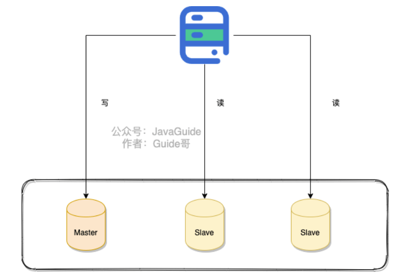
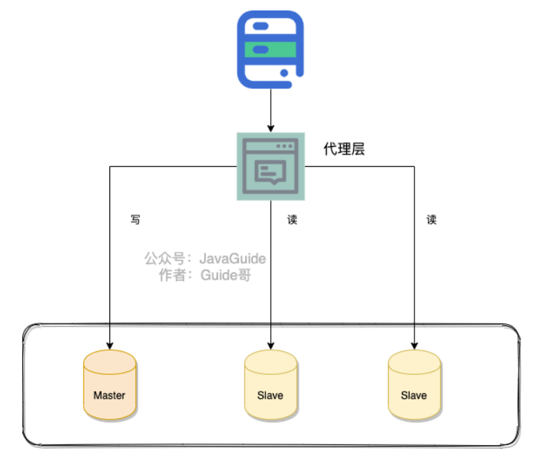
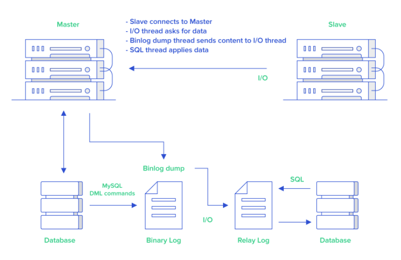
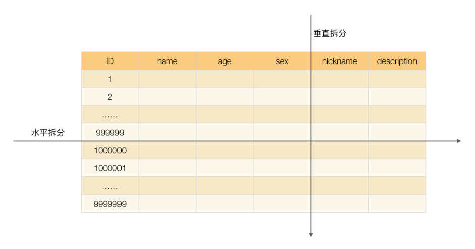

# 读写分离

## 什么是读写分离

**读写分离主要是为了将对数据库的读写操作分散到不同的数据库节点上。** 这样的话，就能够小幅提升写性能，大幅提升读性能

一般情况下，我们都会选择**一主多从**，也就是一台主数据库负责写，其他的从数据库负责读。主库和从库之间会进行**数据同步**，以保证从库中数据的准确性。这样的架构实现起来比较简单，并且也符合系统的写少读多的特点

## 读写分离带来的问题以及解决

读写分离对于提升数据库的并发非常有效，但是，同时也会引来一个问题：主库和从库的数据存在延迟，比如你写完主库之后，主库的数据同步到从库是需要时间的，这个时间差就导致了主库和从库的数据不一致性问题。这也就是我们经常说的 **主从同步延迟**

解决：

**1.强制将读请求路由到主库处理**

**2.延迟读取**：对于一些对数据比较敏感的场景，你可以在完成写请求之后，避免立即进行请求操作。比如你支付成功之后，跳转到一个支付成功的页面，当你点击返回之后才返回自己的账户

## 如何实现读写分离

不论是使用哪一种读写分离具体的实现方案，想要实现读写分离一般包含如下几步：

1. 部署多台数据库，选择其中的一台作为主数据库，其他的一台或者多台作为从数据库。
2. 保证主数据库和从数据库之间的数据是实时同步的，这个过程也就是我们常说的**主从复制**。
3. 系统将写请求交给主数据库处理，读请求交给从数据库处理。

落实到项目本身的话，常用的方式有两种：

**1.代理方式**

我们可以在应用和数据中间加了一个代理层。应用程序所有的数据请求都交给代理层处理，代理层负责分离读写请求，将它们路由到对应的数据库中。

提供类似功能的中间件有 **MySQL Router**（官方）、**Atlas**（基于 MySQL Proxy）、**Maxscale**、**MyCat**

**2.组件方式**

在这种方式中，我们可以通过引入第三方组件来帮助我们读写请求。

这也是我比较推荐的一种方式。这种方式目前在各种互联网公司中用的最多的，相关的实际的案例也非常多。如果你要采用这种方式的话，推荐使用 `sharding-jdbc` ，直接引入 jar 包即可使用，非常方便。同时，也节省了很多运维的成本

## 主从复制原理

MySQL binlog(binary log 即二进制日志文件) 主要记录了 MySQL 数据库中数据的所有变化(数据库执行的所有 DDL 和 DML 语句)。因此，我们根据主库的 MySQL binlog 日志就能够将主库的数据同步到从库中

1. 主库将数据库中数据的变化写入到 binlog
2. 从库连接主库
3. 从库会创建一个 I/O 线程向主库请求更新的 binlog
4. 主库会创建一个 binlog dump 线程来发送 binlog ，从库中的 I/O 线程负责接收
5. 从库的 I/O 线程将接收的 binlog 写入到 relay log 中。
6. 从库的 SQL 线程读取 relay log 同步数据本地（也就是再执行一遍 SQL ）。

看到 binlog 就要想到主从复制。当然，除了主从复制之外，binlog 还能帮助我们实现数据恢复

**MySQL 主从复制是依赖于 binlog 。另外，常见的一些同步 MySQL 数据到其他数据源的工具（比如 canal）的底层一般也是依赖 binlog**

# 分库分表

读写分离主要应对的是数据库读并发；分库分表主要解决MySQL的存储压力

## 分库

分库就是将数据库中的数据分散到不同的数据库上

下面这些操作都涉及到了分库：

- 你将数据库中的用户表和用户订单表分别放在两个不同的数据库。
- 由于用户表数据量太大，你对用户表进行了水平切分，然后将切分后的 2 张用户表分别放在两个不同的数据库

## 分表

**分表** 就是对单表的数据进行拆分，可以是垂直拆分，也可以是水平拆分

**何为垂直拆分？**

简单来说，垂直拆分是对数据表列的拆分，把一张列比较多的表拆分为多张表。

举个例子：我们可以将用户信息表中的一些列单独抽出来作为一个表。

**何为水平拆分？**

简单来说，水平拆分是对数据表行的拆分，把一张行比较多的表拆分为多张表。

举个例子：我们可以将用户信息表拆分成多个用户信息表，这样就可以避免单一表数据量过大对性能造成影响

## 什么情况下需要分库分表

遇到下面几种场景可以考虑分库分表：

- 单表的数据达到千万级别以上，数据库读写速度比较缓慢（分表）。
- 数据库中的数据占用的空间越来越大，备份时间越来越长（分库）。
- 应用的并发量太大（分库）

## 分库分表带来的问题

- **join 操作** ： 同一个数据库中的表分布在了不同的数据库中，导致无法使用 join 操作。这样就导致我们需要手动进行数据的封装，比如你在一个数据库中查询到一个数据之后，再根据这个数据去另外一个数据库中找对应的数据。
- **事务问题** ：同一个数据库中的表分布在了不同的数据库中，如果单个操作涉及到多个数据库，那么数据库自带的事务就无法满足我们的要求了。
- **分布式 id** ：分库之后， 数据遍布在不同服务器上的数据库，数据库的自增主键已经没办法满足生成的主键唯一了。我们如何为不同的数据节点生成全局唯一主键呢？这个时候，我们就需要为我们的系统引入分布式 id 了。
- ......

## 推荐的方案

ShardingSphere 项目

ShardingSphere 绝对可以说是当前分库分表的首选！ShardingSphere 的功能完善，除了支持读写分离和分库分表，还提供分布式事务、数据库治理等功能

## 分库分表后，数据怎么迁移

停机迁移

双写方案：

- 我们对老库的更新操作（增删改），同时也要写入新库（双写）。如果操作的数据不存在于新库的话，需要插入到新库中。 这样就能保证，咱们新库里的数据是最新的。
- 在迁移过程，双写只会让被更新操作过的老库中的数据同步到新库，我们还需要自己写脚本将老库中的数据和新库的数据做比对。如果新库中没有，那咱们就把数据插入到新库。如果新库有，旧库没有，就把新库对应的数据删除（冗余数据清理）。
- 重复上一步的操作，直到老库和新库的数据一致为止