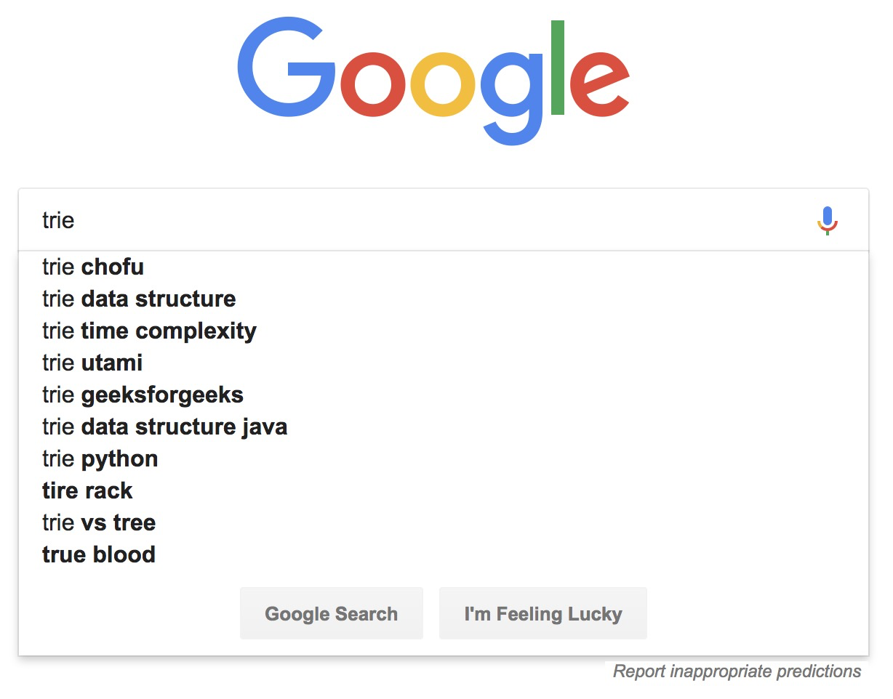

# Trie树


## 概述

Trie 树，也叫“字典树”。顾名思义，它是一个树形结构。它是一种专门处理字符串匹配的数据结构，用来解决在**一组字符串集合中快速查找某个字符串**的问题。


Trie树的本质，就是利用字符串之间的公共前缀，将重复的前缀合并在一起。如图所示，其中根节点不包含任何信息。每个节点表示一个字符串中的一个字符，从根节点到红色节点表示一个字符串。


## 实现

Trie树是一个多叉树，那么对于Trie的节点就需要一个数组来保存其子节点。假设字符集只有a到z26个字母，那么每个节点就需要一个大小为26的数组保存子节点指针。


代码实现

```java

public class Trie {
  private TrieNode root = new TrieNode('/'); // 存储无意义字符

  // 往Trie树中插入一个字符串
  public void insert(char[] text) {
    TrieNode p = root;
    for (int i = 0; i < text.length; ++i) {
      int index = text[i] - 'a';
      if (p.children[index] == null) {
        TrieNode newNode = new TrieNode(text[i]);
        p.children[index] = newNode;
      }
      p = p.children[index];
    }
    p.isEndingChar = true;
  }

  // 在Trie树中查找一个字符串
  public boolean find(char[] pattern) {
    TrieNode p = root;
    for (int i = 0; i < pattern.length; ++i) {
      int index = pattern[i] - 'a';
      if (p.children[index] == null) {
        return false; // 不存在pattern
      }
      p = p.children[index];
    }
    if (p.isEndingChar == false) return false; // 不能完全匹配，只是前缀
    else return true; // 找到pattern
  }

  public class TrieNode {
    public char data;
    public TrieNode[] children = new TrieNode[26];
    public boolean isEndingChar = false;
    public TrieNode(char data) {
      this.data = data;
    }
  }
}
```


## 时间复杂度

构建Trie树的过程需要扫描所有的字符串，时间复杂度是O(n)（n表示所有字符串的长度和）。

要查询的字符串长度为k，那么只需要比较大约k个节点就能完成查询操作，时间复杂度是O(k)


## Trie 树与散列表、红黑树的比较

Tri树是一种非常高效的字符串匹配方法，但是非常的耗费内存，那每个节点都要存储一个长度为 26 的数组，并且每个数组元素要存储指针。而且，即便一个节点只有很少的子节点，远小于 26 个，也要维护一个长度为 26 的数组。

Trie树的优化思路：

1. 牺牲一点查询效率，将每个节点中的数组换成其他数据结构来存储一个节点的子节点指针，比如有序数组、跳表、散列表、红黑树等。
2. 解决内存消耗问题，比如缩点优化，就是对只有一个子节点的节点，而且此节点不是一个串的结束节点，可以将此节点与子节点合并


在一组字符串中查找字符串，Trie 树实际上表现得并不好。它对要处理的字符串有极其严苛的要求。

- 字符串中包含的字符集不能太大
- 要求字符串的前缀重合比较多
- 指针穿起来的数据库是不连续的，Trie树中使用到了指针，对缓存不友好

实际上，Trie 树只是不适合精确匹配查找，这种问题更适合用散列表或者红黑树来解决。Trie 树比较适合的是查找前缀匹配的字符串，比如搜索关键词的提示功能、自动输入补全等。




## 小结

Trie 树是一种解决字符串快速匹配问题的数据结构。如果用来构建 Trie 树的这一组字符串中，前缀重复的情况不是很多，那 Trie 树这种数据结构总体上来讲是比较费内存的，是一种**空间换时间**的解决问题思路。

Trie 树的优势并不在于，用它来做动态集合数据的查找，因为，这个工作完全可以用更加合适的散列表或者红黑树来替代。Trie 树最有优势的是查找前缀匹配的字符串，比如搜索引擎中的关键词提示功能这个场景，就比较适合用它来解决，也是 Trie 树比较经典的应用场景。