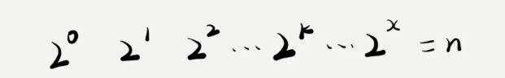

# 一 复杂度分析（上）：如何分析、统计算法的执行效率和资源消耗


## 为什么需要复杂度分析

1、测试结果非常依赖测试环境

测试环境中硬件的不同会对测试结果有很大的影响。

2、测试结果受数据规模的影响很大

对同一个排序算法，待排序数据的有序度不一样，排序的执行时间就会有很大的差别。极端情况下，如果数据已经是有序的，那排序算法不需要做任何操作，执行时间就会非常短。除此之外，如果测试数据规模太小，测试结果可能无法真实地反映算法的性能。比如，对于小规模的数据排序，插入排序可能反倒会比快速排序要快。


## 大O复杂度表示法

所有代码的执行时间 T(n) 与每行代码的执行次数 f(n) 成正比


T(n) 表示代码执行的时间；n 表示数据规模的大小；f(n) 表示每行代码执行的次数总和。因为这是一个公式，所以用 f(n) 来表示。公式中的 O，表示代码的执行时间 T(n) 与 f(n) 表达式成正比

大 O 时间复杂度实际上并不具体表示代码真正的执行时间，而是表示代码执行时间随数据规模增长的变化趋势，所以，也叫作渐进时间复杂度（asymptotic time complexity），简称时间复杂度

当 n 很大时，可以把它想象成 10000、100000。而公式中的**低阶、常量、系数**三部分并不左右增长趋势，所以都可以忽略。只需要记录一个最大量级就可以了，如T(n) = O(n)； T(n) = O(n2)


### 时间复杂度分析

1、只关注循环执行次数最多的一段代码

2、加法法则：总复杂度等于量级最大的那段代码的复杂度

3、乘法法则：嵌套代码的复杂度等于嵌套内外代码复杂度的乘积


#### 几种常见时间复杂度实例分析


1、O(logn)、O(nlogn)

```java

 i=1;
 while (i <= n)  {
   i = i * 2;
 }
```

从代码中可以看出，变量 i 的值从 1 开始取，每循环一次就乘以 2。当大于 n 时，循环结束。变量 i 的取值就是一个等比数列



通过 2x=n 求解 x 这个问题，x=log2n，所以，这段代码的时间复杂度就是 O(log2n)


2、O(m+n)、O(m*n)

代码的复杂度由两个数据的规模来决定

```java

int cal(int m, int n) {
  int sum_1 = 0;
  int i = 1;
  for (; i < m; ++i) {
    sum_1 = sum_1 + i;
  }

  int sum_2 = 0;
  int j = 1;
  for (; j < n; ++j) {
    sum_2 = sum_2 + j;
  }

  return sum_1 + sum_2;
}
```

### 空间复杂度分析

空间复杂度全称就是渐进空间复杂度（asymptotic space complexity），表示算法的存储空间与数据规模之间的增长关系


# 二 复杂度分析（下）：浅析最好、最坏、平均、均摊时间复杂度

## 最好、最坏情况时间复杂度

最好情况时间复杂度就是，在最理想的情况下，执行这段代码的时间复杂度。在最理想的情况下，要查找的变量 x 正好是数组的第一个元素，这个时候对应的时间复杂度就是最好情况时间复杂度。

最坏情况时间复杂度就是，在最糟糕的情况下，执行这段代码的时间复杂度。如果数组中没有要查找的变量 x，我们需要把整个数组都遍历一遍才行，所以这种最糟糕情况下对应的时间复杂度就是最坏情况时间复杂度

```java

// n表示数组array的长度
int find(int[] array, int n, int x) {
  int i = 0;
  int pos = -1;
  for (; i < n; ++i) {
    if (array[i] == x) {
       pos = i;
       break;
    }
  }
  return pos;
}
```

## 平均情况时间复杂度

要查找的变量 x 在数组中的位置，有 n+1 种情况：在数组的 0～n-1 位置中和不在数组中。我们把每种情况下，查找需要遍历的元素个数累加起来，然后再除以 n+1，就可以得到需要遍历的元素个数的平均值


要查找的变量 x，要么在数组里，要么就不在数组里。假设在数组中与不在数组中的概率都为 1/2。另外，要查找的数据出现在 0～n-1 这 n 个位置的概率也是一样的，为 1/n。所以，根据概率乘法法则，要查找的数据出现在 0～n-1 中任意位置的概率就是 1/(2n)

把每种情况发生的概率也考虑进去，那平均时间复杂度的计算过程就变成了这样


# 三 贪心算法

经典应用：霍夫曼编码、Prim和Kruskal最小生成树算法、Dijkstra单源最短路径算法


## 如何理解“贪心算法”

- 当看到这类问题时，首先联想导贪心算法：针对一组数据，定义了限制值和期望值，在满足限制值的情况下，期望值最大
- 尝试是否可以用贪心算法解决：每次选择当前情况下，在对限制值同等贡献量的情况下，对期望值贡献最大的数据
- 举几个例子看下贪心算法产生的结果是否是最优的


## 贪心算法实战分析


### 分糖果


### 钱币找零


### 区间覆盖


### 霍夫曼编码

- 文本中有多少个字符，以及每个字符出现的频率，根据频率的不同，选择不同长度的编码，通过用不等长的编码方法，进一步压缩
- 由于编码是不等长得，为了避免解压缩过程中的歧义，各个字符的编码之间，不会出现某个编码是另一个编码前缀的情况

编码过程：

把每个字符看作一个节点，并且附带着把频率放到优先级队列中。我们从队列中取出频率最小的两个节点 A、B，然后新建一个节点 C，把频率设置为两个节点的频率之和，并把这个新节点 C 作为节点 A、B 的父节点。最后再把 C 节点放入到优先级队列中。重复这个过程，直到队列中没有数据。


# 四 分治算法

分治算法（divide and conquer）的核心思想其实就是四个字，**分而治之** ，也就是将原问题划分成 n 个规模较小，并且结构与原问题相似的子问题，递归地解决这些子问题，然后再合并其结果，就得到原问题的解


分治算法一般步骤：

- 分解
- 解决
- 合并


## 应用分析

1、求出一组数据的有序对个数或逆序对个数

```java

private int num = 0; // 全局变量或者成员变量

public int count(int[] a, int n) {
  num = 0;
  mergeSortCounting(a, 0, n-1);
  return num;
}

private void mergeSortCounting(int[] a, int p, int r) {
  if (p >= r) return;
  int q = (p+r)/2;
  mergeSortCounting(a, p, q);
  mergeSortCounting(a, q+1, r);
  merge(a, p, q, r);
}

private void merge(int[] a, int p, int q, int r) {
  int i = p, j = q+1, k = 0;
  int[] tmp = new int[r-p+1];
  while (i<=q && j<=r) {
    if (a[i] <= a[j]) {
      tmp[k++] = a[i++];
    } else {
      num += (q-i+1); // 统计p-q之间，比a[j]大的元素个数
      tmp[k++] = a[j++];
    }
  }
  while (i <= q) { // 处理剩下的
    tmp[k++] = a[i++];
  }
  while (j <= r) { // 处理剩下的
    tmp[k++] = a[j++];
  }
  for (i = 0; i <= r-p; ++i) { // 从tmp拷贝回a
    a[p+i] = tmp[i];
  }
}
```


2、二维平面上有n个点，如何快速计算出两个距离最近的点对


3、有两个 n×n 的矩阵 A，B，如何快速求解两个矩阵的乘积 C=A*B？


4、leetcode：生成括号、合并k个有序链表


5、在海量数据处理中的应用

比如，给 10GB 的订单文件按照金额排序这样一个需求。

要解决这种数据量大到内存装不下的问题，我们就可以利用分治的思想。我们可以将海量的数据集合根据某种方法，划分为几个小的数据集合，每个小的数据集合单独加载到内存来解决，然后再将小数据集合合并成大数据集合。实际上，利用这种分治的处理思路，不仅仅能克服内存的限制，还能利用多线程或者多机处理，加快处理的速度。


## 小结

采用分治思想的算法包括： 

1.快速排序算法 

2.合并排序算法 

3.桶排序算法 

4.基数排序算法 

5.二分查找算法 

6.利用递归树求解算法复杂度的思想 

7.分布式数据库利用分片技术做数据处理 

8.MapReduce模型处理思想


应用场景：人口普查、公司管理


# 五 回溯算法

本质：

- 枚举；
- 大部分情况下，都是用来解决广义的搜索问题，也就是，从一组可能的解中，选择出一个满足要求的解；
- 回溯算法非常适合用递归来实现，在实现的过程中，剪枝操作是提高回溯效率的一种技巧。

经典题型：数独、八皇后、0-1 背包、图的着色、旅行商问题、全排列、正则表达式.......


# 六 图

## 链表、树、图的关系

链表是特殊化的树（斜树）

树是特殊化的图

- N个点N-1条边的连通无向图——树
- N个点N条边的连通无向图——基环树


## 图的存储与遍历

邻接矩阵、邻接表
BFS、DFS

```java
//邻接表的代码
/**
 * @author WWX
 * 无向图
 * @date 2022/06/16 14:50
 **/
public class myGraph {
    private int v;//顶点个数
    private LinkedList<Integer> adj[]; //邻接表

    public myGraph(int v) {
        this.v = v;
        adj = new LinkedList[v];
        for (int i = 0; i < v; ++i) {
            adj[i] = new LinkedList<>();
        }
    }

    public void addEdge(int s, int t) {
        adj[s].add(t);
        adj[t].add(s);
    }

    public void bfs(int s, int t) {
        if (s == t) {
            return;
        }
        //记录已经被访问的顶点，用来避免顶点被重复访问
        boolean [] visited = new boolean[v];
        visited[s] = true;
        Queue<Integer> queue = new LinkedList<>();
        queue.add(s);
        //记录搜索路径
        int [] prev = new int[v];
        Arrays.fill(prev, -1);
        while (!queue.isEmpty()) {
            int w = queue.poll();
            //遍历和w节点相连的节点
            for (int i = 0; i < adj[w].size(); i++) {
                //访问节点
                int q = adj[w].get(i);
                if (!visited[q]) {
                    prev[q] = w;
                    if (q == t) {
                        print(prev, s, t);
                        return;
                    }
                    visited[q] = true;
                    queue.add(q);
                }
            }
        }
    }

    private void print(int [] prev, int s, int t) {
        //递归打印s->t的路径
        if (prev[t] != -1 && t != s) {
            print(prev, s, prev[t]);
        }
        System.out.println(t + " ");
    }

    boolean found = false;

    public void dfs(int s, int t) {
        found = false;
        boolean [] visited = new boolean[v];
        int [] prev = new int[v];
        Arrays.fill(prev, -1);
        recurDfs(s, t, visited, prev);
        print(prev, s, t);
    }

    private void recurDfs(int w, int t, boolean [] visited, int [] prev) {
        if (found == true) {
            return;
        }
        visited[w] = true;
        if (w == t) {
            found = true;
            return;
        }
        for (int i = 0; i < adj[w].size(); i++) {
            int q = adj[w].get(i);
            prev[q] = w;
            recurDfs(w, t, visited, prev);
        }
    }
}

```


## 实战

1、课程表


2、课程表Ⅱ


3、冗余连接


4、冗余连接Ⅱ


# 七 DFS & BFS

- 归纳总结状态、状态空间和把问题抽象为树或图的方法
- 搜索是解决一切问题的万金油算法
- 学会自定义搜索框架，更好的帮助学习DP和图论算法
- 搜索题最能训练代码能力


## 状态与状态空间

### 状态

什么是状态，就是**程序维护的所有动态数据构成的集合**：

- 题目中涉及的数学信息
- 函数访问的所有变量
- 手动计算时关注的所有数据


### 状态空间

所有可能状态构成的**集合**就是一个问题的状态空间。

把状态看作一个点，如果一个状态可以到达另一个状态，两点之间可以连一条线。这样就把整个状态空间抽象成了**有向图**，对问题的求解就是对这张**图的遍历**。

如机票问题抽象成有向图，只不过整张图是一条链。

如子集问题抽象成有向图，整张图其实是一颗满二叉树（未剪枝）


## 搜索

搜索就是采用直接遍历整个状态空间的方式寻找答案的一类算法，根据遍历方式不同分为：

- 深度优先搜索
- 广度优先搜索

一般来说，每个状态只遍历一次，所以当状态空间是图而不是树时，需要判断重复（记忆化，在代码中体现为boolean [] visited)


搜索题的解题步骤：

- 提取信息
- 定义状态
- 确定遍历方法
- 定义搜索框架
  - 如果是DFS，状态作为参数，确定递归边界，注意还原现场（回溯）
  - 如果是BFS，状态需要用队列保存
  - 考虑是否要判重
- 编程


## 实战

1、电话号码字母组合


2、N皇后


3、岛屿数量


4、被围绕的区域

从边界开始搜索


5、最小基因变化

求最小步数，一般用BFS，层次序搜索，一层等于一步


6、矩阵中最长递增路径

DFS+记忆化搜索，定义一个缓存数组，缓存每一个单元格的最大路径数


## DFS和BFS对比

DFS更适合搜索树形状态空间

- 递归本身就会产生树状结构
- 可以用一个全局遍历来维护状态中较为复杂的信息（子集问题、排列问题）
- 不需要队列

BFS适合求“最小代价”、“最小步数”问题

- BFS按层次序搜索，第k步搜完才会去搜第k+1步


在状态空间为图时，DFS和BFS差不多


# 八、堆

堆是一种高效维护集合中最大或最小元素的数据结构。

堆是一颗二叉树，并且满足堆性质：

- 大根堆任意结点>=其所有子节点
- 小根堆任意节点<=其所有子节点


## 实现

### 二叉堆

一般用一个一维数组实现，利用完全二叉树的节点编号特性。常用操作：

- 建堆：O(N)
- 查询最值：O(1)
- 插入：O(logN)
- 取出最值：O(logN)


假设元素从1开始存储那么：

- 索引为p的节点的左孩子的下标为p*2
- 索引为p的节点的右孩子的下标为p*2 + 1
- 索引为p的节点的父节点下标为p/2（向下取整）

假设元素从0开始存储那么：

- 索引为p的节点的左孩子的下标为p*2 + 1
- 索引为p的节点的右孩子的下标为p*2 + 2
- 索引为p的节点的父节点下标为(p-1)/2（向下取整）

代码：

```java
//大顶堆
public class myHeap {
    private int [] a; //数组，下标从1开始
    private int n; //堆可以存储的最大数据个数
    private int count; //堆中已经存储的数据个数

    public myHeap(int capacity) {
        this.a = new int[capacity + 1];
        this.n = capacity;
        this.count = 0;
    }
	
    public void insert(int data) {
        if (count >= n) {
            return;
        }
        ++count;
        a[count] = data;
        int i = count;
        //自底向上
        while (i / 2 > 0 && a[i] > a[i / 2]) {
            swap(a, i, i / 2);
            i = i / 2;
        }
    }

    public void swap(int [] a, int i, int j) {
        int temp = a[i];
        a[i] = a[j];
        a[j] = temp;
    }

    //堆尾放到堆顶，然后堆化
    public void removeMax() {
        if (count == 0) {
            return;
        }
        a[1] = a[count];
        --count;
        heapify(a, count, 1);
    }

    //自顶向下
    private void heapify(int [] a, int n, int i) {
        while (true) {
            int maxPos = i;
            //比较左节点
            if (i * 2 <= n && a[i] < a[i * 2]) {
                maxPos = i * 2;
            }
            //比较右节点
            if (i * 2 + 1 <= n && a[maxPos] < a[i * 2 + 1]) {
                maxPos = i * 2 + 1;
            }
            //如果maxPos没变，说明此节点都比子节点大，break
            if (maxPos == i) {
                break;
            }
            swap(a, i, maxPos);
            i = maxPos;
        }
    }

    private void buildHeap(int [] a, int n) {
        //对下标从 n/2 开始到 1 的数据进行堆化，下标是 n/2  +1 到 n 的节点是叶子节点，我们不需要堆化
        for (int i = n / 2; i >= 1; i--) {
            heapify(a, n, i);
        }
    }

    public void sort(int [] a, int n) {
        buildHeap(a, n);
        int k = n;
        while (k > 1) {
            swap(a, 1, k);
            --k;
            heapify(a, k, 1);
        }
    }
}
```


### 优先队列

Java提供了PriorityQueue实现，但是没有实现删除任意元素的方法


## 应用场景

### 优先级队列

在优先级队列中，数据的出队顺序不是先进先出，而是按照优先级来，优先级最高的，最先出队。相关数据结构和算法：赫夫曼编码、图的最短路径、最小生成树算法等等。

1、合并有序小文件

假设我们有 100 个小文件，每个文件的大小是 100MB，每个文件中存储的都是有序的字符串。我们希望将这些 100 个小文件合并成一个有序的大文件。这里就会用到优先级队列。

解决思路：

1. 整体思路有点像归并排序中的合并函数。我们从这 100 个文件中，各取第一个字符串，放入数组中，然后比较大小，把最小的那个字符串放入合并后的大文件中，并从数组中删除。
2. 再从这个小文件取下一个字符串，放到数组中，重新比较大小，并且选择最小的放入合并后的大文件，将它从数组中删除。依次类推，直到所有的文件中的数据都放入到大文件为止。
3. 优化的点：这里我们用数组这种数据结构，来存储从小文件中取出来的字符串。每次从数组中取最小字符串，都需要循环遍历整个数组，显然，这不是很高效。这里就可以用到优先级队列，也可以说是堆。


2、高性能定时器

假设我们有一个定时器，定时器中维护了很多定时任务，每个任务都设定了一个要触发执行的时间点。定时器每过一个很小的单位时间（比如 1 秒），就扫描一遍任务，看是否有任务到达设定的执行时间。如果到达了，就拿出来执行。这样每过 1 秒就扫描一遍任务列表的做法比较低效。

解决思路：

1. 可以用优先级队列来解决。我们按照任务设定的执行时间，将这些任务存储在优先级队列中，队列首部（也就是小顶堆的堆顶）存储的是最先执行的任务。
2. 这样，定时器就不需要每隔 1 秒就扫描一遍任务列表了。它拿队首任务的执行时间点，与当前时间点相减，得到一个时间间隔 T。
3. 当 T 秒时间过去之后，定时器取优先级队列中队首的任务执行。然后再计算新的队首任务的执行时间点与当前时间点的差值，把这个值作为定时器执行下一个任务需要等待的时间。


### 利用堆求Top K

Top K问题分为静态和动态。

- 针对静态数据查找前K大数据，可以维护一个大小为K的小顶堆，顺序遍历数组，从数组中取出数据与堆顶元素比较，如果比堆顶元素大，就删除堆顶元素，并将这个元素入堆；如果比堆顶元素小，则继续遍历数组。遍历完数组，堆中的数据就是前K大数据
- 针对动态数据，可以一直都维护一个 K 大小的小顶堆，当有数据被添加到集合中时，我们就拿它与堆顶的元素对比。如果比堆顶元素大，我们就把堆顶元素删除，并且将这个元素插入到堆中；如果比堆顶元素小，则不做处理。这样，无论任何时候需要查询当前的前 K 大数据，我们都可以立刻返回给他。


### 利用堆求中位数

中位数，顾名思义，就是处在中间位置的那个数。如果数据的个数是奇数，把数据从小到大排列，那第 n/2+1 个数据就是中位数（注意：假设数据是从 0 开始编号的）；如果数据的个数是偶数的话，那处于中间位置的数据有两个，第 n/2 个和第n/2+1 个数据，这个时候，我们可以随意取一个作为中位数，比如取两个数中靠前的那个，就是第 n/2 个数据。

对于静态数据，直接排序返回下标n/2的元素。

对于动态数据

- 需要维护两个堆，一个大顶堆，一个小顶堆。大顶堆中存储前半部分数据，小顶堆中存储后半部分数据，且小顶堆中的数据都大于大顶堆中的数据。
- 如果有 n 个数据，n 是偶数，我们从小到大排序，那前 n/2 个数据存储在大顶堆中，后 n/2 个数据存储在小顶堆中。这样，大顶堆中的堆顶元素就是我们要找的中位数。如果 n 是奇数，情况是类似的，大顶堆就存储 n/2+1 个数据，小顶堆中就存储 n/2 个数据。
- 如果新加入的数据小于等于大顶堆的堆顶元素，我们就将这个新数据插入到大顶堆；否则，我们就将这个新数据插入到小顶堆。
- 有可能出现，两个堆中的数据个数不符合前面约定的情况,这个时候，我们可以从一个堆中不停地将堆顶元素移动到另一个堆，通过这样的调整，来让两个堆中的数据满足上面的约定。

类似的，应用这个方法，还可以求解“如何快速求接口的 99% 响应时间？”的问题。维护两个堆，一个大顶堆，一个小顶堆。假设当前总数据的个数是 n，大顶堆中保存 n×99% 个数据，小顶堆中保存 n×1% 个数据。大顶堆堆顶的数据就是我们要找的 99% 响应时间。