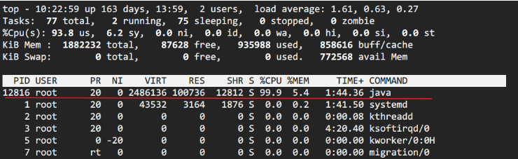
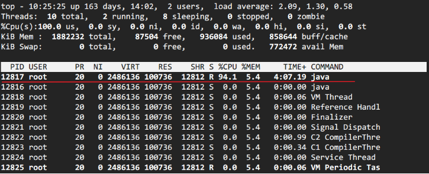
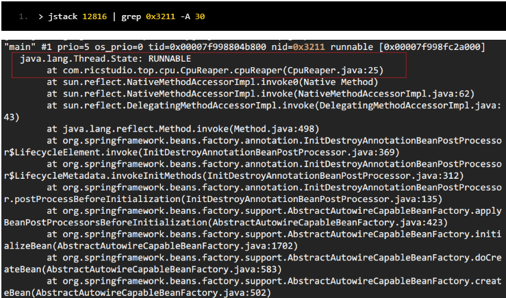
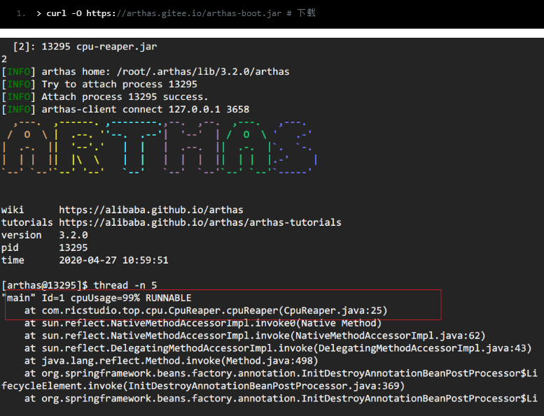
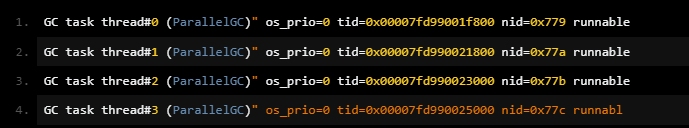
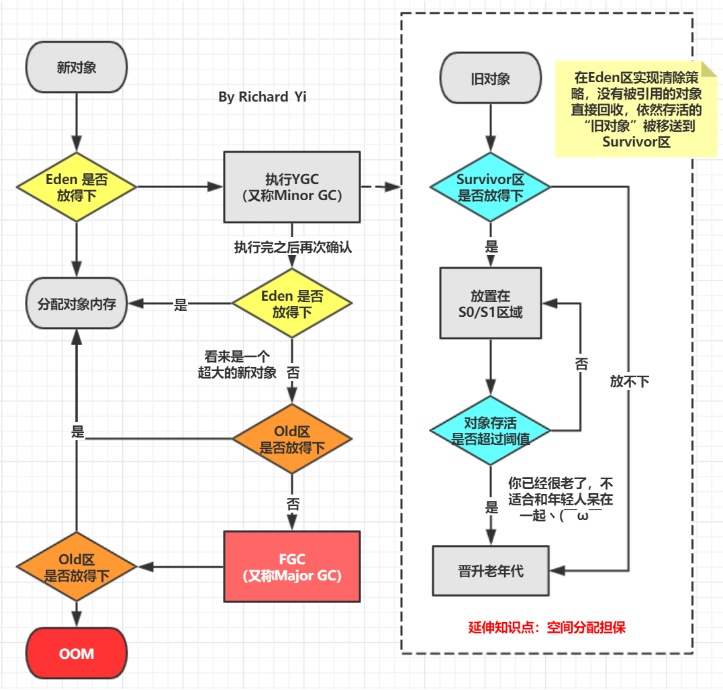
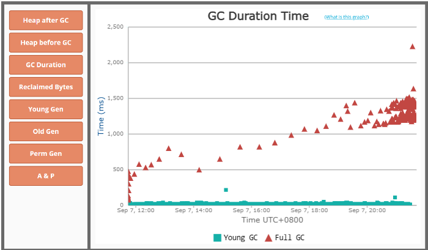
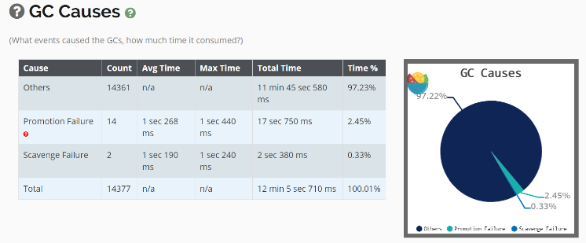
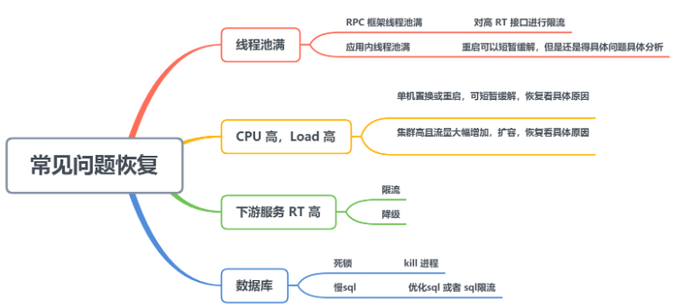

本文总结了一些常见的线上应急现象和对应排查步骤和工具


# 线上常见现象

## 一 CPU利用率高/飙升

常见原因：

- 频繁gc
- 死循环、线程阻塞、io wait等


方法1：

第一步：定位问题线程

1、`top`命令定位CPU最高的进程



2、`top -Hp pid` 定位使用CPU最高的线程



3、`printf '0x%x' tid` 线程id转化16进制

4、jstack pid | grep tid 找到线程堆栈




方法2：

阿里开源的[arthas](https://github.com/alibaba/arthas)现在已经几乎包揽了我们线上排查问题的工作，提供了一个很完整的工具集。在这个场景中，也只需要一个`thread -n`命令即可。




找出有问题的代码之后，观察到线程栈之后。就要根据具体问题来具体分析。

情况一：发现使用CPU最高的都是GC线程



情况二：发现使用CPU最高的是业务线程

- io wait：磁盘空间不够导致的io阻塞
- 等待内核锁，比如synchronized
  - `jstack -l pid | grep BLOCKED` 查看阻塞态线程堆栈
  - dump 线程栈，分析线程持锁情况。
  - arthas提供了`thread -b`，可以找出当前阻塞其他线程的线程。针对 synchronized 情况


## 二 频繁GC

回顾gc流程



查看gc 的具体情况：

- 查看gc日志
- jstat -gcutil 进程号 统计间隔毫秒 统计次数

获取到gc日志之后，可以上传到[GC easy](http://gceasy.io/)帮助分析，得到可视化的图表分析结果






gc原因及定位

- promotion failure：从S区晋升的对象在老年代也放不下导致 FullGC
  - 可能原因：s区太小，对象过早进入老年代：查看SurvivorRatio 参数
  - 大对象分配，没有足够内存：dump堆，profiler/MAT分析对象占用情况
  - old区存在大量对象：dump堆，profiler/MAT分析对象占用情况

也可以从full GC 的效果来推断问题，正常情况下，一次full GC应该会回收大量内存，所以 **正常的堆内存曲线应该是呈锯齿形**。如果你发现full gc 之后堆内存几乎没有下降，那么可以推断： **堆中有大量不能回收的对象且在不停膨胀，使堆的使用占比超过full GC的触发阈值，但又回收不掉，导致full GC一直执行。换句话来说，可能是内存泄露**

一般来说，GC相关的异常推断都需要涉及到**内存分析**，使用`jmap`之类的工具dump出内存快照（或者 Arthas的`heapdump`）命令，然后使用MAT、JProfiler、JVisualVM等可视化内存分析工具。


## 三 线程池异常

场景：业务监控突然告警，或者外部反馈提示大量请求执行失败

根据线程池原理分析：Java 线程池以有界队列的线程池为例，当新任务提交时，如果运行的线程少于 corePoolSize，则创建新线程来处理请求。如果正在运行的线程数等于 corePoolSize 时，则新任务被添加到队列中，直到队列满。当队列满了后，会继续开辟新线程来处理任务，但不超过 maximumPoolSize。当任务队列满了并且已开辟了最大线程数，此时又来了新任务，ThreadPoolExecutor 会拒绝服务


这种线程池异常，一般可以通过开发查看日志查出原因，有以下几种原因：

- **下游服务 响应时间（RT）过长**：这种情况有可能是因为下游服务异常导致的，作为消费者我们要设置合适的超时时间和熔断降级机制。另外针对这种情况，一般都要有对应的监控机制：比如日志监控、metrics监控告警等，不要等到目标用户感觉到异常，从外部反映进来问题才去看日志查
- **数据库慢 sql 或者数据库死锁**：查看日志中相关的关键词
- **Java 代码死锁**： `jstack –l pid | grep -i –E 'BLOCKED | deadlock'`


## 四 常见问题恢复




## 五 Arthas


## 六 涉及到的工具

- Arthas
- GC easy
- Linux top 命令
- Java
- MAT、JProfiler


# Java线程池误用引发的问题

问题场景：线上服务器不稳定。在高峰期，时常会有几台机器的内存持续飙升，并且无法回收，导致服务不可用。单台机器不可用，其流量会打到其他的机器，这样提高其他机器发生类似的情况的可能性，极端情况会引起所有服务宕机。

示例代码

```java
private static ExecutorService executor = Executors.newFixedThreadPool(15);
public static void push2Kafka(Object msg) {
    executor.execute(new WriteTask(msg,  false));    
}
```

代码功能是，每次线上调用把计算结果发给Kafka，Kafka消费方再继续后续的逻辑。内存被耗尽可能的原因是，因为使用了newFixedThreadPool线程池，其工作机制是固定N个线程，而提交给线程池的任务队列大小是不受限制的，如果Kafka发消息被阻塞或者变慢，那么队列里的任务会越来越多，导致内存被耗尽。

```java
//Executors.java
//默认实现中，任务队列使用的是LinkedBlockingQueue，LinkedBlockingQueue是无界队列
public static ExecutorService newFixedThreadPool(int nThreads) {
        return new ThreadPoolExecutor(nThreads, nThreads,
                                      0L, TimeUnit.MILLISECONDS,
                                      new LinkedBlockingQueue<Runnable>());
    }

//LinkedBlockingQueue.java
public LinkedBlockingQueue() {
        this(Integer.MAX_VALUE);
    }

```


最后的修复策略是使用了自定义的线程池参数，而非 Executors 默认实现解决了问题。

带着这个线上问题，再复习总结一下Java线程池以及参数


## 一 Java线程池

线程池就是一个有很多个线程构成的池子，来一个任务，就从池子中取一个线程来处理；线程池的好处：资源复用，减少创建和销毁带来的消耗，便于资源管理、监控等。

线程池的工作原理：

1. 用户提交任务
2. 先判断核心线程池是否满？没有满则创建线程执行任务
3. 如果核心线程池满了，再判断任务队列是否满？没有满则放入任务队列
4. 如果任务队列满了，再判断线程池是否满了，没有满则创建线程执行任务
5. 如果线程池满了，则按照策略处理无法执行的任务

重要参数：

- corePoolSize
- maximumPoolSize
- workQueue
- handler


## 二 可选择的阻塞队列BlockingQueue

主要有3种类型的阻塞队列

- 无界队列：LinkedBlockingQueue；使用该队列做为阻塞队列时要尤其当心，当任务耗时较长时可能会导致大量新任务在队列中堆积最终导致OOM。阅读代码发现，Executors.newFixedThreadPool 采用就是 LinkedBlockingQueue，当QPS很高，发送数据很大，大量的任务被添加到这个无界LinkedBlockingQueue 中，导致cpu和内存飙升服务器挂掉。
- 有界队列：常用的有两类，一类是遵循FIFO原则的队列如ArrayBlockingQueue与有界的LinkedBlockingQueue，另一类是优先级队列如PriorityBlockingQueue。
- 同步移交队列：SynchronousQueue


## 三 Java提供的四种常用线程池

Executors 工厂方法Executors.newCachedThreadPool() 提供了无界线程池，可以进行自动线程回收；Executors.newFixedThreadPool(int) 提供了固定大小线程池，内部使用无界队列；Executors.newSingleThreadExecutor() 提供了单个后台线程。

```java

//
public static ExecutorService newCachedThreadPool() {
        return new ThreadPoolExecutor(0, Integer.MAX_VALUE,
                                      60L, TimeUnit.SECONDS,
                                      new SynchronousQueue<Runnable>());
    }


//线程数量固定，使用无限大的队列
 public static ExecutorService newFixedThreadPool(int nThreads) {
        return new ThreadPoolExecutor(nThreads, nThreads,
                                      0L, TimeUnit.MILLISECONDS,
                                      new LinkedBlockingQueue<Runnable>());
 }

//创建一个定长线程池，支持定时及周期性任务执行
public static ScheduledExecutorService newScheduledThreadPool(int corePoolSize) {
        return new ScheduledThreadPoolExecutor(corePoolSize);
}

//DelayedWorkQueue是一个无界队列，它能按一定的顺序对工作队列中的元素进行排列
 public ScheduledThreadPoolExecutor(int corePoolSize) {
        super(corePoolSize, Integer.MAX_VALUE, 0, NANOSECONDS,
              new DelayedWorkQueue());
    } 

//创建一个单线程化的线程池，它只会用唯一的工作线程来执行任务，保证所有任务按照指定顺序(FIFO, LIFO, 优先级)执行
public static ScheduledExecutorService newSingleThreadScheduledExecutor() {
        return new DelegatedScheduledExecutorService
            (new ScheduledThreadPoolExecutor(1));
 } 

```

Alibaba命名规范的解释：

【强制】线程池不允许使用 Executors 去创建，而是通过 ThreadPoolExecutor的方式，这样 的处理方式让写的同学更加明确线程池的运行规则，规避资源耗尽的风险。 说明： Executors 返回的线程池对象的弊端如下： 1） FixedThreadPool 和 SingleThreadPool : 允许的请求队列长度为 Integer.MAX_VALUE ，可能会堆积大量的请求，从而导致 OOM 。 2） CachedThreadPool 和 ScheduledThreadPool : 允许的创建线程数量为 Integer.MAX_VALUE ，可能会创建大量的线程，从而导致 OOM 。

