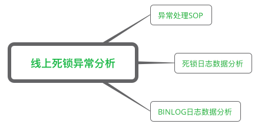
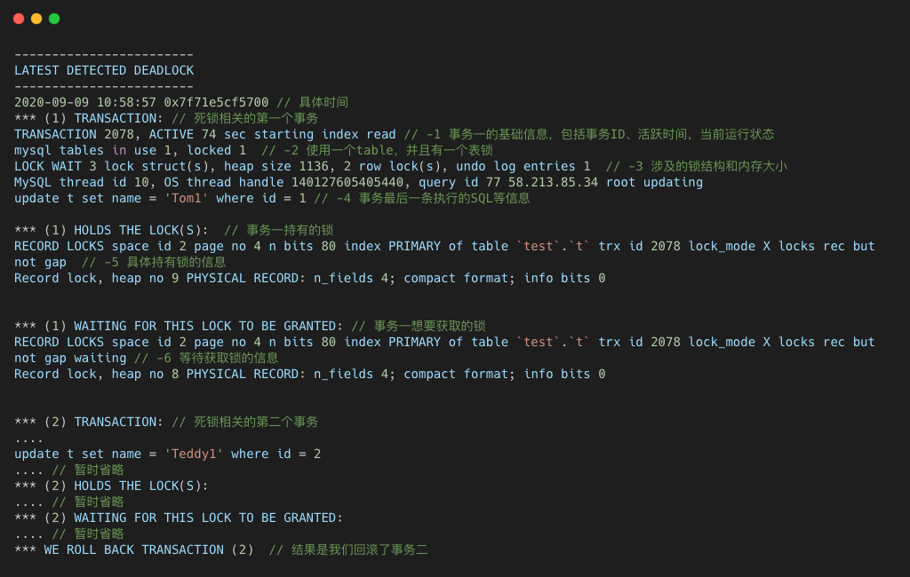
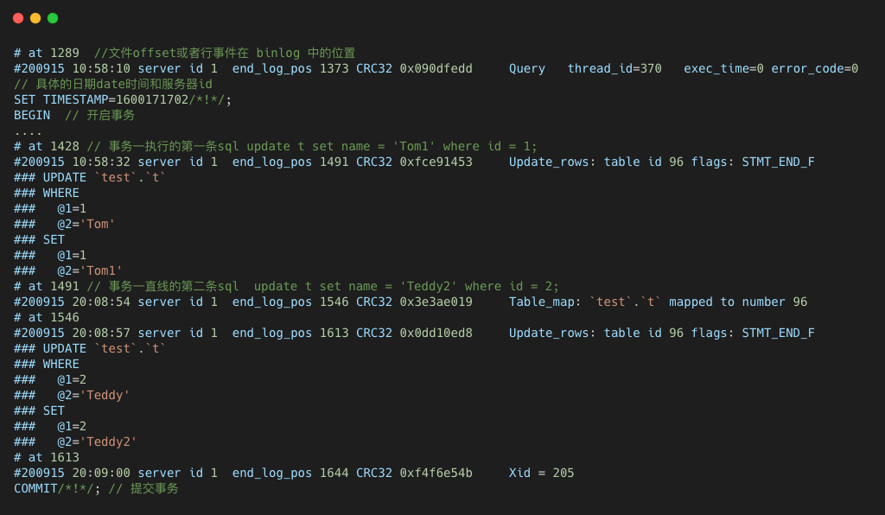
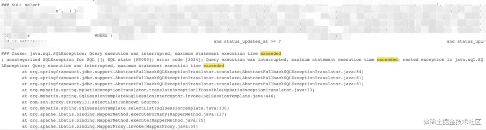
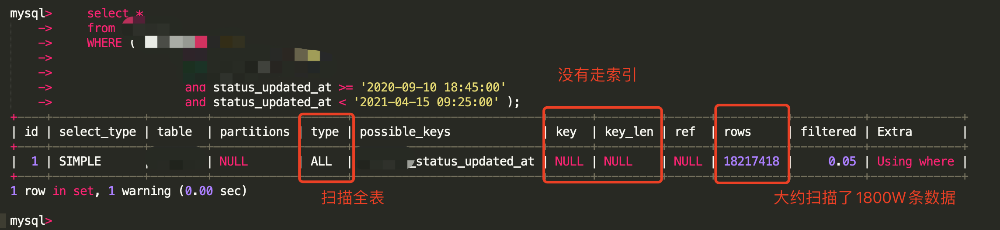

# MySQL死锁异常



## 排查处理

排查处理过程：

1. 线上错误日志报警发现死锁异常
2. 查看错误日志的堆栈信息
3. 查看 MySQL 死锁相关的日志
4. 根据 binlog 查看死锁相关事务的执行内容
5. 根据上述信息找出两个相互死锁的事务执行的 SQL 操作，根据本系列介绍的锁相关理论知识，进行分析推断死锁原因
6. 修改业务代码

**根据1，2步骤可以找到死锁异常时进行回滚事务的具体业务，也就能够找到该事务执行的 SQL 语句。然后我们需要通过 3，4步骤找到死锁异常时另外一个事务，也就是最终获得锁的事务所执行的 SQL 语句，然后再进行锁冲突相关的分析。**

重点说一下其中的第三四步骤，也就是如何查看死锁日志和 binlog 日志来找到死锁相关的 SQL 操作。


## 死锁日志的获取

发生死锁异常后，我们可以直接使用 `show engine innodb status` 命令获取死锁信息，但是该命令只能获取最近一次的死锁信息。所以，我们可以通过开启 InnoDB 的监控机制来获取实时的死锁信息，它会周期性（每隔 15 秒）打印 InnoDb 的运行状态到 mysqld 服务的错误日志文件中。

InnoDb 的监控较为重要的有标准监控（Standard InnoDB Monitor）和 锁监控（InnoDB Lock Monitor），通过对应的系统参数可以将其开启。MySQL 提供了一个系统参数 `innodb_print_all_deadlocks` 专门用于记录死锁日志，当发生死锁时，死锁日志会记录到 MySQL 的错误日志文件中。

```mysql
-- 开启标准监控
set GLOBAL innodb_status_output=ON;
-- 关闭标准监控
set GLOBAL innodb_status_output=OFF;
-- 开启锁监控
set GLOBAL innodb_status_output_locks=ON;
-- 关闭锁监控
set GLOBAL innodb_status_output_locks=OFF;


set GLOBAL innodb_print_all_deadlocks=ON;
```


## 死锁日志的分析



该日志会列出死锁发生的时间，死锁相关的事务，并显示出两个事务(可惜，多事务发生死锁时，也只显示两个事务)在**发生死锁时执行的 SQL 语句、持有或等待的锁信息和最终回滚的事务**

```mysql
TRANSACTION 2078, ACTIVE 74 sec starting index read // -1 事务一的基础信息，包括事务ID、活跃时间，当前运行状态
```

 ACTIVE 74 sec 表示事务活动时间，starting index read 为事务当前正在运行的状态，可能的事务状态有：fetching rows，updating，deleting，inserting, starting index read 等状态。

```mysql
mysql tables in use 1, locked 1  // -2 使用一个table，并且有一个表锁
LOCK WAIT 3 lock struct(s), heap size 1136, 2 row lock(s), undo log entries 1  // -3 涉及的锁结构和内存大小 
```

tables in use 1 表示有一个表被使用，locked 1 表示有一个表锁。LOCK WAIT 表示事务正在等待锁，3 lock struct(s) 表示该事务的锁链表的长度为 3，每个链表节点代表该事务持有的一个锁结构，包括表锁，记录锁或 autoinc 锁等。heap size 1136 为事务分配的锁堆内存大小。

2 row lock(s) 表示当前事务持有的行锁个数，通过遍历上面提到的 11 个锁结构，找出其中类型为 LOCK_REC 的记录数。undo log entries 1 表示当前事务有 1 个 undo log 记录，说明该事务已经更新了 1条记录。

下面就是死锁日志中最为重要的持有或者待获取锁信息，如图中-5和-6行所示，**通过它可以分析锁的具体类型和涉及的表，这些信息能辅助你按照系列文章的锁相关的知识来分析 SQL 的锁冲突**

```mysql
RECORD LOCKS space id 2 page no 4 n bits 80 index PRIMARY of table `test`.`t` trx id 2078 lock_mode X locks rec but not gap  // -5 具体持有锁的信息
RECORD LOCKS space id 2 page no 4 n bits 80 index PRIMARY of table `test`.`t` trx id 2078 lock_mode X locks rec but not gap waiting // -6 等待获取锁的信息
```

InnoDB中有四种行锁：记录锁，间隙锁，Next-key 锁和插入意向锁。这四种锁对应的死锁日志各不相同，如下：

- 记录锁（LOCK_REC_NOT_GAP）: lock_mode X locks rec but not gap
- 间隙锁（LOCK_GAP）: lock_mode X locks gap before rec
- Next-key 锁（LOCK_ORNIDARY）: lock_mode X
- 插入意向锁（LOCK_INSERT_INTENTION）: lock_mode X locks gap before rec insert intention

所以，按照死锁日志，我们发现事务一持有了 test.t 表上的记录锁，并且等待另一个记录锁。

通过死锁日志，我们可以找到最终获得锁事务最后执行的 SQL，但是如果该事务执行了多条 SQL，这些信息就可能不够用的啦，我们需要完整的了解该事务所有执行的 SQL语句。这时，我们就需要从 binlog 日志中获取。


## binlog的获取和分析

**binlog 日志会完整记录事务执行的所有 SQL，借助它，我们就能找到最终获取锁事务所执行的全部 SQL。**然后再进行具体的锁冲突分析。

我们可以使用 MySQL 的[命令行工具](https://cloud.tencent.com/product/cli?from=10680) `Mysqlbinlog` 远程获取线上数据库的 binlog 日志。具体命令如下所示：

```mysql
Mysqlbinlog -h127.0.0.1 -u root -p --read-from-remote-server binlog.000001 --base64-output=decode-rows -v
```

其中 `--base64-output=decode-rows` 表示 row 模式 binlog日志，所以该方法只适用于 row 模式的 binlog日志，但是目前主流 MySQL [运维](https://cloud.tencent.com/solution/operation?from=10680)也都是把 binlog 日志设置为 row 模式，所以这点限制也就无伤大雅。`-v` 则表示将行事件重构成被注释掉的伪SQL语句。

我们可以**通过死锁日志中死锁发生的具体事件和最终获取锁事务正在执行的SQL的参数信息找到 binlog 中该事务的对应信息**，比如我们可以直接通过死锁日志截图中的具体的时间 10点57分和 Tom1、Teddy2 等 SQL 的具体数据信息在 binlog 找到对应的位置，具体如下图所示。



根据 binlog 的具体信息，我们可以清晰的找到最终获取锁事务所执行的所有 SQL 语句，也就能找到其对应的业务代码，接下来我们就能进行具体的锁冲突分析。


## 排查思路总结

使用InnoDB的监控机制，获取死锁日志。

死锁日志分析，锁类型、涉及到的事务信息、SQL语句

从BinLog中获取死锁发生涉及到事务，SQL语句，找到对应的业务代码，进行分析锁冲突


# MySQL查询超时问题




## 排查过程

1、使用Explain工具分析SQL语句是否走了索引，如果SQL语句是慢查询，那么需要优化SQL，如果不是说有其他原因导致了查询超时。

2、导致查询超时的原因有：

- MySQL资源竞争：分析监控系统的MySQL运行信息（连接数、CPU等）；分析UPDATE操作有没有走索引，没有走索引会导致行锁升级成表锁
- 数据库备份
- 网络


3、SQL日志记录里面的时区都是标准时区的，而那个任务执行的时候是北京时间，导致找慢SQL时找错了



从日志上面可以看到，查询的日期区间从2020年9月到2021年4月，时间跨度7个月。MySQL成本计算的时候认为区间太大，走索引还不如直接扫描全表，最终没有走索引扫描了1800W条数据。

说好的时间区间最多七天呢？怎么变成了七个月？

赶紧定位代码，定位发现底层在取时间区间时，调了一个RPC接口，这个接口预期返回的时间区间只有几天，结果返回了七个月的时间区间。这段逻辑是18年上线的。

于是联系提供这个RPC接口的相关人员，通过查找验证确定这是底层数据的问题，应该返回几天结果返回了几个月。

再回顾一下，还有几个问题需要回答一下：

不走索引，那为什么六点多执行就没有超时呢？

原因就是六点基本上没有业务在调用MySQL，那个时候的MySQL的资源是非常充足的，加上MySQL的机器也配置非常的高，所以这条SQL硬生生跑成功了。听起来有点离谱，但确实是这样的。

为什么这个BUG在线上这么久了，现在才发现？

这个时间区间底层数据用的不多，目前只发现只有这个超时SQL任务在调用。

原来业务量没有这么大，加上机器配置高，扫描整个表也花不了多久时间。凌晨五六点执行，没有对线上的服务造成影响。

任务失败是很正常的，因为还依赖一些其他数据，其他数据提供的时间不确定，所以任务会一直跑直到成功。


排查思路总结：

对于MySQL查询超时有以下几个原因：

- 慢查询：使用Explain去分析SQL
- MySQL资源竞争
- 数据库备份
- 网络


# MySQL 可重复读

## 场景

现有一个交易系统，每次产生交易都会更新相应账户的余额，出账扣减余额，入账增加余额。

为了保证资金安全，余额发生扣减时，需要比较现有余额与扣减金额大小，若扣减金额大于现有余额，扣减余额不足，扣减失败。

账户表：

```mysql
CREATE TABLE `account`
(
    `id`      bigint(20) NOT NULL,
    `balance` bigint(20) DEFAULT NULL,
    PRIMARY KEY (`id`)

) ENGINE = InnoDB
  DEFAULT CHARSET = utf8mb4
  COLLATE = utf8mb4_bin;
```

扣减余额时，sql 语序如下所示：


上面的 SQL 语序看起来没有什么问题吧，实际也是这样的，账户系统已经在生产运行很久，没出现什么问题。但是这里需要说一个前提，**系统数据库是 Oracle** 。

但是从上面表结构，可以得知此次数据库被切换成 MySQL，系统其他任何代码以及配置都不修改（sql 存在小改动）。

就是这种情况下，并发执行发生余额多扣，即实际余额明明小于扣减金额，但是却做了余额更新操作，最后导致余额变成了负数。


## 问题复现

假数据库使用的是 MySQL，**默认事务隔离等级，即 RR**。数据库记录为 id=1 balance=1000，假设只有当时只有这两个事务在执行，执行顺序如图所示。


事务隔离等级**RR** 下的答案。

事务 1 的查询结果为：

- **t2 (1,1000)**
- **t4 (1,1000)**
- **t6 (1,1000)**

事务 2 的查询结果为：

- **t3 (1,1000)**
- **t5 (1,900)**
- **t11 (1,1000)**


事务隔离等级**RC** 下的答案。

事务 1 的查询结果为：

- **t2 (1,1000)**
- **t4 (1,1000)**
- **t6 (1,1000)**

事务 2 的查询结果为：

- **t3 (1,1000)**
- **t5 (1,900)**
- **t11 (1,900)**


问题分析


事务隔离级别为 RR，t2，t3 时刻两个事务由于查询语句，分别建立了一致性视图。

t4 时刻，由于事务 1 使用 `select.. for update` 为 id=1 这一行上了一把锁，然后获取到最新结果。而 t5 时刻，由于该行已被上锁，事务 2 必须等待事务 1 释放锁才能继续执行。

t6 时刻根据一致性视图，不能读取到其他事务提交的版本，所以数据没变。t8 时刻余额扣减 100，t9 时刻提交事务。

此时最新版本记录为 **id=1 balance=900**。

由于事务 1 事务已提交，行锁被释放，t5 成功获取到锁。由于 t5 是当前读（select .... for update/ in share mode 这类加锁查询只会查询当前记录最新版本数据，这种查询称为当前读），所以查询的结果为最新版本数据（1,900）。

**重点来了**，当前这条记录的最新版本数据为 **（1,900）**，但是最新版本事务 id，却是事务 2 创建之后未提交的事务，位于活跃事务数组中。所以最新记录版本对于事务 2 是不可见的。

没办法只能根据 undolog 去读取上一版本记录 **(1,1000)** ，这个版本记录刚好对于事务 2 可见，所以 t11 的记录为 **(1,1000)**。

而当我们将**事务隔离等级修改成 RC**，每次都会重新生成一致性视图。所以 t11 时刻重新生成了一致性视图，这时候事务 1 已提交，当前最新版本的记录对于事务 2 可见，所以 t11 的结果将会变为 **（1,900）**。

MySQL 默认事务隔离等级为 RR，每一行数据（InnoDB）的都可以有多个版本，而每个版本都有独一的事务 id。


MySQL 通过一致性视图确保数据版本的可见性，相关规则总结如下：

- 对于 RR 事务隔离等级，普通查询仅能查到事务启动前就已经提交完成的版本数据。
- 对于 RC 事务隔离等级，普通查询可以查到查询语句启动前就已经提交完成的版本数据。
- 当前读总是读取最新版本的数据。


# 慢查询

一般慢查询都是索引没有正确使用导致的

## explain分析

explain是排查慢sql的一种最常用的手段


**id**：表示select子句或者操作的顺序

- id相同：执行顺序自上而下
- id不同：id值越大优先级越高，越先被执行

select_type：主要是区分普通查询、联合查询、子查询等。

- SIMPLE：简单的select查询，不包含子查询与union
- PRIMARY：查询中包含复杂的子部分，最外层会被标记为primary
- SUBQUERY：在select或者where列表中包含了子查询
- DERIVED：在from列表中包含的子查询衍生表
- UNION：若第二个select出现在union之后，则被标记为union
- UNION RESESULT：从union表获取结果的select

**table**：这一行数据是哪个表的数据

**type**：查询中使用了何种类型

**结果值从最好到最坏：system>const>eq_ref>ref>fulltext>ref_or_null>index_merge>unique_subquery>index_subquery>range>index>all**

- 一般来说，得保证查询至少达到range级别，最好能到达ref
- system：表只有一行记录（等于系统表），这是const类型的特例，平时不会出现
- const：表示通过索引一次就能够找到
- eq_ref:唯一性索引扫描，对于每个索引键，表示只有一条记录与之匹配，常见于主键或唯一索引扫描
- ref：非唯一性索引扫描，返回匹配某个单独值的所有行
- range：只检索给定范围的行，使用一个索引来选择行，一般就是在where语句中出现了between、<、>、in等的查询
- index：index比all快，因为index是从索引中读取，all是从硬盘中读取
- all：遍历全表才能找到

**possible_key**：显示可能应用在这张表中的索引，但实际上不一定用到

key：实际上使用的索引，如果没有则为null

**key_len**：表示索引中使用的字节数（可能使用的，不是实际的），可通过该列查询中使用的索引的长度，在不损失精确性的情况下，长度越短越好

**ref**：显示索引的哪一列被用到，如果可能的话是一个常数，哪些常量被用于查找索引列上的值

rows：大致估算找出所需的记录要读取的行数

**Extra**：包含不适合在其他列中显示，但十分重要的的额外信息

- Using filesort 说明mysql会对数据使用一个外部的索引排序，而不是按照表内的索引顺序进行读取，mysql中无法利用索引完成的排序成为文件排序
- Using temporary 使了用临时表保存中间结果，mysql在对查询结果排序时使用了临时表，常见于排序order by 和分组查询group by
- Using index 表示相应的select操作中使用了覆盖索引，避免访问了表的数据行，效率高
- Using where 表明使用了where进行过滤
- Using join buffer 使用了连接缓存

**索引失效**

- 应该尽量全值匹配
- 复合最佳左前缀法则（**第一个索引不能掉，中间不能断开**）
- 不在索引列上做任何操作（计算、函数、类型转换）会导致索引失效而转向全表扫描
- 存储存引擎不能使用索引中范围条件右边的列
- 尽量使用覆盖索引（只访问索引的查询（索引列和查询列一致）），减少`select*`
- mysql在使用不等于(!=或者<>)的时候无法使用索引会导致全表扫描
- is null，is not null也会无法使用索引
- like以统配符开头
- 字符串不加单引号
- 少用or

**order by优化**

- 避免filesort，尽量在索引上进行排序，遵照最佳左前缀原则


## 案例分析

## 案例一

```mysql
select * from goods_info where goods_status = ? and id in(11,22,33......)
```

in中id数量较多，导致查询的数据量比较大，这是一个比较常见的慢查询，并且数量比较小时查询速度还不是比较慢，难以发现。

参数传入的是一个List集合，当参数比较多时，可以在业务层把List集合拆分为多个长度比较小的集合，分多次查询，具体拆分长度，根据业务需要和数据量进行评估。

**解决办法**：业务代码增加拆分集合操作，`LIMIT_SIZE`设置为1000

```java
List<List<Integer>> partitionGoodsIdList = Lists.partition(goodsIdList, LIMIT_SIZE);
```

