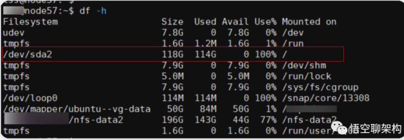

# 磁盘占用率100%

首先查看磁盘使用的情况

第一个命令是`df -h`，来查看磁盘的占用情况



- Filesystem代表文件系统名称
- Size表示文件系统大小
- Used表示已使用空间大小
- Avail表示可用空间大小
- Use表示磁盘使用率
- Mounted on表示挂载在哪个目录下


查看目录下的大文件

使用`du`命令显示目录或文件所占用的磁盘空间大小

```shell
# 先进入到根目录 `/`
cd /
# 列出当前目录或文件的总大小，并按倒叙排序
du -sh /* | sort -nr
```

找到最大的目录，进入到目录中继续执行上述命令。这样一级一级找就能找到占用空间最大的文件了。

找到目标文件，则分析原因。