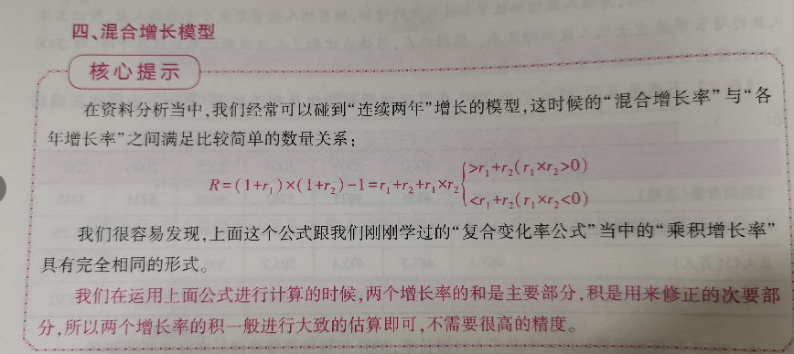
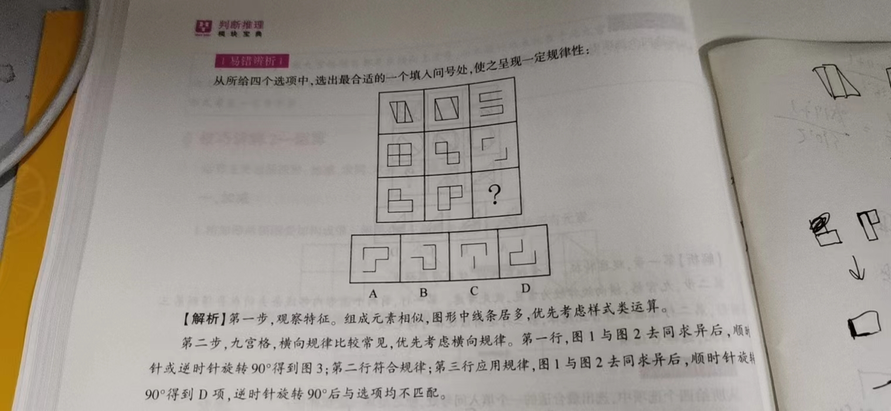
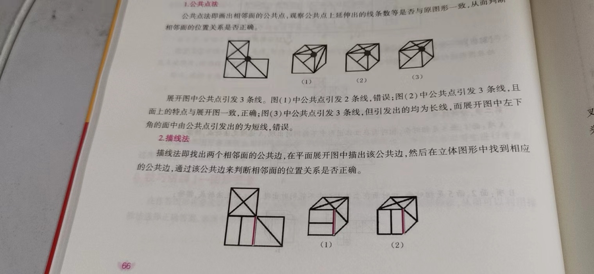

# 资料分析

## 引言

主要考察**文字、数字、图表**等统计性资料的综合理解与分析加工能力，需要掌握相应的**“速算”和“巧算”**。

### 题型

图形型材料

表格型材料

文字型材料

### 做题顺序

1. 先看清除材料的数据存储结构
2. 具体做题，定位题目所需数据和信息
3. 分析、加工，得到答案

## 统计术语

### 统计统计术语

#### 增长率

增长量=现期量-基期量

增长率=增幅=增速=增长量/基期量=（现期量-基期量）/基期量=现期量/基期量  -  1

“增长了多少倍”or“比……多多少倍”也是运用和“增长率”一样的公式

**如：2016年贸易顺差是2006年的5.8倍，那么说明2016年比2006年增长了5.8-1=4.8倍，增长率为480%**

**如果A超过了B的3倍，说明A>3B，不是说A比B多3倍（以上），后者表示为（A-B）/B >=3，即A>=4B，“A达到或超过了B的4倍”**

ps：增长率、增速、增幅是有正负符号的，比较时带上符号

#### 发展速度

发展速度=末期量/基期量=1+增长速度

#### 拉动增长

如果B是A的一部分，B拉动A增长了x%，那么x%=B的增长量/A的基期量

#### 增长贡献率

某部分的增长贡献率=该部分的增量/总量的增量

#### 平均增长率

某个量初期为A，经过N期之后变为B，平均增长率为x%，那么：

A*（1+x%）^N = B

#### 平均增长量

某个量初期为A，经过N期之后变为B，平均增长量为x

A+x*N=B

ps：平均增长率/量的计算，一般不包括第一年的增长。除非题目明确：“2005-2009五年的平均增长率/量”，就应该以2008年的数值为基期量；“十二五期间（2011-2015）的年均增长，基期量时2010

#### 百分数、百分点

n个百分点，代表n%

#### 同比增长/环比增长

同比：与上一年的同一时期相比的增长速度

环比：与紧紧相邻的上一期相比的增长速度

现期为2014年4月，同比增长指2013年4月的增长，环比指相对2014年3月的增长；2014年1月，其环比增长指相对2013年12月的增长

#### 翻番

翻番，变为原来的2倍

翻n番，变为原来的2的n次方倍

#### 累计数额

一般以月份或季度来计算，指当年葱年初到该月份或该嫉妒的总数额

#### 指数

指数：现期指数：现期数值=100：基期数值

#### GDP、GNP

国内生产总值

国民生产总值

#### 贸易顺差、贸易逆差

顺差：出口商品额大于进口商品额

逆差：反过来

#### 基尼系数、恩格尔系数

基尼系数：代表人民收入差距的常用指标。范围0到1，越大表示不平等程度越高

恩格尔系数：比例越低，人民生活水平越高

#### 五年计划

记住一两个关键的，其他可以推

”十四五“   2021-2025

“十三五”就是从2020往回数5年，即2020、2019、2018、2017、2016

”十五“   2001-2005

#### 三大产业

第一：农业、林业、畜牧业、渔业

第二：采矿业、制造业、建筑业、电力、热力、燃气等

第三：除了第一、第二产业，一般称服务业

### 结构阅读

核心：快速定位数据

文字型：找中心词、关键词

表格型：重点看横纵项目

饼图：看周围一圈的类别名称

网状图：学会计算比例

### 核心要素

1. 时间表述
   1. 选项和材料中的时间范围不匹配，“月、季度、半年”
2. 单位表述
   1. 选项和材料中的数据单位不匹配，“百人、千、百万、十亿、千亿”
3. 特殊表述
   1. 增长最多：增长的绝对量最大
   2. 增长最快：增长率最大
   3. 减少最多，减少最快同理
   4. 增长最低，默认指增长率最低

## 速算技巧

### 图形法

主要利用图形自身的性质，通过目测得到宝贵信息

- 柱状图、趋势图中数据大小通过“柱”的长短或“点”的高低来判定 
- 柱状图、趋势图中数据增减通过“柱”或“点”的高低变化来判定
- 饼图通过扇形大小来判定

技巧：

- 在趋势图中，斜率代表的是“增长量”。如果图形是一条直线，说明**增长量不变**，但是**增长率是变的**
  - 直线上升，增长量不变，增长率减小
  - 直线下降，增长量不变，增长率绝对值增大

### 估算法

#### 估算模型

##### 增长比较

##### 增长率逆推

逆推基期量

##### 十字交叉法

两个部分与整体的“增长率”

##### 直除法

适用于

- 比较型：比较分数大小时，若量级相当，直接计算
- 计算型：计算分数大小时，若选项首位各不相同，通过计算首位锁定答案

ps：在做直除时，通常会将除数进行四舍五入

- 通常取除数前三位或两位进行计算
- 简化被除数不会简化计算难度

##### 放缩法

关于增长的放缩

##### 复变法

两个变量分别发生一定的变化，它们的**乘积**以及**比值**会发生什么变化

###### 相对变化复变法

计算**乘积**和**比值**的增长率（相对）

###### 绝对变化复变法

求**比值**的绝对变化率

###### 同向变化模型

###### 混合增长

如果某个量依次增加和减少相同的比率（不论顺序），最后结果相对最初肯定减少了。即**同增同减，最后降低**

### 进阶速算

#### 截位法

##### 加减：高位竖式

在资料分析中，高位往往远比低位重要，因此需要学习使用竖式进行高位加减法运算

高位竖式：直接**从左边高位开始**相加减，同时注意下一位是否需要进位或借位，直到得到选项要求的精度

##### 加减：四舍五入

##### 加减：参照截位

##### 乘除：忽略不计

##### 乘除：直除分母

分母截取前三位或前两位

##### 乘除：特殊分数

特殊分数在插值法中

#### 插值法

在计算数值或者比较数值时，运用中间值进行参照

技巧：

1. 发现选项中存在首两位数大于小于25的情况，应该联想到1/4，直接判断其与1/4的大小
2. 根据选项中的数据，挑选合适的值反算结果验证题设
   
3. 要比较a/b与1/N的大小关系时，只需要比较a*N与b的大小
   

#### 化同法

比较分数大小时，将两个分数的分子或分母化为相近的数

适用于：某个分数的分子分母远小于另一个分数的分子分母（10倍或以上）；某个分数的分子分母小于另一个分数的分子分母，并且两个分数的分子或分母存在明显倍数关系

#### 差分法

#### 增长法

##### 各年增长率

 

##### 混合增长率

##### 翻番近似公式

##### 三角上溯模型

#### 修正法

##### 绝对误差与相对误差

比如真实值尾10，估算值为11，那么：

绝对误差=11-10=1

相对误差=（11-10）/10=10%

在速算中需要遵循的基本原则：

加减运算考虑**绝对误差**

乘除运算考虑**相对误差**

## 重点题型

### 表格型材料

要点：横标目和纵标目锁定信息

# 判断推理

## 图形推理

思路：先整体后部分；常规规律优于罕见规律

### 规律推理类

类型：一条式、两段式、九宫格、分组分类

依据：

- 文字开口方向

- 均由曲线构成
- 形状

- 面数

### 重构推理类

#### 空间重构

拆纸盒

立体拼合：多个立体图形拼合成一个整体

#### 立体视图

#### 截面图

### 数量类

图形特征：数量类图形推理体现在图形中得某种元素**以数字的某种规律**发生了变化，或是某种元素在数字上有共同特征

数字规律：常考的两类，**数列**和**运算**

- 数列：等差数列，等比数列，对称数列，周期数列，乱序数列
- 运算：一般是加减乘除的运算

#### 技巧一——点

主要考察**交点**和**端点**（出头点），常见规律：内交点个数、内外交点个数（和或差）

#### 技巧二——线

直线、曲线、直线+曲线

线的数量类考点：

- 直线数量，直线是指方向没有改变的线条，若方向改变，则算另一条
- 曲线数量，平滑变化的线条，如果出现明显拐点，则算另外一条
- 总线条数，考察直线或曲线各自的数量，或者数量之和
- 笔画数，考察一笔画和多笔画，一笔画图形即不抬笔，不回笔，能够一笔化成的图形。
  - 一笔画的满足条件。一必须为连通图，图像事一个整体，没有断开部分。如“日”是连通图，“回”不是。二奇点数为0或2，奇点即一个引发出奇数条线的点（端点是奇点）。
    

#### 技巧三——角

定义：两条有公共端点的射线组成的几何对象

考点：角的**个数**和**度数**

根据角在图形中的位置，分为**内角**和**外角**，图形内部为内角。当图形有内外之分时一般数内角，无内外之分时，优先数全部的角

#### 技巧四——面

考察：**封闭空间数**和**面积**。封闭空间如“口”有一个，“日”有两个

#### 技巧五——元素

考察元素的变化：**个数变化**和**种类变化**

元素个数：一幅图由几个断开的部分组成

元素种类：指一幅图由集中小图形组成，小图形可能是断开的，也可能是连通的

### 位置类

考点：**动态位置**、**静态位置**

动态位置规律图形特征：**组成元素相同**，考查的为图形在整体或局部元素位置上的变化

静态位置图形特征：两个或多个图形之间存在**明显的结构共性**。考查的主要是图形内部元素之间的**相对位置关系**，如相交、相离

### 样式类

样式类图推的共性为：**图形相似** 。考点包括：**遍历**和**运算**

#### 技巧一——遍历

遍历即途中每个图形都要经历一遍

题目特点：元素种类和数量一致，排列组合次序不一致。

解题技巧：缺啥补啥。

#### 技巧二——运算

运算包括：加减、求同、求异、定义叠加

加减：相加即两幅图**叠加**构成，第三幅图包好前两幅图的所有元素；相减即两图减去相同的部分，构成第三副图

求同：包括去异求同、整体求同和相邻求同

- 去异求同：两幅图**去掉不同部分，保留相同部分**，构成第三幅图
- 整体求同即图形**共同拥有相似或相同元素**
- 相邻求同即**相邻图形含有相似或相同的元素**

求异：两幅图**去掉相同的部分，保留不同部分**

#### 技巧三——定义叠加

 定义叠加指图像**依据一定的规则**进行运算，此规则需要根据题干已知图形提取

特征：**外部轮廓相同，内部填充不同**

### 属性类

常见的图形属性包括**对称性、曲直性、封闭开放性**

对称性：轴对称、中心对称，考察轴对称图形的**对称轴方向、个数变化、对称轴与图形间的位置关系**

### 功能类

特征：**某些元素频繁出现在每幅图中**

掌握：功能元素的类型和功能元素的标定作用

#### 技巧一——标定功能

指功能元素（**点、线、箭头、其他元素**）标定了图形的某些特征，如**方位、线的长短、面积大小或者曲直线**等

类别：

- 功能元素在图形外部
- 功能元素在图形上
- 功能元素在图形内部

#### 技巧二——指示功能

指示不同的**角、图形、方向**

### 立体重构类

图形折叠、图形拆分重组、图形拼合

#### 技巧一——图形折叠

##### 相对面

立体图形的侧视图中，只能看到三个面且为相邻面，**相对面不可能同时出现在一个侧视图中，每组相对面只能看到其中一个面**

##### 相邻面

相邻面是立体图形中存在公共点或公共边的多个面。

四种方法：**公共点法，描线法，箭头法，移面法**

#### 技巧二+立体拼合

在差分重组中，可以利用**时针法**排除选项，在同一平面内的平移、旋转补改变时针方向，翻转会改变时针方向

### 视图类

#### 技巧一——三视图

分析视图的规则：

- 长对正：主视图和俯视图的长相等
- 高平齐：主视图和侧视图的高相等
- 宽相等：侧视图和俯视图的宽相等

#### 技巧二——截面图

## 定义判断

### 概述

定义判断在具体的题型中，表现为**“定义+选项”**的形式考查

定义的不同形式：

- 单定义：给出一个概念的定义，要求根据已给出的定义，选出答案
- 多定义：给出两个及以上的概念定义，要求根据已给出的定义，选出答案

选项的不同形式：文字、图形

#### 技巧一——关键信息法

关键信息：**主客体、限定词、表原因、结果、目的、条件的关键词**等

### 单定义判断

#### 技巧一——肯定型与否定型

#### 技巧二——相关型

### 多定义判断

#### 技巧一——并列定义

 

#### 技巧二——包含定义

定义项对A概念解释时包含了B概念，后面又对B概念进行了解释

#### 技巧三——匹配定义

题干中给处多个定义，同时给出多个例证，问符合定义的个数或者哪个例证符合哪个定义

## 类比推理

### 概述

两词型： M：N

三词型：W：H：Q

填空型：（）对于X    相对于    Y对于（）

解题关键：准确判断给定条件间的**逻辑关系**，如**主谓关系、动宾关系、偏正关系、并列关系**等

解题原则：择优选择原则、位置一致原则

### 内涵关系

内涵就是词语的概念内容，如“手机”的主要功能是通讯。

主要考查**对应关系、属性关系、条件关系**。

### 对应关系

### 属性关系

属性分为必然属性和或然属性，必然属性就是某一类事物必然具有某种属性，如“雪”与“白”；或然属性就是某一类事物可能具有某种属性

### 条件关系

条件关系包括充分条件关系和必要条件关系

充分条件：条件存在，结果一定存在。即P一定Q，P是Q的充分条件

必要条件：条件不存在，结果一定不存在。没有Q就没有P，Q是P的必要条件

### 外延关系

外延条件指两个或多个概念在范围上的关系。如“香蕉”和“水果”。外延关系主要考查**全同关系、包容关系、交叉关系和并列关系**。

全同关系：就是一个指代的是一个事物，解雇和炒鱿鱼，电子邮件和伊妹儿，犬子和令郎，买单和结账

包容关系：a是b的一种；a是b的一部分

交叉关系：有的a是b，有的b是a，有的a不是b，有的b不是a

并列关系：矛盾关系和反对关系，矛盾关系指除了A就是B，除了B就是A；反对关系指除了A还有B、C、D

### 语义关系

近义词、反义词、比喻、象征等

## 逻辑判断

